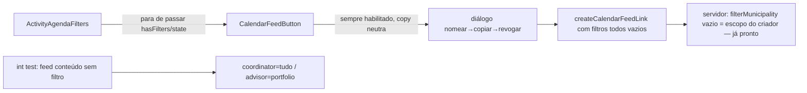

# Impl: C93 — Gerar link de import sem filtros (agenda completa do escopo)

Status: aprovado
Atualizado em: 2026-08-09
Issue: #437
Intenção: docs/plans/c93-gerar-link-import-sem-filtros.md
Appetite restante: ~0,5 dia eng (herdado; entrega menor que o appetite)

## Leitura da intenção

- **Outcome:** com **nenhum filtro ativo**, o botão "Link de import" permite gerar o link; o feed sem filtro cobre a agenda completa **dentro do escopo de leitura do criador** (coordinator/candidate = tudo; advisor = municípios administrados); revogar/listar e o endpoint de leitura seguem fail-closed (invariante de C16).
- **O que NÃO negociar:** fail-closed no read do feed (segredo não vaza / criador desativado → para de servir); escopo do criador preservado no feed "sem filtro" (não é backdoor); líder lockdown; sem PII/Consent novo; revogação intacta.
- **O que reavaliar:** a hipótese da intenção ("construir feed sem filtros = só o escopo do criador" em `calendarFeed.ts`/action). **Explorando o código, o servidor já cobre o caso sem filtro por inteiro** — o único bloqueio real é o gate de UI `hasFilters → disabled`. Isso muda o formato da entrega: unlock de UI + testes que provam o aceite de conteúdo (que hoje não existem), sem tocar schema/server.

## Abordagem recomendada

**Opções consideradas:**

- **A. Unlock de UI + testes de conteúdo (recomendada):** remover o gate `hasFilters` e o prop morto `state` de `CalendarFeedButton`; manter `hasFilters` apenas para o botão "Limpar filtros"; ajustar copy neutra no diálogo; adicionar int tests (feed sem filtro respeita o escopo do criador) e um unit component test (botão habilitado sem filtros).
- **B. Médio:** como A, mas sem remover o prop `state` de `CalendarFeedButton` (mantendo `_state` morto "para o C94"). Deixa código morto num arquivo que já estamos editando.
- **C. Servidor explícito ("all" marker):** adicionar uma flag/breakpoint no schema/action tipo `scope: 'all'` para "sem filtro". Internet do work: o vazio **já significa** "tudo no escopo" (descrição do campo `filterMunicipality` na collection + `buildFeedWhere`/`resolveFeedCreatorAccess`); inventar uma representação paralela é adicionar superfície sem ganho.

**Recomendação: A** — porque mantém o outcome da intenção com a menor superfície: o servidor já está pronto (decisão de C16), o bloqueio é puramente o `disabled` do botão; remove código morto (`state: _state`, `hasFilters` feed-only) no caminho; e os testes novos fecham a lacuna de verificação do aceite de conteúdo — hoje nenhum teste prova que um feed **sem filtro** serve a agenda completa do escopo (os int atuais só cobrem create/revoke/access, e o unit só o `generateICalFeed`).
**Rejeitadas:** B porque deixa `state: _state` morto num arquivo que editamos (C94 reconstroi a localização do controle de qualquer forma — o prop não é necessário como ponte); C porque inventa representação paralela ao contrato existente de C16 ("vazio = escopo do criador") e infla o appetite sem demand de produto.

### Componentes / mudanças

> **Reconciliação com o C94 (merge em main durante a execução):** o C94 moveu o
> "Link de import" do card de filtros para o header do app (ícone) + FAB mobile,
> e o gate `hasFilters → disabled` passou a viver como `canGenerate`
> (`page.tsx` → `AgendaFeedChrome` → `CalendarFeedDialog`), com o C94 documentando
> explicitamente "C93 cobre gerar sem filtro". A execução final removeu o gate
> **no estado final do C94**: o `CalendarFeedButton` antigo foi apagado (deleção
> do C94 mantida; as mudanças C93 nele tornaram-se obsoletas) e o gate virou
> remoção estrutural do `canGenerate` — sem knob morto com um único estado.

- **`agenda/page.tsx`**: removido `canGenerateFeed` e o prop `canGenerate` do `AgendaFeedChrome` — staff sempre pode gerar (zero filtros = escopo do criador no servidor).
- **`AgendaFeedChrome`** (`src/components/campaign/activity/AgendaFeedChrome.tsx`): removido o prop `canGenerate`; ícone do header sem `disabled`/tooltip condicional.
- **`CalendarFeedDialog`** (`src/components/campaign/activity/CalendarFeedDialog.tsx`): removido o prop `canGenerate` (guard do create, aviso "Aplique filtros…" e `disabled` do "Gerar link"); copy neutra ("este recorte" → "a agenda").
- **`activityQuickActions.ts`**: copy do FAB "Link de import" neutra (recorte → agenda).
- **Migration:** sem migration (UI/copy apenas; schema inalterado).
- **Access / Consent:** sem mudança — servidor e access de C16/C96 intactos; sem PII/Consent novo.
- **UI:** Impeccable A — encaixe nos controles do C94 (ícone header + FAB + diálogo) sem rearranjo.

### Testes

- **Int** (`tests/int/calendarFeed.int.spec.ts`, adicionar 2 testes, padrão `validActivityInput`/`stub<ActivityCreateData>` de `campaignActivity.int.spec.ts`):
  1. _Coordinator cria feed sem filtros e o feed cobre todas as municipali­dades do escopo:_ atividades `confirmado` amanhã (janela 90/365 dias) nas municipali­dades A e B → feed só com `label` → `resolveFeedCreatorAccess` = `{ accessible: true, municipalityIds: null }` → `loadFeedActivities` retorna atividades de A **e** B.
  2. _Advisor cria feed sem filtros e o feed cobre só as municipali­dades que administra:_ advisor administra A; atividades em A e B → `resolveFeedCreatorAccess` = `{ accessible: true, municipalityIds: [A] }` → `loadFeedActivities` retorna só a de A; a de B **nunca** vaza.
- **Unit component** (`tests/unit/calendarFeedDialog.unit.spec.tsx`, novo, Testing Library): o diálogo do C94 abre o formulário de criação **sem gate de filtros** (sem aviso "Aplique filtros…") e cria o feed com apenas o label via `onCreateFeed` — aceite C93 no estado final do C94.

## Fases verificáveis

1. **UI unlock (estado final do C94)** — `page.tsx` + `AgendaFeedChrome` + `CalendarFeedDialog` + `activityQuickActions` (remoção do gate `canGenerate` + copy neutra).
2. **Testes** — int de conteúdo de escopo (coordinator/advisor, sem filtro) + unit component do diálogo sem gate.
3. **Gates** — `pnpm gate:fast` (lint/tsc/unit), `pnpm test` (unit+int), `pnpm build` local.

## Rabbit holes / Não escopo (engenharia)

- **C94 (botão vira ícone no header/FAB)** — **já mergeado em main durante a execução**; a entrega reconciliou com o estado final (remoção estrutural do `canGenerate`), sem rearranjo de layout.
- **Representação explícita "all" no schema/action** — corte: vazio já é o contrato de C16; sem superfície nova.
- **Prompt de confirmação "tudo vs recorte"** — produto decidiu: feed sem filtro é direto.
- **Refactor de `hasFilters` geral / copy do placeholder do label** — fora do escopo (sem regressão visual; placeholder segue válido).

## Riscos e mitigação

- **Regressão em consumers do `CalendarFeedButton`:** único call site é `ActivityAgendaFilters` (grep); TS pega qualquer outro.
- **Int test depender de janela deslizante (90/365 dias):** usar `startAt` amanhã (padrão `validActivityInput`) — sempre dentro da janela.
- **Contaminação entre testes (atividades/municípios):** fixtures alocam município único via sequência e limpam `activity`/`touchedMunicipalities`; atividades criadas via `payload.create` + `fixtures().own('activity', …)`.
- **`filterDeputyPresent: false` gravado quando sem filtro:** semanticamente vazio para o leitor (`if (feed.filterDeputyPresent)`), sem efeito no conteúdo — já coberto pelo int test de conteúdo.

## Aceite de engenharia

- [ ] Aceite de produto da intenção ainda coberto (botão habilitado sem filtros; feed = escopo do criador; fail-closed/revogação intactos)
- [ ] Invariantes AGENTS/engineering-standards (identificadores EN, copy pt-BR, sem toque em schema/access de C16)
- [ ] Testes: int de conteúdo de escopo sem filtro (coordinator=tudo, advisor=portfolio) + unit do botão habilitado
- [ ] `pnpm gate:fast` + `pnpm test` + `pnpm build` verdes
