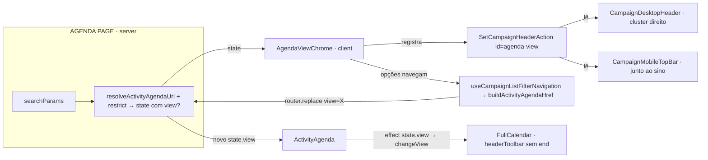

# Impl: C95 — Agenda: seletor de modo de visualização no header do app

Status: aprovado
Atualizado em: 2026-08-09
Issue: #439
Intenção: docs/plans/c95-agenda-seletor-modo-visualizacao.md
Appetite restante: ~0,5–1 dia eng (herdado); sem ajuste

## Leitura da intenção

- **Outcome:** um seletor único de modo de visualização (Dia/Semana/Mês/Lista) no **header do app** — `CampaignDesktopHeader` no desktop, `CampaignMobileTopBar` no mobile — agenda-contextual (só `/campanha/agenda`), compacto (não cresce `min-h-11`/`min-h-14`), substituindo os 4 botões de modo do FullCalendar (`headerToolbar.end`). A escolha persiste por sessão/reload (estado da tela, junto do filtro — que já vive na URL), respeita o recorte do filtro e **vence** a lógica responsiva de resize (semana↔dia) que hoje existe.
- **O que NÃO negociar:** navegação prev/next/"Hoje" permanece no FullCalendar; criação inline (C91) intacta; leader lockdown intacto; demais telas `/campanha` sem o seletor; header sem segunda linha e sem aumento de altura; escolha do usuário não é trocada por resize.
- **O que reavaliar (hipóteses da intenção):**
  - "estado de vista eventualmente junto ao `ActivityAgendaState`/URL" → **confirmado**: `view` entra no contrato URL de `ActivityAgendaState` (mesmo mecanismo dos filtros — canônico, fail-closed, share/reload consistentes).
  - "conectar o seletor ao `changeView` via `calendarRef`" → **via URL**: o seletor navega (`useCampaignListFilterNavigation`), o `ActivityAgenda` reage ao `state.view` com um effect que chama `changeView` — sem ref compartilhado entre header e página.
  - A lógica responsiva de resize precisa reconciliar com a escolha do usuário — **gate simples**: com `view` na URL, o auto-switch semana↔dia desliga; sem `view`, comportamento atual permanece.

## Abordagem recomendada

**Opções consideradas (estado da vista):** A) URL param `view` no `ActivityAgendaState` | B) contexto React compartilhado header↔página | C) localStorage/sessionStorage + estado local.
**Recomendação:** A — "edit the owner": o filtro da agenda já é estado de tela na URL (`municipality`/`deputyPresent`/`tag`); a vista é a mesma classe de estado. Ganha canonicalização/redirect fail-closed de graça (`resolveActivityAgendaUrl`), persistência reload/share consistente, e o seletor no header não precisa de bridge para o `calendarRef` — o FullCalendar reage a `state.view` como já reage a qualquer filtro.
**Rejeitadas:** B (o node de header é renderizado pelo shell, fora da árvore da página — provider por-página não o envolve; exigiria contexto no layout, vazamento de domínio de agenda para o shell); C (perde URL canônica/share; dois sources of truth; contraria "junto do filtro").

**Opções consideradas (controle do seletor):** A) Popover + botão-ghost compacto com rótulo do modo atual + ▾ | B) `NativeSelect` compacto | C) `ToggleGroup` com 4 ícones.
**Recomendação:** A — é o "Semana ▾" do esboço da intenção; adapta por superfície como o sino (`text-primary-foreground` no top bar escuro mobile vs `md:text-foreground` no header claro desktop); um único controle compacto na linha existente (não cresce o header). Opções com check do modo ativo.
**Rejeitadas:** B (usa tokens `--field-*` claros — destoa do `bg-primary` do top bar mobile; sem trigger customizável); C (4 segmentos não cabem na linha única — anti-goal explícito da intenção).

**Opções consideradas (reconciliação com o resize):** A) gate `!state.view` no auto-switch existente (com escolha → nada muda no resize; sem escolha → comportamento atual) | B) remover o auto-switch e deixar só `initialView` por viewport | C) canonicalizar o auto-switch na URL (vira escolha).
**Recomendação:** A — mudança mínima, preserva o default responsivo atual e faz a escolha vencer; "só o default muda por viewport" da intenção permanece verdadeiro.
**Rejeitadas:** B (muda comportamento de C15 além do pedido — o resize continuaria flipando hoje); C (torna o default "escolha" — depois do primeiro resize o usuário ficaria preso no modo auto-escrito; contradiz "só o default muda por viewport").

**Opções consideradas (mobile):** A) renderizar o mapa `headerActions` no `CampaignMobileTopBar` (o slot C94/C95 compartilhado passa a renderizar nos dois bars; o botão do feed já se auto-esconde com `hidden md:inline-flex`) | B) registro separado mobile-only.
**Recomendação:** A — o slot foi construído como "C94/C95 shared slot"; o feed já controla a própria visibilidade por viewport; o seletor nasce visível nos dois. Uma única fonte de registro.
**Rejeitadas:** B (duplica o mecanismo de registro que C94 entregou para exatamente isso).

**Opções consideradas (valores de URL):** A) códigos curtos `view=week|day|month|list` + mapa puro p/ FC ids | B) FC ids diretos `view=timeGridWeek`.
**Recomendação:** A — URL curta e estável (independe de internals do FullCalendar); o mapa é 3 linhas testáveis em `activityUi.ts`.
**Rejeitadas:** B (URL verbosa acoplada ao FullCalendar; renomear vista no FC vazaria para a URL).

**Decisão registrada (label do seletor sem `view`):** o label reflete o modo efetivo — `state.view` se presente, senão o default responsivo do viewport (`window.innerWidth < 640` → "Dia", senão "Semana"), medido com `matchMedia` + settle de hidratação (`useNarrowMeasured` em `hooks/use-mobile.ts`). A janela residual (viewport 640–~680 sem sidebar e 768–896 com sidebar 16rem aberta, onde o card do calendário cruza 640 antes do viewport) é cosmética e só ocorre sem escolha explícita — aceita, sem bridge header↔página para o estado efetivo do FC.

### Componentes / mudanças

- **`src/utilities/activityUi.ts`** (extender): `activityAgendaViews = ['week','day','month','list']`, `ActivityAgendaView` type, `activityAgendaViewLabels` (Semana/Dia/Mês/Lista), `activityAgendaViewFcId` (week→timeGridWeek, day→timeGridDay, month→dayGridMonth, list→listMonth), `isActivityAgendaView` guard. `parseActivityAgendaParams` ganha `view` (fail-closed: valor desconhecido → undefined → redirect canônico); `buildActivityAgendaSearchParams` serializa `view` ao final (ordem canônica `municipality,deputyPresent,tag,view`); `activityAgendaParamNames` += `view`; `restrictActivityAgendaState` repassa `view` (sem restrição de acesso — é estado de UI, não recorte de dados); `parseActivityAgendaReturnHref` preserva `view` no round-trip do create.
- **`ActivityAgendaFilters.tsx`** (1 linha): "Limpar" preserva `view` (limpa filtros, não o modo de visualização — `setDraft`/`navigate` mantêm `view` atual).
- **`AgendaViewSelector.tsx`** (novo, client, `components/campaign/activity/`): Popover compacto — trigger `Button` ghost `h-9 gap-1 px-2` com label do modo efetivo + `ChevronDown`, classes adaptativas `text-primary-foreground hover:bg-primary-foreground/10 md:text-foreground md:hover:bg-muted` (padrão do sino); `aria-label="Modo de visualização"`, `aria-expanded`/`aria-haspopup`. PopoverContent com 4 opções (`role="menu"`/`menuitemradio` + `aria-checked`, check do ativo); cada opção navega `{...state, view}` via `useCampaignListFilterNavigation` (mesmo hook dos filtros → dim do pending boundary na troca). Label fallback sem `view`: `matchMedia('(max-width: 639px)')` com settle de hidratação.
- **`AgendaViewChrome.tsx`** (novo, client, espelho de `AgendaFeedChrome`): recebe `state` da página; renderiza `<SetCampaignHeaderAction id="agenda-view">{selector memoizado}</SetCampaignHeaderAction>`. Montado na página **antes** de `<AgendaFeedChrome>` → ordem de inserção no mapa garante cluster `[Semana ▾][Link de import][Notificações][IA]` (gate da intenção).
- **`agenda/page.tsx`**: renderiza `<AgendaViewChrome state={state} />` antes do `<AgendaFeedChrome />`.
- **`CampaignMobileTopBar.tsx`** (extender): renderiza `Object.entries(headerActions)` entre título e sino (`
`), espelhando o cluster do desktop; wizard-mode inalterado (early return).
- **`ActivityAgenda.tsx`**: `headerToolbar.end` removido (fica `{ start: 'prev,next today', center: 'title' }`); `initialView={state.view ? activityAgendaViewFcId[state.view] : 'timeGridWeek'}`; effect `[state.view]` → `calendarRef.current?.getApi().changeView(...)` (skip se já é a vista atual; `datesSet` dispara reload da janela como hoje); `applyResponsiveView` só flips quando `state.view` ausente (mantém `isNarrow` para o inline create C91).
- **Migration:** sem migration (nenhuma mudança de schema).
- **Access / Consent:** nenhuma mudança — agenda segue `gate: 'staff'`; sem opt-in novo.
- **UI:** Impeccable B — encaixe no header global existente, controle compacto, sem redesign. Shape → craft → critique → polish leve; tokens `data-theme='campaign'`.

### Dados → forma (se aplicável)

- Não apresento dados novos (vista = estado de tela/navegação, mesma classe do filtro). Forma do controle: dropdown compacto (decisão A acima), espelhando o padrão visual do cluster direito do header.

## Fases verificáveis

1. **Contrato URL (traço dominante)** — `activityUi.ts` (views/labels/mapa/parse/serialize/restrict/returnHref) + unit tests em `activityUi.unit.spec.ts` (parse fail-closed, serialização canônica com `view`, restrict repassa, returnHref preserva, mapa FC). `ActivityAgendaFilters` "Limpar" preserva view. Verificar: URLs canônicas existentes inalteradas para estados sem `view`.
2. **Seletor + wiring do header** — `AgendaViewSelector` (Popover compacto + navegação), `AgendaViewChrome` (registro), página (ordem), `CampaignMobileTopBar` (slot no mobile); `ActivityAgenda` (headerToolbar sem `end`, initialView, effect changeView, gate do responsive).
3. **Gates** — e2e da agenda atualizado (os asserts `getByRole('tab', /semana|mês|lista/i)` morrem com a remoção do `end` — reescrever para o seletor do header, desktop e mobile); `pnpm gate:fast` na iteração; `pnpm push` no fechamento.

## Rabbit holes / Não escopo (engenharia)

- Mover prev/next/"Hoje" para o header (fica no FullCalendar — corte da intenção).
- Persistência entre dispositivos/contas (só URL/tela).
- Bridge de estado efetivo do FC para o header (label fallback usa viewport; janela cosmética aceita).
- Extrair `useNarrow` compartilhado calendário/seletor (2 call sites com alvos de medição diferentes; DRY <3).
- Redesign do FullCalendar (C15) e do slot de header (C94).

## Riscos e mitigação

- **E2E:** os asserts de `role="tab"` do FullCalendar quebram ao remover `end` — reescrever para o seletor (label `Modo de visualização` + opções), cobrindo desktop e mobile, e adicionar: troca de vista → URL `view=...` → reload persiste → escolha vence resize.
- **`useCampaignListFilterNavigation` no header:** o node renderiza no header, dentro de `CampaignListPendingBoundary` do layout (verificado) — transição compartilhada funciona; `router.replace` com `scroll: false`.
- **`SetCampaignHeaderAction` re-registra em re-render:** node memoizado (`useMemo` em `[state]`), padrão C94.
- **Eventos ao trocar vista:** `changeView` → `datesSet` → `visibleRange` muda → reload da janela (mesmo caminho dos botões atuais do FC; sem regressão).
- **Estado com `view` na action do servidor:** `loadActivityAgendaEvents({...state})` ganha `view` — zod `activityAgendaRequestSchema` (non-strict) descarta chaves desconhecidas; sem mudança de schema (verificado).
- **Flake pré-existente (`gridcell.nth(1)`):** os testes de slot do calendário (`cria inline`, `Mais detalhes`) flakavam com "Element is not attached to the DOM" no `scrollIntoViewIfNeeded` — o grid do FullCalendar pinta vazio e **substitui os gridcells quando os events chegam**, então o scroll corria contra o re-render. Estabilizado nesta entrega: esperar `Carregando compromissos…` sumir (`toHaveCount(0)`) antes de interagir nos 2 testes de slot (mesmo padrão de waits do C94, agora antes da ação). Suíte `campaignActivity.e2e.spec.ts` completa verde (6/6) com o rebase em main. O QueryError `endAt cannot be queried` apareceu 1×/9 runs (intermitente, em run sem relação com os testes que falharam; não reproduzido após o rebase).

## Pós-/simplify (reviewers paralelos)

- **P1 corrigido (desync URL→calendário):** o effect de `changeView` só sincronizava quando `state.view` estava presente; navegar para `/campanha/agenda` sem query (link da sidebar, back/forward) deixava o FullCalendar numa vista órfã (ex: mês) que o seletor não reivindicava. Agora o effect normaliza também na ausência: volta ao default responsivo (narrow → `timeGridDay`, senão `timeGridWeek`) — mesma regra do label do seletor. E2E cobre o caso (goto sem `view` → "Dia" + grid de dia).
- **P1 corrigido (e2e só provava o label):** os asserts do teste C95 agora verificam o calendário de fato — o `aria-label` do botão "Hoje" ("Esta semana"/"Este mês"/"Hoje" — o FullCalendar v7 classic hasheia as classes de view) + presença/ausência de `[role="grid"]` (month tem grid, list não). Coberto após troca, após reload, após resize (escolha vence) e após navegação sem `view`.
- **P2 corrigido (teclado do menu):** `nav[role="menu"]` ganhou `onKeyDown` com ArrowUp/ArrowDown/ArrowRight/ArrowLeft/Home/End movendo o foco entre os `menuitemradio` (roving focus mínimo; Escape/foco de volta já vêm do Radix Popover).
- **P2 corrigido (3ª cópia do hook de viewport):** `use-mobile.ts` ganhou `useNarrowMeasured(breakpoint)` (mesmo settle de hidratação de `useIsMobileMeasured`); o seletor usa `useNarrowMeasured(640)` em vez de reimplementar matchMedia. `MOBILE_BREAKPOINT` voltou a ser const interna (knip).
- **P2 corrigido (labels sem assert unit):** `activityAgendaViewLabels` pinado em unit test (typo "Mêes" falharia); parse de `view=day|list` coberto.
- **P3 (banda de divergência):** corrigida a estimativa no doc — com sidebar de 16rem a janela real é 768–896px (não 640–680).
- **P3 (Limpar sem cobertura):** e2e do "abre a semana" ganhou assert — após "Limpar", a URL mantém `view=list` (filtros vão, vista fica).

## Débitos deferidos (gatilho de revisitação)

| Débito                                                                                                                                                  | Gatilho                                                                                             |
| ------------------------------------------------------------------------------------------------------------------------------------------------------- | --------------------------------------------------------------------------------------------------- |
| `menuitemradio` sem typeahead; anchor híbrido mantém ctrl/middle-click abrindo href (comportamento de link, não de radio)                               | Próxima Issue que tocar a11y do menu do header                                                      |
| Sem caminho de UI para "voltar ao modo automático" (uma vez escolhida, `view` fica na URL; "Limpar" preserva de propósito)                              | Se produto pedir default responsivo restaurado por um gesto                                         |
| `useNarrowViewport` do seletor (viewport 640) vs `applyResponsiveView` do calendário (container 640) — banda residual documentada (768–896 com sidebar) | Se o seletor e o calendário precisarem concordar sempre (mudar o probe do calendário para viewport) |

## Aceite de engenharia

- [ ] Aceite de produto da intenção coberto (seletor único no header desktop+mobile, agenda-contextual, compacto; botões FC removidos; persistência junto do filtro; escolha vence resize; sem regressão de navegação/inline/lockdown)
- [ ] Invariantes AGENTS/engineering-standards (URL canônica, staff gate, sem Consent novo, sem migration)
- [ ] Testes de domínio: unit do contrato URL (`view` parse/serialize/restrict/returnHref/mapa); e2e da agenda reescrito no seletor + persistência + escolha-vence-resize
- [ ] `pnpm gate:fast`, tsc, lint, prettier, knip, check:cycles verdes
