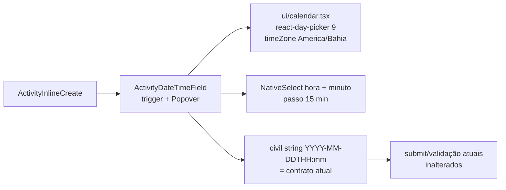

# Impl: Agenda — seletor de dia + horário (shadcn) no popover de criação rápida

Status: aprovado
Atualizado em: 2026-08-09
Issue: #482
Intenção: docs/plans/c97-agenda-popover-seletor-data-hora.md
Appetite restante: herdado (~0,5–1 dia eng)

## Leitura da intenção

- **Outcome:** no overlay de criação rápida da agenda (popover desktop + bottom sheet mobile), Início e Término deixam de usar `datetime-local` e passam a usar um seletor shadcn de dia (calendário) **e** horário (passos selecionáveis); prefill do slot mantido e ajustável; salvar grava o horário efetivamente escolhido; fuso America/Bahia inalterado; fluxo pós-salvar inalterado. **Gate:** fatia mínima aprovada pelo humano — o AM/PM reportado é o `datetime-local` nativo do popover (renderiza no idioma do browser); o controle novo é 24h **por construção** (trigger `dd/mm/aaaa às hh:mm` + selects Hora 00–23 / Minuto 00–45, string civil pura).
- **O que NÃO negociar:** prefill do slot clicado (semana/dia = slot 30 min; mês = 09:00–10:00); validações atuais (Início obrigatório; Término > Início); America/Bahia como fronteira de fuso (helpers de `campaignTime.ts`); overlay não vira o formulário completo; nada de all-day; passos de hora **visíveis e selecionáveis**.
- **O que reavaliar:** a intenção aponta o seletor da doc shadcn (Calendar + horário). A composição de referência da shadcn usa `input type="time"` com o picker nativo escondido (digitado) — isso **não** satisfaz o aceite "passos visíveis e selecionáveis". A forma técnica é livre: manter o calendário da shadcn, trocar a parte de horário por selects de passos.

## Abordagem recomendada

**Opções consideradas:** A (recomendada) | B | C | D
**Recomendação:** **A** — manter o contrato de valor civil `YYYY-MM-DDTHH:mm` (idêntico ao `datetime-local` atual), com um campo novo que renderiza trigger + popover shadcn (Calendar + 2 `NativeSelect` de hora/minuto em passos de 15 min). Zero mudança no caminho de submit/validação/parse (`parseBahiaDateTimeInput`), no prefill (`activitySlotPrefill`), em `activityUi.ts` ou no fluxo pós-salvar.

### Decisões de engenharia

**D1 — Dependência do calendário.**

- Opções: A) `react-day-picker@^9.7.0` (versão pinada pela shadcn v4 — `apps/v4/package.json`) | B) `react-day-picker@10` (latest) | C) grade de mês própria.
- Recomendação: A — o componente shadcn canônico `calendar.tsx` (variante radix-nova, compatível com o `components.json` do repo `style: radix-nova`) usa exatamente a API v9 (`DayPicker`, `getDefaultClassNames`, `DayButton`, `captionLayout`); `date-fns@4.1.0` vem como dependência transitiva, sem adicionar dep direta.
- Rejeitadas: B porque a API v10 não é a do componente canônico e o `timeZone`/`DayButton` mudariam o código para uma variante não referenciada; C porque calendário acessível/i18n é rabbit hole (a11y de teclado, pt-BR, `today`, ranges) — reusar a peça shadcn é o padrão do repo.

**D2 — Origem do `src/components/ui/calendar.tsx`.**

- Opções: A) adaptar à mão o fonte canônico radix-nova (substituir `IconPlaceholder` por `lucide-react`, trocar imports `@/`) | B) `pnpm dlx shadcn add calendar`.
- Recomendação: A — determinístico num worktree, sem risco de o CLI reescrever `components.json`/styles ou instalar versão divergente.
- Rejeitada: B porque o CLI v4 pode resolver `react-day-picker@10` ou tocar arquivos fora do escopo; a adaptação manual do fonte pinado é 100% reproduzível.

**D3 — Controle de horário (passos).**

- Opções: A) dois `NativeSelect` (Hora 00–23 + Minuto 00/15/30/45, passo 15) | B) `input type="time"` com indicador nativo escondido (composição da doc shadcn) | C) steppers segmentados hora/minuto com botões +/− | D) um select com 48+ combinações.
- Recomendação: A — passos visíveis e selecionáveis (aceite), nativo no mobile (roleta do SO), `NativeSelect` já existe em `src/components/ui/native-select.tsx` (mesma linguagem visual dos inputs do repo), testável em e2e sem depender de implementação de picker nativo do browser.
- Rejeitadas: B porque é digitação, não seleção — não cumpre o aceite, e no mobile reabre o picker nativo pouco confiável que o item está eliminando; C porque é a superfície a11y mais cara (foco, aria, rolagem) sem ganho de produto; D porque 48 opções num select é pior de navegar que dois selects.
- Passo: 15 min (recomendação de produto da intenção). Prefill de slot é sempre múltiplo de 15 (slots de 30 min; mês 09:00–10:00); se um valor fora do passo aparecer (defensivo), helper puro `floorToMinuteStep` arredonda para baixo + unit test.

**D4 — Contrato de valor.**

- Opções: A) manter civil string `YYYY-MM-DDTHH:mm` no estado do overlay | B) migrar o estado para instantes ISO `Date`.
- Recomendação: A — o estado atual (`start`/`end` em `ActivityInlineCreate`) já é civil string; `parseBahiaDateTimeInput`/`formatIsoAsBahiaDateTimeInput` continuam sendo a fronteira única. O campo novo devolve/consome a mesma string, e o diff fica contido no componente.
- Rejeitada: B porque reescreve o caminho de submit (validação, `createActivityInline`, `parseInlineResponsibles`) sem ganho de produto — custo de reverter alto, benefício zero.

**D5 — Fuso no calendário.**

- Opções: A) prop `timeZone="America/Bahia"` do RDP v9 + `locale={ptBR}` | B) construir/ler datas em UTC local do cliente.
- Recomendação: A — o RDP 9.7 suporta `timeZone` nativamente; `selected` é ancorado num instante do meio-dia baiano (`parseBahiaDateTimeInput('<dia>T12:00')`) e `onSelect` deriva o dia civil com o helper existente `formatBahiaCivilDate` — robusto independentemente do fuso do browser (CI incluso).
- Rejeitada: B porque quebraria nos browsers fora de UTC-3 (testes locais/CI) e duplicaria lógica que `campaignTime.ts` já tem.

**D6 — 24h no popover (fatia mínima aprovada no gate).** O AM/PM que o usuário viu é o `datetime-local` nativo do popover: o browser renderiza o controle no idioma da UI (en-US → "2:30 PM") e não há como forçar 24h num controle nativo. O controle novo é 24h **por construção** — o trigger formata string civil pura (`dd/mm/aaaa às hh:mm`) e os selects são Hora 00–23 + Minuto em passos, sem meridiem — imune ao idioma do browser.

- **Cortado no gate (follow-up registrado):** eixo de horário e chips do mês do FullCalendar (v7 usa `meridiem: 'short'` → "2 PM" mesmo com locale pt-br) e `hourCycle` explícito no `bahiaDateTimeDisplayFormatter` — o humano escolheu fatia mínima; virar follow-up se o produto quiser 24h na agenda e nos rótulos.

### Componentes / mudanças

- **`react-day-picker@^9.7.0`** (`package.json`): única dependência nova (date-fns transitivo).
- **`src/components/ui/calendar.tsx`** (novo): componente shadcn radix-nova adaptado do fonte canônico (`apps/v4/registry/bases/radix/ui/calendar.tsx`); `IconPlaceholder` → `ChevronLeft`/`ChevronRight`/`ChevronDown` de `lucide-react`; imports `@/components/ui/button` + `@/lib/utils`.
- **`src/app/(frontend)/styles.css`**: regras `.cn-calendar`, `.cn-calendar-dropdown-root`, `.cn-calendar-caption-label` (fonte `style-nova.css`) — definem `--cell-size:--spacing(7)` e `--cell-radius:var(--radius-md)` (token `--radius-md` já existe no arquivo, linha 83). O layout da campanha importa este CSS (layout de `(campaign)`).
- **`src/lib/campaignTime.ts`** (owner de fuso/hora — editar, não twinar): helpers puros novos `formatBahiaCivilDateTimeLabel` (civil string → `dd/mm/aaaa às hh:mm`, 24h por construção), `timeStepMinutes = 15`, `hourOptions`/`minuteOptionsForStep`, `floorToMinuteStep`.
- **`src/components/campaign/activity/ActivityDateTimeField.tsx`** (novo, convenção `Activity*` do domínio): `Field` + trigger `Button` (valor formatado + ícone de calendário, `id`/`aria-labelledby` para o `FieldLabel` existente) + `Popover` contendo `Calendar` e os dois `NativeSelect`; props `{ id, label, value: civil string, onValueChange, error, invalid }`; `onSelect` do calendário troca só a data mantendo hora/minuto atuais; selects trocam só hora/minuto mantendo a data.
- **`src/components/campaign/activity/ActivityInlineCreate.tsx`**: substituir os dois `Input type="datetime-local"` por dois `ActivityDateTimeField` (Início \*, Término); estado `start`/`end` continua civil string; submit/validação/`parseBahiaDateTimeInput` **inalterados**. Como o novo controle não permite valor vazio, `end` deixa de poder ser limpo — o modelo continua aceitando `endAt` ausente, mas na prática o overlay sempre envia término (válido: o aceite exige Término > Início e nada de all-day). O AM/PM do `datetime-local` nativo some junto (24h por construção).
- **Migration:** sem migration (sem schema).
- **Access / Consent:** nenhum toque.
- **UI:** Impeccable B — encaixe nos campos existentes: manter os dois campos na mesma grid `sm:grid-cols-2`, mesma altura visual dos inputs (`min-h-11`), erro no formato `FieldError` atual. Popover interno ancorado ao trigger (Radix vira quando falta espaço). Acessível: label visível + trigger `aria-labelledby`, calendário navegável por teclado (RDP), selects nativos.

### Dados → forma

N/A — controle de entrada, sem dados apresentados (intenção: "Vou apresentar dados? Não").

## Fases verificáveis

1. **Tracer — dependência + calendário** (quota pequena): `pnpm add react-day-picker@^9.7.0`; criar `ui/calendar.tsx`; regras CSS; smoke no dev (renderiza, `timeZone` ok, `ptBR` ok, células com tamanho certo). Verificar no browser com a agenda local.
2. **Helpers puros**: `campaignTime.ts` + unit tests (`campaignTimeCivilDate.unit.spec.ts` ou spec irmã): `formatBahiaCivilDateTimeLabel`, `floorToMinuteStep`, opções de hora/minuto.
3. **Campo novo + wiring**: `ActivityDateTimeField.tsx`; troca no `ActivityInlineCreate.tsx`; smoke do fluxo completo no dev (popover e drawer mobile): prefill do slot, trocar dia no calendário sem perder hora, trocar hora/minuto sem perder dia, salvar grava o escolhido, "Mais detalhes" intacto, trigger sempre 24h (sem AM/PM, qualquer idioma de browser).
4. **Testes**: atualizar `tests/unit/activityInlineCreate.unit.spec.tsx` (trigger por label, valor via texto do botão; interação com calendário/selects — clicar dia, mudar hora, erro de Término ≤ Início); `activityInlineErrors.unit.spec.ts` se tocar os campos; novo spec unit do campo/pickers se precisar de interação isolada; e2e `tests/e2e/campaignActivity.e2e.spec.ts` — teste inline passa a ler o rótulo do trigger (sem `.inputValue()`), e ganha um passo que muda o horário pelo seletor e salva (aceite central: "Salvar grava o horário efetivamente escolhido").
5. **Gates**: `pnpm gate:fast` → `pnpm test:int` → e2e afetado (`pnpm test:e2e` agenda) → `pnpm format:check`, `pnpm exec knip`, `pnpm check:cycles` → `pnpm build` (DB local) → scan Aikido dos arquivos tocados → registro no CHANGELOG-AGENTS → `pnpm push` → PR `--base main` `Closes #482` → auto-merge → `gh pr checks --watch --required`.

## Rabbit holes / Não escopo (engenharia)

- **Formulário completo e tarefas** (`ActivityForm.tsx`, `ActivityTaskFields.tsx`): continuam `datetime-local` — fora do escopo; o campo novo é independente o bastante para um swap futuro barato (registrar follow-up).
- **Steppers segmentados / range no calendário / sincronizar Término com Início**: cortes de produto da intenção — não implementar.
- **Persian/Hijri/RTL, `captionLayout="dropdown"`, presets, booked dates**: o componente canônico aceita via props, mas nada disso é usado.
- **`generate:importmap`**: não se aplica (componentes de app, não de admin Payload).
- **`datetime-local` em outros pontos do repo**: procurar e registrar follow-up único se houver mais ocorrências além do form/tarefas.

## Riscos e mitigação

- **Comportamento da prop `timeZone` do RDP 9.7.0**: mitigar com `selected` ancorado no meio-dia baiano + derivação via `formatBahiaCivilDate`; verificar no dev browser **antes** do e2e; se a prop não se comportar, fallback é formatar a seleção em America/Bahia via helpers existentes (mudança contida no campo).
- **Popover aninhado (overlay da agenda + picker)**: Radix porta o conteúdo para `body`; padrão documentado da shadcn (date-picker em dialog); validar abertura/fechamento/clique fora no dev e no e2e.
- **e2e existente usa `getByLabel('Início *').inputValue()`**: o trigger novo é um `Button` — `.inputValue()` falha; atualizar a asserção para o texto do rótulo (e a unidade correspondente). Não há outro teste que dependa do `datetime-local` do overlay (o form completo continua com input — testes dele intactos).
- **CSS do calendário**: se as regras `.cn-calendar` não forem adicionadas, células perdem o tamanho padrão (`--cell-size`) — coberto na Fase 1 com smoke visual.
- **Prefill fora do passo de 15 min**: hoje impossível (slots de 30 min / janela de 1h), mas `floorToMinuteStep` garante invariante e tem unit test.

## Follow-ups registrados (fora da fatia mínima)

- **Eixo de horário e chips do mês do FullCalendar em AM/PM** (v7: `DEFAULT_SLAT_LABEL_FORMAT`/`DEFAULT_TABLE_EVENT_TIME_FORMAT` com `meridiem: 'short'`): fix de 2 linhas (`slotLabelFormat`/`eventTimeFormat` com `meridiem: false`) — registrado porque o humano cortou no gate; produto decide.
- **`hourCycle: 'h23'` explícito no `bahiaDateTimeDisplayFormatter`** (`formatBahiaDateTimeLabel`): hardening engine-proof (V8 já é h23; Safari/WebKit tem histórico de divergência) — mesmo item de produto acima.
- **Trocar `datetime-local` do formulário completo e das tarefas** pelo `ActivityDateTimeField` — barato agora que o componente existe.

## Aceite de engenharia

- [ ] Aceite de produto da intenção ainda coberto (dia+horário selecionáveis, prefill mantido, validações, fuso, fluxo pós-salvar) + popover sem AM/PM (24h por construção no trigger e nos selects)
- [ ] Invariantes AGENTS/engineering-standards (sem schema/access/Consent tocados; identificadores em inglês; copy pt-BR)
- [ ] Testes de domínio previstos (unit helpers + unit campo + e2e agenda com mudança de horário)
- [ ] `model-local: deepseek-v4-flash-high` registrado na Issue #482 (mapping canônico de `model: composer-2.5`; ausente no frontmatter)
