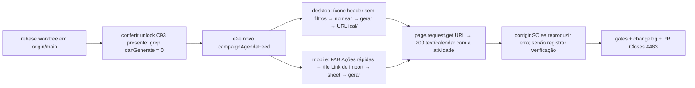

# Impl: C98 — Link de import da agenda: habilitar sem filtros e garantir que a geração funciona

Status: aprovado
Atualizado em: 2026-08-09
Issue: #483
Intenção: docs/plans/c98-corrigir-geracao-link-import-agenda.md
Appetite restante: ~0,5 dia eng (herdado; entrega menor que o appetite)

## Desfecho da verificação (registrado em 2026-08-09)

**O erro de geração em produção NÃO era de código — era a env `NEXT_PUBLIC_SITE_URL` ausente na Vercel.**

1. **Reprodução local do fluxo real (browser, dev server 3198, `teqo_wt98`):** login real de coordinator → `/campanha/agenda` sem filtros → ícone "Link de import" do header → dialog → nomear → "Gerar link" → **link `/campanha/agenda/ical/<secret>` retornado sem erro** → `GET` no link responde `200 text/calendar` com `BEGIN:VCALENDAR` + a atividade (`SUMMARY:[Abaíra] …`). O unlock do C93 e a criação do C92 funcionam no fluxo real.
2. **A divergência é o ambiente:** `buildFeedUrl` chama `getCampaignInviteBaseURL()` que **em `NODE_ENV=production` exige `NEXT_PUBLIC_SITE_URL`** (DNS público válido) e lança se ausente — provado com a função isolada (`SEM env → THROW: NEXT_PUBLIC_SITE_URL precisa ser configurada em produção.`). O throw cai no catch da action → o diálogo mostra "Não foi possível criar o feed de calendário." e nada é criado. Localmente a env existe (`.env.local` do provision); na Vercel **não existia** (verificado com `vercel env ls production` — a lista tinha `PAYLOAD_SECRET`, `BLOB_READ_WRITE_TOKEN`, DBs etc., sem `NEXT_PUBLIC_SITE_URL`; o preview tinha a de stage, 10d antes).
3. **Correção (infra):** `NEXT_PUBLIC_SITE_URL=https://pt.jorgesolla.com.br` adicionada em **Production** (e conferida em Preview) + `vercel redeploy` do deploy de produção — build novo com a env inlined (deploy `jorgesolla-64q1wafmd`, Ready). O usuário valida o fluxo real em produção.
4. **Prova automatizada (e2e novo):** `tests/e2e/campaignAgendaFeed.e2e.spec.ts` pina o fluxo real: desktop (header → dialog → nomear → gerar → link responde iCal com a atividade) e mobile (FAB → sheet → gerar). Exige o `calendarFeed` no ownership da fixture e2e (o cleanup deletava o `campaignUser` com feed `createdBy` NOT NULL → transação abortada).
5. **Achado secundário (não bloqueante):** `pnpm dev` manual no worktree sobe na porta `3000` ignorando o `PORT` do `.env.local` (o e2e funciona porque o `playwright.config.ts` injeta `PORT: webServerPort` no env do webServer — OPS20). Anotado, sem ação neste item.

## Leitura da intenção

- **Outcome:** o botão "Link de import" fica habilitado **sem filtros** (ícone no header desktop + FAB mobile) e a **geração do link é verificada no fluxo real**: nomear → gerar → o app retorna `/campanha/agenda/ical/<secret>` sem erro, e o link responde com o feed iCal do recorte pedido. Feed sem filtro = agenda completa do escopo de leitura do criador; revogar/listar e o read seguem fail-closed (C16/C96).
- **O que NÃO negociar:** fail-closed no read (o segredo é a credencial; criador desativado ou sem acesso → feed para de servir); escopo do criador no feed "sem filtro" (não é backdoor); leader lockdown; sem PII/Consent novo.
- **O que reavaliar:** **a hipótese da intenção ("re-aplicar o C93 nas superfícies do C94") está obsoleta** — o PR #473 (C93) foi **mergeado e promovido a `main`** (commit `76915b94`, 2026-08-09) no intervalo entre o plano e a execução; a Issue #437 fechou com `done`/`in-prod`. O unlock sem filtros já está em main (gate `canGenerate` removido de `page.tsx`/`AgendaFeedChrome`/`CalendarFeedDialog`, copy neutra, int de conteúdo e unit do diálogo). O **delta real do C98 é o aceite nº 2 — verificação ponta a ponta do fluxo de geração** (questão aberta A do plano), que nenhum teste cobre hoje: os int provam conteúdo/access, o unit prova a UI sem gate, mas **nenhum e2e cobre nomear→gerar→link responde no fluxo real do browser**.

## Abordagem recomendada

**Opções consideradas:**

- **A. E2E do fluxo real (recomendada):** spec novo `tests/e2e/campaignAgendaFeed.e2e.spec.ts` (projeto `campaign`): (1) desktop — coordinator loga, cria atividade de fixture, abre `/campanha/agenda` **sem filtros**, ícone "Link de import" do header habilitado → dialog → nomeia → "Gerar link" → input com URL `/campanha/agenda/ical/<secret>` sem mensagem de erro → `page.request.get(url)` responde 200 `text/calendar` com `BEGIN:VCALENDAR` + `SUMMARY` da atividade (prefixo `[Município]`); (2) mobile — viewport 390×844, FAB "Ações rápidas" → tile "Link de import" → sheet abre → gera com sucesso. Corrigir código **só se reproduzir** (questão aberta A: a raiz do C92 está corrigida e testada).
- **B. Verificação manual única (browser/DevTools) sem automação:** não deixa prova reproduzível nem cobertura de CI; o repo tem infra e2e madura para o fluxo.
- **C. Mudança proativa de servidor ("garantir" mexendo na action/route sem reprodução):** C92 corrigiu a raiz (campos `required` com `access.create` admin-only stripados → ValidationError engolido; revogação silenciosamente não gravava) com 14 int verdes; mexer sem repro arrisca regressão — é o rabbit hole explícito do plano ("caçar um erro fantasma de geração").

**Recomendação: A** — porque converte o aceite nº 2 ("gerar link funciona no fluxo real") em prova automatizada reproduzível, no nível certo (browser real, ação real, endpoint real), sem tocar em servidor/schema cujo comportamento já está pinado por int; e honra a decisão do plano de não inventar mudança de servidor sem reprodução.
**Rejeitadas:** B porque a verificação ponta a ponta é o **aceite do item** — precisa ficar registrada e reproduzível, não só observada uma vez; C porque a geração está provada no servidor e a mudança sem repro contraria a recomendação explícita do plano de intenção (opção A da questão aberta).

### Componentes / mudanças

- **`tests/e2e/campaignAgendaFeed.e2e.spec.ts`** (novo): fluxo desktop completo + fluxo mobile pelo FAB. Reusa `campaignE2EFixtures` (`campaign.login`, `fixtures.createCampaignUser`, `fixtures.claimMunicipality`, `fixtures.payload.create` com `hookFilledCreateData`), padrão de `campaignActivity.e2e.spec.ts` (describe "Agenda — calendário operacional"): asserts por **contenção** (a atividade do próprio fixture está no feed — robusto a workers paralelos), waits `toBeVisible({ timeout: 15_000 })` (RSC pending), atividade `confirmado` hoje às 10:00 (janela deslizante 90/365 dias).
- **Código de produção: nenhuma mudança esperada** — C93 (unlock) e C92 (criação) já estão em main. Se o e2e reproduzir erro de geração → diagnose + fix mínimo com o mesmo padrão de teste (e o impl plan registra o desfecho).
- **Migration:** sem migration (sem mudança de schema).
- **Access / Consent:** sem mudança (C16/C96 intactos).
- **UI:** Impeccable A — sem mudança de superfície; o e2e pina o estado habilitado (ícone header + FAB + dialog + copy neutra) já entregue pelo C93.

### Dados → forma

- N/A (sem dados novos; a forma é a verificação do feed iCal existente).

## Fases verificáveis

1. **Rebase + confirmação do estado** — `git fetch` + rebase em `origin/main`; conferir `canGenerate` ausente (page/chrome/dialog, grep = 0) e copy neutra; rodar int de `calendarFeed` local para baseline.
2. **E2E** — escrever `campaignAgendaFeed.e2e.spec.ts`; rodar só a spec local (`pnpm test:e2e -- tests/e2e/campaignAgendaFeed.e2e.spec.ts`, dev server na porta 3198, `teqo_wt98_test`); ajustar seletores (vaul drawer role/labels, ícone header) até verde.
3. **Gates** — `pnpm gate:fast` (lint/typecheck/unit), `pnpm test` (unit+int), `pnpm build` local; e2e da spec verde.
4. **Fechamento** — 1 entrada no `docs/CHANGELOG-AGENTS.md`; impl plan com o desfecho da verificação (reproduziu? corrigido como? ou verificado); `pnpm push -u origin HEAD` → PR Ready `--base main` `Closes #483` → auto-merge → checks.

## Rabbit holes / Não escopo (engenharia)

- **Caçar erro fantasma de geração:** sem reprodução no e2e → registrar a verificação (o que foi exercitado) e seguir; o servidor já está provado (int 14/14).
- **Mudar server/route/collection do feed:** fora de escopo (C16/C92/C96 intactos).
- **Refino de copy/labels/placeholder do diálogo:** fora de escopo (C93 já neutralizou "recorte" → "agenda"; refino é anti-goal do plano).
- **C95 (seletor de semana no mesmo header, `in-progress`):** não tocar no slot do header; o e2e usa o slot agenda-contextual (`SetCampaignHeaderAction id="calendar-feed"`) existente.
- **Duplicar cobertura de conteúdo do int:** o e2e asserta contenção (a atividade aparece), não a exaustividade do escopo — isso é do int do C93 (coordinator = tudo / advisor = portfólio / nada fora vaza).

## Riscos e mitigação

- **Conflito de rebase com o merge do C93:** base atual = `69b7094b` (pai do merge `76915b94`); rebase trivial ou merge direto.
- **`page.request.get(feedUrl)` fora do origin do teste:** `getCampaignInviteBaseURL` em dev/test usa `NEXT_PUBLIC_SITE_URL` do `.env.test.local` (= `http://localhost:3198`, derivado do mesmo `devPort` — OPS20); bate com o dev server do e2e.
- **Seletor do ícone do header / drawer mobile:** header é `md:inline-flex` (viewport desktop do projeto `campaign`); drawer vaul em mobile — validar `getByRole('dialog')`/`getByLabel` ao rodar; fallback: `page.getByRole('button', { name: 'Link de import' })` para o ícone.
- **Contaminação entre e2e paralelos (workers):** fixtures isolam usuário/valor por teste; assert de feed por contenção nunca por igualdade exata.
- **Flake RSC pending:** waits de visibilidade padrão (15 s) como nos e2e da agenda.

## Aceite de engenharia

- [ ] Aceite de produto da intenção coberto: botão habilitado sem filtros (já em main via C93 — pinado pelo e2e); geração verificada no fluxo real (nomear → gerar → link retorna sem erro → feed iCal responde); feed sem filtro = escopo do criador (int C93); revogar/listar/read fail-closed (C16/C96)
- [ ] Invariantes AGENTS/engineering-standards (identificadores EN, copy pt-BR, sem toque em schema/access/Consent)
- [ ] E2E novo verde local + `pnpm gate:fast` + `pnpm test` + `pnpm build`
- [ ] Changelog com 1 entrada; impl plan registra o desfecho da verificação
