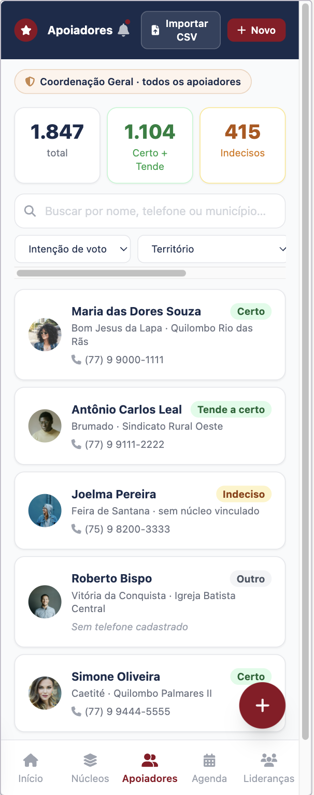
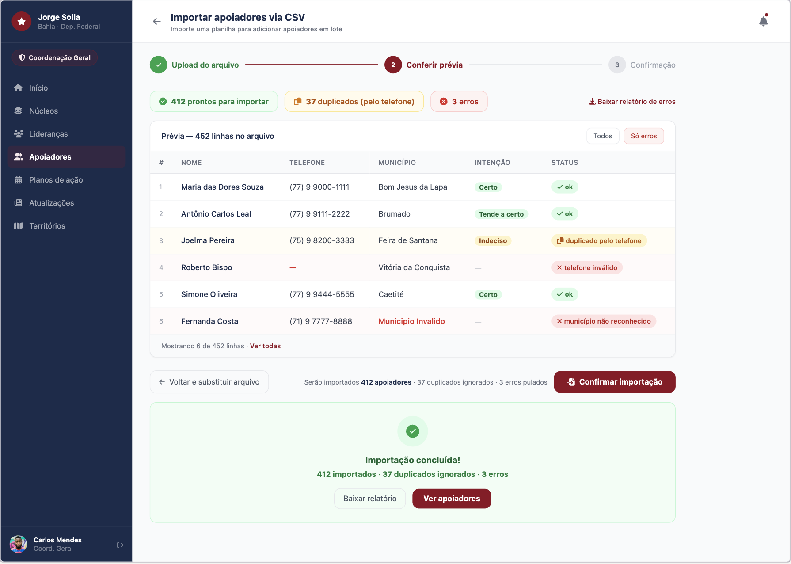
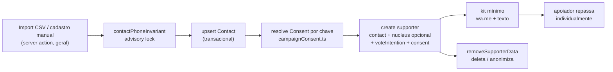

# Cadastro nominal de apoiadores em massa

Status: engenharia pronta (pendente merge/deploy + lote jurídico)
Atualizado em: 2026-07-18
Item do roadmap: [docs/roadmap.md](../roadmap.md) (seção "Campanha → Próximos ciclos")
Responsável: —

## Referência visual (UX Pilot)

Três designs cobrem este plano:

| Tela                                         | Arquivos                                                                                                                                                                  |
| -------------------------------------------- | ------------------------------------------------------------------------------------------------------------------------------------------------------------------------- |
| Lista de apoiadores (`/campanha/apoiadores`) | [`Apoiadores-Lista.png`](../design-refs/latest/Apoiadores-Lista.png) · [`Apoiadores-Lista.html`](../design-refs/latest/Apoiadores-Lista.html)                             |
| Ficha do apoiador                            | [`Apoiador-Ficha.png`](../design-refs/latest/Apoiador-Ficha.png) · [`Apoiador-Ficha.html`](../design-refs/latest/Apoiador-Ficha.html)                                     |
| Import CSV (desktop, wizard 3 passos)        | [`Importar-CSV-Apoiadores.png`](../design-refs/latest/Importar-CSV-Apoiadores.png) · [`Importar-CSV-Apoiadores.html`](../design-refs/latest/Importar-CSV-Apoiadores.html) |

Como usar:

- **Lista — adotar:** KPIs no topo (total / "Certo + Tende" / "Indecisos"), busca por nome/telefone/município, filtros "Intenção de voto" e "Território", linhas com nome + município + núcleo vinculado (ou "sem núcleo vinculado" — reflete a decisão de núcleo opcional) + badge de intenção + telefone; CTAs "Importar CSV" e "+ Novo". (Telefone é obrigatório no v1 — ver decisões fechadas; o estado "Sem telefone cadastrado" do design não se aplica.)
- **Ficha — adotar:** bloco destacado "Consentimento LGPD" com checkbox nominal, link para a Política de Privacidade e registro "Consentimento registrado em … · Coletor: …" (`consentedAt` + `createdBy`); segmented control de intenção de voto **desabilitado até o consentimento** ("Disponível somente após confirmação do consentimento LGPD" — consentimento destacado, chave `apoiador-intencao-voto`); seção "Kit de compartilhamento" mínimo (mensagem template + `wa.me` + copiar texto; sem collection `shareKit`); ação "Remover meus dados" (descadastramento art. 18).
- **Import — adotar:** wizard em 3 passos (Upload → Conferir prévia → Confirmação) com chips de contagem ("412 prontos" / "37 duplicados (pelo telefone)" / "3 erros"), tabela de prévia com status por linha (`ok`, `duplicado pelo telefone`, `telefone inválido`, `município não reconhecido`), toggle "Todos | Só erros", "Baixar relatório de erros" e resumo final. Import só por `geral`. O sidebar desktop do design mostra a navegação-alvo — usar como referência do shell, mas só adicionar entradas de domínios que existirem (sem "Agenda"/C3).
- **Ajustar cores:** paleta antiga (navy/vermelho escuro) no HTML/PNG; implementar com tokens do tema `campaign`. Avatares com foto viram iniciais; "solla.ba" no kit é placeholder — a URL real vem de `NEXT_PUBLIC_SITE_URL`.

## Contexto

Hoje a campanha só cadastra pessoas via `leadership` — a junção única `Contact`↔núcleo que carrega status de apoio, vínculo com `campaignUser` (acesso ao app) e consentimento. Não existe base nominal de apoiadores "comuns": eleitores que declaram apoio mas não são lideranças engajadas com acesso à plataforma. O roadmap pede explicitamente o cadastro nominal em massa via `Contact` + junção, **sem nunca criar uma collection "pessoa/apoiador" paralela** (decisão travada no AGENTS.md, espelhada por `Signature`/`Subscription`).

Decisão de produto (2026-07-17): modelo **híbrido** — apoiador é join `Contact`↔campanha com **núcleo opcional**. A base é transversal (pode existir sem núcleo) e, quando vinculada a um núcleo, agrega por território. `leadership` permanece como o subconjunto que tem acesso ao app. A **pre-intenção de votos** (intenção de voto) entra neste plano: é dado sensível (opinião política) e exige consentimento destacado, mas é o ganho de produto central — transforma a estimativa manual de hoje em base nominal real, alimentando os insights de conversão e gap vs. 2022.

## Marco legal (LGPD + TSE)

Pesquisa web (2026-07-17). Fontes: TSE (Res. 23.610/2019 alterada pela 23.732/2024), ConJur, Migalhas, OAB Campinas, ANPD.

- **Opinião política e filiação partidária são dados sensíveis** (art. 11 da LGPD). Não cabe legítimo interesse do controlador; exigem **consentimento específico, expresso e destacado**. A intenção de voto capturada neste plano é dado sensível.
- **Princípio da finalidade** (art. 6º LGPD): dado coletado para "cadastro de apoio" ou "lista de presença em evento" não migra livremente para "propaganda eleitoral". Cada finalidade nova precisa ser consentida. O `source` (proveniência) e o `Consent` por finalidade documentam isso.
- **Disparo em massa é vedado** no WhatsApp/Telegram (Res. 23.610, art., 33). Permitido só compartilhamento individual/orgânico entre pessoas físicas (art. 33, §2º). A Meta veda o uso do WhatsApp Business API por campanhas políticas.
- **Vedada** a cessão, doação e venda de cadastros eletrônicos a candidatas/candidatos/partidos. A base nominal construída aqui é da campanha do Solla e não é compartilhada.
- **Obrigações do controlador**: Aviso de Privacidade, Política de Segurança, Canal de Comunicação (confirmação de tratamento, eliminação, descadastramento — art. 18 LGPD), Encarregado de Dados (DPO; dispensado em municípios < 200 mil eleitores), Registro das Operações de Tratamento (art. 33-C da Res. 23.610).
- **RIPD**: a Justiça Eleitoral pode exigir Relatório de Impacto à Proteção de Dados quando o tratamento for em larga escala (≥10% do eleitorado apto da circunscrição) e envolver dado sensível ou perfilamento. Avaliação caso a caso pela assessoria jurídica.
- **Mensagens** devem trazer identificação completa do remetente e mecanismo de descadastramento/eliminação.

## Objetivos

- Nova collection `supporter` (join `Contact`↔campanha, núcleo opcional), no admin group `Campanha`.
- Import em massa (CSV) com dedup por telefone, transacional, whitelist de colunas e preview de erros por linha.
- Captura de **intenção de voto** (dado sensível) com `Consent` por chave estável `apoiador-intencao-voto`, falha fechado se ausente.
- Consentimento de apoio declarado por chave `apoiador-cadastro`.
- **Mobilização orgânica**: kit mínimo de compartilhamento (links `wa.me` pré-preenchidos + texto template) — sem disparo em massa pela campanha e sem collection `shareKit` no v1.
- Canal de descadastramento/eliminação (direito LGPD art. 18).
- Access control por papel herdando o padrão existente (`getAccessibleNucleusIds`).

## Decisões travadas

- **Pessoa = `Contact` + junção.** Nova collection `supporter` relaciona `contact` (required) + `nucleus` (opcional) + campos de apoio. Nunca criar "apoiador/pessoa" paralela. (AGENTS.md.)
- **Híbrido com núcleo opcional.** Apoiador pode existir sem núcleo (base transversal); quando vinculado a um núcleo, agrega por território. `nucleus` é `relationship` opcional a `electoralNucleus`.
- **`leadership` segue separada.** Liderança é o apoiador engajado com acesso ao app; `leadership` permanece responsável pelo `campaignUser` e pelo `supportStatus` interno. Um hook em `supporter` impede o mesmo `contact` ser apoiador e liderança do mesmo núcleo simultaneamente.
- **Telefone obrigatório no v1 (2026-07-18).** `Contact.phone` continua required/único; linha de import sem telefone válido é erro. O estado "sem telefone" do design não se aplica.
- **Intenção de voto é dado sensível.** Captura exige `Consent.key = 'apoiador-intencao-voto'` (consentimento destacado, separado do consentimento de cadastro). Falha fechado se a chave não existir — resolver genérico em `campaignConsent.ts` (`getConsentByKey` / `requireConsentByKey`).
- **Import em massa só por `geral`/admin**, via server action autenticada no `/campanha` (não no `/admin`, que ainda não tem RBAC — AGENTS Known Gap #1). Dedup por telefone via `acquireContactPhoneLocks` / `assertContactPhoneAvailable` em `contactPhoneInvariant.ts` (não criar `supporterDedup.ts`). Tudo transacional com `req: { transactionID }`.
- **Kit de compartilhamento mínimo no v1 (2026-07-18).** Template fixo + `wa.me` + copiar texto no detalhe do apoiador; sem collection `shareKit`.
- **Descadastramento.** Server action `removeSupporterData` deleta o `supporter` e anonimiza/limpa PII do `Contact` apenas se nenhum outro join (`leadership` / `signature` / `subscription` / outro `supporter`) o referencia.
- **Access control.** `geral` vê/gerencia todos; `coordenador` vê apoiadores dos seus núcleos (`nucleus in getAccessibleNucleusIds`); apoiador sem núcleo é só de `geral`; `lideranca` não gerencia apoiadores. Delete admin-only.
- **Enum de intenção.** `certo | tende_a_certo | indeciso | outro` (bate com o design). Campo `supportLevel` fica fora do v1.
- **i18n e naming.** Identificadores em inglês (`supporter`, `voteIntention`, `removeSupporterData`), strings visíveis em pt-BR. Admin group `Campanha`.

## Questões fechadas (2026-07-18)

- **Coexistência `supporter`↔`leadership` no mesmo núcleo.** Adotado: um contato não pode ser apoiador e liderança do mesmo núcleo (hook valida).
- **Import no `/campanha` vs `/admin`.** Adotado: import no `/campanha` (server action, só `geral`).
- **Intenção de voto: enum.** Adotado: `certo | tende_a_certo | indeciso | outro`.
- **Kit de compartilhamento.** Adotado no v1: versão mínima (template + `wa.me` + copiar); collection `shareKit` fora de escopo.
- **Telefone.** Adotado: obrigatório; linha sem telefone válido = erro no import.
- **Anonimização vs eliminação.** Adotado (assumido — validar com jurídico): deleta `supporter`; limpa PII do `Contact` só se nenhum outro join o referencia.
- **Atestado do operador no import CSV.** Adotado (assumido — validar com jurídico): checkbox do operador registrado em `consentNote`/`consentedAt`, exige as duas chaves de Consent configuradas.
- **RIPD / reuso pós-eleição.** Continuam com jurídico; fora do escopo de engenharia deste item.

## Abordagem proposta

Componentes:

- **`src/collections/Supporter.ts`** (nova, group `Campanha`):
  - `contact` (relationship→`contact`, required, index)
  - `nucleus` (relationship→`electoralNucleus`, opcional, index)
  - `voteIntention` (select: `certo | tende_a_certo | indeciso | outro`, index) — **dado sensível**, field access restrito a `geral`/`coordenador` (reusa `canReadLeadershipInternal`)
  - Pares de consentimento: `consent`/`consentContentHash`/`consentedAt` (cadastro) e `voteIntentionConsent`/`voteIntentionConsentContentHash`/`voteIntentionConsentedAt` (intenção)
  - `source` (select: `import_csv | manual | convite | evento`) — v1 grava só os dois primeiros
  - `consentNote`, `notes` (staff-only), `createdBy` (readOnly)
  - Unicidade: `UNIQUE NULLS NOT DISTINCT (contact_id, nucleus_id)` na migration (Postgres ≥15)
  - access: `canReadSupporter`, `canManageSupporter`, `canCreateSupporter` (em `campaignAccess.ts`)
  - hook `beforeChange`: seta `createdBy`; rejeita `contact` que já é `leadership` do mesmo `nucleus`
- **`Consent` keys** (admin cadastra; app falha fechado se ausente):
  - `apoiador-cadastro` — apoio declarado
  - `apoiador-intencao-voto` — intenção de voto (consentimento destacado)
- **`src/utilities/campaignConsent.ts`** — generalizar com `getConsentByKey` / `requireConsentByKey`; wrappers de liderança e constantes `SUPPORTER_REGISTRATION_CONSENT_KEY` / `SUPPORTER_VOTE_INTENTION_CONSENT_KEY`
- **`src/lib/schemas/supporter.ts`** — zod schemas (create, intenção, import, filtros)
- **`src/app/(campaign)/campanha/actions/supporter.ts`** — `createSupporter`, `setSupporterVoteIntention`, `previewSupporterImport` / `confirmSupporterImport`, `removeSupporterData`
- **UI** `/campanha/apoiadores` — lista + ficha + wizard de import; nav "Apoiadores" só para geral/coordenador
- **Migrations**: `pnpm migrate:create add_supporter`. Tipos: `pnpm generate:types`

## O que isso viabiliza

- **Base nominal por território** para direcionar campo e eventos.
- **Intenção de voto nominal** alimentando insights (conversão, gap vs. 2022) com dado real.
- **Mobilização orgânica**: apoiadores compartilham conteúdo da campanha em seus círculos (caminho legal, sem disparo em massa).
- **Agregados no overview da lista de núcleos** (follow-up de B1) passam a incluir contagem nominal de apoiadores.

## Dependências

- Nenhuma bloqueante de engenharia. Reusa `Contact`, `Consent` (por chave via `campaignConsent.ts`), `campaignAccess` (`getAccessibleNucleusIds`), `normalizeBrazilianPhone`, `contactPhoneInvariant`, e o padrão transacional multi-collection.
- **Baseline TSE 2022** habilita o cruzamento nominal vs. voto 2022 (fora deste item).

## Não escopo

- Disparo em massa / WhatsApp Business API — vedado.
- Collection `shareKit` completa — kit mínimo no v1 basta.
- RIPD — assessoria jurídica.
- PWA/push para apoiadores — plano `notifications.md`.
- Agregado de apoiadores no overview de núcleos — follow-up de B1.
- Uso da base no dia D — C5.
- Campo `supportLevel` — fora do v1.
- Mesclar `leadership` em `supporter` — `leadership` segue responsável pelo acesso ao app.

## Bloqueador obrigatório de produção

Antes de importar dados reais ou capturar intenção de voto: a assessoria jurídica eleitoral documenta a base do art. 11 da LGPD para intenção de voto (dado sensível) e dos arts. 7/8 para o cadastro de apoio, aprova os textos versionados específicos, e um admin cadastra `Consent.key = 'apoiador-cadastro'` e `Consent.key = 'apoiador-intencao-voto'`. O app falha fechado se qualquer uma das chaves estiver ausente — mesmo padrão do bloqueador de liderança.

**Lote jurídico único (decisão de processo 2026-07-17):** esses dois textos devem ser revisados na **mesma rodada jurídica** que o texto de `lideranca-autopreenchimento` (bloqueador do MVP de Núcleos) e o de `campanha-notificacoes-push` ([notifications.md](notifications.md)) — quatro textos, uma rodada. A mesma rodada deve cobrir o **Aviso de Privacidade**.

**Nota de faseamento:** a engenharia deste plano **não** fica bloqueada pelo jurídico — o app falha fechado por design.

## Revisões

- **2026-07-18:** auditoria pré-implementação C2. Corrigidas refs defasadas (`campaignConsent.ts` em vez de `campaignInvite.ts` / `supporterConsent.ts`; `contactPhoneInvariant.ts` em vez de `supporterDedup.ts`). Decisões fechadas: telefone obrigatório; kit mínimo no v1; enum de intenção; coexistência com leadership; import só `geral`; `supportLevel` fora do v1; `removeSupporterData` com anonimização condicionada a outros joins.

## Referências

- [`docs/roadmap.md`](../roadmap.md)
- [`AGENTS.md`](../../AGENTS.md) — Pessoa = `Contact` + junção; `Consent` por chave; transações multi-collection; access control
- Res. TSE 23.610/2019 (alterada pela 23.732/2024); LGPD art. 11 (dados sensíveis) e art. 18 (direitos do titular)
- [`src/collections/Leadership.ts`](../../src/collections/Leadership.ts) — padrão de junção `Contact`↔núcleo + consent
- [`src/collections/Signature.ts`](../../src/collections/Signature.ts) e [`src/collections/Subscription.ts`](../../src/collections/Subscription.ts) — padrão de join com `Contact`
- [`src/collections/Consent.ts`](../../src/collections/Consent.ts) — `key` estável
- [`src/collections/Contact.ts`](../../src/collections/Contact.ts) — normalização de telefone
- [`src/utilities/campaignAccess.ts`](../../src/utilities/campaignAccess.ts) — `getAccessibleNucleusIds`
- [`src/utilities/campaignConsent.ts`](../../src/utilities/campaignConsent.ts) — resolve Consent por chave + falha fechada
- [`src/utilities/contactPhoneInvariant.ts`](../../src/utilities/contactPhoneInvariant.ts) — advisory lock de telefone
- [`src/app/(campaign)/campanha/actions/leadership.ts`](<../../src/app/(campaign)/campanha/actions/leadership.ts>) — upsert de Contact + transação
