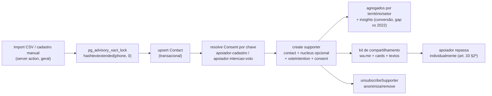

# Cadastro nominal de apoiadores em massa

Status: rascunho
Atualizado em: 2026-07-17
Item do roadmap: [docs/roadmap.md](../roadmap.md) (seção "Campanha → Próximos ciclos", linha 56)
Responsável: —

## Referência visual (UX Pilot)

Três designs cobrem este plano:

| Tela                                         | Arquivos                                                                                                                                                                  |
| -------------------------------------------- | ------------------------------------------------------------------------------------------------------------------------------------------------------------------------- |
| Lista de apoiadores (`/campanha/apoiadores`) | [`Apoiadores-Lista.png`](../design-refs/latest/Apoiadores-Lista.png) · [`Apoiadores-Lista.html`](../design-refs/latest/Apoiadores-Lista.html)                             |
| Ficha do apoiador                            | [`Apoiador-Ficha.png`](../design-refs/latest/Apoiador-Ficha.png) · [`Apoiador-Ficha.html`](../design-refs/latest/Apoiador-Ficha.html)                                     |
| Import CSV (desktop, wizard 3 passos)        | [`Importar-CSV-Apoiadores.png`](../design-refs/latest/Importar-CSV-Apoiadores.png) · [`Importar-CSV-Apoiadores.html`](../design-refs/latest/Importar-CSV-Apoiadores.html) |

Como usar:

- **Lista — adotar:** KPIs no topo (total / "Certo + Tende" / "Indecisos"), busca por nome/telefone/município, filtros "Intenção de voto" e "Território", linhas com nome + município + núcleo vinculado (ou "sem núcleo vinculado" — reflete a decisão de núcleo opcional) + badge de intenção + telefone; estado "Sem telefone cadastrado" em itálico; CTAs "Importar CSV" e "+ Novo".
- **Ficha — adotar:** é a tela que melhor materializa as decisões LGPD do plano: bloco destacado "Consentimento LGPD" com checkbox nominal, link para a Política de Privacidade e registro "Consentimento registrado em … · Coletor: …" (`consentedAt` + `createdBy`); segmented control de intenção de voto **desabilitado até o consentimento** ("Disponível somente após confirmação do consentimento LGPD" — consentimento destacado, chave `apoiador-intencao-voto`); seção "Kit de compartilhamento" com mensagem pronta, "Enviar no WhatsApp"/"Copiar texto" e a nota "A mensagem é enviada pelo celular de {nome} — não é disparo em massa da campanha" (art. 33 §2º); ação "Remover meus dados" (descadastramento art. 18).
- **Import — adotar:** wizard em 3 passos (Upload → Conferir prévia → Confirmação) com chips de contagem ("412 prontos" / "37 duplicados (pelo telefone)" / "3 erros"), tabela de prévia com status por linha (`ok`, `duplicado pelo telefone`, `telefone inválido`, `município não reconhecido`), toggle "Todos | Só erros", "Baixar relatório de erros" e resumo final. Corresponde ao `importSupporters` (dedup por telefone + preview de erros por linha). O sidebar desktop do design mostra a navegação-alvo (Início, Núcleos, Lideranças, Apoiadores, Planos de ação, Atualizações, Territórios) — usar como referência do shell desktop, mas só adicionar entradas de domínios que existirem.
- **Ajustar cores:** paleta antiga (navy/vermelho escuro) no HTML/PNG; implementar com tokens do tema `campaign` (sidebar clara `#FAFAF9`, primário `#C51414`, badges de intenção com os pares pastel claros). Avatares com foto viram iniciais; "solla.ba" no kit é placeholder — a URL real vem de `NEXT_PUBLIC_SITE_URL`.

## Contexto

Hoje a campanha só cadastra pessoas via `leadership` — a junção única `Contact`↔núcleo que carrega status de apoio, vínculo com `campaignUser` (acesso ao app) e consentimento. Não existe base nominal de apoiadores "comuns": eleitores que declaram apoio mas não são lideranças engajadas com acesso à plataforma. O roadmap pede explicitamente o cadastro nominal em massa via `Contact` + junção, **sem nunca criar uma collection "pessoa/apoiador" paralela** (decisão travada no AGENTS.md, espelhada por `Signature`/`Subscription`).

Decisão de produto (2026-07-17): modelo **híbrido** — apoiador é join `Contact`↔campanha com **núcleo opcional**. A base é transversal (pode existir sem núcleo) e, quando vinculada a um núcleo, agrega por território. `leadership` permanece como o subconjunto que tem acesso ao app. A **pre-intenção de votos** (intenção de voto) entra neste plano: é dado sensível (opinião política) e exige consentimento destacado, mas é o ganho de produto central — transforma a estimativa manual de hoje em base nominal real, alimentando os insights de conversão e gap vs. 2022.

## Marco legal (LGPD + TSE)

Pesquisa web (2026-07-17). Fontes: TSE (Res. 23.610/2019 alterada pela 23.732/2024), ConJur, Migalhas, OAB Campinas, ANPD.

- **Opinião política e filiação partidária são dados sensíveis** (art. 11 da LGPD). Não cabe legítimo interesse do controlador; exigem **consentimento específico, expresso e destacado**. A intenção de voto capturada neste plano é dado sensível.
- **Princípio da finalidade** (art. 6º LGPD): dado coletado para "cadastro de apoio" ou "lista de presença em evento" não migra livremente para "propaganda eleitoral". Cada finalidade nova precisa ser consentida. O `source` (proveniência) e o `Consent` por finalidade documentam isso.
- **Disparo em massa é vedado** no WhatsApp/Telegram (Res. 23.610, art. 33). Permitido só compartilhamento individual/orgânico entre pessoas físicas (art. 33, §2º). A Meta veda o uso do WhatsApp Business API por campanhas políticas.
- **Vedada** a cessão, doação e venda de cadastros eletrônicos a candidatas/candidatos/partidos. A base nominal construída aqui é da campanha do Solla e não é compartilhada.
- **Obrigações do controlador**: Aviso de Privacidade, Política de Segurança, Canal de Comunicação (confirmação de tratamento, eliminação, descadastramento — art. 18 LGPD), Encarregado de Dados (DPO; dispensado em municípios < 200 mil eleitores), Registro das Operações de Tratamento (art. 33-C da Res. 23.610).
- **RIPD**: a Justiça Eleitoral pode exigir Relatório de Impacto à Proteção de Dados quando o tratamento for em larga escala (≥10% do eleitorado apto da circunscrição) e envolver dado sensível ou perfilamento. Avaliação caso a caso pela assessoria jurídica.
- **Mensagens** devem trazer identificação completa do remetente e mecanismo de descadastramento/eliminação.

## Objetivos

- Nova collection `supporter` (join `Contact`↔campanha, núcleo opcional), no admin group `Campanha`.
- Import em massa (CSV) com dedup por telefone, transacional, whitelist de colunas e preview de erros por linha.
- Captura de **intenção de voto** (dado sensível) com `Consent` por chave estável `apoiador-intencao-voto`, falha fechado se ausente.
- Consentimento de apoio declarado por chave `apoiador-cadastro`.
- **Mobilização orgânica**: kits de conteúdo compartilhável (links `wa.me` pré-preenchidos, cards, textos) para apoiadores repassarem individualmente em seus círculos sociais — sem disparo em massa pela campanha.
- Canal de descadastramento/eliminação (direito LGPD art. 18).
- Access control por papel herdando o padrão existente (`getAccessibleNucleusIds`).

## Decisões travadas

- **Pessoa = `Contact` + junção.** Nova collection `supporter` relaciona `contact` (required) + `nucleus` (opcional) + campos de apoio. Nunca criar "apoiador/pessoa" paralela. (AGENTS.md.)
- **Híbrido com núcleo opcional.** Apoiador pode existir sem núcleo (base transversal); quando vinculado a um núcleo, agrega por território. `nucleus` é `relationship` opcional a `electoralNucleus`.
- **`leadership` segue separada.** Liderança é o apoiador engajado com acesso ao app; `leadership` permanece responsável pelo `campaignUser` e pelo `supportStatus` interno. Um hook em `supporter` impede o mesmo `contact` ser apoiador e liderança do mesmo núcleo simultaneamente.
- **Intenção de voto é dado sensível.** Captura exige `Consent.key = 'apoiador-intencao-voto'` (consentimento destacado, separado do consentimento de cadastro). Falha fechado se a chave não existir — mesmo padrão do convite de liderança (`campaignInvite.ts`).
- **Import em massa só por `geral`/admin**, via server action autenticada no `/campanha` (não no `/admin`, que ainda não tem RBAC — AGENTS Known Gap #1). Dedup por telefone com `pg_advisory_xact_lock(hashtextextended(phone, 0))` (mesmo padrão do `Contact`). Tudo transacional com `req: { transactionID }`.
- **Sem disparo em massa.** A campanha não envia mensagens em massa a apoiadores. Fornece **kits de compartilhamento** (links `wa.me` pré-preenchidos, cards, textos) que o apoiador/envia individualmente aos seus contatos. Caminho legal (art. 33, §2º).
- **Descadastramento.** Server action `unsubscribeSupporter` (por token ou por telefone autenticado) anonimiza/remove o `supporter` e registra o pedido, preservando contagem agregada sem PII.
- **Access control.** `geral` vê/gerencia todos; `coordenador` vê apoiadores dos seus núcleos; `lideranca` não gerencia apoiadores (só vê o próprio cadastro se for apoiador). Herda `getAccessibleNucleusIds`.
- **i18n e naming.** Identificadores em inglês (`supporter`, `voteIntention`, `unsubscribeSupporter`), strings visíveis em pt-BR. Admin group `Campanha`.

## Questões em aberto

- **Coexistência `supporter`↔`leadership` no mesmo núcleo.** Recomendação: um contato não pode ser apoiador e liderança do mesmo núcleo simultaneamente (hook valida). Definir com produto.
- **Import no `/campanha` vs `/admin`.** Recomendação: import no `/campanha` (server action autenticada, `geral`), com preview de dedup e erros por linha — mantém dentro da ferramenta de campanha e fora do `/admin` sem RBAC. Definir com produto.
- **Intenção de voto: enum ou escala.** Recomendação: enum `certo | tende_a_certo | indeciso | outro` + campo de observação. Definir com produto/jurídico.
- **RIPD necessário?** Se a base nominal superar 10% do eleitorado apto + dado sensível, TSE pode exigir RIPD. Recomendação: assessoria jurídica avalia; este plano entrega a base, não o RIPD.
- **Kit de compartilhamento: onde mora?** Recomendação: novo domínio `shareKit` (cards + texto + link) relacionado a `post`/evento, consumido no detalhe do apoiador e no dashboard. Pode ser fase 2. Definir com produto.
- **Anonimização vs eliminação.** LGPD art. 18 permite eliminação. Recomendação: descadastramento anonimiza `Contact.phone`/`email` e remove `supporter`, preservando contagem agregada sem PII. Definir com jurídico.
- **Reuso da base na pós-eleição.** Dados coletados em campanha não migram para mandato sem nova base legal. Recomendação: documentar retenção e expiração no Aviso de Privacidade. Definir com jurídico.

## Abordagem proposta

Componentes:

- **`src/collections/Supporter.ts`** (nova, group `Campanha`):
  - `contact` (relationship→`contact`, required, index)
  - `nucleus` (relationship→`electoralNucleus`, opcional, index)
  - `supportLevel` (select: `apoiador | simpatizante | a_abordar`, default `apoiador`, index)
  - `voteIntention` (select: `certo | tende_a_certo | indeciso | outro`, index) — **dado sensível**, field access restrito a `geral`/`coordenador`
  - `consent` (relationship→`consent`) — consentimento de intenção/cadastro
  - `consentContentHash`, `consentedAt` (mesmo padrão do `leadership`)
  - `source` (select: `import_csv | manual | convite | evento`) — proveniência para o Registro de Operações (art. 33-C)
  - `notes` (textarea, internal, field access restrito)
  - `createdBy` (relationship→`campaignUser`, readOnly, index)
  - indexes: unique `[contact, nucleus]` quando núcleo definido; index `[contact]` para apoiadores sem núcleo.
  - access: `canReadSupporter`, `canManageSupporter`, `canCreateSupporter` (em `campaignAccess.ts`).
  - hook `beforeChange`: valida coexistência com `leadership` (rejeita se o `contact` já é `leadership` do mesmo `nucleus`).
- **`Consent` keys** (admin cadastra; app falha fechado se ausente):
  - `apoiador-cadastro` — apoio declarado (dado não-sensível).
  - `apoiador-intencao-voto` — intenção de voto (dado sensível, consentimento destacado).
- **`src/utilities/supporterConsent.ts`** — resolve `Consent` por chave (mesmo padrão do convite em `campaignInvite.ts`).
- **`src/app/(campaign)/campanha/actions/supporter.ts`** — server actions:
  - `importSupporters` (parse CSV, dedup, transacional, `geral` only, preview de erros por linha).
  - `setSupporterVoteIntention` (exige consentimento destacado ativo).
  - `unsubscribeSupporter` (descadastramento/eliminação).
- **`src/utilities/supporterDedup.ts`** — reusa o lock `pg_advisory_xact_lock(hashtextextended(phone, 0))`.
- **UI**:
  - `/campanha/apoiadores` — lista paginada com filtros por território/setor/intenção (`geral`/`coordenador`).
  - Import no `/campanha` com preview de dedup e erros.
  - Kit de compartilhamento no detalhe do apoiador (fase 2).
- **Migrations**: `pnpm migrate:create add_supporter` (+ `add_supporter_consent_keys` se necessário). Tipos: `pnpm generate:types`.

## O que isso viabiliza

- **Base nominal por território/setor** para direcionar campo e eventos.
- **Intenção de voto nominal** alimentando os insights existentes (taxa de conversão, gap vs. 2022, classificação territorial, dobradinha 2026) com dado real em vez de só estimativa manual — cruzar com o baseline TSE 2022 (plano `baseline-eleitoral-tse.md`).
- **Mobilização orgânica**: apoiadores compartilham conteúdo da campanha em seus círculos (caminho legal, sem disparo em massa).
- **Dobradinha 2026**: identificar apoiadores de aliados por território.
- **Demandas/eventos**: rotear convites e demandas por território (quando esses domínios existirem).
- **Agregados no overview da lista de núcleos** (plano `overview-lista-nucleos.md`) passam a incluir contagem nominal de apoiadores.

## Dependências

- Nenhuma bloqueante. Reusa `Contact`, `Consent` (por chave), `campaignAccess` (`getAccessibleNucleusIds`), `normalizeBrazilianPhone`, o lock de dedup e o padrão transacional multi-collection.
- **Insights** (taxa de conversão, gap vs. 2022, classificação territorial) se beneficiam, mas não bloqueiam.
- **Baseline TSE 2022** (plano separado) habilita o cruzamento nominal vs. voto 2022.

## Não escopo

- Disparo em massa / WhatsApp Business API — vedado por lei e pela Meta.
- Compartilhamento/cessão da base com partido/outras candidaturas — vedado.
- RIPD — entregue pela assessoria jurídica, não por este plano.
- PWA/push para apoiadores — escopo do plano `notifications.md` (interna à equipe).
- Mesclar `leadership` em `supporter` — `leadership` segue responsável pelo acesso ao app.

## Bloqueador obrigatório de produção

Antes de importar dados reais ou capturar intenção de voto: a assessoria jurídica eleitoral documenta a base do art. 11 da LGPD para intenção de voto (dado sensível) e dos arts. 7/8 para o cadastro de apoio, aprova os textos versionados específicos, e um admin cadastra `Consent.key = 'apoiador-cadastro'` e `Consent.key = 'apoiador-intencao-voto'`. O app falha fechado se qualquer uma das chaves estiver ausente — mesmo padrão do bloqueador de liderança.

**Lote jurídico único (decisão de processo 2026-07-17):** esses dois textos devem ser revisados na **mesma rodada jurídica** que o texto de `lideranca-autopreenchimento` (bloqueador do MVP de Núcleos) e o de `campanha-notificacoes-push` ([notifications.md](notifications.md)) — quatro textos, uma rodada. O jurídico é o caminho crítico de produção da vertical inteira; fatiar em rodadas separadas multiplica o lead time externo. A mesma rodada deve cobrir o **Aviso de Privacidade** (página institucional LGPD, bloqueador já listado no roadmap), que é obrigação do controlador antes de coleta em massa.

**Nota de faseamento:** a engenharia deste plano **não** fica bloqueada pelo jurídico — o app falha fechado por design, então collection, import, UI e testes podem ser construídos e deployados antes das chaves existirem; só o uso com dados reais espera a aprovação.

## Referências

- [`docs/roadmap.md`](../roadmap.md) (linha 56)
- [`AGENTS.md`](../../AGENTS.md) — Pessoa = `Contact` + junção; `Consent` por chave; transações multi-collection; access control
- Res. TSE 23.610/2019 (alterada pela 23.732/2024); LGPD art. 11 (dados sensíveis) e art. 18 (direitos do titular)
- [`src/collections/Leadership.ts`](../../src/collections/Leadership.ts) — padrão de junção única `Contact`↔núcleo + consent
- [`src/collections/Signature.ts`](../../src/collections/Signature.ts) e [`src/collections/Subscription.ts`](../../src/collections/Subscription.ts) — padrão de join com `Contact`
- [`src/collections/Consent.ts`](../../src/collections/Consent.ts) — `key` estável
- [`src/collections/Contact.ts`](../../src/collections/Contact.ts) — normalização de telefone
- [`src/utilities/campaignAccess.ts`](../../src/utilities/campaignAccess.ts) — `getAccessibleNucleusIds`, padrão de access por papel
- [`src/utilities/campaignInvite.ts`](../../src/utilities/campaignInvite.ts) — `Consent` por chave + falha fechada
- [`src/app/(frontend)/actions/submitWhatsapp.ts`](<../../src/app/(frontend)/actions/submitWhatsapp.ts>) — padrão transacional multi-collection
