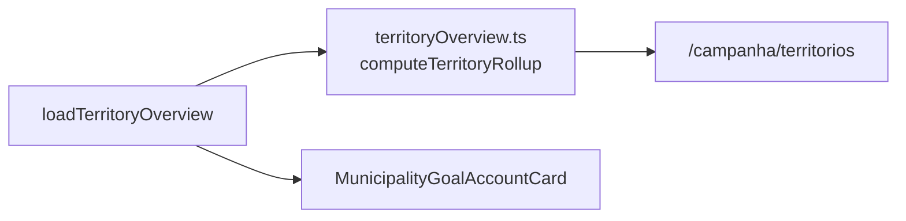

# E12 — Camada Territórios de Identidade (rollups regionais com salvaguardas MAUP)

Status: entregue (2026-07-26)
Atualizado em: 2026-07-26 (entrega E12: colunas Cobertura/Captura/Classe em `/campanha/territorios`, benchmark intra-TI no card Conta da cadeira, conceitos E18)
Item do roadmap: [docs/roadmap.md](../roadmap.md) (seção "Inteligência de campanha", E12; plano-mestre [inteligencia-campanha.md](inteligencia-campanha.md))
Impeccable: B — colunas em `/campanha/territorios` (B21) + benchmark intra-TI no `MunicipalityGoalAccountCard`; sem rota nova
Appetite: ~1,5 dia eng; sem migration (mapeamento município→TI é estático)
Responsável: —

**Revisão 2026-07-26:** O plano de 2026-07-24 previa `territoryRollup.ts` e agrupamento `?group=territorio` na lista de municípios. No código, E17/B21 já entregaram `computeTerritoryRollup` em `src/utilities/territoryOverview.ts` e a página `/campanha/territorios`. E12 **estende** esse rollup com métricas E8/E10 (cobertura, captura MAUP, classe via `computeAggregateTerritorialClass`). **Cortado na v1:** agrupamento na lista de municípios (B21 cobre a leitura comparativa); mapa TI (gatilho mantido). Benchmark no detalhe pousa no card **Conta da cadeira**, não no `MunicipalityBaselineCard`.

## Design (Impeccable)

Âncoras: `PRODUCT.md` (princípio 5) / `DESIGN.md` (register `product`) · `TerritoryList` (B21), geometria `bahia-identity-territories.topo.json` (B2).

Na implementação: craft compacto → critique → polish.

- **Persona / contexto:** coordenador dividindo carteiras de assessores e preparando giro; "TI é a língua que o governo e o campo já falam".
- **Job principal:** ler o território em 27 unidades sem que a média regional esconda o município crítico.
- **Estratégia de cor:** Restrained; rollup nunca aparece sem a decomposição a um clique.
- **Edit where you see:** não neste item (rollup é leitura; carteiras de assessor continuam por município).
- **Anti-goals:** média regional decidindo alocação de município (anti-goal 9); TI Metropolitano como uma linha entre 27; segundo agrupamento além de TI (Imediatas ficam adiadas).

## Contexto

Relatório §6.5: TI é a camada default de coordenação (decisões sobre gente e logística regional), com salvaguardas MAUP obrigatórias — razão dos agregados (nunca média das razões), agregado acompanhado de mediana+amplitude+município crítico nomeado, Metropolitano sempre decomposto, malha congelada por ciclo, "praça manda no voto, TI manda na logística". Análises que só estabilizam no TI: balanço de portfólio, gap regional de captura, leitura da majoritária por TI, benchmark intra-TI (T4), sanity de metas. O repo já tem `bahiaTerritories.ts` (município→TI oficial) e a geometria dos 27 TIs (B2); `municipality.region` já existe no catálogo.

## Objetivos

- **Rollup por TI** sobre o bundle existente: votos em jogo, meta/cobertura (Σ), captura regional (Σ nominais ÷ Σ teto — razão dos agregados), nº de municípios por classe (E10; E14 adiado), município crítico (pior déficit) nomeado, mediana e amplitude da captura.
- **Superfície:** colunas novas em `/campanha/territorios` (B21).
- **Benchmark intra-TI (T4):** no detalhe do município (`MunicipalityGoalAccountCard`), comparação com a mediana do TI + município-farol nomeado.
- **Metropolitano decomposto:** o grupo "Metropolitano de Salvador" sempre expande zonas SSA + municípios RMS; nunca agrega num número único sem breakdown visível.
- **Malha congelada:** constante de versão da composição TI usada no ciclo (já é estática em `bahiaTerritories.ts` — documentar como frozen 2026).

## Decisões travadas

- **TI como única camada regional do produto neste ciclo** (default operacional — relatório H4). **Rejeitado:** Regiões Imediatas IBGE como camada paralela (teste de sensibilidade fica manual/ad-hoc — G10 adiado); cluster empírico como camada operacional (instável e ilegível; vira exercício de auditoria única fora do produto).
- **Razão dos agregados, nunca média das razões** — regra de implementação com teste unit dedicado (divergência entre as duas contas exposta como alarme de heterogeneidade). **Rejeitado:** médias simples (a média que mente — §6.5).
- **Classe do TI:** `computeAggregateTerritorialClass(slugs)` (B13) — nunca votação/média de classes por município.
- **i18n e naming:** `criticalMunicipality`, `medianCapture`; labels pt-BR ("Território", "Município crítico").

## Questões em aberto (resolvidas na entrega)

- **Padrões T1–T3/T5:** rollups aqui; gatilhos T no E11 fase 2.
- **Mapa TI na v1:** adiado (gatilho: primeiro giro regional com mapa municipal insuficiente).
- **Agrupamento na lista de municípios:** adiado (B21 cobre comparação dos 27 TIs).

## Abordagem (as-built)

Componentes:

- **`src/utilities/territoryOverview.ts`**: rollup puro (E17) estendido com cobertura, captura MAUP, município crítico; Metropolitano com sub-rows.
- **`src/utilities/loadTerritoryOverview.ts`**: E8 bundle + classe agregada por TI.
- **`TerritoryListColumns.tsx`**: colunas Cobertura, Captura, Classe.
- **Detalhe:** benchmark intra-TI no `MunicipalityGoalAccountCard`.
- **Sem migration.**

## Dependências

- Dura: **E8** ✓. Suaves: E17 ✓, B21 ✓, E10 ✓, B13 ✓. E14 não entregue (rollup por nível adiado).

## Não escopo

- Gatilhos T1–T5 como sugestões (E11 fase 2); malha Regiões Imediatas (G10); carteiras de assessor como entidade; edição em nível TI; `?group=territorio` na lista de municípios (v1); mapa TI (v1).

## Rabbit holes

- **Rollup virar segunda página de analytics.** Métricas entram como colunas em B21 — não dashboard.
- **Zonas de Salvador no rollup do Metropolitano.** Breakdown Salvador + Demais RMS obrigatório.
- **Comparação entre TIs virar ranking público.** Copy: benchmark é aprendizado, não punição.

## Adiado com gatilho

- **Mapa TI.** Gatilho: primeiro giro regional planejado com o mapa municipal se mostrando insuficiente.
- **Agrupamento na lista de municípios.** Gatilho: mesa pedir leitura agrupada após adoção de B21.
- **Teste de sensibilidade TI×Imediatas.** Gatilho: decisão cara sustentada por leitura regional divergente (§6.5 salvaguarda 4).

## Revisão na entrega (2026-07-26)

- Estende `territoryOverview.ts` / `loadTerritoryOverview.ts` (E17/B21) com cobertura E8 (`central`), captura regional (razão Σ votos ÷ Σ teto, mediana, amplitude, município crítico e farol), classe agregada via `computeAggregateTerritorialClass`.
- UI: três colunas novas em `/campanha/territorios` + sort `cobertura`/`captura`/`classe` + descrições B22; benchmark T4 em `MunicipalityGoalAccountCard` via `territoryIntraCaptureBenchmark.ts` (pares Metropolitano = Salvador zonas × demais RMS).
- Dois conceitos E18 (`captura-regional`, `benchmark-intra-ti`). `sanityCheckSuggestedGoalsByTerritory` permanece sem superfície de UI (export/testada; gatilho E11/E13).
- Cortes mantidos: sem `?group=territorio`, sem mapa TI.

## Referências

- `docs/roadmap.md` (Inteligência de campanha, E12) · [plano-mestre](inteligencia-campanha.md) · [pagina-territorios-identidade.md](pagina-territorios-identidade.md) (B21)
- `docs/research/relatorio-entrevista-persona-campanha.md` §6.5
- `src/utilities/territoryOverview.ts`, `src/utilities/loadTerritoryOverview.ts`, `src/components/campaign/municipality/TerritoryListColumns.tsx`, `MunicipalityGoalAccountCard.tsx`
