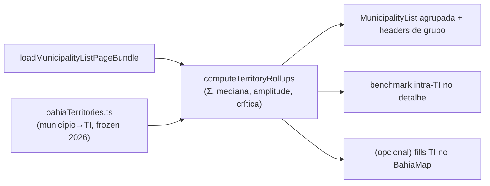

# E12 — Camada Territórios de Identidade (rollups regionais com salvaguardas MAUP)

Status: rascunho
Atualizado em: 2026-07-24 (refs sincronizadas pós-remodelagem Municípios + hardening)
Item do roadmap: [docs/roadmap.md](../roadmap.md) (seção "Inteligência de campanha", E12; plano-mestre [inteligencia-campanha.md](inteligencia-campanha.md))
Impeccable: B — agrupamento/rollup nas superfícies existentes (lista/overview, detalhe do município, mapa TI opcional); sem rota nova **própria** — desde 2026-07-25 a superfície regional dedicada é **B21** (`/campanha/territorios`, [plano](pagina-territorios-identidade.md)), onde as métricas deste item pousam
Appetite: ~1,5 dia eng; sem migration (mapeamento município→TI é estático)
Responsável: —

## Design (Impeccable)

Âncoras: `PRODUCT.md` (princípio 5) / `DESIGN.md` (register `product`) · `MunicipalityListOverview`, geometria `bahia-identity-territories.topo.json` (B2).

Na implementação: craft compacto → critique → polish.

- **Persona / contexto:** coordenador dividindo carteiras de assessores e preparando giro; "TI é a língua que o governo e o campo já falam".
- **Job principal:** ler o território em 27 unidades sem que a média regional esconda o município crítico.
- **Estratégia de cor:** Restrained; rollup nunca aparece sem a decomposição a um clique.
- **Edit where you see:** não neste item (rollup é leitura; carteiras de assessor continuam por município).
- **Anti-goals:** média regional decidindo alocação de município (anti-goal 9); TI Metropolitano como uma linha entre 27; segundo agrupamento além de TI (Imediatas ficam adiadas).

## Contexto

Relatório §6.5: TI é a camada default de coordenação (decisões sobre gente e logística regional), com salvaguardas MAUP obrigatórias — razão dos agregados (nunca média das razões), agregado acompanhado de mediana+amplitude+município crítico nomeado, Metropolitano sempre decomposto, malha congelada por ciclo, "praça manda no voto, TI manda na logística". Análises que só estabilizam no TI: balanço de portfólio, gap regional de captura, leitura da majoritária por TI, benchmark intra-TI (T4), sanity de metas. O repo já tem `bahiaTerritories.ts` (município→TI oficial) e a geometria dos 27 TIs (B2); `municipality.region` já existe no catálogo.

## Objetivos

- **Rollup por TI** sobre o bundle existente: votos em jogo, meta/cobertura (Σ), captura regional (Σ nominais ÷ Σ teto — razão dos agregados), nº de municípios por classe/nível, município crítico (pior déficit/frescor) nomeado, mediana e amplitude da captura.
- **Agrupamento na lista:** modo "por Território" na lista de municípios (grupos colapsáveis com o rollup no header do grupo) — mesma URL/filtros.
- **Benchmark intra-TI (T4):** no detalhe do município, comparação com a mediana do TI ("captura 2,1× a mediana do seu território") + município-farol nomeado.
- **Metropolitano decomposto:** o grupo "Metropolitano de Salvador" sempre expande zonas SSA + municípios RMS; nunca agrega num número único sem breakdown visível.
- **Malha congelada:** constante de versão da composição TI usada no ciclo (já é estática em `bahiaTerritories.ts` — documentar como frozen 2026).
- Opcional barato (se couber no appetite): modo TI no mapa usando a geometria B2 (fills por rollup, mesmas escalas B13).

## Decisões travadas

- **TI como única camada regional do produto neste ciclo** (default operacional — relatório H4). **Rejeitado:** Regiões Imediatas IBGE como camada paralela (teste de sensibilidade fica manual/ad-hoc — G10 adiado); cluster empírico como camada operacional (instável e ilegível; vira exercício de auditoria única fora do produto).
- **Razão dos agregados, nunca média das razões** — regra de implementação com teste unit dedicado (divergência entre as duas contas exposta como alarme de heterogeneidade). **Rejeitado:** médias simples (a média que mente — §6.5).
- **i18n e naming:** `territoryRollup`, `computeTerritoryRollups`, `criticalMunicipality`, `medianCapture`; labels pt-BR ("Território", "Município crítico").

## Questões em aberto

- **Padrões T1–T3/T5 entram aqui ou no E11 fase 2?** Opções: avaliador TI neste item | tudo no motor. **Recomendação:** os rollups (insumo) aqui; os gatilhos T no E11 fase 2 — evita duplicar o mecanismo de sugestão.
- **Mapa TI na v1?** **Recomendação:** sim se sobrar ½ dia (geometria pronta, `BahiaMap` aceita features de TI); senão adiado com gatilho.

## Abordagem proposta

Componentes:

- **`src/utilities/territoryRollup.ts`**: rollup puro sobre as linhas do bundle + derivados E8; salvaguardas como invariantes testadas (razão de agregados, Metropolitano flagged).
- **`MunicipalityList.tsx`**: modo de agrupamento (param `?group=territorio`) com headers de grupo; `MunicipalityListOverview` ganha corte por TI quando agrupado.
- **Detalhe do município:** linha de benchmark no card de baseline (reusa `MunicipalityBaselineCard`).
- **Mapa (opcional):** `bahiaTerritoryGeometries.ts`/`getTerritoryFeature` já existem; modo TI colore os 27 polígonos pelo rollup.
- **Sem migration.**

## Dependências

- Dura: **E8** (captura/meta/cobertura por município para agregar). Suaves: E9 (agrupamento compõe com as colunas da fila), E14 (nível no rollup), B13 (escalas do mapa TI).
- Reusa: `bahiaTerritories.ts`, `bahiaTerritoryGeometries.ts`/`bahiaGeometries.ts` (B2), bundle A9+.

## Não escopo

- Gatilhos T1–T5 como sugestões (E11 fase 2); malha Regiões Imediatas (G10 — adiado no plano-mestre); carteiras de assessor como entidade (continua `municipality.advisors`); qualquer edição em nível TI.

## Rabbit holes

- **Rollup virar segunda página de analytics.** É um agrupamento da lista + números no header — não um dashboard regional novo. _(Atualização 2026-07-25: a página regional existe como item próprio, **B21** — tabela comparativa com sort/filtro, sem cards de KPI. As métricas deste item entram como colunas lá; a proibição continua valendo contra transformá-la em dashboard.)_
- **Zonas de Salvador no rollup do Metropolitano.** As 19 Municípios-zona têm `region` = Metropolitano; agregar por soma funciona, mas o breakdown obrigatório precisa listar zonas E municípios RMS separados — não "resolver" juntando tudo.
- **Comparação entre TIs virar ranking público.** Mesmo risco de gaming do benchmark (T4-contraindicação): benchmark é para aprender mecanismo, não régua punitiva — copy da UI reflete isso.

## Adiado com gatilho

- **Mapa TI** (se não couber na v1). Gatilho: primeiro giro regional planejado com o mapa municipal se mostrando insuficiente.
- **Teste de sensibilidade TI×Imediatas.** Gatilho: decisão cara sustentada por leitura regional divergente (§6.5 salvaguarda 4).

## Referências

- `docs/roadmap.md` (Inteligência de campanha, E12) · [plano-mestre](inteligencia-campanha.md)
- `docs/research/relatorio-entrevista-persona-campanha.md` §6.5 (veredito TI, análises, T1–T5, salvaguardas MAUP)
- `src/lib/bahiaTerritories.ts`, `src/lib/bahiaTerritoryGeometries.ts`, `src/lib/geometries/bahia-identity-territories.topo.json` (B2)
- `src/components/campaign/MunicipalityList.tsx`, `MunicipalityListOverview.tsx`, `MunicipalityBaselineCard.tsx`, `src/utilities/municipalityPageData.ts`
- AGENTS.md — B2 as-built, naming
