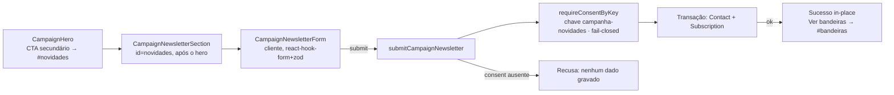

# Impl: Captura de novidades da campanha na home pública

Status: rascunho
Atualizado em: 2026-08-19
Issue: #93
Intenção: docs/plans/captura-novidades-home-campanha.md
Appetite restante: herdado (~1–1,5 dia eng)

## Leitura da intenção

- **Outcome:** visitante da home deixa nome + WhatsApp (obrigatórios; e-mail, estado, cidade e comentário opcionais) numa seção da própria home, escolhe o nível de engajamento num toggle pré-selecionado ("Quero fazer parte do time"), recebe confirmação in-place; o registro vira Contact + assinatura com consentimento novo fail-closed, e a escolha do toggle fica gravada e visível no admin.
- **O que NÃO negociar:** nada de `supporter` (bloqueio jurídico Onda 0); consentimento NOVO (não `whatsapp-inscricao`), resolvido por chave estável e fail-closed (sem o texto configurado no admin, o form recusa a captura); sem mescla com `/mandato-no-whatsapp`; CTA secundário do hero vira o atalho da captura **sem esconder as bandeiras** (`#bandeiras` continua acessível — link do rodapé já existe); 6 campos do rascunho, nada mais.
- **O que reavaliar:** a hipótese dizia que os campos `NameInput`/`PhoneInput`/`EmailInput`/`StateSelect`/`CitySelect` "já existem e são reutilizáveis" — verdade, mas **`Contact.state` é `NOT NULL` no banco** (migration inicial) e **`StateSelect`/`CitySelect` têm `required` fixo** (usados só pelo `WhatsappForm` hoje). Estado opcional no form exige: `required: false` na collection + migration `DROP NOT NULL`, e um prop `required` nos dois selects (editar o dono, sem gêmeos). A forma do consentimento (um texto vs. dois) fica decidida aqui — ver abordagem.

## Abordagem recomendada

**Opções consideradas:** A (dois consents, escolha = relação de consent) · B (**um consent + campo `campaignLevel` na assinatura**) · C (collection nova de captura)
**Recomendação:** **B** — porque a escolha do toggle sobrevive como **dado explícito** (`subscription.campaignLevel`, coluna própria no admin), o jurídico aprova **um texto** cobrindo os dois níveis (o rabbit-hole "um consentimento só para tudo" da intenção é cortado justamente quando a escolha **sobrevive no dado** — aqui sobrevive), e o padrão repete o precedente `whatsapp-inscricao` (uma chave por fluxo, `requireConsentByKey` fail-closed). O texto em si continua pendente de aprovação jurídica antes da ativação — nenhum dado é capturado sem o(s) documento(s) no admin.
**Rejeitadas:**

- **A (dois consents, `campanha-novidades-time`/`-esporadico`):** juridicamente o dobro de textos a aprovar; a escolha fica implícita numa relação que o admin teria que interpretar pelo label do documento; e se o jurídico aprovar um texto único, a duplicação em dois docs vira truque. Zero schema change é a única vantagem — e B custa só uma coluna nullable.
- **C (collection `campaignNewsletterSignup` nova):** twin do modelo de assinatura; a intenção diz explicitamente "o vínculo reutiliza o modelo de assinatura existente".

### Componentes / mudanças

- **`campaignConsentKeys.ts`** (`src/lib/`): `CAMPAIGN_NEWSLETTER_CONSENT_KEY = 'campanha-novidades'` + `CAMPAIGN_NEWSLETTER_CONSENT_MISSING_MESSAGE` ("Consentimento de novidades da campanha ainda não configurado.").
- **`campaignConsent.ts`** (`src/utilities/`, edit owner): `requireCampaignNewsletterConsent` no padrão das irmãs.
- **`Subscription`** (`src/collections/`): campo novo `campaignLevel` — select `time|esporadico` (labels "Fazer parte do time" / "Comunicações esporádicas", admin label "Nível de engajamento"), **nullable na collection** (linhas do WhatsApp não tocam) e `admin.listColumns` para a coluna aparecer na lista.
- **`Contact`** (`src/collections/`): `state` → `required: false` (a ficha staff via zod `contactCreateSchema` continua exigindo — precedente `phones`: collection permissiva, fluxos com regra própria).
- **Migration** `pnpm migrate:create` (uma: `ALTER TABLE "contact" ALTER COLUMN "state" DROP NOT NULL` + `CREATE TYPE enum_subscription_campaign_level` + `ALTER TABLE "subscription" ADD COLUMN "campaign_level"`); rebase antes de criar; inspecionar o SQL gerado.
- **`schemas/contact.ts`** (edit owner): exportar `contactNameSchema` (hoje const não exportada).
- **`schemas/campaign-newsletter.ts`** (novo, `src/lib/schemas/`): `campaignNewsletterSchema` — `name` (`contactNameSchema`, obrigatório), `phone` (`brazilianMobile`, obrigatório, normaliza p/ 11 dígitos), `email` (`optionalPersistedEmail`), `state` (opcional, `''`→undefined), `city` (opcional, min 3 quando presente), `comment` (`commentSchema.shape.comment`), `campaignLevel` (`z.enum(['time','esporadico']).default('time')` — o pré-selecionado do toggle).
- **`actions/submitCampaignNewsletter.ts`** (novo, `src/app/(frontend)/actions/`): padrão `submitWhatsapp` — parse zod → `requireConsentByKey` fail-closed → transação (`payload.db.beginTransaction`, `req: { transactionID }`): `contact` (name, email?, `phones: [{ value: phone }]`, state?, city?) + `subscription` (`contact`, `consent`, `campaignLevel`, `comment`) → commit; rollback no erro.
- **`StateSelect` / `CitySelect`** (`src/components/`, edit owners): prop `required?: boolean` (default `true`) — o form novo passa `required={false}`; nenhum chamador existente muda.
- **`CampaignHero`** (`src/components/`): CTA secundário `href="#novidades"`, texto **duas linhas** "Receba / novidades" (mesma contagem de caracteres de "Conhecer / bandeiras" — preserva as 6 medições pinadas do teste de primeira dobra, ±2px), `aria-label="Receba novidades da campanha"`. **Scroll animado** (decisão de produto 2026-08-19): a âncora depende do `scroll-behavior: smooth` já existente no container `[data-theme="campaign-site"]` (e2e já pina `smooth`) — verificar se a âncora do CTA do hero participa desse container e manter suave; sem smooth no trecho, adicionar no CSS da home (nunca scroll instantâneo).
- **`CampaignNewsletterSection`** (novo, `src/app/(frontend)/(home)/`): seção server **logo acima do rodapé** (decisão de produto 2026-08-19: depois da seção de bandeiras, antes do `CampaignFooter`), `id="novidades"`, `data-home-section="newsletter"`, banda `--campaign-band` + `border-y` (mesmo padrão da seção contents), eyebrow/título/copy no vocabulário `campaign-section-*`; compõe o form cliente.
- **`CampaignNewsletterForm`** (novo, `src/components/`): cliente, react-hook-form + zodResolver; `NameInput` + `PhoneInput` (obrigatórios), `EmailInput` + `StateSelect`/`CitySelect` (opcionais, placeholders "(opcional)"), `Textarea` comentário, **Checkbox toggle pré-marcado** ("Quero fazer parte do time: receber novidades com frequência, ser adicionado(a) aos grupos de WhatsApp da campanha e participar das ações" + helper "Sem marcar, você recebe apenas comunicações esporádicas…"), botão "QUERO RECEBER NOVIDADES", nota LGPD de rodapé; no sucesso → estado in-place ("Inscrição confirmada" + copy **sem "abaixo"** — as bandeiras ficam acima na home — + botão "Ver bandeiras" → `#bandeiras`). O swap form→sucesso fica no componente cliente — costura pronta para o S10 (pixel) disparar `Lead` aí.
- **UI:** Impeccable B — encaixe fiel ao rascunho aprovado; shape → craft → critique → polish.

### Dados → forma (não se aplica — a captura é o dado; consumo = leitura do admin existente)

## Fases verificáveis

1. **Tracer / schema+server** — migration + collections + keys + schema + action + int tests; `pnpm migrate` local; `pnpm exec tsc --noEmit`.
2. **UI** — selects opcionais, hero CTA, seção + form + sucesso; e2e: atualizar o teste "animates the flags navigation" (CTA secundário → `#novidades`) e medir/re-pinar o teste de primeira dobra se o ±2px falhar; novo e2e do form (cria o Consent via REST admin, submete, assere "Inscrição confirmada", limpa consent+subscription — chave própria, paralelo-safe).
3. **Gates** — `pnpm gate:fast`; `pnpm lint`, `pnpm format:check`, `pnpm exec knip`, `pnpm check:cycles`, `pnpm test`, `pnpm build`; changelog `docs/changelog/2026-08-19-s9.md` + `pnpm changelog:build`; push via `pnpm push`.

## Rabbit holes / Não escopo (engenharia)

- Não mexer em `contactCreateSchema` (ficha staff segue exigindo estado — regra do fluxo, não da collection).
- Não adicionar footer link "Receba novidades" (intenção pede só CTA do hero + seção).
- Não indexar `campaign_level` (sem filtro de admin planejado).
- Não enviar e-mail / double opt-in (gatilho futuro se marketing pedir — fora da intenção).

## Riscos e mitigação

- **Pins de geometria do hero** (`frontend.e2e.spec.ts` — `secondaryAction` x/y/largura ±2px em 6 viewports): texto com mesma contagem de caracteres ("Receba/novidades" ≈ "Conhecer/bandeiras"); se falhar, re-pinar com valores medidos (a mudança é intencional; o teste preserva a detecção de drift).
- **Consent ausente em prod** (bloqueio jurídico pendente): comportamento fail-closed é o aceite — o form recusa a captura com mensagem clara; nenhum dado gravado. Nada no código depende do texto aprovado.
- **Estado opcional vs. admin**: contactos sem `state` agora válidos — a ficha staff continua exigindo (zod), listas do admin existentes não filtram por estado obrigatório.
- **Concorrência de migration**: rebase em `main` antes de `migrate:create`; a cadeia é validada por `pnpm migrate` + `test:int` no PR.

## Aceite de engenharia

- [x] Aceite de produto da intenção ainda coberto (6 campos, toggle pré-marcado gravado, CTA do hero, consent novo fail-closed, bandeiras acessíveis)
- [x] Invariantes AGENTS/engineering-standards (transação multi-collection com `req.transactionID`; Consent por chave estável; join com `Contact`; copy pt-BR/identifiers EN; edit owner, sem gêmeos)
- [ ] Testes de domínio previstos: int `submitCampaignNewsletter.int.spec.ts` (fail-closed + gravação dos dois níveis + state omitido) e e2e do form → sucesso
