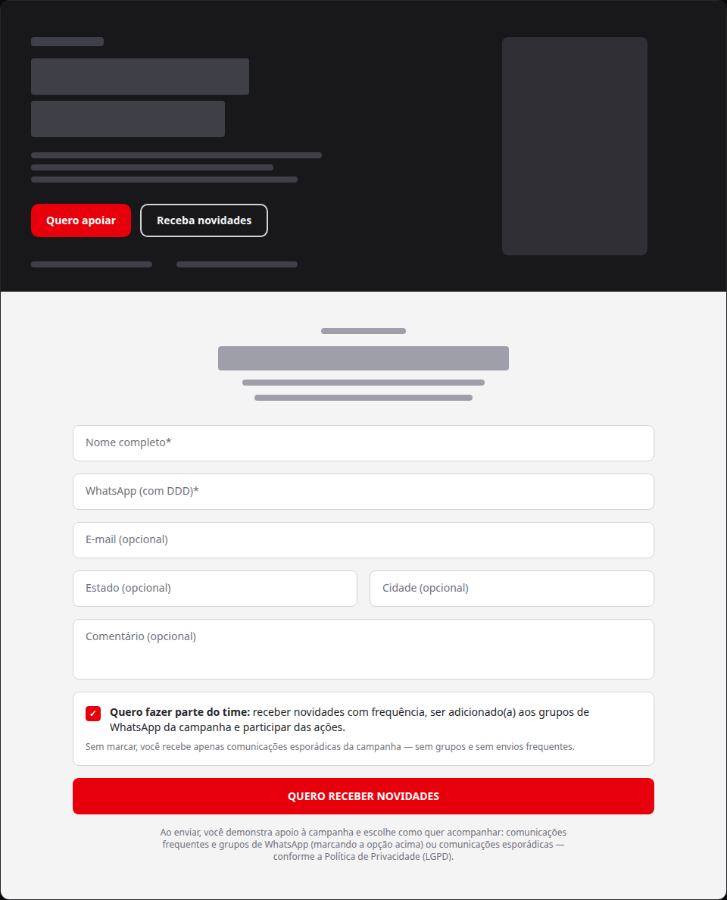
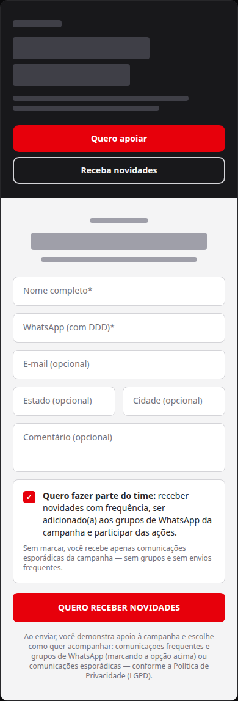
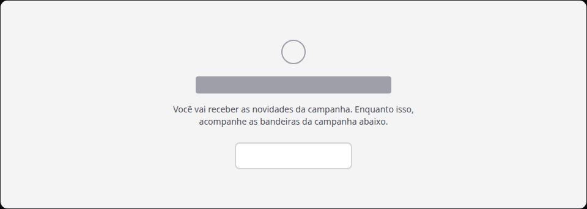

# Captura de novidades da campanha na home pública

Status: registrado
Atualizado em: 2026-08-19
Issue: #93
Priority: P1
Model: composer-2.5
Impeccable: B — encaixe na home de campanha (CTA do hero + nova seção de captura)
Rascunho UI: docs/plans/captura-novidades-home-campanha-ui-draft.html + PNGs embutidos abaixo
Appetite: ~1–1,5 dia eng; seção de captura na home + CTA no hero + ação transacional com consentimento novo fail-closed
Responsável: —

## Intenção

O site público de campanha (home `jorgesolla1313.com.br`) hoje converte visitante em **doação** (CTA "Quero apoiar") e em **comunidade WhatsApp** (`/mandato-no-whatsapp`), mas não captura o visitante que demonstra apoio e quer acompanhar a campanha sem necessariamente doar. Sem esse degrau, o tráfego orgânico e pago da home sai sem deixar contato, e o time não tem lista própria de interesse para comunicações (novidades, agenda, ações) e para grupos de WhatsApp da campanha. A campanha está em janela eleitoral (propaganda iniciada 16/08, 1º turno 04/10) — cada visitante não capturado é audiência perdida para as semanas decisivas.

A captura tem dupla função, confirmada com produto: o contato é **um sinal de apoio** a Solla (a pessoa se dispõe a receber comunicações da campanha) **e** a porta de entrada para comunicações por e-mail **ou inclusão em grupos de WhatsApp da campanha** — por isso o telefone é campo obrigatório.

## Persona e fluxo

- **Persona / contexto:** visitante da home de campanha (eleitor simpatizante ou indeciso que quer acompanhar), navegando no celular ou no desktop; demonstra apoio deixando o contato para receber comunicações.
- **Job principal:** deixar o contato em segundos (nome + WhatsApp) para receber novidades da campanha, sem sair da página, escolhendo o nível de engajamento.
- **Fluxo desejado:**
  1. Chega na home e vê o CTA secundário do hero apontando para a captura (substitui "Conhecer bandeiras").
  2. Preenche nome + WhatsApp (obrigatórios) e, opcionalmente, e-mail, estado, cidade e comentário, numa seção da própria home.
  3. Decide o nível de engajamento num toggle **pré-selecionado** "Quero fazer parte do time": marcado = comunicações frequentes + inclusão em grupos de WhatsApp da campanha + participação nas ações; desmarcado = apenas comunicações esporádicas, sem grupos e sem envios frequentes.
  4. Envia; a seção vira confirmação in-place ("Inscrição confirmada").
  5. O registro vira um contato com consentimento próprio **e a escolha do toggle gravada** (nível "time" vs "esporádico"), visível no admin junto das demais listas públicas.
- **Anti-goals de produto:** segundo cadastro de pessoa paralelo a `Contact`; gravar `supporter` (registro nominal interno da campanha — bloqueado pelo lote jurídico da Onda 0; este fluxo é captura pública com consentimento próprio, não o registro de apoiador interno); virar mini-CRM com segmentação/fase do funil; mesclar com o fluxo `/mandato-no-whatsapp` (comunidade do mandato, consentimento `whatsapp-inscricao` — canal e semântica diferentes).

### Rascunho UI (B)

Fonte iterável: `docs/plans/captura-novidades-home-campanha-ui-draft.html`.

## Objetivo e aceite

- Visitante da home consegue demonstrar apoio e deixar **nome + WhatsApp** (obrigatórios) para receber comunicações da campanha, com e-mail, estado, cidade e comentário opcionais, e confirmação imediata na própria página.
- **Toggle "Quero fazer parte do time" pré-selecionado**: marcado = comunicações frequentes + inclusão em grupos de WhatsApp da campanha; desmarcado = apenas comunicações esporádicas (sem grupos, sem envios frequentes). A **escolha fica gravada no registro** — o admin distingue quem é "time" de quem é "esporádico".
- O CTA secundário do hero ("Conhecer bandeiras") vira o atalho para a seção de captura — as bandeiras continuam acessíveis na navegação da própria home (âncora `#bandeiras` já existe; o fluxo de captura não pode escondê-las).
- O registro é gravado como contato + vínculo de assinatura com **consentimento novo** (não reutiliza `whatsapp-inscricao`), no padrão fail-closed dos fluxos públicos existentes: sem o(s) texto(s) de consentimento aprovado(s) configurado(s) no admin, o form recusa a captura (nenhum dado é gravado).
- O(s) texto(s) do consentimento cobre(m) os dois níveis — "fazer parte do time" (comunicações frequentes + grupos de WhatsApp) e "esporádico" — aprovado(s) pelo jurídico antes da ativação.
- Guardrail LGPD: nenhuma captura antes do(s) documento(s) de consentimento (chave estável nova) existir(em) no admin — o executor resolve por chave, não por ID; a estrutura exata do consentimento (um texto com dois níveis vs. dois textos) é decisão de implementação junto do jurídico.

## Dados (intenção)

- **Vou apresentar dados?** Não — a captura é o dado; o consumo (quantidade de inscritos, crescimento) é leitura do admin existente, sem superfície nova.

## Direção no codebase (hipótese)

- **Áreas prováveis:** home `src/app/(frontend)/(home)/page.tsx` (nova seção + composição), hero `src/components/CampaignHero.tsx` (troca do CTA secundário), componente de formulário cliente em `src/components/` no padrão `WhatsappForm` (campos `NameInput`/`PhoneInput`/`EmailInput`/`StateSelect`/`CitySelect` já existem e são reutilizáveis), action em `src/app/(frontend)/actions/` no padrão `submitWhatsapp` (transação `Contact` + `Subscription` com consent por chave estável, `requireConsentByKey` fail-closed), chave nova em `src/lib/campaignConsentKeys.ts`.
- **Precedente a olhar:** `src/app/(frontend)/actions/submitWhatsapp.ts` (transação + consent), `src/components/WhatsappForm.tsx` (form e inputs), `src/lib/schemas/whatsapp-form.ts` (schema base `contactSchema` — obrigatoriedade difere: aqui nome + telefone), `/mandato-no-whatsapp` (página irmã — **não** mesclada nesta fatia).
- **Risco de acoplamento:** a home é superfície compartilhada do trilho S (últimos itens S1–S6) — toca o mesmo arquivo que o item S8 (pixel) tocará; serializado por dependência.

## Dependências

- Nenhuma dura. **S10** (pixel da home) depende deste item para disparar `Lead` no sucesso do form.

## Fora de escopo

- Mescla com `/mandato-no-whatsapp` ou reuso do consentimento `whatsapp-inscricao`.
- Gravação em `supporter` (registro nominal interno da campanha) — permanece bloqueado pelo lote jurídico da Onda 0.
- Segmentação, tags de interesse, double opt-in por e-mail, integração com ferramenta de e-mail marketing — anotar como gatilho futuro se marketing pedir.
- Redesign do hero ou da home (mudança de um CTA + uma seção).

## Rabbit holes de produto

- **Mini-CRM.** Se alguém "só completar": campos extras, segmentação, fases de funil. **Corte neste item:** os 6 campos do rascunho (nome + WhatsApp obrigatórios; e-mail, estado, cidade, comentário opcionais) e nada mais; o vínculo reutiliza o modelo de assinatura existente.
- **"Já que o telefone é obrigatório, vira apoiador do sistema interno".** Puxa o registro nominal bloqueado juridicamente. **Corte:** o registro vive nas listas públicas de contato/assinatura com consentimento próprio; `supporter` só quando o lote jurídico liberar.
- **"Um consentimento só para tudo" ou "dois consents mas um só registro".** A escolha do toggle tem que sobreviver no dado, senão o time não sabe quem pode entrar em grupo. **Corte:** a escolha fica gravada e visível no admin; a forma (um texto com os dois níveis vs. dois textos) é decisão de implementação com o jurídico.
- **Form igual ao do WhatsApp.** Copiar a semântica do "comunidade do mandato" arrasta canal e consentimento errados. **Corte:** consentimento novo; fluxos permanecem irmãos, não gêmeos.
- **Double opt-in / verificação de e-mail.** Vira infraestrutura de e-mail marketing. **Corte:** confirmação in-place sem envio de e-mail; gatilho futuro se marketing pedir.

## Questões em aberto (produto)

- **Texto(s) do consentimento?** Novo texto cobrindo os dois níveis — "fazer parte do time" (comunicações frequentes + grupos de WhatsApp + participação nas ações) e "esporádico" (comunicação direta, sem grupos/sem frequência) — com chave estável nova, resolvida fail-closed. **Recomendação:** o jurídico aprova o(s) texto(s) e o admin cria o(s) documento(s) antes da ativação — o app não captura sem ele(s); a chave exata e a estrutura (um vs. dois textos) ficam para a implementação junto do jurídico. _(decisões de campos/local/toggle/Lead já confirmadas com produto em 2026-08-19; só o texto jurídico fica pendente de aprovação)_

## Referências

- Rascunho UI (gate): `docs/plans/captura-novidades-home-campanha-ui-draft.html` + PNGs embutidos acima
- `src/app/(frontend)/actions/submitWhatsapp.ts` — padrão de escrita transacional com consent fail-closed
- `src/components/WhatsappForm.tsx`, `src/lib/schemas/whatsapp-form.ts` — padrão de form cliente e schema
- `src/lib/campaignConsentKeys.ts` — keys estáveis existentes
- `src/components/CampaignHero.tsx` — CTA "Conhecer bandeiras" (linha ~104–114) a substituir
- `AGENTS.md` — `Contact` como pessoa normalizada + joins, consentimento por chave estável, transações multi-collection, bloqueio jurídico de `supporter` (Onda 0)
