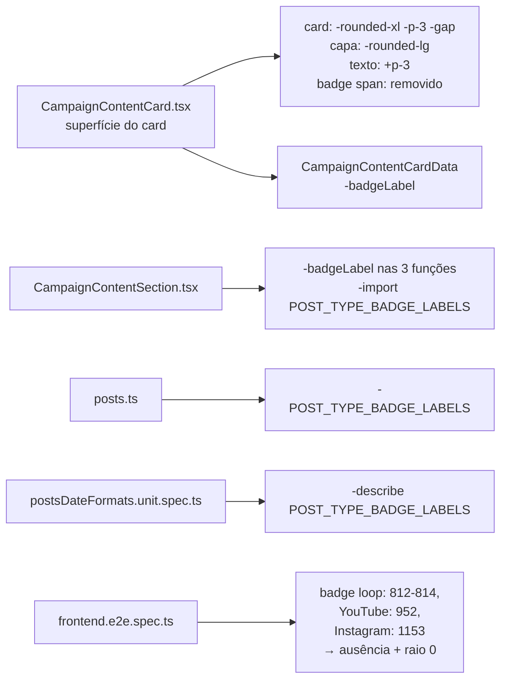

# Impl: Cards da seção "Acompanhe de perto": sem cantos arredondados, imagem de borda a borda, chip removido

Status: aprovado
Atualizado em: 2026-08-19
Issue: #90
Intenção: docs/plans/cards-acompanhe-de-perto-polimento.md
Appetite restante: herdado (~0,5–1 dia; na prática, horas)

## Leitura da intenção

- **Outcome:** os cards da seção "Acompanhe de perto" (bento 1+4 no desktop, carrossel no mobile) passam a ter cantos retos (card e capa), capa de borda a borda, **sem borda e sem sombra no card** (decisão do humano em 2026-08-19, após o gate — estende o rascunho, que mantinha `border`/`shadow`) e nenhum chip de badge — nem tipos de post do site, nem origens externas (decisão B do gate). O texto interno (título, subtítulo, meta) continua com o respiro atual (`p-3`) em relação às bordas.
- **O que NÃO negociar:** nada além da superfície muda — compartilhamento (S4) usável no canto, grade do bento, carrossel, links, bandas do S5 (borda/background da seção) e o fail-closed da seção (some inteira quando nada é visível). Nada de tokens de cor, capas reais, proporções ou outras seções.
- **O que reavaliar:** a hipótese da intenção ("mover o padding para o bloco de texto e remover o badge; dados de badge tendem a ficar órfãos — o executor decide o que descartar"). Confirmado no código: `badgeLabel` vive só no card + nas três funções de mapeamento da seção + `POST_TYPE_BADGE_LABELS` (com um unit test dedicado). Decisão de engenharia: remover os órfãos por completo (tipo do card, constante e teste unitário) — manter morto seria dead code flagrável pelo knip (CI-blocking).

## Abordagem recomendada

**Opções consideradas:** A (superfície no card único + remoção dos órfãos) | B (variante/flag de card, ex. `variant="flat"`) | C (manter `POST_TYPE_BADGE_LABELS` e o badge no DOM com CSS oculto)
**Recomendação:** A — o card é o único componente da seção (bento e carrossel reusam `CampaignContentCard`); não há outro consumidor com cantos arredondados para preservar, então uma variante seria abstração sem dono. A remoção dos dados de badge é limpa: `badgeLabel` não é usado em mais nenhum lugar do repo.
**Rejeitadas:** B (over-engineering: nenhum outro card usa o componente; "edit the owner, don't twin"); C (dead code + dead data path; knip derruba o CI e o teste unitário continuaria pinando um contrato morto).

### Componentes / mudanças

- **`CampaignContentCard.tsx`** (`src/components/`): `cardClassName` vira constante sem `featured` (o único uso do param era o `gap-3`/`gap-2`; `featured` continua dirigindo `sizes` da imagem e o `h3`): `flex h-full flex-col bg-white transition-shadow ...` — sem `rounded-xl`, sem `p-3`, sem `gap`, **sem `border border-(--campaign-line)` e sem `shadow-sm`/`hover:shadow-md`/`transition-shadow`**. Capa: remove `rounded-lg` (mantém `overflow-hidden` — o zoom hover continua contido na própria capa). Bloco de texto: ganha `p-3` (`flex flex-1 flex-col gap-1 p-3`), igual ao draft. Badge `` removido; `badgeLabel` sai de `CampaignContentCardData`. O anel de foco (`focus-visible:ring-2 ring-(--pt-red)`) do link permanece — a11y.
- **`CampaignContentSection.tsx`** (`src/components/`): `badgeLabel` removido de `toArticleCardData`/`toVideoCardData`/`toInstagramCardData`; import `POST_TYPE_BADGE_LABELS` removido. Nada mais muda (limites, mesclagem, capas, metas).
- **`src/utilities/posts.ts`**: deleta `POST_TYPE_BADGE_LABELS` (único consumidor era a seção; `POST_TYPE_LABELS` plural fica — usado nas listagens).
- **`tests/unit/postsDateFormats.unit.spec.ts`**: import e describe de `POST_TYPE_BADGE_LABELS` removidos.
- **Migration:** sem migration (nenhuma mudança de schema/coleção).
- **Access / Consent:** nenhum.
- **UI:** Impeccable B — encaixe em um componente existente (shape→craft→critique→polish). O botão `ContentShareButton` (S4) segue `absolute top-2 right-2` sobre a capa, agora sem moldura; o draft mantém o botão no canto — sem mudança nele.

### Dados → forma (se aplicável)

- N/A — nenhum dado novo; apenas remoção de um campo de superfície (`badgeLabel`) do tipo de dados do card.

## Fases verificáveis

1. **Superfície + órfãos** — `CampaignContentCard.tsx`, `CampaignContentSection.tsx`, `posts.ts`, unit test do badge; verificação: `pnpm typecheck` + `pnpm test:unit` (o describe removido some, o resto passa).
2. **e2e** — `tests/e2e/frontend.e2e.spec.ts`: loop de badges (812–814) e as asserções `YouTube`/`Instagram` (952, 1153) → asserções de ausência (`toHaveCount(0)` para os quatro tipos + YouTube/Instagram nos testes de feed) e pin do novo visual no teste do bento (`border-radius: 0px` no card e na capa, `border-top-width: 0px` e `box-shadow: none` no card, no mesmo espírito dos pins CSS do S5). `toHaveCSS` com `first()` para não quebrar com o carrossel escondido no mobile.
3. **Gates** — `pnpm lint`, `pnpm format:check`, `pnpm exec knip`, `pnpm check:cycles`, `pnpm test` (unit+int). E2e roda no CI (OPS59) — local opcional com `pnpm test:e2e:affected`.

## Rabbit holes / Não escopo (engenharia)

- Não tocar `ContentShareButton`, `CampaignContentCarousel`, banda/bordas da seção (S5), `POST_TYPE_LABELS` (plural), `getVisiblePosts`/fail-closed ou capas. O rascunho HTML do gate fica intocado como artefato — a remoção de borda/sombra é decisão do humano posterior ao gate e não altera o arquivo do rascunho.
- Não criar variante de card, não esconder badge via CSS, não renomear `h3`/metas.
- Cuidado com o `gap` removido: o `mt-auto` da meta continua pinando a data ao rodapé do bloco; o `p-3` do bloco de texto é quem dá o respiro (draft).

## Riscos e mitigação

- **e2e que assere badge que não mapeei** — verificado por grep: só 812–814 (loop), 952 (YouTube) e 1153 (Instagram) no `frontend.e2e.spec.ts`; `waitForHomeHTML` só usa títulos/links de cabeçalho. Grep final antes do push.
- **Raio 0 pinado pelo e2e pode flake por arredondamento** — `toHaveCSS('border-radius', '0px')` é determinístico (nenhum token de raio no card/capa).
- **Dead code residual** — `POST_TYPE_BADGE_LABELS` e `badgeLabel` removidos do mesmo PR; knip no gate confirma.
- **Capa sem cover (placeholder `--campaign-band`)** — continua com borda a borda e cantos retos, igual ao draft; nada quebra.

## Aceite de engenharia

- [ ] Aceite de produto da intenção ainda coberto (raio 0 card+capa, capa borda a borda, texto `p-3`, nenhum chip em nenhum card, **sem borda e sem sombra no card**)
- [ ] Invariantes AGENTS/engineering-standards (card único como dono da superfície; S5/bandas intocadas; fail-closed da seção intacto)
- [ ] Testes de domínio previstos (unit/int) onde access/write paths mudam — N/A (nenhum write path muda); e2e atualizados para o novo estado visual
