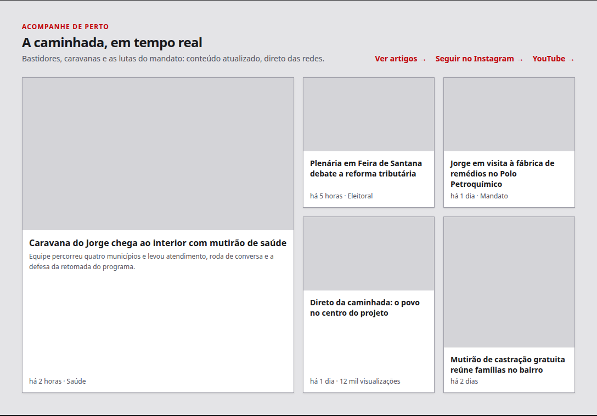
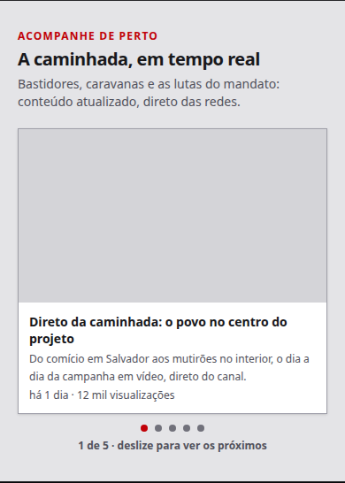

# Cards da seção "Acompanhe de perto": sem cantos arredondados, imagem de borda a borda, chip removido

Status: rascunho
Atualizado em: 2026-08-19
Issue: #90
Priority: P2
Model: composer-2.5
Impeccable: B — encaixe nos cards da seção "Acompanhe de perto" da home pública (jorgesolla1313)
Rascunho UI: docs/plans/cards-acompanhe-de-perto-polimento-ui-draft.html + PNGs embutidos abaixo
Appetite: ~0,5–1 dia de eng — CSS em um componente + ajuste de teste
Responsável: —

## Intenção

Os cards da seção "Acompanhe de perto" (a home de campanha, bento 1+4 no desktop e carrossel no
mobile) ficaram com cara de "card de app": cantos arredondados, imagem de capa emoldurada por um
respiro de padding e um chip "Notícia" repetido em todo post do site. O desejo é um look mais
editorial e direto: **cantos retos**, **imagem de capa de borda a borda no card** e **chips de
badge removidos de todos os cards** (posts do site e origens externas — decisão do gate) — o
texto interno continua com respiro em relação às bordas do card. Nada além disso muda: o mesmo
componente serve o bento e o carrossel, e a mudança vale para os dois.

## Persona e fluxo

- **Persona / contexto:** visitante da home pública de campanha, navegando no celular ou desktop;
  rola até a seção "Acompanhe de perto" e escaneia os cards.
- **Job principal:** ver o conteúdo de relance — a imagem é o chamariz, o título e a data seguem
  abaixo, sem ruído de etiqueta repetida.
- **Fluxo desejado:** a seção abre como hoje; cada card mostra a capa em tela cheia, cantos retos,
  e o texto respira da borda; nenhum chip de badge polui a leitura; o compartilhamento (S4) segue
  disponível no canto.
- **Anti-goals de produto:** não redesenhar a seção (banda de fundo do S5, textos, links e
  carrossel seguem iguais); não mexer em outras seções da home; não mudar tokens de cor ou o
  comportamento fail-closed da seção.

### Rascunho UI (B/C/D)

Cena 1 (desktop — bento 1+4): cards sem raio, capa de borda a borda, texto com `p-3`, nenhum
chip de badge em nenhum card:

Cena 2 (mobile ~390px — carrossel): mesmo card do carrossel, capa de borda a borda, sem chip:

## Objetivo e aceite

- Nenhum card da seção tem cantos arredondados — nem o card, nem a capa (desktop e mobile).
- A capa encosta nas bordas superior/laterais do card (sem padding no contêiner do card); o texto
  (título, subtítulo, meta) tem padding interno consistente com o respiro atual (`p-3`) em relação
  às bordas do card.
- O chip de tipo do post do site ("Notícia" e os demais tipos de post) some dos cards de posts —
  e, por decisão do gate, os chips de origem externa (YouTube/Instagram) também são removidos:
  nenhum chip de badge aparece em nenhum card.
- O compartilhamento (botão de canto, S4), a grade do bento, o carrossel, os links e o
  comportamento fail-closed da seção continuam funcionando; o e2e que assere os textos de badge
  (`tests/e2e/frontend.e2e.spec.ts`, loop de `Artigo|Notícia|Campanha|Evento`) é atualizado para o
  novo estado visual (e o e2e dos feeds externos, se asserir "YouTube"/"Instagram" na seção).

## Dados (intenção)

- **Vou apresentar dados?** Não — nenhum número novo; só a superfície dos cards muda.

## Direção no codebase (hipótese)

- **Áreas prováveis:** `src/components/CampaignContentCard.tsx` (único componente de card —
  classes `rounded-xl`/`rounded-lg` do card e da capa, `p-3` do contêiner, `span` do badge no
  canto superior esquerdo da capa; mover o padding para o bloco de texto e remover o badge); o
  carrossel (`CampaignContentCarousel.tsx`) herda a mudança por reuso do mesmo card; os dados de
  badge (`badgeLabel` em `CampaignContentSection.tsx` / `POST_TYPE_BADGE_LABELS` em
  `src/utilities/posts.ts`) tendem a ficar órfãos com a remoção de todos os chips — o executor
  decide o que descartar sem quebrar os e2e.
- **Precedente a olhar:** `docs/plans/separacao-visual-secao-conteudos-home.md` (S5 — banda da
  seção, que não deve ser tocada) e `docs/plans/secao-conteudos-home-artigos.md` (S1).
- **Risco de acoplamento:** o e2e da home (`tests/e2e/frontend.e2e.spec.ts`) assere os textos de
  badge na seção; o `ContentShareButton` vive no canto do card e deve continuar usável sobre a
  capa sem padding.

## Dependências

- Nenhuma (S1–S6 entregues e em produção).

## Fora de escopo

- Remover borda ou sombra dos cards (não pedido — a definição contra a banda do S5 continua).
- Mudar textos, links, ordem, capas reais, proporção das capas ou o carrossel em si.
- Polimento de outras seções da home ou tokens de cor.

## Rabbit holes de produto

- **"Já que os cards ficaram retos, aproveita e redesenha a seção".** Explosão: nova paleta,
  microinterações, outras seções. **Corte neste item:** só raio, padding do card e chip.

## Questões em aberto (produto)

- **Qual o alcance da remoção do chip?** **Decidido no gate (2026-08-19): B — remover todos os
  chips, incluindo YouTube/Instagram** (a identificação da plataforma de origem deixa de aparecer
  no card; o link externo segue sinalizado por abrir em nova aba).

## Referências

- Rascunho UI (gate): `docs/plans/cards-acompanhe-de-perto-polimento-ui-draft.html` + PNGs acima
- `src/components/CampaignContentCard.tsx` — card único (bento + carrossel)
- `src/components/CampaignContentSection.tsx` — montagem da seção (badges por fonte)
- `src/components/ContentShareButton.tsx` — controle de compartilhar do canto (S4, intocado)
- `tests/e2e/frontend.e2e.spec.ts` — asserções de badge da seção a atualizar
