# Impl: S32 — Analytics dos cards personalizados: quantos e quais

Status: aprovado (--auto)
Atualizado em: 2026-09-23
Issue: #1273
Intenção: docs/plans/cards-analytics.md
Design UI (gate): docs/plans/cards-analytics-ui-design.html
Appetite restante: herdado (~0,5–1 dia eng). Corte explícito para caber: um contador por modelo (sem drill-down por dobradinha no v1), sem estado visual novo para a falha da agregação (D7), uma query de agregação por render da home e nenhum widget compartilhado alterado. Fases: server/schema ~55%, UI ~30%, gates ~15%.

## Leitura da intenção

- **Outcome:** o download de qualquer card (6 modelos) conta **um** evento anônimo "Download do card" com o model id — e, nos modelos com escolha estadual (`time-do-estadual`, `minha-colinha`), também o slug do estadual escolhido; a home staff `/campanha` mostra um bloco compacto "Cards" com o contador absoluto de cada modelo, lado a lado, na ordem natural do catálogo.
- **O que NÃO negociar:**
  - **Anonimato fail-closed:** sem PII, sem IP persistido, sem cookie/identidade, sem user-agent, sem rastreio entre páginas/modelos; nenhum `Consent` novo.
  - **Fail-soft absoluto:** o download nunca é bloqueado nem atrasado; falha da contagem é invisível ao visitante; contador a menos é aceitável.
  - **Mesmo mecanismo do C213:** nenhuma collection/endpoint/serviço paralelo; o card é `subjectType: 'card'` da mesma `contentEvent` e da mesma rota.
  - **Só o download concluído:** abertura de galeria, prévia renderizada e estúdio não contam; a foto/recorte local não é tocada.
  - **Honestidade:** os números medem downloads, não pessoas; sem total, %, série, ranking, funil/pageview, dashboard ou rota nova.
- **O que reavaliar (hipóteses da "Direção no codebase", checadas):**
  - O ponto observável do download é único: `handleDownload` (`CardComposer.tsx:576-590`) depois de `downloadBlob`, e os dois CTAs (`:1180-1193` colinha, `:1200-1207` step result) convergem nele; `model.id` e `selectedDeputy?.slug` estão no closure.
  - O slug do estadual **não tem onde viver** hoje: a `contentEvent` (`ContentEvent.ts:50-81`) só tem `type`/`subjectType`/`subjectId` e a migration `20260923_172437_add_content_events.ts:6-15` não tem `variant` → este item exige coluna nova (D2).
  - `CampaignMetricStrip` **não** entrega a composição do artefato (só até 4 colunas, células `flex-col`, sem caixa de vazio/caption) — é molde, não contrato (D6).
  - A superfície e o gate existem: `page.tsx:49-56` só carrega o resumo para `staff = isStaffCampaignRole`; leader nunca vê; communicator é redirecionado antes (D9).
  - O manifest e2e precisa de **uma** entrada nova: o mapper da home nasce em `src/lib/card*` (prefixo que acorda só `frontend`, o site público) e não acorda a família da home (D8).

## Abordagem recomendada

```mermaid
flowchart LR
  V["Visitante anônimo"] -->|"baixa o PNG (2 CTAs convergem)"| H["CardComposer.handleDownload"]
  H -->|"após downloadBlob · sendCardDownloadEvent(model.id, slug?)"| API["POST /api/content-events"]
  API -->|"same-origin → schema → limiter → catálogo (getCardModel/getStateDeputyCard)"| REC["recordContentEvent · Local API overrideAccess"]
  REC --> CE[("contentEvent · subjectType=card · subjectId=modelId · variant=slug do estadual")]
  CE --> AGG["loadContentEventCountsBySubject — 1 query · 6 ids"]
  AGG --> L["loadCampaignHomeSummary → CampaignHomeSummaryView.cardDownloads"]
  L --> UI["CampaignHomeCardDownloads · bloco 'Cards' no summarySlot (staff)"]
  API -.->|"variante peça: inalterada"| REC
```

**Opções consideradas (abordagem geral):** A) estender o mecanismo C213 ponta a ponta (variante aditiva na mesma rota + coluna `variant` nullable + wrapper de beacon + mapper/agregação reusados + bloco novo na home); B) analytics de cards próprio (collection/rota/agregação novos); C) serviço externo de eventos customizados.
**Recomendação:** **A** — o C213 já entregou a collection, o writer, o limiter, a rota e a agregação parametrizada por `subjectType`; o S32 é a extensão aditiva prevista (o vocabulário já tem `card`). Cabe no appetite sem nenhum serviço novo e mantém a privacidade fail-closed.
**Rejeitadas:** **B** porque a intenção veda explicitamente o segundo analytics e o C213 nasceu genérico para não haver retrabalho; **C** porque soma um serviço ao homeserver e ainda exigiria eventos customizados por modelo — reavaliar só se a pergunta virar funil/pageview (fora desta fatia).

### D1 — Extensão do contrato público

**Opções:** A) variante aditiva na mesma rota `POST /api/content-events` (card discriminado por `cardModelId`), reusando same-origin, limiter e teto de body; B) rota nova `/api/card-events`; C) segunda collection; D) aceitar `subjectType`/`subjectId` arbitrários do cliente.
**Recomendação:** **A** — o cliente manda chaves públicas (`cardModelId` + `stateDeputySlug?`) e o servidor valida contra o catálogo fechado (`isCardModelId`/`getCardModel`, `getStateDeputyCard`) — nunca aceita id arbitrário. O contrato de peça (`{ type, pieceSlug }`) fica byte-compatível; exatamente um assunto por body; card só aceita `type: 'download'` no v1.
**Rejeitadas:** **B** porque duplicaria same-origin/limiter/schema/body bounded sem cobertura nova; **C** porque a intenção e o C213 vedam collection paralela; **D** porque qualquer um inflaria contador de modelo arbitrário (o catálogo é enum de 6; o gate de publicação da peça não existe aqui, o catálogo é o gate).

### D2 — Persistência do slug do estadual

**Opções:** A) coluna nullable `variant` (text) em `content_event` via migration; B) compor o slug no `subjectId` (ex. `time-do-estadual:julio`); C) não persistir (só o model id).
**Recomendação:** **A** — o C213 previu explicitamente a extensão ("S32 adiciona coluna nullable por migration quando precisar"); `subjectId` continua sendo o model id (chave do contador por modelo e do índice composto) e o slug vive ao lado. Migration aditiva, sem índice novo — nada lê `variant` no v1 e índice para leitura futura é migration própria. **Item que continua parando mesmo em `--auto`:** criar/aplicar migration exige confirmação humana (§Modo autônomo da skill) — o executor pausa antes de `pnpm migrate:create`/`pnpm migrate` e só segue com o OK.
**Rejeitadas:** **B** porque quebraria o agrupamento por modelo (a agregação é `GROUP BY subject_id, type`) e transformaria o slug em parte da chave; **C** porque viola o aceite ("o evento leva também o slug do estadual escolhido") e joga fora o sinal que a coordenação pediu.

### D3 — Tipo do evento

**Opções:** A) reusar `download` do vocabulário existente (subjectType `card` distingue); B) novo tipo `download_card` no enum (migration de enum).
**Recomendação:** **A** — o tipo descreve o ato e o assunto descreve o objeto; a agregação já agrupa por `(subject_id, type)` dentro de `subject_type`, então não há ambiguidade e o vocabulário fica estável. Zero migration de enum.
**Rejeitadas:** **B** porque infla o vocabulário sem ganho de leitura e exigiria migration de enum desnecessária (mais um stop).

### D4 — Transporte client

**Opções:** A) estender o dono `src/lib/contentEvents.ts` com um wrapper tipado de card (DRY do beacon sendBeacon/keepalive); B) módulo paralelo `src/lib/cardEvents.ts`; C) `fetch` direto no `CardComposer`.
**Recomendação:** **A** — o transporte (sendBeacon → fallback `fetch keepalive`, nunca lança, nunca atrasa) vira um envio único privado usado pelos dois wrappers; `sendContentPieceEvent` fica intacto e `sendCardDownloadEvent(modelId, stateDeputySlug?)` é novo. Uma fonte de comportamento de rede, um pin de "nunca lança".
**Rejeitadas:** **B** porque duplicaria o dono do mesmo beacon (segundo caminho para o mesmo endpoint); **C** porque espalharia a regra de fail-soft no componente e o pin de transporte ficaria sem dono.

### D5 — Agregação e mapper

**Opções:** A) reusar `loadContentEventCountsBySubject` (1 query, 6 ids, `subjectType: 'card'`) + mapper puro novo em `src/lib/` (ordem natural do catálogo, estados); B) reusar `contentPieceCirculation` (mapper de peça); C) rollup persistido.
**Recomendação:** **A** — a agregação do C213 é parametrizada por `subjectType` justamente para o S32; o mapper de peça tem semântica de peça (id numérico, quatro contadores, `neverPublished`, zeros × histórico) e não serve ao card (id é o model id, um contador só, o vazio tem desenho próprio). O mapper novo é puro: `cardDownloadCountsFromRows` (ignora `type ≠ download` e ids fora do catálogo; normaliza inteiros ≥ 0) e `resolveCardDownloadCounts` com `data | empty | unavailable`; os literais do design moram nele (uma fonte, unit-pinned).
**Rejeitadas:** **B** porque forçaria condicionais de card dentro do mapper de peça (acoplamento errado e teste de peça a mexer); **C** porque perde o evento cru e adiciona upsert/lock para um contador de 6 linhas.

### D6 — Superfície

**Opções:** A) estender `loadCampaignHomeSummary` + componente novo em `src/components/campaign/dashboard/` portando o artefato classe-a-classe; B) estender `CampaignMetricStrip` (6 colunas + layout em linha + vazio); C) improvisar no markup.
**Recomendação:** **A** — `CampaignMetricStrip` é molde, não contrato: é `flex-col` (rótulo acima do valor), conhece no máximo 4 colunas (`gridColsBySize`) e não tem caixa de vazio nem caption; estendê-lo mexeria num widget compartilhado (E8 etc.) para um caller. O componente novo (`CampaignHomeCardDownloads`) porta o artefato: `dl` com 6 colunas ≥ `sm`, linhas rótulo-esquerda/valor-direita `< sm` com `min-height: 58px` e separadores, `tabular-nums`, caption de honestidade sempre visível, caixa vazia honesta; tokens `bg-card`, `ring-foreground/10`, `text-muted-foreground`, `rounded-xl`. A seção entra **depois** do resumo, dentro do mesmo `summarySlot` (a página compõe os dois componentes), sem reestruturar o `CampaignHomeSummary` — o resumo no artefato é contexto e a crítica final (trigger c) decide qualquer ajuste de separação. As pílulas "VALORES FICTÍCIOS DO GATE"/"EXEMPLO" do artefato **não** são copy de produção.
**Rejeitadas:** **B** pelo churn no widget compartilhado e pela estrutura errada (não produz o layout do artefato); **C** porque o implementador não decide estrutura visual (§Design da execution-pipeline).

### D7 — Estado de falha da agregação

**Opções:** A) estado "indisponível" desenhado — o designer estende o artefato (trigger a) antes do markup; B) omitir a seção inteira quando a agregação falha (fail-soft sem estado novo); C) renderizar o vazio ("Nenhum download ainda") na falha.
**Recomendação:** **B** — a falha não é um dado: o bloco é acessório e a ausência não afirma nada (não pode ser confundida com "Nenhum download ainda", que segue reservado aos zeros reais); evita um estado visual novo para uma leitura degradada rara e não inventa estrutura. O domínio mantém `unavailable` distinto de `empty` (unit-pinned) e o componente devolve `null` — quando o produto quiser ver "indisponível", o estado já existe e o designer estende (trigger a).
**Rejeitadas:** **C** porque é mentira (a intenção veda); **A** porque custa uma extensão do artefato + estado novo para um caso raro que o appetite não pede — gatilho de revisitação registrado: leitura degradando com frequência ou pedido explícito de produto → trigger a.

### D8 — Testes e manifest

**Opções:** A) unit (mapper/transporte/componente) + int (rota/loader) + e2e estendendo `frontend` (download real) e `campaignHomeActions` (bloco na home), com entry nova no manifest para o mapper da home; B) família e2e nova `cardDownloads`; C) sem e2e (só unit/int).
**Recomendação:** **A** — as duas famílias existem e já cobrem as superfícies: `frontend` tem os downloads reais de card (`frontend.e2e.spec.ts:1848`, `:2035-2037`, `:2411`) e `campaignHomeActions` tem a home staff com sessão compartilhada e `campaign.fixtures.payload`. Unit cobre mapper (ordem/estados/literais) e transporte (nunca lança); int cobre o contrato HTTP (grava com `variant`; model id inválido, slug em modelo sem `stateDeputyPicker`, picker sem slug e slug desconhecido → 400 sem gravar; agregação `card` não vaza para `peca` nem o inverso) e o loader (data/empty/unavailable). E2E do download observa o POST com `page.waitForRequest`/`postDataJSON` (um modelo sem picker + `minha-colinha`/`time-do-estadual` com slug). E2E da home pina os 6 rótulos na ordem, a caption e o contador **≥ semeado** — contadores de card são globais por model id no DB compartilhado e a família `frontend` também dispara beacons de card no mesmo run; número exato seria flake, então exato fica no unit/int. Manifest: adicionar `src/lib/cardDownloadCounts.ts` aos prefixes da entry da home (`scripts/lib/e2e-affected-manifest.mjs:296-312`) — `src/lib/card` sozinho acorda só `frontend`, que não testa a home; schema/vocabulário/rota/collection já caem em `frontend`/`frontendConteudos` e `src/lib/schemas` é risk prefix já mapeado (sem `unmapped-risk`). Nota honesta: o PR inclui migration → `ci-scope` classifica `curated`; as famílias afetadas rodam local (discricionário) e no full do `verify` do deploy.
**Rejeitadas:** **B** porque pagaria project/manifest/fixtures por cobertura que A já dá (C213 fixou "estender, sem família nova"); **C** porque o POST na mesma rota é contrato HTTP alterado e o wiring do beacon só existe de ponta a ponta no browser.

### D9 — Acesso e papéis

**Opções:** A) herdar o gate de staff da home (bloco só no `summarySlot` de coordinator/advisor/candidate; leader nunca; communicator redirecionado antes); B) gate novo por role no loader; C) bloco para qualquer sessão de campanha.
**Recomendação:** **A** — a home já calcula `staff = isStaffCampaignRole(user.role)` e só carrega o resumo para staff; leader é lockdown e nunca vê o `summarySlot`; communicator é redirecionado para a vertical antes (`page.tsx:25-56`). O agregado é SQL cru sem access control (precedente C213) e o caller é o gate; advisor vê o bloco (é staff; a intenção pede coordenação **e** assessoria). Nenhum `Consent` novo — não há PII a consentir.
**Rejeitadas:** **B** porque duplicaria um gate existente e divergiria do comportamento da home; **C** porque exporia o bloco ao leader e a papéis sem home staff.

### D10 — Fechamento

**Opções:** A) uma entrada curta em `docs/changelog/2026-09-23-s32.md` + `Design tier:` no PR com a crítica final (trigger c) certificada antes do push; B) sem changelog; C) editar o agregado/HISTORY.
**Recomendação:** **A** — OPS44/OPS85: uma entrada por entrega, nunca o agregado (gerado/gitignored); e todo diff que muda estrutura visual fecha com a crítica do designer contra o app renderizado (390/1280 + estados críticos), com o tier no PR. `DEGRADED`/tier não-primário ⇒ **para** (não abre PR; comenta a Issue e flipa `blocked`).
**Rejeitadas:** **B** porque o registro commitado é o changelog; **C** porque o agregado é artefato gerado.

## Componentes / mudanças

**Schema / dados**

- **`src/collections/ContentEvent.ts`** (editar, `:50-81`): campo `variant` (text, opcional, label/description pt-BR — "slug do estadual nos modelos com escolha estadual; nunca um identificador de visitante"); nada de PII; sem hooks (não busta a tag pública); access intacto.
- **Migration:** `pnpm migrate:create add_content_event_variant` — coluna nullable `variant` em `content_event` (aditiva, sem índice novo); revisar o SQL, commitar `.ts`/`.json`/`index.ts`, rodar `pnpm migrate` + `pnpm generate:types` local. **STOP humano mesmo em `--auto`** antes de criar/aplicar.
- **`src/utilities/content/contentEventWrite.ts`** (editar, `:25-48`): `ContentEventInput` ganha `variant?: string`; grava `variant: event.variant ?? null`; o contrato "nunca lança/nunca atrasa" fica intacto.

**Contrato público**

- **`src/lib/contentEvents.ts`** (editar, `:60-99`): extrai o envio (sendBeacon → fallback `fetch keepalive`) para um único caminho privado e adiciona `sendCardDownloadEvent(modelId: CardModelId, stateDeputySlug?: string | null)` com corpo `{ type: 'download', cardModelId, stateDeputySlug? }`; `sendContentPieceEvent` inalterado; nunca lança.
- **`src/lib/schemas/contentEvent.ts`** (editar, `:18-25`): variante card aditiva — `{ type: 'download', cardModelId }` validado com `isCardModelId` (uma fonte) e `stateDeputySlug?` bounded (padrão de slug); contrato de peça inalterado; exatamente um assunto por body.
- **`src/app/(frontend)/api/content-events/route.ts`** (editar, `:70-99`): ramo card — `getCardModel` (id fora do catálogo → 400), `stateDeputyPicker` exige slug resolvido por `getStateDeputyCard` (faltando/desconhecido → 400), modelo sem picker rejeita slug → 400; grava `recordContentEvent({ type: 'download', subjectType: 'card', subjectId: modelId, variant: slug ?? null })`; mesmo `isSameOriginRequest`, limiter, body ≤ 4 KB e `204 no-store`; ramo peça intacto.

**Instrumentação (ponto único)**

- **`src/components/cards/CardComposer.tsx`** (editar, `handleDownload` `:576-590`): após `downloadBlob(blob, cardFileName(model.id))`, `sendCardDownloadEvent(model.id, selectedDeputy?.slug ?? null)` — fire-and-forget, sem bloquear/atrasar; erro de geração não conta; os dois CTAs (`:1180-1193`, `:1200-1207`) seguem convergindo no mesmo handler.

**Leitura / home**

- **`src/lib/cardDownloadCounts.ts`** (novo, puro/client-safe): ordem = `CARD_MODELS`; `cardDownloadCountsFromRows` (type-only de `contentEvents`); `resolveCardDownloadCounts` → `data | empty | unavailable`; literais do design (`CARD_DOWNLOAD_COUNTS_TITLE/SUBTITLE/CAPTION/EMPTY_TITLE/EMPTY_BODY/EMPTY_CAPTION`). Reusa `CARD_MODELS` (rótulo/ordem) e `ContentEventAggregateRow` (tipo).
- **`src/utilities/campaignDashboardData.ts`** (editar, `:231-264`): `loadCampaignHomeCardDownloads(payload)` exportado (1 query com `subjectType: 'card'`, os 6 ids; falha → `{ state: 'unavailable' }`); `CampaignHomeSummaryView` ganha `cardDownloads`; `loadCampaignHomeSummary` anexa. Reusa `loadContentEventCountsBySubject` e o mapper novo.
- **`src/components/campaign/dashboard/CampaignHomeCardDownloads.tsx`** (novo): porte classe-a-classe do artefato (strip/linhas/caption/caixa vazia); `unavailable` → `null` (D7); formata contagens com `formatElectionNumber` (mesmo formatador da home); sem `CampaignMetricStrip`.
- **`src/app/(campaign)/campanha/(app)/page.tsx`** (editar, `:49-56`): `summarySlot` passa a compor `CampaignHomeSummary` + `CampaignHomeCardDownloads view={summaryView.cardDownloads}`.

**Testes / manifest / changelog**

- **Unit:** `tests/unit/cardDownloadCounts.unit.spec.ts` (novo; ordem/estados/literais/normalização/ids fora do catálogo); `tests/unit/contentEvents.unit.spec.ts` (editar: pin de campos passa a `['type','subjectType','subjectId','variant']` sem PII; `sendCardDownloadEvent` corpo com/sem slug, beacon preferido, fallback, nunca lança); `tests/unit/campaignHomeCardDownloads.unit.spec.tsx` (novo; 6 rótulos na ordem, vazio desenhado, `unavailable` não renderiza "Nenhum download ainda"); `tests/unit/campaignHomeSummary.unit.spec.tsx` (editar: `view` ganha `cardDownloads`).
- **Int:** `tests/int/contentEvents.int.spec.ts` (editar, reusa o harness existente): POST card grava com `variant`; id inválido / slug em modelo sem picker / picker sem slug / slug desconhecido → 400 sem gravar; `card` não vaza para `peca` nem vice-versa; `loadCampaignHomeCardDownloads` data/empty/unavailable (mock de falha, padrão `mockResolvedValueOnce` do arquivo).
- **E2E:** `tests/e2e/frontend.e2e.spec.ts` (editar; família `frontend`) — observar o POST no download real (`waitForRequest` + `postDataJSON`) para um modelo sem picker e para `minha-colinha`/`time-do-estadual` com o slug; `tests/e2e/campaignHomeActions.e2e.spec.ts` (editar; família `campaignHomeActions`) — semear eventos card via `campaign.fixtures.payload.create({ collection: 'contentEvent', overrideAccess: true })`, pinar bloco/rótulos/caption e contador ≥ semeado, e líder sem o bloco.
- **`scripts/lib/e2e-affected-manifest.mjs`** (editar, entry da home `:296-312`): acrescentar `src/lib/cardDownloadCounts.ts` (o resto já cai nas entries existentes).
- **Changelog:** `docs/changelog/2026-09-23-s32.md` (uma entrada curta; nunca o agregado/HISTORY).

**Access / Consent:** nenhum gate novo — o bloco herda `isStaffCampaignRole` da home; leader nunca; agregado SQL sem access control com o caller como gate (precedente C213); **sem `Consent` novo** (não há PII a consentir) — fail-closed de privacidade.

### Dados → forma (pergunta 3 de `data-presentation`)

- **Forma escolhida:** seis contadores **absolutos** lado a lado, na ordem natural do catálogo — 6 colunas no desktop, linhas rótulo-esquerda/valor-direita no mobile, caption "Os números contam downloads, não pessoas ou visitantes únicos." sempre visível; antes do primeiro download, a caixa vazia honesta ("Nenhum download ainda") em vez de seis zeros. É a forma mais pobre que ainda desbloqueia as decisões da intenção (qual modelo divulgar/reforçar; se o funil de cards está sendo usado).
- **Rejeitadas:** total/soma de "usos" (esconde o modelo — a decisão é por modelo); %/participação (base anônima e desconhecida; sugere precisão inexistente); série/janela/gráfico (vira dashboard; o `createdAt` já habilita a janela como próximo passo, via migration); ranking (a ordem é a do catálogo, nunca placar); barra/heatmap (mesma razão do %); **drill-down por dobradinha no v1** (o slug é capturado para leitura futura, mas a superfície são os 6 modelos — ver design "Só seis modelos").
- **Honestidade do dado:** downloads ≠ pessoas; a superfície não sugere visitante único e não soma sinais.

## Fases verificáveis

1. **Tracer / schema+server — quota ~55%:** campo `variant` + migration (**STOP humano mesmo em `--auto`**) + `generate:types`; `recordContentEvent` com `variant`; variante card no schema/rota com validação de catálogo; wrapper `sendCardDownloadEvent` + call site no `CardComposer`; units e int verdes antes de seguir. Tracer bullet: baixar um card no dev gera 1 linha `subjectType: card`/`variant` e a agregação `card` devolve o contador.
2. **UI — quota ~30%:** mapper puro + `loadCampaignHomeCardDownloads` + `CampaignHomeSummaryView.cardDownloads`; componente novo portando o artefato classe-a-classe; composição no `summarySlot`; unit do mapper/componente verdes. `unavailable` não renderiza (D7).
3. **Gates — quota ~15%:** `pnpm gate:fast` por iteração; `pnpm test:int`; e2e local afetado (discricionário: `frontend` + `campaignHomeActions --workers=1`); **crítica final do designer (trigger c) certificada antes do push** com `Design tier:` no PR; changelog commitado; `pnpm push`; PR com `Closes #1273`; `*-impl.md` no commit da entrega.

## Rabbit holes / Não escopo (engenharia)

- **Drill-down por dobradinha no v1** — o `variant` é persistido (aceite) mas não vira segunda superfície/rota; leitura por slug é item próprio (gatilho: produto pedir "qual dobradinha").
- **Contar abertura de galeria/prévia/estúdio ou o clique** — só o pós-`downloadBlob` conta; o resto é abertura, não download.
- **Segundo mecanismo/collection/rota/serviço** — proibido; o card é `subjectType` da mesma `contentEvent`.
- **Índice em `variant` / rollup persistido / janela-retenção** — YAGNI no v1; leitura futura ganha migration própria.
- **Retry/queue/entrega garantida do beacon** — fail-soft: contador a menos é aceitável; nada de fila/outbox.
- **Visitor id/cookie/IP/UA/fingerprint/Consent** — proibido pela intenção; nenhum campo desses (pin de teste).
- **Segunda superfície "para a comunicação"** — home staff agora; a vertical depois, se o produto pedir.
- **Alterar `CampaignMetricStrip`/`contentPieceCirculation`/agregação** — o widget é de outros callers e o mapper de peça tem outra semântica; nada de acoplar card ali.

## Riscos e mitigação

- **Migration:** aditiva (coluna nullable), aplicada pelo deploy antes do build; SQL revisado e `pnpm migrate` local; **stop humano mesmo em `--auto`** — sem confirmação, a execução pausa (não é bloqueio silencioso).
- **Flake de e2e por contador global:** contadores de card são por model id no DB compartilhado e a família `frontend` dispara beacons no mesmo run — a home pina **≥ semeado**; número exato fica no unit/int (isolados).
- **Beacon perdido (aba fechada/processo morto/400 por drift):** aceito (contador a menos); `sendBeacon` sobrevive ao clique e o fallback `keepalive` cobre o resto.
- **Drift do catálogo de estaduais:** slug desconhecido → 400 sem gravar; o catálogo é commitado e snapshot-pinned (`state-deputy-catalog.snapshot.json`).
- **Falha da agregação:** `{ ok: false }` → `unavailable` no domínio → seção omitida (D7); a home nunca depende do contador.
- **Cache/tag pública:** nenhum hook na collection e nenhum write toca `contentPieces`; a home é `force-dynamic`.
- **PR com migration = `curated` no CI:** as famílias afetadas rodam no e2e local discricionário e no full do `verify` do deploy — registrado honestamente (D8).
- **Estados não cobertos pelo artefato:** só a falha (D7-b, sem markup novo); data/empty são portados do artefato; a crítica final (trigger c) é fail-closed (`DEGRADED` ⇒ para antes do push).

## Desvios registrados na execução

- **Crítica final do design (trigger c):** a primeira passada foi **reprovada** pelo `designer` e os ajustes entraram antes do push — o divisor saiu de baixo do título "Cards" para o fim do resumo (`CampaignHomeSummary` ganhou `border-b`; o `h2` do bloco neutraliza a regra global `h2 { border-b pb-2 }` do stylesheet), o bloco ganhou respiro inferior (`pb-4 md:pb-6`) e o `summarySlot` passou a rolar no mobile (`max-md:min-h-0 max-md:overflow-y-auto` no `CampaignHomeLayout`) para as seis linhas e a caption ficarem alcançáveis acima do dock de ações. Re-capturado (390/1280, dados/vazio, com o estado rolado) e **certificado em tier primário** (`Design tier: openai/gpt-5.6-sol`).
- **Simplify:** schema da rota com objetos **estritos** (um body com dois assuntos vira 400, não uma peça silenciosa); write único do ramo card depois dos gates de catálogo (sem duplicar o `recordContentEvent`); `resolveCardDownloadCounts` (nome do plano) no lugar de `cardDownloadCountsView`; `CARD_DOWNLOAD_EVENT_TYPE` privado (knip).

## Aceite de engenharia

- [ ] Aceite de produto da intenção coberto: 1 evento anônimo por download com o model id (+ slug do estadual nos modelos com escolha estadual); bloco "Cards" na home staff com 6 contadores absolutos na ordem do catálogo, sem total/%/série/ranking/dashboard/rota nova.
- [ ] Guardrails: sem PII (sem IP persistido, cookie, user-agent, identidade ou rastreio entre modelos); sem `Consent` novo; fail-soft (o download nunca depende da contagem); só o download concluído conta.
- [ ] Invariantes AGENTS/engineering-standards: mesmo mecanismo do C213 (sem collection/rota paralela); Local API com `overrideAccess: true` documentado no writer; identificadores em inglês/copy pt-BR; migrations existentes intocadas; nenhum top-level novo em `src/utilities`.
- [ ] Testes de domínio previstos (unit/int) onde o contrato/write path muda: rota card (grava com `variant`; recusas sem gravar), isolamento `card`×`peca`, mapper/estados/literais, transporte nunca lança, loader data/empty/unavailable.
- [ ] Migration `add_content_event_variant` + `payload-types.ts` commitados; SQL revisado (aditivo); `pnpm migrate` local verde; **stop humano respeitado**.
- [ ] Manifest e2e com a entry do mapper da home; e2e local afetado rodado (discricionário); `pnpm gate:fast` verde.
- [ ] Design: porte classe-a-classe do artefato (sem as pílulas do gate); crítica final (trigger c) certificada antes do push com `Design tier:` no PR.
- [ ] Changelog `docs/changelog/2026-09-23-s32.md`; PR com `Closes #1273`; impl plan incluído no commit da entrega.

## Self-score decision-quality

**5/5** — (1) decisões caras com rejeitadas: contrato público (D1), coluna/`variant` (D2), tipo (D3), transporte (D4), agregação/mapper (D5), superfície (D6), estados (D7), testes/manifest (D8), acesso (D9) e fechamento (D10); (2) cabe no appetite herdado: reusa o mecanismo C213 ponta a ponta e o que nasce é um campo nullable, um wrapper de beacon, um mapper puro e um bloco — sem collection/rota/serviço; (3) rabbit holes nomeados (drill-down, abertura/prévia, segundo mecanismo, rollup/índice, retry, PII/Consent, segunda superfície); (4) depth check reusa `loadContentEventCountsBySubject`, `recordContentEvent`, limiter/same-origin/body bounded, `CARD_MODELS`/`getCardModel`/`getStateDeputyCard`, o gate de staff da home e os harnesses de teste — `CampaignMetricStrip` foi deliberadamente não reusado, com o motivo registrado; (5) outcome intacto: contadores anônimos por modelo na home staff, honestos, fail-soft, sem total/%/série/dashboard, com o slug do estadual capturado sem virar segunda superfície.
