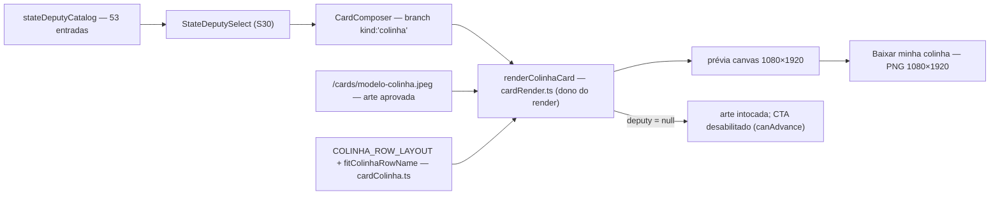

# Impl: S34 — Minha colinha: a arte exata entregue pelo humano + a linha do estadual preenchida

Status: aprovado
Atualizado em: 2026-09-24
Issue: #1298
Intenção: docs/plans/cards-colinha-arte-exata.md
Appetite restante: herdado — ~0,5–1 dia eng; 4 fases somam ~1 dia, sem migration, sem asset novo, sem dependência nova

## Leitura da intenção

- **Outcome:** a prévia e o PNG 1080×1920 do modelo `minha-colinha` passam a ser o JPEG aprovado (`modelo-colinha.jpeg`, 900×1600) ampliado exatamente 1,2×, como entregue; só a linha `DEPUTADO ESTADUAL` (2ª) é preenchida — nome de urna em caixa alta + os cinco dígitos, um por caixa existente. Sem estadual, a arte aparece intacta e o download fica desabilitado.
- **O que NÃO negociar:** nenhum outro pixel redesenhado (topo, cinco linhas fixas, legal e selos vêm da arte); a linha preenchida lê como parte da arte (mesma tipografia/peso/cor/tamanho/linha de base, dígitos centrados, nome sem colidir com rótulo nem borda); 100% no aparelho; um só editor/fluxo (`#cards`, `/cards`, `?model=minha-colinha`); o JPEG continua tile da galeria; `StateDeputySelect`/`stateDeputyCatalog` (S30) e o analytics de S32 intocados; sem CMS/migration; sem PDF/A4; sem nome/foto do visitante; sem superfície nova.
- **O que reavaliar (hipóteses da direção):**
  - "`renderColinhaCard` redesenha a arte inteira" — confirmado: `COLINHA_LAYOUT` + `drawColinhaTop/Legal/Digit/Confirm` compõem tudo do zero (`src/lib/cardRender.ts:338-591`); a maior parte morre (Decisão 3/C).
  - "`cardModels` muda `assetSrc`/`lockupSrc`" — a entrada passa a ter a arte como `assetSrc` e perde `overlaySrc`/`lockupSrc`/`previewSrc`; o tile segue a mesma arte via `previewSrc ?? assetSrc` (`CardModelTile.tsx:58`), agora pelo fallback (Decisão 4/D).
  - "o branch da colinha carrega a base" — confirmado; o efeito de carga já lê `model.assetSrc` (`CardComposer.tsx:280-295`); o branch só enxuga (sai `lockupImage`, sai o desenho composto).
  - "o gate do download sem estadual já existe" — confirmado: `canAdvance` (`CardComposer.tsx:596-598`) e `disabled` (`:1186`) já tratam a colinha; nenhum código novo (Decisão 5/E).
  - Geometria do design confere com a arte: máscara 55,9%→2,9% = y 1073,28→1128,96; cópia 56,46% = y 1084,03; dígitos top 58,4% = 1121,28, largura 6,1% = 65,88, d1 left 25,9% = 279,72, passo 6,9% = 74,52; escala 1,2 exata do JPEG. Sondagem no JPEG (sharp): o rótulo queimado ocupa x≈571–856 / y≈1088–1108 e as cinco caixas vazias (círculos, interior branco puro) vão de y≈1128 a 1195, centradas em x≈312,6/387,6/462,0/536,4/610,8 — a máscara cobre o rótulo e para no topo das caixas.

## Abordagem recomendada

**Opções consideradas:** A) canvas — `drawImage(jpeg, 0, 0, 1080, 1920)` com `imageSmoothingQuality='high'` e a linha desenhada por cima (máscara branca + rótulo + nome + dígitos) | B) sobrepor a linha em DOM/CSS sobre um `` e rasterizar (html2canvas) | C) montar SVG/foreignObject → `Image` → canvas.
**Recomendação:** A — é exatamente o caminho do design (as cenas usam esses elementos), mantém o dono único do render (`cardRender.ts`), a prévia e o download já saem do mesmo canvas, e não entra dependência nova.
**Rejeitadas:** B porque exigiria dependência nova e uma segunda via de rasterização (fidelidade de fonte/anti-aliasing fora do nosso controle); C porque duplicaria o pipeline de desenho em outro formato (fontes/imagens embutidas, diferenças de browser) sem ganho.

### Decisões de engenharia

**1. Composição da linha (A) — canvas por cima do JPEG.**
**Opções:** A) desenhar o JPEG ampliado e, por cima, máscara branca + rótulo + nome + dígitos no `renderColinhaCard` | B) renderizar a linha em DOM/CSS e rasterizar | C) offscreen canvas só para a linha e `drawImage` do resultado.
**Recomendação:** A — o design já é um overlay de 6 elementos sobre a imagem; o render dono (`cardRender.ts`) desenha na mesma ordem do design (arte → máscara → rótulo → nome → dígitos) e o recorder falso prova a geometria; zero dependência e zero segundo pipeline.
**Rejeitadas:** B porque introduz html2canvas e uma rasterização que não controlamos; C porque o offscreen não muda o resultado nem o custo, só adiciona um segundo contexto a manter.

**2. Fonte do nome/dígitos (B) — face mais próxima do sistema + prova lado a lado.**
**Opções:** A) usar os stacks do design (`Arial, Helvetica, sans-serif` no nome/rótulo; `Arial Black, Arial, Helvetica, sans-serif` nos dígitos), com o artefato lado a lado no PR como aceite | B) embarcar uma face Black nova no repo (novo asset licenciado + pipeline de carga) | C) manter `COLINHA_FONT_FAMILY` atual para tudo e só aumentar o peso.
**Recomendação:** A — é a resposta assumida da intenção e o NEEDS ASSET explícito do design ("o port deve provar a equivalência lado a lado; este gate decide composição e geometria"); menor custo e nenhum asset novo.
**Rejeitadas:** B porque a face exata da arte não foi licenciada/entregue e `ensureCardFont` só carrega 1 família/peso (mexeria no load compartilhado e adicionaria ~100KB+licença por um item que o gate não pediu — vira gatilho de follow-up se a prova reprovar); C porque o design separa peso 400 (rótulo) de 900 (nome) e Arial Black nos dígitos.

**3. Código morto (C) — remover o que morre; `Linha conferida` derivada.**
**Opções:** A) remover `COLINHA_LAYOUT`, `drawColinhaTop/Legal/Digit/Confirm`, `capAt`, `fitColinhaCandidate`, `COLINHA_FIXED_ROWS`, `colinhaVoteRows`, `COLINHA_ESTADUAL_PLACEHOLDER`, `COLINHA_LEGAL_TEXT` e `COLINHA_CONFIRM_LABEL`; a UI deriva `DEPUTADO ESTADUAL · <NOME> · <5 dígitos>` do `COLINHA_ESTADUAL_LABEL` + entrada do catálogo | B) manter `COLINHA_LAYOUT` e os `draw*` como via antiga | C) manter só `colinhaVoteRows` para a UI (tabela fixa).
**Recomendação:** A — a intenção manda "a composição do zero deve ser REMOVIDA, não duplicada (sem segunda via morta)"; a linha de conferência não precisa da tabela das 6 linhas (a arte já carrega as 5 fixas); o literal do cargo fica uma vez em `cardColinha.ts` (dono) e é usado pelo renderer e pela UI.
**Rejeitadas:** B porque knip acusa órfãos e a via morta convida a divergir da arte; C porque manteria a tabela de linhas fixas só para montar um texto — a fonte da verdade das linhas fixas passa a ser o JPEG, não a tabela.

**4. Modelo `minha-colinha` (D) — `assetSrc` é a arte; campos da composição antiga saem.**
**Opções:** A) `assetSrc: '/cards/modelo-colinha.jpeg'` e remover `overlaySrc`/`lockupSrc`/`previewSrc` da entrada (e o campo `lockupSrc` de `CardModel`, sem outro consumidor) | B) manter `assetSrc` antigo (foto do grupo) e carregar a arte via `previewSrc` | C) criar um campo novo (`artSrc`).
**Recomendação:** A — a arte é a base da prévia e do download; o tile continua mostrando a mesma imagem pelo fallback `previewSrc ?? assetSrc`; o composer genérico já carrega `assetSrc`; o campo `lockupSrc` fica órfão e sai junto (sem twinning).
**Rejeitadas:** B porque deixaria a arte real num campo de "galeria" e a prévia dependente de semântica de placeholder; C porque cria campo/parallel path para um só modelo ("edite o dono, não gêmeo").

**5. Gate sem estadual (E) — nenhum código novo.**
**Opções:** A) confiar no `canAdvance`/`disabled` existentes e provar o estado vazio com a arte intocada | B) adicionar flag/estado de download desabilitado ou esmaecer a prévia.
**Recomendação:** A — `canAdvance` já é `selectedDeputy !== null` para a colinha; o renderer com `deputy = null` desenha só a arte; o e2e pina CTA desabilitado + arte como está.
**Rejeitadas:** B porque duplicaria estado e o gate não esmaece a arte (a cena 01 mostra o JPEG pleno).

**6. Escala 1,2× e suavização (F) — estender o subset com os membros reais.**
**Opções:** A) `CardDrawContext` ganha `imageSmoothingEnabled`/`imageSmoothingQuality`; `renderColinhaCard` seta `true`/`'high'` antes de desenhar; o único fake de teste é atualizado | B) aceitar o default do browser (`'low'`) | C) setar a suavização no composer, antes de chamar o renderer.
**Recomendação:** A — o renderer é dono do seu requisito de composição; o subset ganha 2 membros estruturais (só um fake consome o tipo); nenhum renderer S13–S30 seta esses membros, então nada muda para eles.
**Rejeitadas:** B porque a ampliação 1,2× é o entregável — blur aparece no type pequeno da arte; C porque vaza um detalhe de desenho para o caller e deixa o comportamento fora do teste puro do renderer.

**7. Fit do nome (G) — uma linha, encolhe para caber na caixa de cópia.**
**Opções:** A) `fitColinhaRowName(texto, measure, maxWidth)` → `{ fontSize, text }` com `fontSize = min(ideal 36,72, ideal × maxWidth / width)`, uma linha (sem wrap), par rótulo+nome alinhado à direita em `copy.right`; `maxWidth = (copy.right − mask.x) − officeWidth − gap` (a faixa branca da máscara é a fronteira dura; o próprio CSS do gate deixa o par transbordar `copy.left`) | B) manter 36,72 fixo e deixar nomes longos vazarem para a esquerda sobre a arte | C) quebrar em duas linhas (comportamento S31) ou truncar.
**Recomendação:** A — garante "nome cabendo sem colidir com o rótulo nem com a borda do desenho" (por construção, `pairLeft ≥ mask.x`), mantém o par legível e o domínio é o catálogo congelado; a varredura unit das 53 entradas com medida conservadora prova o invariante e o e2e pina o pior nome (`arthur`).
**Rejeitadas:** B porque viola o aceite e desenha texto sobre pixels não mascarados da arte; C porque o design é `nowrap` (duas linhas colidem com as caixas/círculos na faixa de 55,68px) e truncar esconderia o nome do candidato.

### Componentes / mudanças

- **`src/lib/cardColinha.ts`** (reescrever; segue o dono da geometria da colinha): `COLINHA_FONT_FAMILY` (mantida), `COLINHA_DIGIT_FONT_FAMILY` (nova), `COLINHA_ESTADUAL_LABEL='DEPUTADO ESTADUAL'`, `COLINHA_ROW_LAYOUT` com os números do design em 1080×1920 — `mask { x:264,6, y:1073,28, width:619,92, height:55,68, fill:'#ffffff' }`; `copy { left:290,52, top:1084,03, width:570,24, right:860,76 }`; `office { fontSize:26,9, weight:400, color:'#202020' }` (o 2,15cqw=23,22 do gate foi corrigido na crítica (c) para o cap height 19,2px da arte); `name { fontSize:36,72, weight:900, color:'#e4102f', letterSpacingEm:-0,04 }`; `gap:16,2`; `digit { left:279,72, step:74,52, width:65,88, height:83,52, top:1121,28, fontSize:45,9, weight:900, color:'#171717' }` — e `fitColinhaRowName(text, measure, maxWidth)`. Baseline do par: `copy.top + measure('X', nameSize).actualBoundingBoxAscent` (cap do nome no topo da faixa; rótulo compartilha a baseline). `letterSpacingEm` vira `ctx.letterSpacing` em px (`-0,04 × fontSize`).
- **`src/lib/cardRender.ts`** (editar): `CardDrawContext` ganha `imageSmoothingEnabled`/`imageSmoothingQuality`; `ColinhaCardRenderArgs` vira `{ image, deputy, fontFamily, measure }`; `renderColinhaCard` reescrito — `drawImage(image, 0, 0, model.width, model.height)` → `deputy ? máscara + rótulo + nome + dígitos : nada`; removem-se `drawColinhaTop/Legal/Digit/Confirm`, `capAt` e os imports órfãos; `drawCardName`/`renderNameCard`/`renderTeamCard` intocados.
- **`src/lib/cardModels.ts`** (editar): entrada `minha-colinha` com `assetSrc:'/cards/modelo-colinha.jpeg'`, sem `overlaySrc`/`lockupSrc`/`previewSrc`; remove o campo `lockupSrc` de `CardModel`; doc-comments S31→arte exata. Sem migration (config estática no código).
- **`src/components/cards/CardComposer.tsx`** (editar): branch de desenho passa a exigir só `baseImage` e chama `renderColinhaCard(ctx, model, { image: baseImage, deputy: selectedDeputy, fontFamily: COLINHA_FONT_FAMILY, measure: createCardMeasure(ctx, COLINHA_FONT_FAMILY, 900) })`; remove o estado/carregamento de `lockupImage` e as deps; `Linha conferida` deriva `${COLINHA_ESTADUAL_LABEL} · ${selectedDeputy.name.toLocaleUpperCase('pt-BR')} · ${selectedDeputy.ballotNumber}` (sem `colinhaVoteRows`); prévias 248/236px (vazio, crítica (c)) e 300/405px (preenchido), com o estado preenchido desktop em grid de 2 colunas num dialog de 960px (crítica (c); `data-colinha-filled`); copy, CTA, `canAdvance` e o evento S32 (`sendCardDownloadEvent`) ficam como estão; `ensureCardFont`/carregamento compartilhado de fonte intocados (sem webfont nova; gatilho = Decisão 2/B).
- **Testes** (ver seção própria): `tests/unit/cardColinha.unit.spec.ts` (reescrever; manter o describe do tile), `tests/unit/cardRender.unit.spec.ts` (substituir o describe S31 + fake com os 2 membros novos), `tests/unit/cardModels.unit.spec.ts` (pin novo), `tests/e2e/frontend.e2e.spec.ts` (describe S34).
- **`docs/changelog/<YYYY-MM-DD>-s34-colinha-arte-exata.md`** (novo).
- **`scripts/lib/e2e-affected-manifest.mjs`**: **sem mudança** — `src/components/cards` + `src/lib/card` já mapeiam para o spec `frontend`.
- **Migration:** sem migration — nenhuma collection/global/field no schema; `push:false` intocado.
- **Access / Consent:** não se aplica — nenhuma superfície Payload, nenhum opt-in; Fluxo 100% client-side e a escolha não sai do aparelho.
- **UI:** Impeccable C — shape já fixado no gate (cenas 01–06); craft = port das medidas/classes; critique = prova lado a lado da cena 06 (linha fixa × preenchida) + pior nome; polish se a prova pedir. Shells/tokens reusados: `CardComposer`, `CardPreviewCanvas`, `StateDeputySelect`, `--pt-red`/`--campaign-*`; nada de superfície nova.

### Dados → forma (se aplicável)

Não se aplica (data-presentation Q3): nenhum KPI, mapa ou série; a "forma" é a arte + a linha. A escolha do estadual segue insumo local da imagem (nunca coletada/apresentada/enviada); a medição de uso é S32 e fica intocada.

## Fases verificáveis

1. **Base + escala (tracer)** — quota ~0,25 dia. `cardModels` com a arte como `assetSrc` (Decisão 4); `renderColinhaCard` desenhando só a arte em 1080×1920 com smoothing (Decisão 6); branch do composer enxuto; `COLINHA_ROW_LAYOUT` + `fitColinhaRowName` nascem.
   Prova: `pnpm gate:fast`; `?model=minha-colinha` no browser com a prévia = JPEG intacto (rótulo queimado visível) e CTA desabilitado; probe do e2e do vazio atualizado (varredura da faixa com a arte intacta); unit do tile (sha256 + 900×1600) verde.
2. **Linha preenchida** — quota ~0,3 dia. Máscara + rótulo + nome (fit) + cinco dígitos na ordem do design; pins de geometria em `cardColinha`/`cardRender`; e2e do preenchido e do pior nome.
   Prova: `pnpm gate:fast`; unit verdes; e2e do describe verde; prova lado a lado (cena 06) com JULIO PINHEIRO e com `Artur Barachisio Lisbôa` anexada ao PR.
3. **Vazio/gate + remoção do código morto** — quota ~0,2 dia. Estado vazio provado (arte + CTA off, Decisão 5); remoção de `COLINHA_LAYOUT`/`draw*`/`capAt`/`fitColinhaCandidate`/`COLINHA_FIXED_ROWS`/`colinhaVoteRows`/placeholder/legal/confirm; remoção de `lockupSrc` + estado/carregamento no composer; `Linha conferida` derivada (Decisão 3).
   Prova: `pnpm gate:fast` (knip sem órfãos e `tsc --noEmit` limpo); grep de `COLINHA_LAYOUT|colinhaVoteRows|fitColinhaCandidate|drawColinha|lockupSrc` sem referências de produção; e2e do fluxo segue verde.
4. **Testes/gates + prova + changelog** — quota ~0,25 dia. e2e completo do describe (download/evento/troca), changelog, prova final no PR e `pnpm push`.
   Prova: `pnpm test:e2e --no-deps -- tests/e2e/frontend.e2e.spec.ts -g "Minha colinha"` verde; `pnpm push` (pre-push roda o gate de CI).

### Testes previstos por camada

- **unit (node + sharp) — `tests/unit/cardColinha.unit.spec.ts` (reescrever):** pins de `COLINHA_ROW_LAYOUT` (máscara/cópia/office/name/gap/dígito), stacks de fonte e `COLINHA_ESTADUAL_LABEL`; `fitColinhaRowName` (ideal mantém; nome longo encolhe em 1 linha; invariante `pairLeft ≥ mask.x` varrendo as 53 entradas do catálogo com medida conservadora); **manter** o describe do tile (sha256 `76505492…` + 900×1600).
- **unit (jsdom + recorder falso) — `tests/unit/cardRender.unit.spec.ts` (substituir o describe S31):** ordem arte→máscara→rótulo→nome→dígitos; `drawImage(arte, 0, 0, 1080, 1920)` com `imageSmoothingQuality='high'`; geometria da máscara (264,6; 1073,28; 619,92×55,68); rótulo e nome à direita (`textAlign 'right'`, x = `copy.right` e `copy.right − nameWidth − 16,2`); cinco dígitos centrados em 312,66/387,18/461,70/536,22/610,74 (y 1163,04); `deputy = null` desenha **só** a imagem (zero `fillText`/`fillRect`); `globalAlpha` = 1; `letterSpacing` restaurado a `0px`. O fake ganha `imageSmoothingEnabled`/`imageSmoothingQuality` e registra `fillStyle` por chamada.
- **unit — `tests/unit/cardModels.unit.spec.ts` (atualizar):** pin do modelo com `assetSrc:'/cards/modelo-colinha.jpeg'`, sem `overlaySrc`/`lockupSrc`/`previewSrc`, mantendo `kind:'colinha'`, `stateDeputyPicker`, `badge:'NOVO'` e `1080×1920`.
- **int:** não se aplica — sem Payload/DB/access/escrita multi-collection; fluxo client-side + assets estáticos (manifesto e2e também não muda).
- **e2e — `tests/e2e/frontend.e2e.spec.ts` (reescrever o describe S31 → S34):** vazio (CTA desabilitado; varredura da faixa do rótulo derivada de `COLINHA_ROW_LAYOUT` acha a tinta do rótulo queimado em `firstDarkX > 500`, sem tinta vermelha e com as caixas vazias); seleção por teclado (helper existente); preenchido (`firstDarkX` e `redFirstX` ≥ `mask.x` e `firstDarkX < 450` — rótulo reposto à esquerda e nome vermelho dentro da máscara — e o interior do círculo d1, região 34×34 no centro impresso, com tinta); `Linha conferida` literal; download `card-jorge-solla-minha-colinha.png` + assinatura PNG + evento S32 com slug; troca mantém habilitado; pior nome (`arthur`) com o par dentro da máscara. Sem pin de RGB exato (anti-aliasing de fonte varia) — contagem/luminância em regiões estáveis.

## Rabbit holes / Não escopo (engenharia)

- Redesenhar o topo/linhas fixas/legal/selos, "melhorar" a arte ou vetorizá-la (intenção, rabbit holes de produto).
- Editar/re-encodar o JPEG (`modelo-colinha.jpeg` é cópia byte-a-byte pinada; nunca tocar).
- Segunda via de composição (SVG/DOM/html2canvas) ou segundo editor/rota/`?estadual=`.
- Embarcar face tipográfica nova — gatilho: reprovação da prova lado a lado (Decisão 2/B).
- PDF/A4; nome/foto do visitante; qualquer medição da escolha (S32 intocado).
- CMS/collection/migration; ler `stateDeputy`/`Contact`; qualquer superfície Payload.
- Tocar em `StateDeputySelect`, `stateDeputyCatalog`, `CardModelTile`, `CardModelGallery`, `CardsStudio`, `CardPreviewCanvas`, `cardCanvas.ts` (só o `CardDrawContext` muda, em `cardRender.ts`).
- Fatiar o `CardComposer` (#1277, OPEN/blocked/P3): não iniciar aqui; se mergear antes, rebase (o branch toca só o branch da colinha).

## Riscos e mitigação

- **Fonte NEEDS ASSET (face exata não existe no repo):** stack do design (`Arial Black, Arial, Helvetica, sans-serif`) + prova lado a lado na cena 06 anexada ao PR (o e2e não pina pixels de glifo); gatilho: reprovação no gate → adotar a Decisão 2/B (embarcar face) como follow-up.
- **Pins antigos quebram (unit/render/models/e2e e o probe de pixel (426,1102)):** reescrever no mesmo PR; `pnpm gate:fast` (knip) + grep sem referências mortas; a remoção da via antiga é o teste de que não sobrou twin.
- **`#1277` no mesmo arquivo (OPEN/blocked/P3):** branch isolado no `if (isColinhaModel)`; rebase se mergear antes; não antecipar a fatia.
- **`CardDrawContext` compartilhado:** a extensão é aditiva; só a colinha seta `imageSmoothing*`; nenhum call site S13–S30 muda; o único fake ganha os 2 membros.
- **Nomes longos do catálogo:** fit de 1 linha sem floor (domínio = catálogo congelado); varredura das 53 entradas no unit + e2e com `arthur`; se um futuro catálogo trouxer nome absurdo, revisitar a Decisão 7 (não cortar o nome em silêncio).
- **Nitidez da ampliação 1,2×:** `imageSmoothingQuality='high'` + conferência do PNG baixado no PR/UAT; sem re-render/reescala parcial.
- **Baseline/top da linha vs design (sub-pixel):** baseline compartilhada ancorada no cap do nome em `copy.top`; a prova lado a lado da cena 06 é o aceite e só `copy.top` se move se divergir.
- **Probes e2e flaky:** regiões (não pixel único) + limiar de luminância; as áreas sondadas são branco puro na arte (conferido no JPEG: interior dos círculos = 255; faixa da máscara = 255).
- **Tile/`previewSrc` removido:** `CardModelTile` cai no fallback `assetSrc` — mesma imagem; unit pina e nenhum visual muda.

## Aceite de engenharia

- [ ] Aceite de produto da intenção ainda coberto: prévia/download = JPEG aprovado ampliado 1,2× com só a linha `DEPUTADO ESTADUAL` preenchida (nome caixa alta + 5 dígitos, um por caixa); sem nada mais redesenhado; vazio = arte como está + download desabilitado; tipografia/peso/cor/linha de base da linha; tile segue o JPEG; um só fluxo (`#cards`, `/cards`, `?model=minha-colinha`); 100% no aparelho; S30/S32 intocados.
- [ ] Invariantes AGENTS/engineering-standards: sem migration/collection/Consent; `src/lib` puro/client-safe; copy pt-BR e identificadores em inglês; sem `as never`; knip sem órfãos; arte intocada; `pnpm gate:fast` + e2e da superfície + `pnpm push` verdes.
- [ ] Testes de domínio previstos (unit/int): unit de `cardColinha` (geometria, fit, catálogo, tile), `cardRender` (ordem/geometria/vazio/smoothing) e `cardModels` (pin do modelo) obrigatórios; e2e do fluxo no spec `frontend` (vazio + CTA off, seleção, preenchido, pior nome, download com assinatura PNG e evento, troca); **int não se aplica** — sem Payload/DB/access nem escrita multi-collection.

## Self-score decision-quality: 5/5

1. **Decisões caras com rejeitadas:** composição (canvas × DOM/SVG), fonte (próxima × embarcar × peso só), código morto, modelo/campos, gate vazio, suavização/`CardDrawContext` e fit do nome — todas com Opções/Recomendação/Rejeitadas.
2. **Cabe no appetite:** 4 fases ~1 dia, sem migration/asset/dependência; o maior peso é reescrever testes que já existem.
3. **Rabbit holes nomeados:** redesenho/vetorização da arte, editar o JPEG, segunda via de composição/editor, embarcar fonte (com gatilho), PDF/A4, CMS, S30/S32, `#1277`.
4. **Depth check:** reusa o dono `renderColinhaCard`, o composer/seletor/catálogo/prévia/download existentes, o padrão de pins unit + e2e do estúdio e o manifesto e2e; nada de abstração nova — as constantes/funções novas substituem as antigas no mesmo dono (`cardColinha.ts`).
5. **Intenção preservada:** o outcome ("a arte exata + a linha do estadual preenchida") é intocado; a engenharia só resolveu forma (remover a recriação, repontar o modelo, desenhar o overlay no canvas).

## Addendum — crítica final do designer (c), 2026-09-24

Primeira passada: **AJUSTES NECESSÁRIOS**; segunda passada: **CERTIFICADO** (tier `openai/gpt-5.6-sol`). Ajustes aplicados sobre o plano original:

1. **Rótulo (P1):** `office.fontSize` 23,22 → **26,9px** (peso 400 mantido), cap height ≈ 19,2px igual aos rótulos impressos da arte; a exceção ao gate está documentada em `cardColinha.ts`.
2. **Prévia vazia (P2):** 145px → **248px mobile / 236px desktop** (`max-w-[15.5rem] sm:max-w-[14.75rem]`), cenas 01–02 do gate S34.
3. **Desktop preenchido (P2):** grid de 2 colunas (`sm:grid-cols-[430px_1fr]`, gap 32px) dentro de um dialog de 960px (`data-colinha-filled` + `has-[[...]]:sm:max-w-[60rem]` no `CardsStudio`); o vazio permanece no dialog compacto de 512px. A prévia tem teto de altura (`max-h-[calc(92dvh-14rem)]`) para o 9:16 inteiro nunca ser cortado pelo footer — ~340px de largura em viewport 1280×900, chegando aos 405px da cena 03 em viewports altos.
4. **Fit do nome:** a fronteira dura do par passou a ser a máscara (`maxWidth = (copy.right − mask.x) − officeWidth − gap`), como o CSS do gate faz; o e2e pina `firstDarkX`/`redFirstX ≥ mask.x` e o nome vermelho (não só o rótulo escuro).

## Débitos deferidos com gatilho (/simplify, 2026-09-24)

- **`imageSmoothing` sem `save/restore` no ctx compartilhado** (`cardRender.ts`): hoje inalcançável (cada modelo remonta o canvas); gatilho — o ctx passar a ser reusado entre desenhos/escalas no mesmo canvas.
- **Contrato `data-colinha-filled` → `has-[[…]]:sm:max-w-[60rem]` sem asserção no e2e:** só comentários nos dois lados; gatilho — próxima mudança no dialog da colinha/atributo (ou nova passada de e2e no estúdio).
- **Sweep de fit com medida sintética (0,84em/caractere):** o e2e cobre o pior nome (`arthur`) e o sweep é conservador; gatilho — entrada nova no catálogo mais larga que `arthur` ou queixa visual de corte.
- Absorvidos em `#1277` (`escala-dry-pos-s30.md`): D1 (uppercase duplicado) e D2 (`ensureCardFont` gateando a colinha).
