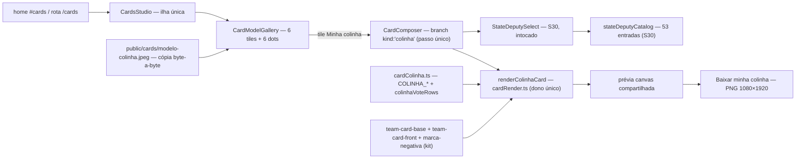

# Impl: Minha colinha — o estadual escolhido na colinha de voto

Status: aprovado (modo --auto)
Atualizado em: 2026-09-23
Issue: #1272
Intenção: docs/plans/cards-colinha.md
Appetite restante: herdado — ~1–1,5 dia eng (3 fases somam ≤1,3 dia; sem migration; o único peso novo é 1 asset copiado byte-a-byte)

## Leitura da intenção

- **Outcome:** o estúdio de cards ganha o sexto modelo `Minha colinha`: o visitante escolhe um estadual na MESMA lista de S30 e recebe uma colinha 9:16 (PNG 1080×1920) com o topo aprovado (foto do grupo + lockup + faixa `JORGE SOLLA 1313` e as marcas menores), a linha legal vertical na borda esquerda e seis linhas de voto — cinco fixas (`DEPUTADO FEDERAL Jorge Solla 1313`, `SENADOR Jaques Wagner 130`, `SENADOR Rui Costa 133`, `GOVERNADOR Jerônimo 13`, `PRESIDENTE Lula 13`) e a do estadual preenchida com nome de urna + cinco dígitos, um por caixa — cada uma com o selo verde `CONFIRMA`.
- **O que NÃO negociar:**
  - 100% no aparelho: sem nome do visitante, sem foto, sem upload, sem persistência/analytics; os cinco modelos existentes intocados além do badge.
  - Um único editor/fluxo: sexto item do MESMO `CardsStudio`/`CardComposer`; `#cards`, `/cards` e `?model=minha-colinha` continuam.
  - Catálogo de estaduais = o de S30 (`src/lib/stateDeputyCatalog.ts`, 53 entradas): um estadual, uma linha; sem escolha não há download; o seletor S30 é reusado sem tocar na superfície entregue.
  - Fidelidade ao gate: topo, linha legal vertical na borda esquerda e corpo de linhas seguem `docs/plans/cards-colinha-ui-design.html` (cenas 1–5).
  - Escolha por toque e teclado; sem página/rota por colinha; a nota de privacidade precisa permanecer verdadeira (a existente fala de nome/foto).
- **O que reavaliar (hipóteses da intenção):**
  - **“O `CardComposer` ramifica por `kind`”**: confirmado (`CardComposer.tsx:206-208` e ternários ao longo do arquivo); a colinha é o primeiro `kind` novo desde S13 e o branch fica isolado — sem flag extra dentro do `kind:'team'`.
  - **“Catálogo e assets são os de S30”**: confirmado — reuso puro; nenhuma entrada/asset de estadual nasce aqui.
  - **“Pipeline `renderX → preview canvas → PNG download` reaproveitado”**: confirmado — o render novo (`renderColinhaCard`) mora no dono único (`cardRender.ts`) e usa `CardPreviewCanvas`/`cardCanvas`/`cardFileName`.
  - **“NEEDS ASSET do topo”**: resolvido no gate — o topo é composição medida a partir do kit (`team-card-base.png` + `marca-negativa-completa.png` + `team-card-front.png`); não há asset-mestre novo nem script.
  - **“`CardModelTile`/galeria”**: o tile já cai no `Image` com `previewSrc` para `kind` desconhecido (só o `sizes` acompanha as seis colunas); a galeria passa a seis colunas.

## Abordagem recomendada

**Opções consideradas:** A) sexto modelo no estúdio existente com composição canvas portada do gate + seletor de S30 reusado | B) usar o `modelo-colinha.jpeg` como fundo e sobrepor só a linha do estadual | C) asset-mestre novo gerado por script sharp + render de camadas.
**Recomendação:** A — o outcome é um modelo no estúdio existente; portar o gate classe-a-classe mantém a fidelidade aprovada, usa só o kit oficial e reaproveita catálogo/seletor/preview/download; cabe no appetite (um render novo, nenhuma infra).
**Rejeitadas:** B porque o modelo aprovado não tem slot para o nome dinâmico (a linha do estadual está queimada e o rótulo não comporta nome variável); C porque cria mestre novo não aprovado e um script para um asset quando o gate já define a composição.

### Decisões de engenharia

1. **Sexto modelo — `kind:'colinha'` novo + flag `stateDeputyPicker: true` de S30.**
   Opções: A) novo `kind:'colinha'` + `stateDeputyPicker:true` | B) reusar `kind:'team'` | C) uma entrada por estadual (53 modelos).
   Recomendação: A — o fluxo não tem foto/recorte/nome (nada da esteira S15), mas reusa o eixo do catálogo de S30; o `kind` discrimina os branches de composer/render e `isCardModelId`/`?model=` cobrem o id de graça.
   Rejeitadas: B porque arrastaria janela de foto/recorte/harmonia/nome para um fluxo que não tem nenhum (branch por flag extra dentro do `team`); C porque explode galeria/pins/URL.

2. **Render — composição canvas pura portada classe-a-classe do gate (não o `modelo-colinha.jpeg` como fundo).**
   Opções: A) portar a composição do gate (medidas em px, canvas puro) | B) `modelo-colinha.jpeg` como fundo + linha do estadual desenhada por cima | C) mestre novo por script sharp + camadas.
   Recomendação: A — a doutrina do estúdio porta o artefato aprovado e a intenção diz que o topo é “definida no design hi-fi e montada a partir do kit oficial”; o `modelo` não tem slot para o nome dinâmico (rótulo queimado).
   Rejeitadas: B porque o nome/dígitos não têm onde entrar; C porque é mestre novo não aprovado + script, quando o gate já define a composição.

3. **Módulos — `src/lib/cardColinha.ts` puro + `renderColinhaCard` no dono do render.**
   Opções: A) módulo puro novo (`COLINHA_*`, tabela fixa, `colinhaVoteRows`) + renderer em `src/lib/cardRender.ts` | B) tudo dentro do `cardRender.ts` | C) renderer standalone em módulo próprio.
   Recomendação: A — o layout/tabela é conhecimento próprio, testável sem canvas; o renderer fica no dono único de prévia/export (um call site), como S13–S30.
   Rejeitadas: B porque espalha a tabela de linhas no arquivo de desenho; C porque seria um segundo dono de render (twin).

4. **Geometria — px medidos do gate em 1080×1920, constantes `COLINHA_*` pinadas em unit; candidato shrink-to-fit em uma linha.**
   Opções: A) portar os valores medidos do gate em px | B) recalcular percentuais/`cqw` em runtime | C) desenhar na escala 900×1600 do tile.
   Recomendação: A — canvas não tem CSS; os valores do gate em 1080×1920 são a régua (re-medir no browser se algo divergir ao portar). Valores:
   - **topo:** y `0 → 710,4` (37% de 1920), fundo `#148fc2`; foto do grupo `team-card-base.png` (1080×1440) em cover, desenhada em `(0, −335,62, 1080, 1440)` com clip no bloco.
   - **caixa da marca:** `(32,4; 21,29; 529,19×134,97)`; fundo gradiente linear 125° `#e4102f` 0→52% e `#184e92` 52→100% (linha CSS: dir `(sin125°, −cos125°)`, comprimento `|w·sinθ| + |h·cosθ|`, stops via `createLinearGradient`); lockup `public/campaign-kit/marca-negativa-completa.png` (1037×595) contido → rect desenhado `(226,4; 48,29; 141,1×80,97)` (o padding percentual do gate resolve contra o bloco de 1080 = 27px, não contra a caixa; não recalcular o contain a partir de “13,23”).
   - **faixa vermelha:** `(0; 504,39; 1080×206,0)`, fundo `#e4102f`; arte `public/cards/team-card-front.png` (1080×1440) recortada nas linhas de origem `1232,36 → 1438,36`, desenhada com clip em `dy = 504,39 − 1232,36 = −727,97`.
   - **linha legal vertical:** box `(7,55; 748,79; 15,66×1132,81)`; texto `FEDERAÇÃO BRASIL DA ESPERANÇA - FE BRASIL (PT-PC DO B - PV) | CNPJ CANDIDATO: 68.430.467/0001-05`; `700 15,66px`, letter-spacing ~0,31, cor `#333`, rotacionada −90° (lê de baixo para cima).
   - **corpo:** `(51,83; 710,39; 1028,17×1209,61)`; padding topo 34,56 / lados 35,64 / base 32,4; gap entre linhas 34,56; centralizado verticalmente; cada uma das 6 linhas min-height 108; grid da linha = `30% | 1fr | auto` com gap 21,6 (coluna do rótulo ≈287,07). Derivado: primeira linha em y ≈ 905,88 e passo 142,56 (6×108 + 5×34,56 = 820,8 no miolo de 1142,65).
   - **rótulo do cargo:** `900 27px` (line-height 1,02), caixa alta, `#171717`, quebras `DEPUTADO\nFEDERAL` e `DEPUTADO\nESTADUAL`, uma linha nos outros quatro.
   - **candidato:** `900 26,46px`, `#e4102f`, gap ~9,6 acima; shrink-to-fit em UMA linha dentro da coluna de 287px, piso 18px — rejeitadas a quebra em duas linhas com altura variável (o CSS do gate quebra; o ritmo fixo das 6 linhas é melhor no canvas) e candidatos de duas linhas fixas.
   - **caixas de dígito:** `59,39×73,44`, borda `5,94` `#111`, raio `6,48`, fundo branco, dígito `900 46,44px` centrado; gap 8,1; vazia = borda `#9a9a9a`, fundo `#fafafa`, dígito invisível.
   - **pill CONFIRMA:** raio cheio, fundo `#009647`, padding `17,28×21,6`, `900 21,6px` branco; vazia = 30% de opacidade (fill `#0096474d`, sem `globalAlpha` no subset).
   - **posições:** CONFIRMA na borda direita da linha (coluna `auto`); dígitos alinhados à esquerda na coluna do meio.
     Rejeitadas: B porque canvas não interpreta CSS e a conversão runtime reintroduz erro de medição; C porque a régua aprovada é 1080×1920 (o tile 900×1600 é só arte de galeria).

5. **`CardDrawContext` ganha `roundRect` (fill-only).**
   Opções: A) adicionar `roundRect` real e compor bordas com dois preenchimentos (externo na cor da borda, interno no fill) | B) `stroke`/`lineWidth` no subset | C) cantos com arcos manuais.
   Recomendação: A — método real, subset mínimo e fill-only; caixas (borda 5,94), pill e estados vazios saem de dois `roundRect` preenchidos; o recorder falso registra a op. Pela geometria medida o subset ganha também os membros reais `clip` (recortes do topo/faixa), `createLinearGradient` (caixa da marca) e `letterSpacing` (linha legal).
   Rejeitadas: B porque stroke centrado exigiria meia-borda na geometria e polui o subset; C porque reinventa `roundRect`.

6. **Composer — passo único, CTA baixa direto da prévia compartilhada.**
   Opções: A) sem `result`: CTA `Baixar minha colinha` baixa direto do canvas da prévia; desabilitado até estadual + imagens prontas; `Gerando…` durante | B) dois passos compose→result como os outros modelos | C) dois CTAs (criar + baixar).
   Recomendação: A — não há nome/foto para confirmar; as cenas 2 e 5 do gate mostram um único CTA; evita estado novo. Rodapé fiel ao gate: dialog = `Cancelar` + primário (cena 2); drawer = só o primário full-width (cena 5). Prévias: compacta pré-escolha (cena 2, 145px) e grande pós-escolha (cena 3 desktop 405px / cena 5 mobile 300px) — no branch da colinha o `max-h-[38dvh]` do S15 não se aplica (o 9:16 precisa da largura da cena 3 e rola com o corpo); os demais modelos ficam intocados.
   Rejeitadas: B porque adiciona tela de confirmação sem conteúdo novo; C porque não existe no design.

7. **Tile — cópia byte-a-byte do asset aprovado; badge `NOVO` muda de modelo.**
   Opções: A) copiar `docs/plans/cards-colinha-ui-design-assets/modelo-colinha.jpeg` para `public/cards/modelo-colinha.jpeg` (900×1600, sha256 pinado) | B) derivativo via script sharp | C) referenciar o arquivo de `docs/plans/` no `src`.
   Recomendação: A — precedente S30; `docs/` não é servido em produção; um asset não justifica script. O badge `NOVO` sai de `time-do-estadual` e entra em `minha-colinha` (literal assumido, gate cena 1).
   Rejeitadas: B (script para 1 arquivo; mestre novo não aprovado); C (não é servido pelo Next).

8. **Galeria — seis tiles na mesma fileira.**
   Opções: A) `lg:grid-cols-6` mantendo `lg:gap-4` + dica `Deslize para ver os seis modelos` (os dots já derivam de `CARD_MODELS.length`) | B) manter 5 colunas e esconder o 6º no scroll | C) extrair carrossel/dots genérico.
   Recomendação: A — o gate cena 1 desenha seis colunas; dots e contagem já são derivados; nada de abstração nova. `/cards` passa a `Escolha um dos seis modelos, personalize e baixe para compartilhar.` e o doc-comment da home (`CampaignCardsSection.tsx:5`) “five”→“six”.
   Rejeitadas: B viola o gate; C abstração sem segundo consumidor.

9. **Entrada do modelo.** `id:'minha-colinha'`, `kind:'colinha'`, `label:'Minha colinha'`, `badge:'NOVO'`, `stateDeputyPicker:true`, `assetSrc:'/cards/team-card-base.png'` (foto do grupo), `overlaySrc:'/cards/team-card-front.png'` (arte da faixa), `lockupSrc:'/campaign-kit/marca-negativa-completa.png'` (novo campo opcional de `CardModel`), `previewSrc:'/cards/modelo-colinha.jpeg'`, `width:1080`, `height:1920`, sem `photoWindow`.

10. **Copy do composer — literais do gate + nota nova; seletor S30 intocado.**
    Opções: A) portar os literais das cenas 2/3/5 e criar constante nova em `cardCopy.ts` | B) reusar `CARD_PHOTO_PRIVACY_NOTE` | C) reescrever a copy.
    Recomendação: A — a nota existente fala de “nome e foto” (falsa aqui: nada é digitado/enviado); a nova é o literal do gate. `StateDeputySelect` e sua dica seguem intocados (superfície S30 não é tocada).
    Rejeitadas: B porque a frase não corresponde ao fluxo sem foto; C porque o gate é a fonte.

11. **Case dos textos.** Opções: A) rótulos UPPERCASE; fixos em Title Case como o gate/modelo; estadual UPPERCASE; vazio `Escolha abaixo` | B) tudo UPPERCASE | C) estadual em Title Case como no catálogo.
    Recomendação: A — fidelidade literal (cena 3/4: `JULIO PINHEIRO`; fixos `Jorge Solla`, `Jaques Wagner`, `Rui Costa`, `Jerônimo`, `Lula`); o catálogo guarda o nome de exibição e a colinha aplica `toLocaleUpperCase('pt-BR')`.
    Rejeitadas: B muda os fixos aprovados; C diverge do gate.

12. **Testes — estender os pins e o spec `frontend`; manifesto sem mudança.**
    Opções: A) atualizar `cardModels`/`cardRender`, criar `cardColinha.unit.spec.ts` e estender `tests/e2e/frontend.e2e.spec.ts` | B) spec e2e novo separado | C) só unit.
    Recomendação: A — o harness/probes do estúdio já vivem no spec `frontend`; `scripts/lib/e2e-affected-manifest.mjs` NÃO muda (o prefixo `src/lib/card` já casa `cardColinha.ts`, `src/components/cards` casa o composer e `public/` é ignorado); **int não se aplica** (sem Payload/DB/access/escrita multi-collection).
    Rejeitadas: B fragmenta o harness e duplica setup; C não cobre o aceite visual (prévia/download/troca).

### Componentes / mudanças

- **`src/lib/cardColinha.ts`** (novo, puro, client-safe): geometria `COLINHA_*` (topo, marca, faixa, legal, corpo, linha, rótulo, candidato, dígito, confirmar; cores e pesos), `COLINHA_LEGAL_TEXT`, tabela fixa das 5 linhas e `colinhaVoteRows(deputy: StateDeputyCatalogEntry | null)` → 6 linhas na ordem do gate (federal, estadual, 2× senador, governador, presidente), com `officeLines`, `candidate`, `digits` (por caractere) e o marcador de estado vazio (5 slots + `Escolha abaixo` + CONFIRMA esmaecido).
- **`src/lib/cardRender.ts`** (editar): `CardDrawContext` ganha `roundRect` (+ `clip`, `createLinearGradient`, `letterSpacing` — membros reais exigidos pela geometria medida); `renderColinhaCard(ctx, model, args)` desenha na ordem medida — fundo branco → topo (fundo, foto recortada, caixa da marca com gradiente, faixa recortada) → linha legal rotacionada → 6 linhas (rótulo, candidato shrink-to-fit, caixas de dígito, pill) — reusando `CardMeasureText`; `createCardMeasure` ganha peso opcional com default 700 (S13–S30 intocados) para medir o candidato em 900.
- **`src/lib/cardModels.ts`** (editar): `CARD_MODEL_IDS` com 6 ids; `kind` ganha `'colinha'`; `CardModel` ganha `lockupSrc?: string`; entrada de S31 (Decisão 9) e remoção do `badge` de `time-do-estadual`.
- **`src/components/cards/CardComposer.tsx`** (editar): `isColinhaModel`; branch de carregamento (foto do grupo + faixa + lockup; `previewSrc` fica só no tile) e de render no canvas; sem `useCardCutout`/nome/harmonia no fluxo; título/eyebrow/descrição por estado; seletor S30 reusado; caixa `Linha conferida`; nota nova; CTA único (Decisão 6) chamando o `handleDownload` existente.
- **`src/components/cards/cardCopy.ts`** (editar): constante nova da nota de privacidade da colinha (`A escolha é processada neste aparelho. Nenhum nome, foto ou cadastro é solicitado.`).
- **`src/components/cards/CardModelGallery.tsx`** (editar): `lg:grid-cols-6` + `lg:gap-4`, dica `Deslize para ver os seis modelos`, doc-comment “five”→“six”.
- **`src/components/cards/CardModelTile.tsx`** (editar só o `sizes`): o `kind:'colinha'` cai no `Image` com `previewSrc` (fall-through já existente); o `sizes` de 5 para 6 colunas (`167px`).
- **`src/app/(frontend)/(home)/cards/page.tsx`** (editar): intro `Escolha um dos seis modelos, personalize e baixe para compartilhar.`.
- **`src/app/(frontend)/(home)/CampaignCardsSection.tsx`** (editar): doc-comment “five”→“six”.
- **`public/cards/modelo-colinha.jpeg`** (novo): cópia byte-a-byte do asset aprovado (900×1600, sha256 `76505492fb243c67313d237e58926afbd4d0847c00ab3bb43c090859cbdf18c8`).
- **Testes** (editar/novo): `tests/unit/cardModels.unit.spec.ts` (6 ids, pin do modelo novo + `lockupSrc`, badge movido), `tests/unit/cardRender.unit.spec.ts` (recorder falso com `roundRect`/`clip`/gradiente; ordem e medidas do `renderColinhaCard`; estado vazio), `tests/unit/cardColinha.unit.spec.ts` (novo, `// @vitest-environment node`: pins de `COLINHA_*`, `colinhaVoteRows` fixo/preenchido/vazio, sha256 + 900×1600 do tile via `sharp`), `tests/e2e/frontend.e2e.spec.ts` (loop de 6 tiles + badge em `minha-colinha`; 6 dots + `seis modelos`; describe novo `Cards personalizados (S31 — Minha colinha)`).
- **`scripts/lib/e2e-affected-manifest.mjs`**: **sem mudança** — `src/lib/card` já casa `cardColinha.ts`, `src/components/cards` cobre composer/galeria e assets em `public/` são ignorados pelo manifesto.
- **`docs/changelog/2026-09-23-s31-minha-colinha.md`** (novo).
- **Migration:** sem migration — nenhuma collection/global/field toca o schema; `push:false` intocado.
- **Access / Consent:** não se aplica — nenhuma superfície Payload, nenhum opt-in; o fluxo é 100% client-side e a escolha não sai do aparelho.
- **UI:** Impeccable B — shape (gate cenas 1–5) → craft (port classe-a-classe das medidas) → critique (a11y toque/teclado, mobile 390, contraste das caixas, copy) → polish. Shells/tokens reusados: `CardsStudio`, `ui/dialog`, `ui/Drawer`, `CardPreviewCanvas`, `StateDeputySelect`, `--pt-red`/`--campaign-*`; alvos ≥44px; `role=status`/`role=alert` herdados. **Crítica final (c) do `designer`:** 1ª passada DEGRADED com 2 ajustes — tipografia do canvas devia ser o stack do gate, não a display da campanha, e a descrição não devia ocupar o cabeçalho do drawer mobile (cena 5) — ambos aplicados (`COLINHA_FONT_FAMILY` no desenho/medição; descrição só no dialog) e **certificados** na 2ª passada (`Design tier: openai/gpt-5.6-sol`).

### Dados → forma (se aplicável)

Não se aplica (data-presentation Q3): nenhum KPI, mapa ou série; a única “forma” é a geometria do card. A escolha do estadual é insumo local da imagem — nunca dado coletado, apresentado ou enviado (medição de uso é S32).

## Fases verificáveis

1. **Núcleo puro + modelo + tile** — quota ~0,5 dia. `cardColinha.ts` (geometria + tabela + builder); `renderColinhaCard` + membros novos do subset no `cardRender.ts`; `cardModels.ts` (6º modelo, `lockupSrc`, badge movido); cópia byte-a-byte do jpeg; unit pins (`cardModels`, `cardColinha`, `cardRender`).
   Prova: `pnpm gate:fast` verde; `sha256sum public/cards/modelo-colinha.jpeg docs/plans/cards-colinha-ui-design-assets/modelo-colinha.jpeg` idênticos; unit da colinha verde (geometria, linhas, 900×1600).
2. **Composer + galeria + copy** — quota ~0,5 dia. Branch `kind:'colinha'` no `CardComposer` (passo único, CTA direto, prévias 145/300/405, `Linha conferida`, nota nova); galeria 6 colunas/dica/dots; intro `/cards` e doc-comment da home.
   Prova: `pnpm gate:fast` verde; `?model=minha-colinha` no browser: estado vazio (`Escolha abaixo`, 5 caixas vazias, CONFIRMA esmaecido, CTA desabilitado), escolha por busca/↑↓/Enter, prévia com nome + 5 dígitos, CTA habilitado, `Baixar minha colinha`; `/cards` com 6 tiles e dica dos seis.
3. **Gates + e2e + changelog** — quota ~0,3 dia. e2e (loop 6 tiles + badge; 6 dots + `seis modelos`; describe S31); changelog; `pnpm gate:fast`; e2e da superfície; `pnpm push` (pre-push roda `gate:ci`).
   Prova: `pnpm test:e2e --no-deps -- tests/e2e/frontend.e2e.spec.ts -g "Minha colinha"` verde (prévia vazia + CTA off, seleção por teclado, prévia preenchida, download real `card-jorge-solla-minha-colinha.png` com assinatura PNG, troca mantendo a escolha); fixture de console-error intacta.

## Rabbit holes / Não escopo (engenharia)

- PDF/A4 ou impressão em casa (intenção, Questão 1) — só PNG 9:16; A4 vira item próprio se o produto pedir.
- Nome do visitante/“feito por você” (Questão 2) — a colinha é o produto.
- Segundo editor/estúdio, rota/página por colinha, editor de linhas (reordenar/remover cargos), `?estadual=`.
- Analytics de uso/abandono (S32); qualquer medição da escolha.
- CMS/collection/migration; ler `stateDeputy`/`Contact`; qualquer superfície Payload.
- Re-harmonização/segundo estilo de card; 53 modelos (a colinha é uma só); compartilhamento direto em redes.
- Redesenhar o topo/arte-mestre fora do gate; tipografia nova; otimização/prebuild de assets ou script de build (um asset = cópia byte-a-byte).
- Tocar nas artes-mestre (`team-card-base.png`, `team-card-front.png`, kit) e nos cinco modelos existentes além do badge; mexer no `StateDeputySelect`/dica de S30.

## Explicitamente fora (descartes e defers com gatilho do simplify)

- **Descartado — ternários por `kind` no composer** (revisores 1/2): a dívida é a F2 do #1277 (`escala-dry-pos-s30.md`), que já absorve `canAdvance`/`adjustable`/`eyebrow`/`title`/estágios de prévia; nada a duplicar aqui.
- **Descartado — identificadores PT (`colinha`/`isColinhaModel`/`kind:'colinha'`)**: literal do gate auto-aprovado no plano (palavra do domínio, como os enums de `post.type`).
- **Descartado — pins de geometria no unit/e2e e `sizes` 167px**: duplo pin intencional da composição (as constantes já são pinadas em `cardColinha.unit`); o `sizes` foi medido (166,7px para 6 colunas do contêiner de 1080).
- **Descartado — pureza ≤2** (`colinhaVoteRows` mutável/refs compartilhadas, `Record` inline, `drawColinhaTop` recebendo `CardModel`): sem bug e sem 2º consumidor.
- **Defer — `lockupSrc` opcional**: gatilho = 2º campo required por `kind` ou 2º consumidor de `lockupSrc` (entra junto com a união discriminada de `CardModel`).
- **Defer — dígitos/`ballotNumber` (5 fixo)**: gatilho = catálogo ganhar código ≠5 dígitos ou layout parametrizado pela contagem.
- **Defer — teste do caminho de falha do download**: gatilho = próxima mexida no caminho de download/erro do estúdio.
- **Re-defer — par JULIO default morto/duplicado (S30 P6+P10, #1277)**: o gatilho do S30 (“o S31 revisita o contrato”) disparou, mas a condição não se cumpriu — os defaults seguem mortos e sem 2º consumidor; o S31 só acrescentou `lockupSrc`. Novo gatilho: 2º consumidor do par default ou modelo que precise de default real (não ilustrativo).
- **Já resolvido no simplify (não reabrir):** `downloadError` renderizado no compose da colinha (alert novo), doc de `previewSrc`, plano/codebase-map, `Linha conferida` derivada de `colinhaVoteRows` (fim do rótulo/case duplicados), splice de classe, guard `width <= 0`, `drawColinhaDigit(empty)`, altura da pill calculada 1×, `capAt`, `pickJulioByKeyboard` içado, nota de privacidade asserida no e2e.

## Riscos e mitigação

- **Fidelidade do topo vs `modelo-colinha.jpeg`:** o port segue as medidas do gate + crítica do designer (c) + UAT; os números `COLINHA_*` ficam pinados em unit e a divergência gate × modelo é literal assumido (fonte canônica = gate). Gatilho: crítica do designer reprovar → ajustar só as constantes.
- **Nomes longos do catálogo (53):** shrink-to-fit em uma linha com piso 18px; unit pina o builder/geometria e o UAT cobre o pior caso (`Artur Barachisio Lisbôa`, `Coletivo de Enfermagem`); se um nome ainda estourar no piso, o candidato quebra em duas linhas apenas nessa linha (revisitar a Decisão 4).
- **Badge `NOVO` movido quebra pins:** unit + e2e atualizados no mesmo PR (literal assumido).
- **Medida do candidato em 900:** `createCardMeasure` mede em 700; o peso opcional (default 700) entra junto para o shrink medir o que desenha — sem tocar S13–S30.
- **Regressão nos modelos S13–S30:** subset só ganha membros; nenhum call site antigo muda; unit/e2e dos cinco modelos seguem verdes; o `max-h-[38dvh]` do S15 fica intocado (o branch da colinha tem o próprio enquadramento).
- **Prévia 9:16 no dialog:** sem o teto de altura do S15 a prévia usa a largura da cena 3 e rola com o corpo; se o UAT achar o dialog alto demais, reduzir a largura pós-escolha (constante da Decisão 6), nunca a fidelidade das linhas.
- **Peso do asset novo (~250KB):** aceito; cópia byte-a-byte sem script e sem tocar no bundle JS.

## Aceite de engenharia

- [ ] Aceite de produto da intenção ainda coberto: 6º modelo `Minha colinha` na home e `/cards` (`#cards`, `/cards`, `?model=minha-colinha`); escolha do estadual na lista de S30 por toque/teclado; prévia com nome de urna + 5 dígitos (um por caixa) e as 5 linhas fixas intocadas; PNG 1080×1920 baixado do mesmo estúdio; 100% no aparelho (sem nome/foto/upload); fidelidade ao gate (topo, linha legal vertical, corpo); sem página/rota por colinha.
- [ ] Invariantes AGENTS/engineering-standards: sem migration/collection/Consent; `src/lib` puro/client-safe (`cardColinha` sem `utilities/`); copy pt-BR/identificadores em inglês; sem `as never`; knip sem órfãos; artes-mestre intocadas; `pnpm gate:fast` + e2e da superfície + `pnpm push` verdes.
- [ ] Testes de domínio previstos: unit dos módulos puros (6 ids/badge/`lockupSrc`, pins de `COLINHA_*`, `colinhaVoteRows` preenchido/vazio, render no recorder falso com `roundRect`/`clip`, sha256 + 900×1600 do tile) obrigatório; e2e no spec `frontend` (6 tiles + badge, 6 dots + `seis modelos`, describe S31 com prévia vazia + CTA desabilitado, busca/teclado, prévia preenchida, download PNG, troca mantendo a escolha); **int não se aplica** — sem Payload/DB/access nem escrita multi-collection neste fluxo (client-side + assets estáticos).

## Literais assumidos (auto-aprovados)

- **Modelo:** id `minha-colinha`, label `Minha colinha`, `kind:'colinha'`, `stateDeputyPicker:true`, `badge:'NOVO'` (**movido** de `time-do-estadual`), `assetSrc:'/cards/team-card-base.png'`, `overlaySrc:'/cards/team-card-front.png'`, `lockupSrc:'/campaign-kit/marca-negativa-completa.png'`, `previewSrc:'/cards/modelo-colinha.jpeg'`, `1080×1920`, sem `photoWindow`.
- **Tile:** `public/cards/modelo-colinha.jpeg` = cópia byte-a-byte de `docs/plans/cards-colinha-ui-design-assets/modelo-colinha.jpeg` (900×1600; sha256 `76505492fb243c67313d237e58926afbd4d0847c00ab3bb43c090859cbdf18c8`).
- **Linhas fixas (ordem e literais):** `DEPUTADO FEDERAL · Jorge Solla · 1313` (4 caixas) · `DEPUTADO ESTADUAL · <nome> · <5 dígitos>` (5 caixas) · `SENADOR · Jaques Wagner · 130` · `SENADOR · Rui Costa · 133` · `GOVERNADOR · Jerônimo · 13` · `PRESIDENTE · Lula · 13`; todas com `CONFIRMA`.
- **Legal:** `FEDERAÇÃO BRASIL DA ESPERANÇA - FE BRASIL (PT-PC DO B - PV) | CNPJ CANDIDATO: 68.430.467/0001-05`.
- **Case:** rótulos UPPERCASE; fixos em Title Case (`Jorge Solla`, `Jaques Wagner`, `Rui Costa`, `Jerônimo`, `Lula`); estadual UPPERCASE (gate `JULIO PINHEIRO`); vazio `Escolha abaixo`.
- **Copy do composer:** eyebrow `Minha colinha`; pré-escolha título `Escolha seu estadual` + descrição `A linha de deputado estadual será preenchida na hora.`; pós-escolha título dialog `Pronta para levar com você` / drawer `Pronta para baixar` + descrição `Confira o estadual escolhido. As demais escolhas já vêm preenchidas no modelo oficial.`; aviso pré-escolha `Escolha um estadual para baixar.` / `A linha vazia será preenchida com o nome e os cinco dígitos.`; pós-escolha `Linha conferida` + `DEPUTADO ESTADUAL · <NOME MAIÚSCULO> · <5 dígitos>`; CTA `Baixar minha colinha` / `Gerando…`; nota nova `A escolha é processada neste aparelho. Nenhum nome, foto ou cadastro é solicitado.`
- **Galeria:** `lg:grid-cols-6` com `lg:gap-4`; dica `Deslize para ver os seis modelos`; intro `/cards` `Escolha um dos seis modelos, personalize e baixe para compartilhar.`; badge `NOVO` no modelo novo (assert e2e acompanha).
- **Geometria:** constantes `COLINHA_*` com os valores da Decisão 4 (fonte canônica = gate em 1080×1920; o gate × `modelo` divergente fica sinalizado para a crítica do designer).
- **Prévias:** 145px pré-escolha; 300px mobile / 405px desktop pós-escolha; rodapé dialog `Cancelar` + primário, drawer só primário full-width.

## Self-score decision-quality: 5/5

1. **Decisões caras com rejeitadas:** modelo/kind, estratégia de render, módulos, geometria (e o candidato em uma linha), subset do contexto, fluxo do composer, tile/badge, galeria, entrada, copy, case e harness de testes — todas com Opções/Recomendação/Rejeitadas.
2. **Cabe no appetite:** 3 fases ≤1,3 dia, sem migration/infra; o único peso novo é 1 asset copiado byte-a-byte (~250KB), já previsto na intenção.
3. **Rabbit holes nomeados:** PDF/A4, nome do visitante, segundo editor/rota, editor de linhas, analytics, CMS, 53 modelos, redesenho do topo, script de asset, tocar nas artes-mestre.
4. **Depth check:** reusa `CardsStudio`/shells, `CardComposer`, `StateDeputySelect`/`stateDeputyCatalog`, `CardPreviewCanvas`/`cardCanvas`/`cardFileName`, o dono `cardRender` e o padrão de cópia byte-a-byte + sha256 de S30; nada de abstração especulativa.
5. **Intenção preservada:** aceite de produto intacto (6º modelo, escolha S30, prévia preenchida, PNG 1080×1920, 100% local, 5 modelos intocados além do badge); a engenharia só resolveu forma (kind novo, render portado, módulo puro, branch single-step).
