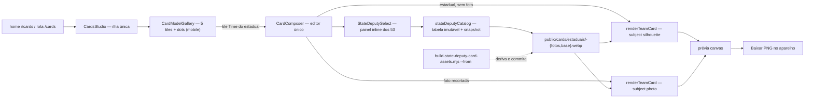

# Impl: Card personalizado com o seu estadual (dobradinha)

Status: aprovado (modo --auto)
Atualizado em: 2026-09-23
Issue: #1271
Intenção: docs/plans/cards-estadual-dobradinha.md
Appetite restante: herdado — ~1–1,5 dia eng (3 fases somam ≤1,3 dia; sem migration; o único peso novo é o commit dos ~8MB de derivativos)

## Leitura da intenção

- **Outcome:** o estúdio de cards ganha o quinto modelo `Time do estadual`: o visitante escolhe um dos 53 estaduais, digita como é chamado e envia a foto de busto; o recorte roda no aparelho e o card final é o `TIME DE <NOME>` com a arte oficial do estadual (FOTOS + visitante na janela + BASE + banners), baixável em PNG — sem conta e sem nenhum byte da foto saindo do aparelho.
- **O que NÃO negociar:**
  - 100% client-side: sem upload, sem persistência, sem analytics de PII; nome/foto nunca saem do aparelho; os quatro modelos existentes (e suas artes) intocados além do badge.
  - Um único editor/fluxo: quinto item do catálogo no MESMO `CardsStudio`/`CardComposer`; `/cards` e `?model=time-do-estadual` continuam.
  - Fluxo de foto do S15 inteiro (envio, recorte no aparelho com progresso/retry, harmonização, arrasto/zoom); nenhum controle novo nasce aqui; geometria literal do S15: janela `{286,439,592,577}`.
  - Lista dos 53 navegável por toque e teclado no celular; trocar de estadual não perde o nome nem a foto já recortada.
  - Nome em uma linha com `fitCardName`/banner azul do S16; fora do cap mínimo → pedir nome mais curto, nunca corte silencioso.
  - Catálogo derivado da arte (nome completo + número de urna), imutável e commitado; nenhum schema/migration/CMS; nenhuma leitura de `stateDeputy`/`Contact`.
- **O que reavaliar (hipóteses da intenção):**
  - **“Catálogo estático no padrão do `municipalityCatalog`”**: confirmado — `src/lib/stateDeputyCatalog.ts` client-safe + snapshot + sha256; os números saem dos lockups da arte (a base não tem número 2026).
  - **“O composer ramifica por kind”**: para não mexer no discriminante dos 4 modelos, a ramificação nova é uma flag (`stateDeputyPicker`) na 5ª entrada `kind:'team'` — registro na Decisão 1.
  - **“A arte de exemplo por estadual segue a receita”**: o tile e o placeholder pré-escolha usam o arquivo exato aprovado pelo humano (jpeg), copiado byte-a-byte; só a arte escolhida compõe o card.

## Abordagem recomendada



**Opções consideradas:** A) estender o estúdio existente com o quinto modelo + catálogo estático dos 53 + seletor inline no mesmo composer | B) rota/editor novo por estadual | C) roster em CMS/migration com assets dinâmicos.
**Recomendação:** A — o outcome é um modelo no estúdio existente; catálogo estático + derivativos commitados mantêm 100% no aparelho, dispensam schema e reusam a esteira do S15 (recorte, harmonização, banners, download); cabe no appetite.
**Rejeitadas:** B porque é o anti-goal "segundo editor"/rota por estadual e duplicaria shells/estado; C porque schema/migration está fora do escopo, a base não tem número de 2026 e o catálogo deve ser derivado da arte.

### Decisões de engenharia

1. **Quinto modelo — flag na entrada `kind:'team'`, sem novo `kind`.**
   Opções: A) 5ª entrada `time-do-estadual` (`kind:'team'`) + flag nova `stateDeputyPicker: true` ramificando o composer | B) novo valor de `kind` (ex. `'team-state'`) | C) 53 entradas no `CARD_MODELS` (uma por estadual) | D) editor/render dedicado por id.
   Recomendação: A — o fluxo é idêntico ao time (mesma janela, esteira de recorte, harmonização e banners); a flag marca só o eixo novo (seletor + arte variável) e deixa `isCardModelId`/`?model=` cobrirem o id de graça. `assetSrc`/`overlaySrc` default = par do JULIO (`/cards/estaduais/julio-fotos.webp` + `julio-base.webp`), `previewSrc` = jpeg aprovado; `photoWindow` idêntico ao S15; `badge: 'NOVO'` move de `time-de-voce` para o novo (design cena 1).
   Rejeitadas: B porque ramifica o discriminante usado pelos 4 modelos para algo que a flag expressa; C porque o estadual viraria "modelo" (galeria/pins/URL explodem) e contraria o anti-goal; D porque duplica composer/render.

2. **Catálogo e assets — módulo puro + derivativos WebP commitados + script re-derivável.**
   Opções: A) `src/lib/stateDeputyCatalog.ts` (client-safe, sem imports de `utilities/`) com `stateDeputyCatalog`/`getStateDeputyCard`/`filterStateDeputyCards`, snapshot `tests/fixtures/state-deputy-catalog.snapshot.json` (padrão `municipalityCatalog`), 106 WebP em `public/cards/estaduais/<slug>-{fotos,base}.webp` gerados por `scripts/build-state-deputy-card-assets.mjs --from <origem>` | B) collection Payload/migration | C) commitar os PNG originais (~569MB) | D) importar do diretório de origem no build/runtime.
   Recomendação: A — lib pura como o resto de `src/lib`; q≈82 (medido: FOTOS≈95KB + BASE≈51KB por estadual → ~8MB no total) porque o canvas carrega a URL crua (fora do otimizador do `next/image`) e o deploy não pode depender de diretório externo (escada de cache #3: artefato commitado via script re-executável); o script pareia `FOTOS*`/`BASE*` case-insensitive por pasta, aplica `slugify` no nome e falha se faltar par ou se a dimensão não for 1080×1440.
   Rejeitadas: B (fora de escopo; sem número 2026 na base); C (peso no repo/imagem sem ganho); D (deploy refém de pasta local e fora da escada de cache).

3. **Seletor — componente novo com painel inline do design; Base UI Combobox rejeitado.**
   Opções: A) `src/components/cards/StateDeputySelect.tsx` portando a cena 3 (trigger h-11 com nome+número+"Trocar" ou placeholder, painel inline aberto por default sem escolha, busca, lista rolável `max-h-52` com `role="listbox"`/opções, teclado ↑↓ Enter, seleção por linha inteira com check) | B) `src/components/ui/combobox.tsx` (Base UI, já no bundle público) | C) `<select>`/datalist nativo.
   Recomendação: A — o design é painel inline (busca + lista + check + teclado); o combobox renderiza popup flutuante e teria que ser reconfigurado para um visual que não é o aprovado.
   Rejeitadas: B porque popup ≠ painel inline e não entrega busca/rolagem/check do design; C porque não comporta busca/check/rolagem com o visual aprovado no mobile com 53 itens.

4. **Composição — estender o dono (`renderTeamCard`) com sujeito discriminado + silhueta pura.**
   Opções: A) `renderTeamCard` recebe `subject` (`{kind:'photo', photo, photoSize, transform}` | `{kind:'silhouette'}`) e desenha base → sujeito → overlay → banners; `drawCardVisitorSilhouette(ctx, window)` nova no `cardRender.ts`, `CardDrawContext` ganha `beginPath/arc/roundRect/fill` | B) renderizador de placeholder separado | C) silhueta desenhada ad hoc no composer.
   Recomendação: A — a ordem é a mesma do time; a silhueta é geometria pura normalizada no `photoWindow` (cor `#001a42`, cabeça circular + ombros arredondados) testável no recorder falso; `subject` discriminado evita `photoSize`/`transform` mentirosos quando não há foto; os dois call sites (prévia com foto e sem foto) ficam num caminho só.
   Rejeitadas: B porque duplicaria a composição de banners (twin do dono); C porque joga geometria para fora do módulo puro.

5. **Troca de estadual — par de arte em estado próprio (sem flicker) e harmonia congelada no recorte.**
   Opções: A) carregar `photosSrc`/`baseSrc` do selecionado num estado paralelo (`deputyImages`) mantendo o par anterior pintado até o novo decodificar; `loadState` só reflete a 1ª carga; referência de harmonia = FOTOS do estadual selecionado no momento do `start()` do recorte (trocar depois não re-harmoniza) | B) remontar o composer por estadual (`key`) | C) re-harmonizar a cada troca.
   Recomendação: A — o efeito de carga atual (`CardComposer.tsx:207-237`) zera imagens e volta `loading` a cada mudança de src (flicker); para o modelo novo a troca usa um efeito próprio que só commita o par quando os dois decodificam, sem tocar `loadState` nem re-anunciar a live region; nome e recorte sobrevivem por ficarem fora desse par. A harmonia usa a referência no `start()` (hook já congela via deps) e a troca posterior não re-harmoniza — diferença sutil entre artes da mesma receita; gatilho: UAT reprovar o tom ao trocar depois do recorte.
   Rejeitadas: B porque perde nome/recorte (viola o aceite) e pisca; C porque adiciona processamento assíncrono + guarda de corrida para ganho não comprovado.

6. **Galeria — cinco colunas no desktop e dots portados no mobile.**
   Opções: A) `lg:grid-cols-5` com gap menor (`lg:gap-4`) + dots (5 indicadores, ativo segue o scroll, `aria-label="Ir para o modelo N de 5"`) dentro do `CardModelGallery` (`'use client'`), dica "Deslize para ver os cinco modelos" | B) extrair um hook/componente genérico de dots compartilhado com `CampaignContentCarousel` | C) manter 4 colunas e esconder o 5º atrás do scroll.
   Recomendação: A — a galeria é um track de 5 tiles fixos; o padrão de dots do `CampaignContentCarousel.tsx:101-119` é pequeno e a extração tocaria uma superfície pública já entregue (que tem teclado/inert/live region próprios) para um ganho de 1 call site. Gatilho de revisitação: um 3º carrossel ou a galeria ganhar navegação por teclado.
   Rejeitadas: B (abstração prematura com risco em superfície entregue); C (viola o design: cinco tiles na mesma fileira).

7. **Gatilho do S15 (5º modelo → fatiar o composer) — adjudicado com dívida nomeada, não silenciosa.**
   Opções: A) manter o composer único neste PR e registrar a dívida com Issue específica ("extrair processing/error/ready do `CardComposer`") | B) fatiar os subcomponentes de estado agora.
   Recomendação: A — o S30 acrescenta um ramo de seletor/copy, não um novo estado de editor; fatiar agora mexe nos 4 modelos e consome folga (~0,5 dia) que o appetite não tem. A dívida entra no `capture-review-debts` no mesmo PR.
   Rejeitadas: B porque estoura o appetite e adiciona risco de plumbing num PR que já toca 4 superfícies.

8. **Testes — estender os pins e o describe do `frontend.e2e.spec.ts`; somar o prefixo do catálogo ao manifesto.**
   Opções: A) atualizar unit pins (`cardModels`, `cardRender`) e o e2e existente (loop dos 5 tiles, badge `NOVO` no novo), acrescentar o describe S30 (seleção por busca/teclado, fluxo completo com stub, troca preservando nome/recorte, placeholder pré-escolha) e adicionar `src/lib/stateDeputyCatalog.ts` ao entry de cards do `scripts/lib/e2e-affected-manifest.mjs` | B) spec e2e novo separado | C) só unit.
   Recomendação: A — o harness do S15 (stub `__cardsCutoutStub`, `TEST_PHOTO_PNG`, probes de canvas) já vive nesse spec e a superfície é a mesma; o manifest casa `src/components/cards` e `src/lib/card`, mas o catálogo novo não casa — prefixo explícito.
   Rejeitadas: B porque fragmenta o harness e duplica setup; C porque o aceite é de fluxo visual no browser (troca, seleção, download).

### Componentes / mudanças

- **`src/lib/cardModels.ts`** (editar): 5ª entrada `time-do-estadual` (`kind:'team'`, `label:'Time do estadual'`, `stateDeputyPicker: true`, `assetSrc:'/cards/estaduais/julio-fotos.webp'`, `overlaySrc:'/cards/estaduais/julio-base.webp'`, `previewSrc:'/cards/modelo-time-de-voce-com-estadual.jpeg'`, 1080×1440, `photoWindow {286,439,592,577}`, `badge:'NOVO'`); remover o badge de `time-de-voce`; tipo `CardModel` ganha `stateDeputyPicker?: boolean`.
- **`src/lib/stateDeputyCatalog.ts`** (novo, client-safe): `StateDeputyCatalogEntry { slug, name, ballotNumber, photosSrc, baseSrc }`, tabela `stateDeputyCatalog` (53, ordem alfabética da pasta/origem), `getStateDeputyCard`, `filterStateDeputyCards(query)` pura (sem acento/caixa) — sem importar `utilities/`.
- **`src/lib/cardRender.ts`** (editar): `CardDrawContext` ganha `beginPath/arc/roundRect/fill`; `drawCardVisitorSilhouette(ctx, window)` (cabeça circular 34% da largura, topo 0, esquerda 33%; ombros com a largura da janela, 72% da altura, base +3%, raios 48%/48%/10%/10%; `#001a42`); `renderTeamCard` com `subject` discriminado e retorno `{ fit, transform: CardPhotoTransform | null }`.
- **`src/components/cards/StateDeputySelect.tsx`** (novo): trigger h-11 (selecionado: nome + `número · Trocar`; vazio: `Escolha um nome`), painel inline aberto por default sem escolha, busca (`Buscar por nome`), hint `53 estaduais · use ↑ ↓ e Enter para escolher`, lista `max-h-52` com `role="listbox"`/opções, ↑↓/Enter e seleção por linha inteira com check na linha selecionada.
- **`src/components/cards/CardComposer.tsx`** (editar): estado `selectedDeputySlug`; ramo `isStateDeputyModel = isTeamModel && model.stateDeputyPicker === true` com prévia pré-escolha = jpeg aprovado; pós-escolha sem foto = `renderTeamCard` com `subject:{kind:'silhouette'}`; com recorte = `subject` photo (nome/recorte sobrevivem à troca); efeito próprio de swap do par (`deputyImages`) sem mexer em `loadState`; referência de harmonia = `getStateDeputyCard(slug)?.photosSrc`; CTA só com estadual + recorte + nome que cabe; copy nova (eyebrows `Time do estadual`/`Estadual escolhido`, títulos `Escolha sua dobradinha`/`Agora coloque seu nome`, nota `Escolha um estadual para continuar.`, legenda `Nome · número` sob a prévia pronta); falha ao carregar o par mantém o anterior + `role="alert"` recuperável.
- **`src/components/cards/CardModelGallery.tsx`** (editar): `'use client'`; `lg:grid-cols-5 lg:gap-4`; dots mobile (5, ativo segue o scroll, clique rola); dica `Deslize para ver os cinco modelos`; comentários "quatro" → "cinco".
- **`src/components/cards/CardModelTile.tsx`** (editar): `sizes` para 5 colunas (`(min-width: 1024px) 200px, 78vw`).
- **`src/app/(frontend)/(home)/cards/page.tsx`** (editar): intro/metadata `'Escolha um dos cinco modelos, personalize e baixe para compartilhar.'`.
- **`scripts/build-state-deputy-card-assets.mjs`** (novo; usa `dieWithLabel`/`sha256Hex` de `scripts/lib/cli.mjs` e `sharp`): `--from <dir>` pareia `FOTOS*`/`BASE*` case-insensitive por pasta, valida 1080×1440, `slugify` da pasta, WebP q≈82 em `public/cards/estaduais/`; falha fechado se faltar par ou duplicar slug. Script `build:state-deputy-card-assets` no `package.json`.
- **`public/cards/estaduais/*.webp`** (novo, 106 arquivos) e **`public/cards/modelo-time-de-voce-com-estadual.jpeg`** (novo, cópia byte-a-byte do asset aprovado em `docs/plans/cards-estadual-dobradinha-ui-design-assets/`).
- **Testes** (editar/novo): `tests/unit/cardModels.unit.spec.ts` (5 ids, pin do modelo novo, badge), `tests/unit/cardRender.unit.spec.ts` (subject/silhueta no recorder falso), `tests/unit/stateDeputyCatalog.unit.spec.ts` (novo, `// @vitest-environment node`; 53 entradas, slugs/5 dígitos/únicos, 106 assets em disco com 1080×1440 via sharp, snapshot + sha256 e o sha da cópia do jpeg aprovado), `tests/fixtures/state-deputy-catalog.snapshot.json` (novo), `tests/e2e/frontend.e2e.spec.ts` (loop dos 5 tiles + badge movido + describe novo), `scripts/lib/e2e-affected-manifest.mjs` (prefixo do catálogo no entry de cards → spec `frontend`).
- **`docs/changelog/2026-09-23-s30-card-time-do-estadual.md`** (novo).
- **Migration:** sem migration — nenhuma collection/global/field toca o schema; `push:false` intocado.
- **Access / Consent:** não se aplica — nenhuma superfície Payload, nenhum opt-in novo; catálogo é conteúdo estático e o fluxo é 100% client-side.
- **UI:** Impeccable B — shape (artefato aprovado, cenas 1–5) → craft (port class-by-class: grid 5, seletor, silhueta, dots) → critique (a11y teclado/toque, mobile 390, copy) → polish. Shells/tokens reusados: `CardsStudio`, `ui/dialog`, `ui/Drawer`, `CardPreviewCanvas`, `--pt-red`/`--campaign-*`/`--team-blue`; alvos ≥44px, `role=listbox`/`option`, `role=status`/`role=alert`, foco preso e retorno ao tile.

### Dados → forma (se aplicável)

Não se aplica (data-presentation Q3): nenhum KPI, mapa ou série; a única "forma" é a geometria do card e o progresso do recorte. Nome, foto e escolha são insumos locais da imagem — nunca dados coletados, apresentados ou enviados.

## Fases verificáveis

1. **Catálogo + assets + 5º modelo** — quota ~0,4 dia. `stateDeputyCatalog.ts` + snapshot + unit node (dimensões via sharp); script de assets + `package.json` + 106 WebP gerados e commitados + cópia byte-a-byte do jpeg aprovado; `cardModels.ts` com a 5ª entrada, flag e badge; pins de unit atualizados.
   Prova: `pnpm gate:fast` verde; `pnpm build:state-deputy-card-assets -- --from '<origem>'` re-executado deixa `git status public/cards/estaduais` limpo (byte-idêntico); unit do catálogo verde (53, sha256, 1080×1440).
2. **Seletor + composer + render + galeria** — quota ~0,6 dia. `drawCardVisitorSilhouette` + `subject` no `renderTeamCard` (unit no recorder falso); `StateDeputySelect`; ramo `stateDeputyPicker` no composer (swap sem flicker, silhueta, harmonia na referência do estadual, copy das cenas 3–4); galeria 5 colunas + dots + dica; intro `/cards`.
   Prova: `pnpm gate:fast` verde; `?model=time-do-estadual` no browser: pré-escolha = jpeg + CTA desabilitado + nota; seleção por busca/↑↓/Enter; pós-seleção sem foto = FOTOS + silhueta + BASE + `TIME DE`; com foto = recorte em primeiro plano; trocar estadual mantém nome e recorte sem piscar; nome longo = erro do S16 com CTA off.
3. **Gates + e2e + changelog** — quota ~0,3 dia. e2e do describe S30 + loop de 5 tiles + badge; prefixo do manifesto; changelog; `pnpm gate:fast`; e2e da superfície (`pnpm test:e2e --no-deps -- tests/e2e/frontend.e2e.spec.ts -g "Time do estadual"` e o `Cards personalizados (S14)`); `pnpm push` (pre-push roda `gate:ci`).
   Prova: e2e verde com stub (seleção por teclado, download real `card-jorge-solla-time-do-estadual.png` com assinatura PNG, troca preservando nome/recorte, placeholder pré-escolha); fixture de console-error intacta.

## Rabbit holes / Não escopo (engenharia)

- 53 entradas em `CARD_MODELS` ou query nova (`?estadual=`) — o estadual não vira modelo nem muda o contrato de URL (`#cards`, `/cards`, `?model=`).
- Re-harmonização/worker/motion na troca de estadual (Decisão 5; gatilho UAT).
- Calibrar janela/harmonia/pixel por estadual — a régua do S15 vale para as 53 (corte do plano de intenção).
- CMS/collection/migration do roster; segundo cadastro de pessoas; ler `stateDeputy`/`Contact`; número de urna vindo da base.
- Página/rota por estadual, ranking/"força", métrica, analytics (S32).
- Fatiar o `CardComposer` (Decisão 7 — dívida nomeada, não neste PR).
- Otimização em build/prebuild ou `next/image` para os assets do canvas — o script é manual, idempotente e commitado; o canvas carrega a URL crua.
- Silhueta/avatar por estadual; segundo estilo de card; compartilhamento direto em redes.

## Riscos e mitigação

- **e2e instável com 5 tiles/assets novos:** stub determinístico do S15 + waits por texto/heading + probes de canvas (`toDataURL` antes/depois da troca); assets locais same-origin.
- **Catálogo divergindo da arte:** snapshot + sha256 + contagem 53 + `ballotNumber` 5 dígitos + existência/dimensão dos 106 arquivos no unit node (falha fechado).
- **~8MB a mais no repo/imagem:** aceito (derivativos q≈82); nada no bundle JS; sem dependência do diretório de origem no build.
- **Silhueta desalinhada da arte:** geometria normalizada no `photoWindow` (a BASE cobre a base em +3%); unit da geometria + craft com o estadual real.
- **Troca de estadual mexer no recorte/harmonia:** par de arte em estado próprio; recorte/transform/name intocados; e2e "troca preserva nome e recorte"; harmonia congelada registrada como assumida.
- **Falha ao decodificar o par de um estadual:** mantém o par anterior pintado, `role=alert` recuperável e CTA bloqueado enquanto o selecionado não estiver pronto; escolher outro recupera.
- **Badge `NOVO` movido quebra pins:** unit + e2e atualizados no mesmo PR (literal assumido).
- **`CardModelGallery` client:** já era consumido apenas pela ilha client (`CardsStudio`); sem payload novo no servidor.

## Aceite de engenharia

- [ ] Aceite de produto da intenção ainda coberto: 5º modelo `Time do estadual` na home e `/cards` (`#cards`, `/cards`, `?model=time-do-estadual`); 53 estaduais por toque/teclado; recorte no aparelho com o fluxo do S15; `TIME DE <nome>` com a arte do estadual; troca sem perder nome/recorte; nome nunca cortado; derivativos commitados; 100% no aparelho; os 4 modelos intocados além do badge.
- [ ] Invariantes AGENTS/engineering-standards: sem migration/collection/Consent; `src/lib` puro/client-safe (`stateDeputyCatalog` sem `utilities/`); copy pt-BR/identificadores em inglês; sem `as never`; knip sem órfãos (script e helpers com call site); artes-mestre intocadas; `pnpm gate:fast` + e2e da superfície + `pnpm push` verdes.
- [ ] Testes de domínio previstos: unit dos módulos puros (catálogo 5 ids/badge, snapshot dos 53 + assets, silhueta/subject do render) obrigatório; e2e no spec `frontend` com stub (pré-escolha, seleção por teclado, fluxo completo e download, troca preservando nome/recorte); **int não se aplica** — sem Payload/DB/access nem escrita multi-collection neste fluxo (client-side + assets estáticos).

## Literais assumidos (auto-aprovados)

- **Modelo:** id `time-do-estadual`, label `Time do estadual`, `kind:'team'`, `stateDeputyPicker:true`, `photoWindow {286,439,592,577}`, assets default do JULIO, `previewSrc` = jpeg aprovado; **`NOVO` move de `time-de-voce` para o novo** (design cena 1) e o assert e2e acompanha.
- **Catálogo (arte, ordem alfabética da pasta):** `slug|Nome exibido|Número` — fiel aos lockups, inclusive ADRIANA→`Coletivo de Enfermagem`, JAMILLE→`Jamile da Saúde`, LENINHA→`Lenínha`:

  ```text
  adriana|Coletivo de Enfermagem|13763 · andre|André Fidalgo|13131 · andrea|Andréa Castro|55670 · angelo|Angelo Almeida|13100
  arthur|Artur Barachisio Lisbôa|55255 · bobo|Bobô|65888 · carol|Carol da Pitanguinha|13110 · cicero|Cícero Monteiro|70133
  denise|Denise Menezes|55111 · elane|Dra. Elaine|55100 · euclides|Euclides Fernandes|13123 · fabiola|Dra. Fabíola Mansur|43123
  fatima|Fátima Nunes|13567 · felipe|Felipe Duarte|70111 · geane|Geane Vasconcelos|12120 · hilton|Hilton|50150
  ivana|Ivana Bastos|55555 · jaco|Jacó|13130 · jamille|Jamile da Saúde|45456 · josafa|Josafá Marinho|12222
  juliete|Juliete Barreto|65100 · julio|Julio Pinheiro|13999 · junior|Júnior Muniz|13000 · kleber|Kleber Rosa|50500
  leninha|Lenínha Valente|13111 · leo|Leo de Neco|70700 · ludmilla|Ludmilla|55444 · magno|Magno|18000
  marcos|Dr. Marcos Adriano|12999 · marlene|Marlene do Sindicato|18111 · mestre|Mestre Reginaldo|18273 · neusa|Neusa Cadore|13690
  niltinho|Niltinho|55999 · osni|Osni|13013 · pablo|Pablo Barrozo|70900 · patrick|Patrick Lopes|70123
  pinheiro|Pinheiro|13700 · radiovaldo|Radiovaldo|13050 · roberto|Roberto Carlos|43333 · robinson|Robinson|13500
  rogerio|Rogério Andrade|15444 · rosemberg|Rosemberg|13444 · rosival|Rosival Leite|13333 · rowenna|Rowenna|13456
  silva|Silva Neto|70444 · silvio|Silvio Dias|13113 · thiago|Thiago Gilleno|10000 · vilma|Vilma Reis|13033
  vitor|Vitor Azevedo|70333 · welligton|Wellington Oliveira|40888 · wenceslau|Wenceslau|65111 · yulo|Yulo|13234
  ze-raimundo|Zé Raimundo|13222
  ```

  Origem da arte: `/home/fsolla/Downloads/DOBRADINHAS SITE-20260923T033020Z-1-001/DOBRADINHAS SITE/` (originais fora do repo).

- **Caminhos:** `public/cards/estaduais/<slug>-fotos.webp` e `<slug>-base.webp` (derivativos q≈82); `public/cards/modelo-time-de-voce-com-estadual.jpeg` = cópia byte-a-byte do asset aprovado (sha256 pinado).
- **Silhueta:** normalizada no `photoWindow` com a geometria CSS do design (cabeça circular 34% da largura/esquerda 33%/topo 0; ombros largura cheia, 72% da altura, base +3%, raios 48%/48%/10%/10%; cor `#001a42`).
- **Harmonia na troca:** a referência de tom é a FOTOS do estadual selecionado no momento do recorte; **trocar de estadual depois não re-harmoniza** (nome e recorte continuam) — gatilho: UAT reprovar o tom (Decisão 5).
- **Copy:** portados os literais novos das cenas 3–4 (`Escolha sua dobradinha`, `Estadual escolhido`, `Agora coloque seu nome`, `Escolha um estadual para continuar.`, `A prévia e o download usam a arte oficial da dobradinha escolhida.`, `A silhueta marca o lugar da sua foto. O card final usa a arte do estadual escolhido.`, `Seu estadual`, `Escolha um nome`, `Buscar por nome`, `53 estaduais · use ↑ ↓ e Enter para escolher`, `Trocar`, `Deslize para ver os cinco modelos`, legenda `Nome · número`); o resto permanece o existente (ex.: resultado `Seu card está pronto para compartilhar.` — frases alternativas do mock não são portadas).

## Self-score decision-quality: 5/5

1. **Decisões caras com rejeitadas:** modelo/flag, catálogo+assets, seletor, composição/silhueta, swap/harmonia, galeria/dots, gatilho do composer e harness de testes — todas com Opções/Recomendação/Rejeitadas.
2. **Cabe no appetite:** 3 fases ≤1,3 dia, sem migration/infra; o único peso novo (~8MB de derivativos) já estava no appetite da intenção.
3. **Rabbit holes nomeados:** 53 modelos/URL, CMS, re-harmonização, calibração por estadual, fatiar o composer, otimização em build, métricas.
4. **Depth check:** reusa `CardsStudio`/shells, `CardComposer`/`useCardCutout`/`cardRender`/`fitCardName`/banners, `cardCanvas`, o padrão de dots do `CampaignContentCarousel` e o padrão snapshot do `municipalityCatalog`; nada de abstração especulativa.
5. **Intenção preservada:** aceite de produto intacto (5º modelo, 53, recorte no aparelho, nome nunca cortado, troca preservando nome/recorte, 100% local, 4 modelos intocados); a engenharia só resolveu forma (flag, catálogo, seletor, swap).
