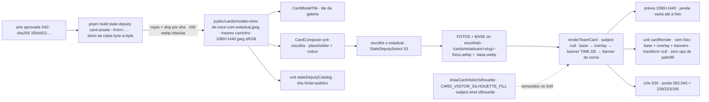

# Impl: S40 — Time do estadual: a arte de modelo genérica entregue pelo humano (sem estadual específico)

Status: aprovado
Atualizado em: 2026-09-24
Issue: #1316
Intenção: docs/plans/cards-estadual-modelo-generico.md
Appetite restante: herdado — ~0,5 dia eng; 4 fases somam ~0,5 dia, sem migration, sem asset novo (a arte já está no repo desde 2515e86b), sem dependência nova

## Leitura da intenção

- **Outcome:** o tile e o placeholder de pré-escolha do `Time do estadual` passam a ser a arte genérica aprovada (`SEU ESTADUAL` + duas silhuetas), byte-a-byte, no mesmo caminho público 1080×1440; pós-escolha sem foto, a janela fica vazia (a arte do escolhido como está) até a foto entrar — sem silhueta desenhada — e o desenho removido sai do dono junto com os pins.
- **O que NÃO negociar:** arte byte-a-byte (sem re-encode, sem recorte, sem edição e sem apagar as silhuetas dela); caminho público `/cards/modelo-time-de-voce-com-estadual.jpeg` e modelo `time-do-estadual` imutáveis; as 53 entradas do catálogo e as 106 artes intocadas; copy/notice/CTA/download/evento S32 intocados; nenhuma superfície, controle ou estado novo; a pré-escolha segue com a arte entregue (as silhuetas dela são arte, não desenho); fluxo 100% client-side, nada novo sai do aparelho.
- **O que reavaliar (hipóteses da direção) — verificadas:**
  - o asset público ainda tem os bytes antigos (`7fc8a50a…`) enquanto a fonte canônica já tem os novos (`1f5dc821…`); o unit do catálogo compara os dois (`stateDeputyCatalog.unit.spec.ts:75-82`) e está vermelho até a cópia;
  - o dono da cópia é `scripts/build-state-deputy-card-assets.mjs` (`APPROVED_EXAMPLE_SRC`/`APPROVED_EXAMPLE_OUT`, linhas 38–41 e 131–136), com `--from` obrigatório (linha 57) e skip idempotente por sha nas 106 webps (linhas 110–129);
  - o único consumidor da silhueta é o branch sem foto do composer (`CardComposer.tsx:408-423`); `CardPreviewCanvas.tsx` não a usa; `cardModels.ts:120` (`previewSrc`) serve tile e placeholder de pré-escolha pelo mesmo path;
  - no e2e, só o teste `:2251-2308` depende da silhueta (pixel `[0,26,66,255]` em `(582,540)`, linha 2276); com JULIO sem foto o novo valor no mesmo ponto é `[239,223,196,255]` (cor da `julio-fotos.webp`; a BASE é transparente ali);
  - a decisão preferida mantém banner + `drawCardName` no `renderTeamCard` (não duplicar a geometria no composer);
  - `tests/fixtures/state-deputy-catalog.snapshot.json` não contém bytes de arte — intocado.

## Abordagem recomendada

**Opções consideradas:** A) dono-propagação + remoção na raiz — rodar o script dono (copia byte-a-byte com skip por sha) e remover a silhueta desenhada no `renderTeamCard`, com `subject: null` e os pins (unit, e2e, sha) acompanhando | B) fora do dono — `cp` manual da arte e remover a silhueta | C) só a arte — trocar a arte e manter a silhueta desenhada (no-op) em vez de removê-la.
**Recomendação:** A — o script já é o contrato explícito da cópia byte-a-byte e o skip por sha mantém as 106 artes intactas; a remoção no dono do render é a limpeza pedida pelo gate, com `null` como "sem sujeito" natural e pins que provam o novo estado.
**Rejeitadas:** B porque fura o dono (o artefato público passaria a ser escrito por fora do caminho que o script e o teste definem) e ainda deixa a limpeza desacompanhada do dono; C porque viola a decisão de produto do gate (a silhueta desenhada sai) e deixa código morto sem consumidor.

### Decisões de engenharia

**1. Asset (A) — propagar pelo script dono e pinar o sha literal.**
**Opções:** A) rodar `pnpm build:state-deputy-card-assets -- --from="…/DOBRADINHAS SITE"` (dono copia byte-a-byte e re-deriva as 106 webps com skip por sha) + pinar o sha novo `1f5dc821…` no unit, mantendo a igualdade fonte×público | B) `cp` manual do asset aprovado para `public/` | C) editar o script para copiar só o exemplo.
**Recomendação:** A — o script é o dono explícito da cópia (`APPROVED_EXAMPLE_SRC`/`OUT`, linhas 38–41 e 131–136) e o skip por sha deixa as 106 webps intactas; a execução prova que o caminho do dono segue vivo e o sha literal protege o aceite contra "asset errado que casa consigo mesmo".
**Rejeitadas:** B porque fura o dono (o público deixa de ser produzido pelo fluxo que o script e o teste definem); C porque é churn sem uso — o script já copia o exemplo e o teste do catálogo já cobre o resultado.

**2. Renderer (B) — remover a silhueta; sujeito `null`.**
**Opções:** A) remover `CARD_VISITOR_SILHOUETTE_FILL`, `drawCardVisitorSilhouette` e a variante `{kind:'silhouette'}`; `TeamCardSubject` fica só com os campos da foto, achatado (o discriminante `kind: 'photo'` ficou morto e saiu no simplify); `TeamCardRenderArgs.subject: TeamCardSubject | null`; com `null`, o renderer pula o desenho do sujeito e devolve `transform: null` (base → overlay → banner `TIME DE` → banner do nome) | B) variante nova `{kind:'none'}` | C) manter a função como no-op | D) o composer desenhar base/overlay + nome por conta própria.
**Recomendação:** A — a intenção manda remover, não esconder; `null` é a forma natural de "sem sujeito" e o retorno `transform: null` é o contrato que o composer já entende (não seta transform); a composição inteira permanece no dono do render.
**Rejeitadas:** B porque cria variante para 1 caller; C porque deixa código morto (knip `exports` em ERROR) e convida a divergir; D porque duplicaria a geometria do banner/`drawCardName` fora do dono do render.

**3. `CardDrawContext` (C) — não estreitar; não-escopo com gatilho.**
**Opções:** A) manter o subset estrutural como está (a remoção orfanou `beginPath/arc/ellipse/rect/fill`; `roundRect/clip/createLinearGradient/globalAlpha` já eram mortos antes do S40) | B) estreitar removendo o que a silhueta usava.
**Recomendação:** A — `roundRect`/`clip`/`createLinearGradient`/`globalAlpha` já eram mortos antes do S40; estreitar forçaria churn no fake recorder do unit sem efeito de runtime e misturaria limpeza de tipo com o escopo de S40. O simplify (passo 5) levantou o mesmo ponto e manteve a recomendação; o precedente é o S34, que também preservou o subset ao estender o contexto.
**Rejeitadas:** B — fora do appetite; fica registrada como não-escopo com gatilho de revisita (próximo consumidor que precise do subset).

**4. Testes (D) — acompanhar a remoção, não silenciar.**
**Opções:** A) unit `cardRender`: remover os imports (`:19,22`), o teste do subject (`:320-339`) e a suíte da silhueta (`:342-373`), substituindo por "sem foto: desenha base + overlay + banners e devolve `transform: null`" (pins: `drawCalls` = `[base, overlay]`, `fit.ok`, `transform === null`, zero ops de `beginPath/arc/ellipse/rect/fill`); e2e: renomear teste/comentários ("silhouette" → janela vazia) e trocar o probe `(582,540)` para `[239,223,196,255]`; unit `stateDeputyCatalog`: pinar o sha literal novo (fonte e público) | B) deletar os testes sem substituto | C) manter nomes/comentários "silhouette" e trocar só o probe.
**Recomendação:** A — o novo estado precisa de um teste que o fixe (arte + banners, sem sujeito) e o e2e continua provando a prévia real; o pin de sha literal é o aceite byte-a-byte no unit.
**Rejeitadas:** B porque "sem foto" perderia cobertura (o e2e só olha 1 pixel); C porque deixaria comentários mentindo e o nome do teste preso a um desenho que saiu.

**5. Escopo negativo (E) — sem migration/schema/route/copy/analytics.**
**Opções:** A) tocar só: asset público, `src/lib/cardRender.ts`, `src/components/cards/CardComposer.tsx`, `tests/unit/cardRender.unit.spec.ts`, `tests/unit/stateDeputyCatalog.unit.spec.ts`, `tests/e2e/frontend.e2e.spec.ts`, changelog e este plano | B) tocar também `cardModels.ts`, `CardModelTile.tsx` e o manifesto e2e por precaução.
**Recomendação:** A — path e modelo não mudam; `src/components/cards` + `src/lib/card*` já mapeiam para o spec `frontend` no manifesto (`e2e-affected-manifest.mjs`); sem collection/global/field, logo sem migration.
**Rejeitadas:** B — churn preventivo; o que não muda não se toca.

**6. UI/design (C) — artefato aprovado cobre as cenas; crítica final (c) obrigatória.**
**Opções:** A) tratar `docs/plans/cards-estadual-modelo-generico-ui-design.html` (tier 1 · `openai/gpt-5.6-sol`) como craft aprovado e rodar a crítica final (c) do `designer` contra o app renderizado no fechamento | B) reabrir design gate/dispatch novo.
**Recomendação:** A — os triggers (a)/(b)/(d) não disparam (sem superfície/paleta/estrutura nova) e as 3 cenas já cobrem tile, placeholder e pós-escolha; a crítica (c) é obrigatória porque o diff muda o canvas.
**Rejeitadas:** B — reabrir o gate sem evidência nova de produto; o artefato tier 1 já decide composição.

### Componentes / mudanças

- **`public/cards/modelo-time-de-voce-com-estadual.jpeg`** (sobrescrito pelo dono): recebe a arte genérica byte-a-byte; mesmo caminho, mesma dimensão 1080×1440 jpeg sRGB; nada mais é escrito (as 106 webps ficam por conta do skip por sha).
- **`scripts/build-state-deputy-card-assets.mjs`** (sem editar): é o dono da cópia; rodar com `--from="/home/fsolla/Downloads/DOBRADINHAS SITE-20260923T033020Z-1-001/DOBRADINHAS SITE"`; `APPROVED_EXAMPLE_SRC`/`OUT` (linhas 38–41), cópia condicional (131–136), loop das webps com skip (110–129).
- **`src/lib/cardRender.ts`** (editar): removem-se `CARD_VISITOR_SILHOUETTE_FILL` (`:236-237`), `drawCardVisitorSilhouette` (`:239-268`), a variante `{kind:'silhouette'}` (`:270-278`) e o ramo correspondente (`:334-336`); `TeamCardSubject` fica só `photo`; `TeamCardRenderArgs.subject: TeamCardSubject | null` (`:280-289`); com `null`, o sujeito é pulado e o retorno é `transform: null`; doc de `TeamCardRenderResult.transform` (`:291-299`) e de `renderTeamCard` (`:301-307`) atualizadas; `drawCardName`/`renderNameCard`/`renderColinhaCard` intocados.
- **`src/components/cards/CardComposer.tsx`** (editar): o branch pós-escolha sem foto (`:408-423`) chama `renderTeamCard` com `subject: null` e comentário atualizado ("chosen but no photo: the art shows as-is; the window stays empty until the photo lands"); o ramo com foto (`:386-406`), o notice (`:877-883`), o CTA, o download e o evento S32 ficam como estão.
- **Testes** (ver seção própria): `tests/unit/cardRender.unit.spec.ts`, `tests/unit/stateDeputyCatalog.unit.spec.ts`, `tests/e2e/frontend.e2e.spec.ts`.
- **`docs/changelog/2026-09-24-s40-cards-estadual-modelo-generico.md`** (novo): arte genérica no tile/placeholder + remoção da silhueta desenhada e dos pins.
- **Migration:** sem migration — nenhuma collection/global/field no schema; `push:false` intocado.
- **Access / Consent:** não se aplica — nenhuma superfície Payload, nenhum opt-in; fluxo client-side e a escolha não sai do aparelho.
- **UI:** Impeccable C — shape aprovado em tier 1 (`docs/plans/cards-estadual-modelo-generico-ui-design.html`; a arte do próprio arquivo é o asset S30 sobrescrito in-place, sem pasta S40). Craft = a cópia byte-a-byte pelo dono + a remoção do desenho; critique = a crítica final (c) do `designer` contra o app renderizado (tile desktop/mobile, placeholder pré-escolha, pós-escolha com JULIO sem foto). Shells/pins reusados: `CardComposer`, `CardModelTile`, `StateDeputySelect`, `renderTeamCard`; nada de superfície nova.

### Dados → forma (se aplicável)

Não se aplica (data-presentation Q3): nenhum KPI, mapa ou série; a mudança é visual (arte + remoção de um desenho) e a medição de uso segue S32, intocada. Nenhum dado novo é apresentado.

## Fases verificáveis

1. **Asset pelo dono (tracer)** — quota ~0,1 dia. Rodar `pnpm build:state-deputy-card-assets -- --from="…/DOBRADINHAS SITE"`; revisar `git status` (só o jpeg público deve mudar; se o sharp re-encodar alguma webp, revertê-las — fora de escopo); pinar o sha literal `1f5dc8212662697149f0acac5701e8de58c53a86f5af316535736dccb7a53c7b` no unit do catálogo (fonte e público), mantendo a igualdade byte-a-byte.
   Prova: `sha256sum` igual nos dois arquivos; `pnpm gate:fast` com o unit do catálogo verde; `git status` limpo exceto o jpeg.
2. **Renderer + composer (janela vazia)** — quota ~0,2 dia. Remover fill/função/variante/ramo (Decisão 2); `subject: null` no branch do composer; docs atualizadas; substituir o teste unitário do subject/silhueta pelo teste "sem foto" (Decisão 4).
   Prova: `pnpm gate:fast`; grep de produção sem `CARD_VISITOR_SILHOUETTE_FILL|drawCardVisitorSilhouette|kind: 'silhouette'`; `?model=time-do-estadual` + JULIO no browser mostrando a arte com a janela vazia e os banners.
3. **E2E + gates** — quota ~0,1 dia. Renomear teste/comentários do S30 ("silhouette" → janela vazia) e trocar o probe `(582,540)` para `[239,223,196,255]`; manter notice/CTA/analytics como estão; rodar a cascata.
   Prova: `pnpm gate:fast`; `pnpm test:e2e --no-deps -- tests/e2e/frontend.e2e.spec.ts -g "Time do estadual"` verde; `pnpm test:e2e:affected` verde; `pnpm knip`; `pnpm check:cycles`; `pnpm format:check`.
4. **Crítica final (c) + changelog + PR** — quota ~0,1 dia. Crítica do `designer` contra o app renderizado nas 3 cenas (tile, placeholder, pós-escolha vazia) — obrigatória; changelog; prova no PR; `pnpm push` (pre-push roda o gate de CI).
   Prova: parecer da crítica (c) anexado ao PR; changelog commitado; CI do PR verde até `checks`.

### Testes previstos por camada

- **unit (recorder falso) — `tests/unit/cardRender.unit.spec.ts` (substituir):** removem-se imports (`:19,22`), o teste do subject (`:320-339`) e a suíte `drawCardVisitorSilhouette` (`:342-373`); entra "sem foto: base + overlay + banners" — `drawCalls.map(image)` = `[base, overlay]`, `fit.ok`, `transform === null`, zero ops de `beginPath/arc/ellipse/rect/fill` (os banners usam `save/translate/rotate/fillRect/fillText/restore`). O fake recorder continua implementando o subset estrutural (Decisão 3/C).
- **unit (node + sharp) — `tests/unit/stateDeputyCatalog.unit.spec.ts` (atualizar):** pin do sha literal novo (`1f5dc821…`) na fonte aprovada e no arquivo público, mantendo a comparação byte-a-byte; snapshot de identidade intocado.
- **int:** não se aplica — sem Payload/DB/access/escrita multi-collection; fluxo client-side + asset estático (o manifesto e2e também não muda).
- **e2e — `tests/e2e/frontend.e2e.spec.ts` (editar o describe S30):** probe `(582,540)` = `[239,223,196,255]`; teste/comentários renomeados para "janela vazia"; os demais testes do describe (troca mantém nome/foto, nome que não cabe, picker vazio, dots mobile) e o evento S32 seguem iguais.

## Rabbit holes / Não escopo (engenharia)

- Estreitar o `CardDrawContext` (Decisão 3/C) — gatilho de revisita: próximo consumidor que precise do subset hoje morto.
- Re-encodar/editar/recortar a arte aprovada ou apagar as silhuetas dela (rabbit holes de produto da intenção: a pré-escolha usa a arte como está).
- Tocar as 106 webps, o catálogo das 53, `stateDeputyCatalog` (além do pin), `cardModels.ts`, `CardModelTile.tsx` e o manifesto e2e (já mapeado).
- Renomear/mover o caminho público; criar campo/asset novo; segunda arte por estadual.
- Copy/notice/CTA/download/estado/analytics S32; "melhorar" o card pós-foto.
- Editar `scripts/build-state-deputy-card-assets.mjs` (o dono roda como está).
- Capturar/mediar a escolha do estadual (segue 100% local; S32 intocado).

## Riscos e mitigação

- **Rerodar o script re-deriva as 106 webps e o sharp pode re-encodar alguma:** o skip por sha evita escrita quando o buffer é idêntico; revisar `git status` e reverter webps tocadas (`git checkout -- public/cards/estaduais`) — fora de escopo. Somente o jpeg exemplo deve mudar.
- **Fonte e arte evoluírem separadas depois:** o unit pina o sha literal dos dois lados — atualizar fonte+público juntos no mesmo commit é o contrato.
- **Probe e2e dependente da arte do estadual:** usar o ponto `(582,540)` com JULIO sem foto (valor confirmado por sharp: `[239,223,196,255]`; a BASE é transparente ali); não pinar a região da antiga silhueta nem usar região com FOTOS+BASE sobrepostas.
- **Símbolos removidos ainda importados (knip `exports` em ERROR):** `tests/**/*.spec.ts` são entry — limpar os imports do unit no mesmo commit da remoção.
- **Composer `photoWindow` ausente:** o branch mantém o guard existente (`if (!photoWindow) return`) e passa `subject: null`; o modelo declara `photoWindow` fixo (`cardModels.ts:124`).
- **Comentários/doc presos à silhueta:** atualizar `cardRender.ts` (doc de `renderTeamCard`/`transform`) e o cabeçalho/probe do e2e no mesmo PR; grep de `silhouette` como prova de limpeza.
- **Crítica final (c) reprovar o fechamento:** os ajustes entram antes do push (como no S34); nenhum código novo nasce da crítica sem evidência — se reprovar, o ajuste é de craft dentro do escopo (arte/canvas), nunca de produto.

## Aceite de engenharia

- [ ] Aceite de produto da intenção ainda coberto: tile e placeholder de pré-escolha = arte genérica byte-a-byte no mesmo caminho; pós-escolha sem foto = arte do estadual escolhido com a janela vazia até a foto; pré-escolha com as silhuetas da arte; nenhum outro pixel/fluxo/copy/estado/analytics muda; desenho removido do dono sem sobras.
- [ ] Invariantes AGENTS/engineering-standards: sem migration/collection/Consent (nenhuma superfície Payload); `src/lib` client-safe; copy pt-BR e identificadores em inglês; arte aprovada intocada (a cópia é o único write); knip sem órfãos; `pnpm gate:fast`, e2e da superfície, `pnpm knip`, `pnpm check:cycles`, `pnpm format:check` e `pnpm push` verdes.
- [ ] Testes de domínio previstos (unit/int): unit `cardRender` (sem foto: base + overlay + banners, `transform: null`, zero path/fill) e unit `stateDeputyCatalog` (sha literal fonte×público) obrigatórios; e2e do descriptor S30 atualizado (probe da janela vazia) com fluxo/download/evento verdes; **int não se aplica** — sem Payload/DB/access nem escrita multi-collection.

## Self-score decision-quality: 5/5

1. **Decisões caras com rejeitadas:** asset pelo dono × `cp` × editar script; renderer (remoção × variante nova × no-op × composer compondo); `CardDrawContext` (não estreitar); testes (substituir × deletar × renomear sem mudar); escopo negativo; UI/crítica (c) — todas com Opções/Recomendação/Rejeitadas.
2. **Cabe no appetite:** 4 fases ~0,5 dia; sem migration, sem asset novo, sem dependência; o maior peso é reescrever/renomear testes existentes.
3. **Rabbit holes nomeados:** estreitar o contexto (com gatilho), editar a arte, tocar as 106/53, segundo asset/arte por estadual, copy/estados/analytics, editar o script, medição da escolha.
4. **Depth check:** reusa o dono `renderTeamCard`/`drawCardName`, o script dono da cópia, o composer/tile/seletor existentes e os pins unit+e2e do estúdio; nenhuma abstração nova — a remoção acontece no dono e o `subject: null` reusa o contrato de `transform: null`.
5. **Intenção preservada:** o outcome ("arte genérica no tile/placeholder + janela vazia pós-escolha, sem silhueta desenhada") é intocado; a engenharia só resolveu a forma (dono da cópia, `null`, limpeza e pins).
