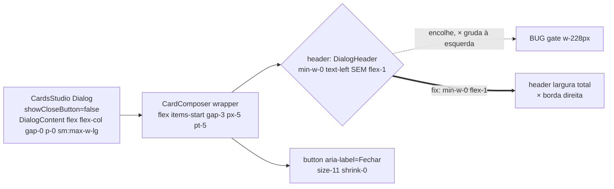

# Impl: S35 — Header do modal de criação de card: largura do card e fechar na borda

Status: aprovado
Atualizado em: 2026-09-24
Issue: #1299
Intenção: docs/plans/cards-header-modal-largura.md
Appetite restante: ~0,3–0,5 dia (quase intacto; só correção de 1 classe no ponto de uso)

## Leitura da intenção

- **Outcome:** modal desktop de criação de card com header na largura do modal — título à esquerda, botão × na borda direita — paridade com artefatos aprovados.
- **O que NÃO negociar:**
  - Drawer mobile inalterado (já correto — `DrawerHeader min-w-0 flex-1 text-left`).
  - Sem copy nova, sem tipografia nova, sem primitivas novas.
  - Correção no ponto de uso (`CardComposer.tsx` / `CardsStudio.tsx`), nunca em `src/components/ui/dialog.tsx` ou `src/components/ui/Drawer.tsx`.
  - Header único para os 6 modelos (`CardComposer.tsx:654-696` + `src/lib/cardModels.ts`) — um fix cobre todos.
- **O que reavaliar:** apenas qual classe Tailwind carrega o `flex-1/w-full` — se no `DialogHeader` ou no wrapper. Não reavaliar: primitivas, drawer, redesign do header, outras telas.

## Abordagem recomendada

**Opções consideradas:** A | B | C
**Recomendação:** Opção A — `flex-1` + `min-w-0` no `DialogHeader` do ponto de uso — porque é o depth check mínimo (reusar, não criar módulo), espelha o drawer já correto, e o gate fica determinístico. (Simplify: `w-full` removido como redundante com `flex-1` no flex-row pai — sem mudança de comportamento.)
**Rejeitadas:** C porque blast radius global (todos os modais herdam; proibido pela intenção); B porque adiciona DOM/div extra redundante que o drawer prova ser desnecessária.

### Opção A — `flex-1 + w-full + min-w-0` no `DialogHeader` do ponto de uso (recomendada)

- Mudar `src/components/cards/CardComposer.tsx:681` de `min-w-0 text-left` para `min-w-0 flex-1 text-left` (manter `min-w-0` para ellipsis não estourar o flex).
- Wrapper `:800-810` (`flex items-start gap-3 px-5 pt-5` + `{header}` + botão fechar) e shell `CardsStudio.tsx:74-93` ficam intocados.
- Custo: 1 linha. Reversível em segundos. Precedente direto S15/S23/S30/S31 (fix no ponto de uso).

### Opção B — Alargar pelo wrapper (`flex-1` no slot do header ou `justify-between`/`w-full` no container)

- Ex.: envolver `{header}` em `
` ou dar `w-full` ao wrapper.
- Funciona, mas adiciona DOM/div extra para corrigir o que é falta de `flex-1` no próprio `DialogHeader`; diverge do drawer que já resolve com `flex-1` no header (`:689`).

### Opção C — Corrigir na primitiva `ui/dialog.tsx:51-83`

- Ex.: forçar `DialogHeader` a `flex-1 w-full` por padrão.
- **Rejeitada:** blast radius global — todo `Dialog` do app herdaria o comportamento; viola a regra "correção no ponto de uso, nunca na primitiva".

### Componentes / mudanças

- **`src/components/cards/CardComposer.tsx:681`** (`DialogHeader`): adicionar `flex-1` (manter `min-w-0 text-left`). Única mudança de produção esperada.
- **`src/components/cards/CardComposer.tsx:800-810`** (wrapper): **somente leitura/verificação**, sem edição salvo se o gate provar insuficiência (fallback: Opção B).
- **`src/components/cards/CardsStudio.tsx:74-93`** (shell Dialog): **sem edição** (`showCloseButton={false}`, `DialogContent flex flex-col gap-0 p-0 sm:max-w-lg` já corretos). Mobile `:60-72` (`Drawer` + `h-dvh`): **não tocar**.
- **`src/lib/cardModels.ts` + `CardComposer.tsx:654-696`**: nenhum branch por modelo; fix único cobre os 6.
- **`tests/e2e/frontend.e2e.spec.ts:1824-2453`**: suíte de referência; estender/ajustar asserção de largura do header se ainda não cobrir (precedente S15/S23/S30/S31).
- **NÃO tocar:** `src/components/ui/dialog.tsx:51-83`, `:85-93`, `src/components/ui/Drawer.tsx:161-170`.
- **Migration:** sem migration — sem mudança de schema.
- **Access / Consent:** N/A — sem mudança de acesso, sem opt-in, sem PII.
- **UI:** Impeccable C — sem linguagem visual nova, só alinhamento/ocupação de largura para paridade. Evidência = screenshot desktop antes/depois + gate e2e verde; drawer mobile pixel-idêntico.

### Dados → forma (se aplicável)

N/A — nenhum dado novo; header deriva dos 6 modelos existentes em `src/lib/cardModels.ts`.

## Fases verificáveis

1. **Tracer / schema+server — visual (0,1 dia):** aplicar Opção A (1 classe em `:681`); subir `pnpm dev`; abrir criação de card no desktop (viewport ≥1024) e confirmar: título à esquerda, × na borda direita, header ocupa a largura do modal; abrir drawer mobile e confirmar inalterado.
2. **UI (0,1–0,2 dia):** rodar/estender `tests/e2e/frontend.e2e.spec.ts:1824-2453` — asserção: header com `flex-1` ocupando a linha, botão `aria-label=Fechar` alinhado à borda direita. Rebase sobre `main` e checar conflito com #1277/S33/S34.
3. **Gates — `pnpm gate:fast`; push via `pnpm push` (0,1 dia):** lint → format → typecheck → unit/int afetados → build → e2e selecionado; PR com antes/depois desktop + confirmação de drawer inalterado.

## Rabbit holes / Não escopo (engenharia)

- **NÃO** editar `src/components/ui/dialog.tsx` nem `src/components/ui/Drawer.tsx`.
- **NÃO** redesenhar o header (copy, tipografia, ícone, espaçamento novo).
- **NÃO** tocar no drawer mobile (`CardComposer.tsx:689`, `CardsStudio.tsx:60-72`).
- **NÃO** investigar `useIsMobileMeasured` / breakpoints do shell.
- **NÃO** abrir outras telas/modais.
- **Cuidado conflito:** #1277/S33/S34 tocam áreas vizinhas — rebase cedo; manter `flex-1` no `DialogHeader` (Opção A), não duplicar no wrapper.

## Riscos e mitigação

- Fix no header não basta (wrapper impõe shrink) — Baixa/baixo — fallback Opção B; gate e2e decide em minutos.
- Regressão no drawer mobile — Baixa/médio — não tocar no drawer; verificação manual mobile + e2e existente.
- Regressão em outros Dialogs — Muito baixa/alto — não tocar na primitiva; mudança isolada a `CardComposer.tsx:681`.
- Conflito com #1277/S33/S34 — Média/baixo — rebase antes da Fase 2; fix de 1 linha reaplica-se trivialmente.
- Gate e2e não cobre a largura do header — Média/baixo — estender asserção em `frontend.e2e.spec.ts:1824-2453`.

## Aceite de engenharia

- [ ] Aceite de produto da intenção ainda coberto (header largura total desktop, drawer idêntico)
- [ ] Invariantes AGENTS/engineering-standards (ponto de uso, sem primitiva, sem migration, sem access/consent)
- [ ] Testes de domínio previstos (e2e do funil; sem unit/int — sem lógica pura/fronteira Payload)

**Self-score decision-quality: 5/5** — só o ponto de uso é decisão (A vs B vs C registradas); depth check = reusar header existente, zero módulo novo; appetite respeitado com tracer bullet; rabbit holes nomeados; reversibilidade explícita (1 classe Tailwind).
