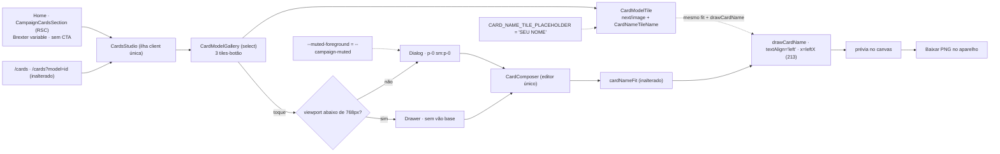

# Impl: Cards personalizados: ajustes de fidelidade e experiência (S14)

Status: em execução
Atualizado em: 2026-09-12
Issue: #959
Intenção: docs/plans/cards-personalizados-ajustes.md
Appetite restante: herdado — ~1–1,5 dia eng (3 fases somam ≤1,5 dia; sem migration)

## Leitura da intenção

- **Outcome:** o visitante vê a seção `Mostre que você está com Solla` na home, toca num dos três modelos e o MESMO compositor do `/cards` abre ali mesmo (modal no desktop, drawer no mobile), sem navegar; o nome no card gerado alinha à esquerda com a linha `SOU` (borda x≈213, em 1 e 2 linhas, sem corte), o tile do modelo de nome mostra o resultado real da string, a moldura do modal encosta no conteúdo, a ajuda fica legível e a seção passa a ficar imediatamente antes da captura de novidades — sem conta e sem que nome/foto saiam do aparelho.
- **O que NÃO negociar:**
  - **Um único editor.** A home abre a ilha `CardsStudio`/`CardComposer` existente; nenhum segundo compositor, nenhum estado duplicado (anti-goal "dois fluxos de criação" da intenção).
  - **100% client-side e sem PII em rede/analytics.** Nome/foto processados no aparelho; sem upload, persistência, collection/global/migration/Consent novo.
  - **`/cards` e o deep-link `/cards?model=<id>` intactos** como rota canônica (o gate manteve a rota; só o comportamento da home muda).
  - **Arte-mestre intocada** e geometria do mestre preservada: borda esquerda x≈213 (canvas 1080), tinta ≤714px, cap 106, Brexter 700, fill `#ffec01`.
  - **Copy literais** da intenção preservados (`Mostre que você está com Solla`, `SEU NOME`, `Arraste para posicionar e use os controles para aproximar ou ajustar.`).
  - **As demais seções da home não mudam** — e o fit do nome (tamanho/quebra atuais) permanece; a entrega só muda o alinhamento.
- **O que reavaliar (hipóteses da intenção / rascunho):**
  - **Ordem literal do rascunho.** `… → Acompanhe de perto → cards → Receba as novidades` não existe no código: "Acompanhe de perto" é `CampaignContentSection` (`data-home-section="contents"`) e está no começo da home (`page.tsx:142`), antes de problem/flags/story. O aceite operativo é "cards imediatamente antes de Receba as novidades" → mover `<CampaignCardsSection />` para entre `CampaignStorySection` e `CampaignNewsletterSection`. **Divergência registrada para o gate humano** (decisão 2).
  - **Tile em HTML com Brexter.** Não se sustenta: `SEU NOME` tem avanço de 6,7em e, no cap ideal (corpo 151,43px), mede ~1014px — não cabe em `maxInkWidth` 714; o fit real encolhe a string (corpo 106 → cap ~74). Um placeholder HTML com `font-size` calibrado valeria só para essa string e mentiria a geometria.
  - **Home RSC com tiles-link.** Deixa de valer: a home renderiza a ilha client e os tiles viram botões; a variante `link` do `CardModelGallery` e o helper `cardModelHref` ficam sem call site.

## Abordagem recomendada

**Opções consideradas:** A) ajustar no dono — a home renderiza a ilha existente, a geometria do nome vira `leftX` + `drawCardName` reusado pelo canvas do tile, o contraste vira token do tema e o vão é corrigido no call site do dialog | B) criar superfície/editor próprios na home | C) manter o CTA e o link para `/cards`, ajustando só o resto.
**Recomendação:** A — um único editor (estado e comportamento idênticos), cada correção no módulo que já é dono do concern (renderer puro, token do tema, seção da home, call site do dialog) e o menor blast radius possível.
**Rejeitadas:** B porque é o rabbit hole "segundo editor" da intenção — dois estados divergem e qualquer ajuste futuro passa a valer em dobro; C porque contraria a decisão do gate de 2026-09-12 (o modelo abre o compositor ali mesmo e o CTA `Criar meu card` sai).

### Decisões de engenharia

1. **Home abre o mesmo compositor (ilha única; CTA removido).**
   Opções: A) `CampaignCardsSection` continua RSC e renderiza a ilha client `CardsStudio` (`fontFamily={brexterBold.style.fontFamily}` + `brexterBold.variable` na section) e o CTA `Criar meu card` é removido | B) criar um compositor próprio na home (estado/shell novos) | C) manter o CTA e o link para `/cards` (status quo).
   Recomendação: A — a home e `/cards` são o mesmo funil; a ilha já é dona de `selectedId`/`open`, das cascas `ui/dialog`/`ui/Drawer` e do editor único; `focusSelectedTile` já varre `[data-card-model-tile]` visível e funciona na home, então o retorno de foco ao fechar não muda.
   Rejeitadas: B porque dois editores divergem (o rabbit hole "dois fluxos de criação" da intenção); C porque o gate decidiu que o modelo abre o compositor ali mesmo e que o CTA sai.
   Consequências: a variante `link` do `CardModelGallery` e o helper `cardModelHref` ficam sem call site → **removidos no mesmo PR** (knip trata export morto como ERROR; só a home e um unit usavam); `Link` sai de `CampaignCardsSection`/`CardModelGallery`; o unit de `cardModelHref` sai junto. A rota `/cards` e o `?model=` permanecem intocados (a page segue passando `fontFamily` e sanitizando o param). O comentário S13 da seção é atualizado (posição e comportamento).

2. **Ordem da home — cards imediatamente antes da newsletter.**
   Opções: A) mover `<CampaignCardsSection />` para entre `<CampaignStorySection />` e `<CampaignNewsletterSection … />` | B) mover também `CampaignContentSection` para colar em cards (satisfazer a ordem literal do rascunho) | C) manter no fim da página (depois da newsletter) e só trocar o gatilho.
   Recomendação: A — satisfaz o aceite operativo (cards imediatamente antes da captura; a captura segue como último bloco de conversão) sem tocar nas demais seções.
   Rejeitadas: B porque "as demais seções da home não mudam" é guardrail da intenção e mover "Acompanhe de perto" do topo para o fim é redesenho de home, fora do appetite; C porque contraria o gate e o aceite "antes de Receba as novidades".

   > **Divergência para o gate humano:** o rascunho UI mostra "Acompanhe de perto" colado antes dos cards, mas no código real essa seção é `CampaignContentSection` e vive no começo da página; a ordem implementada é `… → story → cards → newsletter → rodapé`. Se o humano quiser a ordem literal do rascunho, mover `CampaignContentSection` é outro item (não este).
   > Pins: o e2e deixa de exigir `cards = newsletter + 1` e passa a exigir `newsletter = cards + 1` **e** `cards = story + 1`.

3. **Alinhamento à esquerda — geometria no dado e desenho extraído.**
   Opções: A) trocar `NAME_CARD_SLOT.centerX: 570` por `leftX: 213` e extrair de `renderNameCard` um `drawCardName(ctx, { fit, fontFamily, slot? })` puro que desenha SÓ o nome (1 e 2 linhas) com `textAlign='left'` em `slot.leftX`; `renderNameCard` passa a chamar `drawCardName` | B) manter `centerX` e derivar `leftX = centerX − maxInkWidth/2` no render | C) alinhar só a 1ª linha à esquerda e manter o bloco de 2 linhas centrado.
   Recomendação: A — o dado do mestre é a borda (213 = 570 − 714/2, a borda esquerda do mestre), não o centro; `drawCardName` fica reusável pelo tile sem duplicar geometria.
   Rejeitadas: B porque a borda vira derivada ambígua (se o fit/`maxInkWidth` mudar, a borda muda em silêncio); C porque o aceite exige borda esquerda nas duas linhas (o bloco de 2 linhas mantém a mesma lógica vertical atual, mas ambas as linhas partem de `leftX`).
   Consequências: o fit NÃO muda (largura/quebra/min cap intactos em `cardNameFit`); `renderNameCard` = base → fit → `drawCardName`; `drawCardName` não desenha nada quando `!fit.ok` (nunca corta). O comentário do slot registra a borda esquerda x=213 e a tinta ≤714 (`[213..927]`).

4. **Tile fiel via o próprio renderizador (canvas transparente sobre o `next/image`).**
   Opções: A) o tile do modelo de nome vira base `next/image` (como hoje) + overlay canvas client `CardNameTileName` que espera `ensureCardFont`, roda `fitCardName('SEU NOME', createCardMeasure(ctx, fontFamily))` e chama `drawCardName` | B) manter placeholder HTML com Brexter e `font-size` em cqw calibrado pelo cap ratio | C) canvas desenhando a base inteira no tile (sem `next/image`).
   Recomendação: A — mesma geometria do resultado por construção (mesmo fit, mesmo slot, mesma cor), sem constantes de métrica de fonte no CSS e sem re-baixar a base (o canvas é transparente).
   Rejeitadas: B porque exigiria codificar métricas da fonte (cap ratio/avanços) e replicar o fit no CSS — e o número em cqw só vale para `SEU NOME` (a string encolhe no fit real, então um cap fixo mentiria); C porque re-baixa 427KB no tile e perde o `next/image` otimizado/lazy.
   Consequências: `fontFamily` desce `CardsStudio → CardModelGallery → CardModelTile`; `containerType`, `font-size: 11.5cqw`, `tracking-[-0.02em]` e `--font-exo2` saem do placeholder; o literal `SEU NOME` vira `CARD_NAME_TILE_PLACEHOLDER` em `cardCopy.ts`; o canvas é decorativo (`aria-hidden`, o botão já tem `aria-label`). **Consequência visual registrada:** `SEU NOME` aparece com cap ~74 (o corpo 106 que o fit escolhe para caber nos 714px), não com o cap 106 do exemplo `FULANO` do mestre — é o resultado real da string, que é o que o aceite pede. Se a fonte não carregar, o overlay fica vazio (nunca medir/desenhar com fallback, que mentiria a geometria).

5. **Vão do modal — corrigir no call site.**
   Opções: A) `p-0 sm:p-0` no `className` do `DialogContent` em `CardsStudio.tsx` (precedente `PetitionSuccessDialog.tsx:46`) | B) mexer no `ui/dialog.tsx` base (remover/reordenar o `sm:p-8`) | C) compensar o padding no `CardComposer` com margens negativas.
   Recomendação: A — o `sm:p-8` base sobrevive ao `p-0` do call site porque o twMerge só remove a variante sem breakpoint; `sm:p-0` vence e o vão some preservando borda fina e raio.
   Rejeitadas: B porque atinge todos os dialogs do app (admin/campanha) que dependem de `p-6 sm:p-8` — fora do appetite; C porque é hack de layout que quebra se o padding base mudar.
   Consequências: `DrawerContent` não tem padding base (nada a fazer no mobile); o `CardComposer` já traz `px-5` próprios no header/body/footer.

6. **Contraste da ajuda — token do tema, não band-aid.**
   Opções: A) definir `--muted-foreground: var(--campaign-muted)` dentro de `[data-theme='campaign-site']` (`styles.css`) | B) className local `text-(--campaign-muted)` nos dois `DialogDescription`/`DrawerDescription` do `CardComposer` | C) criar um tema novo para o funil de cards.
   Recomendação: A — o tema é claro (fundo branco) e hoje herda o `--muted-foreground` near-white do `:root` (pensado para o dark); `--campaign-muted: #6c615e` já existe no tema e tem ~6:1 sobre branco (≥4.5:1); conserta os dois shells de uma vez e qualquer uso futuro de `muted-foreground` no tema (o portal re-aplica `data-theme="campaign-site"`, então herda o token).
   Rejeitadas: B porque é band-aid — deixa a raiz (o próximo `muted-foreground` no tema volta a ser ilegível); C porque é tema paralelo sem necessidade.
   Verificação: grep não encontra outro `text-muted-foreground` no subtree `campaign-site` hoje → mudança sem regressão.

7. **Testes — atualizar o harness existente.**
   Opções: A) atualizar os pins de `cardModels`/`cardRender`, adicionar o unit do `drawCardName` e reescrever o describe de cards no spec `frontend` (home nova + asserção de alinhamento por pixel), mantendo `/cards`/`?model=`/download | B) criar um spec e2e novo + `testMatch` + manifest.
   Recomendação: A — o projeto `frontend` já coleta o describe e o manifest já mapeia `src/components/cards`/`src/lib/card` → `frontend` (S13); menor blast radius, mesma cobertura de fluxo.
   Rejeitadas: B porque muda config + manifest + pins por nenhum ganho (é o mesmo funil).
   Cobertura unit: `cardModels` pina `leftX: 213` (e perde o teste de `cardModelHref`); `cardRender` pina `x = leftX`/`textAlign = 'left'` e ganha um `describe('drawCardName')` — (a) desenha só texto (nenhum `drawImage`), na borda; (b) 2 linhas, ambas em `leftX`, baselines dentro da banda; (c) `fit.ok === false` não desenha; `cardNameFit` fica intocado.
   Cobertura e2e (describe renomeado para `Cards personalizados (S14)`): home com `newsletter = cards + 1` e `cards = story + 1`; 3 tiles-botão e ausência do link `Criar meu card`; clique em `Moldura quadrada` abre o diálogo **sem navegar** (URL segue `/`) e `Escape` fecha devolvendo o foco ao tile; fluxo de `/cards`/`?model=` e download PNG mantidos; asserção de alinhamento no canvas do nome (menor x com pixel amarelo na faixa y[430..535] em ~[205..240]; centralizado para `João` começaria >280) e, se barato, a mesma varredura no canvas do tile (`section#cards canvas`).
   Manifest/prewarm: **sem mudança** (prefixos `src/components/cards`/`src/lib/card` e `/cards` no prewarm já existem).

8. **Changelog e higiene.**
   - `docs/changelog/2026-09-12-s14-cards-personalizados-ajustes.md` (OPS85): entrada curta do funil (home abre o compositor, alinhamento, tile fiel, vão, contraste, ordem).
   - Sem migration; sem Payload/Consent; 100% client-side; nenhuma PII em rede.
   - `codebase-map.mdc` não precisa mudar (a linha de `src/components/cards/` já cobre o estúdio e não há módulo movido).

### Componentes / mudanças

- **`src/lib/cardModels.ts`** (editar): `NAME_CARD_SLOT.centerX: 570` → `leftX: 213`; comentário do mestre atualizado (borda esquerda, tinta ≤714 em `[213..927]`); remover `cardModelHref` (sem call site).
- **`src/lib/cardRender.ts`** (editar): extrair `drawCardName(ctx, { fit, fontFamily, slot? })` puro (só o nome; `textAlign='left'`; 1 linha na baseline `capTop + capHeight`; 2 linhas no mesmo cálculo vertical de hoje, ambas em `slot.leftX`; `!fit.ok` → nada); `renderNameCard` passa a delegar o desenho.
- **`src/components/cards/cardCopy.ts`** (editar): `CARD_NAME_TILE_PLACEHOLDER = 'SEU NOME'`.
- **`src/components/cards/CardNameTileName.tsx`** (novo, client): canvas transparente `absolute inset-0 h-full w-full` (dimensões intrínsecas do modelo); efeito com `ensureCardFont(fontFamily)` → `fitCardName(CARD_NAME_TILE_PLACEHOLDER, createCardMeasure(ctx, fontFamily))` → `drawCardName`; cleanup cancela; `aria-hidden`.
- **`src/components/cards/CardModelTile.tsx`** (editar): remover o placeholder HTML (e `containerType`/`11.5cqw`/`tracking`/`--font-exo2`); renderizar `<CardNameTileName model={model} fontFamily={fontFamily} />` sobre o `next/image`; nova prop `fontFamily: string`.
- **`src/components/cards/CardModelGallery.tsx`** (editar): select-only — remover `variant`/`Link`/`cardModelHref`; manter `selectedId`/`onSelect`, os dois tracks (grid/peek) e `data-card-model-tile`; repassar `fontFamily` ao tile.
- **`src/components/cards/CardsStudio.tsx`** (editar): repassar `fontFamily` ao gallery; `DialogContent` com `p-0 sm:p-0` (mantém `gap-0`, `max-h-[92dvh]`, `overflow-hidden`, `sm:max-w-lg`).
- **`src/app/(frontend)/(home)/CampaignCardsSection.tsx`** (editar): importa `brexterBold` (`variable` na section + `style.fontFamily` no estúdio), renderiza `<CardsStudio fontFamily={…} />`, remove o bloco do CTA e o import de `Link`; atualiza o comentário S13 (antes da captura, abre o compositor).
- **`src/app/(frontend)/(home)/page.tsx`** (editar): mover `<CampaignCardsSection />` para entre `<CampaignStorySection />` e `<CampaignNewsletterSection … />`.
- **`src/app/(frontend)/styles.css`** (editar): `--muted-foreground: var(--campaign-muted)` no bloco `[data-theme='campaign-site']`.
- **`tests/unit/cardModels.unit.spec.ts`** (editar): pin `leftX`; remover o teste/import de `cardModelHref`.
- **`tests/unit/cardRender.unit.spec.ts`** (editar): pins de `leftX`/`textAlign='left'` + `describe('drawCardName')`.
- **`tests/e2e/frontend.e2e.spec.ts`** (editar): describe S14 com home/ordem/botões/sem-navegação/foco/alinhamento e os fluxos canônicos mantidos.
- **`docs/changelog/2026-09-12-s14-cards-personalizados-ajustes.md`** (novo).
- **Migration:** sem migration — nenhuma collection/global/field toca o schema; `push:false` intocado.
- **Access / Consent:** não se aplica — nenhuma superfície Payload; nenhum dado pessoal trafega; sem chave nova de Consent.
- **UI:** Impeccable C — craft/critique/polish dos seis ajustes sobre os shells existentes (`ui/dialog`, `ui/Drawer`, `useIsMobileMeasured`); sem componente de UI novo além do canvas do tile; alvos ≥44px e foco visível preservados.

### Dados → forma (se aplicável)

Não se aplica (data-presentation Q3): nenhum KPI, mapa ou série. A única "forma" é a geometria do próprio card (definida pelas artes-mestre); nome/foto são insumos locais da imagem, nunca dados apresentados ou coletados.

## Fases verificáveis

1. **Fidelidade do nome (núcleo + tile)** — quota ~0,5 dia. `leftX` + `drawCardName` + units; `CardNameTileName` + `CARD_NAME_TILE_PLACEHOLDER`; `CardModelGallery` select-only e remoção de `cardModelHref`/variante link; thread do `fontFamily`.
   Prova: `pnpm gate:fast` verde; unit pinando borda esquerda nas 1 e 2 linhas; no craft, o tile do modelo de nome desenha `SEU NOME` com a mesma geometria do card (x=213) e o card com `João` mantém cap 106.
2. **Experiência (home + modal + contraste)** — quota ~0,5 dia. `CampaignCardsSection` renderiza a ilha e perde o CTA; ordem nova em `page.tsx`; `p-0 sm:p-0`; token de contraste.
   Prova: home abre o compositor sem navegar (URL `/`); fechar volta à seção; a captura de novidades fica imediatamente depois dos cards; ajuda legível nos dois shells (contraste ~6:1).
3. **Gates + e2e + changelog** — quota ~0,5 dia. Describe e2e reescrito (ordem, botões, sem navegação, foco, alinhamento por pixel, `/cards`/`?model=`/download); changelog; `pnpm gate:fast`; e2e local do describe (`pnpm test:e2e --no-deps -- tests/e2e/frontend.e2e.spec.ts -g "Cards personalizados"`); `pnpm push`.

## Rabbit holes / Não escopo (engenharia)

- Não criar segundo editor/estado na home: a ilha `CardsStudio`/`CardComposer` é a única.
- Não mexer em `ui/dialog.tsx`/`ui/Drawer.tsx` para o vão (atinge o app inteiro) nem criar tema novo para o contraste.
- Não redesenhar as artes-mestre nem recalibrar o fit (`cardNameFit` intocado; `SEU NOME` encolhe porque é o resultado real da string).
- Não remover `/cards` nem quebrar o deep-link `?model=`.
- Não usar canvas para desenhar a base no tile (perde `next/image` otimizado/lazy).
- Não mover outras seções da home: a divergência da ordem literal vai ao gate, não vira redesenho.
- Não adicionar CMS/catálogo dinâmico, share social, analytics de uso ou métricas de clique.
- Não testar pixel no jsdom (unit usa ctx fake); a fidelidade é provada no e2e/craft.

## Triagem pós-simplify (capture-review-debts, 2026-09-12)

**Já resolvido no simplify/critique (não reabrir):** duplicação da varredura de pixel amarelo nos dois testes e2e (helper `readCardNameBand`/`expectCardNameLeftAligned` extraído); prop `priority` morta no `CardModelTile` (removida); tipo inline do `drawCardName` (`CardNameDrawArgs`); rename `CardNameTileName` → `CardNameTileCanvas`; prefixo de comentário `S13/S14`; estado a11y anunciado 2× (sufixo `(selecionado)` removido, `aria-pressed` fica); comentário impreciso do `brexterBold.variable`; `toHaveURL(/\/$/)` fraco no e2e da home (pathname pinado).

**Explicitamente fora / descartado:** falha do `pnpm exec knip` ao carregar `src/payload.config.ts` neste ambiente — pré-existente em `main` (reproduzida no checkout principal), fora do diff; achados visuais do design-vision (desalinhamento SOU×nome, alt ausente, foco ausente, padding no modal, falta de CTA no drawer) refutados por medição objetiva (nome minX 217 vs borda SOU 213; tiles decorativos com `aria-label` no botão; input com `focus-visible` e 16px; `p-0 sm:p-0` é o aceite; `Cancelar`/`Criar meu card` visíveis a 44px). Nada a registrar.

## Riscos e mitigação

- **Divergência da ordem literal do rascunho:** registrada na decisão 2 e no PR para o gate humano; o e2e pina o aceite operativo (`newsletter = cards + 1`). Mover `CampaignContentSection` seria outro item, fora do appetite.
- **Fonte não pronta no canvas do tile:** `ensureCardFont` antes de medir/desenhar; enquanto isso o tile mostra só a base; nunca medir com fallback (a geometria mentiria).
- **Export morto após a home virar botões:** `cardModelHref`/variante `link` saem no mesmo PR; `pnpm knip` acusa se sobrar algo.
- **Token de contraste vazando para outra superfície `campaign-site`:** grep confirma que não há outro `text-muted-foreground` no subtree; o token é o da casa e o tema é claro.
- **E2E de pixel flaky:** usar a mesma máscara amarela do teste existente e tolerância larga (x≤240; centralizado para `João` começaria >280); `expect.poll` espera o draw e o `ensureCardFont`.
- **`sm:p-0` não vencer o `sm:p-8` base:** twMerge remove a classe base de mesma variante; validar visualmente no craft (precedente `PetitionSuccessDialog` faz exatamente isso).
- **Peso novo na home:** o canvas do tile dispara `document.fonts.load` da Brexter (~38KB) quando a seção monta; aceito pela intenção (tile fiel), `preload:false` mantido e o arquivo é o mesmo do funil (cacheável).
- **Foco ao fechar na home:** `focusSelectedTile` já varre o tile visível — o da home é o próprio gatilho; o e2e cobre.
- **Regressão do fluxo canônico:** os testes de `/cards`, `?model=` e download permanecem; só o teste da home muda.

## Aceite de engenharia

- [ ] Aceite de produto da intenção coberto: home abre o compositor no lugar (modal desktop/drawer mobile) sem navegar e fecha de volta à seção; CTA removido; nome alinhado à esquerda (x≈213) em 1 e 2 linhas sem corte; tile fiel via o próprio renderizador; seção imediatamente antes da newsletter; modal sem vão; ajuda ≥4.5:1; `/cards` e `?model=` intactos; um único editor.
- [ ] Invariantes AGENTS/engineering-standards: sem schema/migration/Payload/Consent; nenhuma PII em rede/analytics; `src/lib` puro (sem Next/DOM); copy pt-BR / identificadores em inglês; sem `as never`; knip sem órfãos; `pnpm gate:fast` + `pnpm push` verdes.
- [ ] Testes de domínio previstos: unit dos módulos puros atualizado (`leftX`/`drawCardName`) e e2e no spec `frontend` reescrito com alinhamento por pixel; **int não se aplica** — não há Payload/DB/access nem escrita multi-collection neste fluxo (100% client-side + assets estáticos).

## Self-score decision-quality: 5/5

1. **Decisões caras com rejeitadas:** ilha única na home, ordem, geometria/desenho (`leftX`/`drawCardName`), tile fiel, vão do modal, contraste, harness de teste e changelog — todas com Opções/Recomendação/Rejeitadas e consequências.
2. **Cabe no appetite:** 3 fases somam ≤1,5 dia, sem migration, sem infra nova; a fidelidade do nome (maior risco) vem primeiro.
3. **Rabbit holes nomeados:** segundo editor, mexer nos shells base, redesenho das artes/fit, mover outras seções da home, CMS/share/analytics, teste de pixel no jsdom.
4. **Depth check:** reusa `CardsStudio`/`CardComposer`/`ui/dialog`/`ui/Drawer`/`ensureCardFont`/`createCardMeasure`/tema; `drawCardName` é extraído do próprio `renderNameCard` (sem módulo novo) e o placeholder vai para o `cardCopy` existente.
5. **Intenção preservada:** aceite de produto intacto; a única divergência (ordem literal do rascunho) está explicitada e é levada ao gate humano.
