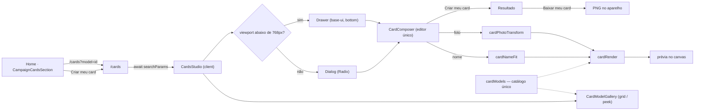

# Impl: Cards personalizados da campanha no site público

Status: em execução
Atualizado em: 2026-09-12
Issue: #941
Intenção: docs/plans/cards-personalizados-campanha.md
Appetite restante: herdado — ~3–4 dias eng (fases 1–4 somam ≤4 dias; sem migration)

## Leitura da intenção

- **Outcome:** o visitante (majoritariamente no celular) encontra o convite na home com os três modelos, entra em `/cards`, personaliza com nome ou foto, confere a prévia e baixa um PNG com a identidade da campanha — sem conta e sem que nome/foto saiam do aparelho.
- **O que NÃO negociar:**
  - Fluxo 100% client-side: sem upload, sem persistência, sem conta, sem analytics de PII; nome/foto nunca saem do aparelho.
  - Nenhuma collection/global/migration/CMS novo; artes-mestre intocadas (compor por cima, nunca redesenhar).
  - Dimensões reais de saída: nome `1080×1440`; foto quadrada `1000×1000`; foto vertical `1000×1440`.
  - Nome nunca cortado silenciosamente: reduzir/quebrar até o mínimo legível; acima disso, erro acionável.
  - `/cards` é a única superfície de edição; o download do PNG é o fim (sem API de rede social).
  - Copy literais da intenção preservados.
- **O que reavaliar (hipóteses da intenção):**
  - “Arquivos originais já estão acessíveis em `/home/fsolla/Documentos/cards/`” — verdade no workstation, **não** em produção: assets e fonte precisam ser provisionados no repo (o Dockerfile copia `src/` e `public/`).
  - “overlays responsivos existentes apenas como referência” — o overlay oficial é o próprio PNG mestre; não recriar faixas/contra-formas em CSS/SVG.
  - A base do modelo de nome já traz os textos fixos (`#SOU`, `TÔ COM SOLLA`); o compositor desenha **somente o nome** na banda medida — não re-renderizar a frase.

## Abordagem recomendada

**Opções consideradas:** A (rota dentro de `(home)` herdando o layout da campanha + ilha única de edição + núcleo puro em `src/lib/card*`) | B (rota com layout próprio espelhando a home, estilo `artigos/`) | C (dois compositores independentes, um modal e um drawer)
**Recomendação:** A — a home e `/cards` são o mesmo funil e a mesma pele; o layout `(home)` já é o dono do `data-theme="campaign-site"`, do container de scroll e do MetaPixel, e o núcleo puro em `lib` mantém o editor testável sem DOM.
**Rejeitadas:** B porque duplica o dono do tema/scroll/pixel e cria divergência de pele no meio do funil (`artigos/`/`privacidade/` são outro domínio, o editorial); C porque dois editores divergem — é exatamente o rabbit hole “dois fluxos de criação” da intenção; o que muda entre desktop e mobile é a casca, não o editor.

### Decisões de engenharia

1. **Rota/tema — `/cards` dentro de `(home)`.**
   Opções: A) `src/app/(frontend)/(home)/cards/page.tsx` herdando `(home)/layout.tsx` (campaign-site + MetaPixel + container `h-dvh overflow-y-auto`) | B) `src/app/(frontend)/cards/` com layout próprio no molde de `artigos/layout.tsx` | C) `(frontend)/cards/` sem layout novo.
   Recomendação: A — zero duplicação do que o layout da home já garante; a URL é `/cards` nos três casos e o segmento estático vence o `[type]` dinâmico, sem conflito.
   Rejeitadas: B porque reimplementa tema/scroll/pixel (twin do layout) para uma página do mesmo funil; C porque perde os tokens `--pt-*`/`--campaign-*` e o container de scroll interno.
   Consequências aceitas: `/cards` dispara o PageView do pixel S10 (sem PII; é o mesmo funil). Portais de Dialog/Drawer montam no `body`, fora do subtree temado: `DialogContent`/`DrawerContent` re-aplicam `data-theme="campaign-site"` (precedente `PetitionSuccessDialog` com `data-theme="petition"`) e não dependem de `--popover` do tema.

2. **`?model=` — leitura server-side com guard.**
   Opções: A) `await searchParams` na page e `initialModelId` para a ilha client | B) `useSearchParams` no client + `<Suspense>` | C) `window.location.search` em efeito.
   Recomendação: A — o primeiro render já conhece o modelo e a casca abre direto (sem flash de catálogo-fechado); precedente no repo (`(campaign)/campanha/redefinir-senha/page.tsx:22-34`); a página vira dinâmica e isso é gratuito (não lê dados).
   Rejeitadas: B porque exige Suspense e ainda pode pintar o catálogo antes de abrir; C porque é o flash pós-mount que a intenção quer evitar e não funciona no SSR.
   Guard: `isCardModelId` (puro) sanitiza; `string[]` → primeiro item; id desconhecido → ignora e mostra só o catálogo (sem 404, sem redirect). A seleção feita em `/cards` não reescreve a URL (o param é entrada/deep-link; revisitar só se alguém pedir link do catálogo).

3. **Compositor — uma ilha, um editor, dois shells.**
   Opções: A) `CardsStudio` (client) dono de `selectedId`/`open`; `CardComposer` único compartilhado entre `Dialog` (desktop) e `Drawer` (mobile), com o modo nome/foto ramificado pelo `kind` do modelo; lógica pura em `src/lib/card*` | B) compositor modal e compositor drawer independentes | C) um componente por modelo (nome/foto) com estado duplicado.
   Recomendação: A — um só estado e um só editor; `useIsMobileMeasured` (`src/hooks/use-mobile.ts:31-34`) evita montar a casca errada no primeiro frame (até medir, renderiza só o catálogo); casca desktop = `ui/dialog` (Radix, precedente `PetitionSuccessDialog`), mobile = `ui/Drawer` (`modal`, `swipeDirection='down'`, `showSwipeHandle`).
   Rejeitadas: B porque os editores divergem (o estado de nome/foto/transform vazaria para dois lugares); C porque a diferença nome↔foto é um campo de formulário, não dois fluxos — duplicaria fit/transform/render.
   Nota de render: prévia desenha em canvas com tamanho limitado (capped, ex. maior aresta ~720px) e o export desenha na dimensão do modelo; ambos usam o mesmo `cardRender`, então não há divergência de spec.

4. **Fonte — `next/font/local` com o TTF no repo.**
   Opções: A) `localFont` em `src/app/(frontend)/fonts.ts` com o arquivo em `src/app/(frontend)/fonts/Brexter-Bold.ttf` | B) `new FontFace(...)` client-side a partir de `public/cards/brexter-700.ttf` | C) fetch do TTF como ArrayBuffer + `FontFace` sem CSS.
   Recomendação: A — convenção do repo (`next/font/google` em `(frontend)/layout.tsx:13-17`), self-host + hash + preload, e o arquivo viaja no build (Dockerfile copia `src/`); o client lê `brexterBold.style.fontFamily` e **espera** `document.fonts.load(...)` antes de medir/desenhar (canvas não espera o CSS).
   Rejeitadas: B porque carrega manualmente, sem preload/pipeline e divergindo da convenção; C porque reinventa o pipeline do Next sem ganho.
   Restrição estrutural: `src/lib` não pode importar `next` (ESLint `no-restricted-imports`), por isso o módulo da fonte vive em `app/` e só a família (string) chega ao núcleo puro.
   Fallback documentado: se o build reclamar do formato TTF, converter para WOFF2 na mesma fase (mesma família/permissão), mantendo o path do módulo.

5. **Slot do nome — reproduzir o mestre, não centralizar.**
   Opções: A) seguir a geometria medida do mestre: centro x≈570, cap height 106px, ink ≤714px, banda y[430..536], tinta `#ffec01`; reduzir/quebrar até `MIN_CAP_HEIGHT` e acima disso erro acionável | B) centralizar no canvas (x=540) e simplificar o fit.
   Recomendação: A — o aceite exige “sem aproximação visual”; o centro do ink do mestre é ~570 (30px fora do centro do canvas) e centralizar desencaixa o nome dos textos fixos da base.
   Rejeitadas: B porque viola o aceite de fidelidade ao mestre em um ponto mensurável.
   Mecânica: `resolveFontSizeForCapHeight` calibra o corpo a partir de `actualBoundingBoxAscent` de um probe caixa-alta (não usar 106 como `font-size`); fit tenta 1 linha reduzindo, depois 2 linhas por quebra de espaço; nunca quebra no meio da palavra nem trunca; normalização `trim` + colapso de espaços + caixa alta `pt-BR` (o mestre é caixa alta; acentos preservados). Se o natural não reproduzir os gaps do mestre para `FULANO`, fallback é desenho por caractere com tracking explícito (puro, testável) — decidido na Fase 1 com a comparação com a referência preenchida.

6. **e2e — estender `tests/e2e/frontend.e2e.spec.ts`.**
   Opções: A) novo `test.describe` no spec `frontend` já coletado + prewarm de `/cards` | B) criar `tests/e2e/cards.e2e.spec.ts` + `testMatch` no `playwright.config.ts` + manifest + pins.
   Recomendação: A — menor blast radius: o projeto `frontend` já coleta esse arquivo (`playwright.config.ts:176-181`) e o manifest já mapeia `src/app/(frontend)` → `frontend` (`scripts/lib/e2e-affected-manifest.mjs:62-65`); cobre o que unit não cobre (canvas/`toBlob`/download e o fluxo real de arquivo). Adicionar `/cards` à lista de prewarm do `setup.e2e.spec.ts` (só dev; prod pula o setup).
   Rejeitadas: B porque muda config + manifest + pins por nenhum ganho de cobertura, e um spec novo sem `testMatch` nem seria coletado.
   Cobertura: home (seção/ordem/3 modelos/hrefs), `/cards` direto (catálogo, composer fechado), `?model=` (composer aberto sem clique), nome → resultado → download real (`waitForEvent('download')`, `.png`, bytes > 0), mobile drawer + foto via `setInputFiles` com buffer em memória, buffer inválido → erro recuperável com `Escolher outra foto`.
   Manifest: mapear os prefixos novos `src/components/cards` e `src/lib/card` → `['frontend']`, para diffs futuros dessa superfície não caírem no fallback `campaignHomeActions` (que não cobre o site público).

7. **Assets — `public/cards/` com bytes originais e nomes ASCII.**
   Opções: A) copiar os mestres sem re-encode para `public/cards/name-card-base.jpg`, `photo-square-frame.png`, `photo-portrait-frame.png`; catálogo reusa os mesmos arquivos via `next/image` | B) manter os nomes originais (`template-to-com-solla-site-sem-o-nome.jpg.jpeg`) | C) re-encodar/otimizar os mestres.
   Recomendação: A — preserva o aceite “sem aproximação visual”, dá paths previsíveis e reusa o mesmo arquivo no catálogo (assets pequenos: ~430KB/142KB/169KB). A fonte vai separada em `src/app/(frontend)/fonts/` (não em `public`).
   Rejeitadas: B porque path frágil (extensão dupla, não-ASCII); C porque re-encodar altera a arte-mestre (fora de escopo e risco de perda).
   Tile do modelo de nome: `next/image` da base vazia com o placeholder `SEU NOME` sobreposto em HTML posicionado pelos percentuais do slot (centro 52,78%, banda 29,86%); o canvas desenha nome de verdade apenas no compositor.

### Componentes / mudanças

- **`src/app/(frontend)/(home)/cards/page.tsx`** (novo): RSC; `searchParams: Promise<{ model?: string | string[] }>`, primeiro item se array, `isCardModelId`; metadata `Crie seu card de apoio | Jorge Solla`; renderiza `<CardsStudio initialModelId={…} />`.
- **`src/app/(frontend)/(home)/CampaignCardsSection.tsx`** (novo): seção server da home no molde de `CampaignNewsletterSection.tsx` — `id="cards"`, `aria-labelledby`, `data-home-section="cards"`, `mx-auto max-w-[1160px] px-5 py-12 sm:px-8 lg:px-10 lg:py-16`, eyebrow/título/corpo com `.campaign-section-*`, CTA `--pt-red`; usa `CardModelGallery variant="link"` (tiles levam a `/cards?model=<id>`).
- **`src/app/(frontend)/(home)/page.tsx`** (editar): `<CampaignCardsSection />` logo após `<CampaignNewsletterSection … />`, dentro do `<main>`, antes de `</main>`/`CampaignFooter`.
- **`src/app/(frontend)/fonts.ts`** + **`src/app/(frontend)/fonts/Brexter-Bold.ttf`** (novos): `export const brexterBold = localFont({ src: './fonts/Brexter-Bold.ttf', weight: '700', style: 'normal', display: 'swap' })`; só a família (string) cruza para os componentes.
- **`src/lib/cardModels.ts`** (novo, puro): `CardModelId`, `CardModel`, `CARD_MODELS`, `isCardModelId`, `NAME_SLOT` (centerX 570 / capHeight 106 / maxInkWidth 714 / bandTop 430 / bandBottom 536 / ink `#ffec01`), `PHOTO_WINDOWS` (quadrada 1000×1000 janela y[0..740]; vertical 1000×1440 janela y[0..1044]), `OUTPUT` dims e paths ASCII. Fonte única do catálogo (home + `/cards` + render).
- **`src/lib/cardNameFit.ts`** (novo, puro): `fitCardName(name, measure, slot)` + `resolveFontSizeForCapHeight`; retorno `{ ok: true; lines; fontSize; lineHeight } | { ok: false; reason: 'too-long' }`; `MIN_CAP_HEIGHT` fill-in (~48px, validado no craft); nunca trunca.
- **`src/lib/cardPhotoTransform.ts`** (novo, puro): cover scale na janela, `clampPhotoTransform`, `photoDrawRect`; zoom 1–4; pan clampado para nunca abrir gap na janela (inclui a contra-forma transparente dentro dos limites da janela).
- **`src/lib/cardRender.ts`** (novo, puro): interfaces estruturais mínimas `CardRenderContext`/`CardTextMetrics` (o `CanvasRenderingContext2D` real as satisfaz); `renderNameCard` (base → nome) e `renderPhotoCard` (foto → máscara, nessa ordem); sem dependência de DOM/Next.
- **`src/components/cards/CardsStudio.tsx`** (novo, client): dono de `selectedId`/`open`; escolhe a casca com `useIsMobileMeasured`; fechar mantém a seleção no catálogo; `Criar outro card` volta ao catálogo.
- **`src/components/cards/CardModelGallery.tsx`** (novo, client): grid de 3 no desktop; scroll-snap com peek do próximo no mobile, sem auto-advance; `variant: 'link' | 'select'`; reusa os mesmos assets do catálogo via `next/image`.
- **`src/components/cards/CardComposer.tsx`** (novo, client): editor único (conteúdo compartilhado entre Dialog e Drawer); passos compose → result; modo pelo `kind` (nome: input + fit + erro inline; foto: file picker + pan/zoom + `Trocar foto`); ações `Cancelar`/`Criar meu card`; resultado `Baixar meu card`/`Criar outro card`; erro de foto com `Escolher outra foto`.
- **`src/components/cards/CardPreviewCanvas.tsx`** (novo, client): carrega assets e espera `document.fonts.load` (só desenha com a fonte real), desenha via `cardRender` em canvas de preview limitado.
- **`src/components/cards/cardCanvas.ts`** (novo, client-safe adapter): `loadCardImage` (`createImageBitmap` + fallback `Image.decode`), `toPngBlob`, `downloadBlob` (Blob → object URL → `<a download>` → revoke, precedente `SupporterImportWizard.tsx:50-58`); filename sem PII (`card-jorge-solla-<modelId>.png`).
- **`src/app/(frontend)/styles.css`** (editar só se o craft criar classe própria, `.campaign-cards-*` sob `[data-theme='campaign-site']`; preferir Tailwind + tokens existentes).
- **`scripts/lib/e2e-affected-manifest.mjs`** (editar): prefixos `src/components/cards` e `src/lib/card` → `['frontend']`.
- **`tests/e2e/setup.e2e.spec.ts`** (editar): `'/cards'` no prewarm.
- **`tests/e2e/frontend.e2e.spec.ts`** (editar): novo describe “Cards personalizados” com os cenários da decisão 6.
- **`tests/unit/cardModels.unit.spec.ts`**, **`tests/unit/cardNameFit.unit.spec.ts`**, **`tests/unit/cardPhotoTransform.unit.spec.ts`**, **`tests/unit/cardRender.unit.spec.ts`** (novos): fake ctx/measure (jsdom não tem canvas); catálogo íntegro, fit (shrink/quebra/mínimo/erro/acentos), clamp do pan/zoom e ordem de desenho.
- **`.agents/rules/codebase-map.mdc`** (editar): registrar `src/components/cards/` na seção “Onde vive o quê”.
- **`docs/changelog/2026-09-12-s13-cards-personalizados.md`** (novo): entrada da entrega.
- **Migration:** sem migration — nenhuma collection/global/field toca o schema; `push:false` intocado.
- **Access / Consent:** não se aplica — nenhuma superfície Payload; nenhum dado pessoal trafega; sem chave nova de Consent.
- **UI:** Impeccable C — shape (cenas do rascunho) → craft (geometria do mestre, fonte, estados) → critique (a11y, mobile real, copy) → polish. Shells `ui/dialog` (Radix) e `ui/Drawer` (base-ui) com foco preso/ESC/`DialogTitle`+`DialogDescription`; alvos ≥44px; seleção com `aria-current`/`aria-pressed` + marcador (não só cor); zoom e setas cobrem “não depender de arrastar”; aviso de privacidade antes de escolher a foto.

### Copy (literais da intenção → superfície)

| Literal                                                                                                                    | Onde entra                                              |
| -------------------------------------------------------------------------------------------------------------------------- | ------------------------------------------------------- |
| `Faça parte`                                                                                                               | eyebrow da seção da home e de `/cards`                  |
| `Mostre que você está com Solla`                                                                                           | h2 da seção da home                                     |
| `Escolha um modelo, coloque seu nome ou sua foto e baixe seu card. Compartilhe com sua gente e fortaleça nossa caminhada.` | corpo da seção da home                                  |
| `Criar meu card`                                                                                                           | CTA da home e ação primária do composer (compose)       |
| `Crie seu card de apoio`                                                                                                   | h1 de `/cards` + `<title>`                              |
| `Escolha um dos três modelos, personalize com seu nome ou sua foto e baixe para compartilhar.`                             | intro de `/cards`                                       |
| `Card com seu nome` / `Moldura quadrada` / `Moldura vertical`                                                              | labels dos modelos (catálogo e composer)                |
| `Seu nome e sua foto são processados apenas no seu aparelho e não são enviados para nós.`                                  | aviso de privacidade (página e composer, antes da foto) |
| `Trocar foto`                                                                                                              | ação do passo de foto                                   |
| `Cancelar`                                                                                                                 | ação secundária do composer                             |
| `Seu card está pronto para compartilhar.`                                                                                  | passo resultado                                         |
| `Baixar meu card` / `Criar outro card`                                                                                     | ações do resultado                                      |

Copy de apoio vinda do rascunho UI (não é literal da intenção; validar no craft/critique, não reescrever ao implementar): `Seu nome` (label), `Personalize com seu nome` / `Enquadre sua foto` (títulos do composer), `Zoom` / `Ajuste fino`, `Não foi possível usar esta foto` / `Escolha outra imagem e tente novamente.` / `Escolher outra foto` (erro de foto), `Voltar para a campanha` (voltar). Copy nova do plano, sujeita ao gate humano/critique: mensagem inline de nome longo (“Esse nome não cabe no card. Use um nome mais curto, como você é chamado.”) e estado de carregamento do preview.

### Dados → forma (se aplicável)

Não se aplica (data-presentation Q3): nenhum KPI, mapa ou série; a única “forma” é a geometria do próprio card, definida pelas artes-mestre. Nome/foto são insumos locais da imagem, nunca dados apresentados ou coletados.

## Fases verificáveis

1. **Tracer ponta a ponta do modelo de nome** — quota ~1,5 dia. Provisiona assets/fonte; `cardModels`/`cardNameFit`/`cardRender` + units; rota `(home)/cards` + `CardsStudio` mínimo + composer de nome + preview + resultado/download; calibra o slot contra a referência preenchida (`FULANO`) no navegador.
   Prova: `pnpm gate:fast` verde; `/cards?model=eu-sou-solla` abre o composer direto; download de um PNG `1080×1440` com `João`/`Conceição` legível e encaixado como no mestre.
2. **Catálogo + seção na home** — quota ~1 dia. `CardModelGallery` (grid desktop / peek mobile) e `CampaignCardsSection` depois da newsletter; variantes link/select; a11y e sem overflow horizontal.
   Prova: home na ordem certa, 3 modelos visíveis no desktop, 1 + peek no mobile, tiles com `href` `/cards?model=<id>`; e2e de home verde.
3. **Modelos de foto** — quota ~1 dia. `cardPhotoTransform` + unit; file picker, decode, pan/zoom clampados, overlay por cima, erro recuperável, `Trocar foto`; saídas `1000×1000` e `1000×1440`.
   Prova: retrato e paisagem enquadram sem gap; arquivo inválido cai no erro sem travar; unit do clamp verde.
4. **Craft/Critique/Polish + e2e + gates** — quota ~0,5 dia. Impeccable C; e2e novo + prewarm + manifest; changelog; `pnpm gate:fast`; e2e local do describe (`pnpm test:e2e --no-deps -- tests/e2e/frontend.e2e.spec.ts -g "Cards personalizados"`); `pnpm push`.

## Rabbit holes / Não escopo (engenharia)

- Não criar collection/global/migration/CMS para modelos (o catálogo é código).
- Não criar um segundo compositor na home: o tile da home é link e só `/cards` edita.
- Não recriar faixas/contra-formas das artes em CSS/SVG; overlay é o PNG mestre.
- Não implementar Web Share API, share de rede social, upload, conta, galeria ou histórico.
- Não extrair carrossel genérico para uma terceira variante agora (precedente documentado em `CampaignContentCarousel.tsx:13-18`); gatilho de revisitação: uma 4ª superfície de carrossel.
- Não adicionar detecção de rosto, crop automático, filtros, textos livres, múltiplos nomes ou tipografia configurável.
- Não testar pixels no jsdom nem snapshot visual no CI; fidelidade ao mestre é provada no craft + download real no e2e.
- Não usar OffscreenCanvas/worker sem evidência de jank (prévia limitada + export final resolvem).

## Riscos e mitigação

- **Fonte não pronta no draw** (medida com fallback desalinha o fit): só desenhar após `document.fonts.load` e `document.fonts.check` na família primária; estado de carregamento no preview.
- **Canvas tainted/cross-origin**: assets same-origin em `public/cards/`; nunca URL externa.
- **Foto HEIC/grande/corrompida**: decode em try/catch com erro recuperável (`Escolher outra foto`); formatos suportados pelo browser seguem funcionando; limite defensivo de tamanho sem bloquear caso comum.
- **Gap no pan/zoom**: clamp puro testado; a foto é desenhada antes do overlay, então nem uma borda vazaria.
- **iOS/Safari**: `toBlob` suportado; testar em iPhone físico no craft e registrar no PR; fallback `toDataURL` no catch.
- **Portais fora do tema**: `data-theme="campaign-site"` no conteúdo portaled e cores fixadas explicitamente (não depender de `--popover`).
- **Peso da home**: `next/image` com `sizes` para os tiles; os assets full só são carregados quando o composer abre (lazy).
- **Cold compile do `/cards` no e2e dev**: entrada no prewarm do `setup.e2e.spec.ts`.
- **Formato TTF no `next/font/local`**: se o build reclamar, converter para WOFF2 na mesma fase (família/permissão inalteradas).

## Aceite de engenharia

- [ ] Aceite de produto da intenção ainda coberto: seção na home após a newsletter; 3 modelos (grid/carrossel com peek); CTA e tiles levam a `/cards`; composer modal desktop/bottom drawer mobile; nome só na banda do mestre, sem corte silencioso; foto com pan/zoom sobre a máscara; aviso de privacidade; resultado + download `PNG`; erro recuperável; toque e teclado.
- [ ] Invariantes AGENTS/engineering-standards: sem schema/migration; sem Consent novo; nenhum PII em rede/analytics; `src/lib` puro (sem Next/Payload); copy pt-BR / identificadores em inglês; sem `as never`; knip sem órfãos; gate `pnpm gate:fast` + `pnpm push` verdes.
- [ ] Testes de domínio previstos: unit dos módulos puros (fit, transform, render, catálogo) obrigatório; e2e no spec `frontend` com download real; **int não se aplica** — não há Payload/DB/access nem escrita multi-collection neste fluxo (100% client-side + assets estáticos).

## Self-score decision-quality: 5/5

1. **Decisões caras com rejeitadas**: rota/tema, `?model=`, estrutura do compositor, fonte, slot do nome, harness de e2e e assets — todas com Opções/Recomendação/Rejeitadas e consequências.
2. **Cabe no appetite**: 4 fases somam ≤4 dias, sem migration, sem infra nova; o tracer do nome vem primeiro.
3. **Rabbit holes nomeados**: coleção/CMS, segundo compositor, redesenho das artes, share social, carrossel genérico, testes de pixel/worker.
4. **Depth check**: reusa shells (`ui/dialog`, `ui/Drawer`, `useIsMobileMeasured`, `next/font`, padrão de seção da home, prewarm/manifest/specs existentes); não cria abstração especulativa.
5. **Intenção preservada**: aceite de produto intacto; engenharia não reescreveu outcome, copy nem geometria do mestre.
