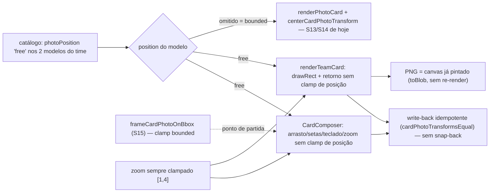

# Impl: S33 — Card do time (você e estadual): ajuste da foto livre, sem limite

Status: aprovado (modo --auto)
Atualizado em: 2026-09-24
Issue: #1297
Intenção: docs/plans/cards-time-ajuste-sem-limite.md
Appetite restante: herdado (~0,5 dia) — sem migration; 3 fases: régua pura ~0,25 + render/composer ~0,2 + gates/changelog ~0,05

## Leitura da intenção

- **Outcome:** nos dois modelos de time (`time-de-voce`, `time-do-estadual`), depois do enquadramento automático S15, arrasto/setas/teclado movem a foto livremente nos dois eixos — inclusive para fora do quadro, revelando a arte de trás; a área de arrasto segue ativa para voltar; prévia e PNG mostram a mesma posição (sem "voltar sozinho"); o zoom segue `[1,4]`; S13/S14, colinha e o resto do funil ficam intocados; sem controle, copy ou telemetria novos.
- **O que NÃO negociar:**
  - Sem limite de posição (X e Y) nos dois modelos do time — decisão do gate (2026-09-24); nada de âncora de silhueta, caixa medida, união de alcances, margem de composição ou colisão com candidatos (o S20/revert `48e08bf7` é história, não base).
  - Enquadramento inicial S15 (`frameCardPhotoOnBbox`) intocado, aplicado uma vez ao carregar a foto; zoom `[1,4]` intocado; preview = PNG (`toBlob` do mesmo canvas, sem re-render).
  - S13/S14 (`eu-sou-solla`, `perfil-quadrado`, `perfil-retangular`) e `renderPhotoCard` sem mudança de superfície; colinha (S31) não tem transform de foto.
  - Sem controle/copy/estado de erro/telemetria novos; 100% no aparelho; sem migration/Consent/access/int.
- **O que reavaliar (hipóteses da intenção):**
  - "o limite vive só em `cardPhotoTransform.ts`": há re-clamp no desenho **e** no retorno de `renderTeamCard` (`src/lib/cardRender.ts:312` e `:314`), e o retorno é o contrato do write-back (`CardComposer.tsx:413-415`); se o render não souber da política, o snap-back volta.
  - "os controles do composer bastam": o pan é um funil (`withTransform` + `panBy` + `zoomTo`, `CardComposer.tsx:527-575`) e o zoom re-clampa a posição também no caminho "zoom inalterado" (`cardPhotoTransform.ts:181`) — ponto silencioso de snap-back.
  - "não há nada a preservar no S13/S14": há — o default omitido das funções do dono e o `renderPhotoCard` (que não recebe modelo). A garantia mais forte é: **specs S13/S14 passam sem edição**.
  - "`#1277` só conflita por arquivo": o diff no composer deve ser mínimo (1 constante + 3 closures) para o rebase do S30-FOLLOWUP-DRY ser barato.

## Abordagem recomendada

**Opções consideradas:** A) política por modelo no catálogo (`photoPosition`) + opção `position` no dono, default omitido = bounded, lida pelo composer e pelo `renderTeamCard` | B) `kind === 'team'` derivado em cada call site | C) threading do composer → `TeamCardRenderArgs` (forma S20) | D) remover o clamp de posição para todos os modelos | E) branch por `model.id` dentro do render.
**Recomendação:** A — a regra é do modelo, não da chamada; o catálogo já carrega as decisões por modelo (`photoWindow`, `overlaySrc`, `stateDeputyPicker`) e passa a ser a **fonte única** consumida pelos dois pontos (composer e render), o que elimina por construção a divergência que a S20 tinha de resolver com threading de um dado dinâmico. O default omitido preserva literalmente S13/S14 e o S15 inicial.
**Rejeitadas:** B porque a regra ficaria duplicada em dois call sites e o catálogo não a registraria (o gate diz "os dois modelos do time"); C porque threadar um valor **estático** por toda a cadeia é cerimônia sem volatilidade (na S20 era dado dinâmico: a âncora); D porque reabre o aceite ("os 3 modelos anteriores intocados"); E porque acopla o renderizador a ids e o catálogo já é o dono do comportamento por modelo.

### Decisões de engenharia

1. **Onde vive a política: campo `photoPosition` no catálogo, tipo `CardPhotoPosition` exportado de `cardModels.ts`.**
   Opções: A) `CardPhotoPosition = 'bounded' | 'free'` em `src/lib/cardModels.ts`; `CardModel.photoPosition?: CardPhotoPosition` setado `'free'` só em `time-de-voce` (`cardModels.ts:93-102`) e `time-do-estadual` (`:104-118`); omitido nos demais | B) booleano `freePhoto?: boolean` no catálogo | C) derivar de `kind === 'team'` sem campo | D) `photoPosition` em `cardPhotoTransform.ts` (importado por `cardModels`).
   Recomendação: A — uma definição só, no vocabulário do catálogo; `cardPhotoTransform.ts` importa o tipo **type-only** na direção que já existe (`cardPhotoTransform` → `cardModels`, como `CardRect`), sem ciclo; `cardModels.unit.spec.ts` pina que só os dois modelos do time são `'free'`.
   Rejeitadas: B — flag assimétrica ("free quando setado") esconde o valor default; C — regra duplicada em composer/render e invisível no catálogo; D — inverte a direção de dependência e cria ciclo type-only desnecessário com madge/knip.

2. **API do clamp: opção `position` no dono; `free` clampa só o zoom.**
   Opções: A) `CardPhotoClampOptions = { position?: CardPhotoPosition }` como último parâmetro de `clampCardPhotoTransform` (`cardPhotoTransform.ts:76-91`), `cardPhotoDrawRect` (`:60-74`) e `panCardPhotoTransform` (`:153-164`), e como 6º parâmetro de `zoomCardPhotoTransform` (`:170-194`; o `anchor` segue posicional no 5º — o objeto de options do S18 não existe mais desde o revert `48e08bf7`, e manter a posição evita editar os pins default); `position: 'free'` devolve `offsetX/offsetY` intactos e clampa `zoom` em `[1,4]` | B) booleano posicional `free?: boolean` | C) gêmeas `panCardPhotoTransformFree`/`cardPhotoDrawRectFree` | D) flag dentro do `CardPhotoTransform`.
   Recomendação: A — a política fica nomeada no call site (`{ position: 'free' }`), o default omitido é o comportamento de hoje byte a byte, e o clamp continua idempotente (`clamp(clamp(t)) = clamp(t)`) porque `free` só normaliza o zoom. `frameCardPhotoOnBbox` (`:115-150`) fica intocado e bounded.
   Rejeitadas: B — `pan` chegaria a 6º posicional e o call site não nomeia a política; C — gêmeas rasas que duplicam a régua de zoom e criam superfície morta no knip; D — o transform é o dado que o composer guarda e compara (`cardPhotoTransformsEqual`), embutir política nele polui o contrato do write-back.

3. **Zoom com posição livre: clamp de zoom sempre, re-clamp de posição nunca — inclusive no caminho "zoom inalterado".**
   Opções: A) em `zoomCardPhotoTransform`, clampa `nextZoom` a `[1,4]`, preserva a âncora e passa `position` adiante; o early-return `zoom === transform.zoom` (`:181`) também respeita `position` (free = posição intacta) | B) manter o re-clamp no early-return | C) liberar o zoom também.
   Recomendação: A — o early-return é um ponto silencioso de snap-back: tocar o slider sem mudar o zoom desfaria a posição livre; com free ele devolve a posição intacta (só o zoom normalizado). O zoom continua `[1,4]` em todos os modelos, como o aceite manda.
   Rejeitadas: B — é exatamente o "voltar sozinho" que o aceite proíbe; C — viola o aceite ("os limites do zoom seguem iguais").

4. **Render: `renderTeamCard` desenha e devolve com a mesma política lida do `model`; `renderPhotoCard` intocado.**
   Opções: A) `renderTeamCard` (`cardRender.ts:303-336`) deriva `position = model.photoPosition ?? 'bounded'` e usa no `cardPhotoDrawRect` (`:312`) e no retorno (`:314`); `renderPhotoCard` (`:224-233`) segue chamando as funções sem options (bounded) | B) `renderTeamCard` devolve o transform cru, sem normalizar o zoom | C) o composer passa o transform já livre e o render não clampa.
   Recomendação: A — o retorno continua normalizando o zoom (contrato do write-back) mas nunca re-limita a posição; desenho e retorno com o **mesmo** contexto derivado do mesmo `model`, então o bug de divergência não volta; `renderPhotoCard` não recebe modelo e permanece bounded por default.
   Rejeitadas: B — perde a normalização de zoom que o contrato do render sempre teve; C — o render deixa de ser auto-suficiente (um futuro chamador desenharia diferente do que devolve).

5. **Composer: uma constante de política, usada nos três funis de gesto.**
   Opções: A) `const photoPosition = model.photoPosition ?? 'bounded'` no `CardComposer` e uso nos closures de `handlePointerMove` (`:556-558`), `panBy` (`:565-569`) e `zoomTo` (`:571-575`); nenhum estado/UI/copy novos | B) cada call site decide | C) mudar `withTransform` para injetar a opção.
   Recomendação: A — `panBy` já serve setas e teclado (`:832-848`), então os três funis fecham sobre a mesma constante; `withTransform` fica intocado exceto os closures; diff mínimo para o rebase do `#1277`.
   Rejeitadas: B — divergência silenciosa entre gestos (um gesto limitado e outro livre); C — muda a assinatura de um helper interno sem ganho.

6. **Divergência registrada — "os 3 modelos anteriores ficam intocados": a superfície S13/S14 não muda em nada.**
   Opções: A) garantia por construção: defaults omitidos nas funções do dono, `renderPhotoCard` sem options, `centerCardPhotoTransform` intocado, `handlePhotoFile` intocado, catálogo sem `photoPosition` nos modelos de foto; **nenhum spec S13/S14 editado** (se algum precisar de edição, a entrega parou) | B) atualizar os testes S13/S14 "se necessário" | C) unificar os dois renderizadores com a opção nos dois.
   Recomendação: A — o aceite "intocados" vira uma checagem objetiva: os describes de `clampCardPhotoTransform`/`pan`/`zoom` default, o `renderPhotoCard` e o e2e S14 (`tests/e2e/frontend.e2e.spec.ts:1767`) passam **sem edição**. Só os pins do time mudam (eles pinam o comportamento antigo do time, não o dos 3 anteriores).
   Rejeitadas: B — editar asserção de modelo anterior é o próprio sinal de regressão; C — "simetria" sem caso de uso que mudaria o desenho do S13/S14 (foto sempre cobrindo a janela).

7. **Testes de domínio: atualizar os pins do time, adicionar o caminho livre nos dois eixos e manter os pins dos anteriores.**
   Opções: A) `tests/unit/cardPhotoTransform.unit.spec.ts`: manter `clampCardPhotoTransform` (`:116-142`), `pan` (`:144-155`), `zoom` (`:157-184`) e `frameCardPhotoOnBbox` (`:58-114`) **sem edição**; novo describe do free: offsets preservados nos dois eixos, zoom ainda `[1,4]`, `zoom` inalterado preserva posição (anti-snap-back), idempotência; `tests/unit/cardRender.unit.spec.ts`: atualizar o pin do retorno do `renderTeamCard` (`:290-310`) para "zoom clampado, posição preservada" e adicionar um pin bounded do `renderPhotoCard` (transform fora da janela volta clampado e o retângulo cobre a janela); `tests/unit/cardModels.unit.spec.ts`: pin do `photoPosition` (`'free'` nos dois do time, `undefined` nos demais) | B) apagar os pins antigos do clamp e reescrever tudo | C) só unit, sem catálogo.
   Recomendação: A — os pins default continuam sendo a cobertura dos 3 anteriores; os novos cobrem X **e** Y livres, a faixa de zoom e o anti-snap-back do caminho de zoom; o pin de catálogo torna a política visível e testável.
   Rejeitadas: B — apagaria a cobertura dos modelos anteriores; C — a política ficaria sem pin de dados.

8. **e2e: um teste novo, no seam que já existe — decidido adicionar.**
   Opções: A) novo describe `Cards personalizados (S33 — ajuste livre do time)` com 1 teste no `frontend.e2e.spec.ts`, usando o stub existente + teclado + sonda de pixel: com stub `ok` e harmonização desligada, a sonda `(500,727)` é azul `[30,120,200,255]` no enquadramento S15; focar o grupo `Ajuste da foto`, 8× `Shift+ArrowRight` (48px de card cada → +384, contra o teto antigo de X do stub: `offsetX` inicial ≈197,33, faixa antiga `[108,67, 286]`), poll da sonda ≠ azul (a foto saiu da janela e a arte de trás aparece), esperar 250ms e conferir que **continua** ≠ azul (sem snap-back do write-back), slider de zoom ainda 1 | B) nenhum e2e novo | C) medir o curso em pixels de card com um seam novo.
   Recomendação: A — o outcome é comportamento de browser e a fiação composer↔render não tem unit (o `CardComposer` é um client component grande, com `#1277` pendente); o teste usa só seams existentes (stub, handler de teclado, sonda) e pina exatamente as duas falhas reais do histórico: o limite que persiste e o snap-back. O manifest `scripts/lib/e2e-affected-manifest.mjs:189-196` já mapeia `src/components/cards`/`src/lib/card` → `frontend`, sem edição.
   Rejeitadas: B — deixaria a fiação (3 funis de gesto + write-back) sem cobertura de integração; C — frágil, mediria a geometria do stub e exigiria seam novo (e o unit já pina a régua).

### Componentes / mudanças

- **`CardPhotoPosition` + `CardModel.photoPosition`** (`src/lib/cardModels.ts`): união `'bounded' | 'free'` e campo opcional documentado; `'free'` só em `time-de-voce` e `time-do-estadual`; omitido = bounded (S13/S14, nome, colinha).
- **`CardPhotoClampOptions` + `position`** (`src/lib/cardPhotoTransform.ts`): `clampCardPhotoTransform`, `cardPhotoDrawRect` e `panCardPhotoTransform` ganham o último parâmetro opcional; `zoomCardPhotoTransform` ganha o `options` no 6º parâmetro (o `anchor` permanece posicional no 5º — o objeto de options do S18 não voltou no revert); free = offsets intactos, zoom sempre `[1,4]`; early-return do zoom respeita `position`. `frameCardPhotoOnBbox` e `centerCardPhotoTransform` intocados.
- **`renderTeamCard`** (`src/lib/cardRender.ts:303-336`): deriva `position` do `model` e usa no draw (`:312`) e no retorno (`:314`); `renderPhotoCard` (`:224-233`) intocado.
- **`CardComposer`** (`src/components/cards/CardComposer.tsx`): `photoPosition` derivado do `model` e passado nos closures de arrasto (`:556-558`), `panBy` (`:565-569`) e `zoomTo` (`:571-575`). Nenhuma mudança de UI, estado, copy ou erro; `handleDownload` (`:584`) segue `toBlob` do canvas pintado.
- **Testes:** `tests/unit/cardPhotoTransform.unit.spec.ts` (novo describe do free; pins default sem edição), `tests/unit/cardRender.unit.spec.ts` (pin do retorno do time atualizado + pin bounded do `renderPhotoCard`), `tests/unit/cardModels.unit.spec.ts` (pin do `photoPosition`), `tests/e2e/frontend.e2e.spec.ts` (novo describe S33; S14/S15/S30/S31 sem edição).
- **`docs/changelog/2026-09-24-s33-card-time-ajuste-livre.md`** (novo, additions-only).
- **Migration:** sem migration — nenhuma collection/global/field; catálogo estático; `push:false` intocado (100% client-side).
- **Access / Consent:** não se aplica — nenhuma superfície Payload; a posição é geometria efêmera no aparelho; sem chave de Consent.
- **UI:** Impeccable C — comportamento, sem controle/copy/telemetria novos. O artefato `docs/plans/cards-time-ajuste-sem-limite-ui-design.html` é a referência do gate (Cenas 1/2 e a anotação "Posição: sem clamp em X ou Y"); craft no browser com fotos reais (arrasto até fora do quadro nos dois modelos, voltar, zoom antes/depois, preview×PNG). Sem shape novo.

### Dados → forma (se aplicável)

Não se aplica — nenhum KPI, mapa ou série; nenhum dado apresentado/coletado/enviado. A única "forma" é geometria do card (janela `{286,439,592,577}`) e a posição efêmera no aparelho, como a intenção fixou.

## Fases verificáveis

1. **Tracer — régua pura do dono** — quota ~0,25 dia. `CardPhotoPosition`/`photoPosition` no catálogo; `CardPhotoClampOptions.position` em `clampCardPhotoTransform`/`cardPhotoDrawRect`/`panCardPhotoTransform`/`zoomCardPhotoTransform`; units novos (free X/Y, zoom `[1,4]`, anti-snap-back do zoom inalterado, idempotência) e pin do catálogo.
   Prova: `pnpm gate:fast` verde; os describes default de clamp/pan/zoom/frame e o `cardModels.unit.spec.ts` pré-existente seguem valendo sem edição; unit pina que `free` preserva offsets fora da janela nos dois eixos e que `bounded` (omitido) é byte a byte o de hoje.
2. **Render + composer + e2e** — quota ~0,2 dia. `renderTeamCard` lendo o `model` no desenho e no retorno; `photoPosition` nos 3 funis do composer; pin do retorno do time atualizado; pin bounded do `renderPhotoCard`; teste e2e S33.
   Prova: `pnpm gate:fast` verde; unit do render (time devolve zoom clampado com posição livre; `renderPhotoCard` clampa e cobre a janela); e2e local do `frontend` verde, com S14/S15/S30/S31 sem edição.
3. **Gates + changelog** — quota ~0,05 dia. e2e da superfície (`pnpm test:e2e:affected` ou `pnpm test:e2e --no-deps -- tests/e2e/frontend.e2e.spec.ts`), changelog, `pnpm gate:fast`, `pnpm push`.
   Prova: e2e S15 (`:1998`/`:2177`) e S30 (`:2227`) verdes sem edição (enquadramento inicial, harmonização, troca de estadual e download intactos); novo S33 verde; fixture de console/5xx intacta; PNG baixável.

## Rabbit holes / Não escopo (engenharia)

- Ressuscitar âncora/rosto/união do S20 (`resolveCardPhotoAnchor`, `anchorBox`, `frameCardPhotoOnFace`, detector): o gate decidiu sem limite e o revert `48e08bf7` removeu por inércia sob o S15; não voltam nem como "proteção".
- Limite novo por composição: margem medida, colisão com caixas de candidatos, "não deixar cobrir rostos" — a barreira aprovada é **nenhuma**.
- Clipar a foto na janela, manter cover mínimo ou impedir a foto de sair do quadro — contraria o aceite e a Cena 2 do gate.
- Controles novos ("centralizar", "voltar ao enquadramento"), copy nova, estado de erro novo, telemetria de foto/posição, persistência.
- Mexer no zoom (`[1,4]`), no enquadramento S15/`frameCardPhotoOnBbox`, na janela `{286,439,592,577}`, na arte-mestre ou no `centerCardPhotoTransform`.
- Aplicar free a S13/S14 "por simetria", tornar a opção obrigatória, criar funções gêmeas ou mudar `renderPhotoCard`.
- e2e medindo o curso em pixels de card (seam novo) ou novos modos de stub; unit de `CardComposer` (sem harness de React no repo para ele).
- Fatiar o `CardComposer` (`#1277`) nesta entrega; migration/int/Consent/access.

## Riscos e mitigação

- **Snap-back do write-back** → política única lida do catálogo nos dois pontos (composer e `renderTeamCard`), desenho e retorno com o mesmo contexto; unit do retorno do render; e2e S33 pina a persistência após o pan.
- **Zoom inalterado re-clampa a posição** → branch explícito no early-return de `zoomCardPhotoTransform`; unit "zoom inalterado preserva a posição livre".
- **Deriva de S13/S14** → defaults omitidos; `renderPhotoCard`/`centerCardPhotoTransform`/`handlePhotoFile` sem edição; specs S13/S14 e e2e S14 **sem edição** (se algum pedir edição, parar e reavaliar).
- **Foto totalmente fora do quadro** → `drawImage` aceita coordenadas fora do canvas; o canvas tem tamanho fixo e o PNG é o mesmo canvas; craft nos extremos (foto fora à direita/esquerda/cima/baixo) com fotos reais; sem estado de erro novo.
- **Conflito com `#1277`** (CardComposer DRY, OPEN/blocked) → diff mínimo (1 constante + 3 closures); rebase antes de abrir o PR; sem tocar em `withTransform`/estado.
- **Knip/cycles** → tipo novo importado type-only na direção existente `cardPhotoTransform` → `cardModels`; opção consumida em composer/render/testes; sem export órfão.
- **e2e instável** → sonda e contagem de passos calculadas sobre o stub determinístico (4×3 → 400×300; S15: `offsetX≈197,33`, teto antigo 286; 8× `Shift+→` = +384 → 581,33; base em `(500,727)` = `[246,246,248]`); poll + espera de 250ms; sem rede nova.
- **A11y/UX** → nenhum controle, copy ou área de toque mudam; foco/teclado/touch seguem iguais; a área de arrasto continua ativa mesmo sem a pessoa visível.

## Aceite de engenharia

- [ ] Aceite de produto da intenção ainda coberto: posição livre X+Y nos dois modelos do time (inclusive fora do quadro), S15 como ponto de partida, zoom `[1,4]`, preview = PNG sem snap-back, S13/S14 e colinha intocados, sem controle/copy/telemetria, 100% no aparelho.
- [ ] Invariantes AGENTS/engineering-standards: math pura/client-safe em `src/lib` (sem DOM); identificadores em inglês, copy pt-BR; sem migration/Consent/access/int; knip/cycles verdes; `pnpm gate:fast` + e2e da superfície + `pnpm push`.
- [ ] Testes de domínio previstos: unit do free nos dois eixos + zoom `[1,4]` + anti-snap-back + idempotência; pin do `photoPosition` no catálogo; pin do retorno do `renderTeamCard` e do `renderPhotoCard` bounded; e2e S33 novo; **specs S13/S14 e e2e S14 sem edição**; **int não se aplica** (client-side, sem DB/access/escrita multi-collection).

## Já resolvido no simplify/critique (não reabrir)

- JSDoc do `panCardPhotoTransform`/`zoomCardPhotoTransform` e o doc de `photoWindow`/cabeçalho do catálogo atualizados para o mundo com `free` (achados convergentes dos 2 revisores).
- Comentário do pin de catálogo corrigido ("S13/S14 e a colinha" — 4 asserts) e as decisões 1/2 realinhadas ao código (o options object do S18 não existe mais desde o revert `48e08bf7`; o `anchor` segue posicional).
- e2e da sonda endurecido: a asserção é a cor exata da arte de trás (`[246,246,248,255]`), não um "≠ azul" que um canvas em branco também passaria.

## Explicitamente fora / deferido com gatilho (triage)

- **S1 — `undefined` explícito no 5º parâmetro de `zoomCardPhotoTransform` no composer**: score 2, pureza; mover o `anchor` para um bag de options quebraria os pins default S13/S15 (a prova "sem edição") por ganho cosmético. **Descartado**.
- **S2 — `windowPixel` (S33) duplica `windowCenterPixel` (S30) no e2e**: 2 call sites; DRY <3 é rabbit hole do repo e içar o helper editaria o describe S30 (a prova "sem edição"). **Descartado**.
- **S3 — e2e cobre só o teclado e só `time-de-voce`**: **defer com gatilho** — o próximo item que mexer no funil de cards acrescenta o e2e de arrasto (pointer) e/ou do `time-do-estadual`; os três gestos compartilham `panCardPhotoTransform` e a política do modelo tem pins de unit/catálogo.
- **S4 — renames `CardPhotoClampOptions`/`CardPhotoPosition`**: score 1, cosmético; **descartado**.
- **S5 — trocar o `waitForTimeout(250)` do e2e por estabilidade de rAF**: score 1; o teste discrimina e passa (a espera pega a variante draw-free/write-back-bounded). **Descartado**.
- **Fora do lote — flake unit do `municipalityRelationEditor.unit.spec.tsx` ("Salvando relações.")**: falhou 2× em 3 runs full sob carga e passa isolado; pré-existente, sem Issue específica aberta (as de flake abertas são e2e/int) e fora da superfície desta entrega. Registrado no resumo da sessão para o humano decidir virar bug à parte.

## Self-score decision-quality: 5/5

Decisões caras (onde vive a política, API do clamp, semântica do zoom, render/write-back, garantia S13/S14, testes e e2e) todas com Opções/Recomendação/Rejeitadas; cabe no appetite (~0,5 dia, sem migration); rabbit holes nomeados (S20, limites novos, controles, zoom, seam); depth check reusa o dono (`cardPhotoTransform`), o catálogo e o `renderTeamCard` sem abstração nova; o outcome da intenção permanece intacto — a engenharia só escolheu a forma.
