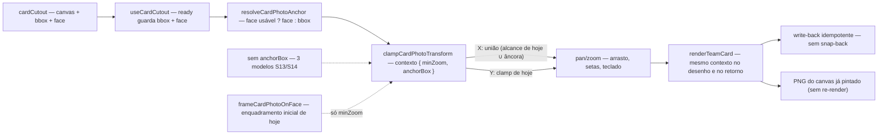

# Impl: Card "Time de você": ajuste lateral da foto sem limite artificial

Status: aprovado
Atualizado em: 2026-09-19
Issue: #1216
Intenção: docs/plans/cards-time-de-voce-ajuste-lateral.md
Appetite restante: herdado — ~0,5–1 dia eng; sem migration; 3 fases somam ≤1 dia (tracer puro ~0,4 + threading ~0,3–0,4 + gates ~0,2)

## Leitura da intenção

- **Outcome:** o visitante empurra a própria foto lateralmente até o rosto medido (caixa do detector) tocar as bordas da área livre da arte (janela `{x:286,y:439,w:592,h:577}`); por construção o curso X vira `592 − largura do rosto desenhado` (≈489px com a referência 103 → ≈±244px a partir do centro inicial, ~2× os ~248px de hoje). Sem controle novo; sem rosto medido a âncora é a silhueta e o alcance nunca fica pior que o de hoje; enquadramento automático S18, banners, harmonização, os 3 modelos anteriores e o download ficam intocados; tudo no aparelho.
- **O que NÃO negociar:**
  - O enquadramento inicial continua o de hoje, centrado, com o clamp de hoje — o alcance maior é só do ajuste do visitante (a S18 e o e2e do slider não podem mudar).
  - Os 3 modelos S13/S14 (minZoom default 1, clamp cover/contain) e `renderPhotoCard` ficam intocados; `frameCardPhotoOnBbox` tem assinatura/comportamento pinados; `frameCardPhotoOnFace` é o caminho do time e pode evoluir.
  - Sem rosto: âncora pela silhueta (alpha bbox), alcance NUNCA pior que o de hoje, sem aviso/erro novo.
  - Sem controle/copy novos, sem migration/Consent/access, sem telemetria/persistência; a caixa do rosto é a do momento do recorte (nunca re-detecta em pan/zoom).
  - Ajuste LATERAL (X); Y do time não regride.
- **O que reavaliar (hipóteses da intenção):**
  - "O clamp é local a `cardPhotoTransform.ts`": o clamp precisa chegar também a `cardRender.renderTeamCard` — o render re-limita e devolve (`cardRender.ts:240-271`), e o composer grava de volta (`CardComposer.tsx:276-278`); se divergirem, o alcance é desfeito no paint seguinte.
  - "O state `ready` já tem o que precisa": hoje `useCardCutout` **descarta** `bbox`/`face` (`useCardCutout.ts:88-95`) — sem eles não há âncora no momento do pan/zoom.
  - "±244px é simétrico": é a viagem a partir do centro inicial, com o rosto desenhado no tamanho da referência; o invariante real é o **curso total = janela − largura da caixa-âncora desenhada** (muda com o zoom; a âncora é a caixa inteira dentro da janela — é por isso 244 e não 296).
  - "A janela garante não cobrir rostos dos candidatos": não garante sozinha (c2/Solla/c4 invadem a janela — achado 9 da exploração). A barreira aprovada no gate é o limite da janela; colisão por caixa vira **limite registrado**, não código (ver D2/D4 e Riscos).

## Abordagem recomendada



**Opções consideradas:** A) régua pura parametrizada por uma caixa-âncora (rosto ou silhueta) + contexto de clamp opcional threaded até o render, com X = união do alcance de hoje | B) liberar o pan do time só no composer e parar de re-limitar no render | C) clamp com colisão contra as caixas dos rostos dos candidatos | D) mexer no enquadramento inicial ou no clamp global dos 3 modelos.
**Recomendação:** A — concentra a política no dono (`src/lib/cardPhotoTransform.ts`), preserva os 3 modelos e o `renderPhotoCard` pelo default omitido, e cobre o aceite por construção: a união nunca remove um transform válido de hoje, então o enquadramento inicial da S18 (clampado pela regra de hoje) nunca é reescrito no write-back e o e2e do slider permanece verde.
**Rejeitadas:** B porque o render é auto-suficiente por contrato (desenha e devolve o transform para o write-back) e um pan não re-clampado seria desfeito no paint seguinte; C porque a análise mostra que seria um novo limite artificial (evitar Solla `x336-485` cortaria ~200px do alcance à esquerda com o rosto na referência 103; evitar c4 `x762-865` cortaria ~115px à direita) e ainda não protegeria o corpo, além de contrariar a regra aprovada ("rosto em qualquer ponto da área livre"); D porque reabre a S18, muda o e2e do slider e o claim dos 3 modelos sem evidência.

### Decisões de engenharia

1. **Onde vive a regra e a forma do contexto: `CardPhotoClamp` opcional no dono.**
   Opções: A) contexto opcional `CardPhotoClamp = { minZoom?: number; anchorBox?: CardAlphaBbox | null }` como último parâmetro de `clampCardPhotoTransform`, `cardPhotoDrawRect` e `panCardPhotoTransform` (substituindo o `minZoom` posicional), e campo `anchorBox?` nas options já existentes de `zoomCardPhotoTransform`; omitido = comportamento de hoje | B) `anchorBox` posicional depois de `minZoom` | C) funções gêmeas do time (`clampTeamCardPhotoTransform`/`cardTeamPhotoDrawRect`) | D) clamp calculado no composer e transform já clampado entregue ao render.
   Recomendação: A — uma única política no dono, sem `undefined`/`null` posicional no slot do meio (a limpeza que a S18 fez no `zoom`); o default omitido preserva literalmente os 3 modelos, `renderPhotoCard`, `frameCardPhotoOnBbox` e o inicial; a âncora é uma `CardAlphaBbox` (o `CardFaceBox` tem a mesma forma `{x,y,width,height}` — sem tipo novo). Nome: `anchorBox` para a âncora de enquadramento; `anchor` continua sendo o pivô do zoom (colisão evitada e comentada).
   Rejeitadas: B — `pan` chegaria a 7 posicionais e o call site compartilhado dos 3 modelos passaria `undefined` no meio; C — gêmea rasa que duplicaria a regra de Y e criaria superfície nova no knip; D — o render é a fonte do PNG e do retorno do write-back; tem de re-clampar com a MESMA política.

2. **Regra do X: união do alcance de hoje com o alcance da âncora.**
   Opções: A) `newX = união(todayX, anchorX)` quando `anchorX` existe, senão `todayX` | B) X = só `anchorX` | C) X = hoje (mexer só no inicial) | D) âncora + colisão por caixa de candidato.
   Recomendação: A — cobre o aceite e garante "nunca pior que hoje" por construção. Fórmula (por eixo X; `start=window.x`, `size=window.width`, `a=coverScale(source,window)·zoom`):

   ```text
   drawnW  = source.width · a
   todayX  = [start + size − drawnW, start]   se drawnW ≥ size (cover, S13)
             [start, start + size − drawnW]   se drawnW <  size (contain, S18)
   anchorX = [start − box.x·a, start + size − (box.x + box.width)·a]
             quando box.width·a ≤ size; senão não existe (caixa mais larga que a janela)
   newX    = união(todayX, anchorX)           quando anchorX existe
             todayX                           caso contrário
   ```

   Propriedades que o unit pina: (i) `anchorX` sempre intersecta `todayX` quando existe (`A.min ≤ T.max` e `A.max ≥ T.min` valem nos dois regimes, porque `0 ≤ box.x` e `box.x + box.width ≤ source.width`), então a união é um **intervalo único** (sem buraco); (ii) `anchorX ⊇ todayX` no regime contain, logo o curso nunca encolhe; (iii) com o rosto na referência (103), curso `= 592 − 103 = 489` e viagem a partir do centro inicial `≈±244,5`; (iv) a caixa inteira fica dentro da janela quando o visitante está dentro de `anchorX` — o que toca a borda é a caixa, não o centro. Nota: no regime cover (zoom alto) a união pode manter alcance de hoje além de `anchorX` em um dos lados — é o "nunca pior" e o comportamento aceito da S13, não uma liberdade nova.
   Rejeitadas: B — em zoom ≥ 1 (cover) um rosto fora do centro teria a âncora **cortando** alcance de hoje (ex.: rosto centrado a 900px de uma fonte 1200px em zoom 2: hoje o X vai até 286; só a âncora pararia em 174) e poderia invalidar o próprio transform inicial → write-back e regressão da S18; C — não resolve o relato (o visitante quer empurrar **depois** do automático) e mexer no inicial contraria o aceite; D — os números acima (~200px/~115px) mostram que a colisão destruiria o ganho; a barreira aprovada é a janela.

3. **Sem rosto: âncora = bbox da silhueta com a MESMA regra; piso de hoje preservado pela união.**
   Opções: A) `anchorBox = face usável ? face : bbox`, mesma regra X da decisão 2 | B) sem rosto = clamp de hoje literal (sem âncora) | C) âncora sempre a bbox (ignorar o rosto) | D) sem rosto = "âncora no desenho inteiro" (o contain de hoje).
   Recomendação: A — uma régua só, sem caminho especial: no enquadramento S15 a bbox cobre a janela (âncora mais larga que a janela → `anchorX` inexistente → clamp de hoje literal); quando o visitante afasta o zoom e a silhueta cabe na janela, o intervalo da âncora é superconjunto do contain de hoje (propriedade ii). "Nunca pior" é propriedade de construção, não caso de teste solto.
   Rejeitadas: B — duplicaria a política de clamp e não daria âncora nenhuma à silhueta quando ela cabe na janela (quem não tem rosto medido também quer posicionar a pessoa); C — perde a âncora do caso principal (o relato é sobre o rosto); D — é exatamente o limite de hoje (nada muda).

4. **Y permanece o de hoje — decisão explícita.**
   Opções: A) Y = `clampPhotoOffset` atual (cover/contain por eixo, `minZoom` do time) | B) Y também ancorado pela caixa | C) Y livre até as bordas do card | D) congelar o pan vertical.
   Recomendação: A — a intenção é lateral; a Cena 3 fala "posição horizontal"; o clamp de Y protege a composição vertical (topo do recorte abaixo do banner, base dentro da arte) e o "nunca pior" fica literal também no eixo Y; nenhuma evidência de produto para mexer. Registrado como decisão (não silenciosa): só X ganha âncora.
   Rejeitadas: B — permitiria o recorte flutuar/sair da janela verticalmente sem pedido e com risco visual novo (céu aparecendo sob o busto); C — descobre a arte sem caso de uso e contraria a barreira; D — removeria um controle que existe hoje (regressão de capacidade).

5. **Threading até o render/write-back: mesmo contexto no pan, no zoom e no `renderTeamCard`.**
   Opções: A) `TeamCardRenderArgs` ganha `anchorBox?`; `renderTeamCard` usa o contexto em `cardPhotoDrawRect` (`:240-245`) **e** no retorno (`:266-271`); o composer passa o mesmo contexto no arrasto (`:387-389`), nas setas (`:396-400`), no teclado e no zoom (`:402-406`) | B) o render recebe um transform já clampado e não re-clampa | C) wrapper de render só do time.
   Recomendação: A — clamp de intervalo é idempotente (`clamp(clamp(t)) = clamp(t)`), então o `cardPhotoTransformsEqual` do composer (`:276-278`) nunca dispara write-back espúrio; o download não re-renderiza (`handleDownload` faz `toBlob` do canvas já pintado), logo preview e PNG ficam idênticos por construção; `renderPhotoCard` intocado.
   Rejeitadas: B — o render deixaria de ser auto-suficiente (o retorno é o contrato do write-back) e um futuro chamador desenharia diferente do que devolve; C — superfície nova sem necessidade (o `renderTeamCard` já é o caminho do time).

6. **State `ready`: guardar `bbox` + `face` crus; a âncora é derivada numa função pura.**
   Opções: A) `CardCutoutState.ready` ganha `bbox: CardAlphaBbox` e `face: CardFaceBox | null` (espelho fiel do `CardCutoutResult`); o composer resolve `resolveCardPhotoAnchor(bbox, face)` (face usável ? face : bbox) com `useMemo` por recorte; um predicado privado `isUsableCardFace` é extraído e reusado por `frameCardPhotoOnFace` | B) `ready` guarda a âncora já resolvida | C) guardar bbox + face + âncora.
   Recomendação: A — o hook continua espelho do resultado (não vira dono da política de clamp); a regra de escolha da âncora vive uma vez na lib pura (mesma validação do inicial); o composer já é o dono do contexto. A caixa é usada como veio do detector/segmentador (coords da fonte), sem reescala nem re-detecção.
   Rejeitadas: B — esconde a regra no hook e duplica conhecimento com `frameCardPhotoOnFace`; C — campo derivado redundante.

7. **e2e: nenhum teste novo ou alterado.**
   Opções: A) manter o describe S18 como está (o `ok`/`noface` já atravessa os dois ramos de âncora pelo composer + render) | B) estender com um arrasto e asserção de posição no canvas | C) novo describe S20 com stub dedicado.
   Recomendação: A — o e2e não mede alcance em pixels de card sem um seam novo (frágil, mediria a geometria do stub, não a regra); o que importa no e2e é que o inicial e o write-back não regridem, e é exatamente o que os asserts do slider (`noface=1`, `ok<0.5`) e da amostra harmonizada em `(582,550)` já pinam; a régua fica pinada em unit (grid de fontes/zooms/âncoras). O e2e da superfície roda de qualquer forma pelo mapping `src/components/cards` + `src/lib/card` → `frontend` (`scripts/lib/e2e-affected-manifest.mjs:92-98`).
   Rejeitadas: B/C — custo de CI e superfície de seam para uma propriedade já coberta em unit.

### Componentes / mudanças

- **`CardPhotoClamp` + `resolveCardPhotoAnchor` + `isUsableCardFace`** (`src/lib/cardPhotoTransform.ts`): o contexto de clamp (`{ minZoom?: number; anchorBox?: CardAlphaBbox | null }`), a resolução canônica da âncora (face usável ? face : bbox; a âncora reusa `CardAlphaBbox`, sem tipo novo) e o predicado de rosto usável extraído de `frameCardPhotoOnFace` e reusado por ambos. Reusa `CardAlphaBbox`/`CardFaceBox`, `coverScale`.
- **`clampCardPhotoTransform`, `cardPhotoDrawRect`, `panCardPhotoTransform`, `zoomCardPhotoTransform`** (`src/lib/cardPhotoTransform.ts`): ganham o contexto opcional; X = união (fórmula da D2), Y = `clampPhotoOffset` de hoje; `minZoom` default `CARD_PHOTO_MIN_ZOOM` preservado. `frameCardPhotoOnBbox` intocado; `frameCardPhotoOnFace` só troca a chamada interna para `{ minZoom: CARD_TEAM_PHOTO_MIN_ZOOM }` (inicial **sem** âncora).
- **`CardCutoutState.ready`** (`src/components/cards/useCardCutout.ts:13-26`): ganha `bbox`/`face`; a chamada de enquadramento (`:69-77`), run id/retry/progresso e o `error: 'empty'` continuam iguais.
- **`CardComposer`** (`src/components/cards/CardComposer.tsx`): `photoAnchorBox` memoizado de `teamReady`; o contexto `{ minZoom: photoMinZoom, anchorBox: photoAnchorBox }` (âncora `null` nos modelos de foto = default) entra em `withTransform`/arrasto/setas/teclado/zoom; a chamada de `renderTeamCard` (`:263-274`) ganha `anchorBox`. Nenhuma mudança de UI, controle, copy ou estado de erro.
- **`renderTeamCard` / `TeamCardRenderArgs`** (`src/lib/cardRender.ts`): campo `anchorBox?`; desenho (`:240-245`) e retorno (`:266-271`) com o mesmo contexto. `renderPhotoCard` (`:198-207`) intocado.
- **Testes** (editar/novo): `tests/unit/cardPhotoTransform.unit.spec.ts` (forma das chamadas que passam `minZoom` + describe novo da âncora: união/curso ±244,5, superconjunto, âncora mais larga → hoje, Y intocado, idempotência); `tests/unit/cardRender.unit.spec.ts` (novo: `renderTeamCard` com `anchorBox` preserva o X fora do alcance antigo e sem `anchorBox` clampa como hoje). `cardModels.unit.spec.ts`, `cardFaceDetection.unit.spec.ts` e o e2e ficam como estão.
- **`docs/changelog/2026-09-19-s20.md`** (novo).
- **Migration:** sem migration — nenhuma collection/global/field; `push:false` intocado (100% client-side).
- **Access / Consent:** não se aplica — nenhuma superfície Payload; a âncora é geometria efêmera no aparelho; sem chave de Consent.
- **UI:** Impeccable C — comportamento, sem controle novo. O artefato `docs/plans/cards-time-de-voce-ajuste-lateral-ui-design.html` (Cenas 3/4) é a referência de gate; craft no browser com fotos reais (com/sem rosto, arrasto até as bordas, zoom antes/depois) como na S18. Sem shape novo.

### Dados → forma (se aplicável)

Não se aplica — nenhum KPI, mapa ou série; nenhum dado apresentado/coletado/enviado. A única "forma" é geometria do card (literais medidos) e a posição efêmera no aparelho, exatamente como a intenção fixou.

## Fases verificáveis

1. **Tracer — régua pura do clamp** — quota ~0,4 dia. `CardPhotoClamp`, `resolveCardPhotoAnchor`/`isUsableCardFace`; X = união e Y = hoje em `clampCardPhotoTransform`/`cardPhotoDrawRect`/`panCardPhotoTransform`/`zoomCardPhotoTransform`; units novos.
   Prova: `pnpm gate:fast` verde; asserts existentes seguem valendo (só muda a forma das chamadas que passam `minZoom`); unit pina: com rosto na referência 103 o intervalo X tem largura 489 e a viagem a partir do centro é ≈±244,5; o alcance de hoje é subconjunto do novo num grid de fontes/zooms/âncoras; âncora mais larga que a janela → byte a byte o clamp de hoje; Y idêntico; `clamp(clamp(t)) = clamp(t)`.
2. **Threading — hook → composer → render** — quota ~0,3–0,4 dia. `ready` com `bbox`/`face`; memo da âncora no composer; contexto no arrasto/setas/teclado/zoom; `TeamCardRenderArgs.anchorBox`; testes de render com/sem âncora.
   Prova: `pnpm gate:fast` verde; unit do render; no browser (engine real + stub): com rosto, arrastar até a caixa do rosto tocar a borda da janela, sem snap do write-back e com zoom/harmonização/CTA intactos; sem rosto, o alcance é ao menos o de hoje; modelos quadrado/retangular com pan/zoom/slider como antes.
3. **Gates + changelog** — quota ~0,2 dia. e2e frontend local (`pnpm test:e2e --no-deps -- tests/e2e/frontend.e2e.spec.ts`), changelog, `pnpm gate:fast`, `pnpm push`.
   Prova: S14/S15/S17/S18 verdes sem edição (slider `noface=1`, `ok<0.5` e amostra harmonizada intactos); fixture de console/5xx intacta; card baixável.

## Rabbit holes / Não escopo (engenharia)

- Colisão geométrica contra as caixas dos rostos dos candidatos / margens para "não chegar perto" — rejeitada na D2 com números; a barreira do gate é a janela.
- Clipar o corpo do visitante na janela — contraria a Cena 3 (o corpo pode avançar sobre ombros).
- Ancorar o eixo Y, "centralizar" por controle novo, ou qualquer mudança de gesto/controle.
- Re-detectar/rastrear o rosto durante o pan/zoom (já rabbit hole da intenção/S18); persistir a âncora; telemetria.
- Mudar o enquadramento inicial, `frameCardPhotoOnBbox`, `renderPhotoCard`, o slider (piso 0.2/teto 4), a arte-mestre, os banners, a janela `{286,439,592,577}` ou a referência 103.
- Generalizar a âncora para os 3 modelos de foto (não têm recorte/rosto) e criar tipo `CardPhotoAnchor` só por pureza.
- Novo modo de stub ou e2e novo (D7); resolver o débito adiado do "piso duplicado em composer/render" (S18) sem gatilho.
- Migration/Consent/access/int; copy nova; estado de erro novo.

## Riscos e mitigação

- **Write-back desfaz o alcance / enquadramento inicial mexido** → inicial usa o clamp de hoje sem âncora; pan/zoom/render usam o mesmo contexto; união nunca remove transform de hoje; units de idempotência e de superconjunto; e2e do slider como guarda de integração.
- **Corpo saindo da janela (gap de arte atrás)** → a base `team-card-base.png` é 100% opaca e a referência `team-card-example.jpg` já tem sobreposição leve; o gap lê como céu/arte (mesmo look do proporcional S18). Craft nos dois extremos; **gatilho de revisão:** se o craft reprovar a estética da borda, aplicar uma margem pequena medida na âncora (decisão de produto no gate, não silenciosa).
- **Rosto de candidato coberto no extremo** → limite registrado: a barreira aprovada é a janela, não colisão por caixa (D2). **Gatilho:** UAT com fotos reais; se um rosto de candidato sumir de forma inaceitável, item sucessor com margem/exclusões de candidato.
- **Sem rosto com alcance pior** → propriedade de superconjunto unit-testada num grid; quando a silhueta é maior que a janela, `anchorX` não existe e o clamp de hoje roda literal.
- **Render e pan divergirem** → uma função, um contexto; `cardPhotoDrawRect` e o retorno do render com o mesmo `anchorBox`; unit de render com/sem âncora; e2e S18 cobre o caminho real com os dois ramos.
- **Zoom:** em zoom alto o rosto pode não caber na janela → `anchorX` vazio → hoje; em zoom baixo a âncora abre ainda mais o alcance; limites do slider intocados. Craft de pan → zoom → pan.
- **Colisão de nome (`anchor` pivô × âncora de enquadramento)** → `anchorBox`; comentário no tipo e nos call sites.
- **Regressão dos 3 modelos / knip** → contexto omitido = default exato; `renderPhotoCard` intocado; S13/S15 unit e e2e sem edição; exports novos todos consumidos.
- **E2E/hermeticidade** → nenhum fetch/log/async novo; stub intocado; guard de console intacto.
- **Performance** → aritmética por pointermove; âncora resolvida uma vez por recorte (memo); sem custo perceptível.

## Triagem de débitos (simplify — 2 revisores paralelos)

| ID  | Resumo                                                                   | Origem           | Score | Tipo          | Destino       |
| --- | ------------------------------------------------------------------------ | ---------------- | ----- | ------------- | ------------- |
| S1  | Rosto do MediaPipe pode vir fora da fonte → hull podia abrir gap          | simplify/estrut. | 3     | cheap_polish  | já_resolvido  |
| S2  | `x`/`y` NaN na face viraria offset NaN                                    | simplify/qual.   | 3     | cheap_polish  | já_resolvido  |
| S3  | `anchorOffsetRange` sem dizer que é o eixo X                              | simplify/qual.   | 1     | cheap_polish  | já_resolvido  |
| S4  | `244.5` mágico e grid "nunca pior" prometido viravam 2 casos              | simplify/qual.   | 2     | cheap_polish  | já_resolvido  |
| S5  | Asserção tautológica desenho == retorno no teste do render                | simplify/qual.   | 1     | cheap_polish  | já_resolvido  |
| S6  | Piso do time duplicado composer/render (débito S18)                       | simplify/ambos   | 2     | defer_trigger | descartar     |
| S7  | `useMemo` do `photoClamp` dispensável                                     | simplify/qual.   | 1     | cheap_polish  | descartar     |
| S8  | e2e não mede o curso em pixels (seam novo)                                | simplify/estrut. | 1     | cheap_polish  | descartar     |

- **Já resolvido no simplify (não reabrir):** S1 (guarda de ranges disjuntos em `clampPhotoOffset` + teste), S2 (`isUsableCardFace` exige `x/y/width/height` finitos), S3 (`anchorXOffsetRange` + doc), S4 (curso derivado de `(TEAM_WINDOW.width − REFERENCE) / 2` + grid de zooms/âncoras/offsets), S5 (asserções cross-contexto).
- **Explicitamente fora:** S6 — já é débito registrado na S18 (`docs/plans/cards-time-de-voce-escala-cabeca-impl.md`, gatilho "piso duplicado em composer e render"); o render segue dono do piso do time nesta entrega. S7 — memo barato que estabiliza as deps do efeito. S8 — decidido na D7 (unit pina a régua; e2e pina a integração sem seam novo).
- **Defer com gatilho:** `readLargestFaceBox` copia `originX/originY` crus do detector; o clamp novo torna a exposição inofensiva (fallback), mas o enquadramento S18 ainda usa a caixa crua. Gatilho: um UAT/craft com rosto cortado na borda mostrando enquadramento ruim, ou o próximo item que tocar `readLargestFaceBox` — aí clampar à fonte antes de enquadrar.

## Aceite de engenharia

- [ ] Aceite de produto da intenção ainda coberto: a caixa do rosto alcança as bordas da janela (curso ≈489px, ≈±244px do centro inicial); sem controle novo; inicial centrado e S18 intocados; 3 modelos, banners, harmonização, troca de foto e download intocados; sem rosto nunca pior que hoje; 100% no aparelho.
- [ ] Invariantes AGENTS/engineering-standards: math pura/client-safe em `src/lib` (sem DOM); identificadores em inglês, copy pt-BR; sem migration/Consent/access/int; knip/cycles verdes; arte-mestre intocada; `pnpm gate:fast` + e2e da superfície + `pnpm push`.
- [ ] Testes de domínio previstos: unit do clamp com âncora (união, superconjunto, curso ±244,5, Y, idempotência) e do `renderTeamCard` com/sem `anchorBox`; e2e existente reusa `ok`/`noface`; **int não se aplica** (client-side, sem DB/access/escrita multi-collection).

## Self-score decision-quality: 5/5

1. **Decisões caras com rejeitadas:** API do contexto (A–D), regra do X (A–D), fallback da silhueta (A–D), Y (A–D), threading/write-back (A–C), state/âncora (A–C) e e2e (A–C) — todas com Opções/Recomendação/Rejeitadas; o barato (nome do campo, literais) fica como fill-in.
2. **Cabe no appetite:** ≤1 dia em 3 fases, sem migration/infra; a régua pura vem primeiro (tracer) e o threading depois, com o fallback preservado por construção.
3. **Rabbit holes nomeados:** colisão por caixa, clip do corpo, âncora em Y, re-detecção, e2e/seam novo, generalização para os 3 modelos.
4. **Depth check:** reusa `clampPhotoOffset`/`coverScale`/`CardAlphaBbox`, o `CardCutoutResult`/hook, o contexto de `minZoom` já existente e o padrão de options do `zoomCardPhotoTransform`; nada de abstração nova além da função pura de âncora e sem tipo redundante.
5. **Intenção preservada:** outcome e aceite intactos (curso ≈2×, sem controle novo, inicial/S18 intocados, fallback nunca pior, privacidade); a engenharia só resolveu o que a intenção deixou em aberto (fórmula, fallback, Y, API) e registrou o limite da barreira dos candidatos.
