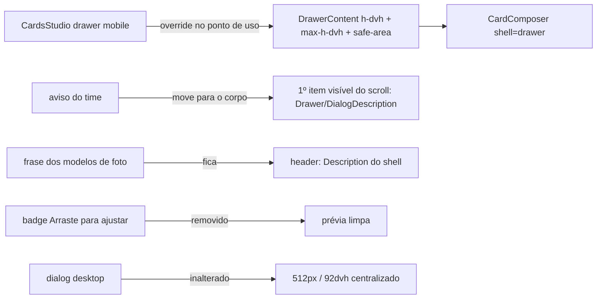

# Impl: Ajuste fino da foto no celular: drawer "Time de você" até o topo, sem nada sobre a imagem

Status: aprovado (via `work-issue --auto`)
Atualizado em: 2026-09-20
Issue: #1234
Intenção: docs/plans/cards-time-de-voce-drawer-mobile.md
Design UI (gate): docs/plans/cards-time-de-voce-drawer-mobile-ui-design.html
Appetite restante: herdado (~0,5–1 dia eng)

## Leitura da intenção

- **Outcome:** no celular, o passo de ajuste fino do card "Time de você" usa a tela inteira — o drawer sobe até o topo (safe-area reservada), o aviso do time é o primeiro item da área rolável e sai de cena ao descer, nada fica sobreposto à prévia — e o visitante vê imagem + zoom + setas sem o vaivém de rolagem; o dialog desktop mantém a geometria.
- **O que NÃO negociar:** o aviso do time permanece (verbatim: "O recorte já foi centralizado. Se precisar, arraste a foto ou use os controles.") e vira item rolável; a frase própria dos modelos de foto ("Arraste para posicionar e use os controles para aproximar ou ajustar.") fica no header; o badge "Arraste para ajustar" sai; a primitiva `Drawer` (`src/components/ui/Drawer.tsx`) fica intacta; geometria do dialog desktop (`sm:max-w-lg` 512px / `max-h-[92dvh]`) intocada; S18/S20 e o resto do funil não reabrem; swipe-down/fechar e a11y seguem; nenhum dado/PII novo.
- **O que reavaliar:** (i) a altura total cabe 100% no ponto de uso — confirmado: o `className` do consumidor é mesclado por último no Popup da primitiva (`Drawer.tsx:131-146`) e o `tailwind-merge 3.4.1` substitui as classes de altura da primitiva quando o uso passa `h-dvh max-h-dvh` (verificado em runtime); (ii) mover a Description para o corpo preserva `aria-describedby` — o registro é por contexto do primitive (`DrawerDescription`/`DialogDescription`), não por posição no DOM; (iii) o scroll interno da home (`(home)/layout.tsx`, `relative h-dvh overflow-y-auto`) não cria containing block para o `fixed` portalado — o drawer segue viewport-relativo; (iv) o badge era o único sobreposto (`CardComposer.tsx:623-627`, `pointer-events-none`) — a remoção direta basta.

## Abordagem recomendada

**Opções consideradas:** A | B | C
**Recomendação:** A — override no ponto de uso em `CardsStudio` (`h-dvh max-h-dvh` + `pt-[max(0px,env(safe-area-inset-top))]` no `DrawerContent`), aviso do time movido para o primeiro item visível do corpo rolável como `DrawerDescription`/`DialogDescription` do shell, badge removido; primitiva `Drawer` e dialog desktop intocados.
**Rejeitadas:** B) só elevar o teto (`[--drawer-content-max-height:100dvh]`, auto-height) — mantém faixa livre quando o conteúdo do passo cabe em menos de `100dvh` e não garante "encosta no topo" como o contrato do design pede ("cobre os 844px"); C) prop/modo novo na primitiva `Drawer` (ou mudar o teto default) — blast radius em 16 consumidores e anti-goal explícito da intenção; o precedente C107 já decidiu override no uso com primitiva intacta.

### Componentes / mudanças

- **`CardsStudio`** (`src/components/cards/CardsStudio.tsx:60-72`): o `DrawerContent` troca `[--drawer-content-max-height:92dvh]` por `h-dvh max-h-dvh` e ganha `pt-[max(0px,env(safe-area-inset-top))]`; `data-theme="campaign-site"` e `bg-background text-foreground` ficam. O `Drawer` (raiz, `:60`) e o dialog desktop (`:74-92`) não mudam.
- **`CardComposer`** (`src/components/cards/CardComposer.tsx`):
  - `:440-448` — a IIFE `description` vira duas: `headerDescription` (só `!isNameModel && !isTeamModel && step !== 'result'` → frase dos modelos de foto, que fica no header) e `teamNotice` (`isTeamModel && step === 'compose' && teamReady && !nameError` → aviso do time, verbatim).
  - `:467-484` — o header dos dois shells continua renderizando `headerDescription` como `DialogDescription`/`DrawerDescription`.
  - `:584-593` — o aviso entra como primeiro item **visível** do bloco `overflow-y-auto` (depois do `role="status"` sr-only), antes da prévia, como `DialogDescription` (shell dialog: `mx-auto mb-4 max-w-[420px] text-sm leading-5 text-(--campaign-muted)`) ou `DrawerDescription` (shell drawer: `mx-auto mb-3 max-w-[350px] text-sm leading-5 text-(--campaign-muted)`) — classes das cenas 01/03 do design.
  - `:584` — **cauda rolável** condicional (`teamNotice && shell === 'drawer'` → `pb-14`; senão `pb-5`), ajuste pedido na crítica (c) do designer da cena 02: no fim da rolagem o aviso precisa sair de cena por completo (medido no app: `maxScroll` 52→88px, fundo do aviso em −8px com 8px de folga).
  - `:623-627` — bloco do badge removido; nada volta a ser `absolute` sobre a prévia.
  - Intocados: zoom/setas `:496-568`, `TeamHarmonySwitch` `:114-146`, canvas `max-h-[38dvh]`/`TEAM_PREVIEW_WIDTH`, foco/fechar `:574-581`, footer fixo `:881-911`.
- **`tests/e2e/frontend.e2e.spec.ts`**: `:1977` troca a asserção do badge por aviso visível + badge ausente; `:2093-2102` (drawer mobile do time) ganha poll de geometria — `boundingBox().y` arredondado `=== 0` e altura `=== 844` (viewport), provando "até o topo" no shell real.
- **Migration:** sem migration (apresentação pura; nenhum campo/schema muda).
- **Access / Consent:** nenhuma mudança (sem writes nem PII; a foto nunca sai do aparelho).
- **UI:** Impeccable B — port classe-a-classe do design aprovado (tier frontier, gate cumprido). Sem triggers (a)/(b)/(d): o design cobre o shell mobile, o dialog e o estado rolado. Crítica final (c) do `designer` executada em 390/1280 + estado rolado: **certificada** após 1 ajuste (cauda rolável da cena 02, registrada acima) — `Design tier: openai/gpt-5.6-sol`.

### Dados → forma (se aplicável)

- N/A — herdado da intenção: nenhum dado/KPI/mapa novo; só shell + place da copy existente.

## Decisões de engenharia

| Decisão                                     | Opções                                                                                                                                                                            | Recomendação                                                                                                                                                                   | Rejeitadas                                                                                                                                                          |
| ------------------------------------------- | --------------------------------------------------------------------------------------------------------------------------------------------------------------------------------- | ------------------------------------------------------------------------------------------------------------------------------------------------------------------------------ | ------------------------------------------------------------------------------------------------------------------------------------------------------------------- |
| Altura do drawer mobile                     | A) override no uso (`h-dvh max-h-dvh` + safe-area) · B) só teto `[--drawer-content-max-height:100dvh]` (auto-height) · C) prop/modo na primitiva · D) altura condicional ao passo | **A** — determinístico (toca o topo em qualquer estado), teto = viewport ("cobre os 844px"), zero blast radius; classes do consumidor vencem o merge da primitiva (verificado) | B — auto-height deixa faixa quando o conteúdo é menor que a tela; C — blast em 16 consumidores + anti-goal; D — exigiria elevar estado composer→shell sem evidência |
| `--drawer-inset` / padding-top              | A) `pt-[max(0px,env(safe-area-inset-top))]` no Popup · B) `--drawer-inset` · C) padding no root do composer                                                                       | **A** — reserva a faixa só no topo, superfície branca até a borda; `--drawer-inset` fica no default 0                                                                          | B — `m-(--drawer-inset)` é margem nos 4 lados e entra no `--closed-transform`; C — o swipe handle (primitiva) ficaria sob o notch                                   |
| Posição do aviso do time                    | A) mover a Description para o 1º item visível do scroll · B) manter no header + cópia no corpo · C) `
` simples sem Description · D) manter no header                           | **A** — uma fonte de copy e `aria-describedby` preservado (registro por contexto); vale nos dois shells                                                                        | B — duas cópias/drift; C — perde a descrição acessível (guardrail pede tratar); D — contraria o gate                                                                |
| Separar as frases (aviso × modelos de foto) | A) duas variáveis com condições próprias · B) uma IIFE com ramificação no JSX                                                                                                     | **A** — `teamNotice` no corpo, `headerDescription` só para modelos de foto (intocada)                                                                                          | B — esconde as condições no markup                                                                                                                                  |
| Badge "Arraste para ajustar"                | A) remover o bloco + ajustar e2e · B) realocar fora da imagem · C) remover só no mobile                                                                                           | **A** — o gate manda sair; a orientação vive no aviso permanente                                                                                                               | B — chrome sem função; C — o contrato vale nos dois shells                                                                                                          |
| Teclado / deep-scroll                       | A) validar no aparelho real, sem código especulativo · B) listener de `visualViewport` · C) altura fixa em px                                                                     | **A** — sem evidência de problema; `dvh` já acompanha a viewport dinâmica                                                                                                      | B/C — complexidade preventiva                                                                                                                                       |
| Nível de teste                              | A) sem unit novo; ajustar e2e (badge→aviso; geometria do topo) · B) unit de composição do `CardComposer` · C) e2e novo de rolagem                                                 | **A** — sem lógica pura nova; o e2e existente cobre o funil e a geometria CSS ganha prova barata no spec mobile                                                                | B — pina markup sem provar o contrato, sem harness do composer; C — excluído pela intenção                                                                          |

Notas das decisões:

- A alternativa da **variável** (`[--drawer-content-max-height:100dvh]`) foi descartada por depender da ordem do CSS entre a variante `data-[swipe-axis=y]:[…]` da primitiva e a arbitrária do consumidor; `h-dvh max-h-dvh` é resolvido no merge (determinístico, conferido).
- **Safe-area bottom / `viewport-fit=cover` global:** fora — o contrato é o topo, e o site público não declara `cover` (o `env()` resolve 0 no browser comum; a reserva é inerte hoje e efetiva em contexto cover). Revisit trigger: queixa real de PWA/standalone.
- **Consequência aceita:** o shell é um só, então todos os passos/modelos do estúdio no celular passam a ocupar a viewport (inclusive o idle). Registrar no craft; se a crítica reprovar, revisitar a decisão 1 na opção D — nunca improvisar no meio.

## Fases verificáveis

1. **Tracer — drawer até o topo (mobile)** (≈40% do appetite): `CardsStudio.tsx:61-64` com `h-dvh max-h-dvh bg-background text-foreground pt-[max(0px,env(safe-area-inset-top))]`; e2e mobile do time (`frontend.e2e.spec.ts:2093-2102`) com poll de `y === 0` e altura `=== 844`. Prova: `pnpm gate:fast` + `pnpm test:e2e:affected` (manifest `scripts/lib/e2e-affected-manifest.mjs:117-122` → spec `frontend`).
2. **UI — aviso no fluxo + badge fora** (≈50%): split das frases (`CardComposer.tsx:440-448`), header `:467-484`, aviso como 1º item do corpo `:584-593`, remoção do badge `:623-627`; e2e `:1977` (aviso visível, badge ausente). Craft 390/1280 classe-a-classe do design; `pnpm gate:fast`.
3. **Gates e fechamento** (≈10%): `pnpm gate:fast`; `pnpm test:e2e:affected` (spec `frontend`); **validação manual no aparelho real** (checklist abaixo); crítica do `designer` (c); changelog `docs/changelog/2026-09-20-s23.md`; `pnpm push`; PR `--base main` + `Closes #1234` + `Design tier:`; auto-merge.

**Checklist de validação manual (aparelho real, ~390px):**

- `/cards?model=time-de-voce`: drawer cobre a viewport até o topo; handle/conteúdo abaixo da safe-area; o aviso abre a área rolável; ao rolar até zoom/setas, o aviso sai de cena; nada sobre a prévia; CTA fixo alcançável; swipe-down fecha.
- Teclado: `?model=eu-sou-solla` (campo "Seu nome") e o estado de nome longo do time — campo e CTA alcançáveis com o teclado aberto.
- Safe-area: PWA instalado (se disponível) e/ou landscape com notch; no browser comum sem `viewport-fit=cover` o padding é 0 (esperado, documentado).
- Desktop 1280: dialog centralizado 512px/92dvh, aviso no fluxo, prévia limpa.

## Rabbit holes / Não escopo (engenharia)

- **Primitiva `Drawer`/`Sheet`:** nenhuma prop, modo ou mudança de teto default; os outros consumidores (16) e os drawers de campanha (C107/`ActivityOverlay`) ficam como estão.
- **`--drawer-inset`:** não usar para top-only (margem nos 4 lados); não alterar.
- **Badge:** não realocar; não remover o aviso; não mexer na copy.
- **Controles/prévia:** zoom/setas, `TeamHarmonySwitch`, `max-h-[38dvh]`, `TEAM_PREVIEW_WIDTH`, footer — intocados.
- **Scroll da home (`h-dvh overflow-y-auto`)/dvh aninhados:** sem mudanças; o `fixed` portalado não é afetado.
- **`viewport-fit=cover` global, safe-area bottom, top bar de campanha:** fora.
- **`visualViewport`/teclado:** sem código especulativo (validação manual).
- **e2e novo de rolagem / tutorial:** excluído pela intenção; nenhum unit/int novo (não há lógica pura nova).
- **Outros modelos de card:** herdam o shell, sem mudanças de lógica; designs antigos (`cards-time-de-voce-*-ui-design.html`) são histórico — não editar.
- **Sem migration, sem Consent/access, sem rota/URL, sem dados.**

## Riscos e mitigação

- **`h-dvh` não sobrepor o teto default da primitiva** → merge verificado com `tailwind-merge` (as classes da primitiva são substituídas); e2e mobile mede `y=0`/altura; inspeção no craft.
- **`aria-describedby` ao mover a Description** → registro por contexto do primitive; garantir **uma** Description por shell (a do header só para modelos de foto) e conferir no browser; estados sem aviso ficam sem descrição (aceito).
- **Idle/todos os modelos em tela cheia** (maior mudança perceptiva) → craft 390 + crítica (c); revisitar a decisão 1 (opção D) só com reprovação e evidência.
- **Flake do e2e de geometria** pela animação de abertura (~450ms) → `expect.poll` (padrão do repo) + `Math.round`.
- **Teclado no aparelho real (iOS/Android)** → `dvh` acompanha a viewport dinâmica; validar; se esconder campo/CTA sem rolagem possível, abrir item próprio com `visualViewport` (revisit trigger).
- **Regressão do dialog desktop** → geometria não tocada; e2e desktop (S15/S17/enquadramento) permanece como rede; crítica visual 1280.
- **Badge ainda citado em designs antigos** → artefatos históricos não se editam; a fonte deste item é o design novo.
- **Conflito com S24 (rádio embed)** → arquivos disjuntos; sem coordenação.

## Aceite de engenharia

- [ ] Aceite de produto da intenção ainda coberto: drawer mobile até o topo com safe-area; aviso é o 1º item visível do rolável e sai de cena; nada sobre a prévia; badge fora; prévia + zoom/setas sem vaivém; dialog desktop e demais modelos intocados
- [ ] Invariantes AGENTS/engineering-standards: primitiva `Drawer` intacta; identificadores em inglês/copy pt-BR; sem migration/access/Consent/URL; dead code morre (badge e classes substituídas saem no mesmo diff)
- [ ] Testes de domínio: sem unit/int novos (não há lógica pura nova; `tests/unit/card*.unit.spec.ts` e `campaignHome.unit.spec.tsx:53-55` intocados); e2e `frontend` ajustado (badge→aviso; geometria do topo) verde em `pnpm test:e2e:affected`
- [ ] Guardrails: `aria-describedby` preservado; swipe/fechar/Escape ok (e2e existente `:2100-2101`)
- [ ] `pnpm gate:fast` verde; validação manual no aparelho real registrada na Issue/PR
- [ ] Crítica do designer (c) certificada antes do push + changelog `docs/changelog/2026-09-20-s23.md` + `Design tier:` no PR

## Self-score decision-quality: 5/5

1. **Decisões caras com rejeitadas — 5/5:** 7 decisões deliberadas (altura, inset/safe-area, posição do aviso, split de copy, badge, teclado, nível de teste), cada uma com opções/recomendação/rejeitadas e as caras (altura do shell, posição do aviso, primitiva) com blast radius explicitado.
2. **Appetite — 5/5:** 2 arquivos de app + 2 trechos de 1 spec e2e existente; sem schema/migration; tracer fechando a geometria já na fase 1; cabe em ~0,5 dia eng.
3. **Rabbit holes nomeados — 5/5:** primitiva/16 consumidores, `--drawer-inset`, `viewport-fit` global, idle full-screen, scroll aninhado da home, e2e de rolagem, designs históricos — todos com corte explícito.
4. **Depth check — 5/5:** zero módulo/abstração/utilidade nova; reusa a primitiva via override no uso (precedente C107), reusa `DrawerDescription`/`DialogDescription` existentes e os tokens do tema; nenhuma lógica duplicada.
5. **Outcome preservado — 5/5:** todos os itens do aceite da intenção mapeados para mudança + verificação (e2e/geométrico ou manual), com os guardrails (primitiva, dialog, a11y, copy verbatim) como restrições explícitas; a engenharia não reescreveu o produto.
