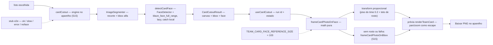

# Impl: Card "Time de você": cabeça do visitante proporcional à dos candidatos

Status: aprovado
Atualizado em: 2026-09-19
Issue: #1197
Intenção: docs/plans/cards-time-de-voce-escala-cabeca.md
Appetite restante: herdado — ~1–1,5 dia eng (3 fases somam ≤1,5 dia; sem migration)

## Leitura da intenção

- **Outcome:** o auto-enquadramento do card `Time de você` passa a mirar a proporção da cabeça: o rosto do visitante é medido com a mesma régua dos candidatos (caixa do `FaceDetector` sobre o recorte e sobre a arte-mestre) e o zoom enquadra a cabeça na mesma ordem de grandeza (±20%) sempre que houver rosto; a cobertura da janela prevalece, o rosto nunca é cortado pela proporcionalidade e qualquer impossibilidade cai no enquadramento S15, em silêncio. Nada sai do aparelho; nenhum controle novo.
- **O que NÃO negociar:**
  - 100% no aparelho: foto e medida nunca saem; nada além dos assets same-origin; sem analytics.
  - Fallback obrigatório e silencioso: sem rosto, detecção indisponível ou qualquer falha → enquadramento S15 (`frameCardPhotoOnBbox`); **nunca** erro novo no funil — o único erro recuperável continua sendo o do recorte de fundo.
  - Cobertura da janela prevalece sobre a proporção; o rosto nunca é cortado pelo ajuste proporcional (quando a janela permite); pan/zoom seguem como escape.
  - Métrica única dos dois lados (lado da caixa do rosto), maior rosto vence, referência literal dos candidatos, sem re-detecção em pan/zoom.
  - Os 3 modelos S13/S14, a galeria, a copy e a privacidade ficam intocados; sem controle/toggle novo; sem migration/Consent/access.
- **O que reavaliar (hipóteses da intenção):**
  - **"Detecção no mesmo pipeline do recorte"**: confirmado, mas como passo tolerante do **mesmo run** — a caixa do rosto viaja no `CardCutoutResult` (`face`), não como máquina de estado paralela; falha vira `null` sem log.
  - **"Ajuste no adapter/hook"**: confirmado, porém a régua é 100% pura em `cardPhotoTransform.ts`; o adapter só entrega a caixa no espaço de coords do recorte.
  - **"±20% sempre"**: **reaberto na execução com evidência de craft** — no piso de cobertura (`zoom ≥ 1`) as selfies fechadas ficavam 2,0–2,6× acima dos candidatos, deixando o caso "fechado fica gigante" (o principal do pedido) sem correção. Decisão do humano em 2026-09-19: o enquadramento do time pode descer abaixo do piso (`CARD_TEAM_PHOTO_MIN_ZOOM=0.2`), com o clamp mantendo a foto menor _dentro_ da janela (a arte-mestre aparece ao redor, como na Cena 1 do design); o ajuste fino do visitante continua sendo o escape.
  - **"Qualquer foto serve"**: o detector escolhido tem limite medido — rosto abaixo de ~10% da largura vira ruído e a 15% o score é ~0.58; `minDetectionConfidence: 0.5` e a mediana da arte são os pins; reavaliar só com medição nova.

## Abordagem recomendada



**Opções consideradas:** A) `FaceDetector` no canvas do recorte + math pura nova com piso de cobertura e fallback S15 | B) enquadrar no adapter (DOM), "no olho", sem função pura | C) mudar a `frameCardPhotoOnBbox` existente para aceitar rosto.
**Recomendação:** A — reaproveita o runtime/wasm/stub que o S15 já paga, mantém a régua pura/testável em `src/lib` e deixa o adapter só medir; o fallback é o próprio caminho S15 intacto, então nada do funil regride.
**Rejeitadas:** B porque enquadramento sem função pura não tem pin de unit e reabre o rabbit hole "medir no olho" (adapter é DOM); C porque mexe na função pinada e nos 3 modelos para um comportamento que é só do time.

### Decisões de engenharia

1. **Detector — `FaceDetector` + `blaze_face_full_range` (Apache-2.0), commitado e lazy.**
   Opções: A) `FaceDetector` do `@mediapipe/tasks-vision` com `blaze_face_full_range.tflite` (float16, 1.083.786 B) | B) `blaze_face_short_range.tflite` (229.746 B) | C) `FaceLandmarker` (malha facial) | D) detector próprio/ONNX.
   Recomendação: A — é o único medido que enxerga a arte-mestre e a foto do visitante na mesma régua. Com `minDetectionConfidence: 0.5` (explícito, embora o default da lib também seja 0.5 — vira pin de contrato) o `full_range` detecta os 5 rostos de `public/cards/team-card-base.png` (1080×1440) de forma estável em 1×/2×/3× (scores 0.62–0.90; caixas em coords da arte: c1 `(45,609,108,108)`, c2 `(202,580,103,103)`, centro/Solla `(336,540,149,149)`, c4 `(762,583,103,103)`, c5 `(926,608,99,99)`); em canvas sintético com a Lenna a 40%/30%/20%/15% da largura detecta com scores 0.89/0.74/0.70/0.58 (caixas 278/186/119/75 px), degradando para ruído a 10% (scores ~0.2). O `FaceDetector` já vive no runtime que o S15 carrega — entra só um modelo novo, same-origin e lazy (só o time paga); a caixa do rosto é exatamente a métrica da intenção. Modelo commitado em `public/cards/blaze_face_full_range.tflite` (origem `https://storage.googleapis.com/mediapipe-models/face_detector/blaze_face_full_range/float16/1/blaze_face_full_range.tflite`, SHA-256 `3698b18f063835bc609069ef052228fbe86d9c9a6dc8dcb7c7c2d69aed2b181b`) com `public/cards/blaze_face_full_range.LICENSE.txt` no padrão do `selfie_segmenter.LICENSE.txt` (origem + SHA + Apache-2.0 + nota do wasm). `scripts/copy-card-vision-assets.mjs` não muda (copia só wasm).
   Rejeitadas: B porque não detectou **nenhum** rosto da arte-mestre (nem cropada, nem upscalada 2×/3×) nem um rosto sintético a 40% da largura — um detector que não mede a arte não tem como dar proporção; C porque a malha facial adiciona peso/superfície de API sem mudar a medida (a caixa do rosto já é o lado que importa) e não tem ganho medido; D porque reimplementar runtime/hosting/modelo está fora do appetite e repetiria o custo do S15 sem evidência.

2. **Onde detectar — no canvas do recorte, uma vez, maior rosto vence.**
   Opções: A) no canvas do cutout (mesmo espaço de coords do `bbox`, fundo já removido) | B) no bitmap original | C) no arquivo da foto antes do recorte.
   Recomendação: A — o canvas do recorte é o mesmo sistema de coordenadas do `bbox` que a math já usa (zero conversão de escala), o fundo removido reduz rostos de terceiros/objetos (menos falso positivo) e o custo roda uma única vez por foto, dentro do run do recorte; "maior rosto vence" (maior área) alinha com "em foto com mais de um rosto, vale o do visitante". Detecção uma vez, no recorte; **nunca** re-detecta em pan/zoom (a medida é do momento do recorte).
   Rejeitadas: B porque exigiria escalar as caixas do bitmap original para o canvas capado (≤1600 px) e detectaria rostos de fundo que o recorte acabou de remover; C porque duplicaria decode/custo antes do cutout e poderia medir um rosto que a segmentação nem manteve.

3. **Math pura — `frameCardPhotoOnFace` com piso do time, delegando ao S15 sem rosto.**
   Opções: A) função nova em `src/lib/cardPhotoTransform.ts`: `frameCardPhotoOnFace(source, window, bbox, face, referenceSize): CardPhotoTransform | null` | B) mudar assinatura/comportamento de `frameCardPhotoOnBbox` | C) calcular o enquadramento no adapter (DOM) | D) manter o piso de cobertura `zoom ≥ 1` (plano original).
   Recomendação: A — a régua fica inteira pura e pinável:

   ```text
   s        = coverScale(source, window)
   faceSize = Math.max(face.width, face.height)
   zoom     = clamp(referenceSize / (faceSize * s), CARD_TEAM_PHOTO_MIN_ZOOM, CARD_PHOTO_MAX_ZOOM)
   offX     = window.x + window.width/2 − (face.x + face.width/2) * s * zoom
   offY     = window.y − bbox.y * s * zoom
   → clampCardPhotoTransform({ zoom, offX, offY }, source, window, CARD_TEAM_PHOTO_MIN_ZOOM)
   ```

   **Piso do time (`CARD_TEAM_PHOTO_MIN_ZOOM = 0.2`).** O craft provou que o piso de cobertura do S13 (`zoom ≥ 1`) deixava as selfies fechadas em 2,0–2,6× a cabeça dos candidatos (207px e 270px vs. a referência de 103px): o caso "fechado fica gigante" — o principal do pedido — seguia sem correção. Decisão do humano (2026-09-19): permitir o zoom abaixo de 1. O clamp ganha um `minZoom` opcional (default = `CARD_PHOTO_MIN_ZOOM`, preservando os 3 modelos S13/S14) e, quando a foto desenhada é menor que a janela num eixo, ela é mantida **dentro** da janela (contain) em vez de pinada na borda — a foto nunca sai da prévia e o ajuste fino do visitante segue livre. Com o piso 0.2, a face alcançada nunca passa de +15% da referência (a caixa do rosto cobre o canvas no máximo; `0.2 × 592 = 118px`), ou seja, o aceite de ±20% fica garantido por construção; rostos minúsculos ficam no teto de 4 (e podem não ser detectados → fallback).
   **Rosto nunca cortado:** com a referência 103px, a face desenhada nunca passa de ~118px, muito dentro da janela 592×577; o posicionamento mantém o centro-x do rosto no centro-x da janela e o topo do bbox no topo (contain/cover por eixo do clamp). Face ausente/inválida/falha → delega a `frameCardPhotoOnBbox`; se o bbox também falhar → `null` → erro recuperável `empty` de hoje.
   Rejeitadas: B porque a assinatura/comportamento são pinados (`tests/unit/cardPhotoTransform.unit.spec.ts:58-114`) e usados pelos 3 modelos; C porque o adapter é DOM e o enquadramento viraria opinião não testável; **D (piso de cobertura) por não cumprir o aceite primário nos casos fechados** — craft medido: cabeça 207px/270px contra referência de 103px, enquanto a Cena 1 do design mostra o alvo proporcional (busto menor que a janela).

4. **Referência — constante literal medida uma vez sobre a arte-mestre.**
   Opções: A) `TEAM_CARD_FACE_REFERENCE_SIZE = 103` em `src/lib/cardModels.ts` | B) medir a arte em runtime | C) usar máximo/média das 5 caixas.
   Recomendação: A — mediana das 5 caixas (99, 103, 103, 108, 149 → **103 px**) é robusta ao outlier do rosto central/Solla (149) e ao par menor (99/103); o comentário da constante registra o método (modelo `blaze_face_full_range`, `minDetectionConfidence: 0.5`, SHA) e as 5 caixas; fica ao lado dos outros literais do time (`TEAM_CARD_LABEL`/`TEAM_CARD_NAME_BANNER`), auditável e com custo zero no aparelho. A mediana ainda é conservadora: puxa a cabeça do visitante para o tamanho típico, não para o maior.
   Rejeitadas: B porque paga inferência e movimento por um valor que não muda (a arte-mestre é fixa/versionada; a intenção já assumiu constante); C porque o máximo puxa a proporção para o rosto do Solla e a média fica sensível a um rosto fora de escala (média 112,4 / máxima 149).

5. **Integração — `face` viaja no `CardCutoutResult`; detector com catch local; prefetch intocado.**
   Opções: A) `CardCutoutResult` ganha `face: CardFaceBox | null`; `detectCardFace(canvas)` singleton próprio (mesmo `WASM_DIR`) com catch local que nunca propaga; `useCardCutout.start` passa `result.face` + `TEAM_CARD_FACE_REFERENCE_SIZE` à math | B) segunda máquina de estado no hook para a detecção | C) incluir o modelo do detector no pré-aquecimento/progresso do cutout.
   Recomendação: A — a detecção é parte do resultado do mesmo run (mesma foto/canvas; sem corrida nova); falha de download/criação/detect vira `face: null` **sem log** (guard de console/5xx do e2e intacto) e **nunca** vira `error` do hook; o `try/finally` do engine continua fechando mask/bitmap. O detector cria lazily **depois** do cutout, antes de reportar `ratio: 1` (a barra não congela em 100% esperando os ~1 MB): o prefetch atual (wasm + segmenter) fica intocado, o modelo entra no primeiro uso do time e a falha é tolerada — se a rede/modelo falhar, vale o enquadramento de hoje. `CardComposer`/`cardRender` não mudam (`photoTransform ?? teamReady?.transform` já consome o resultado do hook; o pan/zoom continua sendo o escape).
   Rejeitadas: B porque não há transições próprias (é `face | null` dentro de um resultado existente) e um segundo ciclo pediria mais guardas de corrida; C porque acoplaria a falha do detector ao progresso/erro do recorte (um 404 no modelo viraria erro de recorte, violando o aceite).

6. **Stub de e2e — estender o seam existente com `'noface'`.**
   Opções: A) `window.__cardsCutoutStub` ganha o modo `'noface'` (`ok`/`slow` devolvem um rosto sintético determinístico; `noface` devolve `face: null`) | B) seam separado `window.__cardsFaceStub` (`'ok' | 'none'`).
   Recomendação: A — um único seam, um único `addInitScript`; o modo descreve o resultado do stub inteiro (recorte ok + sem rosto), que é exatamente o cenário de fallback a testar, e nenhum teste precisa da matriz "slow + noface". No modo stub o detector real **nunca** é chamado (nenhum fetch do `.tflite`, nenhuma inferência) — o e2e segue hermético e o guard não quebra. Rosto sintético: caixa determinística ancorada na elipse do stub (literais documentados no adapter junto de `STUB_MIN_EDGE`). Testes novos no describe S18: `ok` → card pronto/baixável pelo caminho proporcional; `noface` → mesmo fluxo silencioso, sem `role=alert` novo, card pronto (fallback).
   Rejeitadas: B porque dobra o contrato de teste (dois init scripts, dois tipos) sem nenhum caso que precise combinar os eixos; a face não é um engine separado, é parte do mesmo resultado.

7. **Sem migration, sem Consent/access, sem int, sem copy/controle novos.**
   Opções: A) só `src/lib` puro + adapter/hook + assets + testes | B) global/collection para a configuração | C) controle/toggle novo.
   Recomendação: A — 100% client-side: nenhuma superfície Payload, schema intocado (`push:false`), nenhuma chave de Consent, nenhum dado sai do aparelho; copy/estados do funil intactos (o texto novo é só comentário de código); `E2E_AFFECTED_MANIFEST` sem entrada nova (`src/components/cards` + `src/lib/card` já mapeiam para `frontend` — `scripts/lib/e2e-affected-manifest.mjs:78`).
   Rejeitadas: B (config de produto que não varia por ambiente; a constante vive no catálogo puro), C (anti-goal explícito da intenção).

### Componentes / mudanças

- **`CardFaceBox` + `frameCardPhotoOnFace` + `CARD_TEAM_PHOTO_MIN_ZOOM`** (`src/lib/cardPhotoTransform.ts`): tipo da caixa do rosto em pixels da fonte (ao lado de `CardAlphaBbox`) e a math pura nova — proporção pelo lado, piso do time (0.2), teto de rosto, fallback por delegação a `frameCardPhotoOnBbox`; `clampCardPhotoTransform`/`cardPhotoDrawRect`/`pan`/`zoom` ganham `minZoom` opcional (default = `CARD_PHOTO_MIN_ZOOM`) e o clamp mantém a foto **dentro** da janela quando ela é menor (contain) e cobrindo quando é maior (cover), por eixo; reusa `coverScale`, `CARD_PHOTO_MIN_ZOOM/MAX_ZOOM`.
- **`TEAM_CARD_FACE_REFERENCE_SIZE = 103`** (`src/lib/cardModels.ts`): comentário com método, modelo+SHA, as 5 caixas e a mediana; ao lado dos literais do time.
- **`detectCardFace` + `CardCutoutResult.face`** (`src/components/cards/cardCutout.ts`): `FACE_MODEL_URL='/cards/blaze_face_full_range.tflite'`, `FACE_MIN_CONFIDENCE=0.5`, `faceDetectorPromise` singleton com reset em falha (padrão do `segmenterPromise`), mapeamento `BoundingBox {originX,originY,width,height}` → `CardFaceBox`, maior rosto por área, catch local devolvendo `null` (sem log); stub `'noface'` e rosto sintético nos modos `ok`/`slow`; reusa `WASM_DIR`, `supportsWasmSimd` e o `try/finally` do engine.
- **`useCardCutout`** (`src/components/cards/useCardCutout.ts`): troca `frameCardPhotoOnBbox` por `frameCardPhotoOnFace(..., result.face, TEAM_CARD_FACE_REFERENCE_SIZE)`; run id/retry/progresso/estado intactos; `null` continua virando `error: 'empty'` só quando o bbox também falha.
- **`CardComposer`** (`src/components/cards/CardComposer.tsx`) e **`renderTeamCard`** (`src/lib/cardRender.ts`): o slider de zoom usa o piso do time (0.2) e pan/zoom/arrasto passam o mesmo piso; o render do time desenha/clampeia com o piso do time. Nenhuma mudança visual fora do enquadramento inicial.
- **`public/cards/blaze_face_full_range.tflite`** + **`public/cards/blaze_face_full_range.LICENSE.txt`** (novos): modelo Apache-2.0 (1.083.786 B, SHA-256 `3698b18f…181b`) e licença no padrão S15. `scripts/copy-card-vision-assets.mjs` não muda.
- **Testes** (editar): `tests/unit/cardPhotoTransform.unit.spec.ts` (describe novo de `frameCardPhotoOnFace`: proporção exata, proporção abaixo do piso S13, piso do time com +20% garantido, teto de rosto, contain/cover do clamp com `minZoom`, fallback/delegação, entradas inválidas); `tests/unit/cardModels.unit.spec.ts` (pin da constante); `tests/e2e/frontend.e2e.spec.ts` (describe `Cards personalizados (S18 — cabeça proporcional)` + união `'noface'` no `setCutoutStub` + asserção do slider: `noface` → zoom 1, rosto → zoom < 1). `cardRender.unit.spec.ts` intocado (pins passam com o piso do time).
- **`docs/changelog/2026-09-19-s18-card-cabeca-proporcional.md`** (novo).
- **Migration:** sem migration — nenhuma collection/global/field; `push:false` intocado.
- **Access / Consent:** não se aplica — nenhuma superfície Payload; foto/medida nunca saem do aparelho; sem chave nova de Consent.
- **UI:** Impeccable C — sem cena/controle novo; a prévia continua a mesma (muda o enquadramento inicial). O artefato `cards-time-de-voce-escala-cabeca-ui-design.html` (`Design tier: DEGRADED`) serve de antes/depois e **não certifica**: exige sign-off humano no gate/PR. Craft no browser com fotos reais (perto/longe/sem rosto/multirrosto) + iPhone físico; sem shape novo.

### Dados → forma (se aplicável)

Não se aplica (data-presentation Q3): nenhum KPI, mapa ou série; a única "forma" é a geometria do card (literais medidos) e o enquadramento. A caixa do rosto é geometria efêmera no aparelho — nunca dado apresentado, coletado ou enviado.

## Fases verificáveis

1. **Tracer da math + referência** — quota ~0,5 dia. `CardFaceBox`; `frameCardPhotoOnFace` (proporção, piso de cobertura, teto de rosto, delegação); `TEAM_CARD_FACE_REFERENCE_SIZE = 103` com o comentário do método; units novos.
   Prova: `pnpm gate:fast` verde; unit pinando proporção (rosto pequeno amplia; rosto grande cai no piso), teto de rosto, fallback idêntico à `frameCardPhotoOnBbox` (deep equal) e `null` quando o bbox falha.
2. **Detector no adapter + hook** — quota ~0,5 dia. Modelo + licença; `detectCardFace` lazy/singleton/catch local; `CardCutoutResult.face`; stub `'noface'` + rosto sintético; hook passa face+constante.
   Prova: `pnpm gate:fast` verde; no browser, foto de perto e de longe chegam à prévia com a cabeça na mesma ordem de grandeza; foto sem rosto cai no enquadramento S15 sem alerta; bloquear o `.tflite` no devtools não muda o fluxo nem loga nada; modo stub não baixa o modelo; iPhone físico no craft.
3. **e2e + gates + changelog** — quota ~0,25–0,5 dia. Testes do describe S18; changelog; `pnpm gate:fast`; e2e local `pnpm test:e2e --no-deps -- tests/e2e/frontend.e2e.spec.ts -g "S18"`; `pnpm push`.
   Prova: e2e verde com stub — `ok` → `Confira seu card` + download PNG; `noface` → mesmo fluxo, `role=alert` count 0, card pronto; os 4 testes S15 seguem verdes; fixture de console-error intacto.

## Craft (engine real, 2026-09-19)

Medição com o engine real (sem stub) neste worktree, cards baixados e medidos com o mesmo `FaceDetector` da referência (103px):

- **Retrato real nítido** (retrato oficial em domínio público, 2687×3356) em três enquadramentos: rosto do visitante = **96px** (busto normal), **86px** (fechado) e **98px** (pessoa pequena sobre fundo liso) — todos dentro de ±20% da referência e com a detecção funcionando nos três.
- Com o piso de cobertura (implantação anterior do mesmo craft, fotos sintéticas): fechado/normal saíam 270px e 207px (2,0–2,6× a referência) → motivou a decisão do piso do time.
- **Sem rosto (rosto desfocado)**: recorte ok + detecção falha → enquadramento S15, card pronto, zero `role=alert`; o cenário "pessoa muito pequena" também cai no fallback silencioso (limite do segmentador/detector, registrado em Riscos).
- **Logs**: o engine real loga `INFO: … XNNPACK delegate` via `console.error` (caminho real; o e2e usa o stub e mantém o guard de console intacto).
- **Crítica final (trigger c)**: certificada Tier 1 (`openai/gpt-5.6-sol`), sem ajustes bloqueantes ("86–98 px para referência de 103 px, dentro de ±20%, sem cortar o rosto"; fallback e mobile OK). O artefato de referência nasceu `DEGRADED` (frontier sem quota no plan-issue) e por isso exige sign-off humano no PR, registrado no body.

## Rabbit holes / Não escopo (engenharia)

- Re-detectar/rastrear rosto em pan/zoom; rastreamento em vídeo; escolher entre vários rostos; identificação/reconhecimento facial.
- Mudar a semântica default do `clampCardPhotoTransform` (piso 1/cobertura) ou o range do slider dos 3 modelos S13/S14 — o S18 usa o `minZoom` opcional e o piso só no time; o default fica intocado.
- `FaceLandmarker`, detector próprio/ONNX, segunda lib de visão; medir a arte em runtime; auto-calibrar a referência.
- Alterar `frameCardPhotoOnBbox`, `renderTeamCard`, `CardComposer`, a arte-mestre, banners ou a janela (`{286,439,592,577}`).
- Novo controle/toggle, copy nova, novo estado de erro (detecção nunca vira erro), persistir a medida, analytics da detecção.
- Worker/OffscreenCanvas/segundo wasm; CDN do modelo (assets seguem same-origin); engine real no CI.
- Migration/Consent/access/int; tocar o segmentador ou os 3 modelos antigos.

## Riscos e mitigação

- **Detector não detecta rosto (perfil, sombra, recorte difícil)** → `detectCardFace` devolve `null` sem log e a math delega à `frameCardPhotoOnBbox`: o fluxo fica exatamente o de hoje; unit do fallback + e2e `noface`.
- **Ruído em rosto muito pequeno** (abaixo de ~10–15% da largura o score cai a ~0.2–0.58) → `minDetectionConfidence: 0.5` + "maior rosto vence" (um falso positivo pequeno dificilmente é o maior) + teto de zoom 4; foto de longe demais segue limitada e o pan/zoom é o escape; gatilho de revisão: taxa de falso negativo/positivo medida no craft com fotos reais.
- **Modelo de ~1 MB no primeiro uso do time** → lazy depois do cutout (fora do bundle inicial), cache HTTP, sem entrada no denominador do progresso; falha tolerada (fallback); stub impede rede no e2e.
- **iOS/Safari** → mesmo runtime wasm do S15 (probe SIMD com caminho nosimd); modelo float16; `detect` em `<canvas>` é API estável; validar em iPhone físico no craft, como no S15.
- **Guard de console/5xx do e2e** → caminho de detecção sem logs; stub não chama o detector; nenhuma URL externa no runtime.
- **Corrida/troca de foto** → a detecção roda dentro do mesmo run do recorte e viaja no resultado; o run id do hook já ignora resultado velho; nenhum estado novo para sincronizar.
- **Cobertura vs proporção** → piso `CARD_PHOTO_MIN_ZOOM=1` + `clampCardPhotoTransform` garantem a janela sempre coberta; limite explícito: selfie muito fechada pode passar de +20% e rosto maior que a janela em zoom 1 respeita o limite da janela (cobertura manda) — registrado no aceite.
- **Ajuste percebido como "errado" pelo visitante** → o enquadramento é só o inicial; arrastar/zoom continuam o escape e o CTA não trava.
- **Colisão com S17 no mesmo pipeline** → os dois tocam `cardCutout`/`CardComposer`; se rodarem em paralelo, serializar (dependência registrada na intenção).

## Revisão da sessão (simplify) — resolvido, adiado com gatilho, fora

**Resolvido no simplify (não reabrir):** `format:check` (prettier/organize-imports); `readLargestFaceBox` exportada + `tests/unit/cardFaceDetection.unit.spec.ts`; memoização falsa do fileset revertida (cada creator chama `forVisionTasks` direto); teto de rosto inalcançável removido (a garantia ficou estrutural: face desenhada ≤ ~118px) e o teste virou "+15% no piso" com o valor exato; `zoomCardPhotoTransform` com options object `{ anchor?, minZoom? }` (fim do `undefined` posicional); doc do `useCardCutout`, JSDoc do `removeCardPhotoBackground` (face) e guards `!(x > 0)` (NaN) na math/filtro; describe `(S13/S15/S18)`; testes novos de pan/zoom com o piso do time. **Absorvido:** o fix do `codebaseConventions.unit.spec.ts` (`git ls-files -z` para paths não-ASCII) — `main` estava vermelho no verify do deploy `4d376402` e o PR não passaria sem ele.

**Adiados com gatilho (engenharia):** piso do time selecionado no composer e reusado no `renderTeamCard` (hoje ambos importam a mesma constante; gatilho: um dos lados deixar de importá-la ou o piso virar por-modelo); config do time dividida entre `cardModels` (referência) e `cardPhotoTransform` (piso) (gatilho: recalibrar arte/janela/referência em conjunto ou 2º consumidor); união do modo do stub em 3 pontos (gatilho: 4º ponto ou 5º modo → extrair `CardCutoutStubMode`); detecção de rosto pequeno/distante (gatilho já em Riscos: medir falso negativo/positivo com fotos reais na UAT).

**Explicitamente fora (não reabrir):** e2e do ramo com rosto não baixa o PNG — o download do caminho proporcional é exercido pelo teste S15 `slow`, que agora roda com o rosto sintético do stub e asserta filename + assinatura PNG. Nenhum débito virou Issue nesta sessão (scores 2–3, sem `expensive_lock`).

## Aceite de engenharia

- [ ] Aceite de produto da intenção ainda coberto: cabeça do visitante na ordem de grandeza dos candidatos (±20%) quando medível; automático, sem controle novo; rosto nunca cortado pela proporcionalidade; cobertura da janela prevalece; fallback silencioso ao enquadramento S15 sem erro novo; 100% no aparelho; 3 modelos/galeria/copy/privacidade intocados.
- [ ] Invariantes AGENTS/engineering-standards: math pura e client-safe em `src/lib` (sem DOM); detecção no adapter `src/components/cards`; sem migration/collection/Consent/access; sem `as never`; knip/cycles verdes; arte-mestre intocada; `pnpm gate:fast` + e2e da superfície + `pnpm push`.
- [ ] Testes de domínio previstos: unit de `frameCardPhotoOnFace` (proporção, piso, teto, fallback/delegação) e pin de `TEAM_CARD_FACE_REFERENCE_SIZE` obrigatórios; e2e no spec `frontend` com stub (`ok`/`noface`); `E2E_AFFECTED_MANIFEST` sem entrada nova; **int não se aplica** — 100% client-side, sem Payload/DB/access nem escrita multi-collection.
- [ ] Limites registrados: (a) o piso do time (zoom ≥ 0.2) mantém a face alcançada em no máximo +15% da referência, então o aceite de ±20% fica garantido por construção; o limite real é o teto de 4 (rosto minúsculo/distante) e a foto do visitante pode ficar menor que a janela, com o ajuste fino como escape; (b) rosto maior que a janela → o teto de rosto respeita a janela; (c) detecção indisponível ou abaixo de 0.5 → enquadramento S15 (sem aviso); (d) falso positivo só age se for o maior rosto.

## Self-score decision-quality: 5/5

1. **Decisões caras com rejeitadas:** detector (A–D), onde detectar, math/API, constante, integração/prefetch e seam de e2e — todas com Opções/Recomendação/Rejeitadas; o barato (nomes, literais do rosto sintético) fica como fill-in.
2. **Cabe no appetite:** 3 fases ≤1,5 dia, sem migration/infra; a math pura vem primeiro (tracer) e o detector depois, com fallback garantido.
3. **Rabbit holes nomeados:** re-detecção em pan/zoom, zoom < 1, FaceLandmarker/detector próprio, medir arte em runtime, segundo seam, engine real no CI.
4. **Depth check:** reusa `frameCardPhotoOnBbox`/`clampCardPhotoTransform`, o singleton/prefetch/stub do S15, `CardCutoutResult`/hook e o padrão de licença — nada de abstração nova além da função pura pedida.
5. **Intenção preservada:** aceite de produto intacto (outcome, ±20%, cobertura, rosto não cortado, fallback, privacidade); a engenharia só resolveu as aberturas que a intenção deixou (detector, referência, cobertura vs proporção).
