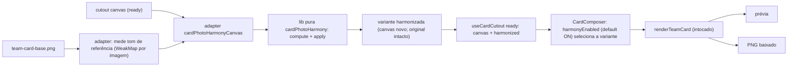

# Impl: Card "Time de você": harmonizar as cores da foto do visitante com o time

Status: aprovado
Atualizado em: 2026-09-19
Issue: #1196
Intenção: docs/plans/cards-time-de-voce-harmonizar-cores.md
Appetite restante: herdado — ~0,5–1 dia eng (3 fases somam ~0,9 dia; sem migration)

## Leitura da intenção

- **Outcome:** no estado pronto do modelo `time-de-voce`, um controle binário único ("Harmonizar cores", LIGADO por padrão) aplica um ajuste suave de brilho/contraste/saturação na foto recortada do visitante para aproximá-la do tom da arte-mestre; desligar devolve a original na hora, e a escolha vale para a prévia e para o PNG baixado — tudo no aparelho, sem persistência.
- **O que NÃO negociar:**
  - 100% no aparelho: sem upload/serviço/rede, sem analytics, sem nova dependência; sem migration/collection/CMS/Consent.
  - Um único pipeline: a variante harmonizada alimenta o MESMO `renderTeamCard` e o MESMO canvas que a prévia e o download já usam.
  - Recorte intocável: nada de pele/forma/imperfeições, nada de matiz, nunca alterar a máscara/alpha nem o framing; os 3 modelos existentes e `renderTeamCard`/`CardDrawContext` ficam intocados.
  - Só no `time-de-voce` (gate `isTeamModel`); nota de privacidade existente visível e verdadeira; literais: rótulo `Harmonizar cores`, ajuda `Ajusta o brilho e as cores da sua foto para combinar com as fotos do card.`
- **O que reavaliar (hipóteses da intenção):**
  - "Processar no recorte/hook ou no render": confirmado que não é no renderer; a variante nasce no ready do `useCardCutout` (decisão 4), o renderer fica intocado.
  - "Medir a base via `baseImage` do composer": o composer não passa a imagem ao hook — o adapter resolve a referência pelo `loadCardImage` já cacheado (`cardCanvas.ts:8-27`), com cache de tom por imagem; evita sincronizar dois ciclos e acoplar o hook a estado de UI.
  - "Botão binário estilizado": confirmado que não existe `ui/Switch` e que `ui/Toggle` é radix `aria-pressed`; o port usa `<button role="switch" aria-checked>` nativo (decisão 5).
- **Correções ao achado do explorador (verificadas nos arquivos):**
  - O e2e JÁ tem guard automático de `console.error`/`pageerror`/5xx no fixture `tests/e2e/fixtures/e2eTest.ts` (fixture `auto: true`, :100-133) — não é preciso listener novo; o achado "sem assert de console-error" vale só como ausência de assert explícito.
  - O `filter: saturate()/brightness()/contrast()` do artefato (:109-113) é o mockup do resultado sobre um placeholder `<svg>`, não o mecanismo do port (o mecanismo é passada de pixels; ver decisão 1).
  - `#cfcac7` do trilho desligado não é token do tema (só existe no CSS do artefato) — é literal de port.
  - Demais pontos 1–13 e 15–16 conferidos e batem (incluindo :216-229 do unit de render, que continua intocado).

## Abordagem recomendada

**Opções consideradas:** A) uma passada de pixels pura em `src/lib/` sobre o bitmap do recorte, com adapter DOM que gera a variante harmonizada; o ready do `useCardCutout` carrega original + harmonizada e o toggle só escolhe qual entra no `renderTeamCard` | B) `ctx.filter = 'brightness() contrast() saturate()'` no `drawImage` da foto (adicionando `filter` ao `CardDrawContext` e alterando `renderTeamCard`) | C) `filter` CSS na prévia + refazer o ajuste no export/PNG.
**Recomendação:** A — `ctx.filter` tem suporte irregular no WebKit/iOS (o baseline do produto é mobile/iPhone) e tocaria o renderer; a passada de pixels é determinística, testável como math pura com dados sintéticos, preserva o alpha do recorte e serve prévia e PNG sem segundo pipeline.
**Rejeitadas:** B porque dependeria de recurso instável no Safari e violaria a invariante "não alterar `renderTeamCard`/`CardDrawContext`"; C porque o PNG refaria o filtro por outro caminho (risco de divergir da prévia) — exatamente o "twin" de pipeline que a doutrina proíbe.

### Decisões de engenharia

1. **Plataforma do ajuste (Safari baseline).**
   **Opções:** A) passada de pixel pura + canvas variante | B) `ctx.filter` no draw | C) CSS filter na prévia + filtro próprio no export.
   **Recomendação:** A — ver acima; a variante é criada UMA vez e o toggle apenas troca a referência.
   **Rejeitadas:** B e C pelos motivos acima; nenhuma usa `ctx.filter` (não há precedente no repo).

2. **Fronteira lib pura × adapter DOM.**
   **Opções:** A) novo `src/lib/cardPhotoHarmony.ts` (medidas + compute + apply, puro) + novo `src/components/cards/cardPhotoHarmonyCanvas.ts` (canvas offscreen/getImageData/putImageData) | B) tudo em `cardCutout.ts` | C) tudo em `cardCanvas.ts` | D) importar `utilities/`.
   **Recomendação:** A — `src/lib` é puro e client-safe (nunca importa `utilities/`), então a math de pixels (ImageData-like) é unit-testável com dados sintéticos. O adapter novo é o dono de "canvas offscreen + leitura/escrita de pixels do tom", preocupação que hoje não tem dono: `cardCanvas.ts` é I/O de assets/PNG (não faz `getImageData`) e `cardCutout.ts` é segmentação/máscara — acoplar tom ali arriscaria o recorte. Sem twin: o adapter reusa `loadCardImage` do dono existente e a lib pura.
   **Rejeitadas:** B porque misturaria motor MediaPipe com tone mapping na mesma vizinhança e convidaria a mutar o bitmap do recorte; C porque colocaria duas preocupações no mesmo arquivo e todo modelo pagaria o import; D por invariante do repo.

3. **Fórmula e limites (números fixos).**
   **Opções:** A) medir a arte-mestre em runtime e a foto, com fator = `clamp(ref/src)` e limites fixos | B) perfil fixo calibrado uma vez | C) correção com matiz/temperatura/OKLab/white balance.
   **Recomendação:** A — segue o literal ("referência: arte-mestre"), com clamps que impedem "filtro da casa"; B foi a alternativa já registrada na intenção e fica só como plano B de contingência; C está fora do literal (só brilho, contraste, saturação).

   | fator     | cálculo                                   | limites (clamp) |
   | --------- | ----------------------------------------- | --------------- |
   | brilho    | `ref.meanLuma / src.meanLuma`             | `[0,94, 1,08]`  |
   | contraste | `ref.sdLuma / src.sdLuma`                 | `[0,94, 1,08]`  |
   | saturação | `ref.meanSaturation / src.meanSaturation` | `[0,90, 1,12]`  |
   - Medidas (puras): por pixel, luma Rec.709 (`0.2126r + 0.7152g + 0.0722b`, sRGB bytes, sem linearizar); `meanLuma`; `sdLuma` (desvio populacional); `meanSaturation` = média de `(max-min)/max` (HSV S; 0 quando max=0). Pixels com `alpha ≤ 32` ficam fora da amostra (mesmo limiar do recorte; sem amostras → `samples: 0`).
   - Guards: stat da fonte ≤ 0 ou não-finita → fator 1; referência com `samples: 0` → identidade.
   - Aplicação (ordem fixa): brilho (multiplica RGB) → contraste (`v' = (v-0.5)*c + 0.5`) → saturação (`v' = luma + (v-luma)*s`, luma do pixel já corrigido); arredonda e clampa `[0,255]`; **alpha copiado byte-a-byte**.
   - **Identidade:** se os três fatores ficam em `1 ± 0,02`, a variante É o original (nenhum canvas novo); é o comportamento esperado para foto já próxima do tom.
   - Baseline medido agora no repo (sanidade; o código mede em runtime): `team-card-base.png` 1080×1440 → `meanLuma 0,652`, `sdLuma 0,280`, `meanSaturation 0,441` (HSV, alpha>32). Os caps ficam iguais/logo acima do mockup do design (`saturate 1.12`, `brightness 1.06`, `contrast 1.06`) — delta máximo ≤ 12%.
   - Amostra e aplicação varrem a imagem inteira (cutout ≤ 1600px de aresta por `CUTOUT_MAX_EDGE`); é uma medida + uma aplicação por foto.

4. **Ciclo de vida e cache da variante.**
   **Opções:** A) computar dentro do `useCardCutout.start` (antes do `setState(ready)`), guardando `canvas` + `harmonized` no estado ready | B) `useMemo` no composer | C) `useEffect` separado com estado próprio | D) computar no clique do toggle.
   **Recomendação:** A — o hook já é o dono do ciclo do recorte (run-id, retry, desmontagem); o ready passa a carregar as duas variantes e o default LIGADO já vale no primeiro commit (sem frame original → "a prévia abre harmonizada"). "Trocar foto" chama `start` de novo e gera nova variante naturalmente; o toggle só escolhe qual variante entra em `renderTeamCard` (zero reprocessamento). Cache: o tom da referência fica num `WeakMap` por imagem no adapter (a imagem do asset já é cacheada por `loadCardImage`); a variante é cacheada no próprio estado ready — nenhuma estrutura global segura canvas grande. Falha da harmonização (referência indisponível/contexto 2D ausente) → `harmonized: null` e o composer esconde o controle (não mente um switch ligado sem efeito); é caso praticamente impossível (mesma origem, canvas 2D padrão).
   **Rejeitadas:** B porque compute em render é efeito colateral e bloqueia sem dono explícito; C porque espelharia os run-ids do hook (twin de ciclo) e deixaria um frame original visível; D porque o default LIGADO não estaria pronto no primeiro frame e religar poderia reprocessar.

5. **Controle.**
   **Opções:** A) `<button type="button" role="switch" aria-checked>` nativo com trilho/thumb, componente local `TeamHarmonySwitch` no `CardComposer.tsx` (padrão do `TeamNameField`) | B) reusar `ui/Toggle` (radix, `aria-pressed`) | C) criar `ui/Switch` shadcn/radix | D) arquivo novo `components/cards/TeamHarmonySwitch.tsx`.
   **Recomendação:** A — o literal exige `role=switch` + `aria-checked` e o artefato diz explicitamente "sem shadcn Switch"; o markup do design (:353-377, CSS :161-206) é botão nativo com trilho/thumb. Port classe-a-classe: linha inteira é o botão com `min-h-11`, trilho 44×26 com thumb 20px (`--pt-red` ligado / `#cfcac7` desligado, literal), label/ajuda sempre visíveis, foco visível com tokens do app. Uso único → componente local (extrair arquivo seria pass-through raso). As pílulas "LIGADO · alvo ≥44px"/"DESLIGADO" do artefato são anotação de crítica, não UI — não são portadas.
   **Rejeitadas:** B porque `aria-pressed` contradiz a semântica literal; C porque adiciona primitivo vetado pelo design e sem segundo uso; D porque cria módulo raso de uso único.

6. **Ramo `nameError` e "Trocar foto".**
   **Opções:** A) esconder o controle no `nameError` (junto do zoom, que já some) e manter a escolha do usuário ao trocar de foto | B) mostrar também no `nameError` | C) resetar o toggle para LIGADO em "Trocar foto".
   **Recomendação:** A — precedente do próprio composer (em `nameError` só o campo do nome aparece); o design só cobre o ready normal; ao corrigir o nome o controle reaparece com o estado que o usuário deixou. O reset para LIGADO acontece só ao desmontar/reabrir o composer (sem persistência), que é o "sair e voltar" do aceite.
   **Rejeitadas:** B porque o artefato não cobre e o ramo existe para focar a correção do nome; C porque reaplicaria um efeito recém-recusado na foto anterior (surpresa ruim) e custaria código extra.

7. **Testes.**
   **Opções:** A) unit do lib puro com dados sintéticos + estender o describe e2e do time | B) só e2e | C) int/e2e com engine real.
   **Recomendação:** A — unit: alpha preservado byte-a-byte, clamps exatos, guards de stat zero/não-finita, identidade (mesma referência, sem cópia), monotonicidade (brilho sobe luma; contraste afasta do meio; saturação abre canais; cinza neutro fica cinza), clamp `[0,255]` sem wrap, determinismo. E2E (no describe `Time de você`): novo teste com stub `ok` — switch visível com `aria-checked="true"` (default), alvo ≥ 44px, amostra de 1 pixel no centro da janela (`(582,727)`, dentro do recorte e fora do overlay) muda ao desligar e volta idêntica ao religar (prova de troca de bitmap, não só de ARIA), nota de privacidade visível; ausência do switch no modelo de foto e no `nameError` (um assert em cada teste existente). O guard de console/pageerror do fixture já cobre "sem console error"; o teste de download existente passa a exercitar o caminho harmonizado por padrão (fixture RGB sólido `30,120,200` cai longe da identidade: luma 0,418 vs 0,652; sat 0,849 vs 0,441). Sem int (nenhuma superfície de DB).
   **Rejeitadas:** B porque clamps/alpha merecem prova determinística fora do browser; C porque o engine real é craft/UAT (S15) e o stub existe para isso.

8. **A11y/teclado.**
   **Opções:** A) botão nativo `role=switch` (Tab + Space/Enter nativos), `aria-checked` booleano, linha inteira ≥44px, foco visível com tokens | B) `<input type=checkbox role=switch>` | C) teclado customizado em setas.
   **Recomendação:** A — semântica correta sem JS de teclado; `aria-checked` reflete o estado; toque e teclado no alvo da linha toda; foco com `focus-visible:ring-2` (`--pt-red`), como os demais controles do composer.
   **Rejeitadas:** B porque o design pede trilho/thumb e o input exigiria styling complexo; C porque inventaria interação sem necessidade.

### Componentes / mudanças

- **`src/lib/cardPhotoHarmony.ts`** (novo, puro, client-safe): `CardPhotoTone`, `CardHarmonyAdjustment`, `CARD_HARMONY_LIMITS`, `CARD_HARMONY_IDENTITY_EPSILON`; `measureCardPhotoTone(data)`, `computeCardHarmonyAdjustment`, `isCardHarmonyIdentity`, `applyCardPhotoHarmony(data, adjustment)`. O alpha floor da amostra é o mesmo do bbox: `CARD_CUTOUT_ALPHA_THRESHOLD` exportado em `cardPhotoTransform.ts` (dono do `CardAlphaBbox`) e importado por `cardCutout.ts` e `cardPhotoHarmony.ts` — fonte única, sem twin.
- **`src/lib/cardPhotoTransform.ts`** (editar, 1 constante): `CARD_CUTOUT_ALPHA_THRESHOLD` — alpha floor compartilhado pelo bbox (`cardCutout`) e pela amostra de tom (S17).
- **`src/components/cards/cardPhotoHarmonyCanvas.ts`** (novo, adapter DOM): `harmonizeCardCutout(cutout, referenceSrc): Promise<HTMLCanvasElement | null>` — `loadCardImage` (dono) + WeakMap de tom por imagem; `ctx.createImageData` + `set` + `putImageData`; nunca muta o canvas do recorte; devolve o próprio cutout quando identidade.
- **`src/components/cards/useCardCutout.ts`** (editar): novo param `harmonyReferenceSrc?: string`; ready ganha `harmonized: HTMLCanvasElement | null`; harmoniza antes do `setState(ready)` com guard de run-id.
- **`src/components/cards/CardComposer.tsx`** (editar): estado `harmonyEnabled` default `true` (junto de :112-123); draw effect (:214-230) passa a variante selecionada (`harmonyEnabled && teamReady.harmonized ? teamReady.harmonized : teamReady.canvas`, com `harmonyEnabled` no array de deps); `TeamHarmonySwitch` local no ramo ready não-error, entre `{zoomAndPanControls}` e "Trocar foto"; esconde o controle quando `harmonized === null`.
- **`src/components/cards/cardCopy.ts`** (editar): `CARD_HARMONY_LABEL = 'Harmonizar cores'` e `CARD_HARMONY_HELP = 'Ajusta o brilho e as cores da sua foto para combinar com as fotos do card.'` (dono da copy do estúdio).
- **`tests/unit/cardPhotoHarmony.unit.spec.ts`** (novo): casos da decisão 7, com `Uint8ClampedArray` sintético — sem canvas/jsdom.
- **`tests/e2e/frontend.e2e.spec.ts`** (editar): novo teste no describe `Cards personalizados (S15 — Time de você)` + asserts de ausência nos testes do modelo de foto (:1796) e do nome longo (:1930). O guard de console já é automático pelo fixture.
- **`docs/changelog/2026-09-19-s17-card-time-de-voce-harmonizar-cores.md`** (novo, uma entrada curta).
- **Migration:** sem migration — nenhuma collection/global/field toca o schema; `push:false` intocado.
- **Access / Consent:** n/a — nenhuma superfície Payload; a foto e a escolha nunca saem do aparelho; sem chave nova de Consent e sem persistência.
- **UI:** Impeccable C — port do artefato (controle no ready, depois de "Ajuste fino" e antes de "Trocar foto"; trilho `--pt-red`/cinza, thumb, label+ajuda sempre visíveis, cenas desktop 1280 e mobile 390); sem cor nova; alvo ≥44px; foco visível; `role=switch`/`aria-checked`.

### Dados → forma (não se aplica)

Não se aplica (data-presentation Q3): nenhum KPI, mapa ou série; a única "forma" é o pixel da própria foto (insumo local) e o tom da arte-mestre. Nenhum dado é coletado, persistido ou apresentado; a escolha do toggle não vira métrica.

## Fases verificáveis

1. **Tracer do núcleo puro** — quota ~0,25 dia. `src/lib/cardPhotoHarmony.ts` + `tests/unit/cardPhotoHarmony.unit.spec.ts`: medidas, fórmula, clamps, guards, identidade, alpha preservado, monotonicidade, determinismo.
   Prova: `pnpm test:unit tests/unit/cardPhotoHarmony.unit.spec.ts` verde; nenhuma UI alterada ainda.
2. **Pipeline + UI** — quota ~0,4 dia. Adapter `cardPhotoHarmonyCanvas.ts`; `useCardCutout` com `harmonized`; draw do composer escolhendo a variante; `TeamHarmonySwitch` + copy no ramo ready (não no `nameError`).
   Prova: `NEXT_PUBLIC_CARDS_CUTOUT_STUB=1 pnpm dev` em `/cards?model=time-de-voce` — prévia abre harmonizada, desligar/religar troca na hora, "Trocar foto" reaplica, `nameError` e os 3 modelos não mostram o switch; `pnpm gate:fast` verde.
3. **Gates** — quota ~0,25 dia. E2E novo + asserts de ausência; `pnpm gate:fast`; `pnpm test:e2e tests/e2e/frontend.e2e.spec.ts` (o manifesto `scripts/lib/e2e-affected-manifest.mjs` já aciona `frontend` para `src/components/cards` e `src/lib/card` — sem mudança de manifesto); `pnpm push` (roda `gate:ci`).
   **Design tier:** crítica final do `designer` **certificada no tier primário** (`openai/gpt-5.6-sol`) — o artefato foi revalidado e perdeu o selo `DEGRADED`; registrar `Design tier:` no body do PR. Ajustes pedidos na crítica e aplicados: prévia `ready` a 180px no mobile (240px no desktop), superfície do switch sem hover persistente, "Trocar foto" em `mt-3`.

## Rabbit holes / Não escopo (engenharia)

- **`ctx.filter` no Safari.** Suporte irregular no WebKit; o baseline é iPhone — rejeitado (decisão 1).
- **CSS filter na prévia + filtro separado no export.** Dois pipelines e PNG divergente — rejeitado.
- **Editor de imagem** (slider/curvas/presets/ajuste manual) — anti-goal de produto.
- **Matiz/temperatura/OKLab/white balance** — fora do literal (só brilho, contraste, saturação).
- **Worker/OffscreenCanvas para a passada de pixels** — especulativo; só com jank medido no UAT (gatilho explícito).
- **Persistência da preferência** (localStorage/CMS/Consent) — anti-goal.
- **Retoque de beleza** (pele/forma/imperfeições) — anti-goal.
- **Mudar recorte/máscara/framing, `renderTeamCard`/`CardDrawContext` ou os 3 modelos** — invariante.
- **Nova dependência, upload, serviço ou analytics** — anti-goal.
- **Novo primitivo `ui/Switch` shadcn/radix** — vetado pelo design (decisão 5).
- **Medir a referência no servidor / pré-processar o asset** — anti-goal (100% no aparelho) e perde a verdade do asset servido.

## Revisão da sessão (simplify) — resolvido, adiado com gatilho, fora

**Resolvido no simplify (não reabrir):** alpha floor do bbox e da amostra de tom unificados em
`CARD_CUTOUT_ALPHA_THRESHOLD` (`cardPhotoTransform`); `CardPhotoPixels` removido (as funções puras
recebem `Uint8ClampedArray`); `IDENTITY_ADJUSTMENT` congelado (`Object.freeze`); `aria-describedby`

- `useId` no switch (nome acessível limpo, ajuda anunciada como descrição); primeira amostra de
  pixel do e2e pollada (fim do flake potencial); assert da nota de privacidade no teste novo;
  `?? 0` redundante removido do loop quente; codebase-map atualizado no mesmo PR.

**Adiados com gatilho (engenharia):**

- **Alpha-skip na passada de aplicação** (pixels com alpha ≤ 32 hoje fazem a conta invisível) —
  gatilho: jank medido no UAT; alpha-skip antes de subsample/worker.
- **Testes do adapter `harmonizeCardCutout`** (identidade devolve o mesmo canvas; falha → `null`
  esconde o controle) — gatilho: 2º consumidor do adapter OU identidade virar aceite explícito de
  produto (hoje o e2e prova a troca de bitmap e prévia = PNG no mesmo canvas).
- **`transition-[left]` do thumb** (anima layout) — trocar por `translate-x` se o switch for tocado
  por outro motivo; sem jank medido.

**Explicitamente fora (não reabrir):** catch fail-closed do adapter (esconde o controle em vez de
mentir um switch ligado sem efeito; a math pura é coberta por unit); dedup do `clamp` (one-liner
estável já repetido em vários módulos de `lib`; extrair módulo raso piora).

**Harness (main vermelha):** `tests/unit/codebaseConventions.unit.spec.ts` passa a usar
`git ls-files -z` — sem o `-z`, o path não-ASCII `public/campaign-kit/coração.png` (C204) vinha
citado e o `readFileSync` estourava ENOENT no `verify` da main; vai em commit separado neste PR.

## Riscos e mitigação

| Risco                                                                                                          | Mitigação / gatilho                                                                                                                                                              |
| -------------------------------------------------------------------------------------------------------------- | -------------------------------------------------------------------------------------------------------------------------------------------------------------------------------- |
| Flash de foto original → harmonizada ao abrir a prévia                                                         | Computar no `start` antes do `setState(ready)` (um único commit); se algum dia entrar latência > ~300ms, aí sim worker + estado transitório explícito (nomeado em rabbit holes). |
| Passada de pixels pesada em celular fraco (≤1600², 1 medida + 1 aplicação)                                     | Uma única vez por foto; se o UAT acusar jank, subsample da medida (stride 2) antes de qualquer mudança estrutural.                                                               |
| Referência "alta demais" (base inclui céu/candidato coberto: luma 0,652) empurrar quase toda selfie para o cap | Caps fixos (≤12%) tornam o pior caso aceitável; se o UAT achar claro demais, remedir excluindo a janela da foto ou usar mediana — decisão de produto registrada, não silenciosa. |
| Identidade (1±0,02) fazer o toggle parecer inerte numa foto já no tom                                          | Comportamento intencional ("foto já próxima do tom = identidade"); a fixture e2e está longe da identidade (luma 0,418 vs 0,652), então a troca de bitmap é observável.           |
| Memória +1 canvas RGBA por cutout (≤ ~10MB)                                                                    | Limitado por `CUTOUT_MAX_EDGE`; liberado ao trocar de foto/desmontar o composer; o original é preservado para o toggle off.                                                      |
| Amostra e2e em (582,727) ficar sob o overlay em mudança futura da arte                                         | Ponto hoje transparente no front (front só cobre y≥971); se a arte mudar, ajustar o ponto de amostra (trigger barato).                                                           |
| `getImageData` taint                                                                                           | Asset same-origin em `/cards` (sem CDN); sem mudança prevista.                                                                                                                   |
| Falso "no-op" no e2e por console                                                                               | Guard automático do fixture `e2eTest` já falha o teste em `console.error`/`pageerror`/5xx — nenhum listener novo.                                                                |

## Aceite de engenharia (checkboxes)

- [ ] Controle só no ready normal do `time-de-voce` (não no `nameError`, não nos outros 3 modelos); `role=switch` + `aria-checked`; alvo da linha ≥44px; toque e teclado (Space/Enter) com foco visível; label e ajuda nos literais exatos.
- [ ] Default LIGADO: a prévia abre harmonizada sem frame original visível.
- [ ] Desligar devolve a original instantaneamente; religar reaplica; nenhum reprocessamento de pixels na troca (cache no ready).
- [ ] A escolha vale para a prévia E para o PNG (mesmo canvas único, `canvasRef` → `canvasToPngBlob`).
- [ ] Nada persistido: fechar/reabrir volta ao padrão LIGADO (estado de mount).
- [ ] Recorte/máscara intactos: alpha byte-a-byte, nenhuma mutação do canvas original; enquadramento/pan/zoom inalterados.
- [ ] `renderTeamCard`, `CardDrawContext`, `cardCutout.ts` (compose/máscara/bbox), `cardModels.ts` e os 3 modelos sem mudança; pins do `cardRender.unit.spec.ts` verdes.
- [ ] Só brilho, contraste e saturação via passada de pixels local; sem `ctx.filter`, sem CSS filter, sem rede/dependência/analytics.
- [ ] Sem migration/collection/CMS/Consent; nota de privacidade visível e inalterada.
- [ ] Unit do lib puro com alpha/clamps/identidade/determinismo; e2e com default, toggle (ARIA + amostra de bitmap), alvo ≥44px e ausências; `pnpm gate:fast` verde; e2e `frontend` acionado.
- [ ] Changelog `docs/changelog/2026-09-19-s17-card-time-de-voce-harmonizar-cores.md`; crítica visual do `designer` certificada no tier primário (`openai/gpt-5.6-sol`) antes do `pnpm push`.

## Self-score decision-quality: 5/5

1. **Decisões caras com rejeitadas:** pixel pass × `ctx.filter` × CSS filter (Safari/semântica de pixels); fronteira lib pura × adapter (novo dono de pixel pass, sem twin); contrato da variante no ready do hook; controle nativo × `ui/Toggle` × shadcn Switch.
2. **Cabe no appetite:** ~0,9 dia em 3 fases, sem migration, sem dependência; tracer do núcleo puro primeiro.
3. **Rabbit holes nomeados:** worker, editor, hue/Lab/white balance, persistência, CSS filter, shadcn Switch, retoque, servidor.
4. **Depth check:** o `useCardCutout` (dono do ciclo) passa a carregar as duas variantes em vez de um segundo hook/estado espelhado; o switch fica local (uso único, sem módulo raso); o adapter novo existe porque nenhum dono cobre tone mapping e `cardCutout` não pode ser acoplado.
5. **Intenção preservada:** default LIGADO, sem persistência, prévia+PNG, só `time-de-voce`, 100% local, copy literal, privacidade intacta, recorte e arte-mestre intocados.
