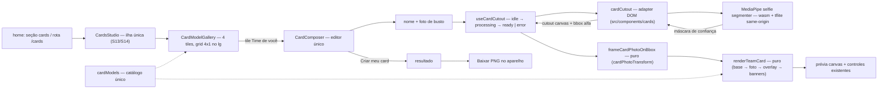

# Impl: Card "Time de você": quarto modelo auto-serviço no funil público

Status: aprovado
Atualizado em: 2026-09-18
Issue: #1161
Intenção: docs/plans/cards-time-de-voce.md
Appetite restante: herdado — ~2–3 dias eng (3 fases somam ≤3 dias; sem migration)

## Leitura da intenção

- **Outcome:** o funil de cards (home `#cards` + `/cards`, S13/S14) ganha o quarto modelo — `Time de você`: nome + foto de busto, fundo removido no aparelho, card `TIME DE <NOME>` com a foto recortada no centro sobre o fundo oficial e os banners no topo, baixável em PNG — sem conta e sem nenhum byte da foto saindo do aparelho.
- **O que NÃO negociar:**
  - 100% client-side: sem upload, sem persistência, sem analytics de PII; nome/foto nunca saem do aparelho.
  - Um único editor/fluxo: quarto item do catálogo no MESMO `CardsStudio`/`CardComposer`; `/cards` e `?model=time-de-voce` continuam.
  - Artes-mestre intocadas (compor por cima, nunca redesenhar); geometria literal medida: janela da foto `{286,439,592,577}`; banner `TIME DE` centro (545,162) ≈693×118, −3,5°, `#E50E2F`, texto `#FFEC01` cap ≈93; banner do nome centro (545,313) ≈509×176, −4,1°, `#0061A5`, nome `#FFFFFF` cap ≈130, tinta ≤470, 1 linha, cap mín ≈56.
  - Nome nunca cortado em silêncio: se não couber no cap mínimo → mesma mensagem de nome curto do modelo de nome.
  - Recorte local com progresso; falha → erro claro com retry, sem beco sem saída.
  - Sem migration/collection/CMS/Consent novo; sem headers globais que quebrem o embed (precedente c167).
- **O que reavaliar (hipóteses da intenção):**
  - **Motor recomendado (`@imgly/background-removal`)**: reavaliado e rejeitado — o `LICENSE` do repo é proprietário ("All Rights Reserved") e o pacote é AGPL-3.0; detalhe na Decisão 1. A escolha final era explicitamente do plano de implementação.
  - **“O composer carrega UMA imagem base e ramifica por kind”**: o time precisa de DOIS assets (base + overlay frontal) e de um estado de processamento — é um ramo de compositor/tempo, não um `photoWindow` a mais.
  - **“3 ids pinados”**: os pins de unit (`tests/unit/cardModels.unit.spec.ts:7`) e o loop de tiles do e2e (:1712) quebram com o 4º modelo; atualizá-los faz parte da entrega.

## Abordagem recomendada

**Opções consideradas:** A) estender o funil S13/S14 (catálogo + composer + render puros + adapter DOM novo) | B) rota/editor novo só para o time | C) recorte como serviço/API/iframe.
**Recomendação:** A — o quarto modelo é um item do catálogo num funil que já tem editor único, shells e núcleo puro; reusar mantém o anti-goal "segundo editor" cortado e cabe no appetite.
**Rejeitadas:** B porque cria dois fluxos (o rabbit hole de produto) e duplica shells/estado; C porque viola o aceite "nenhum byte sai do aparelho".

### Decisões de engenharia

1. **Motor de remoção de fundo — MediaPipe selfie segmenter (Apache-2.0), 100% self-hosted.**
   Opções: A) `@imgly/background-removal` no navegador (CDN padrão ou self-host do pacote de dados; ~40MB no 1º uso; progresso nativo; AGPL-3.0) | B) `@mediapipe/tasks-vision` `ImageSegmenter` + `selfie_segmenter.tflite` float16 256×256 (Apache-2.0; wasm SIMD ~11,7MB + modelo ~244KB; sem COOP/COEP) | C) recorte no servidor/API | D) ONNX Runtime Web + modelo próprio.
   Recomendação: B — Apache-2.0 compatível com o `LICENSE` proprietário do repo (imgly é AGPL-3.0; o repo é público mas "All Rights Reserved": visibilidade do código ≠ concessão de direitos AGPL, então a §13 não está satisfeita; o `@imgly/background-removal-node` de `scripts/resize-images.mjs` é ferramenta local de script, não distribuída ao usuário, e não vale como precedente de bundle); primeiro uso de ~12MB de wasm (cacheado) + 244KB em vez de ~40MB no celular; roda sem COOP/COEP (wasm single-thread, sem SharedArrayBuffer — respeita o c167); assets same-origin sob `public/cards/` (sem CDN em runtime; e2e hermético); a expectativa honesta de busto/fundo simples já está no aceite.
   Rejeitadas: A por licença + peso no celular + CDN de terceiro executando JS no browser (o self-host do pacote de dados imgly é grande demais para repo/imagem); C por PII/serviço; D por reimplementar runtime/wasm/hosting/modelo (fora do appetite) sem ganho sobre B.
   Hospedagem/carregamento: `selfie_segmenter.tflite` commitado em `public/cards/` (origem e Apache-2.0 documentados no código); wasm copiado de `node_modules/@mediapipe/tasks-vision/wasm/` para `public/cards/mediapipe/wasm/` (gitignored) por `scripts/copy-card-vision-assets.mjs`, disparado no preflight do `scripts/dev.mjs`, no `prebuild` (CI) e num `RUN` do estágio builder do Dockerfile (o runner copia `public/`). `await import('@mediapipe/tasks-vision')` dentro do adapter (code-split; só o modelo time paga); `FilesetResolver.forVisionTasks('/cards/mediapipe/wasm')` + `createFromOptions({ baseOptions: { modelAssetBuffer }, outputConfidenceMasks: true, runningMode: 'IMAGE' })`; main thread com yield antes do `segment()` (bloqueio de poucas centenas de ms); worker só com jank medido (gatilho).
   Progresso/falha: pré-aquecimento do wasm com fetch streaming por bytes + modelo passado como buffer → ratio real; adapter devolve `{ ok:true; canvas; size; bbox } | { ok:false; reason:'engine'|'empty' }`; um único estado de erro recuperável (`Tentar de novo` com o mesmo File guardado / `Escolher outra foto`); nenhum log em console (fixture e2e).

2. **Quarto modelo — `kind: 'team'` explícito + campos aditivos, sem pipeline genérico.**
   Opções: A) terceiro valor de `kind` + `overlaySrc`/`previewSrc`/`badge` opcionais + `renderTeamCard` reusando a math existente | B) manter `kind:'photo'` e detectar o time por flags (`photoWindow`+`nameSlot`) | C) refatorar para um pipeline de camadas (`layers[]`) para os 4 modelos | D) render/editor dedicado por id.
   Recomendação: A — o modelo tem foto + nome + overlay + processamento, então não é nenhum dos dois kinds atuais; o discriminante explícito mantém os 3 modelos entregues no mesmo caminho (mesmos unit pins de render) e deixa o composer ramificar uma vez. `renderTeamCard` (base → foto → overlay → banners) reusa `cardPhotoDrawRect`/`clampCardPhotoTransform`, `fitCardName` e um helper novo de banner; `overlaySrc`/`previewSrc` aditivos não mudam os modelos existentes. Fato verificado nos assets: `team-card-base.png` é opaco, `team-card-front.png` só cobre y≥971 e nenhum asset contém os banners — os dois banners (retângulo + texto) são desenhados pelo render com os literais medidos.
   Rejeitadas: B porque esconde um fluxo novo (processar/recortar) atrás de flags de um tipo antigo; C porque refatora o render dos 3 modelos por generalidade especulativa (risco + reescreve pins); D porque duplica editor/render (anti-goal).

3. **Auto-enquadramento — bbox alfa no adapter + math pura reusando o transform existente.**
   Opções: A) math nova em `cardPhotoTransform.ts` (`frameCardPhotoOnBbox`) convertendo para o `CardPhotoTransform` atual e passando pelo `clampCardPhotoTransform`; bbox no adapter via canvas `getImageData` | B) calcular um draw rect direto, sem o transform (perde pan/zoom reusados) | C) enquadrar "no olho" no adapter, sem função pura.
   Recomendação: A — `zoom = clamp(coverNecessário(bbox→janela) / coverScale(fonte,janela), 1, CARD_PHOTO_MAX_ZOOM)`; topo do bbox encosta no topo da janela e o centro x do bbox alinha ao centro da janela; clamp final garante cobertura, e os controles de arrastar/zoom/setas do S13/S14 seguem funcionando com a transform resultante. Bbox: canvas de trabalho limitado a 1600px na maior aresta (memória/scan), varredura única de alpha>32; degenerado (vazio ou < ~24px) OU zoom necessário > 4 → `null` → erro recuperável (`empty-cutout`) — nunca card com foto invisível/minúscula.
   Rejeitadas: B porque joga fora o escape de ajuste e a garantia de cobertura; C porque não é testável puro e o adapter é DOM.

4. **Fit do nome — reusar `fitCardName` com slot novo; rotação via ops no ctx estrutural.**
   Opções: A) `TEAM_CARD_NAME_SLOT` (1 linha, centrado, cap 130, tinta 470, cap mín 56, rotação −4,1°) + união `CardNameSlot` discriminada por `align` (`'left'` | `'center'`) + `CardDrawContext` ganhando `save/restore/translate/rotate/fillRect` | B) `fitTeamName` nova | C) desenhar o nome sem centralizar/rotacionar.
   Recomendação: A — a máquina de fit (probe de cap, shrink, mínimo, `too-long`) é a mesma; `NAME_CARD_SLOT` ganha `align:'left'` sem mudar comportamento e os pins atuais continuam passando; `drawCardName` ramifica por `align`; um helper `drawCardBanner` desenha retângulo e texto centrados/rotacionados (label fixo `TIME DE` cap 93/−3,5° e nome com o cap do fit); o fake ctx dos units registra a sequência `save → translate → rotate → fillRect → fillText → restore`, mantendo os testes existentes.
   Rejeitadas: B (twin da mesma matemática), C (viola a fidelidade medida do exemplo).

5. **Estado do composer — hook `useCardCutout` + estado de UI no composer.**
   Opções: A) hook `src/components/cards/useCardCutout.ts` dono do ciclo do motor (`idle → processing → ready | error`, retry, run id, desmontagem) consumido pelo `CardComposer` | B) `useState` no `CardComposer` | C) store/contexto global.
   Recomendação: A — o ciclo do engine (import dinâmico, fases, progresso, guarda de corrida/desmontagem, File do retry, dispose do segmenter) é uma preocupação coesa vizinha do adapter; o composer já tem ~500 linhas e ganharia mais 6 estados. CTA `Criar meu card` só com `cutout.status==='ready'` + `nameFit.ok` + assets prontos; passo `result` inalcançável antes disso; `Baixar meu card` só no result (nunca baixa exemplo/estado intermediário). A11y: picker/retry são `<button>`; progresso em `role="status"`/`aria-live="polite"`; erro em `role="alert"`; o preview pronto reusa `tabIndex`/setas/zoom do bloco de foto; `Cancelar`/fechar funcionam em qualquer fase (não aborta o promise; run id ignora resultado tardio).
   Rejeitadas: B (espalha o ciclo e a guarda de corrida no componente grande), C (não há segundo consumidor).

6. **Testes — unit puro obrigatório; e2e com seam do motor; int não se aplica.**
   Opções: A) estender os specs de unit e o describe do `frontend.e2e.spec.ts` com stub do motor via flag de build | B) spec e2e novo com engine real no CI | C) testar pixels/jsdom.
   Recomendação: A — o stub (flag `NEXT_PUBLIC_CARDS_CUTOUT_STUB=1`, nunca em produção; comportamento por `window.__cardsCutoutStub = 'ok' | 'slow' | 'error'` via `addInitScript`) evita baixar/rodar o wasm no CI e torna os estados (processing/ready/error/retry) determinísticos; o engine real é verificado no craft/UAT. Envs do stub: webServer do `playwright.config.ts` (dev) + step "Build for e2e" do `ci-pr.yml` e do `deploy.yml` (prod mode); documentar em `.env.example`.
   Rejeitadas: B porque o CI baixaria ~12MB de wasm e a inferência sobre fixture sintético é não-determinística; C porque jsdom não tem canvas e fidelidade se prova no craft + download real.
   Manifest: nenhuma entrada nova — `src/components/cards` e `src/lib/card` já mapeiam para `frontend` (`scripts/lib/e2e-affected-manifest.mjs:71-76`); `cardCutout`/`useCardCutout`/specs caem nesses prefixos, e `public/cards/*.tflite` não entra no classificador de e2e.

7. **Copy — “três” → “quatro” e literais das cenas.**
   Opções: A) editar os dois pontos canônicos (`cards/page.tsx:11` intro + `CardModelGallery.tsx:71` dica) e portar os literais das cenas 3–7 do design | B) centralizar tudo num arquivo de copy novo | C) reescrever a copy.
   Recomendação: A — a intro é metadata (`metadata.description = intro`) e a dica é a única outra menção; o compositor do time usa os literais do design: títulos "Entre para o time"/"Preparando sua foto"/"Confira seu card"; ajuda do nome "Vai aparecer em caixa alta depois de “TIME DE”. Use um nome curto e conhecido."; bloco "Sua foto de busto" + "Para um recorte melhor, escolha uma foto nítida, de frente e com fundo simples." + "Escolher foto"; processamento "Baixando o modelo de recorte…" + "Na primeira vez, o modelo precisa ser baixado. Depois, vamos remover o fundo da foto no seu aparelho. Isso pode levar um pouco."; pronto "O recorte já foi centralizado. Se precisar, arraste a foto ou use os controles." + "Arraste para ajustar" + "Trocar foto"; erro "Não foi possível remover o fundo desta foto." / "Tente de novo ou escolha outra foto." / "Fotos de busto, nítidas e com fundo simples costumam funcionar melhor." + "Tentar de novo"/"Escolher outra foto"; nome longo reusa a mensagem exata existente ("Não foi possível encaixar esse nome no card. Use um nome mais curto, como você é chamado.") + "A foto escolhida e o recorte permanecem salvos neste aparelho enquanto você corrige o nome."; privacidade reusa `CARD_PRIVACY_NOTE`/`CARD_PHOTO_PRIVACY_NOTE`; eyebrow/título/corpo da home não mudam.
   Rejeitadas: B (1–2 call sites cada, sem compartilhamento), C (o gate é o design).

### Componentes / mudanças

- **`src/lib/cardModels.ts`** (editar): `kind` vira `'name' | 'photo' | 'team'`; 4º modelo `time-de-voce` (`assetSrc` base, `overlaySrc` front, `previewSrc` example, 1080×1440, `photoWindow {286,439,592,577}`, `badge 'NOVO'`); `TEAM_CARD_NAME_SLOT` (align center, centerX 545, capTop 248, capHeight 130, maxInkWidth 470, minCapHeight 56, maxLines 1, fill `#FFFFFF`, rotationDeg −4.1), `TEAM_CARD_NAME_BANNER` (545,313, 509×176, `#0061A5`, −4.1°) e `TEAM_CARD_LABEL` (693×118 centro (545,162) `#E50E2F`, texto `TIME DE`, cap 93, `#FFEC01`, −3.5°); `CardModel` ganha `overlaySrc?/previewSrc?/badge?`; `isCardModelId` cobre o novo id de graça.
- **`src/lib/cardNameFit.ts`** (editar): `CardNameSlot` vira união discriminada por `align` (`left`+`leftX` | `center`+`centerX`+`rotationDeg`); matemática de fit intocada.
- **`src/lib/cardPhotoTransform.ts`** (editar): `CardAlphaBbox` + `frameCardPhotoOnBbox(source, window, bbox): CardPhotoTransform | null`.
- **`src/lib/cardRender.ts`** (editar): `CardDrawContext` ganha `save/restore/translate/rotate/fillRect`; `drawCardName` ramifica `align`; `drawCardBanner`; `renderTeamCard` (base → foto pelo transform → front → banner `TIME DE` + nome fitado; devolve fit/clamp; fit falho desenha os banners fixos sem o nome — nunca corta).
- **`src/components/cards/cardCutout.ts`** (novo, adapter client-safe): dynamic import do tasks-vision; prefetch streaming do wasm; modelo como buffer; `segment()` após yield; confiança→alpha (`destination-in` bilinear), bbox (alpha>32, canvas ≤1600px), higiene de memória (`close()` de máscaras/segmenter); branch do stub.
- **`src/components/cards/useCardCutout.ts`** (novo, client): máquina de estados, progresso por fase, `process(file)`, `retry()` (mesmo File), `reset()`, run id, dispose.
- **`src/components/cards/CardComposer.tsx`** (editar): ramo `isTeamModel` com as cenas (idle exemplo + nome + foto; processing base + status/barra; ready canvas + controles + `Trocar foto`; erro de recorte; nome longo inline com CTA off); carrega `overlaySrc` junto do `assetSrc`; `canAdvance`/download condicionados ao cutout ready.
- **`src/components/cards/CardModelTile.tsx`** (editar): `src={model.previewSrc ?? model.assetSrc}`, `sizes` para 4 colunas (~260px no lg), selo `NOVO`.
- **`src/components/cards/CardModelGallery.tsx`** (editar): grid desktop `lg:grid-cols-4`; dica "Deslize para ver os quatro modelos".
- **`src/app/(frontend)/(home)/cards/page.tsx`** (editar): intro/metadata "Escolha um dos quatro modelos…".
- **`src/app/(frontend)/styles.css`** (editar): tokens `--team-red/--team-yellow/--team-blue` no tema `campaign-site` (port do artefato; o canvas mantém os literais no lib).
- **`scripts/copy-card-vision-assets.mjs`** (novo; idempotente, importável) + **`scripts/dev.mjs`** (preflight) + **`package.json`** (`prebuild`) + **`Dockerfile`** (`RUN` no builder antes do `next build`) + **`.gitignore`** (`/public/cards/mediapipe/`) + **`.env.example`** (flag do stub).
- **`public/cards/selfie_segmenter.tflite`** (novo, ~244KB, Apache-2.0, origem documentada).
- **`playwright.config.ts`**, **`.github/workflows/ci-pr.yml`**, **`.github/workflows/deploy.yml`** (editar): `NEXT_PUBLIC_CARDS_CUTOUT_STUB=1` no webServer dev e nos builds de e2e (nunca em produção).
- **Testes** (editar): `tests/unit/cardModels.unit.spec.ts`, `cardNameFit.unit.spec.ts`, `cardPhotoTransform.unit.spec.ts`, `cardRender.unit.spec.ts`; `tests/e2e/frontend.e2e.spec.ts` (describe novo + loop de tiles do S14).
- **`docs/changelog/2026-09-18-s15-card-time-de-voce.md`** (novo).
- **Migration:** sem migration — nenhuma collection/global/field toca o schema; `push:false` intocado.
- **Access / Consent:** não se aplica — nenhuma superfície Payload; nome/foto nunca saem do aparelho; sem chave nova de Consent e sem persistência.
- **UI:** Impeccable C — shape (artefato aprovado, cenas 1–7) → craft (port class-by-class; grid 4×1; engine real em fotos de busto; progresso/erro) → critique (a11y, mobile 390, copy) → polish. Shells reusados: `CardsStudio`, `ui/dialog`, `ui/Drawer`, `CardPreviewCanvas`; tokens `--pt-red`/`--campaign-*` + `--team-*`; alvos ≥44px, contraste ≥4,5:1, `role=status`/`role=alert`, foco preso e retorno ao tile.

### Dados → forma (se aplicável)

Não se aplica (data-presentation Q3): nenhum KPI, mapa ou série; a única "forma" é a geometria do próprio card (literais medidos) e o progresso do processamento. Nome e foto são insumos locais da imagem — nunca dados apresentados, coletados ou enviados.

## Fases verificáveis

1. **Tracer da geometria + catálogo** — quota ~0,75 dia. Catálogo com o 4º modelo/slots; `CardNameSlot` com `align`; `CardDrawContext` com ops; `drawCardBanner` + `renderTeamCard`; `frameCardPhotoOnBbox`; units atualizados. O composer abre o time e desenha base+banners+nome (sem recorte) para calibrar contra `team-card-example.jpg` (posição/rotação/corpo/cores).
   Prova: `pnpm gate:fast` verde; `/cards?model=time-de-voce` mostra `TIME DE MARIA` nas posições medidas; pin dos 4 ids passa.
2. **Motor + auto-enquadramento + estados** — quota ~1–1,5 dia. Dependência + script de cópia + tflite; `cardCutout` + `useCardCutout`; auto-frame; controles reusados; processing/ready/error/retry; stub seam + envs de e2e.
   Prova: `pnpm gate:fast` verde; no browser, fotos de busto reais recortam e enquadram (topo encostado/centrado), progresso aparece, foto ruim cai no erro com retry, sem COOP/COEP; wasm servido same-origin.
3. **UI/copy/galeria + e2e + gates** — quota ~0,5–0,75 dia. Grid 4×1 + selo NOVO + `sizes`; dica/intro "quatro"; copy das cenas; craft/critique/polish; e2e do describe novo; changelog; `pnpm gate:fast`; e2e local (`pnpm test:e2e --no-deps -- tests/e2e/frontend.e2e.spec.ts -g "Time de você"`); `pnpm push`.
   Prova: e2e verde com stub (galeria 4 tiles + selo; `/cards?model=time-de-voce` idle → processing → ready → resultado → download `card-jorge-solla-time-de-voce.png` com assinatura PNG; falha do recorte → `role=alert` + `Tentar de novo`/`Escolher outra foto` e retry vira ready; nome longo → mensagem de nome curto com CTA desabilitado; drawer mobile); unit dos 4 specs; fixture de console-error intacto.

## Rabbit holes / Não escopo (engenharia)

- Worker/OffscreenCanvas/COOP+COEP/multithread sem jank medido — o engine roda single-thread same-origin; gatilho: bloqueio perceptível de main thread no craft.
- Máscara manual (pincel/borracha), detecção de rosto, múltiplas pessoas, "recorte perfeito", correção automática de foto.
- Segundo editor/rota/fluxo; abrir o motor para os 3 modelos existentes; 5º modelo; CMS de modelos/métricas.
- Refatorar `cardRender` para pipeline genérico de camadas.
- Compartilhamento social, persistência de nome/foto/arte, upload, conta, analytics de PII.
- Substituir o `@imgly/background-removal-node` dos scripts (gatilho: se o tooling deixar de ser interno); nenhum pacote AGPL no bundle do navegador.
- Testes de pixel no jsdom/snapshot visual/e2e com o engine real (fidelidade se prova no craft + download real).
- Headers globais no `next.config.mjs` (COOP/COEP quebraria o embed do YouTube — c167).

## Revisão da sessão (simplify) — resolvido, adiado com gatilho, fora

**Resolvido no simplify (não reabrir):** janela do banner embutida no slot (`slot.banner`,
`maxLines: 1` literal) em vez de constante global; transform do recorte derivado
(`photoTransform ?? ready.transform`) sem efeito-espelho (fim do frame de base puro); helper
`cardPhotoTransformsEqual` compartilhado; `try/finally` fechando `MPMask`/resultado/bitmap no
adapter; throttle de progresso dono único (adapter, 100 ms) com o hook sem dedupe duplicado;
`bbox` removido do estado pronto do hook; campo do nome extraído (`TeamNameField` + mensagem
única) e renderizado também no estado pronto com nome longo (não é mais beco sem saída);
título/descrição/larguras por IIFE/mapa em vez de ternários aninhados; `role=status` só no
rótulo da fase (leitor de tela não anuncia o percentual a cada tick); um único botão primário
(`Processando…` via label); `handleTeamPhotoFile` não bloqueia o input; `void buffer` morto;
NOTICE Apache-2.0 do `selfie_segmenter.tflite`; CardNameSlot importado só de `cardModels`;
tipo do slot centralizado (`align` + banner); eyebrow/erro sem duplicação.

**Adiados com gatilho (engenharia):**

- **Fatiar o `CardComposer` em subcomponentes de estado** (processing/error/ready) — adjudicado
  durante a revisão como polish de legibilidade com risco de plumbing; hoje o arquivo tem
  ~830 linhas e 3 ramos de time. Gatilho: um 5º modelo OU folga de ~0,5 dia no próximo
  item do funil de cards.
- **`disposeCardCutout()` no unmount** — o singleton do segmenter é cache de vida da página
  (recriar a sessão wasm por abertura custaria segundos); máscaras/bitmaps são liberados por
  resultado. Gatilho: memória do tab virar problema medido (heap profiler) em uso prolongado.
- **Stub de e2e em módulo lazy** — o stub é pequeno e o flag é build-time (`NEXT_PUBLIC_*`);
  mover para import dinâmico só se o bundle inicial do cards crescer além do appetite.
- **`slot?` opcional do `renderTeamCard`/`slot` do adaptador de e2e pinado por import** —
  flexibilidade sem call site; documentado, sem Issue (score ≤2).

**Explicitamente fora (não reabrir):** detalhe do erro do motor na UI (engine/empty usam a
mesma copy recuperável por decisão de produto); `CardModel` como união discriminada por kind
(Decisão 2 registrou campos aditivos); união/dispose do segmenter (acima); preview sem
`text-balance` no drawer (herdado do shell, acessível); trigger duplicado do wasm em dev/build
(Dockerfile não roda `prebuild` — comentado nos três pontos).

## Riscos e mitigação

- **Qualidade de borda do selfie segmenter (cabelo) abaixo do ISNet:** o aceite é honesto (busto/fundo simples, sem recorte perfeito); craft com fotos reais; alpha da máscara de confiança + escala bilinear suaviza a borda. Gatilho de revisão: se o UAT reprovar, o adapter é o único ponto a trocar (decisão de motor reaberta com o custo de licença explícito).
- **Licença AGPL do pacote já existente:** `@imgly/background-removal-node` continua restrito a scripts/dev (não distribuído ao usuário).
- **Build standalone sem os wasm:** o script de cópia roda no builder e no `prebuild`; o aceite verifica fetch 200 same-origin das URLs do wasm no deploy.
- **Wasm grande no primeiro uso (~12MB):** lazy (nada no bundle inicial), cache HTTP, progresso explícito; sem headers globais.
- **Bbox degenerado/segmentação vazia:** fail-closed com erro recuperável (nunca card com foto invisível); unit cobre o frame e e2e cobre o estado de erro.
- **Corrida entre tentativas/troca de foto:** run id no hook; resultado antigo ignorado; desmontar não seta estado e faz dispose seguro.
- **e2e instável:** stub determinístico evita wasm/inferência/console logs no CI; o describe S14 existente é ajustado (loop com 4 ids) no mesmo PR.
- **`prebuild` novo no fluxo de build:** script idempotente/rápido, roda em CI/dev/Docker; falha de cópia falha o build (não silencia).
- **iOS/Safari:** wasm SIMD suportado nas versões atuais; `destination-in`/`getImageData` ok; validar no craft (iPhone físico, como no S13).
- **Fonte no canvas:** banners só desenham depois de `ensureCardFont` — sem fallback medido errado.

## Aceite de engenharia

- [ ] Aceite de produto da intenção ainda coberto: 4º modelo `Time de você` na home e `/cards` (mesmo editor/shells); nome + foto de busto; `TIME DE <NOME>` nos banners com a foto recortada no centro sobre o fundo oficial; recorte no aparelho com progresso e retry; auto-enquadrado com pan/zoom como escape; nome em 1 linha com erro acionável (mesma mensagem); `/cards?model=time-de-voce`; toque e teclado; sem conta/analytics de PII; expectativa honesta de recorte.
- [ ] Invariantes AGENTS/engineering-standards: sem migration/collection/Consent; `src/lib` puro e sem DOM (engine no adapter em `src/components/cards`); copy pt-BR/identificadores em inglês; sem `as never`; knip sem órfãos; artes-mestre intocadas; `pnpm gate:fast` + e2e da superfície + `pnpm push` verdes.
- [ ] Testes de domínio previstos: unit dos módulos puros (catálogo 4 ids, `frameCardPhotoOnBbox`, fit do slot do time, ordem/ops do `renderTeamCard`) obrigatório; e2e no spec `frontend` com stub do motor (processing/ready/download real/erro/retry/nome longo/mobile); **int não se aplica** — não há Payload/DB/access nem escrita multi-collection neste fluxo (100% client-side + assets estáticos).

## Self-score decision-quality: 5/5

1. **Decisões caras com rejeitadas:** motor (licença/hosting/progresso), 4º kind, auto-frame, fit/rotação, estado/hook, harness de e2e e copy — todas com Opções/Recomendação/Rejeitadas.
2. **Cabe no appetite:** 3 fases ≤3 dias, sem migration/infra nova; tracer de geometria antes do motor pesado.
3. **Rabbit holes nomeados:** worker/COOP, máscara manual, segundo editor, pipeline genérico, engine real no CI, CDN de terceiros.
4. **Depth check:** reusa `CardsStudio`/shells, `fitCardName`, `cardPhotoTransform`/clamp, `cardRender`, `loadCardImage`/`loadCardPhoto`/`ensureCardFont`, prewarm/manifest/specs; nada de abstração especulativa.
5. **Intenção preservada:** aceite de produto intacto (outcome, geometria literal, privacidade, expectativa honesta); a engenharia só resolveu a escolha de motor que a intenção deixou explicitamente aberta.
