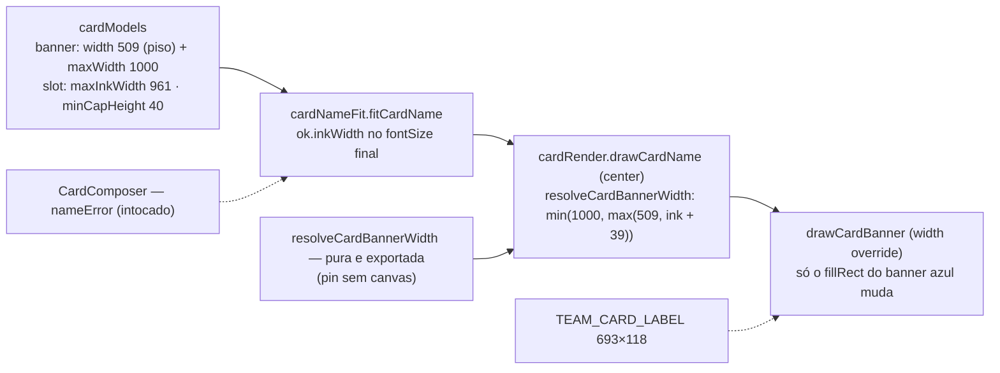

# Impl: Card "Time de você": nomes longos cabendo no banner

Status: aprovado
Atualizado em: 2026-09-19
Issue: #1195
Intenção: docs/plans/cards-time-de-voce-nomes-longos.md
Appetite restante: herdado — ~0,5–1 dia eng (3 fases ≤0,75 dia; sem migration)

## Leitura da intenção

- **Outcome:** o banner azul do "Time de você" deixa de ter largura fixa — mantém a referência 509 quando o nome cabe nela e alarga só o necessário até o teto 1000 — e nomes compostos (MARIA EDUARDA, PEDRO HENRIQUE, MARIA DA CONCEIÇÃO…) cabem em uma linha com a fonte real; fora do teto (cap mínimo 40) a pessoa recebe a mesma mensagem de nome curto. Centro (545), y (313), altura (176), rotação (−4,1°), banner vermelho e demais modelos ficam intocados.
- **O que NÃO negociar:**
  - Uma linha, sem quebra e sem corte silencioso; fora do teto → mensagem existente, CTA desabilitado.
  - Geometria medida do S15 literal: azul centro (545,313) 176 de altura −4,1° `#0061A5` texto `#FFFFFF`; vermelho 693×118 centro (545,162) −3,5° `#E50E2F`/`#FFEC01`; janela da foto `{286,439,592,577}`.
  - O banner alargado não cruza o topo da janela da foto (y=439) nem as margens do card.
  - `NAME_CARD_SLOT` (714/48, 2 linhas) e o modelo de nome intocados; os outros 3 modelos do funil intocados; `team-card-example.jpg` congelado, fora do escopo.
  - 100% client-side: nome/foto nunca saem do aparelho; sem persistência nem analytics.
- **O que reavaliar (hipóteses):**
  - **"Basta afrouxar `maxInkWidth` e baixar `minCapHeight`"** — insuficiente: `drawCardBanner` desenha o retângulo com a largura fixa do modelo (`cardRender.ts:101`) e o fit descarta a tinta medida (`cardNameFit.ts:61-66`). Sem expor a tinta e resolver a largura, o nome "cabe no fit" e transborda o banner (Decisão 1).
  - **"Os pins de unit existentes continuam"** — não: com o teto novo `Maria` deixa de encolher (`cardNameFit.unit.spec.ts:133-146`) e `Maria da Conceição` passa a caber (`:148-157`); além disso o fake de 0,6em/char passaria a classificar os dois absurdos pinados como ok (Decisão 2).
  - **"O e2e não muda"** — o teste feliz usa `Maria` (curto, não exercita o alargamento); a aceitação com a Brexter só fica provada com um nome composto (Decisão 3).

## Abordagem recomendada

**Opções consideradas:** A) aditivo no núcleo puro (2 campos + 1 função pura; fit e render nos donos atuais) | B) re-medir a tinta dentro do render (`drawCardName` passa a receber `measure`) | C) guardar tinta/fontSize no `CardComposer` e passar a largura ao render.
**Recomendação:** A — o fit já mede a tinta e o render já é o dono da geometria do banner; expor `inkWidth` e resolver a largura com os literais do modelo mantém tudo testável sem DOM, sem plumbing novo e sem tocar no slot left (`CardNameTileCanvas`).
**Rejeitadas:** B porque duplica a medição, muda a assinatura de `drawCardName` (2 call sites) e o mesmo `renderTeamCard` roda no preview e no download — o `measure` teria de viajar por todo o caminho; C porque leva uma fórmula de geometria para o componente, com 2 call sites e sem pin puro.

### Decisões de engenharia

1. **A tinta entra no fit (`CardNameFit.ok.inkWidth`) e a largura é resolvida no render (`CardBanner.maxWidth` + `resolveCardBannerWidth`).**
   Opções: A) `inkWidth` no shape ok (medido no fontSize final; 2 linhas = a linha mais larga; recomputado em `fitCardName` via `widthAt`, com `fitSingleLine`/`fitTwoLines` intactos) + `maxWidth` novo em `CardBanner` (`TEAM_CARD_NAME_BANNER.maxWidth: 1000`, label 693 fixo) + `resolveCardBannerWidth(banner, maxInkWidth, inkWidth) = min(maxWidth, max(width, inkWidth + (maxWidth − maxInkWidth)))` pura/exportada em `cardRender.ts` + `CardBannerDrawArgs.width?` como override do `fillRect` | B) `drawCardName` recebe `measure` e re-mede a linha no fontSize do fit | C) composer guarda tamanho/tinta e passa `width` ao render.
   Recomendação: A — o par do teto dá o padding exato (`1000 − 961 = 39`, coincidente com o par de referência do S15 `509 − 470`), então a fórmula fica sem literal: os 6 exemplos medidos do design viram pin exato (470→509, 527→566, 807→846, 925→964, 951→990, 952→991, 961→1000); nome curto (tinta ≤470) continua 509 e nada passa de 1000; o resto do render não muda (centro, y, altura, rotação e a ordem das ops continuam). Nenhum componente muda.
   Rejeitadas: B porque a medição já é do fit e a assinatura pioraria para todos os call sites (tile, composer, download); C porque joga a geometria para fora do `lib` puro e não cobre o download sem duplicar a fórmula.

2. **Harness dos units: fake determinístico de 0,84em/char (não manter 0,6em com nome fictício).**
   Opções: A) subir o fake para 0,84em/char (cap 0,72em mantido) nos dois specs (`cardNameFit.unit.spec.ts:12-16`, `cardRender.unit.spec.ts:56-63`), mantendo os dois absurdos pinados como `too-long` | B) manter 0,6em e pinar um nome fictício ≥29 chars como `too-long`.
   Recomendação: A — com o teto 961/cap 40, o fake de 0,6em faz `BARTOLOMEUCOSTAJUNIOR` (cap ~54,7) e `ANTICONSTITUCIONALISSIMAMENTE` (cap ~41) passarem; o unit afirmaria o oposto do comportamento real justo na fronteira que este item muda e o pin de render (`cardRender.unit.spec.ts:236-241`) quebraria. 0,84em é ≥ a Brexter nos nomes do aceite (0,81–0,85 medidos) e mantém os dois absurdos too-long (caps ~39 e ~29), espelhando o produto; a fronteira real (cap 40) fica coberta pelo fake em unit (medição direta do TTF confirma cap 38/29 para os dois absurdos) e o e2e prova o caminho real com a Brexter no nome composto (Decisão 3) — a tentativa de pinar a fronteira exata no e2e foi revertida: a medição com a fonte real é intermitente no composer (ver Riscos). Os dois pins do slot do time que mudam de resultado (`Maria` deixa de encolher; `Maria da Conceição` passa a caber) são reescritos: nome do aceite que encolhe (`Guilherme`) no teste de shrink e `Maria da Conceição` virando caso positivo.
   Rejeitadas: B porque o fake continuaria mentindo na faixa 21–28 chars e só um nome inventado de 29+ chars ficaria fora — o absurdo real do e2e não teria eco no unit; C (medir a fonte real no unit) porque o lib é DOM-free por decisão do S13 e fidelidade de fonte se prova no e2e/craft.

3. **E2E: o teste feliz passa a usar nome composto + sonda do banner alargado.**
   Opções: A) trocar o nome do teste feliz para `Maria Eduarda` (aceite medido: cap 62) e, depois do `Confira seu card`, varrer o band do banner (y∈[250,400]) contando pixels `#0061A5` por linha — exigir uma linha com >700 matches (a referência 509 dá ~505 e o fundo tem ≤1/linha; medido no master) | B) manter `Maria` e confiar no unit/resolver | C) teste dedicado novo só para o nome composto (fluxo de upload/processing duplicado).
   Recomendação: A — o e2e é a única prova com a Brexter no CI; `Maria Eduarda` prova a mensagem ausente + CTA habilitado + download real, e a varredura por linha prova que o retângulo cresceu além de 509 (a cor exata evita o falso positivo do azul do próprio master, ~(0,131,173) vs banner (0,97,165)). O teste de too-long (`Anticonstitucionalissimamente`, cap real 30 < 40) fica como está — ele é too-long em qualquer uma das fontes (Brexter ou fallback). Pin de fronteira (BARTOLOMEUCOSTAJUNIOR, cap 38) foi tentado e revertido: a medição real é intermitente no composer (2/8 execuções mediram com fallback → cap 46; ver Riscos); a fronteira fica no unit fake. Retry/mobile/console-error não mudam. Sem entrada nova no manifest de e2e: `src/lib/card*` e `src/components/cards` já acordam o spec `frontend` (`scripts/lib/e2e-affected-manifest.mjs:75-78`).
   Rejeitadas: B porque o CI não provaria a aceitação de nomes compostos que o produto pediu; C porque duplica o custo do fluxo (stub de recorte + upload) sem aumentar a prova.

4. **`maxWidth` obrigatório no `CardBanner`; vermelho fixo por construção.**
   Opções: A) `CardBanner.maxWidth` requerido — `TEAM_CARD_LABEL.maxWidth: 693` (= width, fixo) e `TEAM_CARD_NAME_BANNER.maxWidth: 1000`; o label continua desenhado direto por `drawCardBanner` sem override e, mesmo se roteado pelo resolver, o `min(693, …)` o mantém 693 | B) `maxWidth?` opcional só no banner do nome | C) tipo separado `CardDynamicBanner` só para o nome.
   Recomendação: A — o invariante "o vermelho nunca herda largura dinâmica" fica no tipo e na matemática, não só num comentário; o pin existente do render (`rectCalls[0].width === TEAM_CARD_LABEL.width`) segue como guarda de regressão.
   Rejeitadas: B porque esquecer o campo no banner do nome regride para 509 em silêncio (sem erro de tipo) enquanto o fit aceita 961 de tinta — transbordo visual; C porque é o mesmo shape com um tipo a mais e sem call site que o exija.

5. **Ordem/geometria: a largura não muda centro, y, altura nem rotação; o canto ≈436 é consequência do teto.**
   Opções: A) só o `fillRect` do banner azul muda (`x = -w/2`, `w` resolvido); texto segue centrado em `(0, capHeight/2)` e a sequência `save→translate→rotate→fillRect→fillText→restore` não muda; a garantia do canto (no teto, o canto mais baixo fica em `313 + 500·sen 4,1° + 88·cos 4,1° ≈ 436,5 < 439`) fica documentada no modelo e guardada por unit derivado do modelo | B) clampar largura/margem também no render | C) escalar altura/posição com a largura.
   Recomendação: A — é a geometria medida do S15 intocada; não desenhar além do teto (o `min()` do resolver) é a garantia, e o comentário de manutenção + o guard unit impedem que uma edição futura do modelo cruze a janela da foto.
   Rejeitadas: B porque clamp duplo mascara a fonte do valor (se o modelo estiver errado, o teste deve falhar — não o render consertar); C porque viola a geometria medida.

6. **Processo/verificação: sem migration/Consent/access; fechamento visual com crítica (c) + sign-off humano obrigatório.**
   Opções: A) nada de schema/Payload (edição em `src/lib` + testes); no fechamento, crítica visual do `designer` (trigger c) contra as cenas 1/2/7 do artefato com screenshots 390/1280 (curto, composto, fora do teto) e sign-off humano antes do `pnpm push` — o artefato é `DEGRADED` (tier 3, `opencode-go/deepseek-v4.1-flash` via `designer-degraded`) e tier degradado nunca certifica; o PR Ready registra `Design tier: DEGRADED (cards-time-de-voce-nomes-longos)` + o sign-off; `--auto` **para** na certificação visual (a flag não cobre) | B) fechar sem crítica por ser "só um número" | C) regerar o artefato no frontier antes de fechar.
   Recomendação: A — Impeccable C muda UI; o pipeline exige a crítica (c) e o sign-off; a parada do modo autônomo na certificação visual `DEGRADED` está explícita na skill.
   Rejeitadas: B (pularia o contrato de design fail-closed), C (a quota do frontier bateu — o próprio artefato registra a queda ao tier 3; re-tentar não é o caminho do ladder).

### Componentes / mudanças

- **`src/lib/cardModels.ts`** (editar): `CardBanner` ganha `maxWidth: number`; `TEAM_CARD_LABEL.maxWidth: 693`; `TEAM_CARD_NAME_BANNER.maxWidth: 1000`; `TEAM_CARD_NAME_SLOT.maxInkWidth` 470→961 e `minCapHeight` 56→40; comentário de manutenção no banner/slot (canto ≈436 < y=439; padding 39 = `maxWidth − maxInkWidth`). `NAME_CARD_SLOT` intocado.
- **`src/lib/cardNameFit.ts`** (editar): `CardNameFit.ok` ganha `inkWidth` (tinta no fontSize final; 2 linhas = a maior), computado em `fitCardName` (`:114-149`) via `widthAt`; `fitSingleLine` (`:55-69`) e `fitTwoLines` intactos.
- **`src/lib/cardRender.ts`** (editar): `resolveCardBannerWidth` pura exportada; `CardBannerDrawArgs.width?: number` e `drawCardBanner` usando `args.width ?? banner.width` (`:101`); ramo center do `drawCardName` (`:120-130`) resolve a largura com `fit.inkWidth`; `renderTeamCard` (`:211-240`) e o label intocados.
- **`src/components/cards/CardComposer.tsx` / `CardNameTileCanvas.tsx`**: sem mudança — o composer já desenha pelo fit/render e usa `nameFit.ok` só para a mensagem (`:374-407`); o tile usa o slot de nome (left).
- **Testes** (editar): `tests/unit/cardModels.unit.spec.ts` (maxWidth 693/1000; slot 961/40; guard do canto `< 439` e das margens no teto); `tests/unit/cardNameFit.unit.spec.ts` (fake 0,84; `Maria`→`Guilherme` encolhendo; `Maria da Conceição` ok; too-long com `Bartolomeucostajunior`+`Anticonstitucionalissimamente`; `inkWidth` ≤ 961); `tests/unit/cardRender.unit.spec.ts` (fake 0,84; `resolveCardBannerWidth` com os 6 pares do design + piso 509/teto 1000 + label fixo 693; retângulo azul com a largura resolvida em `:212-215` e `:253-260`; `Bartolomeucostajunior` too-long em `:236-241`); `tests/e2e/frontend.e2e.spec.ts` (describe S15: feliz com `Maria Eduarda` + sonda; demais sem mudança).
- **`docs/changelog/2026-09-19-s16-card-time-de-voce-nomes-longos.md`** (novo).
- **Migration:** sem migration — nenhum schema/collection/global; `push:false` intocado.
- **Access / Consent:** não se aplica — nenhuma superfície Payload; nome/foto continuam insumos locais.
- **UI:** Impeccable C — a estrutura visual é a do artefato `docs/plans/cards-time-de-voce-nomes-longos-ui-design.html` (cenas 1/2/7); o "port" aqui é a fórmula/limites no canvas (sem CSS novo); crítica (c) + sign-off humano no fechamento (`DEGRADED` tier 3).

### Dados → forma (se aplicável)

Não se aplica (data-presentation Q3): nenhum KPI, série ou mapa; a única "forma" é a geometria do próprio card e ela permanece a medida do S15 (só a largura do banner azul varia).

## Fases verificáveis

1. **Núcleo puro (modelo + fit + resolver)** — quota ~0,25 dia. `cardModels` (maxWidth/cap 40/tinta 961 + comentário de manutenção), `cardNameFit` (`inkWidth`), `cardRender` (`resolveCardBannerWidth` + override no `drawCardBanner`); units atualizados.
   Prova: `pnpm gate:fast` verde; `resolveCardBannerWidth` pina os seis pares do design (470→509 … 961→1000), o piso/teto e o label fixo; fake 0,84 mantém os dois absurdos too-long e faz `Maria da Conceição` caber; `cardModels` pina o canto < 439; pin do vermelho (693) verde.
2. **E2E da aceitação com a fonte real** — quota ~0,25 dia. Teste feliz com `Maria Eduarda` + varredura do banner; too-long intacto; nenhuma outra mudança no describe.
   Prova: `pnpm test:e2e --no-deps -- tests/e2e/frontend.e2e.spec.ts` verde (29 testes; resultado + download PNG com o nome composto; linha do banner com >700 pixels `#0061A5`; retry/mobile/console-error intactos). Pin de fronteira real-font tentado e revertido por flakiness pré-existente da fonte (Riscos); fronteira coberta pelo unit fake.
3. **Fechamento visual + gates** — quota ~0,25 dia. Crítica do `designer` (trigger c) contra as cenas 1/2/7 com screenshots 390/1280 dos três estados (curto/composto/fora do teto) + sign-off humano (DEGRADED); changelog; `pnpm gate:fast`; `pnpm push`.
   Prova: crítica + sign-off registrados no PR (`Design tier: DEGRADED (cards-time-de-voce-nomes-longos)`); CI (PR) verde.

## Rabbit holes / Não escopo (engenharia)

- Duas linhas/auto-quebra no banner do time; cortar/elidir; encolher abaixo de 40 (a saída é a mensagem).
- Fazer o fit (ou o render) dono da largura do banner: o fit mede a tinta, o render resolve a largura.
- Tornar o `TEAM_CARD_LABEL` dinâmico ou generalizar os dois banners num "banner parametrizado".
- Clamp duplo de largura no render; heurísticas de "banner grande demais" sem evidência.
- Medir a fonte real no unit/jsdom; snapshot visual de canvas.
- Tocar no modelo de nome (S13), nos outros 3 modelos, nas artes-mestre ou em `team-card-example.jpg`.
- Migration/CMS/flag/analytics para nome ou largura.
- Refatorar `drawCardBanner`/`drawCardName` para um pipeline genérico.

## Riscos e mitigação

- **O fake de 0,84em não é a Brexter:** a fronteira real (cap ≥ 40 para `Maria Eduarda`; cap 30 para o absurdo) é provada no e2e com a fonte real; o fake é conservador (≥ Brexter nos nomes medidos) e o unit pina a fórmula, não o valor da fonte.
- **O fit "caber" e o banner não crescer (override esquecido):** unit de render pina `fillRect.width` com o valor do resolver e o e2e exige uma linha do banner com >700 pixels `#0061A5`.
- **Herdar largura dinâmica no banner vermelho:** `maxWidth = width = 693` no label + resolver com `min(693, …)` + pin do retângulo vermelho no render.
- **Regressão no modelo de nome (compartilha `fitCardName`):** `NAME_CARD_SLOT` intocado (714/48, 2 linhas); o shape ganha só `inkWidth`; os pins do S13/S14 continuam.
- **Sonda de pixel instável (rotação/antialias):** cor exata `#0061A5` com tolerância curta e contagem por linha (o fundo do master tem ≤1 match/linha; a referência 509 dá ~505), sem depender de glifo nem de posição única.
- **Futuro: teto maior cruzar a janela da foto:** guard unit do canto mais baixo derivado do modelo (`< 439`) + comentário de manutenção; o teto é o `min()` do resolver.
- **Fechamento visual:** artefato `DEGRADED` não certifica → crítica (c) + sign-off humano explícito antes do push; sem sign-off, a sessão para (nunca "segue sem").
- **Fonte no canvas:** o banner só desenha depois de `ensureCardFont` (como no S15); a varredura espera o render estabilizar (`expect.poll`).
- **Prontidão da fonte é intermitente no composer (pré-existente, S15):** sonda no e2e real mostrou que em 6/8 execuções o fit mediu com o fallback (`ctx.font` 66px = métricas de sans-serif) e em 2/8 com a Brexter (54px), apesar de `ensureCardFont` aguardar `document.fonts.load` (que resolveu `loaded` nas execuções instrumentadas); o pin de fronteira BARTOLOMEUCOSTAJUNIOR ficou flaky (2/6 falhas, reproduzido 2/8 com e sem `document.fonts.ready`). Fora do escopo do S16 — a entrega usa o unit fake para a fronteira e mantém o e2e com nomes que são too-long em qualquer fonte. Pela triage do capture-review-debts (pré-existente em `main`, fora do escopo) fica **descartado deste lote**: a evidência e o smell de `ensureCardFont` checar `faces.length > 0` sem o `status` vivem neste plano e no body do PR; Issue própria só a pedido do humano.

## Revisão da sessão (simplify) — resolvido, adiado com gatilho, fora

**Resolvido no simplify (não reabrir):** `CardBannerDrawArgs.width` obrigatório (sem fallback silencioso para a largura do modelo); `resolveCardBannerWidth` com `max(width, min(maxWidth, …))` (nunca abaixo da referência) e assinatura por slot (`Pick<CardNameBannerSlot, 'banner' | 'maxInkWidth'>`, sem par de widths trocável); guard de margem x do unit com a rotação (`halfSpanX`); comentários precisos (padding 39 = 1000 − 961 = 509 − 470; "model-pixel"; canto como checagem conservadora); JSDoc de proveniência do cap 40/tinta 961; sonda e2e renomeada (`widestNameBannerRun`) com banda derivada do modelo e cor do `background`; nomes de teste e do resolver alinhados ao comportamento real.

**Adiados com gatilho (engenharia):**

- **Devolver a tinta medida pelo `fitSingleLine`/`fitTwoLines`** (hoje o caller re-mede 1–2 `measureText` por tecla) — risco de jank no canvas não medido e churn nos helpers compartilhados. Gatilho: jank medido ao digitar OU 5º modelo.
- **Calibrar o fake de unit a partir do TTF real** (0,84em/cap 0,72 vs medido 0,70–0,85 por nome) — o unit pina a fórmula, a fonte real é do e2e. Gatilho: nova mudança da fronteira de cap/tinta → medir o TTF e ajustar o fake.

**Explicitamente fora (não reabrir):** pin e2e da fronteira cap 40 com a fonte real (flaky pelo comportamento pré-existente do S15 — ver Riscos; descartado deste lote pela triage); `ensureCardFont` checando só `faces.length > 0` (pré-existente, fora do escopo; Issue própria só a pedido); banda/cor da sonda em constantes do próprio modelo (derivadas — decisão da sessão); `width` como parte do `CardBanner` (o override fica nos args de desenho).

## Aceite de engenharia

- [ ] Aceite de produto da intenção coberto: nomes compostos do aceite cabem (e2e com Brexter para `MARIA EDUARDA`; unit pinando os limites/fórmula dos demais), banner dinâmico 509→1000 com a referência preservada para nome curto, fora do teto a mensagem existente e CTA desabilitado, geometria/vermelho/modelo de nome/outros modelos/exemplo congelado intocados.
- [ ] Invariantes AGENTS/engineering-standards: sem migration/collection/Consent/access; `src/lib` puro e sem DOM (tinta medida pelo `CardMeasureText` injetado); copy pt-BR/identificadores em inglês; sem `as never`; knip sem órfãos; `pnpm gate:fast` + e2e da superfície + `pnpm push` verdes.
- [ ] Testes de domínio previstos: unit dos módulos puros (catálogo/slot/canto; fit com `inkWidth` e pins reescritos; resolver com os 6 pares; largura desenhada no render) obrigatório; e2e no spec `frontend` (feliz com nome composto + varredura; too-long; retry/mobile) obrigatório; **int não se aplica** — não há Payload/DB/access nem escrita multi-collection (100% client-side).

## Self-score decision-quality: 5/5

1. **Decisões caras com rejeitadas:** onde a tinta entra/o dono da largura, harness do fake, cobertura e2e, `maxWidth`/vermelho fixo, geometria/ordem e processo de fechamento — todas com Opções/Recomendação/Rejeitadas.
2. **Cabe no appetite:** 3 fases ≤0,75 dia, sem migration/infra/plumbing; tracer no núcleo puro antes do e2e.
3. **Rabbit holes nomeados:** duas linhas, corte/elipse, fit dono da largura, label dinâmico, clamp duplo, fonte real no unit, refactor de pipeline, CMS/analytics.
4. **Depth check:** reusa `fitCardName`/`CardMeasureText`, `drawCardName`/`drawCardBanner` e o fallback de fonte existentes; 2 campos + 1 função pura; nenhuma abstração nova para <3 call sites; componentes intocados.
5. **Intenção preservada:** a engenharia resolve só o "como" (tinta/largura/limites), sem reescrever o outcome — geometria medida, mensagem, escopo e privacidade intactos.
