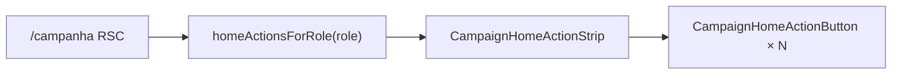

# Catálogo de ações do Início por persona

Status: rascunho
Atualizado em: 2026-07-29
Item do roadmap: [docs/roadmap.md](../roadmap.md) (Trilha B, item B45 — chassis UX-1)
Impeccable: B — mount da strip B44 no Início com catálogo por role
Appetite: ~0,5 dia eng; módulo client-safe + page wire-up; 2 atalhos com href; resto inerte
Responsável: —

## Design (Impeccable)

Âncoras: `PRODUCT.md` (Clarity; Depth for staff / light for leader) / `DESIGN.md` · primitivo **B44** · catálogo confirmado com produto 2026-07-29.

Na implementação: craft compacto → critique → polish.

Brief compacto:

- **Persona / contexto:** quatro roles veem o Início; cada um vê só ações do seu mundo (leader lockdown).
- **Job principal:** escolher a próxima ação pelo verbo — ainda sem executar wizards (exceto atalhos de lista/contatos).
- **Estratégia de cor:** herda B44 (Restrained).
- **Edit where you see:** não nesta fatia (launchers).
- **Anti-goals:** botões de inteligência/jargão (“LQ”, “captura”); >6 ações staff; leader vendo ações de município.

## Dados → decisão → apresentação

Dados: N/A — rótulos/ícones/descrições estáticos; sem KPI.

## Contexto

**B43** deixou `/campanha` vazio; **B44** entregou botão + strip. Falta o **conteúdo por persona** confirmado com produto (gate 2026-07-29) e o mount. Wizards com escrita ficam fora — botões inertes (`type="button"` sem handler, ou `aria-disabled` com toast “Em breve” — **recomendação:** inertes sem toast para não treinar clique inútil; `aria-disabled` + explicação só se critique exigir feedback).

Alinhado a [fluxos-acao-primeiro-inicio.md](fluxos-acao-primeiro-inicio.md) A1–A6 + lockdown leader.

## Objetivos

- Módulo client-safe `src/lib/campaignHomeActions.ts` (ou `dashboard/`) com:
  - tipo `CampaignHomeAction = { id, label, icon, description, href?: string }`
  - `homeActionsForRole(role): readonly CampaignHomeAction[]`
- Montar `CampaignHomeActionStrip` em `/campanha` (RSC passa a lista resolvida por `user.role`).
- **Atalhos com destino real nesta fatia:**
  - staff `uncovered-municipalities` → `buildMunicipalityListHref({ coverage: 'sem_assessor', sort: 'votos' }, 1)` (serializar no server — não importar o builder no client strip se arrastar catálogo; passar `href` já pronto).
  - leader `my-contacts` → `/campanha/contatos`
- Demais ações: **sem** `href`/`onClick` (inerte).
- Assessor: mesmos ids/rótulos; descriptions com “nos municípios da sua carteira” onde couber.
- Sem migration / Consent / action de escrita.

## Catálogo confirmado (produto 2026-07-29)

### Coordenador Geral e Candidato

| id                         | Rótulo                          | Ícone             | Descrição                                                              |
| -------------------------- | ------------------------------- | ----------------- | ---------------------------------------------------------------------- |
| `update-votes`             | Atualizar votos de um município | `BarChart3`       | Atualizar a projeção (média, pessimista, otimista) de um município     |
| `register-signal`          | Registrar o que aconteceu       | `Megaphone`       | Anotar sinal urgente: invasão, perda de apoio, novo apoio, dificuldade |
| `change-trend`             | Mudar tendência                 | `TrendingUp`      | Favorável, neutra ou desfavorável — com o porquê                       |
| `update-leadership`        | Atualizar liderança             | `Handshake`       | Trocar quem coordena, status de apoio ou votos que a pessoa declara    |
| `register-demand`          | Registrar pedido                | `Inbox`           | Demanda de material, transporte, diária ou outro pedido do município   |
| `uncovered-municipalities` | Ver quem ainda não está coberto | `UserRoundSearch` | Abrir a lista de municípios sem assessor (atalho — não é wizard)       |

### Assessor

Mesmos 6 ids/rótulos/ícones. Descrições: acrescentar escopo de carteira (ex.: “…nos municípios da sua carteira”). `uncovered-municipalities` usa o mesmo href; access da lista já filtra.

### Liderança

| id                   | Rótulo             | Ícone      | Descrição                                       |
| -------------------- | ------------------ | ---------- | ----------------------------------------------- |
| `register-supporter` | Cadastrar apoiador | `UserPlus` | Registrar alguém da sua rede que apoia o Solla  |
| `my-contacts`        | Ver meus contatos  | `Users`    | Abrir a lista dos apoiadores que você cadastrou |

## Decisões travadas

- **Catálogo em `lib/` puro**, não Payload. **Rejeitado:** collection de “ações” (caro, zero ganho até wizards).
- **CG ≡ candidate** no conjunto de botões (`isCampaignUnrestricted` / ambos staff unrestricted). **Rejeitado:** botões só no CG (candidate tem a mesma mesa).
- **Dois botões na liderança; `my-contacts` navega já.** **Rejeitado:** só um botão; os dois inertes (contatos já têm rota B43 — esconder o atalho reintroduce atrito).
- **`uncovered-municipalities` navega já** (A6 do rascunho — não é wizard). **Rejeitado:** esperar wizard chassis.
- **i18n:** ids estáveis em inglês (`update-votes`, …); labels pt-BR no catálogo.

## Questões em aberto

- **Feedback ao tocar ação inerte?** **Opções:** A silêncio | B toast “Em breve”. **Recomendação:** A — critique pode pedir B. _(assumido — validar no polish)_

## Abordagem proposta

Componentes:

- **`src/lib/campaignHomeActions.ts`:** catálogo + `homeActionsForRole`.
- **`page.tsx` (Início):** após B43 blank, monta strip com actions do ator; resolve hrefs server-side.
- **Testes:** unit do catálogo (cada role → ids esperados; leader sem ids de município; staff tem `uncovered-municipalities` com href shape); e2e smoke: Início staff mostra 6 botões; leader 2; click em “Ver meus contatos” abre `/campanha/contatos`.
- **Migration:** Sem migration, sem collection, sem server action.

## Dependências

- Duras: **B43**, **B44**.
- Soft: rascunho UX-1; `buildMunicipalityListHref`.

## Não escopo

- Chassis/wizard de passos e escrita A1–A5 → próximos itens UX-1 (registrar após B45).
- Ligar E11 → wizards.
- Voltar mapa/KPI à 1ª dobra.

## Rabbit holes

- **Feature-flag por ação / remote config.** **Mitigação:** const no `lib/` até o 2º mandato precisar.
- **Toast “Em breve” + analytics por idle click.** **Mitigação:** silêncio até critique.

## Adiado com gatilho

- **Wire real de cada id → rota de wizard.** Revisitar item a item (A1 votos primeiro — ordem do rascunho UX-1).
- **Toast em inerte.** Revisitar se sessão mostrar taps repetidos confusos.

## Referências

- `docs/roadmap.md` (B45) · [inicio-em-branco-quadro.md](inicio-em-branco-quadro.md) · [botao-acao-inicio-strip.md](botao-acao-inicio-strip.md) · [fluxos-acao-primeiro-inicio.md](fluxos-acao-primeiro-inicio.md)
- `src/utilities/municipality/municipalityListUrl.ts` (`coverage: 'sem_assessor'`)
- `PRODUCT.md` / `DESIGN.md` · AGENTS.md — roles / lockdown leader
