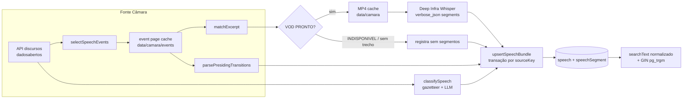

# Impl: Catálogo de falas do Solla: import idempotente e busca textual

Status: executado
Atualizado em: 2026-09-13
Issue: #955
Intenção: docs/plans/catalogo-falas-solla.md
Appetite restante: herdado (~2–3 dias; a Fase 4 é wall-clock de máquina, sem trabalho humano)

## Leitura da intenção

- **Outcome:** o acervo da 57ª legislatura existe no banco local com transcrição oficial, segmentos ASR com minutagem, facetas (tema/alcance) com proveniência e menções; o import é reexecutável sem duplicar e imprime relatório por execução; a busca por palavra sobre os segmentos acha com e sem acento. C155 leva a produção.
- **O que NÃO negociar:**
  - Facetas com proveniência `gazetteer | llm | manual`; keyword oficial crua preservada (nunca substituída pela faceta).
  - Leitura restrita a `communicator`, `coordinator` e `candidate` (+ Payload admin). `advisor` e `leader` não leem — nem via `/api`.
  - Sem UI (C154), sem espelho de mídia/S3, sem normalizar pessoas citadas como `Contact`.
  - Identidade do registro não é a URL do MP4 (regerável, hash não é contrato); import escreve só no DB local (C155 faz produção).
- **O que reavaliar (hipóteses da intenção):**
  - "LLM do Sollinha via `DEEPSEEK_API_KEY`" — essa chave não existe no ambiente do import; o mesmo modelo (`deepseek-ai/DeepSeek-V4-Flash`) está verificado ao vivo na Deep Infra, provedor/chave que a ASR já usa. Reavaliado na D3.
  - "chave natural por áudio+trecho" (C152) sozinha não cobre discurso sem trecho (54ª/sessões sem âncora). Ela vira **identidade de vídeo** (decide pular VOD/ASR), não chave do registro. Ver D2.
  - "Direção no codebase: script no padrão `recover-media.mjs`" — o padrão mais próximo é `seed-tse-results.mjs` (importa `src/` via tsx + `seed-loader`, guard de banco local, `assertLocalDatabase`). É o que este plano usa.

## Abordagem recomendada

**Opções consideradas:** A | B | C por decisão (D1–D6 abaixo).
**Recomendação:** as seis decisões, na ordem em que bloqueiam as demais; D1 e D2 travam o schema, D3–D5 travam o import e o access, D6 é dado de saída.
**Rejeitadas:** registradas dentro de cada decisão (formato obrigatório da decision-quality).

### Decisões de engenharia

#### D1 — Segmentos em collection própria, não array do discurso

- **Opções:** A) collection `speechSegment` (FK `speech`, `order`, `startSeconds`, `endSeconds`, `text`, `searchText`) | B) array de segmentos dentro de `speech` | C) um blob JSON em `speech`.
- **Recomendação:** A — a busca global (`contains` + GIN trgm) roda sobre uma tabela própria, paginável e `select`-enxuta; o C154 busca segmento e abre o discurso sem carregar 40–100 segmentos por doc. `speechSegment` fica admin-hidden (precedente `SupporterImportBatch.ts:26`) porque a superfície é o C154.
- **Rejeitadas:** B porque a query textual sobre array relacional do Payload não expõe `contains` por subcampo com o shape que o C154 precisa e infla todo read de discurso; C porque mata filtro por segmento e a indexação trigram.

#### D2 — `sourceKey` da identidade da API + identidade de vídeo armazenada

- **Opções:** A) `sourceKey = dataHoraInicio|tipoDiscurso|fase` (unique) e `eventId+audioId+excerptTMs` armazenados só para decidir re-transcrição | B) unique em `eventId+audioId+excerptTMs` | C) URL do MP4 como identidade.
- **Recomendação:** A — cobre discurso sem trecho (senão ele nunca teria chave) e sobrevive à regeneração do VOD; o import acha por `sourceKey`, e se `audioId+excerptTMs` baterem com o que já está no banco **e houver segmentos**, pula VOD+ASR e só atualiza metadados. `--skip-transcribe`/ASR falho passam `segments: undefined` (preserva os antigos, não zera).
- **Rejeitadas:** B porque discurso sem trecho ficaria de fora ou duplicaria a cada execução; C porque o `<hash>.mp4` é regerável e a permanência só foi medida em janela curta (C152).

#### D3 — Classificador LLM via Deep Infra raw fetch (mesmo provedor da ASR)

- **Opções:** A) raw fetch OpenAI-compat na Deep Infra, `model: deepseek-ai/DeepSeek-V4-Flash`, `response_format: json_object`, zod + fallback gazetteer | B) `@ai-sdk/deepseek` contra `api.deepseek.com` | C) só gazetteer.
- **Recomendação:** A — entrega a opção A da intenção (DeepSeek flash + validação + fallback C) sem segundo provedor nem segredo novo: a `DEEPINFRA_API_KEY` já existe no env e é a mesma da transcrição; custo medido US$ 0,00007/discurso (234 ≈ US$ 0,016). Saída validada por zod; HTTP erro/timeout/parse inválido → `classifiedBy='gazetteer'` com topics/municípios do lexicon (scopes vazios se o lexicon não achar termo). `classifiedBy='manual'` nunca é sobrescrito (D2/hook abaixo).
- **Rejeitadas:** B porque exige `DEEPSEEK_API_KEY` (ausente), acopla um SDK ao CLI para uma chamada única e cria dois caminhos de LLM no repo; C porque perde `scopes` (Bahia/Brasil/Internacional) e pessoas/programas, que são aceite de produto.

#### D4 — Busca: `searchText` normalizado + GIN `pg_trgm`

- **Opções:** A) coluna `searchText` normalizada app-side (NFD sem acento + lowercase) + índice GIN `gin_trgm_ops` hand-written | B) extensão `unaccent` + `ILIKE unaccent(text)` | C) `tsvector` com dicionário português.
- **Recomendação:** A — `contains` funciona igual em dev/test/prod sem extensão nova além do `pg_trgm` já instalado (precedente `20260719_020000_add_contact_trgm_index.ts`); a normalização é pura, unit-testada em `src/lib/speechSearch.ts`, e o C154 importa a MESMA função para montar a query. Hook `beforeValidate` em `speechSegment` deriva `searchText` de `text` (criação e edição manual).
- **Rejeitadas:** B porque `unaccent(text)` não é IMMUTABLE para índice funcional sem wrapper, depende de extension adicional e collation vira pegadinha; C porque `tsvector` faz stemming (piora prefixo/substring), exige config de dicionário e a semântica pedida é substring com/sem acento, não ranking lexical.

#### D5 — Papel `communicator` com predicado próprio, fora de `isStaffCampaignRole`

- **Opções:** A) novo valor no enum `campaignUser.role` + `canReadSpeechCatalog(role)` em `src/lib/campaignRoles.ts` + módulo `src/utilities/access/speeches.ts` reexportado por `campaignAccess.ts` | B) reusar `advisor`/staff | C) criar o leitor no `users` (admin Payload).
- **Recomendação:** A — o assessor de comunicação lê o catálogo sem herdar nenhuma área de staff: `isStaffCampaignRole` (`src/lib/campaignRoles.ts:13`) fica intocado. Leitura: Payload admin **ou** campaignUser `communicator|coordinator|candidate`. Update (correção manual de facetas): `coordinator|candidate|admin`. Create/delete: `payloadAdminOnly`. Import CLI escreve com `overrideAccess: true` (comentário "bypass", padrão seed-tse). Guardas mínimas de shell para o papel não vazar staff: entrada em `campaignRoleLabels` (`campaignUserProfile.ts:9` — o `Record` quebra o typecheck sem ela), branch explícito em `getCampaignNav` (`nav.ts:85`, hoje devolveria `staffNav` a qualquer não-leader; `communicator` → nav vazia até o C154), e nenhuma mudança em `homeActionsForRole` (já devolve `[]` para não-staff, verificado em `campaignHomeActions.ts:124`).
- **Rejeitadas:** B porque abriria o /campanha inteiro (viola "leitura restrita"); C porque o perfil de comunicação não é editor do CMS e ganharia o `/admin` todo.

#### D6 — "Quem presidia": heurística "Troca da mesa" na página do evento

- **Opções:** A) parse dos headings `g-l-assista__categoria-outros-videos` "Troca da mesa Presidente X por Participante Y" (transição = maior `t` do grupo; presidente em T = Y da transição mais recente ≤ T; antes da 1ª = X da mais antiga; sem transições = null) | B) deixar `presidingOfficer` sempre null | C) tirar do Diário (`urlTexto`) ou de outro endpoint.
- **Recomendação:** A — é a única fonte observada com o dado (API não tem campo); o parser entra no `scripts/lib/camaraSpeeches.mjs` (dono da leitura da página, reusado pelo import) como `parsePresidingOfficerTransitions`/`resolvePresidingOfficer`, com fixture de HTML e unit tests; layout mudou → parse devolve `[]`/null e o import nunca quebra.
- **Rejeitadas:** B porque joga fora dado pedido no aceite e já disponível; C porque `urlTexto` é a taquigrafia (não registra a mesa) e não há endpoint com o campo.

### Componentes / mudanças

- **`src/collections/Speech.ts`** (novo): slug `speech`, labels "Discurso"/"Discursos", `admin.group: 'Comunicação'`, `useAsTitle: 'speechAt'`, `admin.description` com o crédito CC BY 4.0 da Câmara. Campos: `sourceKey` (text, unique, index), `speechAt` (date, index), `year` (number, index; derivado por hook), `legislature` (select 54|55|56|57, index), `type`, `phase`, `durationSeconds` (number), `summary` (textarea), `officialTranscript` (textarea), `officialTextUrl`, `keywords` (text hasMany, cru), `eventId` (number, index), `eventType`, `eventStartAt`/`eventEndAt` (date), `youtubeUrl`, `audioId` (number, index), `excerptTMs` (number, index), `vodPlaybackUrl`/`vodDownloadUrl` (último conhecido, não identidade), `presidingOfficer`, `topics` (select hasMany, index, 18 valores de `SPEECH_TOPICS`), `scopes` (select hasMany, index, 3), `classifiedBy` (select `gazetteer|llm|manual`, default `gazetteer`), `mentionedMunicipalities` (relationship `municipality` hasMany), `mentionedPeople`/`mentionedPrograms`/`mentionedProjects` (text hasMany). Hooks: `beforeValidate` deriva `year`; `beforeChange` preserva facetas quando `originalDoc.classifiedBy === 'manual'` e a escrita é sem `req.user` (import/CLI) — edição autenticada no admin continua podendo corrigir e manter `manual`; `beforeDelete` apaga os segmentos do discurso (relacionamento Payload não tem FK). Access: `create/delete: payloadAdminOnly`, `read: canReadSpeech`, `update: canUpdateSpeech`.
- **`src/collections/SpeechSegment.ts`** (novo): slug `speechSegment`, labels "Segmento de fala", `admin.hidden: () => true` (precedente `SupporterImportBatch.ts:26`). Campos: `speech` (relationship, required, index), `order` (number, required), `startSeconds`/`endSeconds` (number, required), `text` (textarea, required), `searchText` (text, required, `admin.readOnly`, sem `index` — o GIN é hand-written). Hook `beforeValidate`: `searchText = normalizeForSearch(data.text ?? originalDoc?.text)`. Access espelha `speech` (read `canReadSpeech`; mutações `payloadAdminOnly`).
- **`src/payload.config.ts`**: registrar `Speech` e `SpeechSegment` no array `collections` (imports + entradas; grupo novo "Comunicação" aparece no admin).
- **`src/lib/speechFacets.ts`** (novo, puro/client-safe): contrato `SPEECH_TOPICS` (18 slugs pt — valores de dado, precedente `post.type`; nomes de código em inglês), `SPEECH_SCOPES`, `SPEECH_CLASSIFICATION_SOURCES`; lexicon gazetteer tema→termos; `matchTopicFacets(text)` com boundary de token (teste: "sus" NÃO casa "suspeito"); `matchMunicipalityMentions(text)` contra `municipalityCatalog` com consumo guloso do nome mais longo (testes: Conde vs Condeúba; São Félix vs São Félix do Coribe) — **menção a "Salvador" mapeia para as 19 zonas do catálogo** (a cidade não tem linha própria; a menção à cidade vale para qualquer zona, e o C154 filtra por município; documentar no campo/admin description). `parseLlmFacetResponse(json)` com zod (filtra para valores conhecidos, dedupe normalizado, caps de pessoas/programas/projetos); `mergeFacetClassification(gazetteer, llm)` (topics = união; scopes = do LLM validado ou do lexicon; `classifiedBy = llm ? 'llm' : 'gazetteer'`).
- **`src/lib/speechSearch.ts`** (novo, puro/client-safe): `normalizeForSearch(value)` (NFD, remove combining marks, lowercase, colapsa espaços) e `uniqueByNormalizedForm(values)`; importado pelo hook do segmento, pelo gazetteer e pelo C154.
- **`src/utilities/speech/speechImport.ts`** (novo, `server-only`): `findSpeechImportState(payload, sourceKey)` (leitura para o skip de VOD/ASR) e `upsertSpeechBundle(payload, bundle)` — reusa `withPayloadTransaction` (`src/utilities/payloadTransaction.ts:86`), acha por `sourceKey`, cria/atualiza, pula campos de faceta se existente é `manual`, substitui segmentos **somente quando `bundle.segments !== undefined`**, tudo com `req: { transactionID }` e `overrideAccess: true` com comentário "bypass". Retorna counts (created/updated/segmentsInserted/segmentsDeleted/manualPreserved) para o relatório.
- **`src/utilities/speech/speechClassifier.ts`** (novo, `server-only`): `classifySpeech(input)` com `DEEPINFRA_API_KEY`; raw fetch OpenAI-compat (`https://api.deepinfra.com/v1/openai/chat/completions`, `deepseek-ai/DeepSeek-V4-Flash`, `response_format: json_object`, `temperature: 0`, timeout), transcript truncado (≈12k chars) + keywords cruas; valida com `parseLlmFacetResponse`; qualquer falha/chave ausente → gazetteer-only. Nunca lança.
- **`src/utilities/access/speeches.ts`** (novo): `canReadSpeech` (admin ∪ campaignUser `communicator|coordinator|candidate`), `canUpdateSpeech` (admin ∪ coordinator/candidate); reexport no barrel `src/utilities/campaignAccess.ts` (prefixo `src/utilities/access` já mapeado no E2E manifest — sem mudança de manifesto).
- **`src/lib/campaignRoles.ts`**: `canReadSpeechCatalog(role)` client-safe (o predicado próprio, fora de `isStaffCampaignRole`).
- **`src/collections/CampaignUser.ts`**: opção `{ label: 'Assessor de Comunicação', value: 'communicator' }` no select de role (linhas 483–488).
- **`src/utilities/campaignUserProfile.ts`**: `communicator: 'Assessor de Comunicação'` em `campaignRoleLabels` (obrigatório para o typecheck pós-`generate:types`).
- **`src/components/campaign/shell/nav.ts`**: branch `if (role === 'communicator') return []` em `getCampaignNav` (nav vazia; C154 adiciona "Falas"). `getCampaignSecondaryNav`/`getCampaignBottomNav` já devolvem `[]` via `isStaffCampaignRole`.
- **`scripts/lib/camaraSpeeches.mjs`** (editar o dono): adicionar `parsePresidingOfficerTransitions(html)` e `resolvePresidingOfficer(transitions, tMs)` + export; reusar `parseEventExcerpts`, `buildVodUrl`, `parseVodStatus`, `selectSpeechEvents`, `matchExcerpt`, `normalizeTranscription`, `LEGISLATURE_RANGES`, `SOLLA_DEPUTY_ID`, `CAMARA_USER_AGENT`.
- **`scripts/import-camara-speeches.mjs`** (novo): `dieWithLabel('camara:import')`, `loadCliEnv`, `ensureCachedDownload`/`writeRepoFile` de `scripts/lib/cli.mjs`, `assertLocalDatabase`; flags `--legislature` (default 57) `--date` `--limit` `--skip-transcribe` `--reclassify` `--out` `--help`; cache de lista de eventos por dia e de página de evento em `data/camara/events/`, MP4 em `data/camara/` (já gitignored); prioriza `Sessão Deliberativa`/`Breves Comunicações` e capa a varredura de eventos por discurso (C152: ~50s/dia quando não há trecho); retry com backoff e delay educado; importa `speechImport`/`speechClassifier`/config via dynamic import literal (knip resolve); relatório no stdout + JSON em `data/camara/reports/<run>.json`; falha por discurso entra em `failures[]` e o run continua (resumível); exit 1 só em fatal (DB/guard).
- **`package.json`**: `"camara:import": "cross-env NODE_OPTIONS=\"--no-deprecation --import=tsx/esm --import=./scripts/seed-loader.mjs\" node scripts/import-camara-speeches.mjs"` (padrão `db:seed:tse`; `seed-loader` cobre `server-only` e `next/cache`).
- **Migrations:** `pnpm migrate:create add_speech_catalog` (rebase antes, conforme engineering-standards) → se o gerador não emitir, adicionar à mão `ALTER TYPE "public"."enum_campaign_user_role" ADD VALUE IF NOT EXISTS 'communicator'` (precedente `20260723_200000_remodel_municipalities.ts:105`; PG 12+ aceita dentro da transação e nada usa o valor nela; `down` irreversível documentado). Depois, hand-written `src/migrations/<ts>_add_speech_segment_trgm_index.ts` (`CREATE EXTENSION IF NOT EXISTS pg_trgm; CREATE INDEX IF NOT EXISTS "speech_segment_search_text_trgm_idx" ON "speech_segment" USING gin ("search_text" gin_trgm_ops);`, `down` dropa só o índice) registrado em `src/migrations/index.ts` como o `20260719_020000_add_contact_trgm_index`.
- **`pnpm generate:types`**: `payload-types.ts` ganha `Speech`/`SpeechSegment` e `'communicator'` no union de role.
- **Testes:** `tests/unit/speechFacets.unit.spec.ts`, `tests/unit/speechSearch.unit.spec.ts`, extensão de `tests/unit/camaraSpeeches.unit.spec.ts` (presiding + HTML fixture), `tests/int/speechCatalog.int.spec.ts` (access allow/deny + hook `searchText` + `contains`), `tests/int/speechImport.int.spec.ts` (idempotência, replace de segmentos, manual preservado, `segments: undefined` preserva, estado de skip).
- **Changelog:** `docs/changelog/2026-09-12-c153.md`.

### Dados → forma (se aplicável)

- **Sem UI** (N/A por decisão de produto). A "forma" deste item é o **relatório de execução** (stdout + JSON): `runAt`, `range`, `totals { listed, processed, created, updated, skippedExisting, withVideo, withSegments, withoutExcerpt, failed }`, `asr { calls, audioSeconds, estimatedCostUsd }` (US$ 0,00045/min), `llm { calls, totalTokens, estimatedCostUsd }`, `elapsedMs`, `failures[] { sourceKey, speechAt, stage: 'event'|'excerpt'|'vod'|'asr'|'classify'|'upsert', message }`.
- **Rejeitadas:** dashboard/admin como superfície (é o C154; aqui só dados), CSV de saída (o JSON do relatório já é legível por máquina), relatório por discurso no banco (ruído; o relatório é artefato de execução, não entidade).

## Fases verificáveis

1. **Tracer / schema+access+migration** (≈0,5 dia): collections registradas, papel `communicator` (option + label + predicado + nav), `access/speeches.ts` + reexport, migrations (catálogo + enum + trgm), `generate:types`. **Prova vertical (tracer cedo):** `tests/int/speechCatalog.int.spec.ts` cria 1 `speech` + 1 `speechSegment` via Local API, lê por `searchText contains 'saude'` com texto acentuado, e prova allow/deny por papel (communicator/coordinator/candidate/admin leem; advisor/leader/anônimo não; mutação só admin/coordinator/candidate). Aplicar migrations no DB de dev e no `_test` (skill `local-database`) antes do int.
2. **Módulos puros + unit** (≈0,5 dia): `speechFacets.ts`, `speechSearch.ts`, `canReadSpeechCatalog`; extensão do `camaraSpeeches.mjs` (presiding). Unit verde: boundary de tema, Conde/Condeúba, Salvador → 19 zonas, merge gazetteer+llm, zod rejeitando saída fora da taxonomia, normalização de busca, heurística da mesa com HTML congelado.
3. **Import + upsert + int** (≈1 dia): `speechImport.ts`, `speechClassifier.ts`, `scripts/import-camara-speeches.mjs`, `package.json`. Int verde: upsert duas vezes = 1 speech + N segmentos estáveis; `classifiedBy='manual'` preservado por upsert sem `req.user`; `segments: undefined` não apaga; busca `contains` normalizada acha acento; estado de skip bate por `audioId+excerptTMs`. Smoke real com `--legislature 57 --limit 3` (com e sem `--skip-transcribe`).
4. **Prova viva 57ª** (≈0,5 dia de operação; ≈2–3h de máquina, sem trabalho humano): `pnpm camara:import --legislature 57` em `teqo_wt153`; depois **re-executar** e conferir `created=0`/sem duplicata; verificar contagens do relatório (234 listados, `%` com segmentos, falhas), busca por "saude", "SUS", "Petrobras" e filtro por município citado (ex.: Feira de Santana) via Local API; guardar o JSON do relatório.
5. **Gates / changelog / PR** (≈0,25 dia): `pnpm gate:fast`, `pnpm migrate` + `migrate:status` limpos, `pnpm knip`, `pnpm generate:types` sem diff, `pnpm test:e2e:affected` (prefixo `src/utilities/access` → curated `campaignPermissionProfileHttp`/`campaignDemandVisibility`), changelog, `pnpm push`; PR ready (merge pelo fluxo OPS71). C155 fica fora.

**Quota total:** ~2,75 dias, dentro do appetite; o caminho crítico é a Fase 4 (wall-clock), que roda desatendida.

## Rabbit holes / Não escopo (engenharia)

- **Knip e dynamic import:** o script importa `src/` por dynamic import literal (como `seed-tse-results.mjs:44-50`); não usar `import(variable)` nem `require` — quebra o grafo do knip (`exports: error`). Testes unit/int importam os módulos estaticamente e ancoram o resto.
- **Top-level pin de `src/utilities`:** tudo em `src/utilities/speech/`; nada solto na raiz de `utilities/`.
- **Editor de vídeo / clipes / espelhamento S3:** fora (C155/fase própria); só links do VOD e cache local gitignored.
- **Comissões e audiências:** a API de discursos cobre Plenário; fora.
- **Normalizar pessoas citadas como `Contact`:** fora; menções são texto pesquisável.
- **54ª legislatura (2011–2015):** sem trecho por decisão; tratar como vazia, não como falha.
- **UI/busca do assessor (C154):** aqui só o contrato (constantes de faceta, `normalizeForSearch`, shape da query).
- **Reclassificação automática agendada / backfill 2011–2026 / produção:** C155.
- **Busca semântica, `unaccent`, `tsvector`, query builder compartilhado:** fora (D4); se o C154 precisar de mais que `searchText contains normalizeForSearch(q)`, revisitar lá.
- **Collection `person` paralela / Consent novo:** dado parlamentar público (CC BY 4.0), sem PII de cidadão; o guardrail é access, não Consent.
- **Rate-limit scheduler / fila:** o run é sequencial e resumível; nada de job queue.

## Riscos e mitigação

- **Anti-crawl (400 a UA de curl):** UA de browser do `CAMARA_USER_AGENT`; nunca bater na URL de trecho com `crawl=no`; só página do evento + `video-sob-demanda`; cache por evento em `data/camara/events/`; delay educado e retry com backoff.
- **VOD `INDISPONIVEL` ou preso em `GERANDO`:** `parseVodStatus` cobre; fallback YouTube (`urlRegistro` + offset `t/1000 − startTime`); sem `urlRegistro` → "sem vídeo" no relatório; nunca falha o import.
- **54ª/sessão sem âncora:** "sem trecho" documentado (C152); metadados entram, ASR não; cobertura útil 2015+.
- **LLM sem chave/falha:** fallback gazetteer-only (`classifiedBy='gazetteer'`, scopes vazios); `--reclassify` reprocessa depois sem re-transcrever.
- **Custo/tempo do run longo:** ~15–16h de áudio ≈ US$ 0,42 de ASR + ~US$ 0,02 de LLM + 2–3h de parede; script resumível (`sourceKey` + cache de MP4/página), `--limit` para smoke, falha por discurso não aborta o run.
- **Enum ADD VALUE em transação:** PG 12+ permite, mas o valor não pode ser usado na mesma transação; a migration só adiciona (`IF NOT EXISTS`) e nada insere `communicator` nela; `down` irreversível documentado (precedente do remodel).
- **Layout da página do evento mudar:** parsers devolvem vazio/null, nunca lançam; unit com HTML congelado detecta a quebra; relatório expõe `withoutExcerpt`/`presidingOfficer=null`.
- **Rate limit/instabilidade da API:** sequencial, `itens=100`, retry limitado com backoff (padrão do pilot), cache agressivo; falha vira `failures[]` e retoma na próxima execução.
- **Colisão de `sourceKey`** (dois itens com mesmo `dataHoraInicio|tipo|fase`): detectada no run, segundo item vira falha reportada (nunca sobrescreve em silêncio); se ocorrer, revisitar a chave incluindo `urlTexto`.
- **Faceta manual sobrescrita:** importer pula campos quando existente é `manual` + hook de preservação para escrita sem `req.user`; int test prova.

## Aceite de engenharia

- [x] Aceite de produto da intenção coberto: 57ª no banco local com transcrição oficial + segmentos + facetas + menções; reexecução sem duplicar; relatório por execução (total, com vídeo, sem trecho, falhas, tempo, custo ASR); busca por palavra com e sem acento; keywords cruas preservadas.
- [x] Invariantes AGENTS/engineering-standards: `access` explícito nas duas collections; migration via `pnpm migrate:create` (+ índice hand-written registrado); `src/utilities/speech/`; `server-only` nos módulos acoplados; identificadores em inglês; sem `Contact` paralelo; `data/camara/` gitignored; `overrideAccess: true` com comentário "bypass"; knip sem órfão; crédito CC BY 4.0 no admin/relatório.
- [x] Testes de domínio: unit (facets, search, presiding, role predicate) e int (access allow/deny, upsert idempotente, replace de segmentos, manual preservado, `segments: undefined`, hook `searchText` + `contains`).
- [x] Gates: `pnpm gate:fast`; `pnpm migrate`/`migrate:status` limpos; `pnpm knip`; `pnpm generate:types` sem diff; e2e curado do CI (`campaignPermissionProfileHttp` + `campaignDemandVisibility`) verde em dev; `pnpm push`; changelog `docs/changelog/2026-09-13-c153.md`.
- [x] Prova viva registrada (relatório JSON da 57ª + re-run idempotente) no PR.

## Prova viva (2026-09-13, `teqo_wt153`)

- **Run inicial:** 234 discursos listados/processados em 10.773s; 206 com segmentos; 26 falhas de rede/ASR.
- **Re-run de recuperação:** 19 min; 231 com segmentos; colisão de `sourceKey` (2026-06-17T17:16, "PELA ORDEM") detectada e resolvida com chave sufixada por hash de conteúdo — as duas falas existem.
- **Re-run idempotente final:** 83s, `0 criados / 234 atualizados`, 0 chamadas de ASR, 0 de LLM (nada re-transcrito nem re-classificado).
- **Estado final:** 234 discursos; 7.590 segmentos; 232 com identidade de vídeo; 231 com segmentos; 224 com "quem presidia"; 208 com pessoas citadas; 89 com programas; 42 com município citado; keywords oficiais preservadas; 1 chave sufixada (colisão real).
- **Busca (contrato do C154):** `search_text LIKE '%saude%'` → 295 segmentos; `'%petrobras%'` → 34; `'%educacao%'` → 114; `' sus '` → 20.
- **Gap conhecido (1/234):** o trecho de 2023-03-15T17:16 é rejeitado pela Deep Infra ("Invalid or unsupported audio file") — MP4 válido de 9,7 MB, mas sem faixa de áudio suportada. O discurso existe com transcrição oficial e sem segmentos; documentado no relatório. Extrair áudio com ffmpeg é o fallback conhecido (não instalado; não vale a dependência por 1 arquivo).
- **Falsos positivos de município corrigidos no caminho:** keywords oficiais (vocabulário de tema, ex. "Saúde") deixaram de alimentar o match de lugares; nomes ambíguos (Saúde, Central, Palmeiras, Planalto, Santana, Wagner, Juazeiro...) exigem contexto de lugar ("em X", "cidade de X"). Reclassificação final sem os 24 falsos positivos de Saúde (BA).

## Self-score decision-quality

1. **Decisões caras têm rejeitadas?** 5/5 — as seis decisões caras (schema, unicidade/idempotência, provedor LLM, mecanismo de busca, RBAC, dado de "quem presidia") estão no formato Opções|Recomendação|Rejeitadas, com o porquê das rejeitadas; as baratas (nomes de campos, ordem de colunas, prompt) ficam como fill-in.
2. **Cabe no appetite?** 5/5 — ~2,75 dias contra 2–3 herdados; o único trecho longo é wall-clock desatendido (Fase 4), sem UI e sem pipeline de mídia.
3. **Rabbit holes nomeados?** 5/5 — os quatro de produto da intenção + os de engenharia (knip/dynamic import, top-level pin, unaccent/tsvector, query builder, job queue, collection de pessoa).
4. **Depth check reusa?** 5/5 — `withPayloadTransaction`, `payloadAdminOnly`/padrão de `access/*` + barrel, `pg_trgm` hand-written, `seed-tse-results.mjs` como molde de CLI, `SupporterImportBatch` como precedente de admin-hidden, `municipalityCatalog` como gazetteer, e o `camaraSpeeches.mjs` **estendido** (não duplicado) para a mesa. Nenhum pass-through novo.
5. **Intenção permanece satisfeita?** 5/5 — a engenharia não reescreveu o outcome: sem UI, sem espelho, sem `Contact`, leitura restrita com papel novo que não herda staff, e a única reavaliação (D3) entrega a mesma opção A da intenção por uma rota que já tem chave, registrada para o gate.

## Débitos (triage pós-simplify)

Nenhum achado dos dois revisores virou Issue nova (nenhum `expensive_lock` com score ≥4). O que ficou:

**Deferido com gatilho:**

- **Cache/paginação por script** (`scripts/import-camara-speeches.mjs` vs `pilot-camara-speeches.mjs`): a extração parou no HTTP (`scripts/lib/camaraFetch.mjs`); o fluxo de cache de evento/paginação vive só no import. Gatilho: o pilot virar recorrente ou um 3º consumidor do fluxo.
- **Constantes Deep Infra duplicadas** (`scripts/lib/camaraSpeeches.mjs` vs `src/utilities/ai/deepInfraTranscribe.ts`): o pilot roda em node puro e não importa `src/`. Gatilho: mudança de endpoint/modelo ou 3º consumidor.
- **`llm.calls` conta tentativas** mesmo sem `DEEPINFRA_API_KEY` (o import degrada para gazetteer por design; o pilot faz preflight e morre). Gatilho: próximo ajuste do relatório de import.
- **Índice em `speechSegment.order`**: YAGNI (poucos segmentos por discurso; a FK `speech` já filtra). Gatilho: EXPLAIN/latência real no C154.
- **Chips do Sollinha para `communicator`** (`src/lib/sollinhaOpeningQuestions.ts`): o fallback não-staff devolve chips de líder; inofensivo (access é checado no servidor), mas fora do vertical. Gatilho: C154, dono da vertical de comunicação.

**Descartado:** redundância do `searchText` no create (exigida pelo `required` do tipo gerado); ordenação defensiva dupla do presiding officer; comentários "Intentional bypass" por site (exigidos pelo ratchet); wall-clock do run (resumível/idempotente).

**Já resolvido no simplify (não reabrir):**

- Perda de mídia quando o evento não resolve no run: `excerptChanged` só compara com excerpt presente e `preserveStoredMedia` mantém `audioId`/`excerptTMs`/VOD/duração (bug HIGH do revisor de qualidade).
- `--reclassify` com LLM fora do ar não rebaixa mais uma classificação `llm` para gazetteer (preserva people/programs/projects).
- Envelope do provider validado por zod (sem `as` no `speechClassifier`).
- `parseDurationToSeconds` estrito (rejeita `1::30`, `1:99:99`, `0h99'00"`).
- Testes unit dos helpers puros (`speechSourceKey`, `parseOfficialKeywords`, `legislatureForDate`, `parseDurationToSeconds`).
- Léxico gazetteer separado em `src/lib/speechGazetteer.ts` (o contrato `speechFacets.ts` fica leve para o bundle do C154).
- Aliases de label do `topicByKey` derivados de `SPEECH_TOPICS` (fim da lista manual).
- Guard de `year` no import (data malformada não vira 0).
