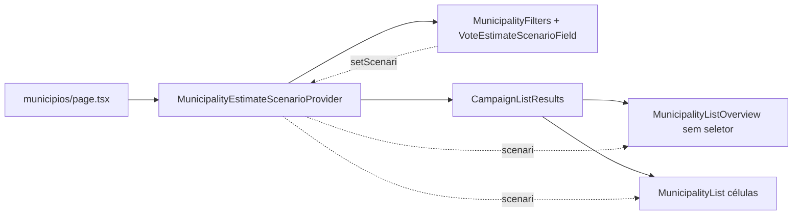

# Seletor de Cenário junto aos filtros de Municípios

Status: rascunho
Atualizado em: 2026-07-24
Item do roadmap: [docs/roadmap.md](../roadmap.md) (Fill-ins)
Impeccable: B — encaixe em `MunicipalityFilters` + `MunicipalityListOverview` (`/campanha/municipios`); sem rota nova
Appetite: ~0,25–0,5 dia eng; relocação de controle + ajuste do provider; sem migration
Responsável: —

## Design (Impeccable)

Âncoras: `PRODUCT.md` (princípios 2 — clareza sob pressão — e 8 — Feel the action) / `DESIGN.md` (register `product`; Field Desk) · tema `data-theme='campaign'` · shells `MunicipalityFilters`, `VoteEstimateScenarioField`, `MunicipalityEstimateScenarioProvider`.

Na implementação (`implement-roadmap-item`): craft compacto → critique → polish (só posição do controle; sem redesign da lista/overview).

Brief compacto:

- **Persona / contexto:** Assessor / CG monta o recorte de municípios (TI, tipo, prioridade…) e já quer escolher **qual cenário** lê na lista/overview no mesmo gesto — sem descer o olhar até o card de visão geral.
- **Job principal:** um único eixo de controles de leitura da lista: filtros de recorte + cenário de estimativa.
- **Estratégia de cor:** Restrained.
- **Edit where you see:** não — o seletor só troca leitura (estado local A10); mutação de estimativas permanece nos Popovers/forms existentes.
- **Anti-goals:** segundo seletor duplicado overview+filtros; meter Cenário na URL; redesign do layout de filtros; unificar com o seletor do mapa do Início neste item.

## Dados → decisão → apresentação

Dados: N/A — este item **não** muda métricas, agregação nem forma de apresentação; só relocação do controle de leitura já entregue em A10. Overview/lista continuam com número do cenário ativo + faixa secundária.

## Contexto

Em `/campanha/municipios` (staff), o seletor **Cenário** (`VoteEstimateScenarioField`) vive no header de `MunicipalityListOverview` — acima do `CampaignMetricStrip`, **abaixo** da barra de filtros (`MunicipalityFilters`: busca, TI, tipo, assessoria, tendência, prioridade). O estado é local via `MunicipalityEstimateScenarioProvider` (default `central`), sincronizando overview + células da lista; no Início o mapa tem seletor próprio quando Ano=2026.

A página hoje **embrulha o provider só em torno dos resultados**, de propósito — comentário em `municipios/page.tsx`: troca de cenário não deve re-renderizar os filtros. Pedido de produto (2026-07-24): o Cenário deve ficar **junto dos outros filtros** da página.

> **Nota 2026-07-24 (B16):** [filtros-no-header-lista-municipios.md](filtros-no-header-lista-municipios.md) relocaciona os selects de recorte (`region`/`kind`/…) para o header da tabela no desktop. O destino deste fill-in passa a ser a **barra slim** (busca + Limpar + Cenário), não a fileira completa atual — mesmo componente `MunicipalityFilters`, layout enxuto. Preferir aterrar Cenário **com ou depois** de B16 se ambos forem pegos na mesma janela.

Polish anterior (notebook 2026-07-23) já tinha movido o seletor do mapa → overview; este item completa o agrupamento mental “controles de recorte/leitura da lista”.

## Objetivos

- Staff em `/campanha/municipios`: seletor **Cenário** renderizado na mesma fileira/região de `MunicipalityFilters` (visível com `showStaffFilters`), reusando `VoteEstimateScenarioField`.
- Remover o seletor do header de `MunicipalityListOverview` (overview continua a reagir ao contexto: strip, labels, flash).
- Expandir o `MunicipalityEstimateScenarioProvider` para envolver **filtros + resultados** quando staff — o controle nos filtros precisa do contexto; um único provider por página.
- Cenário permanece **estado local** (não URL); **Limpar** continua zerando só query params / busca — não reseta cenário.
- Guardrails: sem migration, sem collection, sem Consent, sem server action; semântica A10 intacta; `leader` não vê o seletor (página já redireciona; `showStaffFilters` false).

## Decisões travadas

- **Fill-in com plano próprio (não reabrir A10; não absorver só em R6; não item de trilha B).** Relocação barata, paralelizável, cortável; A10 já entregue a semântica. (2026-07-24, classificação roadmap-item.) **Rejeitado:** fase informal de A10 (mistura entrega fechada com polish de layout); só R6 (atrasa quick win no critique largo); ID B novo (infla grafo por ~½ dia).
- **Provider envolve filtros + `CampaignListResults` (staff).** Necessário para o seletor viver em `MunicipalityFilters`. Custo: troca de cenário re-renderiza a árvore dos filtros — aceitável (controle local, sem navegação). **Rejeitado:** prop-drill `scenario`/`setScenario` sem provider; dois providers; manter seletor no overview _e_ nos filtros (duplicata).
- **Cenário continua fora da URL e fora de `buildMunicipalityFiltersKey` / Limpar.** Alinhado à decisão A10 (Ano/Escala locais; só `compare` na URL do mapa). **Rejeitado:** `?estimate=` neste item; Limpar resetar cenário (mistura recorte URL com lente de leitura).
- **Hint:** adaptar copy do overview (hoje `VOTE_ESTIMATE_SCENARIO_OVERVIEW_HINT`) para o contexto dos filtros (“Troca o total da visão geral e os votos na lista…”); mapa no Início permanece com o hint próprio. **Rejeitado:** remover o `CampaignInfoHint`.
- **i18n e naming** (AGENTS.md): identificadores existentes (`VoteEstimateScenarioField`, `MunicipalityEstimateScenarioProvider`); strings “Cenário” / Pessimista / Média / Otimista.

## Questões em aberto

- **Posição exata na fileira (antes ou depois dos selects de recorte)?** **Opções:** A) após Prioridade (fim dos staff filters, antes de Limpar) | B) logo após a busca | C) fileira própria abaixo. **Recomendação:** **A** — Cenário é lente de leitura do resultado, não critério de where; fica com os controles staff sem competir com busca/TI. _(assumido — validar no craft se a fileira quebrar em mobile)_
- **Mapa do Início: espelhar “Cenário nos filtros do dashboard”?** **Opções:** A) neste item | B) fora / R6 se critique pedir. **Recomendação:** **B** — pedido é a página de municípios; mapa já agrupa Cenário com Ano/Escala.

## Abordagem proposta

Componentes:

- **`MunicipalitiesPage`** (`src/app/(campaign)/campanha/(app)/municipios/page.tsx`): mover `MunicipalityEstimateScenarioProvider` para envolver `{filters}` + `{CampaignListResults…}` quando `isStaffView`; atualizar o comentário (provider deixa de ser “só results”).
- **`MunicipalityFilters`** (`src/components/campaign/MunicipalityFilters.tsx`): se `showStaffFilters`, renderizar `VoteEstimateScenarioField` na fileira (id estável, ex. `municipality-filter-estimate-scenario`); consumir `useMunicipalityEstimateScenario()` — só montar essa página staff com provider ao redor.
- **`MunicipalityListOverview`** (`src/components/campaign/MunicipalityListOverview.tsx`): remover o bloco do seletor no header; manter `useMunicipalityEstimateScenario`, strip, flash e métricas.
- **`VoteEstimateScenarioField`**: reusar; ajustar hint exportado se o texto ainda falar só de “visão geral” como locus do controle.
- **Migration**: Sem migration, sem collection, sem server action.

Depth check: reusa field + context + filters existentes; sem hook/shared shell novo (&lt;3 call sites de “filtro+cenário”).

## Dependências

- Nenhuma de outro plano aberto. Reusa A10 entregue (`voteEstimate`, `MunicipalityEstimateScenarioProvider`, `VoteEstimateScenarioField`) e o fill-in filtros-auto ([filtros-auto-pracas.md](filtros-auto-pracas.md)).

## Não escopo

- Seletor de Cenário no mapa do Início / `MunicipalityMapPanel` (permanece com Ano=2026) — R6 ou pedido futuro.
- Persistência de cenário em URL, cookie ou perfil.
- Mudança de agregação, default `central`, ou assimetria leader.
- Redesign do overview / metric strip / flash.
- Unificar `MunicipalityFilters` com filtros de outras listas.

## Rabbit holes

- **`?estimate=` na URL “só para share”.** Explode RSC/key de filtros e diverge do mapa. **Mitigação:** Decisão travada — estado local; gatilho só com pedido explícito de share de cenário.
- **Provider global de cenário em todo `/campanha`.** Acopla Início↔lista sem necessidade. **Mitigação:** provider só na página de municípios (como hoje, com escopo ampliado na página).
- **Tratar Cenário como filtro de where / incluir em Limpar.** Muda semântica A10. **Mitigação:** fora de `MunicipalityListState` e de `hasActiveFilters`.

## Adiado com gatilho

- **Mesma colocação mental no dashboard (mapa).** Revisitar quando: R6 critique o Início ou produto pedir “um só lugar para Cenário” entre mapa e lista.

## Referências

- `docs/roadmap.md` (Fill-ins abertos)
- `src/app/(campaign)/campanha/(app)/municipios/page.tsx` — composição filters / provider / results
- `src/components/campaign/MunicipalityFilters.tsx` — fileira de controles
- `src/components/campaign/MunicipalityListOverview.tsx` — seletor atual + flash
- `src/components/campaign/VoteEstimateScenarioField.tsx` — controle reutilizado
- `src/components/campaign/MunicipalityEstimateScenarioContext.tsx` — estado local
- [cenarios-estimativa-votos.md](cenarios-estimativa-votos.md) (A10) — semântica e default
- [filtros-auto-pracas.md](filtros-auto-pracas.md) — precedente de fill-in na mesma superfície
- AGENTS.md — naming; campaign staff vs leader
- `PRODUCT.md` / `DESIGN.md` — Field Desk, Feel the action
