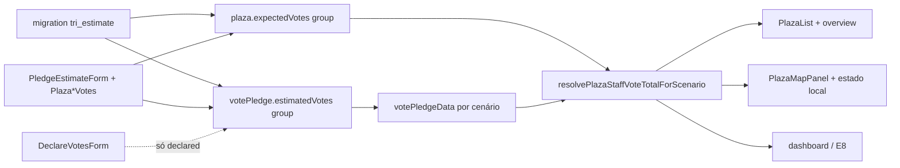

# Cenários de estimativa de votos (pessimista / média / otimista)

Status: entregue (2026-07-23)
Atualizado em: 2026-07-23 _(entrega A10 + polish overview/Cenário; capture-review-debts: no-op roadmap, gatilho flash)_
Item do roadmap: [docs/roadmap.md](../roadmap.md) (Trilha A, item A10)
Impeccable: B — encaixe em forms/lista/mapa/dashboard já existentes (sem rota nova)
Appetite: ~2 dias eng; migration (pledge + praça) + helpers de agregação + seletor de cenário nas superfícies staff
Responsável: —

## Design (Impeccable)

Âncoras: `PRODUCT.md` (princípios 3 Edit where you see, 4 Depth/simplicity, 5 Intelligence) / `DESIGN.md` (register `product`) · tema `data-theme='campaign'` · shells `PledgeEstimateForm`, `PlazaStrategyForm`, `PlazaList*Control`, `PlazaMapPanel`, `StaffPlazaVotesDisplay`.

Na implementação (`implement-roadmap-item`): craft compacto → critique → polish (três inputs + seletor; sem redesign de lista/mapa).

Brief compacto:

- **Persona / contexto:** Assessor calibra a faixa realista da liderança sob pressão de campo; Coordenador Geral lê a banda na reunião (chão vs. caso-base vs. teto).
- **Job principal:** gravar e ler **três estimativas staff** (pessimista / média / otimista) no pledge e no total da Praça, com a liderança continuando a declarar **um** número.
- **Estratégia de cor:** Restrained.
- **Edit where you see:** sim — Popover/lista e painel de pledges reusam actions existentes; mapa só troca cenário de leitura (não edita no mapa).
- **Anti-goals:** fundir com `voteGoals` (Bom/Regular/Mínimo); expor qualquer cenário à liderança; três choropleths simultâneos; planilha full-row com 3 colunas editáveis sempre montadas.

## Dados → decisão → apresentação

- **Vou apresentar dados?** Sim, superfície neste item (lista, detalhe, mapa 2026, dashboard) + aggregate para E8/E9.
- **Decisões desbloqueadas:**
  - Assessor: “esta liderança fecha o chão pessimista ou só o otimista?” → renegociar pledge / abrir demanda / aceitar risco.
  - Coordenador: “na banda média a conta da cadeira fecha? e no pessimista?” → alocar recurso da semana vs. aceitar déficit.
  - Staff no mapa: “onde o cenário médio (ou o chão) está fraco no footprint filtrado?” → priorizar visita/giro.
- **Forma escolhida:** (1) **três números + contexto** nos forms de edição; (2) **lista/tabela** com valor do cenário ativo + faixa secundária `pessimista–otimista` quando os três existem; (3) **mapa** com seletor de cenário (default média) reusando o padrão Ano/Escala do `PlazaMapPanel` — um choropleth por vez. **Rejeitado:** fan/range chart; três camadas de mapa ao mesmo tempo; gauge SaaS; fundir rótulos com metas Bom/Regular/Mínimo; % estadual absoluto.
- **Profile:** numérico absoluto (votos); granularidade liderança×praça e praça; ~1–N pledges por praça, 436 praças; absoluto (relativo entra em E8/B13).
- **Anti-goals de dado:** sem % estadual como KPI; sem confundir cenário de estimativa com meta de planejamento (`voteGoals`); sem mostrar estimativas a `leader`.

## Contexto

Hoje a assimetria da remodelagem é 1×1: liderança declara `declaredVotes`; assessor grava um `estimatedVotes` staff-only; total da Praça é um `expectedVotes` (A9) com fallback `expectedVotes ?? (estimatedVotes ?? declaredVotes)`. Feedback da coordenação geral (2026-07-23): **a estimativa do assessor na prática é uma faixa de três cenários** — pessimista, média e otimista — e o mesmo padrão vale para o total da Praça, a lista e o mapa. Só a liderança continua com um único valor declarado.

`voteGoals` (Bom / Regular / Mínimo) já é triplo, mas é **meta de planejamento**, não estimativa operacional — fundir os dois apagaria a distinção travada em A9/E1.

E8 (conta da cadeira) ainda não começou e planeja Σ `estimatedVotes ?? declaredVotes`; sem A10, E8 congela a semântica de um cenário só e força retrabalho.

## Objetivos

- Schema staff-only em `votePledge` e `plaza` com três números nullable (pessimista / média / otimista); `declaredVotes` permanece singular e leader-visible.
- Toda superfície staff que hoje lê/escreve estimativa única passa a três cenários (forms, lista, detalhe, mapa 2026, overview/dashboard).
- Agregação e fallback **por cenário**, independente: `expected[S] ?? Σ (estimated[S] ?? declared)`.
- Default de produto para superfícies de um número (mapa, KPI, cobertura futura): **média (`central`)**.
- `leader` nunca lê nenhum dos três (field access + view models) — assimetria da remodelagem intacta.
- Guardrails: **uma migration** (pledge + praça); sem Consent; sem collection nova; sem alterar `voteGoals`.

## Decisões travadas

- **Item A10 próprio (trilha A), não absorver em A9 entregue nem em E8.** Schema + semântica de agregação em N call sites são caros de reverter; E8 consome o resultado. (Pedido coordenação 2026-07-23 + classificação roadmap-item.) **Rejeitado:** “fase 2” informal de A9 sem ID; só UI fake com três inputs gravando o mesmo campo; empurrar para dentro de E8 (mistura meta com estimativa).
- **Três campos staff por superfície de estimativa; liderança declara um.** Identificadores: grupo `estimatedVotes` / `expectedVotes` com subcampos `pessimistic` | `central` | `optimistic`; labels pt-BR Pessimista / Média / Otimista. **Rejeitado:** reusar Bom/Regular/Mínimo (`voteGoals`); `low/mid/high` opacos na UI; expor faixa à liderança; `median` no código (implica mediana estatística).
- **Backfill na migration: escalar antigo → `central`; pessimista/otimista null.** Preserva o significado do número único já lançado. **Rejeitado:** copiar o mesmo valor nos três (inventa certeza); zerar tudo (apaga trabalho de campo).
- **Ordem quando os três estão preenchidos: pessimista ≤ central ≤ otimista** (mesmo espírito de `voteGoals` / `voteGoals.ts`). **Rejeitado:** sem invariante (quebra leitura da faixa); forçar os três sempre preenchidos na v1 (fria adoção).
- **Fallback por cenário:** `effective[S] = estimated[S] ?? declared`; total Praça `resolve[S] = expected[S] ?? Σ effective[S]`. Cenário ausente no pledge cai no declarado **daquele** pledge; Praça sem `expected[S]` usa só a soma daquele cenário. **Rejeitado:** “se falta pessimista, usar média” (mistura cenários); um único fallback compartilhado entre S.
- **Default de leitura = `central` (média); seletor de cenário no mapa (e lista/overview se couber) em estado local**, no mesmo padrão de Ano/Escala do `PlazaMapPanel`. **Rejeitado:** default otimista (infla a conta); três mapas lado a lado; só tooltip com faixa sem trocar o fill; `?estimate=` na v1 (Ano/Escala não usam URL — só `compare` usa).
- **Access:** inalterado — `canRead/ManageCampaignStaffField` nos grupos; leader redacted. **Rejeitado:** só coordinator escreve otimista.
- **i18n e naming:** `pessimistic` / `central` / `optimistic`, `VoteEstimateScenario`, `resolvePlazaStaffVoteTotalForScenario`, `aggregatePledgesByPlaza` passa a expor totais por cenário; strings “Pessimista” / “Média” / “Otimista”.

## Questões em aberto

- **Seletor de cenário na URL (`?estimate=central`) ou só estado local no cliente?** **Opções:** A) query param (shareable, SSR) | B) estado local | C) cookie. **Recomendação:** **B** no mapa (e lista/overview se houver seletor) — `PlazaMapPanel` já guarda **Ano** e **Escala** em `useState` local; só `compare` vai na URL. Espelhar esse padrão evita RSC round-trip e inconsistência com os outros seletores. Default = `central` sem persistência. _(assumido — validar com produto; A só se share de cenário virar pedido explícito)_ **Rejeitado nesta revisão:** A “porque espelha year/scale” — afirmação defasada (year/scale não são URL).
- **Partial fill: salvar só média?** **Opções:** A) sim, nullable independente | B) exigir os três. **Recomendação:** A — ordem só quando ≥2 preenchidos e comparáveis; UI sugere preencher a faixa. _(fechado)_
- **KPI do dashboard mostra um número ou a faixa?** **Opções:** A) só média + link | B) `pessimista–otimista` tipográfico | C) três KPIs. **Recomendação:** B (número médio + faixa secundária); C estoura density. _(fechado)_

## Abordagem proposta

Componentes:

- **`VotePledge` / `Plaza`** (`src/collections/VotePledge.ts`, `Plaza.ts`): substituir scalars por groups com três `number` min 0; access staff nos groups; hook de audit `estimatedAt`/`estimatedBy` quando qualquer subcampo muda; validação de ordem (reusar padrão de `src/utilities/voteGoals.ts` → helper fino `voteEstimate.ts` em `src/utilities/` ou `src/lib/` — só se ≥2 call sites).
- **Migration** `pnpm migrate:create add_vote_estimate_scenarios`: criar colunas do group (`estimated_votes_pessimistic|central|optimistic`, idem `expected_votes_*` no padrão de `vote_goals_*`); `UPDATE … SET …_central = estimated_votes` (e idem `expected_votes`); dropar scalars + índice antigo em `estimated_votes`; sem Consent.
- **`src/lib/schemas/votePledge.ts` / `plaza.ts`:** schemas Zod dos três; actions existentes `estimateVotes` / `setPlazaExpectedVotes` (+ form actions em `plazaStaffFormActions` / `pledgeFormActions`) passam a aceitar o trio (nullable).
- **`src/utilities/votePledgeData.ts`:** `PlazaPledgeAggregate` ganha `effectiveByScenario` + `declaredTotal`; `resolvePlazaStaffVoteTotal` / `rollupPlazaStaffVotes` com cenário (default `central`). Depth: **não** criar `VoteEstimateService` — estender o módulo profundo existente.
- **`plazaMapData.ts` + `PlazaMapPanel`:** bundle 2026 com valores por cenário (três maps no bundle — leitura local no seletor); seletor “Cenário” ao lado de Ano/Escala (**estado local**, como Ano/Escala); readout mostra valor do cenário + faixa se completa.
- **UI:** `PledgeEstimateForm` três inputs; `PlazaStrategyForm` / `PlazaListExpectedVotesControl` trio (Popover pode empilhar 3 campos); `StaffPlazaVotesDisplay` / `PlazaPledgesPanel` / `PlazaList` leem cenário ativo (default central) + faixa; `DeclareVotesForm` intacto.
- **Testes:** int assimetria (leader não vê nenhum dos três) em `campaignVotePledge.int.spec.ts`; unit ordem + fallback por cenário; int/unit backfill semântico → central; mapa/lista usam default central.
- **Depth check:** reusar `plazaStaffFormActions`, `campaignAccess`, shells B9; espelhar invariante de `voteGoals.ts` em helper fino compartilhado só se ≥2 call sites.

## Dependências

- **Dura:** R2 / A9 (schema e superfícies de estimativa) — código entregue; deploy da remodelagem deve estar aplicado antes de dados reais.
- **Dependentes (atualizar):** **E8** passa a depender de A10 (cobertura usa cenário, default média); **C12** suave (versions capturam o group); E9/B13 via E8.
- **Reusa:** `votePledgeData.ts`, `plazaMapData.ts`, `plazaStaffFormActions.ts`, `voteGoals.ts` (padrão de ordem), `PledgeEstimateForm`, `PlazaMapPanel`.

## Não escopo

- Conta da cadeira / cobertura ÷ meta → [E8](conta-da-cadeira.md).
- Versions/trajetória de pledge → [C12](registro-fundacao.md).
- Escala relativa do mapa (quantis/LQ) → [B13](escala-relativa-mapa.md).
- Alterar `voteGoals` ou fundir labels; previsão estatística; import CSV de faixas.
- Expor estimativas à liderança; auto-preencher faixa a partir do declarado.

## Já resolvido no simplify/critique (não reabrir)

- Overview: label por cenário ativo (`Média nas Praças filtradas`), endpoints `Pessimista · Otimista`, `VoteEstimateScenarioStrip`, `sem estimativa` sob o hero; sync via `PlazaEstimateScenarioProvider`.
- Cenário: seletor no overview; no mapa só com Ano=2026; disclaimer inline → `CampaignInfoHint` (`?` Popover); flash + `aria-live` no overview ao trocar.
- Cleanup `/simplify`: dropar `staffVoteRange` / `staffVoteTotal` mortos nos DTOs overview/dashboard; `formatElectionNumber`; context sem `useCallback` extra.

## Explicitamente fora (capture-review-debts 2026-07-23)

- Simplify amplo do restante A10 (forms/pledges/migration) sem dor concreta — sem `escala-dry-pos-a10`.
- Trocar `CampaignInfoHint` por `FieldDescription` — affordance errado (hint dismissível vs ajuda estática).
- Remover `rollup.staffVoteTotal` — ainda usado por testes/API do rollup.

## Rabbit holes

- **Fundir com Bom/Regular/Mínimo.** Se alguém “aproveitar o group que já existe”: apaga meta×estimativa. **Mitigação:** labels e identificadores distintos; teste que `voteGoals` não é lido pelo resolver de estimativa.
- **Três choropleths / chart de incerteza.** Explode UX e appetite. **Mitigação:** um seletor, um fill; faixa só no readout/lista.
- **Exigir os três sempre + workflow de “confirmar faixa”.** Volta ao sugerir→confirmar rejeitado na remodelagem. **Mitigação:** nullable + ordem condicional.
- **Service layer / event sourcing da faixa.** **Mitigação:** group + helpers em `votePledgeData`.

## Adiado com gatilho

- **Nota por cenário** (hoje uma `estimateNote`). Revisitar se assessores pedirem justificar só o pessimista vs. o otimista.
- **Aviso soft vs `voteGoals.minimum` no cenário pessimista.** Revisitar após E8 com totais preenchidos (mesmo gatilho de A9).
- **Delta semanal por cenário.** Revisitar com C12 (versions no group).
- **Abstração compartilhada de flash/pending client-side** (hoje local em `PlazaListOverview`). Revisitar quando houver o **2º** flash client-side em `/campanha` (não URL/`useTransition`).

## Referências

- Critiques: [overview](../../.impeccable/critique/2026-07-23T21-29-20Z__src-components-campaign-plazalistoverview-tsx.md), [Cenário](../../.impeccable/critique/2026-07-23T21-52-39Z__src-components-campaign-plazamappanel-tsx-cenario.md)
- `docs/roadmap.md` (Trilha A / A10 → E8)
- `docs/plans/estimativa-votos-praca.md` — A9 (scalar a evoluir)
- `docs/plans/remodelagem-pracas.md` — assimetria declared×estimated
- `docs/plans/conta-da-cadeira.md` — consumidor E8 (atualizar dep)
- `src/collections/VotePledge.ts`, `src/collections/Plaza.ts`
- `src/utilities/votePledgeData.ts`, `src/utilities/plazaMapData.ts`, `src/utilities/voteGoals.ts`
- `src/components/campaign/PledgeEstimateForm.tsx`, `PlazaListExpectedVotesControl.tsx`, `PlazaMapPanel.tsx`, `DeclareVotesForm.tsx`
- AGENTS.md — staff-only estimates, naming, migrations, overrideAccess
- `PRODUCT.md` / `DESIGN.md` — Field Desk; princípio 5 (métricas locais)
- Feedback coordenação geral 2026-07-23 (áudio em `docs/general-coordinator-interview/` / `CUSTOMER.md` Interview Snapshot)
- Revisão auditoria 2026-07-23: path `voteGoals` corrigido; seletor de cenário → estado local (Ano/Escala não são URL); actions reais = `estimateVotes` / `setPlazaExpectedVotes`.
