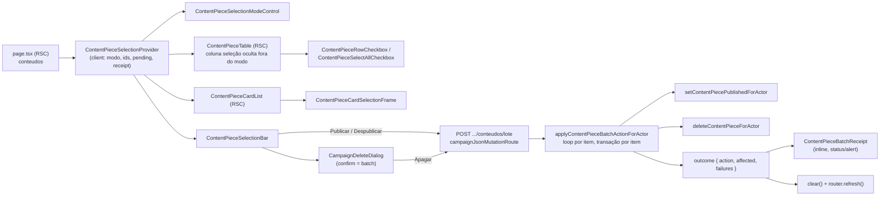

# Impl: C236 — Central de Conteúdos — publicar, despublicar e apagar em lote

Status: aprovado (executado; entrega bloqueada aguardando sign-off do design DEGRADED)
Atualizado em: 2026-09-29
Issue: #1388
Intenção: docs/plans/central-conteudos-acoes-em-lote.md
Appetite restante: herdado (~1–1,5 dia eng) — o corte de produto (seleção só da página visível, sem job, sem agendamento, sem edição de campos) mantém o escopo dentro do appetite.

## Leitura da intenção

- **Outcome:** a assessoria seleciona várias peças **da página visível** na lista da Central (`/campanha/comunicacao/conteudos`) e aplica o **mesmo veredito unitário** — `Publicar`, `Despublicar` ou `Apagar` — num gesto, com recibo honesto (afetadas × falhas) e a lista refletindo o desfecho; a seleção morre ao trocar de página/filtro e pós-ação.
- **O que NÃO negociar:** o lote é o gesto unitário repetido, sem regra nova — elegibilidade `processando`/`falhou` incluída; `Publicar`/`Despublicar` agem sem confirmação (reversíveis) e `Apagar` sempre confirma avisando links públicos quando há publicadas; falha parcial é honesta e não reverte as demais; audiência `communicator|coordinator|candidate` (`advisor`/`leader` negados, fail-closed), sem papel novo; sem rota pública nova (S27), sem mudar a semântica do C222 (slug canônico/`publishedAt`/arquivo preservados no despublicar, mídia privada best-effort, `ContentEvent` nunca limpo); nenhum `Consent` novo.
- **O que reavaliar (hipóteses da intenção confirmadas no código):** o `CampaignTable` é server e não tem API de seleção (`CampaignTable.tsx:27-63,155-224`) — a seleção entra por ilha client, não por mudança de shell; a lista é renderizada 2× por breakpoint (card/tabela) — um único estado compartilhado via provider; a ação unitária já concentra semântica e transação (reuso literal, não reinterpretação).

## Abordagem recomendada

**Opções consideradas:** A | B | C
**Recomendação:** **B** — uma rota única `POST .../conteudos/lote` que itera server-side reusando as ações unitárias, cada item na própria transação, e devolve um recibo estruturado. Reuso literal da semântica (slug/`publishedAt`/arquivo/mídia/tag), teto de lote fixado em schema (max 50, precedente `contentPieceStatusRequestSchema`), recibo e falha parcial testáveis no int, transporte único pelo wrapper `campaignJsonMutationRoute`.
**Rejeitadas:** **A** (cliente dispara N fetches unitários) porque espalha no cliente o laço, o recibo e a agregação de falhas, faz N round-trips e não fixa o teto do conjunto em nenhum contrato; **C** (transação única do lote) porque a intenção fixa falha parcial honesta — uma falha não pode reverter as demais —, prolongaria a transação e mudaria a semântica pós-commit da mídia privada.

### Decisões de engenharia (caras de reverter)

#### 1. Transporte do lote

**Opções:** A) o cliente dispara N fetches às rotas unitárias existentes | B) rota nova única `POST .../conteudos/lote` com `{ action, contentPieceIds }` iterando server-side o reuso das ações unitárias | C) transação única para o lote.
**Recomendação:** **B** — a rota entra por `campaignJsonMutationRoute` (guard de convenção em `tests/unit/codebaseConventions.unit.spec.ts:251`), o schema fixa o teto (`.min(1).max(50)`), e a action `applyContentPieceBatchActionForActor` chama `setContentPiecePublishedForActor` / `deleteContentPieceForActor` **uma vez por id** — cada chamada mantém sua própria transação (`withPayloadTransaction`), o gate fresco e a limpeza de mídia pós-commit (`contentPieces.ts:163-189,239-278`). O recibo (`affected` + `failures[]`) nasce no domínio e é testável no int; o cliente só traduz para os literais do design.
**Alternativas rejeitadas:** A porque duplica no cliente o laço/agregação, multiplica round-trips (até 25) e não tem contrato de teto nem recibo de domínio; C porque contraria a decisão de produto de falha parcial honesta, cria transação longa e conflita com o `onPayloadTransactionCommit` da mídia por item.
**Detalhe de execução:** o loop é sequencial (determinístico, gentil com o banco; 25 itens máx. da página). Se a latência do lote doer (medida no e2e), o gatilho de revisitação é paralelizar com `Promise.allSettled` mantendo o mesmo outcome — barato e local.

#### 2. Estado de seleção compartilhado (tabela + card list)

**Opções:** A) um client provider via `children` (RSC preservado), com estado de ids, modo, pending e recibo, resetado por `key` da URL canônica da lista | B) Context API com row registry (cada linha registra/desregistra no provider) | C) estado no servidor via URL (`?sel=1,2,3`).
**Recomendação:** **A** — `ContentPieceSelectionProvider` (client) recebe uma projeção serializável das rows (`{ id, status, publicPath }`) e envolve os dois corpos renderizados pela RSC (`ContentPieceCardList` e `ContentPieceTable`), que continuam server; as ilhas de checkbox consomem o contexto. O provider é chaveado pela URL canônica da lista (`buildContentPieceListHref(data.state, data.state.page)`), então trocar página/filtro **remonta** e zera seleção, modo e recibo. Pós-ação, o provider chama `clear()` e `router.refresh()`. O poll de status (`ContentPieceStatusRefresher.tsx:48`) refresca sem mudar a key — a seleção sobrevive a uma renovação de status, que é o comportamento correto (os ids seguem válidos).
**Alternativas rejeitadas:** B porque é maquinaria de sincronização sem necessidade (as rows já chegam como prop) e dificulta "selecionar todas" e o aviso de publicadas; C porque contraria "a seleção morre ao navegar", polui o contrato da URL canônica com ordenação/limites e transforma cada checkbox numa navegação com re-render do servidor.

#### 3. Coluna de seleção no `CampaignTable` server

**Opções:** A) coluna definida sempre em `columns` com `mandatory: true`, head/cell como ilhas client que leem o contexto, e a coluna nascendo oculta por CSS (`data-selection-mode` no root do provider + variantes `group-data-[selection-mode=true]:table-cell`); a lista do column picker **não** ganha a coluna | B) checkbox permanente, sem modo | C) dar API de seleção ao `CampaignTable` (ou torná-lo client).
**Recomendação:** **A** — o shell da tabela não muda (`CampaignTable.tsx` segue server e data-driven); `mandatory: true` protege contra cookie antigo (`campaignColumnVisibility.ts:184-192`) e a coluna não entra no picker em `page.tsx:60-66` porque é chrome do modo de seleção, não dado. O tint da linha selecionada usa `rowClassName: 'has-[[data-selection-state=selected]]:bg-primary/5'` (o `has-[...]` já é usado em `ui/Table.tsx:57,67` e `ui/field.tsx`), e a ilha marca `data-selection-state` no seu root.
**Alternativas rejeitadas:** B porque contraria o design aprovado (repouso sem ruído) e a questão de produto A da intenção; C porque acopla um concern de uma superfície ao sistema de tabela compartilhado — a seleção é local da Central, não do shell (depth errado).

#### 4. Barra de ações e confirmação de apagar

**Opções:** A) barra client dentro do provider (`sticky bottom-4 z-20`, classes do artefato) e confirmação reusando `CampaignDeleteDialog` estendido de forma **aditiva** com um caminho `onConfirm`/`onSuccess` (union: `endpoint` XOR `onConfirm`) | B) criar um `ContentPieceBatchDeleteDialog` irmão, duplicando o chrome | C) montar o `AlertDialog` inline na barra.
**Recomendação:** **A** — a barra é a única dona do gesto (contagem, botões, pending, recibo) e o diálogo continua com **um só dono de chrome/estado** (`CampaignDeleteDialog.tsx:54-127`: ícone circular destrutivo, rodapé `muted/50`, `Cancelar` outline, `Apagar` vermelho cheio, erro dentro do diálogo, spinner/disabled). A extensão não toca os 3 call sites atuais (cut, recording, peça): `onConfirm: () => Promise<{ ok: true } | { ok: false; message: string }>` e `onSuccess?: () => void`; no caminho novo, o machine chama `onConfirm()` em vez do DELETE por endpoint e, no sucesso, mantém o `router.refresh()` e chama `onSuccess`. A barra computa título/descrição: `1` selecionada reusa o C222 (`Apagar esta peça?` + link nomeado quando publicado); `N > 1` usa `Apagar N peças selecionadas?` com o aviso de publicadas × só "não pode ser desfeita".
**Alternativas rejeitadas:** B porque duplica um machine extraído justamente para não ter a 4ª cópia (C183→C199→C222); C porque recopia chrome, submitting/erro/disabled que o machine já owns.

#### 5. Recibo e estado de erro

**Opções:** A) banner inline no topo da lista (ilha client no provider; `role="status"`/`aria-live` no sucesso, `role="alert"` na falha parcial) | B) toast sonner (`useCampaignFormSuccessToast`, layout `(campaign)/layout.tsx:52`) | C) mensagem dentro da barra.
**Recomendação:** **A** — o design do gate (cena 5) fixa o recibo inline no topo da lista, nunca sobre ela; o precedente sonner é de form action, não de lista, e um `role="alert"` de falha parcial precisa ficar no contexto da lista, não num canto transitório. Sucesso some sozinho (~6 s) ou no X; falha parcial/erro fica até fechar ou até a próxima ação. Os literais saem de um builder puro (singular/plural seguindo `TourComposerForm.tsx:180` e o literal do plano): `3 peças publicadas`, `1 peça despublicada`, `2 de 3 peças apagadas. 1 falhou.`; a UI não renderiza mensagem por peça (fora do design), mas o outcome carrega `failures[]` para teste e diagnóstico. Erro de rota no `Publicar`/`Despublicar` vira banner de erro e **mantém** a seleção (nada mudou); no `Apagar` o erro fica dentro do diálogo (como no C222).
**Alternativas rejeitadas:** B porque o design fixa o recibo inline e o toast some sozinho — a falha parcial não pode ser silenciosa; C porque a barra sai de cena quando a seleção zera e o recibo precisa sobreviver à limpeza da seleção.

#### 6. Migração, access e Consent

**Opções:** A) sem migration, reusando access existente e o gate fresco por ação | B) migration nova | C) mecanismo de consentimento/auditoria novo.
**Recomendação:** **A** — nenhuma coleção/campo muda (o lote só chama ações existentes), nenhuma `Consent` nova, nenhuma role nova. `applyContentPieceBatchActionForActor` repete o gate fresco (`canReadCommunicationCatalog`) **antes** do loop — role/auth negados falham a requisição inteira (400/401), não viram falha parcial — e cada item reusa a ação que re-checa o gate e termina na collection access (`canUpdateContentPiece`/`canDeleteContentPiece`, `utilities/access/contentPieces.ts:40-58`) como barreira final.
**Alternativas rejeitadas:** B por desnecessária (nenhum schema); C por sair do escopo e do invariante "nada de Consent novo".

### Componentes / mudanças

- **`ContentPieceSelectionProvider`** (`src/components/campaign/content/ContentPieceSelectionProvider.tsx`, novo): contexto client com `selectionMode`, `selectedIds` (`number[]` + `Set` memoizado, precedente `TourComposerForm.tsx:137-141`), `pendingAction`, `receipt`; ações `enter/exit/toggle/toggleAll/clear/applyBatch`; `resetKey` por `key`; transporta o lote com `postCampaignJson` (`lib/campaignJsonRequest.ts:12-26`) e orquestra `clear()` + `router.refresh()`.
- **`ContentPieceSelectionControls`** (`.../ContentPieceSelectionControls.tsx`, novo): ilhas `ContentPieceSelectionModeControl` (botão `Selecionar` × badge `Modo de seleção` + `Cancelar seleção`), `ContentPieceRowCheckbox` (tabela, com `data-selection-state`), `ContentPieceSelectAllCheckbox` (`indeterminate`), `ContentPieceCardSelectionFrame` (envelope client do card mobile com checkbox 44 px + `ring-1 ring-primary/25`; corpo do card continua RSC via `children`).
- **`ContentPieceSelectionBar`** (`.../ContentPieceSelectionBar.tsx`, novo): barra com `N selecionada(s)`, `Publicar`/`Despublicar`/`Apagar`, pending (`aria-busy`), consumindo o provider; monta o `CampaignDeleteDialog` do batch.
- **`ContentPieceBatchReceipt`** (`.../ContentPieceBatchReceipt.tsx`, novo): banner inline do recibo (cena 5 do artefato).
- **`CampaignDeleteDialog`** (`src/components/campaign/shared/CampaignDeleteDialog.tsx`): extensão aditiva do union `endpoint` XOR `onConfirm` + `onSuccess` (decisão 4); call sites atuais intocados.
- **`ContentPieceTable`** (`src/components/campaign/content/ContentPieceTable.tsx`): coluna `selection` `mandatory` com head/cell ilhas, CSS de modo, `rowClassName` de tint; nenhuma mudança no `CampaignTable`.
- **`ContentPieceCardList`** (`src/components/campaign/content/ContentPieceCardList.tsx`): card envolvido pelo frame client de seleção (sem mudar o conteúdo RSC).
- **`page.tsx`** (`src/app/(campaign)/campanha/(app)/comunicacao/conteudos/page.tsx`): provider em volta dos dois corpos + mode control + recibo + barra; projeção `selectionRows` e `resetKey` calculados da `data.state`; coluna `selection` fora do `toCampaignColumnPickerColumns`.
- **`contentPieceBatch`** (`src/lib/contentPieceBatch.ts`, novo): vocabulário `publicar|despublicar|apagar`, labels e builder puro do recibo (singular/plural/parcial).
- **Schema** (`src/lib/schemas/contentPiece.ts`): `contentPieceBatchRequestSchema` (`action` enum + `contentPieceIds` `.min(1).max(50)`, precedente `:133-135`).
- **Action** (`src/app/(campaign)/campanha/actions/contentPieces.ts`): `applyContentPieceBatchActionForActor` com gate fresco, loop sequencial, `mapCampaignFormActionError` + `CONTENT_PIECE_SAFE_MESSAGES` para mascarar falha por item.
- **Rota** (`src/app/(campaign)/campanha/(app)/comunicacao/conteudos/lote/route.ts`, novo): `POST = campaignJsonMutationRoute(...)` devolvendo `{ status: 'success', outcome }`; convive com `[id]` como `enviar`/`status`/`link` já convivem. Sem rota DELETE nova.
- **Contratos/wire** (`.../conteudos/types.ts`): `ContentPieceBatchResponse`/`ContentPieceBatchOutcome`/`ContentPieceBatchFailure`; **paths** (`src/lib/campaignPaths.ts`): `CAMPAIGN_CONTENT_PIECE_BATCH_HREF`.
- **Migration:** N/A — nenhuma coleção/campo/índice muda; nenhuma migration criada (skill `payload-migrations` não é acionada).
- **Access / Consent:** sem mudança de access; sem `Consent` novo; fail-closed preservado.
- **UI:** Impeccable **B** — encaixe na lista existente. Port **classe-a-classe** do artefato DEGRADED `docs/plans/central-conteudos-acoes-em-lote-ui-design.html`; shells reusados: `CampaignPageShell`, `CampaignListPendingBoundary/Results`, `CampaignListFooter`, `CampaignTable`/`CampaignTableHead`, `AlertDialog`, `Button`, `Checkbox`, `Spinner`, badges. Classes-chave a preservar: barra `bar-shadow flex items-center justify-between gap-4 rounded-xl border border-border bg-card px-3 py-2.5` (mobile `p-3` com `grid grid-cols-3 gap-2`); contador `text-sm font-medium tabular-nums`; `Publicar` `bg-primary text-primary-foreground`, `Despublicar` outline `hover:bg-muted`, `Apagar` `bg-destructive/10 text-destructive hover:bg-destructive/20`; checkbox `size-4 rounded-[4px]` com hit-area e alvo `size-9` (tabela)/`size-11` (card); linha `bg-primary/5`; card `ring-1 ring-primary/25`; badge do modo `bg-primary/10 text-primary`; recibos `rounded-lg border` com check verde só no ícone e `border-destructive/40` na falha; `min-h-11` em todo alvo; `motion-reduce:animate-none` no spinner. **Sign-off humano obrigatório no PR** (design DEGRADED).
- **Testes:** int em `tests/int/contentPiece.int.spec.ts` (novo describe de lote), unit novos `tests/unit/contentPieceBatchReceipt.unit.spec.ts` e `tests/unit/contentPieceSelection.unit.spec.tsx` (template `contentPieceDeleteDialog.unit.spec.tsx`: mock de `next/navigation` + fetch), e2e no describe de content pieces de `tests/e2e/campaignSpeechAcervo.e2e.spec.ts`.

### Dados → forma (se aplicável)

- **Não se aplica** — a intenção fixa "não apresento dados": nenhum painel, métrica, dashboard ou telemetria. A forma do recibo (banner inline com contagens do outcome) é a da cena 5 do design; o número é o resultado da própria ação, não leitura agregada nova.

## Fases verificáveis

1. **Tracer / server (schema → action → rota)** — quota ~0,5 dia. `contentPieceBatchRequestSchema` + `contentPieceBatch` (builder do recibo) + `applyContentPieceBatchActionForActor` + `lote/route.ts` + `CAMPAIGN_CONTENT_PIECE_BATCH_HREF` + tipos do wire; int cobrindo matriz de papéis (communicator/coordinator/candidate/admin × advisor/leader), publicar/despublicar em lote preservando slug/`publishedAt`/arquivo, apagar em lote derrubando mídia (best-effort) e mantendo `ContentEvent`, falha parcial honesta (`affected` + `failures` com `NOT_FOUND`), teto/limite do schema e bust da tag `contentPieces`; e2e de rota (HTTP) com sucesso, falha parcial e negado.
2. **UI** — quota ~0,5–0,75 dia. Provider + mode control + ilhas de checkbox (tabela e card) + coluna `mandatory` com CSS de modo + tint + barra + extensão aditiva do `CampaignDeleteDialog` + recibo; unit de seleção (modo, contagem `1 selecionada`/`N selecionadas`, POST com `{ action, contentPieceIds }`, limpeza pós-ação, recibo de sucesso e parcial, diálogo plural/singular com aviso de publicadas, erro de rota mantendo seleção) e unit do builder do recibo; port classe-a-classe revisado contra o artefato.
3. **Gates** — `pnpm gate:fast`; push via `pnpm push` (o CI PR roda o cascade curado; o deploy roda a suíte full). Sign-off humano do design DEGRADED no PR.

## Rabbit holes / Não escopo (engenharia)

- Seleção cross-page/"todos os filtrados", dedupe, contagem global — corte explícito da intenção (só a página visível; 25).
- Seleção persistente em `localStorage`/cookie ou modo de seleção sobrevivendo à navegação — a key da URL zera tudo de propósito.
- Marcar as peças que falharam como "retry da seleção", progresso por item, fila/retomada/cancelamento — o recibo é uma frase, não um painel.
- Toast e banner ao mesmo tempo; auditoria/telemetria de quem agiu; undo/lixeira.
- Otimismo nas rows (atualizar a linha antes do refresh) — o refresh do RSC é a verdade; o estado de envio cobre o feedback.
- "Selecionar todas" também no card list mobile (o design não mostra; a barra mobile não ganha header de seleção).
- Adicionar API de seleção ao `CampaignTable` ou converter a tabela em client — o shell fica intocado.
- Migrations ("já que mexe na lista, ajusta X"), novos campos em `contentPiece`, `Consent` novo, mudar o gesto unitário (slug/`publishedAt`/arquivo/mídia/`ContentEvent`) ou as rotas públicas S27.
- Editar `docs/plans/central-conteudos-acoes-em-lote.md` (intenção) ou o design HTML.
- **Adiado com gatilho (triage /simplify):** a frase singular de apagar ("O link público `<path>` deixa de funcionar… Esta ação não pode ser desfeita.") é paralela entre a barra de lote e o `ContentPieceDeleteDialog` (C222) — o dono único da copy sai quando houver um 3º call site ou quando a copy/design do aviso mudar (DRY de 2 sites não vira item).
- **Explicitamente fora (triage /simplify):** sombra da barra como valor arbitrário (port classe-a-classe do `bar-shadow` do artefato; tokenização só se a regra do DESIGN.md §7 for aprovada no sign-off do PR); ids obsoletos no estado do provider (filtrados por `visibleSelectedIds` em todo consumidor); esconder o entry "Selecionar" com lista vazia já resolvido (`page.tsx` condiciona a `data.rows.length > 0`).

## Riscos e mitigação

- **Estado client sobrevive a refresh/navegação** — a key do provider é a URL canônica da lista (`page`+filtros): navegação remonta e zera; o refresh pós-ação/poll não muda a key (seleção pós-ação é limpa por `clear()`; renovação de status preserva os ids válidos). Risco residual: o poll renovar rows durante a seleção — aceitável e coberto por testar que a seleção sobrevive ao refresh de mesma key.
- **Dois corpos (tabela + card) com um estado** — provider único envolvendo os dois; cada corpo renderiza sua ilha; teste unitário garante que marcar no card reflete na barra e no select-all (e vice-versa) — na prática o mesmo contexto.
- **`CampaignTable` server sem API de seleção** — coluna estática + CSS `data-selection-mode` + ilhas; `mandatory` contra cookie; `ui/Table` já remove `pr-0` quando há `role=checkbox`. Se um dia o shell ganhar seleção nativa, revisitar (barato).
- **Falha parcial silenciosa** — o outcome sempre separa `affected` de `failures` e o recibo nunca diz "N apagadas" com falha; o literal parcial é o do plano (`2 de 3 peças apagadas. 1 falhou.`); `role="alert"` na parcial.
- **Mídia privada best-effort / `ContentEvent` intocado** — o lote não toca nesses caminhos: reusa `deleteContentPieceForActor` (transação + `onPayloadTransactionCommit` + `overrideAccess` intencional só da mídia) e não faz nenhuma escrita em `contentEvent`.
- **Latência de até 25 itens em loop sequencial** — aceitável para um gesto de mesa com teto da página; gatilho de revisitação: se o e2e/int acusar latência, paralelizar com `Promise.allSettled` mantendo o outcome.
- **Convenção de rotas** — POST novo usa `campaignJsonMutationRoute` (guard `codebaseConventions:251`); nenhuma rota DELETE nova (guard `:271` fica satisfeito por não existir).
- **Sessão/role expirada no meio do lote** — gate e auth são checados antes do loop; negado vira 400/401 inteiro, não falha parcial disfarçada.
- **Dupla renderização a11y** — o corpo oculto por breakpoint sai da árvore de acessibilidade (`display:none`); labels dos checkboxes incluem o título da peça (`Selecionar <título>`), select-all `Selecionar todas as peças desta página`.

## Aceite de engenharia

- [ ] Aceite de produto da intenção ainda coberto: seleção por página nos dois corpos; barra só com seleção; `Publicar`/`Despublicar` sem confirmação e `Apagar` sempre confirmando (com aviso de publicadas); recibo com afetadas × falhas e sem sucesso parcial silencioso; elegibilidade idêntica ao unitário; seleção morre em página/filtro e pós-ação; audiência `communicator|coordinator|candidate` fail-closed; nada de rota pública.
- [ ] Invariantes AGENTS/engineering-standards: Local API sempre com `user` + `overrideAccess: false` (herdado das ações reusadas); escritas multi-collection transacionais com `req` (herdado); copy pt-BR / identificadores em inglês; sem `Consent` novo; sem tocar S27; sem editar migration existente nem criar migration (N/A); "edite o dono, não crie o gêmeo" (diálogo e shells reusados).
- [ ] Testes de domínio previstos (unit/int) onde access/write paths mudam: int do lote (papéis, transações por item, mídia, `ContentEvent`, tag, falha parcial, schema), unit da barra/seleção (transporte, limpeza, recibos, diálogo) e unit do builder puro; e2e de rota no arquivo existente.
- [ ] Gates: `pnpm gate:fast` verde; push via `pnpm push`; sign-off humano do design DEGRADED registrado no PR.

## Self-score (decision-quality, gate ≥4)

**5/5** — (1) decisões caras com Opções A|B|C e rejeitadas explícitas (transporte, estado, coluna, barra/diálogo, recibo, migration/access); (2) cabe no appetite herdado (~1–1,5 dia; server ~0,5, UI ~0,5–0,75, sem rabbit hole); (3) rabbit holes de engenharia nomeados (cross-page, persistência, progresso, toast duplo, API de seleção no shell); (4) depth check: reusa `CampaignDeleteDialog`, `CampaignTable`, `Checkbox`, `postCampaignJson`, `campaignJsonMutationRoute`, `withPayloadTransaction`/ações donas, `CampaignListResults` e o builder puro centraliza o recibo; (5) outcome da intenção intocado — nenhuma semântica unitária, access ou rota pública mudou.

## Crítica de design (trigger c, 2026-09-29)

**Veredito: DEGRADED — não certificado.** O designer frontier (`openai/gpt-5.6-sol`) rodou a crítica contra o app renderizado (screenshots 390/1280 em `docs/plans/central-conteudos-acoes-em-lote-ui-critique/`), mas não certifica: o artefato de origem é DEGRADED e exige sign-off humano. Ajustes do designer:

1. **FAB × barra (trigger b, aplicado):** `ContentPieceSelectionBar` → `sticky bottom-32 z-20 mt-4 md:bottom-4 md:mr-16` (no mobile a barra sobe acima do `CampaignQuickActionsFab`; no desktop recua à direita).
2. **Reserva de rolagem (aplicado):** `CampaignListResults` da lista ganha `group-data-[selection-mode=true]:pb-64 md:group-data-[selection-mode=true]:pb-28` — durante a seleção a barra não oculta o foco/último item.
3. **Diálogo translúcido/overlay (deferido ao sign-off):** tocar `AlertDialog` (overlay `bg-black/10` + blur, `max-w-xs` mobile, `leading` da descrição) muda o chrome de **todas** as superfícies do app (corte, gravação, C222) — decisão humana, registrada no comentário da Issue.
4. **Largura do diálogo de lote (aplicado, escopado):** novo `contentClassName` aditivo no `CampaignDeleteDialog`; a barra passa `max-w-sm` (358px em 390) sem tocar os call sites existentes.
5. **Clamp de títulos (aplicado):** `line-clamp-2 break-words` no título da tabela e do card.
6. **Recibo a11y (aplicado):** sucesso com `aria-live="polite" aria-atomic="true"`; fechar com `focus-visible:ring-3 focus-visible:ring-ring/50`.
7. **Semântica aprovada preservada:** rascunhos sem aviso de links; seleção com publicadas com o aviso — inalterado.

**Estado da entrega:** implementação, testes (int/unit/e2e) e `pnpm gate:fast` verdes. Com `--auto` não há humano para o sign-off, então o fluxo **não abre PR**: Issue comentada e flipada para `blocked`. A proposta de evolução do `DESIGN.md` §7 (modo de seleção de lista) continua proposta, dependente do sign-off.
