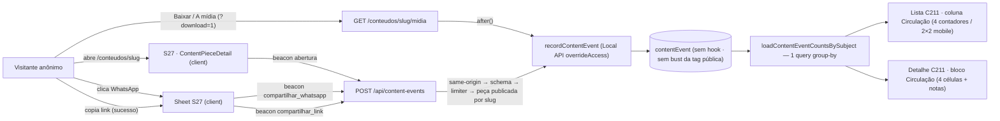

# Impl: C213 — Analytics da Central de Conteúdos — uso, downloads e compartilhamentos

Status: aprovado (--auto)
Atualizado em: 2026-09-23
Issue: #1258
Intenção: docs/plans/central-conteudos-analytics.md
Design UI (gate): docs/plans/central-conteudos-analytics-ui-design.html
Appetite restante: herdado (~1–1,5 dia eng). Corte explícito para caber: só acumulado desde a publicação (sem janela/retenção), uma query de agregação por página, nenhuma superfície nova além da coluna "Circulação" + bloco no detalhe. Fases: server/schema ~55%, UI ~30%, gates ~15%.

## Leitura da intenção

- **Outcome:** a lista interna de peças do C211 (e o detalhe) mostra, por peça, quatro contadores absolutos — Aberturas · Downloads · WhatsApp · Link — anônimos e agregados; a assessoria decide o que reforçar/reeditar e a coordenação decide se a Central vale o esforço lendo a própria lista, sem ferramenta nova.
- **O que NÃO negociar:**
  - **Anonimato fail-closed:** sem IP persistido, sem cookie/identidade, sem user-agent, sem rastreio entre páginas/peças; nenhum `Consent` novo (não há PII a consentir); nada de visitante único.
  - **Contadores separados, lado a lado:** sem total "usos", sem %, sem série, sem ranking, sem dashboard/rota de analytics; WhatsApp × link medem escolhas diferentes.
  - **Fail-soft absoluto:** abrir, baixar e compartilhar nunca dependem da contagem; falha do contador é invisível ao visitante; contador a menos é aceitável.
  - **Nada de serviço novo:** sem plugin beta, sem Umami/Plausible, sem serviço para operar/backup; a peça continua sendo a do C211 e a página a do S27.
  - **Cross-feature S32:** um único mecanismo/collection/endpoint; o card entra depois como mais um assunto (`subjectType: 'card'`), nunca como collection/rota paralela.
- **O que reavaliar (hipóteses da "Direção no codebase"):**
  - O precedente de rollup útil é a agregação SQL de `supporterListOverviewAggregate.ts` (group-by em uma query), não `CampaignVoteSummarySnapshot` (snapshot diário, outro problema).
  - "Rota pública de escrita em `src/app/(frontend)/api/`" **não existia** (só GETs públicos e POSTs autenticados): a rota POST nasce aqui.
  - A instrumentação "na página do S27" não cobre download: o clique no `<a download>` é client, mas o download real só o servidor vê — a contagem de download é server-side na rota de mídia.
  - Contador **não** pode ser campo da peça: o `afterChange` do `ContentPiece` busta a tag pública `contentPieces` a cada write (`src/collections/ContentPiece.ts:78-81`) — cada evento anônimo invalidaria o cache da Central pública.

## Abordagem recomendada

**Opções consideradas (abordagem geral):** A) coleção mínima de eventos anônimos no próprio Payload, escrita por rota pública fail-soft e agregada na lista do C211; B) plugin `@10x-media/analytics` (`0.1.0-beta.0`, adapter `native()`, superfície no `/admin`); C) serviço externo self-hosted (Umami/Plausible).
**Recomendação:** **A** — atribuição por peça garantida, superfície onde a assessoria já está, zero serviço para operar/backup e nenhum identificador de visitante; o S32 reusa o mesmo mecanismo.
**Rejeitadas:** **B** porque está em beta, vive no `/admin` (superfície errada para a comunicação) e traria migrations de pacote; **C** porque soma um serviço ao homeserver e ainda exigiria eventos customizados para "por peça" — reavaliar B/C só se a pergunta virar funil/pageview agregado (fora desta fatia).

### D1 — Modelo do evento: collection `contentEvent` genérica

**Opções:** A) collection nova `contentEvent` com `type` + `subjectType` + `subjectId` (assunto genérico); B) relationship `piece` + `type`; C) tabela de rollup por contador (`subject_id, type → count`, upsert); D) campo contador na própria peça; E) `payload.count` por linha/tipo.
**Recomendação:** **A** — evento cru anônimo, assunto por `(subjectType, subjectId)`: `subjectType` já nasce com `peca | card` e `subjectId` é texto (id interno da peça hoje; model id do card no S32). `subjectId` é o id interno (`String(piece.id)`), não o slug: id é a chave estável da lista e um slug reaproveitado após delete não herda contagem alheia. Sem campo `variant` agora — S32 adiciona coluna nullable por migration quando precisar (campo não usado é YAGNI); registrar a extensão aditiva prevista. `createdAt` (default do Payload) já grava a base da janela de 7 dias futura, sem migration. Índice: **um composto `(subjectType, subjectId, type)`** (compound `indexes`, suportado pelo Payload 3.82) — os prefixos à esquerda cobrem `subjectType` e `subjectType+subjectId`, e a terceira coluna torna a agregação index-only; evitar três índices individuais numa tabela write-heavy. Collection `admin.hidden`, sem hooks: **nenhum write de evento busta a tag `contentPieces`**.
**Access:** `create: () => false`, `update: () => false`, `read: canReadContentPiece` (`src/utilities/access/contentPieces.ts:16`), `delete: payloadAdminOnly`; escrita exclusivamente via Local API `overrideAccess: true`, documentada nos dois call sites (rota pública e rota de mídia).
**Rejeitadas:** **B** porque acopla o mecanismo à peça e o S32 exigiria relationship/caminho paralelo; **C** porque perde o evento cru (a janela de 7 dias viraria nova coleta, impossível retroativamente), exige upsert/atomic increment e transforma um tipo novo em migration de coluna/linha; **D** porque cada evento bustaria a tag pública `contentPieces` (cache da Central invalidado por visita anônima — inaceitável); **E** porque é N+1 (25 queries/página).

### D2 — Escrita pública: `POST /api/content-events`

**Opções:** A) rota nova em `src/app/(frontend)/api/content-events/route.ts` com body `{ type, pieceSlug }`, zod, same-origin e limiter in-memory; B) server action; C) gravar por slug direto (sem resolver a peça); D) aceitar `subjectType`/`subjectId` do cliente; E) sem limiter.
**Recomendação:** **A** — ordem do handler: `isSameOriginRequest` (403) → `contentEventRequestSchema.safeParse` (400) → limiter por IP hasheado (204 silencioso se estourar) → `getPublishedContentPieceBySlug` (204 se rascunho/desconhecida — nunca revela existência) → `recordContentEvent` (`subjectType: 'peca'`, `subjectId: String(piece.id)`). Resposta `204` + `Cache-Control: no-store`; qualquer falha nunca quebra o cliente (o beacon ignora a resposta). Limiter: `src/utilities/content/contentEventRateLimit.ts` (server-only), Map por hash `sha256(salt do processo + IP)` — salt de processo em memória, **nunca persistido**; janela generosa (120 eventos/10 min por IP) para NAT; IP de `cf-connecting-ip` → 1º de `x-forwarded-for` → `x-real-ip`; sem header → fail-open (nunca um balde único para todo mundo). O mesmo limiter **não** é aplicado ao download (D3): a rota de mídia é caminho legítimo de alto volume e throttlar contagem ali subcontaria NAT; risco residual aceito (contagem inflada por spam de banda) com gatilho de revisita se abuso aparecer.
**Rejeitadas:** **B** porque beacon não usa action e a página pública é client (action acoplaria refresh de RSC a telemetria); **C** porque permitiria evento de slug inexistente/rascunho (lixo no banco) e não valida publicação; **D** porque qualquer um inflaria contador de peça arbitrária (inclusive rascunho) — o cliente manda o slug e o servidor resolve; **E** porque endpoint público de escrita sem throttle é superfície de spam trivial.

### D3 — Download contado no servidor

**Opções:** A) contar na rota `[slug]/midia` quando `download=1` e sem header `Range`, com `after()`; B) contar no clique do `<a>` (client); C) contar todo GET da mídia; D) contar também downloads retomados (com `Range`).
**Recomendação:** **A** — o servidor é o único que vê o download real; `after()` (precedente `.../acervo/[id]/poster/route.ts:69`) não atrasa a resposta; a contagem só ocorre quando `buildPrivateMediaResponse` devolve `status === 200` (arquivo existiu), e cobre de graça o fallback "A mídia" do sheet (mesmo `?download=1`). `download=1` + `Range` (retomada) não conta — contador a menos aceitável.
**Rejeitadas:** **B** porque conta clique cancelado e duplicaria com o fallback "A mídia"; **C** porque contaria reprodução/preview (play e `fetch` do share nativo), não download; **D** porque contaria cada parte da retomada como um download.

### D4 — Abertura e compartilhamentos no cliente (beacon)

**Opções:** A) beacon `sendBeacon` com fallback `fetch keepalive`, disparado por mount/clique/sucesso de copy; B) ping server-side de abertura; C) instrumentar dentro do `CopyLinkButton` compartilhado; D) sem guarda de StrictMode.
**Recomendação:** **A** — transporte único em `src/lib/contentEvents.ts` (client-safe, nunca lança; Blob `application/json`): abertura = mount do `ContentPieceDetail` com guarda `useRef` (dedupe do StrictMode em dev); WhatsApp = `onClick` no `<a>` do sheet (sem `preventDefault`); link = sucesso do copy. `useCopyFeedback.copy` passa a devolver `Promise<boolean>` (`src/lib/copyFeedback.ts:66-73`) e `CopyLinkButton` ganha `onCopied?: () => void` — ambos aditivos, callers atuais (cortes C166/C167/C168) intactos.
**Rejeitadas:** **B** porque a página pode ser servida do Full Route Cache (sem `dynamic` forçado não há hook por visita) e forçá-la dinâmica para ganhar contador degradaria a página; **C** porque o componente é compartilhado com os cortes — contaria compartilhamento de outra superfície; **D** porque inflaria a contagem em dev e a guarda é barata.

### D5 — Agregação: uma query, estados explícitos

**Opções:** A) uma query SQL group-by por página (`drizzle.execute` + `drizzleResultRows`, precedente `supporterListOverviewAggregate.ts:34-109`) e mapeamento puro para a view; B) `payload.count` por linha; C) rollup persistido; D) `payload.find` dos eventos crus e contagem em JS.
**Recomendação:** **A** — `src/utilities/content/contentEventAggregate.ts` (server-only) expõe `loadContentEventCountsBySubject(payload, { subjectType, subjectIds })`: `WHERE subject_type = $1 AND subject_id IN (...) GROUP BY subject_id, type`, `subjectType` parametrizado (S32 reusa com `'card'`), retorno discriminado `{ ok: true, countsBySubject } | { ok: false }` (falha → `unavailable`, nunca derruba a lista). Uma chamada por página (25 ids) e uma por detalhe (1 id); `rows.length === 0` pula a query. O mapeamento puro (`src/lib/contentPieceCirculation.ts`) resolve a precedência dos estados: `unavailable` → contadores > 0 → `data` → `publishedAt` ausente (nunca publicada) → `draft` → `empty`; assim peça despublicada **depois** de acumular eventos mostra os contadores (a copy "Sem dados — ainda não publicada" só vale para nunca publicada).
**Rejeitadas:** **B** porque N+1; **C** porque perde o evento cru (D1-C); **D** porque puxa milhares de linhas para contar em JS (memória/custo crescentes).

### D6 — Superfície e extensão do artefato

**Opções:** A) port classe-a-classe do artefato aprovado com a coluna "Circulação" na `CampaignTable`, grid 2×2 nos cards mobile e bloco no detalhe acima do form, estendendo o artefato (trigger a/b) para os estados não cobertos; B) improvisar os estados faltantes no markup; C) tela/rota nova.
**Recomendação:** **A** — o artefato cobre lista com dados/tudo-zero/rascunho e detalhe com dados/indisponível; **não cobre**: (1) detalhe de rascunho nunca publicada, (2) peça despublicada com contadores históricos, (3) rotulagem acessível do "—" e das notas no desktop. O designer **estende o artefato antes do markup** (triggers a/b do §Design de `execution-pipeline.md`) e a **crítica final (trigger c) é obrigatória antes do push**, com `Design tier:` no PR. A estrutura exata do bloco do detalhe segue o artefato estendido: `CampaignMetricStrip` é **molde**, não contrato — a cena 04 do artefato (mobile) mostra linhas verticais label-esquerda/valor-direita, que o strip (células empilhadas) não produz; a extensão do designer decide a estrutura a portar. A coluna entra no picker como `{ id: 'circulation', label: 'Circulação' }` não-mandatória e visível por default (não entra em `DEFAULT_HIDDEN_COLUMN_IDS`).
**Rejeitadas:** **B** porque o implementador não decide estrutura visual; **C** porque a intenção veda superfície nova e a lista já é a mesa de trabalho.

### D7 — E2E: estender os specs existentes, sem família nova

**Opções:** A) estender `frontendConteudos` (fluxo público: beacon + linhas via REST admin) e `campaignSpeechAcervo` (contadores na lista/ficha); B) família nova `contentEvents` (project no Playwright + manifest + fixtures duplicadas); C) sem e2e (só unit/int).
**Recomendação:** **A** — as duas superfícies já têm família e fixtures (REST admin no público; login de campanha + `campaign.fixtures.payload` no interno); a família nova duplicaria setup sem cobertura nova. Nota honesta: o PR inclui migration → `ci-scope` classifica `curated` (conjunto congelado com `frontendConteudos`, sem `campaignSpeechAcervo`); o interno roda no full do `verify` do deploy e no e2e local discricionário (`pnpm test:e2e --no-deps -- tests/e2e/campaignSpeechAcervo.e2e.spec.ts --workers=1`).
**Rejeitadas:** **B** porque paga project/manifest/fixtures por cobertura que A já dá; **C** porque o POST público é contrato HTTP novo e o wiring do beacon só existe de ponta a ponta no browser.

## Componentes / mudanças

**Schema / dados**

- **`src/collections/ContentEvent.ts`** (novo): collection `contentEvent`, `admin: { hidden: true, group: 'Comunicação' }`; campos `type` (select required, enum `abertura | download | compartilhar_whatsapp | compartilhar_link`), `subjectType` (select required, enum `peca | card`), `subjectId` (text required); `indexes: [{ fields: ['subjectType', 'subjectId', 'type'] }]`; access de D1; sem hooks (não busta `contentPieces`); timestamps default (`createdAt` = base da janela futura).
- **`src/payload.config.ts`**: registrar `ContentEvent` no array de collections (ordem dos imports).
- **Migration:** `pnpm migrate:create add_content_events` (última do repo: `20260923_054145_add_share_link_announcement`) — revisar o SQL gerado (só `content_event` + enum + índice, aditivo, sem tocar dados), commitar `.ts`/`.json`/`index.ts` e rodar `pnpm migrate` + `pnpm generate:types` local.
- **`src/lib/contentEvents.ts`** (novo, puro/client-safe): `CONTENT_EVENT_TYPES`/`isContentEventType` + `sendContentPieceEvent(type, slug)` (beacon → fallback `fetch keepalive`; try/catch; nunca lança).
- **`src/lib/schemas/contentEvent.ts`** (novo): `contentEventRequestSchema` (`type` do vocabulário; `pieceSlug` bounded) — importa o vocabulário de `contentEvents.ts` (uma fonte, sem drift).
- **`src/utilities/content/contentEventWrite.ts`** (novo, server-only): `recordContentEvent(payload, { type, subjectType, subjectId })` — Local API `overrideAccess: true`, valida o tipo, loga a falha sem PII e engole (fail-soft); único dono da escrita.
- **`src/utilities/content/contentEventRateLimit.ts`** (novo, server-only): `clientIpFromHeaders`, limiter in-memory (salt de processo + hash, cleanup por janela) de D2.
- **`src/app/(frontend)/api/content-events/route.ts`** (novo): POST de D2 (`dynamic = 'force-dynamic'`, 403/400/204 + `no-store`).
- **`src/app/(frontend)/conteudos/[slug]/midia/route.ts`** (editar, `:31-60`): contar download com `after()` quando `download=1`, sem `Range` e resposta 200.

**Leitura / agregação**

- **`src/utilities/content/contentEventAggregate.ts`** (novo, server-only): query group-by de D5; falha → `{ ok: false }`.
- **`src/lib/contentPieceCirculation.ts`** (novo, puro): ordem/rótulos das quatro métricas (lista: Aberturas · Downloads · WhatsApp · Link; detalhe: Link copiado), mapa `type → metric`, `toContentPieceCirculationView` com a precedência de D5, literais de estado (`0 abertura · 0 download · 0 WhatsApp · 0 link`, `Sem dados — ainda não publicada`) e `ContentPieceRowViewModel = ContentPieceViewModel & { circulation: ContentPieceCirculationView }`.
- **`src/utilities/content/contentPiecePageData.ts`** (editar, `:92-121` e `:141-176`): list/detail anexam `circulation` (uma query por página; detalhe 1 id; `hasBeenPublished` derivado do `publishedAt` cru do select — o VM `src/lib/contentPiece.ts` não muda).

**UI (só depois da extensão do artefato)**

- **`src/components/campaign/content/ContentPieceCirculationCounters.tsx`** (novo): apresentação dos quatro contadores (`layout: 'list' | 'card'`), `tabular-nums`, estados dados/tudo-zero/rascunho/indisponível.
- **`src/components/campaign/content/ContentPieceCirculationPanel.tsx`** (novo): bloco do detalhe (estrutura conforme o artefato estendido), nota "Leitura: compare os sinais sem somá-los…", nota de privacidade e cópia de indisponível.
- **`src/components/campaign/content/ContentPieceTable.tsx`** (editar, `:52-121`): coluna `circulation` entre `publication` e `action`.
- **`src/components/campaign/content/ContentPieceCardList.tsx`** (editar): grid 2×2 no card mobile.
- **`src/app/(campaign)/campanha/(app)/comunicacao/conteudos/page.tsx`** (editar, `:55-60`): entrada `circulation` no picker.
- **`src/app/(campaign)/campanha/(app)/comunicacao/conteudos/[id]/page.tsx`** (editar, `:194-217`): painel acima do `ContentPieceForm` na coluna direita.

**Instrumentação cliente (S27)**

- **`src/components/conteudos/ContentPieceDetail.tsx`** (editar): abertura no mount com guarda `useRef`.
- **`src/components/conteudos/ContentPieceShareSheet.tsx`** (editar, `:155-176`): WhatsApp no `onClick` do `<a>`; `CopyLinkButton onCopied` para o link.
- **`src/components/CopyLinkButton.tsx`** (editar): prop aditiva `onCopied?` — **não** instrumenta por dentro (cortes não contam).
- **`src/lib/copyFeedback.ts`** (editar): `copy` devolve `Promise<boolean>` (callers seguem com `void`).

**Testes / manifest / changelog**

- **Unit:** `tests/unit/contentPieceCirculation.unit.spec.ts` (mapeamento, estados, literais), `tests/unit/contentEventRateLimit.unit.spec.ts` (limite/janela/IP/headers), `tests/unit/contentEvents.unit.spec.ts` (transport beacon/fallback nunca lança) e pin de schema: campos de `ContentEvent` sem IP/UA/cookie e collection sem `hooks`.
- **Int:** `tests/int/contentEvents.int.spec.ts` (novo; importa os handlers de rota como `contentPiece.int.spec.ts:28,36`; `after` mockado para executar o callback): POST publicada grava / desconhecida e rascunho não gravam / tipo inválido 400 / cross-origin 403 / limiter estourado não grava; agregação por peça + `subjectType: 'card'` não vaza para `peca`; falha do drizzle → `ok: false`; loaders com `circulation` (data/empty/draft/unavailable); mídia `?download=1` grava 1, com `Range` não grava, sem `download` não grava.
- **E2E:** `tests/e2e/frontendConteudos.e2e.spec.ts` (abertura/WhatsApp/copy disparam POST observado por `page.waitForRequest`/`postDataJSON`, clipboard com `context.grantPermissions` e linha de download via REST admin `GET /api/contentEvent?where[...]`); `tests/e2e/campaignSpeechAcervo.e2e.spec.ts` (semeia eventos via `campaign.fixtures.payload.create({ collection: 'contentEvent', overrideAccess: true })` e pina "Circulação" + contadores na lista e na ficha).
- **`scripts/lib/e2e-affected-manifest.mjs`** (editar, entrada S27 `:147-165`): acrescentar `src/app/(frontend)/api/content-events`, `src/collections/ContentEvent.ts`, `src/lib/contentEvents.ts`, `src/lib/contentPieceCirculation.ts` (os demais arquivos já caem em `src/components/campaign/content`, `src/utilities/content` e `src/lib/schemas`).
- **Changelog:** `docs/changelog/2026-09-23-c213.md` (uma entrada curta; nunca editar o agregado/HISTORY).

**Access / Consent:** reusa `canReadContentPiece` e `payloadAdminOnly`; create/update negados por access (escrita só via Local API com bypass documentado); **sem `Consent` novo** (não há PII a consentir) — fail-closed de privacidade.

### Dados → forma (pergunta 3 de `data-presentation`)

- **Forma escolhida:** quatro contadores **absolutos** lado a lado por peça, com estados explícitos — coluna "Circulação" na lista (grid de 4 no desktop; 2×2 no card mobile) e bloco de 4 células no detalhe, sem total, sem %, sem série e sem ranking. É a forma mais pobre que ainda desbloqueia as decisões da intenção (qual peça reforçar/reeditar; se a Central vale o esforço; qual canal entrega circulação).
- **Rejeitadas:** **B** número único de "usos" (esconde onde a circulação para — a decisão é por canal); **C** percentual/taxa de conversão (base anônima e desconhecida; % sugere precisão que não existe); **D** série/janela/gráfico (vira dashboard; o `createdAt` do evento já habilita a janela de 7 dias como próximo passo, via migration); **E** ranking/top peças (a leitura é relativa por linha; placar é vaidade e distorce); **F** barra/heatmap (mesma razão de C).
- **Honestidade do dado:** os números medem eventos, não pessoas — a superfície não sugere visitante único (impossível sem identidade) e não soma os sinais.

## Fases verificáveis

1. **Tracer / schema+server — quota ~55%:** collection + config + migration + `generate:types`; vocabulário + schema + limiter + write; rota POST; download na rota de mídia; agregação + módulo puro + loaders; units e `tests/int/contentEvents.int.spec.ts` verdes antes de seguir. Tracer bullet: primeiro evento (download) ponta a ponta até a agregação retornar 1.
2. **UI — quota ~30% (após a extensão do artefato, triggers a/b):** coluna + picker + cards 2×2 + painel do detalhe; instrumentação cliente (abertura/WhatsApp/link) e o contrato aditivo de `copyFeedback`/`CopyLinkButton`.
3. **Gates — quota ~15%:** `pnpm gate:fast` por iteração; `pnpm test:int`; e2e local afetado (discricionário: `frontendConteudos` + `campaignSpeechAcervo --workers=1`); **crítica final do designer (trigger c) certificada antes do push** com `Design tier:` no PR; `pnpm push`; PR com `Closes #1258`; changelog commitado.

## Rabbit holes / Não escopo (engenharia)

- **Contador/rollup persistido na peça ou tabela de contagem** — perde o evento cru e/ou busta o cache público (D1-C/D); janela de 7 dias, prune e `variant` ficam para item próprio (gatilho: pergunta virar "o que circula agora" ou o S32 pedir).
- **Visitante único, cookie, sessão, IP persistido, user-agent, fingerprint** — proibido pela intenção (fail-closed de privacidade); nenhum campo desses na collection (pin de teste).
- **Captcha/anti-bot/detecção de fraude** — fora; o teto do v1 é same-origin + limiter in-memory fail-open.
- **Rate limit distribuído/Redis** — in-memory por processo é o teto do v1 (reseta no deploy); gatilho: abuso real medido.
- **Dashboard, rota de analytics, gráfico, exportação, alertas** — vedados; a superfície é a lista existente.
- **Instrumentar `CopyLinkButton` por dentro** — contaria cortes (C166/C167/C168).
- **Segunda collection/rota para o card (S32)** — o card entra como `subjectType: 'card'` na mesma collection/rota (body ganha variante discriminada aditiva); sem retrabalho.
- **`payload.count` por linha / `find` dos eventos crus** — proibido (D5).
- **UTM/encurtador/pós-clique** — fora (a intenção já corta).

## Riscos e mitigação

- **Evento invalidando o cache público:** a collection nova não tem hook de revalidação e nenhum write toca `contentPieces`; pin de teste garante ausência de `hooks` e de campos PII.
- **Spam no endpoint público:** same-origin + limiter + 204 silencioso + sem PII; contagem inflada é aceita como contador a menos/inflado (fail-soft); gatilho de revisita registrado.
- **Falha da agregação derrubando a lista interna:** `{ ok: false }` → estado `unavailable` ("—" + nota), com int test forçando o erro no drizzle; a lista nunca depende da contagem.
- **`after()` perde o evento se o processo morrer:** aceito (contador a menos); em teste, `after` é mockado para executar o callback e a linha é assertada.
- **Download não contado (Range/retomada/clique cancelado):** aceito por decisão (contador a menos) — a régua é o arquivo efetivamente servido com 200.
- **Cross-feature S32 (rework):** `subjectType`/`subjectId` + agregação parametrizada + `recordContentEvent` genérico desde já; o que o S32 adiciona é só o assunto `card` (variante no schema da rota + coluna `variant` quando necessária).
- **Migration em produção:** aditiva (tabela + enum + índice), aplicada pelo deploy antes do build; revisar o SQL gerado e rodar `pnpm migrate` local.
- **Estados não cobertos pelo artefato (detalhe rascunho, despublicada com histórico, a11y do "—"):** extensão do artefato pelo designer (triggers a/b) **antes** do markup e crítica final (trigger c) antes do push — sem improviso de estrutura.
- **E2E de clipboard/wa.me:** clipboard exige `grantPermissions`; o clique no WhatsApp abre popup externo (bloquear `wa.me` com `page.route`/fechar popup) — a asserção do beacon não depende da navegação externa.

## Desvios registrados na execução (simplify)

- **Guard de tamanho do body** (D2): em vez de olhar `content-length`, a rota lê o stream com teto rígido de 4 KB (`readBoundedBody`) — um body chunked sem header não bufferiza sem limite.
- **`recordContentEvent(event)`** resolve o `payload` internamente (não recebe `payload` como no D2): o contrato "nunca lança, nunca atrasa" fica encapsulado num único ponto e os dois call sites não podem esquecer de resolvê-lo.
- **Agregação**: o tipo de linha é genérico (`ContentEventAggregateRow` em `src/lib/contentEvents.ts`) e o acesso ao drizzle é o helper compartilhado `getPayloadDrizzle` (`src/utilities/drizzleBulk.ts`) — o `supporterListOverviewAggregate` foi migrado para o mesmo dono (sem twin).
- **Índices**: só o composto `(subjectType, subjectId, type)` — sem índices por campo (D1).
- **Manifest e2e**: `src/lib/contentPieceCirculation.ts` não precisou de entry própria — o prefixo `src/lib/contentPiece` da entrada do C211 já o cobre.
- **Cobertura**: o branch de throttle da rota e o estado `unavailable` dos loaders entraram como int (mocks de rate limit/agregação); o estado `empty` (publicada sem eventos) entrou no loader int.
- **Crítica final do design (trigger c, certificada, tier primário)**: a tabela em 1280 cortava a coluna obrigatória "Próxima ação" com a coluna nova; portado `xl:[&_table]:table-fixed` + larguras 25/13/11/39/12 por cabeçalho e `xl:whitespace-normal` na célula "Peça" (abaixo de xl a tabela segue natural com o scroll do shell). O estado indisponível foi renderizado de verdade (falha forçada da agregação) e conferido contra a cena 07.

## Aceite de engenharia

- [ ] Aceite de produto da intenção coberto: quatro contadores absolutos por peça (Aberturas · Downloads · WhatsApp · Link) na lista do C211 e no detalhe, anônimos e agregados, com estados honestos (dados/tudo-zero/rascunho/indisponível); nenhum total/%/série/dashboard/serviço novo.
- [ ] Guardrails: sem PII (sem IP persistido, cookie, user-agent, identidade ou rastreio entre peças); sem `Consent` novo; fail-soft (abertura/download/compartilhamento nunca dependem da contagem).
- [ ] Invariantes AGENTS/engineering-standards: Local API com `overrideAccess: true` explícito e documentado nos dois writes; identificadores em inglês/copy pt-BR; migrations existentes intocadas; nenhum top-level novo em `src/utilities` (tudo em `src/utilities/content/`).
- [ ] Testes de domínio previstos (unit/int) onde access/write paths mudam: access da collection, rota pública, rota de mídia, agregação, loaders e estados.
- [ ] Migration `add_content_events` + `payload-types.ts` commitados; `pnpm migrate` local verde; SQL revisado (aditivo).
- [ ] Manifest e2e atualizado; e2e local afetado rodado (discricionário); `pnpm gate:fast` verde.
- [ ] Design: artefato estendido (triggers a/b) antes do markup; crítica final (trigger c) certificada antes do push com `Design tier:` no PR.
- [ ] Changelog `docs/changelog/2026-09-23-c213.md`; PR com `Closes #1258`; impl plan incluído no commit da entrega.

## Self-score decision-quality

**5/5** — todas as decisões caras (modelo do evento, transporte/limiter, contagem de download, contrato de copy, agregação, superfície e e2e) têm opções + recomendação + rejeitadas; cabe no appetite herdado sem inflar (sem retenção/janela/dashboard, uma query por página); rabbit holes nomeados (rollup, visitante único, captcha, Redis, instrumentar o botão compartilhado); depth check reusa shells/helpers existentes (`CampaignTable` + picker, `drizzleBulk`/precedente de agregação, `sameOriginRequest`, `after()`, `canReadContentPiece`); e o outcome da intenção permanece intacto (quatro contadores separados, anonimato fail-closed, fail-soft, sem serviço novo, mesmo mecanismo para o S32).
