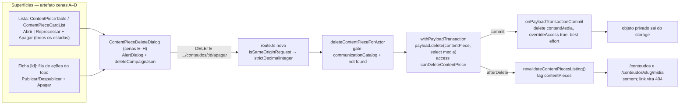

# Impl: C222 — Central de Conteúdos — apagar uma peça

Status: aprovado
Atualizado em: 2026-09-24
Issue: #1330
Intenção: docs/plans/central-conteudos-apagar-peca.md
Appetite restante: herdado (~1 dia eng) — nenhum consumo; o item cabe: um predicado de delete, uma action com cascata de mídia pós-commit, um hook de cache, uma rota DELETE, uma máquina de diálogo extraída no terceiro call site + adapters, o `publicPath` no row VM e testes.

## Leitura da intenção

- **Outcome:** em `/campanha/comunicacao/conteudos` (lista) e `/campanha/comunicacao/conteudos/[id]` (ficha), `communicator`/`coordinator`/`candidate` apagam uma peça com confirmação explícita — avisando o link público `/conteudos/<slug>` quando `publicado` — e a peça some da Central, some da pública e o arquivo privado exclusivo sai junto. `advisor`/`leader` negados (fail-closed); admin do Payload segue podendo apagar.
- **O que NÃO negociar:** hard delete apenas (sem lixeira/desfazer/restauração, sem lote, sem telemetria/métricas de exclusão); apagar disponível em **qualquer** estado (`processando` inclusive) com o aviso do link só quando `publicado`; literais de diálogo do plano de intenção (`Apagar esta peça?` · `Cancelar`/`Apagar` · corpo publicado/não publicado); contadores de circulação (`ContentEvent`, `subjectId` texto sem FK) **não** são limpos; despublicar continua o gesto reversível e não é pré-requisito; mídia privada exclusiva da peça sai junto (sem resíduo); UI portada do artefato aprovado, classe-a-classe.
- **O que reavaliar (hipóteses do explorador que a engenharia confirma ou corrige):**
  - O `delete` da collection é `payloadAdminOnly` (`ContentPiece.ts:242-250`) → vira predicado novo (Decisão 1), não alias.
  - O diálogo do C183 **não** cobre a cascata de mídia; a action modela o C199 (`recording.ts:232-270`) e não o C183 (`deleteSpeechCutForActor`, que deixa mídia órfã). C183 é o molde do **diálogo**, não da limpeza (Decisão 2).
  - A lista pública é cacheada sob a tag `contentPieces` e só o `afterChange` a busta (`ContentPiece.ts:90-93,258`; `contentPieceReads.ts:62-91`) → precisa `afterDelete` (Decisão 3).
  - O VM de linha **não** carrega `slug`/`publicPath` e o select da lista não pede `slug` (`contentPiecePageData.ts:34-49`) → precisa para o aviso nomeado (Decisão 4).
  - O job engole a row sumida no catch externo (`contentPieceJob.ts:200-311`; `failContentPiece` em `:87-97`) — **não** precisa de guard novo; precisa de teste que prove (Fase 2).
  - `deleteSpeechCutForActor` (`speech.ts:348-366`) confirma o anti-modelo: single-collection, mídia órfã — não seguir.

## Abordagem recomendada

**Opções consideradas:** A (recomendada: predicado próprio + cascata pós-commit C199 + `afterDelete` no seam do cache + rota DELETE C183/C199 + máquina de diálogo extraída) | B (leftovers: alias de update, hook `beforeDelete`, bust só na action, terceira cópia do diálogo) | C (caminhos laterais: delete só-admin com bypass no action, sem bust, path via wire VM).
**Recomendação:** A — cada efeito tem um dono nomeado (access no collection, cascata no action, cache no hook da collection, transporte na família `[id]/*`, UI no artefato) e o terceiro call site do diálogo vira extração, não twin.
**Rejeitadas:** B e C detalhadas por decisão abaixo.

### Decisões de engenharia

**1. Autorização — novo `canDeleteContentPiece`**

- **Opções:** A) predicado próprio em `src/utilities/access/contentPieces.ts`, molde `canDeleteSpeechCut`/`canDeleteRecording` (`isPayloadAdmin` OU `canReadCommunicationCatalog`) | B) reusar/aliasar `canUpdateContentPiece` | C) manter `payloadAdminOnly` e autorizar só no action/rota.
- **Recomendação:** **A** — exportado pelo barrel `campaignAccess.ts:188-192` e ligado em `ContentPiece.access.delete` (`ContentPiece.ts:242-250`), com o comentário atualizado (o anti-goal do C211 é reaberto de propósito; a confirmação passa a ser o freio). O action ainda repete o gate fresco para responder a mensagem de domínio (`CONTENT_PIECE_FORBIDDEN_MESSAGE`); o access do collection é a barreira final (REST/GraphQL) e é quem sustenta a negação de `advisor`/`leader` fail-closed.
- **Rejeitadas:** **B** — predicado de update como autoridade de delete é decisão silenciosa de segurança (um alargamento futuro de update concederia delete); o próprio arquivo documenta o padrão de predicado próprio. **C** — `overrideAccess: true` sem dono no collection é o caminho paralelo proibido e some com a auditoria do admin.

**2. Cascata de mídia e transação**

- **Opções:** A) action abre `withPayloadTransaction`, apaga a peça com `overrideAccess: false` e `select: { media: true }`, e agenda o delete da `contentMedia` pós-commit com `onPayloadTransactionCommit` + `overrideAccess: true` best-effort | B) hook `beforeDelete` na `ContentPiece` cascateando a mídia (molde `deleteSpeechAssets`, `Speech.ts:65-97`) | C) deixar a mídia órfã (molde C183).
- **Recomendação:** **A** — espelha `deleteRecordingForActor` (`recording.ts:232-270`), que já resolveu este exato problema no mesmo domínio: o storage não transaciona, então a limpeza não pode derrubar o delete que a pessoa pediu. Ler o `media` **do doc retornado pelo próprio delete** (o `deleteByID` aceita `select`) fecha a janela em que o job anexa mídia entre a leitura e o commit do delete; a limpeza pós-commit continua best-effort (`catch(() => undefined)`), com o comentário de bypass intencional igual ao C199. Nada muda em `ContentMedia.ts` (`delete: canUpdateContentPiece` fica; a limpeza não é uma nova autorização, é consequência da peça que o ator podia apagar).
- **Rejeitadas:** **B** — a remoção do objeto S3 não é transacional; um soluço de storage faria o delete da peça falhar e poderia deixar row/objeto inconsistentes (o C199 já tinha recusado esse caminho). **C** — contraria o aceite de produto (mídia é exclusiva da peça; resíduo não faz sentido) e é a dívida que o C183 registrou.

**3. Bust do cache público**

- **Opções:** A) `afterDelete` na `ContentPiece` chamando `revalidateContentPiecesListing()` | B) bust inline só no action | C) não bustar (confiar em TTL).
- **Recomendação:** **A** — o seam já existe e é único: a pública lê `unstable_cache` sob a tag `contentPieces` (`contentPieceReads.ts:62-91`) e o helper `revalidateContentPiecesListing` já é exportado (`documents.ts:53-54`). Entra um `CollectionAfterDeleteHook` tipado (o `afterChange` atual permanece) — assim qualquer caminho de delete (action, admin, API) mata a peça fantasma em `/conteudos/<slug>` e `/midia`. `revalidateTagSafely` já cobre o invariante fora de request scope (fixtures/e2e/seeds).
- **Rejeitadas:** **B** — delete pelo admin do Payload ou por fixture não passaria pela action e a peça ficaria fantasma indefinidamente. **C** — não existe TTL nessa leitura; o risco declarado na intenção é exatamente a peça fantasma.

**4. Superfície da ação, rota DELETE e máquina do diálogo**

- **Opções:** A) uma rota `DELETE .../conteudos/[id]/apagar/route.ts` (molde C183/C199) + um diálogo client; extrair a máquina comum para `src/components/campaign/shared/CampaignDeleteDialog.tsx` e reduzir `SpeechCutDeleteDialog`/`RecordingDeleteDialog`/`ContentPieceDeleteDialog` a adapters de política (endpoint, copy, trigger, `redirectTo`), com markup/classe idênticos | B) terceira cópia literal do diálogo | C) parametrizar o arquivo do C183 no lugar e importá-lo da superfície de conteúdos | D) Server Action no lugar da rota JSON.
- **Recomendação:** **A** — "Apagar" entra na lista (desktop e cards) e na fila de ações do topo da ficha, sempre por último (cenas A–D). A rota repete o shape pinado: `isSameOriginRequest` → 403, `strictDecimalInteger` → 400, `campaignJsonMutationErrorResponse` (exportado de `campaignJsonMutationRoute.ts:57-80`, não reimplementado), `safeMessages` com as constantes `CONTENT_PIECE_*` e `dynamic = 'force-dynamic'`. O diálogo é o do artefato E–H e o terceiro call site é o gatilho da regra "edit the owner, don't twin": extrai-se a **máquina** (estado `submitting`/`error`, `deleteCampaignJson`, `router.push`/`refresh`, estrutura `AlertDialog` + `Spinner` + `Alert` inline) mantendo o markup do C183/C199 byte-a-byte; os adapters preservam nomes e props, então call sites e specs unitários existentes não mudam. O novo componente em `shared/` ganha prefixo no manifesto e2e (`scripts/lib/e2e-affected-manifest.mjs`, bloco da vertical em `:463-506`, specs `['campaignSpeechAcervo', 'campaignSpeechCut', 'campaignReel']`).
- **Rejeitadas:** **B** — gêmeo proibido pelo engineering-standards (máquina idêntica, só a política difere). **C** — acopla o módulo do acervo de falas à Central de Conteúdos e esconde o dono. **D** — a vertical já tem o contrato JSON + guard de origem pinado pelo sweep (`codebaseConventions.unit.spec.ts:263`); Server Action dividiria envelope e mensagens de domínio.
- **Condição de aceite da extração:** classes e testes do C183/C199 passam sem edição; se a paridade de markup quebrar, o fallback é a opção B com débito registrado — nunca improvisar estrutura visual.

**5. Fonte do `publicPath` para o aviso do link**

- **Opções:** A) o row VM composto ganha `publicPath: string | null`, calculado no server (`contentPiecePageData.ts`) com `contentPiecePublicPath` + `slug: true` no select da lista | B) adicionar `slug`/`publicPath` ao VM de wire (`ContentPieceViewModel`) | C) o diálogo busca o slug numa rota nova.
- **Recomendação:** **A** — `ContentPieceViewRecord` ganha `slug?: string | null`, `ContentPieceRowViewModel` (`contentPieceCirculation.ts:64`) ganha `publicPath`, e `toContentPieceRow` faz `record.slug ? contentPiecePublicPath(record.slug) : null`. Só as páginas precisam do dado; o detalhe já seleciona `slug` (`contentPiecePageData.ts:52-65`), a lista passa a selecionar. O diálogo mostra o nome do link só quando `status === 'publicado' && publicPath`; senão mantém o corpo genérico (cena F).
- **Rejeitadas:** **B** — `src/lib/contentPiece.ts` importar `src/lib/contentPieceCatalog.ts` criaria ciclo (o catalog já importa o vocabulary; o gate `cycles` recusa) e o campo poluiria os contratos de upload/status/retry/publicação. **C** — request extra para dado que a página já tem, com estado de erro novo no caminho de falha.

### Decisões baratas (com gatilho de revisitação)

| Decisão                             | Escolha                                                                                          | Gatilho de revisitação                                                        |
| ----------------------------------- | ------------------------------------------------------------------------------------------------ | ----------------------------------------------------------------------------- |
| Ícone do trigger                    | `Trash2Icon` (padrão do campaign; o artefato declara "sem SVG próprio")                          | se o `designer` pedir o glifo próprio (trigger d)                             |
| Copy do erro do diálogo             | literal `Não foi possível apagar a peça.` (cena G) em constante local do adapter, como C183/C199 | se surgir 2º consumidor da mensagem → constante em `schemas/contentPiece.ts`  |
| Pós-delete                          | ficha redireciona para `CAMPAIGN_COMMUNICATION_CONTEUDOS`; lista faz `router.refresh()`          | se a lista ganhar estado que invalide o retorno                               |
| Título com `prose`                  | portar o reset do C199 (`border-b-0 pb-0`) se o container aplicar prose na ficha                 | nenhum                                                                        |
| Guard no job                        | nenhuma mudança no `contentPieceJob` (catch existente cobre)                                     | se o teste provar que o job derruba → guard `findByID(...).catch(() => null)` |
| Objeto S3 órfão por rollback do job | fora de escopo (só o caso commitado é limpo)                                                     | se resíduo aparecer no bucket → GC/varredura em item próprio                  |

### Componentes / mudanças

**Servidor / acesso**

- **`canDeleteContentPiece`** (`src/utilities/access/contentPieces.ts`): predicado próprio (admin Payload OU `canReadCommunicationCatalog`), reusando `isPayloadAdmin`/`getFreshCampaignUser` de `access/shared`; re-export no barrel `src/utilities/campaignAccess.ts:188-192`.
- **`ContentPiece`** (`src/collections/ContentPiece.ts`): `access.delete = canDeleteContentPiece` (substitui `payloadAdminOnly`; remover o import se ficar sem uso); `afterDelete: [revalidateContentPieceListingAfterDelete]` — hook tipado novo que chama `revalidateContentPiecesListing()`; o `afterChange` existente fica.
- **Schema** (`src/lib/schemas/contentPiece.ts`): `contentPieceDeleteRequestSchema` (`{ contentPieceId: z.number().int().positive() }`), molde `recordingDeleteRequestSchema`.
- **Action** (`src/app/(campaign)/campanha/actions/contentPieces.ts`): `deleteContentPieceForActor({ contentPieceId })` — parse → gate fresco `canReadCommunicationCatalog` → `loadContentPieceForActor` (404) → `withPayloadTransaction` → `payload.delete({ collection:'contentPiece', id, select:{ media:true }, user: actor, overrideAccess:false, req })` → `onPayloadTransactionCommit(transactionID, () => void payload.delete({ collection: CONTENT_MEDIA_SLUG, id: mediaId, overrideAccess:true }).catch(() => undefined))` → `{ deleted: true }`.
- **Sem migration:** access/hooks/select não mudam schema; `slug` já existe (C211). Não rodar `migrate:create`; `pnpm migrate:status` deve seguir limpo. `ContentMedia.ts` intocado. Sem `Consent` (nenhuma PII nova).

**Rota / contrato**

- **`DELETE`** (`src/app/(campaign)/campanha/(app)/comunicacao/conteudos/[id]/apagar/route.ts`): novo, cópia do shape C183/C199 — `isSameOriginRequest` → 403 com `CAMPAIGN_JSON_INVALID_REQUEST_MESSAGE`; `strictDecimalInteger(id)` → 400; `deleteContentPieceForActor`; sucesso `{ status:'success', deleted:true }`; erro `campaignJsonMutationErrorResponse` com `safeMessages: [CONTENT_PIECE_FORBIDDEN_MESSAGE, CONTENT_PIECE_NOT_FOUND_MESSAGE]` e `genericMessage: CONTENT_PIECE_GENERIC_ERROR_MESSAGE`; `dynamic = 'force-dynamic'`.
- **Tipos** (`.../conteudos/types.ts`): `ContentPieceDeleteResponse = { status:'success'; deleted:true } | { status:'error'; message }`.
- **`campaignContentPieceDeleteHref(id)`** (`src/lib/campaignPaths.ts`, junto de `retry`/`publicacao`): `${campaignContentPieceDetailHref(id)}/apagar`.

**UI (Impeccable B — portar o artefato A–H; sem dispatch: cobertura completa)**

- **`CampaignDeleteDialog`** (`src/components/campaign/shared/CampaignDeleteDialog.tsx`, client, novo): a máquina extraída — trigger slot via `AlertDialogTrigger asChild`, título/descrição/erro/`redirectTo`/`confirmLabel`/overrides de classe como props; `deleteCampaignJson` com tipo estrutural de resposta; `Spinner` + `Alert` inline; nunca toast.
- **Adapters**: `SpeechCutDeleteDialog`/`RecordingDeleteDialog` refatorados para renderizar a máquina com a política atual (markup e props idênticos); **`ContentPieceDeleteDialog`** (novo, `src/components/campaign/content/`) com título `Apagar esta peça?`, corpo publicado `O link público <publicPath> deixa de funcionar para quem já recebeu. Esta ação não pode ser desfeita.`, corpo genérico `Esta ação não pode ser desfeita.`, botões `Cancelar`/`Apagar`, trigger `Button variant="ghost"` destructive + `Trash2Icon` + `min-h-11`.
- **`ContentPieceTable.tsx:123-145`**: célula "Próxima ação" vira `flex items-center justify-end gap-2` — Abrir (outline) ou Reprocessar (primário) + Apagar (ghost), cena A.
- **`ContentPieceCardList.tsx:75-81`**: cena B — sem retry: `grid grid-cols-[1fr_auto]` (Abrir + Apagar); com retry: Reprocessar full width e Apagar full width abaixo.
- **`[id]/page.tsx:113-122`**: agrupar `ContentPiecePublicationButton` + `ContentPieceDeleteDialog` no `flex ... justify-end gap-2` do topo, Apagar por último (cenas C–D), com `redirectTo={CAMPAIGN_COMMUNICATION_CONTEUDOS}`. **Não** realocar `Anexar` nem o Reprocessar do painel de falha (divergências pré-existentes do C211; o artefato manda apenas "a ação definitiva fecha a fila do topo"). Se isso impedir o port na ficha mobile, é trigger (b) → despachar o `designer` antes do markup.
- **Sem** trigger (a): o artefato cobre lista desktop/mobile (A/B), ficha desktop/mobile (C/D), diálogos publicado/genérico (E/F), erro e envio (G/H). Sem trigger (d): o artefato declara que os ícones seguem o Lucide.

**Testes**

- **Unit**: novo `tests/unit/contentPieceDeleteDialog.unit.spec.tsx` (molde `speechCutDeleteDialog.unit.spec.tsx`: aviso nomeado só publicado; DELETE na URL certa; `refresh` na lista; `push` na ficha; erro de domínio sem refresh); specs do C183/C199 rodam sem edição (condição da extração).
- **Int** (`tests/int/contentPiece.int.spec.ts`): acesso ao delete na collection (communicator/coordinator/candidate ok; advisor/leader e anônimo negados); `deleteContentPieceForActor` remove a row e a mídia (poll, molde `recording.int.spec.ts:731-758`); apagar em `processando`/`falhou`/`rascunho`/`publicado`; depois do delete, `runContentPieceJob(payload, id)` resolve e não recria mídia (worker não derruba); `contentEvent` da peça permanece; `revalidateTag` chamado com a tag `contentPieces` (spy no mock de `next/cache`).
- **E2E** (`tests/e2e/campaignSpeechAcervo.e2e.spec.ts`, describe C211 em `:1384+`): communicator apaga peça `publicado` com mídia via HTTP → 200; some da lista; `/conteudos/<slug>` e `/midia` → 404 para anônimo; arquivo privado → 404; `advisor` → 400 com `não tem acesso`; lista/ficha renderizam `Apagar`.
- **Manifest**: nenhum prefixo obrigatório para os arquivos já cobertos (`.../comunicacao`, `src/components/campaign/content`, `src/utilities/content`, `ContentPiece.ts`/`ContentMedia.ts`); **um** prefixo novo para `src/components/campaign/shared/CampaignDeleteDialog` no bloco da vertical (`:463-506`). `src/utilities/access` e `src/lib/schemas` já são `E2E_RISK_PREFIXES` (diff high-risk → conjunto curado).

### Dados → forma (se aplicável)

Não aplicável — a intenção já decide que é decisão de estado do item, não painel (sem contadores de exclusão, sem auditoria exposta, sem dashboard). A única informação nova exibida é o path público `/conteudos/<slug>` no corpo da confirmação (cena E), que já existe e não é leitura agregada.

## Fases verificáveis

1. **Tracer / servidor+access (≈40% do appetite):** `canDeleteContentPiece` + barrel + `ContentPiece.access.delete` + `afterDelete` + schema + `deleteContentPieceForActor` + rota DELETE + tipos + href; int mínimo (communicator apaga peça com mídia e ela some do DB). Prova: `pnpm test:int tests/int/contentPiece.int.spec.ts` verde; `payload.delete` com `overrideAccess:false` negando advisor/leader; `pnpm migrate:status` limpo.
2. **Cascata e cobertura (≈20%):** poll da mídia pós-commit, delete em `processando` + resiliência do worker, contadores preservados, spy do `revalidateTag`, negações. Prova: os mesmos ints; nenhum resíduo de `contentMedia` no caso commitado; job resolvendo sem recriar nada.
3. **UI (≈30%):** `CampaignDeleteDialog` + adapters (C183/C199 refatorados sem mudança de markup/props) + `ContentPieceDeleteDialog` + `publicPath` no row VM/select + wiring nas cenas A–D; unit do diálogo. Prova: `pnpm test:unit tests/unit/contentPieceDeleteDialog.unit.spec.tsx`; specs do C183/C199 verdes sem edição; screenshots 390/1280 dos estados críticos para a crítica (c).
4. **Fechamento (≈10%):** e2e C211 + prefixo do manifesto; `pnpm gate:fast`; `pnpm test:e2e:affected`; crítica do `designer` (c) conforme a regra do §Design (port mecânico do artefato aprovado é non-trigger, mas o fechamento certifica o renderizado); entrada `docs/changelog/2026-09-24-C222-central-de-conteudos-apagar-peca.md`; `/simplify`; `pnpm push`.

## Rabbit holes / Não escopo (engenharia)

- **Soft delete / lixeira / `trash` do Payload / restauração** — anti-goal de produto; delete é hard (config sem `trash`).
- **Lote, undo, confirmação em massa, progresso** — v1 é uma peça.
- **Faxina de `ContentEvent`** — `subjectId` texto sem FK; os eventos são inertes e ficam (a intenção proíbe).
- **GC/reconcile de objetos S3 órfãos por rollback do job** — fora; gatilho de revisitação se houver resíduo observável.
- **Lock/advisory entre o job de extração e o delete** — fora; a leitura do `media` no ato do delete cobre o caso commitado e o teste prova o worker.
- **Estender `campaignJsonMutationRoute` para DELETE** — o wrapper é POST-only por contrato e as duas rotas DELETE existentes já pinam o shape manual; não reabrir.
- **Mexer em `contentPieceReads.ts`/`documents.ts` além do hook** — a tag e o helper já são o dono.
- **Relocar `Anexar` (e o Reprocessar do painel de falha) na ficha** — divergência pré-existente do C211; fora.
- **Métricas/telemetria de exclusão, dashboard nova, auditoria exposta** — anti-goals.
- **Migration** — nenhuma.

## Já resolvido no simplify/critique (não reabrir)

Correções aplicadas na sessão — não reabrir em review/follow-up:

- **Título do diálogo sem o `border-b`/`pb-2` do `h2` global:** `ContentPieceDeleteDialog` passa `titleClassName="border-b-0 pb-0"` (mesmo reset do C199).
- **`trigger: ReactElement`** no `CampaignDeleteDialog` — o `asChild` do `AlertDialogTrigger` exige elemento, não qualquer nó React.
- **`slug: true` removido do `contentPieceDetailSelect`** (herdado do spread do select de lista).
- **`prettier --write` nos arquivos do diff;** `prettier --check` limpo (o `format:check` falhava em 3 arquivos).
- **Teste do cache honesto:** `mockClear()` do `revalidateTag` **depois** do create — a asserção pina o `afterDelete`, não o `afterChange` do create.
- **Comentário do `ContentPieceTable` corrigido** ("beside that next action"; sem o antigo "visually below").
- **`CampaignDeleteDialogResponse` volta a tipo interno** (sem consumidor externo).
- **Nome do teste int do not-found** descreve o caminho de fato (`refuses the delete from a denied role, keeps the piece and 404s an unknown id`).

## Explicitamente fora (descartes e defers com gatilho)

- **3ª cópia literal do envelope DELETE** (`conteudos/[id]/apagar/route.ts` repete `cortes`/`gravacoes`: `isSameOriginRequest` → 403, `strictDecimalInteger` → 400, `campaignJsonMutationErrorResponse`) — **defer, gatilho:** uma 4ª rota DELETE em `(campaign)` **ou** drift observado entre as cópias (fix aplicado a uma só). Congelado de propósito em C183/C222 (wrapper POST-only por contrato; o mapper já é compartilhado; o sweep `codebaseConventions.unit.spec.ts:263` pina a guarda de origem em todo `export const DELETE`) — não reabrir antes do gatilho.
- **Testes do `contentPieceDeleteDialog.unit.spec.tsx` que espelham o spec do C183** — descartar: os três testes "de máquina" (endpoint/refresh, redirect, erro sem refresh) pinam a **política do adapter** da peça (URL e `redirectTo` próprios, diferentes do corte) e a máquina compartilhada já está pinada no `speechCutDeleteDialog.unit.spec.tsx`; removê-los perderia cobertura de wiring sem ganho.
- **Peso do "Reprocessar" divergente entre os artefatos C211 (outline) e C222 (primário)** — defer, gatilho: crítica do `designer` (c) desta entrega julgar a divergência material; o C211 é o dono do botão e o implementador manteve o outline. Se material, corrige no próximo item de UI da vertical (follow-up do C211), fora do aceite do C222.

## Riscos e mitigação

- **Peça fantasma na pública** (tag `contentPieces` não bustada) → `afterDelete` no mesmo seam do `afterChange`; int com spy do `revalidateTag` e e2e anônimo 404 em `/conteudos/<slug>` e `/midia`.
- **Mídia órfã (row/S3)** → id lido do doc retornado pelo delete (fecha a corrida com o attach do job) + limpeza pós-commit best-effort (C199); int com poll provando a row de `contentMedia` some; resíduo residual só na janela exata em que o job tem a transação revertida — nomeado, com gatilho de GC.
- **Delete em `processando` derrubar o worker** → o catch externo já engole `findByID`/`failContentPiece` sobre row sumida; int roda `runContentPieceJob` depois do delete e exige resolução + nenhuma mídia nova; se falhar, o plano barato é o guard `findByID(...).catch(() => null)`.
- **Bypass via REST/GraphQL** → access do collection (`canDeleteContentPiece`) é a barreira final; int nega advisor/leader/anônimo e libera os três papéis da vertical + admin.
- **DELETE sem guard de origem falha aberto** → linha `isSameOriginRequest` copiada do shape pinado; sweep `codebaseConventions.unit.spec.ts:263` já cobre `(campaign)`.
- **`revalidateTag` fora de request scope** (fixtures/seeds/e2e) → `revalidateTagSafely` em `documents.ts` já engole só o invariante; demais falhas propagam.
- **`slug` ausente na lista** → `slug: true` no select + `publicPath: null`; o aviso nomeado só aparece publicado com path, senão cena F.
- **Copy/literais** → diálogo com os literais da intenção/artefato; rota com `CONTENT_PIECE_*` (o sweep recusa literal em `safeMessages`).
- **Extração do diálogo regredir C183/C199** → markup/classe idênticos, nomes/props preservados, specs unitários existentes sem edição + e2e afetados (`campaignSpeechAcervo`, `campaignSpeechCut`, `campaignReel`); se a paridade quebrar, fallback B com débito registrado.

## Aceite de engenharia

- [ ] Aceite de produto da intenção ainda coberto: Apagar na lista e na ficha com confirmação e literais; aviso do link `/conteudos/<slug>` só quando publicado; apagar em todos os estados; mídia privada sai junto; `ContentEvent` preservado; `communicator`/`coordinator`/`candidate` + admin apagam, `advisor`/`leader` fail-closed; hard delete sem lote/lixeira/telemetria.
- [ ] Invariantes AGENTS/engineering-standards: Local API com `user` → `overrideAccess:false` na peça; escrita multi-collection (peça + mídia pós-commit) com `withPayloadTransaction` + `req`; bypass só no cleanup justificado como no C199; sem Consent/PII novo; identificadores em inglês, strings pt-BR; `migrate:status` limpo.
- [ ] Testes de domínio previstos onde access/write paths mudam: int (access, cascata, qualquer estado, worker, contadores, cache), unit (diálogo e adapters), e2e (HTTP delete, 404 público, negação).
- [ ] Cache público honesto (`afterDelete`) e design portado classe-a-classe (cenas A–H) com crítica final do `designer` conforme §Design.
- [ ] Manifesto e2e atualizado (prefixo do componente compartilhado) e `pnpm test:e2e:affected` verde antes do `pnpm push`.

## Self-score (decision-quality)

5/5 — (1) as cinco decisões caras têm opções e rejeitadas explícitas, ancoradas em evidência de código (access como barreira final; C199 vs C183 para a cascata; tag sem TTL; sweeps pinados; ciclo de import no VM de wire); (2) cabe no appetite herdado — um predicado, uma action, um hook, uma rota, uma extração de diálogo e wiring, sem migration nem lote/lixeira/GC; (3) rabbit holes nomeados (soft delete, lote, faxina de `ContentEvent`, GC de S3, locks, relocação de `Anexar`, wrapper DELETE); (4) depth check respeitado — reusa `withPayloadTransaction`/`onPayloadTransactionCommit`, `revalidateContentPiecesListing`, `deleteCampaignJson`, `campaignJsonMutationErrorResponse`, `CampaignTable`/cards e extrai a máquina do diálogo no terceiro call site em vez de triplicar; (5) o outcome da intenção permanece intacto — nenhuma decisão alterou aceite, audiência ou literais.
