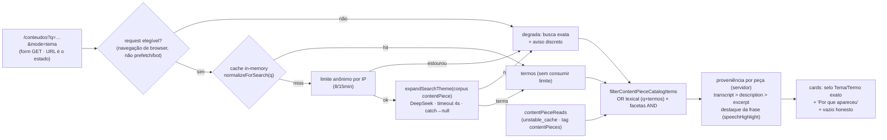

# Impl: S28 — Busca por tema na Central de Conteúdos pública

Status: **aprovado**
Atualizado em: 2026-09-23
Issue: #1257
Intenção: docs/plans/central-conteudos-busca-semantica.md
Design UI (gate): docs/plans/central-conteudos-busca-semantica-ui-design.html
Appetite restante: herdado (~1–2 dias eng) — modo por tema sobre o catálogo do S27, **sem schema novo**: mecanismo lexical do C192 generalizado (expansão + sanitização + OR), guarda de uso anônimo nova (limite + gate de bot/prefetch + cache por termo), proveniência por trecho real e os estados do design. Cortados: embeddings/pgvector, rerank, captcha, limiter/cache distribuídos, analytics e índice novo.
Modo: autônomo (`--auto`) — impl plan nasce aprovado pelo agente.

## Leitura da intenção

- **Outcome:** o eleitor sem login digita um tema na Central (`/conteudos`) e escolhe "Por tema" no campo de busca; peças publicadas que tratam do assunto aparecem mesmo sem as palavras exatas, cada resultado por tema marcado ("Tema") com um indício curto e real de por que apareceu (trecho da descrição/transcrição), sem score. "Termo exato" continua o padrão; filtros seguem valendo nos dois modos; vazio honesto com saída; mecanismo indisponível degrada para a busca exata com aviso discreto — nunca erro na cara nem resultado fantasma.
- **O que NÃO negociar:**
  - **Corpus fechado:** só peças publicadas da Central (`where status=publicado` + predicado `contentPieceIsPublic`, `src/lib/contentPiece.ts:211`); nada do acervo interno de falas, nada de PII, nada de fala de terceiro fora de peça publicada.
  - **Proveniência honesta:** selo "Tema" vs "Termo exato" + trecho real (descrição/transcrição); nunca score numérico, nunca "parecido" enganoso, nunca resultado inventado.
  - **Guardrail de custo/abuso (obrigatório):** a rota é pública e a expansão é LLM — precisa de limite de uso e as chamadas não podem ser disparadas por bot/crawler; sob abuso, o modo degrada (nunca 429/erro na cara).
  - **Sem regressão do S27:** "Termo exato" é o default e o comportamento de hoje (URL, filtros, canonical `/conteudos`, kill switch) não muda; sem importar o contrato interno de staff.
  - **Nada de infra nova:** sem embeddings/pgvector/backfill, sem curadoria de sinônimos, sem busca global/voz.
- **O que reavaliar (hipóteses da intenção):**
  - "Reuso do C192 (`expandSpeechSearchTheme`, `speechListFilters`, `speechListUrl`)": a **sanitização** (`src/lib/speechThemeTerms.ts`) e o **contrato de URL** (mode só com `q`) são genéricos e viram reuso direto; o **prompt** fala "acervo de discursos"/"assessoria" — persona errada para a rota pública, então o dono é generalizado por corpus (D6), não importado cru. O `where` do C192 (`speechListFilters.ts:52-96`) **não** serve: o catálogo público filtra em memória (`contentPieceCatalog.ts:201-218`) e é lá que o OR entra.
  - "`rateLimit.ts` serve de limitador": **não** — é chaveado por `userId` e só roda atrás de auth (`src/utilities/ai/rateLimit.ts:33`); não existe limitador anônimo/IP no repo (zero `x-forwarded-for`/`clientIp` em `src/`). A guarda anônima é módulo novo (D1/D2).
  - "expansão no RSC como no C192": mantida (D3), mas com o gate de prefetch/bot **e** `prefetch={false}` nos links de filtro no modo tema — um payload RSC prefetchado degradado ficaria no router cache do cliente e a navegação seguinte mostraria o aviso em vez do tema.
  - "trecho do `excerpt` do S27 basta": **não** — o `excerpt` é o 1º parágrafo da transcrição (`contentPieceCatalog.ts:321-337`) e o termo normalmente casa no meio dela; a evidência é uma janela calculada no servidor sobre `transcript`/`description` (D5), sem expor o transcript inteiro no VM.

## Abordagem recomendada

**Opções consideradas (abordagem geral):** A) expansão lexical do C192 generalizada + OR em memória no contrato público do S27 + guarda anônima nova (limite por IP + gate de navegação + cache por termo) + proveniência por janela no servidor + port classe-a-classe do design; B) embeddings query-time (DeepInfra) + cosine sobre artefato; C) pgvector + backfill.
**Recomendação:** **A** — o mecanismo já está em produção no C192 e resolve "sem as palavras exatas" sem infra nova; o corpus público reusa a leitura cacheada do S27 (tag `contentPieces`) e o filtro puro, então o custo novo é só a guarda e a proveniência; nada é indexado/backfillado e o kill switch continua valendo pela tag.
**Rejeitadas:** **B/C** porque são o rabbit hole nomeado na intenção (pipeline de embedding, storage vetorial, sync/backfill) e não mudam o outcome; **D)** modo automático no mesmo campo (sem escolha) porque a intenção fixa o modo visível com exato como padrão.

### D1 — Guardrail de uso anônimo (limite + bot/prefetch)

**Opções:** A) limitador in-memory por IP + gate de elegibilidade de navegação, módulo novo `src/utilities/ai/themeSearchGuard.ts`; B) cookie de sessão assinado + Map in-memory; C) só cache da expansão por `q`.
**Recomendação:** **A** — o deploy é Next standalone auto-hospedado em container único (o `Map` por instância funciona e reseta no deploy, exatamente o contrato documentado do `rateLimit.ts:1-14`); chave do cliente por ordem `cf-connecting-ip` → `x-forwarded-for` (1º hop) → `x-real-ip` → `'unknown'` (bucket compartilhado, fail-closed — atrás do Cloudflare tunnel o `cf-connecting-ip` é setado na borda e não é forjável pelo cliente; precedente de `headers()` em RSC é `perfil/page.tsx:33` e em action é `invite.ts:24`, que já lê `x-forwarded-host`/`x-forwarded-proto`); janela de **8 expansões/15min** por chave (constantes unit-testadas). Elegibilidade: a expansão só roda em pedido iniciado por browser — a Fetch Metadata que **chega ao server** decide (`sec-fetch-mode: navigate` do documento, inclusive o form GET sem JS, ou `cors` do fetch RSC do router, que é o mesmo caminho da navegação client-side e **precisa** expandir); `no-cors` é recusado (um `<link rel=prefetch>`/`` de terceiro não dispara expansão) e scraper sem os headers Sec-Fetch fica no literal. Estouro/inelegível → **degrada com o aviso**, nunca 429. **Registrado na execução (achado do app renderizado):** o Next 15 consome `RSC` e `Next-Router-Prefetch` antes do userland — `headers()` nunca os vê (verificado com rota de eco e com o app rodando), então o gate por `rsc`/prefetch não existe; a primeira linha contra o prefetch do router é a UI (`prefetch={false}` em todo link que preserva `mode=tema`), porque o prefetch do Next é indistinguível de uma navegação no server. Também registrado: um carregamento degradado consome **duas** unidades da cota (documento + fetch RSC, já que `null` não é cacheado) — aceito: o usuário nesse estado já vê o aviso e o retry continua oferecido.
**Rejeitadas:** **B** porque cookie não impede troca trivial de sessão e adiciona superfície de assinatura/cripto para o mesmo efeito do IP; **C** porque cache sozinho não limita termos únicos — o vetor de custo real é `q` novo a cada chamada. Nota: `rateLimit.ts` (userId) fica **intocado** — 2 call sites, sem terceiro; o helper único do boilerplate DeepSeek segue deferido (D6).

### D2 — Cache da expansão por `q`

**Opções:** A) cache in-memory com TTL, chave `normalizeForSearch(q)`, TTL 30min, cap 200 entradas, limpeza no acesso; B) `unstable_cache`; C) sem cache (v1 do C192, D6 de `acervo-busca-semantica-impl.md`).
**Recomendação:** **A** — um termo popular paga uma chamada e serve todos (inclusive hits de crawler que passarem pelo gate); não persiste em disco, reseta no deploy como o limite, e o **hit não consome a cota** (o custo já foi pago — o limite existe para conter chamadas ao provedor). `{terms: []}` é cacheado (resposta legítima, evita re-chamar um termo que nada acrescenta); `null` **nunca** é cacheado (erro transitório/chave ausente). Chave só com texto público normalizado — sem PII, sem id de usuário.
**Rejeitadas:** **B** porque a função cacheada não pode ler `headers()` (o gate e o limite ficam fora, e o valor persistido em disco sobreviveria a deploy sem invalidação por prompt/modelo — e `revalidateTag` dentro de cached fn lança no Next 15.4, `youtubeFeed.ts:253-260`); **C** porque na rota pública o custo por termo único fica aberto dentro da cota (o interno podia esperar). **Gatilho:** 2ª instância/container → cache e limite compartilhados (Redis) viram item; prompt/modelo mudarem → invalidar por deploy (o cache é in-process, some sozinho).

### D3 — Onde a expansão roda

**Opções:** A) no RSC da página (padrão C192 `speechPageData.ts:176,184-191`) com o timeout do dono; B) route handler GET próprio + fetch do client; C) Suspense/streaming com fallback.
**Recomendação:** **A** — a página já é dinâmica (`searchParams`), o `loading.tsx` do S27 cobre a espera com o skeleton, a degradação é renderizada no mesmo HTML (funciona sem JS) e não nasce rota/URL nova. O timeout continua o do dono (**4s**, `expandSpeechSearchTheme.ts:14,67`): um segundo timeout para o mesmo mecanismo seria divergência gratuita. A expansão só roda com `mode=tema` + `q` e depois da leitura cacheada; a lista literal nunca espera por ela quando o modo não foi pedido.
**Rejeitadas:** **B** porque exige JS, segundo round-trip e um endpoint público novo (superfície e custo) e duplicaria o caminho sem JS; **C** porque o swap progressivo precisa de boundary client e de um estado que o design não cobre. **Gatilho:** se a latência percebida doer (mobile/conexão ruim), reavaliar com cena nova no designer — não inventar streaming sem design. **Registrado na execução:** a página **não** chama `headers()`; o loader lê o `next/headers` só no caminho de tema (o parâmetro `requestHeaders` segue injetável para os testes). Chamar a API dinâmica na página opta o render inteiro para trás do boundary do `loading.tsx` (build de produção) e o shell passa a chegar em cópia oculta `S:` — o DOM fica transitoriamente duplicado e os locators estritos do e2e quebram de forma determinística. Com a leitura condicional, o catálogo literal (todo o S27) não defere; o caminho de tema defere e o spec espera o settle (`div[id^="S:"]`, o padrão C106 já usado nos specs de campanha).

### D4 — Contrato de URL do modo

**Opções:** A) `mode=tema` (default `exato` omitido), só com `q`, espelhando `speechListUrl.ts:35,109-110,163`; B) `busca=tema`; C) rota separada `/conteudos/tema`.
**Recomendação:** **A** — mesmo vocabulário já em produção no C192 (param `mode` em inglês, valor `tema` pt-BR), canonical `/conteudos` intocado, facetas preservadas nos hrefs (os chips já os preservam, `contentPieceCatalog.ts:97-111,170-198`). Sem `q`, `mode` não parseia nem serializa (não há o que expandir; espelho de `speechOmnibox.ts:263-272`), e remover o chip "Busca" limpa `q` **e** `mode`. O controle do modo são **radios** `name="mode"` dentro do form GET existente (`ContentPieceFilters.tsx:49-79`): com JS um ilhote client auto-submete no `change` (um toque, como o design); sem JS, o Enter no campo submete com o radio marcado (o form tem um único campo text-like — hidden e radio não bloqueiam implicit submission). Sem hidden input e sem parâmetro duplicado. **Registrado na execução:** o submit do form carrega o valor do radio ativo — a busca exata produz `?q=…&mode=exato` no URL, que o parse descarta (só `tema` parseia) e o href canônico nunca gera; é o custo do form sem JS, não um contrato novo.
**Rejeitadas:** **B** porque inventa um segundo vocabulário para o mesmo conceito que já roda; **C** porque parte o contrato público e mata o funcionamento sem JS (e o canonical). Nota: `mode=tema` (valor) não colide com a faceta `tema` (param de assunto) — são params distintos.

### D5 — Proveniência "por que apareceu"

**Opções:** A) evidência real por peça: primeiro termo expandido que casa no `searchText` (mesmo predicado do filtro) + janela do campo que contém o termo, ordem `transcript` > `description` > `excerpt`/título, reusando `buildHighlightedExcerpt` (`speechHighlight.ts:197`) com `{ phrase: true }`; B) "porquê" gerado pelo LLM; C) só o selo, sem trecho.
**Recomendação:** **A** — o trecho é a janela onde o termo realmente aparece (destaque da frase, como no C192 `speechViewModels.ts:264-279`), nunca o 1º parágrafo por acaso; quando o casamento veio só de tema/cidade/instituição no haystack (`contentPiece.ts:323-336`), a peça mantém o selo "Tema" e a evidência cai para `description`/`excerpt` **sem destaque**, texto real da peça, sem alegar casamento. Termos iguais ao `q` são descartados antes do selo (`contentPieceThemeTerms(query, terms)`, puro, no dono do contrato) — não reivindicar "Tema" quando o casamento é o próprio termo. Sem score (a intenção proíbe). A janela é calculada **no servidor**: o transcript completo nunca entra no VM nem no payload do client — o `ContentPiecePublicItem` ganha só `themeMatch: { term, evidence: parts + flags }` (serializável). **Registrado na execução:** o cabeçalho da lista no modo tema vira `Resultados para “q”` com a nota "Por tema ativo" quando a expansão contribuiu (artefato cena 05), no lugar do `h2` do S27.
**Rejeitadas:** **B** por alucinação/instabilidade e min/max imprevisível; **C** porque o aceite pede o indício por resultado. **Gatilho:** se a evidência sem trecho aparecer demais (muitos casamentos por tema/cidade), avaliar copy própria ("Tema da peça") — cena nova no designer.

### D6 — Reuso do mecanismo C192 (o que generalizar e o que não copiar)

**Opções:** A) importar `expandSpeechSearchTheme` como está; B) generalizar o dono para `expandSearchTheme(theme, corpus)` com `'speech' | 'contentPiece'`, mantendo `expandSpeechSearchTheme` como alias do C192; C) módulo irmão novo copiando o padrão.
**Recomendação:** **B** — o mecanismo é um só (gate de `DEEPSEEK_API_KEY`: `expandSpeechSearchTheme.ts:52`, `deepSeek('deepseek-flash')`: `:59`, `AbortSignal.timeout(4000)`: `:67`, `catch→null`: `:71-73`, `{terms:[]}≠null`) e o que muda é o **corpus do prompt**: o texto atual fala "acervo de discursos"/"assessoria" — persona errada para o eleitor. O alias mantém C192 e seus testes byte-idênticos; `src/lib/speechThemeTerms.ts:10-30` é genérico (sanitização de saída de modelo) e fica intocado. Fronteira explícita: `src/utilities/ai` é **risk prefix** do e2e (`e2e-affected-manifest.mjs:64,334-335`) → tocar acorda `campaignAiTranscribe` + `campaignSpeechAcervo` (e o curado); registrado nos pins.
**Rejeitadas:** **A** porque o prompt de discursos/assessoria não descreve o corpus público (peças: vídeo/áudio/foto/card/texto) — o dono deve conhecer os dois corpus; **C** porque é twin do mesmo mecanismo (o dono é o módulo existente). **Deferido (re-registrado do C192):** helper único do boilerplate DeepSeek — o gatilho "tocar qualquer um deles" dispara, mas a extração tocaria 4 módulos de IA no mesmo PR; mesmo gatilho mantido.

### D7 — Modo tema com filtros, vazio e degradação

**Opções:** A) OR textual (`q` + termos) × facetas AND com três estados explícitos (aplicado / vazio legítimo / indisponível); B) modo tema ignora filtros; C) degradação silenciosa (cai para exato sem aviso).
**Recomendação:** **A** — filtros seguem valendo (intenção) e a busca em memória do S27 já combina AND (`contentPieceCatalog.ts:201-218`): o `q` passa a casar qualquer um de `q` + termos normalizados. No modo tema, resultado com termo expandido ganha **"Tema" + "Por que apareceu"**; resultado que casou só o `q` ganha **"Termo exato"** (o aceite pede o porquê por resultado; o C192 só mostra o selo no caminho de tema). `{terms: []}` (modelo rodou, nada a acrescentar) **não** é indisponibilidade: lista literal, sem aviso (distinção do C192 D2). `null` (sem chave/timeout/erro/limite/pedido inelegível) → **aviso discreto** do design (`central-conteudos-busca-semantica-ui-design.html:260-278`, "Busca por tema indisponível agora. / A busca exata continua funcionando.") + resultados exatos + "Tentar por tema novamente" (link para a mesma URL com `prefetch={false}`, sem client extra) — nunca erro na cara. Vazio do modo tema: copy do design ("Nenhuma peça combina bem com esse tema" + "Não mostramos um resultado fraco só para preencher a tela.", `:246-258`) com três saídas distintas: **Reformular busca** (mesma URL sem `q`, mantém filtros), **Usar termo exato** (mesma URL sem `mode`, mantém `q`+filtros) e **Limpar filtros** (`/conteudos`).
**Rejeitadas:** **B** porque contraria o aceite ("filtros seguem valendo"); **C** porque esconde a degradação — "nunca resultado fantasma" inclui não fingir que o tema rodou.

### D8 — Verificação do modo tema por camada

**Opções:** A) unit do contrato/guarda/cache + int do loader com resolver injetado + e2e só do caminho degradado (a chave é zerada no app e2e, `playwright.config.ts:282-287`); B) stub de rede do DeepSeek no e2e (nova env/baseURL no provider); C) mock de `fetch` global no e2e.
**Recomendação:** **A** — o sucesso do tema é provado no int com `expandTheme` injetado (mesmo padrão do C192, `speechAcervo.int.spec.ts:351-415`); o e2e cobre o contrato HTTP real que importa na rota pública: degradação com aviso + exato inalterado + segmented submetendo (o app e2e nunca fala com o provedor, como `campaignSpeechAcervo.e2e.spec.ts:340-374`). Nenhuma env nova.
**Rejeitadas:** **B** porque cria superfície de produção (env/baseURL no caminho do provider) só por conveniência de teste; **C** porque mockar `fetch` global esconde o caminho real e não é padrão do repo.

### Componentes / mudanças

- **`src/lib/contentPieceCatalog.ts`** (editar, dono do contrato público): `ContentPieceCatalogMode = 'tema'`; `mode` em `ContentPieceCatalogParams` (`:56-63`) e no parse (`:76-94`, só `tema` e só com `q`); `buildContentPieceCatalogHref` (`:97-111`) serializa `mode` depois de `q` e só com `q`; `contentPieceCatalogActiveFilters` (`:170-198`) faz o chip de busca remover `q`+`mode`; `filterContentPieceCatalogItems(items, params, themeTerms = [])` (`:201-218`) casa `q` **ou** qualquer termo normalizado no `searchText` (sem termos, byte-idêntico ao S27); `contentPieceThemeMatch(record, terms)` puro (ordem `transcript` > `description` > `excerpt`, `buildHighlightedExcerpt(..., { phrase: true })`) e `toContentPiecePublicItem(record, { themeTerms })` (`:362-415`) anexa `themeMatch: { term, evidence } | null` ao VM. Reusa `normalizeForSearch` (`speechSearch.ts:9-15`), `slugify` e `speechHighlight`.
- **`src/utilities/content/contentPieceReads.ts`** (editar): extrai `getPublishedContentPieceRecords()` (mesmo `unstable_cache` e tag `contentPieces`, docs crus com `transcript` — hoje o select já o traz, `:22-39`); `getPublishedContentPieceItems()`, `getPublishedContentPieceBySlug` e `hasPublishedContentPieces` mantêm a API e o gate (`where` publicado + `contentPieceIsPublic`; Local API sem `user` = bypass default documentado, `:9-20`).
- **`src/utilities/ai/expandSpeechSearchTheme.ts`** (editar): `ThemeSearchCorpus = 'speech' | 'contentPiece'`; `expandSearchTheme(theme, corpus)` escolhe o prompt pelo corpus (regras de termos idênticas); `expandSpeechSearchTheme` vira alias (`corpus: 'speech'`) para C192 e `expandContentPieceSearchTheme` (`corpus: 'contentPiece'`) é o default da rota pública; contrato `null`/`{terms:[]}` e `normalizeSpeechThemeTerms` intocados.
- **`src/utilities/ai/themeSearchGuard.ts`** (novo, `server-only`): `isThemeSearchRequestEligible(headers)` (bloqueia `next-router-prefetch`; exige `rsc` ou `sec-fetch-mode: navigate`), `themeSearchClientKey(headers)` (ordem do D1), `createThemeSearchGuard({ max, windowMs, ttlMs, maxEntries, now })` (limiter + cache do D2, testável com relógio fake) e o singleton `resolveGuardedThemeExpansion({ q, headers, expandTheme })` → `{ terms } | null` (null = degradar).
- **`src/utilities/content/contentPieceThemeSearch.ts`** (novo, `server-only`): `loadContentPieceCatalogSearch({ rawSearchParams, requestHeaders, expandTheme = expandContentPieceSearchTheme })` → `{ publishedCount, params, filteredItems, facets, activeFilters, themeUnavailable, themeApplied }`. Orquestra: records cacheados → se zero publicado, retorna sem expandir; parse; se `mode=tema` com `q`, chama a guarda (com o `q`); mapeia records → VMs com os termos (anexa `themeMatch`); filtra; deriva facetas do conjunto publicado e os filtros ativos.
- **`src/components/conteudos/ContentPieceSearchMode.tsx`** (novo, client): radios `name="mode"` (`exato`/`tema`) no visual `.seg` do design (`central-conteudos-busca-semantica-ui-design.html:157-169,207-219`), auto-submit no `change` (`requestSubmit`), "Por tema" com ⚠ e `disabled` quando indisponível (design `:270-273`).
- **`src/components/conteudos/ContentPieceFilters.tsx`** (editar, `:49-79,81-122`): bloco do campo no grid do design (`sm:grid-cols-[1fr_300px]`, chips `col-span-2`), o segmented no lugar do botão de submit do S27 (o Enter e o segmented submetem; o CTA de pedido de voto segue no hero do S27, intocado), `prefetch={false}` nos links de filtro quando `mode=tema`, hidden facets inalterados.
- **`src/components/conteudos/ContentPieceCard.tsx`** (editar, `:36-110`): selo "Tema" (com "Termo exato" quando o `q` também casa) e bloco "Por que apareceu" com aspas + partes destacadas — render local no domínio público (a fronteira site→`components/campaign` é vedada; sem importar `SpeechHighlightParts`).
- **`src/components/conteudos/ContentPieceStates.tsx`** (editar, `:33-70`): variante de vazio do modo tema (copy e três saídas do D7) e `ContentPieceThemeFallbackNotice` (aviso do design + "Tentar por tema novamente").
- **`src/app/(frontend)/conteudos/(catalog)/page.tsx`** (editar, `:102-169`): usa o loader; `publishedCount === 0` mantém o estado global; renderiza aviso/estado de tema; `generateMetadata` (`:47-100`) e canonical/noindex intocados.
- **Migration:** **sem migration** — nenhum campo/collection/global novo; a expansão é query-time e o `searchText` do C211 (`ContentPiece.ts:187-194`) já existe.
- **Access / Consent:** nenhum access novo; a leitura anônima segue Local API sem `user` + `where` publicado + `contentPieceIsPublic`; nenhum `Consent`/`Contact`; o único dado que sai para o provedor é o `q` digitado (texto público, sem PII) e o transcript completo nunca sai do servidor.
- **UI:** Impeccable B (a intenção classifica B) — port classe-a-classe do artefato sobre os shells do S27; gaps em trigger (a), abaixo.
- **Changelog:** `docs/changelog/2026-09-23-s28.md` (uma entrada curta; nunca editar o agregado/HISTORY).

### Dados → forma (se aplicável)

N/A — a superfície não apresenta KPI, agregado, contador ou série (a intenção declara "Dados: N/A"). O sinal do resultado é explicação qualitativa (selo + trecho real), nunca score de confiança; nenhuma decisão numérica é desbloqueada.

## Design tier

Artefato aprovado no gate: `docs/plans/central-conteudos-busca-semantica-ui-design.html` (sem pasta de assets). Superfícies cobertas:

- **Cena 01 — desktop 1280 (`:142-190`):** bloco do campo com o segmented "Buscar por: Termo exato | ✦ Por tema" ao lado do input e os chips abaixo; card de resultado por tema com selo "✦ Tema", título, metadados e o bloco "Por que apareceu" com o trecho entre aspas; "Abrir peça →".
- **Cena 02 — mobile 390 (`:192-238`):** mesma peça de campo (uma decisão por vez) e o mesmo card com o bloco de proveniência.
- **Cenas 03–04 (`:240-280`):** vazio honesto ("Nenhuma peça combina bem com esse tema" + "Não mostramos um resultado fraco só para preencher a tela." + Reformular busca / Usar termo exato / Limpar filtros) e degradação (aviso âmbar "Busca por tema indisponível agora." + segmented com ⚠ em "Por tema").

**Não cobertas → trigger (a) (dispatch do designer antes do markup final):**

1. **Resultado que casou só o `q` no modo tema** — o artefato desenha só o card "✦ Tema"; o port mostra "Termo exato" sem bloco de proveniência (decisão D7).
2. **Evidência sem trecho correspondente** — quando o casamento veio de tema/cidade/instituição, o bloco mostra `description`/`excerpt` sem destaque (decisão D5); o designer valida a leitura.
3. **"Expansão rodou sem termos" (`{terms:[]}`)** — estado decidido como lista literal sem aviso (D7); sem cena no artefato.
4. **Bloco de campo no desktop com o segmented no lugar do botão do S27** e a remoção do botão de submit (Enter/segmented submetem; CTA preservado no hero) — o artefato mostra `[1fr_300px]` sem botão; o designer valida o encaixe no form do S27 (`sm:grid-cols-[1fr_auto]`).
5. **Loading do modo tema** — o skeleton do S27 (`(catalog)/loading.tsx`) cobre a espera maior; sem cena própria.
6. **Chips "Mais filtros" e o h3 "Encontre uma peça para pedir voto" do artefato** são lidos como mock do bloco (o artefato não reproduz o hero/fileira do S27): o port mantém a fileira de 5 facetas (`ContentPieceFilters.tsx:81-122`) e o hero do S27 (`ContentPieceHero.tsx:8-36`) — o S28 não redesenha a fileira nem o hero; o designer valida a leitura.

## Fases verificáveis

1. **Tracer / server + guarda — quota ~50%:** contrato `mode` + filtro com termos + proveniência pura em `src/lib/contentPieceCatalog.ts` + units; `expandSearchTheme` generalizado + unit; `themeSearchGuard.ts` + unit; `getPublishedContentPieceRecords` + `contentPieceThemeSearch.ts` + int com resolver injetado verdes antes de seguir.
2. **UI (port classe-a-classe) — quota ~35%:** `ContentPieceSearchMode`, bloco do campo em `ContentPieceFilters`, selo/proveniência em `ContentPieceCard`, estados do tema em `ContentPieceStates`, página; e2e `frontendConteudos` estendido + pins do manifest.
3. **Gates — quota ~15%:** `pnpm gate:fast` (lint/format/typecheck/knip/cycles/unit); `pnpm test:int`; e2e curado (`frontendConteudos` já está no curado); `pnpm push` → PR `--base main`.

## Testes previstos

- **`tests/unit/contentPieceCatalog.unit.spec.ts`** (editar; bloco de filtro em `:146-179`): parse de `mode` (`tema` só com `q`; `exato`/desconhecido/vazio → null); href canônico (`mode` depois de `q`, só com `q`; facetas preservam; remover `q` limpa `mode`); filtro OR `q`+termos (sem termos, resultado idêntico ao S27); `contentPieceThemeMatch` (janela do `transcript` > `description` > fallback; destaque da frase; termo igual ao `q` descartado); VM com/sem `themeMatch`.
- **`tests/unit/expandSpeechSearchTheme.unit.spec.ts`** (editar, `:25-68`): `expandSearchTheme(..., 'contentPiece')` usa o prompt do corpus público; alias `'speech'` inalterado (sem chave → `null` sem chamar o provedor; erro → `null`; `{terms:[]}` legítimo; sanitização dos termos).
- **`tests/unit/themeSearchGuard.unit.spec.ts`** (novo): elegibilidade (prefetch → inelegível; sem `rsc`/`sec-fetch-mode` → inelegível; navegação/RSC → elegível); chave do cliente (ordem `cf-connecting-ip` > `x-forwarded-for` > `x-real-ip` > `unknown`); limiter com relógio fake (janela, estouro, reset); cache (hit não chama o resolver nem consome a cota; TTL; cap; `[]` cacheado; `null` não cacheado).
- **`tests/int/contentPiece.int.spec.ts`** (editar; já mocka `next/cache`, `:9-13`): loader com `expandTheme` injetado — peça que **não** contém o `q` mas contém o termo expandido aparece com `themeMatch` e evidência real; resolver `null` → `themeUnavailable` + lista literal; `{terms:[]}` → literal sem aviso; pedido inelegível (headers sem `rsc`/`sec-fetch`) → não chama o resolver; sem `mode` → idêntico ao S27; rascunho/despublicado seguem fora.
- **`tests/e2e/frontendConteudos.e2e.spec.ts`** (editar, `:226-266`): `?q=<marker>&mode=tema` com a chave zerada → 200, segmented "Termo exato | Por tema", aviso "Busca por tema indisponível agora.", resultados exatos do marker e nenhum "Por que apareceu"; `?q=<marker>` inalterado; `?mode=tema` sem `q` → sem aviso e sem `mode` aplicado; clicar "Por tema" submete e a URL carrega `mode=tema`; Enter no campo busca exato.
- **`tests/unit/e2eAffectedManifest.unit.spec.ts`** — **intocado**: `frontendConteudos` já está no `E2E_CURATED_SPECS` (`:74-77`, S27) e o pin do risk prefix (`:85-93`) segue coberto.

## Pins a atualizar (valores exatos)

- **`scripts/lib/e2e-affected-manifest.mjs:121-134`** (entrada S27): acrescentar `src/utilities/content/contentPieceThemeSearch.ts` aos prefixes → specs `['frontendConteudos']` (o `src/utilities/content` genérico mapeia só os specs de campanha, `:402`).
- **`scripts/lib/e2e-affected-manifest.mjs:331-336`** (entrada do risk prefix `src/utilities/ai`, `:334`): acrescentar `'frontendConteudos'` aos specs — a expansão/guarda novas moram ali e um diff de IA precisa acordar a rota pública.
- **`tests/unit/e2eAffectedManifest.unit.spec.ts:54-79`** — **intocado**: `frontendConteudos` já no curado; o pin do risk prefix (`:85-93`) segue coberto sem edição.
- **`tests/unit/codebaseConventions.unit.spec.ts:239-257`** — **intocado**: nenhuma rota POST nova (D3 = RSC).
- **`tests/unit/codebaseConventions.unit.spec.ts:417-559`** — **intocado**: os módulos novos ficam em `src/utilities/ai/` e `src/utilities/content/` (subpastas), não no top-level pinado.
- **`.env.example` / envs** — **intocado**: sem chave nova (limite/cache são constantes de código).
- **`tests/unit/contentPieceCatalog.unit.spec.ts:146-179`** e **`tests/int/contentPiece.int.spec.ts:9-13`** — estendidos conforme os testes previstos.

## Rabbit holes / Não escopo (engenharia)

- **Embeddings/pgvector/backfill, rerank LLM dos candidatos, curadoria de sinônimos/ontologia** — rejeitados pela intenção; a seleção fica no OR lexical. Gatilho do rerank: precisão/recall insuficientes.
- **"Sempre achar algo"/similaridade fraca** — vazio honesto; nunca "parecido" para preencher a tela.
- **Captcha/Turnstile/honeypot** — fora do v1 (gate de navegação + limite + cache cobrem); gatilho: abuso observado.
- **Redis/limiter e cache distribuídos** — instância única; gatilho: 2ª instância/container (D2).
- **Persistir a expansão no DB ou indexar termos** — query-time; nada de coluna/índice novo. Gatilho do índice em memória: catálogo na casa dos milhares.
- **Streaming/Suspense do resultado por tema** — fora (D3); gatilho: latência percebida doer + cena nova.
- **Helper único do boilerplate DeepSeek** — re-deferido do C192 (D6); mesmo gatilho ("tocar qualquer um deles").
- **SEO das URLs de tema (sitemap/JSON-LD/noindex próprio)** — fora: o canonical `/conteudos` do S27 já cobre; sem superfície SEO nova.
- **Analytics de busca (termos que falham, cliques)** — C213/fora.
- **Busca por voz, busca global do site, acervo interno como corpus** — vedados pela intenção.
- **Novo `Consent`/`Contact`/collection, score numérico, "porquê" gerado** — proibidos.

**Débitos adiados (triagem do simplify, sem Issue):**

- **Guarda injetável no loader (A):** hoje `loadContentPieceCatalogSearch` fixa o singleton `resolveGuardedThemeExpansion` e só o `expandTheme` é injetável; a cota (8/15min no bucket `unknown`) e o cache são do processo e podem apertar testes int futuros. Gatilho: 2º consumidor do loader ou novo int de tema que aproxime da cota → injetar a guarda inteira (ou reset explícito).
- **Namespace por corpus no cache da guarda (B):** a chave do cache é só `normalizeForSearch(q)`; se um 2º corpus adotar `createThemeSearchGuard`/`resolveGuardedThemeExpansion`, termos de um corpus seriam servidos ao outro. Gatilho: 2º corpus (C192/falas) adotar a guarda → chave `corpus:q`.
- **Primitivo de janela compartilhado com o `rateLimit.ts` (D):** `cleanWindows`/`withinLimit`/`cleanCache` repetem o limiter de `src/utilities/ai/rateLimit.ts` (~20 linhas) no mesmo diretório; o D1 manteve o dono do userId intocado de propósito. Gatilho: 3º call site de limiter ou tocar `rateLimit.ts` → extrair as primitivas.

**Descartados na triagem:** remapear `toPublicItems` uma única vez no modo tema (C — o double-map é o que mantém o teste de Central vazia legível e o catálogo é pequeno) e renderizar `themeMatch.term` no card (E — o design mostra só o selo; renderizar o termo é cena nova do designer, não débito).

## Riscos e mitigação

- **Custo aberto na rota pública:** limite por IP (8/15min) + cache por termo + gate de prefetch/bot; int prova que pedido inelegível não chama o provedor; unit prova o estouro e o hit de cache; gatilho de Redis registrado.
- **Crawler que renderiza e constrói a URL de tema:** o gate bloqueia clientes sem sinais de navegação e o limite por IP limita o dano; residual aceito no v1 (captcha fora, gatilho de abuso).
- **Prefetch do Next envenenando o router cache com payload degradado:** `prefetch={false}` em todo link que preserva `mode=tema` (chips, dropdown, retry) — o server não distingue prefetch de navegação (o Next consome `Next-Router-Prefetch` antes do userland), então a UI é a primeira linha; o gate recusa `no-cors` (prefetch de terceiro) e exige `navigate`/`cors`.
- **Latência RSC (até 4s):** timeout do dono; skeleton do S27; degradação honesta; a expansão só roda no modo pedido com `q`.
- **Proveniência enganosa:** predicado único (mesmo `includes` normalizado do filtro) e evidência só de campo que contém o termo; sem destaque quando não contém; termo igual ao `q` descartado; sem score.
- **Transcript vazando:** a janela é calculada no servidor; o VM carrega só `parts` + flags, nunca o transcript.
- **Cache/limite resetando no deploy:** aceito e documentado (mesmo contrato do `rateLimit.ts`); não há estado durável a corromper.
- **IP ausente/rotativo:** bucket `'unknown'` compartilhado (fail-closed) e `cf-connecting-ip` primeiro (borda, não forjável pelo cliente atrás do tunnel).
- **`{terms:[]}` lido como falha:** decidido como lista literal sem aviso (D7); se o dono quiser sinal, vira cena nova.
- **PR toca `src/utilities/ai` (risk prefix) + `src/utilities/content` + `src/lib/contentPieceCatalog`:** o e2e selecionado roda o curado (`frontendConteudos`) mais `campaignAiTranscribe`/`campaignSpeechAcervo`; `gate:fast` + int local antes do push.

## Aceite de engenharia

- [ ] Aceite de produto da intenção coberto: tema sem palavras exatas devolve peças publicadas; cada resultado deixa claro "Tema" vs "Termo exato" com indício curto e real (sem score); "Termo exato" segue padrão e sem regressão; vazio honesto com as três saídas; degradação com aviso discreto e busca exata funcionando; filtros valem nos dois modos.
- [ ] Guardrails: só peças publicadas (`where` + `contentPieceIsPublic`); nada do acervo interno/PII; limite de uso obrigatório + gate de bot/crawler/prefetch; sob abuso, o modo degrada (nunca 429/erro na cara).
- [ ] Invariantes AGENTS/engineering-standards: Local API sem `user` com bypass documentado e gate por `where`/predicado; nenhuma escrita multi-collection; identificadores em inglês/copy pt-BR; sem migration/Consent/Contact; `openai/*` intocado.
- [ ] Testes de domínio previstos (unit/int) onde a rota pública muda; pins de manifest atualizados.
- [ ] `pnpm gate:fast` verde; `pnpm test:int` do spec verde; e2e `frontendConteudos` verde; `pnpm push` via GitHub.

## Decisões de engenharia

- **D1 — Guarda anônima:** limiter in-memory por IP (8/15min, `cf-connecting-ip`→`x-forwarded-for`→`x-real-ip`→`unknown`) + gate de elegibilidade (sem prefetch; exige `RSC`/`sec-fetch-mode: navigate`); estouro degrada. Rejeitadas: cookie de sessão (superfície de cripto sem ganho) e cache sozinho (não limita termos únicos).
- **D2 — Cache da expansão:** Map TTL 30min/cap 200 por `normalizeForSearch(q)`, hit não consome cota, `[]` cacheado, `null` não. Rejeitadas: `unstable_cache` (não lê headers; persistência/`revalidateTag`) e sem cache (custo aberto por termo único).
- **D3 — Onde roda:** RSC da página com o timeout de 4s do dono + skeleton do S27. Rejeitadas: route handler + client fetch (JS/round-trip/endpoint novo) e streaming (boundary/estado sem design).
- **D4 — URL:** `mode=tema` só com `q`, default omitido, canonical e facetas preservados; radios no form GET (JS auto-submit; sem JS, Enter). Rejeitadas: `busca=tema` (vocabulário paralelo) e rota separada (parte o contrato/sem JS).
- **D5 — Proveniência:** termo casado + janela `transcript` > `description` > `excerpt` com destaque de frase, calculada no servidor; fallback sem destaque; sem score. Rejeitadas: "porquê" gerado (alucinação) e só selo (aceite pede indício).
- **D6 — Reuso do C192:** generalizar o dono para `expandSearchTheme(theme, corpus)` com alias `speech` e corpus `contentPiece`; sanitização e contrato de falha intocados. Rejeitadas: importar cru (prompt de discursos/assessoria) e módulo irmão (twin).
- **D7 — Modo tema + filtros/estados:** OR `q`+termos × facetas AND; "Tema"/"Termo exato" por resultado; `{terms:[]}` literal sem aviso; `null` degrada com aviso + retry; vazio com três saídas. Rejeitadas: ignorar filtros (contraria o aceite) e degradação silenciosa (esconde o modo).
- **D8 — Verificação:** unit (contrato/guarda/cache) + int com resolver injetado + e2e da degradação e do exato. Rejeitadas: stub de rede no e2e (env de teste no caminho do provider) e mock de `fetch` (esconde o caminho real).
- **Sem migration, sem Consent, sem access novo** — registrado, não presumido.

## Self-score

**Self-score decision-quality: 5/5.** (1) Todas as decisões caras (guarda de uso, cache, onde a expansão roda, contrato de URL, proveniência, reuso/generalização do C192, estados do modo e verificação por camada) têm opções + recomendação + rejeitadas explícitas. (2) Cabe no appetite herdado: sem schema/migration, sem rota nova, sem infra; reusa o mecanismo do C192 (generalizado no dono), a leitura cacheada e o filtro puro do S27, `speechHighlight`, o padrão de injeção do `speechPageData` e os componentes do S27; o custo novo é a guarda e o port do bloco/estados do design. (3) Rabbit holes nomeados (embeddings/rerank, captcha, Redis, persistência, streaming, SEO, analytics, helper DeepSeek re-deferido). (4) Depth check: o dono do mecanismo é editado (não duplicado), o contrato público é estendido no próprio módulo, e só nasce módulo onde não há dono (guarda anônima e orquestração da rota pública). (5) Outcome preservado: corpus fechado, proveniência sem score, exato como padrão, vazio honesto, degradação com aviso e filtros nos dois modos estão mapeados; as interpretações (selo "Termo exato" no modo tema, evidência sem trecho, remoção do botão de submit) estão ancoradas no artefato/aceite e registradas como gaps com trigger (a).
