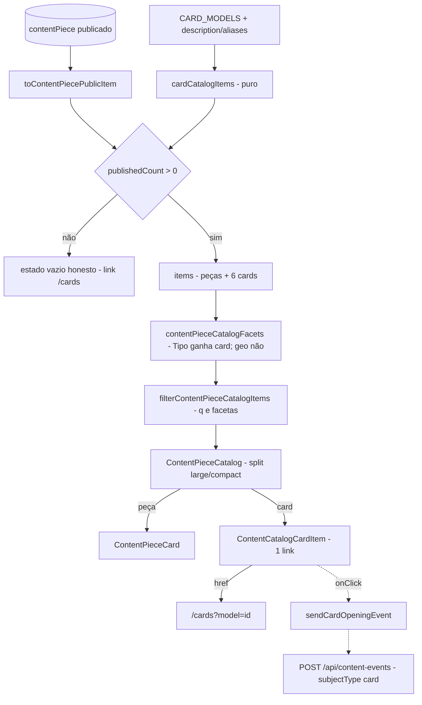

# Impl: S38 — Central de Conteúdos — cards personalizáveis como itens do catálogo

Status: aprovado
Atualizado em: 2026-09-24
Issue: #1304
Intenção: docs/plans/central-conteudos-cards-no-catalogo.md
Appetite restante: herdado (~1–1,5 dia eng). Distribuição: Fase 1 ~0,4 · Fase 2 ~0,45 · Fase 3 ~0,15 · Fase 4 ~0,1. Corte nomeado: a **Fase 3 (analytics da abertura)** é a primeira a sair se a janela apertar — a aceitação de produto não a exige (guardrail diz "pode", não "deve"). Design UI (gate): `docs/plans/central-conteudos-cards-no-catalogo-ui-design.html`.

## Leitura da intenção

- **Outcome:** os 6 modelos de card viram itens próprios do catálogo, **misturados aos demais, sem seção**, encontráveis pelo nome, pelos apelidos ("santinho" → `time-de-voce` + `minha-colinha`, "foto de perfil" → `perfil-quadrado` + `perfil-retangular`, "colinha" → `minha-colinha`, "estadual" → `time-do-estadual`) e pelo filtro Tipo "Card", cada um levando a `/cards?model=<id>` com o modelo já escolhido; o tile único morre.
- **O que NÃO negociar:** card não é peça (sem linha no banco, sem mídia, sem publicação/kill switch, sem `id`); sem seção/cabeçalho próprio de cards; sem faceta geográfica para card (com Cidade/Região/Instituição ativos, somem); busca/filtros funcionam sem JS; estúdio `/cards` intocado (foto 100% no aparelho, sem PII/`Consent` novo); catálogo sem peça publicada mantém o estado vazio honesto com o caminho para `/cards`; nenhum segundo analytics (só o mecanismo anônimo do C213/S32, se (c) aceita); URL pública do catálogo e shape `ContentPiecePublicItem` intactos.
- **O que reavaliar (confirmado no código):**
  - "a injeção acontece no loader" — **confirmado**: `loadContentPieceCatalogSearch` (`src/utilities/content/contentPieceThemeSearch.ts:62-111`) é o ponto único onde `publishedCount`/`facets`/`items` nascem, depois do tema.
  - "facetas derivam só dos itens" — **confirmado** (`contentPieceCatalog.ts:155-185`): sem card alimentando `tipos`, `?tipo=card` não renderiza o chip "Tipo" e o filtro ativo cairia no valor cru (`:200`).
  - "(c) é extensão aditiva pequena" — **confirmado**: `'abertura'` e `'card'` já existem no vocabulário (`contentEvents.ts:19-49`) e no select da collection (`ContentEvent.ts:52-71`) ⇒ **zero migration**; falta só a variante estrita na schema, o branch da rota (hoje o branch de card exigiria picker e devolveria 400 em `route.ts:99-107`) e o sender.
  - "reusar `CardModelTile`" — **rejeitado**: exige `fontFamily` do estúdio (brexterBold só em `/cards`, `page.tsx:35`) e desenharia "SEU NOME" sobre o master; o artefato (cena 01) mostra a arte base, então o item porta a arte real por `kind` (ver D5).
  - "arte real por modelo basta" — **corrigido**: `perfil-quadrado`/`perfil-retangular` não têm `previewSrc` e seu `assetSrc` é a moldura oficial com janela transparente (`photo-square-frame.png`, `photo-portrait-frame.png`); o artefato (cena 03) mostra placeholder neutro com forma tracejada — a regra de arte é por `kind` (ver D5).

## Abordagem recomendada

**Opções consideradas (forma geral):** A) união discriminada de itens sintéticos (`ContentCatalogItem = ContentPiecePublicItem | CardCatalogItem`), injeção no loader único e componente próprio no board | B) cards no shape de peça com campos fake e reuso do `ContentPieceCard` | C) galeria/seção própria de cards (ou rota nova).
**Recomendação:** A — atende "misturado, sem seção" pelo mesmo pipeline de facetas/busca (S28), não cria linha/migration (guardrail) e mantém `ContentPiecePublicItem` e todos os seus consumidores intactos.
**Rejeitadas:** B porque forçaria branches no card de peça (Baixar/Compartilhar/detalhe/`playingId`/`contentPieceMediaKind`, que classificaria card como `image`) e campos fake violariam "não é peça"; C porque o gate cortou a seção e a intenção veda rota/segunda galeria.

### Decisões de engenharia

#### D1 — Modelagem do item sintético

**Opções:** A) união discriminada com marcador só no card (`itemKind: 'card'`, guard `isCardCatalogItem`), sem `id` numérico | B) discriminador `kind: 'piece' | 'card'` nos dois lados da união (altera `ContentPiecePublicItem`) | C) um único shape de peça com campos sintéticos/fake (`id` numérico, `slug`, `file: null`, `cityLabel: null`, `type: 'card'`).
**Recomendação:** A — zero ripple em `ContentPiecePublicItem` (página da peça, share sheet, `ContentPieceCard`, fixtures e pins de peça não mudam); o card não tem `id`/`slug`/`file`, então o board não consegue tratá-lo como peça por acidente (`playingId: number`, `sharingItem` e as ações de `ContentPieceCard.tsx:136-172` ficam peça-only); o narrowing aparece em 3 pontos (filtro, facetas, board) via `isCardCatalogItem`.
**Rejeitadas:** B porque o discriminador obrigatório toca `toContentPiecePublicItem`, `ContentPieceDetail`, `ContentPieceShareSheet` e dezenas de fixtures sem eliminar branch algum; C porque `id` numérico colide com keys/`playingId`, `contentPieceMediaKind` classificaria o card como `image` e as ações de arquivo apareceriam — o rabbit hole "já que virou item, vira peça".

#### D2 — Dono dos apelidos e mini-descrições

**Opções:** A) estender `CardModel` (dono) com `description: string` e `aliases: readonly string[]` obrigatórios, preenchendo os 6 em `CARD_MODELS` | B) módulo novo `src/lib/contentCatalogCards.ts` com mapa paralelo id→copy | C) campos opcionais com fallback no builder.
**Recomendação:** A — a copy é dado do modelo (nasce/morre com ele); obrigatório faz o typecheck exigir os 6 completos (aceite: "nome, explicação curta e arte") e o unit test pina os literais; a extensão é aditiva: nenhum consumidor atual (`CardModelGallery`, `CardModelTile`, `CardComposer`, `cardRender`) lê os campos e `tests/unit/cardModels.unit.spec.ts:14-191` segue verde.
**Rejeitadas:** B é gêmeo de catálogo (duas listas para o mesmo id, contra "edit the owner, don't twin"); C deixaria um 7º modelo entrar sem descrição/apelido em silêncio.

Literais do design (verbatim):

| modelo              | `label` (já existe) | `description` (nova)              | `aliases` (novos)     | arte do item                    |
| ------------------- | ------------------- | --------------------------------- | --------------------- | ------------------------------- |
| `eu-sou-solla`      | Card com seu nome   | Coloque seu nome no card oficial. | `nome`                | real (`assetSrc`)               |
| `perfil-quadrado`   | Moldura quadrada    | Foto de perfil quadrada.          | `foto de perfil`      | placeholder neutro (kind photo) |
| `perfil-retangular` | Moldura vertical    | Foto vertical para stories.       | `foto de perfil`      | placeholder neutro (kind photo) |
| `time-de-voce`      | Time de você        | Entre para o time com sua foto.   | `santinho`            | real (`previewSrc`)             |
| `time-do-estadual`  | Time do estadual    | Escolha o estadual e personalize. | `estadual`            | real (`previewSrc`)             |
| `minha-colinha`     | Minha colinha       | Monte sua cola de votação.        | `santinho`, `colinha` | real (`previewSrc`)             |

#### D3 — Onde a injeção acontece e como as facetas veem `card`

**Opções:** A) funções puras em `contentPieceCatalog.ts` (`cardCatalogItems()` + spread no loader) chamadas por `loadContentPieceCatalogSearch` entre o tema e `facets`/`filter` | B) montar itens/facetas na página `(catalog)/page.tsx` | C) devolver cards da leitura `contentPieceReads.ts`, junto das linhas.
**Recomendação:** A — o loader é o dono do pipeline e o único ponto testado por int; a injeção é condicionada a `publishedItems.length > 0` e **`publishedCount` continua contando peças** (`publishedItems.length`), então o early-return de `page.tsx:96-106` e a expansão de tema (gate `:87`) nunca são acionados por card; as facetas recebem `ContentCatalogItem[]` e o branch de card adiciona **só** `'card'` ao conjunto de `tipos` (`contentPieceCatalog.ts:155-185`), nunca cidade/região/instituição/tema — por isso `?tipo=card` rende o chip "Tipo · Card" (`:200`) e a faceta geográfica exclui cards sozinha no filtro (`:252-263`); a ordem é determinística (peças, depois cards) — não há sinal de ranking para inventar.
**Rejeitadas:** B duplicaria facetas/filtro na página e mataria o ponto único já pinado por int (`tests/int/contentPiece.int.spec.ts:948-1059`); C contamina o read cacheado (afetaria `hasPublishedContentPieces`, a metadata e a página da peça) e flerta com "linha no banco", que a intenção proíbe.
**Nota (barata de reverter):** cards entram na mesma regra OR do modo tema (q literal sempre; termos expandidos sem badge de tema). Se produto achar card fora de contexto no `mode=tema`, o único ponto a restringir é o branch de card no filtro — gatilho de revisitação registrado.

#### D4 — Analytics da abertura (questão (c))

**Opções:** A) incluir a abertura de card (`type: 'abertura'`, `subjectType: 'card'`, `subjectId = model.id`) como 3ª variante estrita do `POST /api/content-events` + sender fire-and-forget no clique | B) deferir (Não escopo com gatilho) | C) contar como peça (slug sintético).
**Recomendação:** A — custo real medido: **zero migration** (o select já aceita `abertura`/`card`); a schema ganha ~10 linhas (`{ type:'abertura', subjectType:'card', cardModelId }`, sem `stateDeputySlug` — o visitante ainda não escolheu estadual); a rota ganha um branch de abertura que valida só o modelo (sem picker — hoje `route.ts:99-107` devolveria 400) e reusa `recordContentEvent`; o sender é gêmeo estrutural de `sendCardDownloadEvent` sobre o mesmo `postContentEventBody` fail-soft (`contentEvents.ts:80-129`); o contador da home filtra `type === 'download'` (`cardDownloadCounts.ts:24,48`), então abertura **não** infla "Downloads". O label admin `contentEventTypeLabels.abertura` ("Abertura da peça") passa a "Abertura" — o mesmo tipo agora serve peça e card, e o `subjectType` já desambigua a coluna. O pin que hoje recusa `abertura` de card (`tests/int/contentEvents.int.spec.ts:456-459`) é atualizado no mesmo PR — o contrato mudou por decisão desta entrega.
**Rejeitadas:** B porque a extensão é pequena e a intenção recomenda (c)=A; C porque inventaria assunto de peça para um card ("nunca como peça") e poluiria os contadores de circulação.

#### D5 — Componente do item no board

**Opções:** A) `ContentCatalogCardItem` próprio, no bucket "large" (3-col no desktop) com responsivo mobile de linha 128px, o item inteiro um único `<a href="/cards?model=<id>">` e a CTA como affordance visual | B) reusar `ContentPieceCard` com branches por tipo de item | C) bucket "compact" (2-col de linhas no desktop).
**Recomendação:** A — card não tem Baixar/Compartilhar/detalhe/`themeMatch`; o bucket large é o card cheio de 3 colunas do artefato (cenas 01/03) — o compact renderiza linhas horizontais em 2 colunas, fora do desenho; o `<a>` único resolve as cenas em que o artefato omite a CTA (cena 02, 2º phone; cenas 04–05) e é alvo de tap no mobile, funcionando sem JS; a CTA visível ("Escolher este modelo →" no desktop, "Escolher →" no mobile) é o affordance. Reusa `CONTENT_PIECE_CARD`/`CONTENT_PIECE_TAG`/`CONTENT_PIECE_OUTLINE_BUTTON`/`CONTENT_PIECE_FOCUS` (`contentPieceClasses.ts:1-39`), selo `badge` (pill sobre a arte, como o `CardModelTile.tsx:71-75`) e `data-card-model={modelId}` para e2e. Split: `isCardCatalogItem(item)` → `largeItems`; key `card:<modelId>` para card, `item.id` para peça.
**Regra de arte (por `kind`, fiel ao artefato):** `photo` (quadrada/vertical) → arte neutra clara com a forma tracejada central do artefato (cena 03; o `assetSrc` é moldura com janela transparente, não uma arte preenchida) — sem `next/image`; os demais `kind` → `next/image` com `previewSrc ?? assetSrc` (arte real existente). O header da página (contador/"Resultados do filtro aplicado") fica como está: o artefato ilustra contexto e o aceite não pede contador — copy fora do escopo.
**Rejeitadas:** B porque os branches de card vazariam no card de peça (tag, ações, mídia) sem ganho; C porque diverge do artefato no desktop e enfraquece o CTA; `CardModelTile` no catálogo porque exige `fontFamily`/canvas de nome do estúdio; moldura real sobre slot neutro porque o artefato aprovado desenha placeholder neutro.

#### D6 — Pins de teste (o que morre, o que vira)

**Opções:** A) atualizar os pins que quebram e adicionar pins novos de busca/faceta/geo/deep-link/evento | B) deletar os pins do tile e confiar só no e2e | C) criar suíte paralela de catálogo.
**Recomendação:** A — pins que mudam: `tests/e2e/frontendConteudos.e2e.spec.ts:196` (invite 1 → 6 cards `[data-card-model]`), `:257` (filtro `tipo=video` → 0 cards), `:495` (kill switch → 0 cards além de 0 peças), `tests/int/contentPiece.int.spec.ts:948-1059` (filtrar `isCardCatalogItem` antes de comparar ids de peça; cards nas asserções de `tipo=card`), `tests/unit/contentPieceCatalog.unit.spec.ts:188-215` (mesmo narrowing) e `tests/int/contentEvents.int.spec.ts:456-459` (abertura de card: 400 → 204). Novos: unit do builder/filtro/facetas/apelidos e do schema/beacon; int da rota + do loader; e2e do item (busca "santinho"/"foto de perfil", `tipo=card`, geo somem, clique → `/cards?model=...` com o composer aberto e beacon de abertura).
**Rejeitadas:** B perde a prova barata de domínio (o CI de PR roda e2e `selected` e o `verify` do deploy é caro); C é cerimônia — a suíte do catálogo já é a dona.

### Componentes / mudanças

- **`CardModel`** (`src/lib/cardModels.ts:42-74`): `description: string` e `aliases: readonly string[]` obrigatórios (doc: copy/apelidos do item no catálogo); `CARD_MODELS` (`:76-148`) preenchido com a tabela do D2; pin novo em `tests/unit/cardModels.unit.spec.ts`.
- **`CardCatalogItem` / `ContentCatalogItem` / `isCardCatalogItem`** (`src/lib/contentPieceCatalog.ts`, junto de `ContentPiecePublicItem:291-320`): `{ itemKind:'card'; modelId: CardModelId; title; description; aliases; badge: string|null; kind: CardModelKind; artSrc: string | null; href; searchText }` — `searchText` cru (`[label, ...aliases, description].join(' ')`), normalizado no match como na peça; união `ContentPiecePublicItem | CardCatalogItem`.
- **`cardCatalogItems()`** (novo, puro, mesmo módulo): mapeia `CARD_MODELS`; `artSrc = kind === 'photo' ? null : (previewSrc ?? assetSrc)`; `href = /cards?model=<id>` (deep link já validado em `src/app/(frontend)/(home)/cards/page.tsx:26-27`).
- **`filterContentPieceCatalogItems`** (`:245-269`): passa a `readonly ContentCatalogItem[]`; branch de card: `params.tipo && params.tipo !== 'card'` → fora; qualquer `cidade|regiao|tema|instituicao` → fora; `q`/termos via `normalizeForSearch(item.searchText).includes(term)`.
- **`contentPieceCatalogFacets`** (`:155-185`): branch de card adiciona só `'card'` a `tipos` (sem geo/tema); header do módulo atualizado.
- **`loadContentPieceCatalogSearch`** (`src/utilities/content/contentPieceThemeSearch.ts:78-110`): `catalogItems = publishedItems.length > 0 ? [...publicItems, ...cardCatalogItems()] : publicItems`; `publishedCount: publishedItems.length` (doc: peças, não cards); `facets`/`items` sobre a união.
- **`ContentPieceCatalog`** (`src/components/conteudos/ContentPieceCatalog.tsx:18-72`): `items: readonly ContentCatalogItem[]`; remove `showCardInvite`; card entra em `largeItems`; render `<ContentCatalogCardItem>` para card e `<ContentPieceCard>` para peça; keys por `card:<modelId>`/`item.id`.
- **`ContentCatalogCardItem`** (novo, `src/components/conteudos/`): `<a>` único, responsivo `grid grid-cols-[128px_1fr] sm:block`, arte real (`next/image`, `previewSrc ?? assetSrc`) ou placeholder neutro tracejado para `kind === 'photo'`, selo `badge`, tag `Card` (`contentPieceTypeLabels.card`), título, `description`, chips de `aliases`, CTA, `data-card-model`, `onClick` → `sendCardOpeningEvent(modelId)`.
- **`ContentPieceCardInvite`** (`:16-44`): deletado; `page.tsx:108,152-162` perde `hasActiveFilters`/`showCardInvite` (o estado vazio e o "Fazer meu card" de `ContentPieceStates.tsx:28` ficam).
- **Analytics (Fase 3):** `src/lib/schemas/contentEvent.ts:34-44` (3ª variante estrita), `src/app/(frontend)/api/content-events/route.ts:93-116` (branch de abertura sem picker), `src/lib/contentEvents.ts:29-34,111-129` (+`sendCardOpeningEvent`; label `abertura` → "Abertura").
- **Manifest e2e** (`scripts/lib/e2e-affected-manifest.mjs:153-180`): + `'src/lib/cardModels.ts'` e `'src/lib/schemas/contentEvent.ts'` na entrada `frontendConteudos` (o `src/lib/schemas` genérico só acorda `frontend`/campaign\*; `src/lib/card` já acorda `frontend`).
- **Migration:** nenhuma — nenhuma collection/field muda; `abertura`/`card` já são opções válidas de `contentEvent`.
- **Access / Consent:** nenhum access novo e nenhuma escrita nova além do evento anônimo já existente (rota same-origin + rate-limited + bypass justificado em `contentEventWrite.ts:42-55`); sem PII, sem `Consent` (foto segue no aparelho; `cards/page.tsx` e `CardComposer` intocados).
- **UI:** Impeccable B — port do artefato aprovado (`central-conteudos-cards-no-catalogo-ui-design.html`); classes/shells existentes; sem token novo; sem seção/faixa de cards.

### Dados → forma

Não aplicável — a intenção decidiu que o item não apresenta número/contador (é roteador para o estúdio); nenhuma tabela/gráfico. O único dado produzido é o evento anônimo de abertura, lido depois pelo mecanismo existente do C213/S32 (nenhuma superfície de leitura nova nesta entrega).

## Fases verificáveis

1. **Fase 1 — puro + loader (tracer, ~0,4 dia):** campos em `cardModels.ts`; união/builder/guard no `contentPieceCatalog.ts`; branches de filtro/facetas; injeção no loader com `publishedCount` preservado. Unit novo (`contentPieceCatalog` + `cardModels`) e pins unit/int ajustados. Prova: `pnpm test:unit` e `pnpm test:int` verdes; o loader devolve peças + 6 cards em `?tipo=card` e 0 cards com geo ativa.
2. **Fase 2 — board/UI + tile morto (~0,45 dia):** `ContentCatalogCardItem`; split/key no `ContentPieceCatalog`; remoção de `showCardInvite`/`ContentPieceCardInvite`; limpeza da página; e2e do catálogo atualizado (invite→cards, kill switch, `tipo=card`, geo, buscas por apelido, clique → `/cards?model=...`). Prova: `pnpm test:e2e tests/e2e/frontendConteudos.e2e.spec.ts` (ou `pnpm test:e2e:affected`) verde; sem regressão visual pelo port fiel do artefato.
3. **Fase 3 — analytics da abertura (~0,15 dia, cortável):** variante estrita na schema; branch de abertura na rota; `sendCardOpeningEvent` + `onClick`; label admin; atualização do pin de recusa; unit/int/e2e do beacon; linha do manifest. Prova: `pnpm test:int` + beacon observado no e2e do clique.
4. **Fase 4 — gates (~0,1 dia):** `pnpm gate:fast`; `pnpm test:int`; e2e afetados locais (`pnpm test:e2e:affected`); `pnpm lint`, `pnpm format:check`, `pnpm exec knip`, `pnpm check:cycles`; entrada `docs/changelog/2026-09-24-s38.md` (additions-only); `pnpm push`; PR ready com CI verde.

## Rabbit holes / Não escopo (engenharia)

- **Card virar peça:** collection/migration/mídia/publicação/kill switch — item sintético; se a comunicação quiser copy editável sem deploy, vira peça publicada (gatilho herdado do D6 do S27), fora deste item.
- **Baixar/gerar card no catálogo:** canvas/ffmpeg/servidor, foto fora do aparelho — fora; o item só linka para `/cards`.
- **SEO/página/OG por card**, rota nova, sitemap, segunda galeria — fora.
- **`CardModelTile`/`fontFamily`/brexterBold no catálogo** e canvas de nome no item — fora (imagem estática).
- **Facetas próprias de card** (tema/cidade por card) e temas declarados — fora (v1 sem tema).
- **Ranking/relevância/ordenação editorial** dos cards — fora (append determinístico, sem sinal de relevância).
- **Contador de resultados / copy nova do header do board** — fora; o artefato ilustra contexto e o aceite não pede contador.
- **Dashboard/segundo analytics** das aberturas — fora; a Fase 3 só grava no mecanismo existente.
- **Restringir cards a `q` literal no modo tema** — não nesta entrega; o branch de card é o ponto único de revisão (nota no D3).

## Riscos e mitigação

- **`publishedCount` perder a semântica de peças** (alguém "simplificar" para `catalogItems.length` mataria o estado vazio e o guardrail). Mitigação: pin int (zero peças ⇒ `publishedCount === 0` e nenhum card em `items`) + e2e do kill switch.
- **Cobertura/manifest e2e:** `src/lib/schemas/contentEvent.ts` é área de risco (`E2E_RISK_PREFIXES`) e o entry genérico só acorda `frontend`; adicionar ao entry do catálogo no mesmo PR e rodar `pnpm test:e2e:affected` (wakes `frontendConteudos` + `frontend`) antes do push.
- **E2E serial com janela global:** `frontendConteudos` roda `serial` e assume zero/um publicado por teste; manter as novas asserções dentro dos testes que já controlam `unpublishEveryPiece`, sem novo teste que mute publicação global.
- **Ruído do alias "nome"** (`eu-sou-solla`): a busca é `includes` normalizado (S28), então "nome" surfará peças com a palavra — o card aparece junto; sem mudança de contrato de busca; se virar problema, o ajuste é no `searchText` do card (aditivo).
- **Conflito com #1277** (`escala-dry-pos-s30`, `components/cards/CardComposer.tsx`/`StateDeputySelect.tsx`): aqui não tocamos `components/cards` (só `cardModels.ts` dados); sem sobreposição; rebase se lá também tocar `cardModels.ts`.
- **Regressão visual do board** (card no bucket large com responsivo pode alterar o ritmo do mobile): port fiel do artefato; se o markup desviar da estrutura visual, aciona a crítica do `designer` (gate B).
- **Acessibilidade do link único:** nome acessível concatena tag+título+descrição+apelidos+CTA; sem interativo aninhado (apelidos são spans) e foco no card inteiro via `CONTENT_PIECE_FOCUS`; testes usam regex no título. Se o gate reprovar, o fallback é título como segundo link além da CTA — decisão cosmética reversível.

## Aceite de engenharia

- [ ] Aceite de produto da intenção coberto: 6 modelos como itens próprios, sem seção; "santinho" → 2 itens; "foto de perfil" → 2; "colinha" → 1; "estadual" → 1; Tipo "Card" → 6 (+ peças de tipo card, se publicadas, com comportamento normal); geo ativa → 0 cards; item → `/cards?model=<id>`; tile morto; estado vazio intacto.
- [ ] Invariantes AGENTS/engineering-standards: sem collection/migration/Consent/PII; `ContentPiecePublicItem` e URLs do catálogo intactos; copy pt-BR/identificadores EN; dead code (`ContentPieceCardInvite`, `showCardInvite`) removido no mesmo PR; sem `as never`.
- [ ] Testes de domínio: unit (builder/filtro/facetas/apelidos/schema/beacon), int (loader/facetas/rota), e2e (catálogo + clique); pins existentes atualizados; `pnpm gate:fast` + `pnpm test:int` + e2e afetados verdes.
- [ ] **PARADA OBRIGATÓRIA: nenhuma.** Auditoria: sem Consent/LGPD, sem migração de schema, sem mudança de contrato de URL público (o deep link `/cards?model=<id>` já existe e é reusado), sem mudança de shape público de dados, sem tocar produção/DB de prod/merge sem CI. A única ampliação de contrato é aditiva (3ª variante estrita do evento, anônima), com o pin S32 atualizado no mesmo PR.

## Self-score (decision-quality, gate ≥4)

1. **Decisões caras com rejeitadas — 5/5:** D1–D6 no formato Opções/Recomendação/Rejeitadas; a modelagem do item e a ampliação do evento (as duas caras de reverter) têm rejeitadas explícitas e mecanismo de reversão nomeado.
2. **Cabe no appetite — 4/5:** sem migration, sem rota, sem collection; ~1–1,5 dia com a Fase 3 nomeada como corte primeiro se estourar.
3. **Rabbit holes nomeados — 5/5:** os cinco de produto (peça, download, SEO, tema/cidade, medir pessoa) e os de engenharia (shape fake, canvas, facetas próprias, ranking, segundo analytics, contador de header) com corte explícito.
4. **Depth check / reuso — 5/5:** edita os donos (`contentPieceCatalog` para filtro/facetas, `cardModels` para modelos, `loadContentPieceCatalogSearch` como ponto único, `contentEvents`/rota para o evento), reusa classes de `contentPieceClasses` e o deep link existente; nenhum gêmeo, nenhum pass-through.
5. **Intenção preservada — 5/5:** o outcome não foi reescrito; a engenharia só escolheu a forma (união discriminada, injeção no loader, item próprio) e manteve todos os guardrails — inclusive "sem linha no banco" (injeção só na memória do request).

Média ≈ 4,8/5 — acima do gate.
