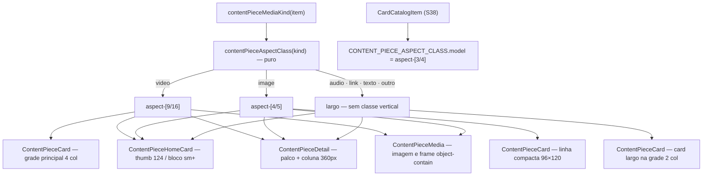

# Impl: S45 — Central de Conteúdos — cards verticais no catálogo e na seção da home

Status: aprovado
Atualizado em: 2026-10-01
Issue: #1410
Intenção: docs/plans/central-conteudos-cards-verticais.md
Appetite restante: herdado (~1–2 dias eng). Distribuição: Fase 1 ~0,3 · Fase 2 ~0,6 · Fase 3 ~0,4 · Fase 4 ~0,2. Corte nomeado: o card largo em linha (D4) é o primeiro a cair — a grade larga de 2 colunas permanece e o áudio/link volta à mídia no topo. Design UI (gate): `docs/plans/central-conteudos-cards-verticais-ui-design.html`.

## Leitura da intenção

- **Outcome:** no catálogo `/conteudos` (cards full, compactos e itens sintéticos S38), na seção da Central na home e na página da peça, a peça vertical aparece inteira na forma do tipo — Reel 9:16, foto 4:5, modelo 3:4 — e a peça horizontal aparece inteira, em letterbox na superfície neutra; o board deixa de ser uma parede de thumbs 16:9 e o eleitor reconhece a peça antes de tocar.
- **O que NÃO negociar:** sem rota/tela/player/galeria novos; sem migration/schema/ffprobe (a v1 decide pelo tipo, nunca pela dimensão real); mídia só no toque (sem autoplay, sem `preload`); filtros, busca, ações, copy, kill switch e o beacon C213 intocados; itens S38 continuam item-convite para `/cards` (sem cromo de mídia, sem download/share); C228 fora (play 56/44 e cromo atuais); demais seções da home, shell/nav e ficha interna da campanha intocados; overflow horizontal a 390 ≤1 px; `ContentPiecePublicItem`, URLs públicos e `/cards?model=` intactos.
- **O que reavaliar (hipóteses confirmadas no código):**
  - "o slot não tem ratio próprio; o ratio vem do `className` do host" — **confirmado** (`ContentPieceMedia.tsx:110-126`); a forma será mapeada no dono `contentPieceCatalog.ts` (junto de `contentPieceMediaKind:544`) e aplicada por cada host.
  - "large = video/audio/link; compact = image/text/other" — **confirmado** (`ContentPieceCatalog.tsx:47-49`); o artefato (cena 01) separa áudio/link numa grade larga e pede 4 colunas para o board principal ⇒ três buckets, não dois.
  - "a cena 01 desenha um card de foto cheio no board principal" — **leitura do gate:** a decisão A manda a foto compacta **permanecer na linha**; a cena 01 informa a forma 4:5 (o card cheio é a referência de proporção do thumb 96×120) e o board principal é vídeo + modelos. O e2e vigente pina a foto como linha compacta (`frontendConteudos.e2e.spec.ts:302-304`).
  - "o frame stub 320×180 e o comentário 'same 16:9 box' seguram o e2e" — **confirmado** (`tests/e2e/frontendConteudos.e2e.spec.ts:215-226,335`); o contain no palco 9:16 exige atualizar o comentário e adicionar os pins de geometria.
  - "há token neutro pronto" — **corrigido:** não existe `neutral-stage`; a superfície neutra é `--campaign-band` #ebe9e9 (`src/app/(frontend)/styles.css:185`), já base do slot — sem token novo.
  - "os itens S38 cortam a arte" — **confirmado** (`object-cover object-top`, `ContentCatalogCardItem.tsx:43-49`); palco 3:4 + contain resolve.

## Abordagem recomendada

**Opções consideradas (forma geral):** A) mapear a forma por tipo num helper puro no dono (`contentPieceCatalog.ts`) aplicado pelos hosts, com o catálogo em três buckets (principal 4 col, larga 2 col, compacta 2 col), contain na imagem/frame e palco do detalhe por tipo | B) classes inline em cada host, mantendo os dois buckets e só trocando o ratio 16:9 | C) ratio interno no `ContentPieceMedia` por `variant` + masonry/altura variável por peça.
**Recomendação:** A — é o artefato (cenas 01/03/04/05/06/07) e o único desenho em que áudio/link ficam largos sem virar blocos 16:9 estreitos; o mapa é reusado por 3 hosts reais (card full, home card, detalhe) + o item S38, e o contain é consequência direta do letterbox.
**Rejeitadas:** B porque deixa o board principal como parede de 16:9 (áudio/link incluídos) e duplica o mapa de forma em três hosts; C porque o sizing é host-dependent (thumb 96×120, coluna 360px do detalhe, bloco da home) e o item S38 nem usa o `ContentPieceMedia` — o ratio interno engessaria hosts futuros; masonry é vetado pela intenção.

### Decisões de engenharia

#### D1 — Como a forma por tipo é expressa (helper puro × inline × ratio interno)

**Opções:** A) tabela + função puras no dono (`src/lib/contentPieceCatalog.ts`, junto de `contentPieceMediaKind:544`): `CONTENT_PIECE_ASPECT_CLASS = { video: 'aspect-[9/16]', image: 'aspect-[4/5]', model: 'aspect-[3/4]' }` e `contentPieceAspectClass(kind)` → `video`/`image` ou `undefined` (largo) | B) módulo novo `src/lib/contentPieceAspect.ts` | C) ratio interno no `ContentPieceMedia` por `kind` + classes inline nos demais hosts | D) classes inline em cada host.
**Recomendação:** A — o dono do `kind` é `contentPieceMediaKind` e o unit do catálogo (`tests/unit/contentPieceCatalog.unit.spec.ts`) já cobre o módulo; o manifest e2e (`scripts/lib/e2e-affected-manifest.mjs:170-201`) já acorda `frontendConteudos` pelo prefixo `src/lib/contentPieceCatalog`; 3 call sites reais usam a função (card full, home card, detalhe) e o S38 lê a entrada `model` (4º call site) — depth check satisfeito. O 3:4 do modelo **não** entra na função de media kind (não é `ContentPieceMediaKind`); é lido da tabela pelo host do S38.
**Rejeitadas:** B é pass-through de ~8 linhas ao lado do dono, exigiria prefixo novo no manifest e arquivo de teste próprio; C engessa hosts com sizing diferente e não cobre o S38 (que não usa o slot); D duplica a tabela em 3 hosts e garante drift (alguém corrige só o card).

#### D2 — `object-cover` → `object-contain` na imagem e no frame

**Opções:** A) `contain` nos dois (`ContentPieceMedia.tsx:190` imagem; `:277` frame), mantendo o player já `contain` (`:235`) | B) manter `cover` na imagem (foto de feed 4:5 "casa" com o slot) e `contain` só no frame | C) decidir por dimensão real (ffprobe/migration).
**Recomendação:** A — é a consequência direta de "nunca corta": foto 4:5 em slot 4:5 continua preenchendo (contain = cover no mesmo ratio), a horizontal ganha letterbox na `--campaign-band` e o frame do C226 (16:9) aparece inteiro no palco 9:16.
**Rejeitadas:** B quebra o aceite para foto horizontal (recorte); C é vetado pela intenção (v1 por tipo).
**Efeito nos testes:** o unit `contentPieceMedia.unit.spec.tsx` não pina `object-cover` hoje ⇒ adicionar pin de `object-contain` na imagem e no frame; o e2e ganha `toHaveCSS('object-fit', 'contain')` e o comentário "same 16:9 box" (`:335`) vira "same 9:16 box".

#### D3 — Buckets e densidade do catálogo (4 colunas · grade larga · linha compacta)

**Opções:** A) três buckets no `ContentPieceCatalog`: principal (vídeo intercalado com modelos S38, `sm:grid-cols-2 lg:grid-cols-4`), larga (áudio + link, `sm:grid-cols-2`) e compacta (imagem/texto/outro, `sm:grid-cols-2`), todas com `items-start` e `gap-5` | B) manter dois buckets e só mudar a grade large para 4 colunas | C) masonry/altura variável por peça.
**Recomendação:** A — é o artefato (cena 01: principal 4 col; áudio/link largos em 2; compacta mantém a linha; "Grade: 4 colunas · gap 20px"); `interleaveCatalogItems` continua só no principal (modelos não pertencem à grade larga); `items-start` impede o stretch de igualar alturas diferentes; o skeleton `(catalog)/loading.tsx:8-15` acompanha (4 col, mídia 9:16) por ser a mesma superfície.
**Rejeitadas:** B — áudio/link 16:9 em 4 colunas viram blocos estreitos e o vídeo vertical domina a linha (o artefato separa); C é vetado pela intenção ("não vira masonry nem grade de altura variável").
**Nota:** texto/outro permanecem na linha compacta — a própria linha é larga; o artefato não traz cena de texto e o gate só separou áudio/link (cena 07 lida como "não vertical", não como "bloco largo").

#### D4 — Forma do card largo de áudio/link

**Opções:** A) linha larga do artefato: `grid min-h-[156px] grid-cols-[112px_minmax(0,1fr)] sm:min-h-[170px] sm:grid-cols-[190px_minmax(0,1fr)]`, mídia esticada à esquerda, corpo à direita, `ContentPieceMedia` no variant default, ações atuais | B) manter o card atual (mídia no topo, `aspect-video`) dentro da grade larga | C) card vertical.
**Recomendação:** A — "permanecem largos" (gate B) e o artefato desenha a linha (cena 01/02); reusa o card e as ações sem variant novo. Ajuste nomeado: o painel de plataforma (link) usa escala compacta no phone (`text-base sm:text-2xl`, em vez do `text-2xl` fixo de `ContentPieceMedia.tsx:166`) para "Instagram" caber na coluna de 112 px.
**Rejeitadas:** B diverge da cena 01 e desperdiça a largura; C é vetado pelo gate ("verticalizá-los produziria vazio sem ganho").
**Corte nomeado do appetite:** se a janela apertar, B é o corte (a grade larga permanece); a crítica do designer decide se a linha volta depois.

#### D5 — Home: thumb mobile e bloco `sm+` por tipo

**Opções:** A) classe por `kind` no `ContentPieceHomeCard`: foto `aspect-[4/5] self-start`, vídeo `aspect-[9/16] self-start`, largo `max-sm:h-[156px] self-start sm:aspect-video`; grade de 3 colunas mantida + `items-start` | B) thumb único 4:5 para tudo | C) altura variável/masonry.
**Recomendação:** A — cena 04 (foto 4:5 · vídeo 9:16 · áudio 156 px) e cena 03 (bloco `sm+` com o mesmo ratio; áudio 16:9 largo); a grade `sm:grid-cols-2 lg:grid-cols-3` (`ContentPieceHomeBoard.tsx:241-245`) fica, ganhando `items-start` para as alturas diferentes não esticarem; o layout de peça única (`:176`) permanece e herda a forma do tipo.
**Rejeitadas:** B corta/achata o Reel; C é vetado.

#### D6 — Página da peça: palco por tipo e coluna de mídia

**Opções:** A) palco por tipo (`video` 9:16, `image` 4:5, largo `aspect-video`) e coluna fixa `lg:grid-cols-[360px_minmax(0,1fr)]` como a cena 05 | B) só trocar o ratio mantendo `lg:grid-cols-[1.2fr_.8fr]` | C) manter as colunas e capar o palco (`lg:max-w-[360px]`).
**Recomendação:** A — a cena 05 decide a coluna ("A coluna de mídia tem 360px no desktop e não cresce até dominar o texto"); com 1.2fr o palco 9:16 daria ~576×1024 e dominaria a página. É uma classe no grid do `ContentPieceDetail.tsx:53` (`lg:grid-cols-[360px_minmax(0,1fr)]`), mantendo `gap-8 lg:gap-10`; o host `max-w-5xl` (`[slug]/page.tsx:86`) fica.
**Rejeitadas:** B deixa o palco dominar; C cria duas regras de largura e o texto não ganha a largura liberada.

#### D7 — Item S38: arte 3:4 inteira sem mudar a semântica

**Opções:** A) `CONTENT_PIECE_ASPECT_CLASS.model` (`aspect-[3/4]`) na arte + `object-contain` no `next/image`; coluna mobile `112px`; placeholder, badge, `href` e semântica de convite intactos | B) manter `object-cover object-top` | C) palco 9:16 para todos os modelos.
**Recomendação:** A — cena 07 ("a arte real cabe inteira") e coerência do board; o item continua um único `<Link href={item.href}>` (`/cards?model=<id>`) com o beacon C213 no clique; o `sizes` do `next/image` acompanha a grade de 4 colunas (`(min-width: 1024px) 260px, (min-width: 640px) 45vw, 112px`).
**Rejeitadas:** B corta a arte (o defeito que a entrega corrige); C alonga as artes 3:4/1:1 (o artefato fixa 3:4).

#### D8 — WebKit `aspect-ratio` × spacer

**Opções:** A) `aspect-*` nos slots block/grid (card full, home card, detalhe, arte S38) e caixa fixa `h-[120px] w-24` no thumb da linha compacta (flex child) | B) spacer in-flow do `CardModelTile` (`CardModelTile.tsx:42-55`) em todos os novos slots | C) `aspect-*` inclusive no flex child.
**Recomendação:** A — o bug do WebKit #265243 é de **flex item** em relayout; o único flex child novo é o thumb compacto (`flex items-center` + `shrink-0`) e o artefato já o desenha como caixa fixa 96×120 — a caixa fixa elimina a classe do bug sem wrapper; nos demais contextos (block/grid) `aspect-*` é o que o repo já usa em produção (`CampaignStorySection.tsx:50-52`, `ReelLibraryCard.tsx:13`, `ContentPieceHomeCard.tsx:86` hoje).
**Rejeitadas:** B é cerimônia onde o bug não existe; C reintroduz a classe do bug de produção no único ponto flex.
**Gatilho de revisitação:** se a crítica em Safari/Orion mostrar colapso em algum slot, o fallback nomeado é o spacer do `CardModelTile` naquele slot.

#### D9 — Testes (unit do mapa, pins de contain, e2e de geometria)

**Opções:** A) unit do mapa puro no arquivo do dono + pins de `object-contain` no unit do media + pin de classe por kind no unit do board da home + bboxes/overflow nos testes e2e existentes | B) suíte nova de screenshot/visual regression | C) só ajustar o e2e que quebrar.
**Recomendação:** A — o mapa é contrato puro (unit barato); `contain` é uma classe (pin unit); o e2e mede os boxes (9:16 do vídeo, 96×120 da foto, 3:4 do modelo, 156 px do largo, palco 9:16/4:5 do detalhe) e o overflow a 390 do catálogo, **dentro dos testes que já criam as peças**, sem novo teste global.
**Rejeitadas:** B não há infra de snapshot no repo e o CI não roda e2e full (OPS72); C deixaria o aceite (geometria) sem prova.
**OPS72:** rodar os e2e afetados com `--workers=1` (ou a cadeia padrão de projetos) por causa da limitação de seed (`seedTestUser` colide com `--no-deps` + projetos paralelos).

#### D10 — Cromo e play (fechado, não decidir de novo)

**Opções:** A) não tocar em cromo: play atual (56/44), marcador, sombra, cores | B) puxar o cromo do C228 (play 68 px, acentos, badge, sombra) | C) autoplay no card.
**Recomendação:** A — C228 é só cromo do mesmo slot e o body manda fechá-lo antes de mexer no `ContentPieceMedia`; a superfície/cores atuais ficam (o cream do áudio na cena 01 é nuance cosmética, não portada — gatilho: crítica do designer).
**Rejeitadas:** B está fora de escopo e não bloqueia (cromo ≠ ratio); C quebra o contrato do S27 (mídia só no toque).

### Componentes / mudanças

- **`CONTENT_PIECE_ASPECT_CLASS` / `contentPieceAspectClass`** (`src/lib/contentPieceCatalog.ts`, junto de `contentPieceMediaKind:544`): tabela pura `video → aspect-[9/16]`, `image → aspect-[4/5]`, `model → aspect-[3/4]`; função `contentPieceAspectClass(kind): string | undefined` (áudio/link/texto/outro = `undefined` = largo). Classes literais (o Tailwind JIT varre `src/lib`). Unit novo no `contentPieceCatalog.unit.spec.ts`.
- **`ContentPieceMedia`** (`src/components/conteudos/ContentPieceMedia.tsx`): `object-cover → object-contain` na imagem (`:190`) e no frame (`:277`); painel do link responsivo (`text-base sm:text-2xl` em `:166`). Nada mais: play, marcador, durações e superfícies intocados.
- **`ContentPieceCard`** (`ContentPieceCard.tsx`): três formas — compacta (imagem/texto/outro) com thumb `h-[120px] w-24 shrink-0` (96×120 do artefato); full (vídeo) com `className={contentPieceAspectClass(kind)}` (9:16) no lugar de `aspect-video:143`; larga (áudio/link) com o grid de D4 e corpo `min-w-0 p-4` reusando tag/título/meta/evidência/ações (`:145-160`).
- **`ContentPieceCatalog`** (`ContentPieceCatalog.tsx:39-84`): três buckets; principal `interleaveCatalogItems(videoPieces, cards)`; grades `items-start gap-5 sm:grid-cols-2 lg:grid-cols-4` (principal) e `mt-6 items-start gap-5 sm:grid-cols-2` (larga/compacta); guardas `length > 0` mantidas.
- **`ContentPieceHomeCard`** (`ContentPieceHomeCard.tsx:74-87`): `className` por kind (D5) no lugar do `aspect-video self-start:86`.
- **`ContentPieceHomeBoard`** (`ContentPieceHomeBoard.tsx:241-245`): `items-start` na grade; mais nada.
- **`ContentPieceDetail`** (`ContentPieceDetail.tsx:53-61`): palco por kind + `lg:grid-cols-[360px_minmax(0,1fr)]`.
- **`ContentCatalogCardItem`** (`ContentCatalogCardItem.tsx:23-58,75`): arte `aspect-[3/4]` + `object-contain` (no lugar de `min-h-40 sm:aspect-video` e `object-cover object-top`), coluna mobile `112px`, `sizes` atualizado; `href`, badge, placeholder e beacon intactos.
- **Skeleton** (`src/app/(frontend)/conteudos/(catalog)/loading.tsx:8-15`): grade `lg:grid-cols-4` e mídia `aspect-[9/16]`, 4 itens.
- **Migration:** nenhuma — nenhuma collection/field muda.
- **Access / Consent:** nenhum — sem escrita nova, sem PII, sem rota de API.
- **UI:** Impeccable B — port do artefato aprovado (`central-conteudos-cards-verticais-ui-design.html`, cenas 01–07); sem token novo (band/cream existentes); sem seção/rota nova.
- **Manifest e2e:** sem mudança — `src/components/conteudos` e `src/lib/contentPieceCatalog` já acordam `frontendConteudos` (`scripts/lib/e2e-affected-manifest.mjs:170-201`).

### Dados → forma

Não aplicável — a intenção decidiu que não há dado novo (nenhum contador, série ou métrica); a forma é enquadramento visual por tipo e a "contagem" continua no beacon anônimo existente (C213), intocado.

## Fases verificáveis

1. **Fase 1 — mapa puro + contain (tracer, ~0,3 dia):** `CONTENT_PIECE_ASPECT_CLASS`/`contentPieceAspectClass` no dono; `object-contain` na imagem e no frame; unit do mapa (`contentPieceCatalog.unit.spec.ts`) e pins de contain (`contentPieceMedia.unit.spec.tsx`). Prova: `pnpm test:unit` verde; nenhuma UI nova ainda.
2. **Fase 2 — catálogo (grade, card largo, compacto, S38, skeleton; ~0,6 dia):** três buckets/`items-start`/`gap-5`; card largo de áudio/link; thumb 96×120; arte S38 3:4 contain; skeleton. E2E: peça de áudio no primeiro teste (2 → 3 artigos), bbox 9:16 do vídeo, 96×120 da foto, 3:4 do modelo, `object-fit: contain`, overflow 390 ≤1, comentário "same 9:16 box", painel do link na linha. Prova: `pnpm test:e2e --no-deps -- tests/e2e/frontendConteudos.e2e.spec.ts` (workers=1) verde e screenshots locais batendo com as cenas 01/02/06.
3. **Fase 3 — home + página da peça (~0,4 dia):** classe por kind no `ContentPieceHomeCard` + `items-start` no board; palco/coluna 360 do detalhe; pin de classe por kind no `contentPieceHomeBoard.unit.spec.tsx`; e2e da home (foto 4:5, vídeo 9:16, overflow já existente) e da página da peça (palco 9:16 com frame contain e largura 360; foto 4:5). Prova: e2e verde; cenas 03/04/05 conferidas.
4. **Fase 4 — gates (~0,2 dia):** `pnpm gate:fast`; `pnpm test:int` (nada de domínio mudou, mas roda); `pnpm test:e2e:affected` (OPS72: `--workers=1`); entrada `docs/changelog/2026-10-01-s45.md`; `pnpm push`; PR ready com CI verde e crítica do designer (trigger c).

## Rabbit holes / Não escopo (engenharia)

- **Dimensão real / ffprobe / width-height / migration:** v1 é por tipo; adaptativa é decisão futura, não requisito.
- **Masonry / altura variável por peça:** uma forma por tipo, grade fixa.
- **Cromo C228** (play 68, acentos, badge, sombra) e qualquer polimento do slot; superfície/cream do áudio.
- **Autoplay/preload no card** — mídia só no toque.
- **Filtros, busca, tema, facetas, copy, kill switch, analytics/beacon** — intocados.
- **Ficha interna da campanha** (`ContentPieceCardList`, markup próprio) e demais seções da home.
- **C240** (carrossel/galeria multi-mídia) e a promoção de carrossel a conteúdo de primeira classe.
- **Imagem OG** e qualquer mudança de metadata/URL pública.
- **Reescrever o `ContentPieceMedia`** com ratio interno ou variants novos sem call site; criar `neutral-stage`/tokens novos.
- **Suíte de screenshot/visual regression** e "melhorar" o frame (ffmpeg intocado: `scale=640:-2`).
- **Débito deferido (triage do simplify):** o valor `156` aparece como `min-h-[156px]` (card largo) e `max-sm:h-[156px]` (thumb da home) — semânticas diferentes; **gatilho** para decidir token × coincidência: um 3º uso de 156px ou a edição simultânea dos dois hosts. Não vira Issue. O contrato `contentPieceAspectClass(): string | undefined` (fallback por host) reavalia-se só se surgir um 4º host.

## Riscos e mitigação

- **WebKit #265243 no thumb compacto (flex child):** caixa fixa `h-[120px] w-24` (D8); fallback nomeado = spacer do `CardModelTile`; o `codebaseConventions.unit.spec.ts:914-937` só guarda `src/components/cards` e segue verde.
- **Pins do e2e:** frame stub 320×180, comentário "same 16:9 box" (`:335`) e contagens (`:296-304`) mudam — atualizar no mesmo PR; a peça de áudio nova leva o primeiro teste de 2 → 3 artigos, mantendo 1 artigo na grade principal (o áudio vai para a grade larga); rodar com `--workers=1` (OPS72).
- **Split do board quebra o locator estrutural** (`[data-card-model]` → parent, `:302-304`): a grade principal continua com 1 artigo (vídeo) + 6 modelos; verificar antes do push.
- **Painel do link na coluna de 112 px:** escala `text-base sm:text-2xl` (D4); conferir visualmente a 390 (o artefato não desenha o link mobile).
- **`sizes` do S38 desatualizado** com 4 colunas: atualizar para não super-baixar imagem.
- **Home `sm+` com vídeo 9:16 alto:** `items-start` evita o stretch das linhas; grade 3 colunas mantida (cena 03).
- **Detalhe a 360 px:** texto com ~560 px em `lg` — decisão do artefato; conferir sem overflow no e2e (bbox do palco a 1280) e na crítica.
- **Sem dimensão real:** foto horizontal letterboxa no 4:5 e vídeo vertical preenche o 9:16 — comportamento honesto por tipo; adaptativa fica fora.
- **C240 (#1399):** reescreve os mesmos arquivos e não roda em paralelo (ordem sem fixação; quem rodar depois porta sobre a base do outro — o design do C240 se ajusta ao palco vertical se o S45 vier primeiro). C228 (#1358) não bloqueia (cromo ≠ ratio).

## Aceite de engenharia

- [ ] Aceite de produto da intenção coberto: vertical inteiro (9:16/4:5/3:4), horizontal em letterbox na `--campaign-band`, no catálogo, na home e na página da peça; S38 3:4 inteiro e ainda convite para `/cards`; compacta mantém a linha com thumb 96×120.
- [ ] Invariantes AGENTS/engineering-standards: sem migration/Consent/PII/access; sem autoplay; ações, filtros, busca, copy, kill switch e C213 intocados; identificadores em inglês, copy pt-BR; ficha interna e demais seções da home intocadas.
- [ ] Testes: unit do mapa puro + pins de `object-contain` + pin de classe por kind na home; e2e de geometria (9:16, 96×120, 3:4, 156 px, palco 9:16/4:5, largura 360) e overflow 390 ≤1; int verde; sem inflar suíte.
- [ ] **PARADA OBRIGATÓRIA: nenhuma.** Auditoria: sem Consent/LGPD, sem migração, sem rota/tela nova, sem mudança de URL pública ou de shape de dados; nenhuma escrita nova; produção/DB de prod/merge sem CI intocados.

## Self-score (decision-quality, gate ≥4)

1. **Decisões caras com rejeitadas — 5/5:** D1–D10 no formato Opções/Recomendação/Rejeitadas; o mapa de forma, o split do board e a coluna do detalhe (as caras de reverter) têm alternativas explícitas e corte nomeado.
2. **Cabe no appetite — 4/5:** ~1,5 dia dentro da janela de 1–2; sem migration/rota/collection; o card largo em linha é o corte nomeado se estourar.
3. **Rabbit holes nomeados — 5/5:** ffprobe/migration, masonry, C228, autoplay, filtros/copy, ficha interna, C240, OG, tokens novos e visual regression com corte explícito.
4. **Depth check / reuso — 5/5:** edita os donos (`contentPieceCatalog` para o mapa, `ContentPieceMedia` para o contain, `ContentPieceCatalog`/`ContentPieceCard`/`ContentPieceHomeCard`/`ContentPieceDetail` para os hosts); nenhum gêmeo, nenhum módulo pass-through, sem variant novo, sem token novo, sem manifest novo.
5. **Intenção preservada — 5/5:** o outcome não foi reescrito; a engenharia só escolheu a forma de expressar a regra (mapa por tipo, contain, buckets, palcos) e manteve todos os guardrails — inclusive "forma por tipo, não por dimensão real".

Média ≈ 4,8/5 — acima do gate.
