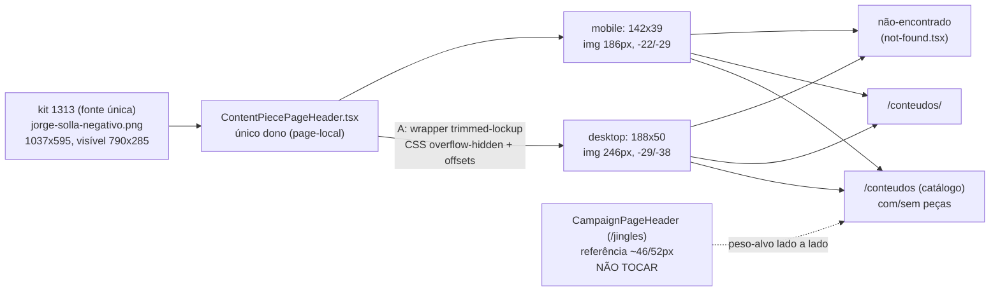

# Impl: S36 — Central de Conteúdos — logo do header no tamanho da marca

Status: aprovado
Atualizado em: 2026-09-24
Issue: #1301
Intenção: docs/plans/central-conteudos-header-logo.md
Design UI (gate): docs/plans/central-conteudos-header-logo-ui-design.html
Appetite restante: ~0,25–0,5 dia eng — correção de fidelidade visual no header, só componente + CSS, sem schema/migration.
Modo: autônomo (`--auto`) — impl plan nasce aprovado pelo agente.

## Leitura da intenção

- **Outcome:** a marca no header da Central (`/conteudos`) lê, nos dois breakpoints, no mesmo peso visual do header público de referência (`/jingles`) — aferido lado a lado em staging.
- **O que NÃO negociar:**
  - **Fonte única kit 1313:** `public/campaign-kit/`; nenhum lockup recriado, nenhuma cor ou tipografia inventada.
  - **Correção vive no header da Central:** escolha de ativo e/ou tamanho renderizado; sem redesenhar o header (`h-14 sm:h-16`, `bg-[#ae1603]` preservados).
  - **Badge "Central de Conteúdos", link "Voltar à Central" e comportamento nos dois breakpoints permanecem.**
  - **Nenhuma outra página pública muda** — `CampaignPageHeader` (`/jingles`) é referência intocada, sem drive-by.
- **O que reavaliar (hipóteses do plano de intenção):**
  - "Opções A|B|C decididas no gate": o design hi-fi decidiu — **A RECOMENDADA** (lockup oficial com recorte técnico da moldura). B (marca completa negativa) comprime o slogan na barra; C (compensar tamanho sem recorte) estoura o header. O que resta para a engenharia é só **como** implementar o recorte técnico da opção A (D1).
  - "Recorte = preparo do ativo no kit": o design entrega o recorte como **CSS (`overflow-hidden` + offsets)** sobre o PNG oficial existente — não como PNG novo commitado. Nenhum binário novo no kit.

## Abordagem recomendada

**Opções consideradas (abordagem geral):** A) lockup `jorge-solla-negativo.png` com recorte técnico via CSS no componente (wrapper `overflow-hidden` com as medidas do design); B) trocar pelo ativo `marca-negativa-completa.png` do kit; C) compensar tamanho renderizado do lockup atual (aumentar `h-7`/`sm:h-9` ou `transform: scale`) sem recorte.
**Recomendação:** **A** — é a opção recomendada do design aprovado (cenas 01/02/03), preserva a assinatura horizontal do S27, atinge ~46 px de tinta visível no peso da referência e cabe no appetite sem binário novo nem redesign.
**Rejeitadas:** **B** porque a marca completa (nome + 1313 + slogan) comprime o slogan na barra de 64/56 px e compete verticalmente com o nome da seção — o próprio design registra a perda de leitura; **C** porque escala a moldura transparente junto: ou continua pequeno, ou estoura o `h-14`/`sm:h-16` (redesign vedado), ou distorce o lockup.

### D1 — Como implementar o recorte técnico da opção A (decisão central, cara de reverter)

**Opções:** A) CSS `overflow-hidden` com offsets no componente (wrapper `div.trimmed-lockup` 188×50 desktop / 142×39 mobile, `img` absoluta 246 px offset −29/−38 desktop e 186 px offset −22/−29 mobile, header `h-14 sm:h-16` preservado); B) asset recortado commitado no kit (novo PNG trimmed em `public/campaign-kit/` + atualização do `README.md`); C) `next/image` `fill`/`sizes` ou scale-up do lockup atual sem wrapper de recorte.

**Recomendação:** **A** — port fiel do design aprovado (`central-conteudos-header-logo-ui-design.html:52-73`): o mesmo PNG oficial, nenhuma segunda fonte de marca, nenhum binário novo, reversão trivial (só o componente + CSS voltam). Os offsets derivam do recorte visível medido (transparência topo 162, base 148, esquerda 123, direita 124 sobre canvas 1037×595) — documentar a derivação em comentário no componente para o próximo leitor não "recalibrar no olho".

**Rejeitadas:** **B** porque cria uma segunda fonte de verdade da marca fora do kit oficial: exige versionar binário + `README.md`, deriva silenciosamente a cada troca de PNG no kit e a reversão espalha (deletar asset + reeditar componente + docs). Gatilho de retorno: se o PNG oficial do kit mudar de canvas/moldura e os offsets CSS perderem a âncora, aí sim gerar o trimmed como build/preparo versionado — não agora. **C** porque `fill` sem janela de recorte replica o problema atual (a caixa continua medindo a moldura, não a tinta), e scale-up puro estoura a barra ou corta sem controle horizontal/vertical; `object-fit` sozinho não ancora o recorte 790×285 dentro de 1037×595.

### Componentes / mudanças

- **`src/components/conteudos/ContentPiecePageHeader.tsx`** (editar, `:11-22` — único dono): trocar o `Image` direto (`h-7 sm:h-9`) pelo wrapper de recorte da opção A com as duas medidas do design (desktop + `mobile`), mantendo `Link href="/"`, `aria-label`, `alt="Jorge Solla"`, `priority`, `CONTENT_PIECE_FOCUS`, badge e `backHref`/`Voltar à Central` byte a byte. Sem extrair componente compartilhado — o header é page-local (precedente `JinglePageHeader`, molde do S27).
- **CSS do recorte:** classes co-localizadas no componente (Tailwind arbitrário ou módulo local — sem stylesheet global novo, sem classe genérica em shell do site). Valores literais do design: `188x50 / img 246px / -29/-38` desktop, `142x39 / img 186px / -22/-29` mobile. Comentário curto com a derivação (canvas 1037×595 → visível 790×285).
- **Consumidores intocados:** `src/app/(frontend)/conteudos/(catalog)/page.tsx:99,112`, `src/app/(frontend)/conteudos/[slug]/page.tsx:82`, `src/app/(frontend)/conteudos/[slug]/not-found.tsx:16` — todas usam `ContentPiecePageHeader`; nenhuma muda.
- **Referência intocada:** `src/components/CampaignPageHeader.tsx:20-27` — não alterar (é o peso-alvo, não o paciente).
- **Kit intocado:** nenhum PNG novo em `public/campaign-kit/`; `public/campaign-kit/README.md` intocado; `marca-negativa-completa.png` segue só nos cards (`src/lib/cardModels.ts:141`, `src/lib/cardRender.ts:359`) — não tocar.
- **Migration:** **sem migration** — só componente + CSS; nenhum campo/collection novo.
- **Access / Consent:** nenhum access novo, nenhum `Consent`, nenhuma PII — header público estático; Local API/bypass e multi-collection não se aplicam (sem leitura/escrita de dados).
- **UI:** Impeccable B — port fiel das cenas 01 (desktop A), 02 (mobile A) e 03 (peça + Voltar) do artefato aprovado; header, badge, copy e CTA preservados.
- **Changelog + impl plan no commit:** `docs/changelog/2026-09-24-s36.md` (uma entrada curta; nunca editar o agregado/HISTORY) e este arquivo `docs/plans/central-conteudos-header-logo-impl.md` no mesmo commit.

### Dados → forma (se aplicável)

N/A — a superfície não apresenta KPI, agregado, contador ou série (a intenção declara correção de fidelidade visual; nenhum ator decide com número). Nada a modelar.

## Fases verificáveis

1. **Tracer / markup do recorte — quota ~40%:** editar `ContentPiecePageHeader` com o wrapper A (desktop + mobile); `pnpm dev` local; conferir `/conteudos`, `/conteudos/<slug>` e não-encontrado nos dois breakpoints antes de seguir. Critério: marca visível ~46 px desktop no peso da referência, header `h-14 sm:h-16` intacto, badge/Voltar inalterados.
2. **UI (port fiel + lado a lado) — quota ~40%:** confronto lado a lado com `/jingles` (referência) em staging nos dois breakpoints; checar cena 03 (peça + "Voltar à Central"), foco visível (`CONTENT_PIECE_FOCUS` não cortado pelo `overflow-hidden`), `alt`/contraste, retina. Sem spec de header novo — cobertura via e2e/visual de staging (achado do explorador).
3. **Gates — quota ~20%:** `pnpm gate:fast` (lint/format/typecheck/knip/cycles/unit) verde; `pnpm push` → PR `--base main`. Sem int novo (sem dados); sem manifest novo (superfícies já cobertas pelo `frontendConteudos` curado; mudança CSS-only não alarga blast radius).

## Testes previstos

- **Sem unit/int novos** — sem lógica de domínio, sem leitura/escrita, sem querystring nova; nada puro para pinar.
- **Visual/e2e em staging (verificação viva):** `/conteudos` (catálogo com/sem peças), `/conteudos/<slug>`, não-encontrado — marca no peso da referência nos dois breakpoints, lado a lado com `/jingles`; badge e "Voltar à Central" presentes e clicáveis.
- **Pins intocados:** `tests/unit/e2eAffectedManifest.unit.spec.ts` (sem entrada nova — CSS-only no dono já mapeado), `tests/unit/codebaseConventions.unit.spec.ts`, `src/lib/shareLink.ts`, `scripts/lib/campaignKitAssets.mjs` — todos intocados.

## Rabbit holes / Não escopo (engenharia)

- **Generalizar os headers públicos** ("padronizo `CampaignPageHeader` junto") — vira refactor de todas as páginas públicas e revisão de marca. Corte: só `ContentPiecePageHeader`.
- **Criar lockup novo / PNG recortado no Figma ou no kit** — nasce marca paralela fora da fonte única. Corte: kit como fonte única; no máximo o recorte CSS do ativo oficial.
- **`next.config` remote ou loader de imagem novo** — o ativo é local do kit; nada de infra de imagem.
- **`scripts/lib/campaignKitAssets.mjs`** — tooling do kit, fora do escopo desta correção visual.
- **Ajustar altura/espaçamento/badge do header para "caber" a marca** — redesign vedado; a menor mudança que faça a marca ler no peso certo.
- **Mexer em copy, badge, CTA, "Voltar à Central", rotas, dados ou consentimento** — fora de escopo explícito.

## Riscos e mitigação

- **Offsets frágeis a troca do PNG no kit:** o CSS ancora no canvas atual (1037×595 → visível 790×285); se o kit republicar o PNG, o recorte desalinha. Mitigação: comentário no componente com a derivação + gatilho registrado para a opção B (asset trimmed versionado).
- **Anel de foco cortado pelo `overflow-hidden`:** o wrapper pode clipar o `CONTENT_PIECE_FOCUS`. Mitigação: foco no `Link` externo ao wrapper (estrutura atual já permite), conferir por teclado nos dois breakpoints.
- **`next/image` vs `img` do artefato:** o design usa `img` absoluta; o componente usa `next/image` (width/height literais). Mitigação: manter `next/image` com os mesmos `width`/`height` do canvas e aplicar largura/offset via classe — sem trocar de primitiva de imagem neste item.
- **Retina/downscale do lockup ampliado:** ampliar a janela pode expor serrilhado. Mitigação: PNG fonte tem 1037 px de largura para janela de 246 px — sobra de resolução; conferir em tela real no gate visual.
- **Regressão em `/jingles`/home/`/cards`:** correção page-local, mas o olho valida. Mitigação: lado a lado em staging confirma peso igual **sem** nenhuma diff fora de `/conteudos`.

## Aceite de engenharia

- [ ] Aceite de produto da intenção coberto: marca no header da Central lê nos dois breakpoints no mesmo peso visual de `/jingles` (aferido lado a lado em staging); fonte única kit 1313; correção só no header da Central; badge, "Voltar à Central" e comportamento preservados; nenhuma outra página pública muda.
- [ ] Guardrails: sem migration, sem access/Consent/PII novo, sem escrita multi-collection; `CampaignPageHeader` e `marca-negativa-completa` nos cards intocados; nenhum binário novo no kit.
- [ ] Invariantes AGENTS/engineering-standards: dono único editado (`ContentPiecePageHeader`, sem twin/compartilhado novo); identificadores em inglês, copy pt-BR preservada; migrations existentes intocadas.
- [ ] Testes previstos executados: visual lado a lado em staging nas três superfícies × dois breakpoints; `pnpm gate:fast` verde; `pnpm push` via GitHub.
- [ ] `docs/changelog/2026-09-24-s36.md` + este impl plan no mesmo commit.

## Decisões de engenharia

- **D1 — Recorte técnico da opção A:** CSS `overflow-hidden` com offsets no componente (188×50/img 246/−29/−38 desktop, 142×39/img 186/−22/−29 mobile) sobre o PNG oficial existente. Rejeitadas: asset recortado no kit (segunda fonte de marca, reversão espalhada; gatilho se o canvas oficial mudar) e `next/image fill`/scale-up sem janela (replica o problema ou estoura o header).
- **Sem migration, sem Consent, sem access novo, sem binário novo** — registrado, não presumido.

## Self-score (decision-quality)

**Self-score decision-quality: 5/5.**

1. Decisão cara com Opções/Recomendação/Rejeitadas? 5/5 — D1 (CSS overflow-hidden vs asset recortado vs fill/scale-up) decide o único ponto caro de reverter, com recomendação e rejeitadas explícitas + gatilho de retorno.
2. Cabe no appetite? 5/5 — ~0,25–0,5 dia: um componente + CSS co-localizado, sem schema/migration/binário/testes novos.
3. Rabbit holes Teqo nomeados? 5/5 — generalizar headers, lockup novo, `next.config` remote, `campaignKitAssets.mjs`, redesign da barra, copy/badge/CTA/dados — todos com corte.
4. Depth check (reusar o módulo profundo)? 5/5 — edita o dono único `ContentPiecePageHeader`, reusa o PNG oficial e as medidas do design aprovado; nenhum pass-through raso, nenhum compartilhado novo, referência e kit intactos.
5. Outcome preservado + tracer cedo? 5/5 — outcome lado a lado em staging guia a fase 1; badge/Voltar/breakpoints e "nenhuma outra página muda" mapeados no aceite; fases vão do markup ao gate visual sem presumir dados.
   Média: 5/5 — ≥4/5.
