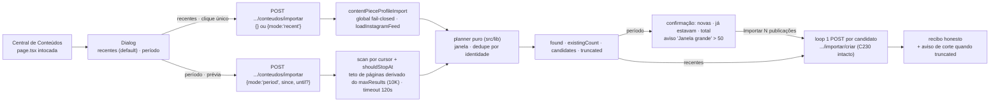

# Impl: C235 — Central de Conteúdos — importar qualquer janela de publicações do perfil

Status: aprovado
Atualizado em: 2026-09-29
Issue: #1386
Intenção: docs/plans/central-conteudos-importar-janela.md
Appetite restante: herdado (~1–2 dias eng) — sem corte novo: a fatia reusa o cliente do feed, o pipeline C220, o dedupe por identidade e o diálogo C230; backfill total, cursor persistido, agendador e triagem prévia seguem fora (intenção).

> Modo `--auto` (work-issue): plano nasce aprovado pelo agente. Design UI do gate: `docs/plans/central-conteudos-importar-janela-ui-design.html` — **DEGRADED** (`:7`, `:261-266`, tier fallback; cenas 01–08 cobrem o fluxo).
>
> **Registro de execução (2026-09-29):** o dispatch do `designer` primário no trigger (b) foi tentado no início da execução e **falhou por quota** (`usage limit reached`); o port foi feito contra o artefato DEGRADED como referência (precedente S16/S18/S34/S40: artefato degradado + crítica de fechamento no tier primário), sem improvisar estrutura visual — todos os estados do fluxo (janela, prévia, progresso, recibo, vazio, falha, corte, mobile) estão nas cenas 01–08. A certificação de fechamento (trigger c) e o sign-off humano continuam obrigatórios: **sem tier primário não há PR** — o fluxo `--auto` para antes do `pnpm push`, comenta a Issue e flipa para `blocked` (D6).
>
> **Sign-off humano (2026-09-29):** o humano aprovou explicitamente o artefato DEGRADED e o port nesta sessão; a entrega segue para PR **Ready** com `Design tier: DEGRADED (<slug>)` e o registro do sign-off no body, conforme o caminho de `work-issue` com humano presente para `DEGRADED`.

## Leitura da intenção

- **Outcome:** com a credencial configurada, o operador escolhe a janela da importação do perfil oficial — **recentes** (default, como hoje) ou **período** (desde; até opcional) — vê o tamanho antes de criar em janelas de período (novas · já estavam · total), confirma, e lê o recibo honesto **novas / já estavam / falharam com motivo**; a execução cobre a janela pela via oficial sem teto artificial e, quando a API/limite corta, o recibo diz; dedupe por identidade do post segue soberano (reexecução e janelas sobrepostas não duplicam); tudo entra como Rascunho, nada é publicado.
- **O que NÃO negociar:**
  - Só o perfil próprio (`@depjorgesolla`) pela API oficial (`loadInstagramFeed`, `src/utilities/socialFeed/instagramFeed.ts:253`); sem scraping, terceiro ou stories; `instagramFeed.ts` não importa `@payload-config` (gate de ciclos madge).
  - Dedupe por identidade do post — `contentPiecePostIdentityUrls` (`src/lib/contentPiece.ts:487`) e `contentPieceExistsForPostIdentity` (`src/utilities/content/contentPieceLink.ts:93`) — sem segundo resolvedor, segunda fila ou segunda identidade.
  - Fail-closed de credencial nas duas pontas ("Instagram ainda não configurado."); token nunca em log/URL/wire; erro de feed vira mensagem de produto.
  - Tudo Rascunho; nenhuma publicação automática; `curatedFields` preservado; board/feed da home intocados.
  - Gate de comunicação `canReadCommunicationCatalog`; `user` + `overrideAccess:false` em todo caminho de request.
  - Sem migration/collection/Consent novo (nenhum campo/global muda; `push:false` intacto); sem escrita multi-collection nova.
  - Design **DEGRADED** não autoriza markup: certificação/estouro do designer primário antes da fase 2; sign-off humano antes do push (D6).
- **O que reavaliar (hipóteses da intenção, resolvidas no código):**
  - "`since`/`until` da edge resolvem a janela" — **rejeitada**: documentado mas não provado no host `graph.instagram.com` e sem teste offline; o caminho provado no repo é cursor + `shouldStopAt` (C220/C230/CLI) — D1.
  - "o teto de 20 páginas do feed comporta a janela" — **não**: `INSTAGRAM_MAX_MEDIA_PAGES = 20` (`instagramFeed.ts:156`) = 1000 posts; cortaria janelas antigas. Vira parâmetro opcional (default intacto) e o importer usa o próprio limite da edge — D1.
  - "a lógica pura de janela não existe" — **existe** em `scripts/lib/instagramContentPlan.mjs:120` (`planInstagramContentWindow`), e o CLI já faz early-stop por data (`scripts/import-instagram-content.mjs:201-204`); o plano move o dono e o CLI delega — D2.
  - "o request de listagem é `z.object({})`" (`src/lib/schemas/contentPiece.ts:89`) — vira união com default `recent` para não quebrar o envelope pinado C230 — D3.
  - "o diálogo C230 cria direto após a busca" (`ImportContentPieceProfileDialog.tsx:107-169`) — período ganha prévia/confirmação; recentes mantém clique único — D4.

## Abordagem recomendada

**Opções consideradas (geral):** A) janela por cursor walk + `shouldStopAt` com teto parametrizado no cliente do feed, planner puro movido para `src/lib` (sem twinning) e fluxo de diálogo com prévia/confirmação; B) `since`/`until` nativos da Graph API; C) segunda implementação de janela/dedupe dentro do importador com fila/estado próprio.
**Recomendação:** **A** — um dono por mecanismo (feed, planner, identidade, pipeline), zero schema novo, testável offline com `fetchImpl`/`loadFeed` injetados e cabe no appetite.
**Rejeitadas:** **B** — não testável offline, comportamento real desconhecido no host e contraria o caminho provado; **C** — twinning do dedupe/janela e fila fora de escopo (C212 §Q4).

### D1 — Mecânica da varredura: cursor + early-stop, teto parametrizado e corte denunciado por cobertura

**Opções:** A) manter o cursor walk do feed com `shouldStopAt` por timestamp (o mesmo que C220 e o CLI provam), derivar o teto defensivo de páginas do próprio `maxResults` (piso 20 intacto; a janela de 10K sobe o teto para 200 páginas), denunciando corte por **cobertura** (`truncated` quando o feed não é vazio e nenhum post retornado é mais antigo que o `since` pedido); B) `since`/`until` nativos da edge `/{ig-user-id}/media`; C) híbrido (manda `since`/`until` e também pagina com cursor).
**Recomendação:** **A** — é o único caminho exercitado e testável sem rede (`fetchImpl` fake pino o walk em `tests/unit/instagramFeed.unit.spec.ts:342-396`); o early-stop para no primeiro post mais antigo que `since` (a página inteira ainda entra, o planner descarta o excedente) e a cobertura cobre os três cortes possíveis — teto do cliente, fim de paginação da API (limite de 10K) e fatia de `maxResults`. `truncated` é inferido no importer (`posts.length > 0 && !covered`), sem novo estado no feed. O early-stop só é composto para período; recentes segue sem ele.
**Rejeitadas:** **B** — sem teste offline, o comportamento real de `limit`+cursor no host graph.instagram.com é pergunta aberta (`docs/plans/central-conteudos-varredura-instagram.md:151`) e o cliente do feed é dono do cursor; **C** — dois mecanismos para o mesmo corte = drift e nenhum ganho.

### D2 — Dono do planner puro: mover para `src/lib`, CLI delega (sem twinning)

**Opções:** A) mover `planInstagramContentWindow` (`scripts/lib/instagramContentPlan.mjs:120`) e `instagramContentFeedIdentityUrls` (`:92`) para `src/lib/contentPieceProfileWindow.ts` (puro, client-safe), o mjs re-exportar com os nomes antigos e o importador C230 passar a usar o mesmo planner para recentes e período (bounds nulos = sem filtro de data); B) o servidor importar o `.mjs` de `scripts/`; C) reimplementar o filtro dentro de `contentPieceProfileImport.ts`.
**Recomendação:** **A** — depth check: a política de janela/dedupe já existe e tem dono; mover para `src/lib` deixa o CLI como shell (parse/report ficam) e o servidor reusa a mesma contagem honesta (`found` = candidatos + já existentes + duplicatas do feed; `outsideWindow`/`malformed` ficam no plano, não no wire). Mantém o shape de retorno do plano idêntico para os pins do CLI (`tests/unit/instagramContentPlan.unit.spec.ts:88-144`); no modo recentes o planner roda sem bounds e a semântica dos pins C230 (`found`/`existingCount`/`candidates`) permanece.
**Rejeitadas:** **B** — app/Server Action importando `scripts/**` é superfície errada (build/knip/`server-only`); **C** — vira segunda identidade de dedupe/janela no mesmo módulo (o defeito que o C230 resolveu).

### D3 — Contrato do request/rota e datas civis

**Opções:** A) `contentPieceProfileImportRequestSchema` (`src/lib/schemas/contentPiece.ts:89`) vira união: `{}`/`{mode:'recent'}` (default) | `{mode:'period', since:'YYYY-MM-DD', until?:'YYYY-MM-DD'}` com refine puro (forma, data real, `until ≥ since`, `since ≤ hoje` BRT); o range civil vira instantes com `parseBahiaDateTimeInput` (`src/lib/campaignTime.ts:83`) — início do dia `T00:00`, fim do dia `T23:59` + 59,999 s, `until` ausente = agora; a action re-parseia (precedente C230) e o diálogo valida antes com o mesmo helper para copy/desabilitar; B) `mode` obrigatório; C) `since`/`until` como instantes ISO no wire.
**Recomendação:** **A** — o default do produto continua um body vazio (o pin do envelope C230 em `tests/int/contentPiece.int.spec.ts:1852-1905` segue verde), `<input type="date">` fala `YYYY-MM-DD` e o operador pensa em dia civil da Bahia, não em instante. Sem nova safe message: período inválido cai no genérico (o diálogo impede antes; o servidor é defesa em profundidade). `criar/route.ts` e `contentPieceLinkRequestSchema` intocados.
**Rejeitadas:** **B** — quebra o pin `{}` e o default sem ganho; **C** — instante no wire empurra conversão de fuso para o cliente e ignora o input nativo.

### D4 — Fluxo do diálogo: recentes clique único; período prévia + confirmação

**Opções:** A) recentes mantém o clique único de hoje (lista e cria no mesmo gesto, janela 12); período ganha prévia com contagens ("novas a criar · já estavam · total na janela"), aviso âmbar "Janela grande" quando `candidates > CONTENT_PIECE_PROFILE_IMPORT_LARGE_WINDOW_THRESHOLD` (50 = uma página do feed), botões "Importar N publicações"/"Trocar"/"Voltar", e os estados da cena 06 (vazio, falha com "Tentar de novo", corte no recibo); B) período cria direto; C) prévia para tudo, inclusive recentes.
**Recomendação:** **A** — o recorte por período é gesto explícito e o design fixa o tamanho antes de criar (cenas 02/03); a operação diária não muda; `truncated` aparece no recibo (cena 06d) e um período sem candidatos nem vira botão "Importar 0" (receita cena 05 adaptada com "Nenhuma novidade na janela"). O limiar de "janela grande" vive como constante no módulo puro (client-safe), revisável por gatilho.
**Rejeitadas:** **B** — despejo acidental de rascunhos que o produto quer evitar; **C** — fricção nova no fluxo diário.

### D5 — Tempo limite e feedback da busca

**Opções:** A) recentes mantém 30 s (`CONTENT_PIECE_PROFILE_IMPORT_FEED_TIMEOUT_MS`, `contentPieceProfileImport.ts:43`); período ganha orçamento maior (120 s) para o walk de muitas páginas; spinner sem progresso de páginas; B) timeout único alto para os dois modos; C) progresso por página/streaming.
**Recomendação:** **A** — `AbortSignal.timeout` já cobre todas as chamadas do walk e o período pode custar dezenas de fetches; estourou, cai na mensagem honesta de retry existente e nada foi criado (a criação só começa depois da prévia). A UI não conhece o total de páginas — progresso de busca seria inventado; o "pode demorar" do design é o feedback.
**Rejeitadas:** **B** — uma API pendurada seguraria o recente por 2 min sem motivo; **C** — progresso inventado (não há total antes de varrer).

### D6 — Design gate: DEGRADED ⇒ certificação antes do markup e sign-off antes do push

**Opções:** A) tratar o artefato como gate duro: o designer primário certifica/estende as cenas **antes** de qualquer markup da fase 2; a crítica final certificada + sign-off humano ficam registrados no PR (`Design tier:`), e o DEGRADED sozinho **não** vai ao push; B) seguir o DEGRADED como aprovado; C) redesenhar do zero.
**Recomendação:** **A** — a doutrina do repo só permite port classe-a-classe sob artefato certificado; DEGRADED é explicitamente "design NÃO certificado; requer sign-off humano" (`design html:261-266`). **Execução:** o designer primário estava indisponível (quota) no trigger (b); o port seguiu o artefato como referência (precedente S16/S18/S34/S40) e a certificação fica no fechamento (trigger c) — se o tier primário não certificar, o fluxo para antes do push (sem PR; Issue `blocked`). Estados não desenhados que a execução encontrar → designer estende antes do markup.
**Rejeitadas:** **B** — viola a disciplina de design; **C** — as cenas 01–08 já cobrem o fluxo; estender é mais barato.

### D7 — Testes: unit do puro + int com deps injetadas; e2e fica fora

**Opções:** A) unit do módulo puro (janela com/sem bounds, cobertura/`truncated`, bounds civis, validação, limiar) e pin novo do teto derivado de `maxResults` no feed; int do `contentPieceProfileImport` com `loadFeed` fake (recent/period, `shouldStopAt` no limite, `truncated`, dedupe por identidade, fail-closed, erro honesto) e envelope da rota; e2e sem spec nova; B) e2e novo com stub do Instagram; C) só int.
**Recomendação:** **A** — mesma razão do C230: a fronteira é coberta com dep injetada, sem credencial real e sem estado compartilhado do `social-feed-settings` entre projetos; pins C230/C220/CLI seguem verdes e o diff acorda `campaignSpeechAcervo` pelo manifesto (`src/lib/schemas/contentPiece.ts` é risk prefix mapeado, `:575-577`; `src/components/campaign/content` e `src/utilities/content`, `:552-558`; o arquivo novo casa o prefixo `src/lib/contentPiece`, `:574`).
**Rejeitadas:** **B** — flake e custo sem cobrir o que o int cobre; **C** — a política de janela (a parte mais fácil de errar) ficaria sem pin barato.

### Componentes / mudanças

- **`src/lib/contentPieceProfileWindow.ts`** (novo, puro, client-safe; não importa `utilities/`): dono do recorte. Move `planContentPieceProfileWindow` (de `instagramContentPlan.mjs:120`; `from`/`to` opcionais/null = sem filtro) e `contentPieceProfileFeedIdentityUrls` (`:92`); tipos `ContentPieceProfileWindowInput` (`{mode:'recent'} | {mode:'period'; since; until?}`); `contentPieceProfilePeriodError({since, until, today})` (forma `YYYY-MM-DD`, data real por round-trip `formatBahiaCivilDate`, ordem, `since` não-futuro); `contentPieceProfilePeriodBounds({window, now})` → `{fromIso, toIso}` compondo `parseBahiaDateTimeInput` (`campaignTime.ts:83`); `contentPieceProfileWindowCovered({posts, fromMs})`; `contentPieceProfileWindowLabel` (compõe `formatCivilDateLabel`, `campaignTime.ts`, para "01/08/2026 → hoje"); `CONTENT_PIECE_PROFILE_IMPORT_LARGE_WINDOW_THRESHOLD = 50`.
- **`src/lib/campaignTime.ts`**: ganha `formatCivilDateLabel` (`aaaa-mm-dd` → `dd/mm/aaaa`) e `subtractBahiaCivilMonths` (clamp de fim de mês) — donos puros dos atalhos de janela do diálogo.
- **`scripts/lib/instagramContentPlan.mjs`**: passa a importar e re-exportar o planner/identidades com os nomes antigos (`planInstagramContentWindow`, `instagramContentFeedIdentityUrls`) — CLI (`import-instagram-content.mjs:55/236`), unit (`instagramContentPlan.unit.spec.ts`) e guards (`instagramContentImportCli.unit.spec.ts`) intocados. Args/report/summary ficam.
- **`src/utilities/socialFeed/instagramFeed.ts`**: o teto defensivo de páginas passa a **derivar de `maxResults`** (`max(INSTAGRAM_MAX_MEDIA_PAGES, ceil(maxResults / INSTAGRAM_MAX_RESULTS_CAP))`) — janela de 12 e o lookup/board ficam idênticos (piso 20); só a janela de 10K do período amplia o walk. `loadInstagramFeed` não aprende `since`/`until`.
- **`src/utilities/content/contentPieceProfileImport.ts`**: `listContentPieceProfileImportCandidates({payload, actor, window = {mode:'recent'}, loadFeed?, fetchImpl?, now?})`; recentes = hoje (`maxResults: CONTENT_PIECE_PROFILE_IMPORT_INSTAGRAM_WINDOW = 12`, timeout 30 s); período = `maxResults: CONTENT_PIECE_PROFILE_IMPORT_SCAN_LIMIT = 10_000`, `shouldStopAt` por `timestamp < fromMs`, timeout `CONTENT_PIECE_PROFILE_IMPORT_PERIOD_FEED_TIMEOUT_MS = 120_000`; lookup de identidade em chunks de 2.000 URLs via `contentPieceProfileFeedIdentityUrls`; retorno ganha `truncated` (inferido por `contentPieceProfileWindowStartReached`). `createContentPieceFromProfilePost` (`:205`) e o fail-closed (`:110-146`) intocados.
- **`src/lib/schemas/contentPiece.ts`**: `contentPieceProfileImportRequestSchema` vira união com default recente + refine de período via `contentPieceProfilePeriodError`; safe messages existentes bastam.
- **`src/app/(campaign)/campanha/actions/contentPieces.ts`**: `listContentPieceProfileImportCandidatesForActor(input = {})` re-parseia e repassa `window`; gate fresco intocado (`:388-395`).
- **`.../conteudos/importar/route.ts`**: handler passa o body parseado à action; envelope/safe messages inalterados. **`.../importar/criar/route.ts`** intocada.
- **`.../conteudos/types.ts`**: `ContentPieceProfileImportCandidatesResponse` ganha `truncated: boolean` (aditivo).
- **`src/components/campaign/content/ImportContentPieceProfileDialog.tsx`**: seletor de janela (radiogroup cena 01/02: "Recentes · Padrão" default; "Período" com Desde/Até nativos + chips "Últimos 30 dias"/"Últimos 6 meses"/"Este ano", via `subtractBahiaCivilDays`/`formatBahiaCivilDate`), prévia+confirmação (cena 03), progresso real (cena 04, barra com `aria-valuenow`), recibo com a linha da janela + aviso de corte (cenas 05/06d), vazio (06a) e falha com "Tentar de novo" (06b); mantém loop sequencial, bloqueio de fechar em running e `router.refresh()`.
- **`page.tsx`** (lista): intocada — toolbar/banner/empty da C230 já cobrem o fail-closed (cena 06c).
- **`docs/changelog/2026-09-29-c235.md`** (novo).

**Migration: sem migration** — nenhuma collection/global/field muda; `push:false` intacto; sem `generate:types` (tipos novos são de aplicação).

**Access / Consent:** sem Consent (sem PII nova) e sem chave hardcoded; gate fresco `canReadCommunicationCatalog` nas actions (como as irmãs); leitura do global via Local API sem `user` (bypass admin já documentado em `contentPieceProfileImport.ts:119-121`) só para o boolean/credencial, e o listing com `user: actor` + `overrideAccess:false` (`:83-84`). Sem escrita multi-collection nova: a fase A só lê; a fase B é o `payload.create` único já transacional do C230.

**UI:** Impeccable **C** (encaixe no diálogo existente). Shells/componentes reusados: `Dialog/Alert/Badge/Button/Spinner`, `postCampaignJson`, `buildContentPieceListHref` (`contentPieceListUrl.ts:89-90`). **Trigger de design:** DEGRADED → certificação/estouro do designer primário antes do markup (D6); estados não desenhados param a execução.

### Dados → forma (se aplicável)

N/A — operação/curadoria, não analytics: o tamanho da janela e o recibo são contagem operacional (novas/já estavam/falhas) e detalhe textual (motivo da peça-link), sem agregado, taxa, série, engajamento ou alcance. A intenção fixou "sem números do Instagram nesta tela" (métricas de post são C213, fora).

## Fases verificáveis

1. **Tracer / schema+server — quota ~50%:** módulo puro (`contentPieceProfileWindow.ts`) + re-export do CLI; teto de páginas derivado de `maxResults` no feed; `contentPieceProfileImport` com janela/truncated; schema/route/action/types. **Tracer bullet cedo:** int com `loadFeed` fake — período devolve `found`/`existingCount`/`candidates` deduplicados por identidade e `truncated` correto com o `shouldStopAt` pinado no limite; recentes segue com `receivedMaxResults === 12` e os pins C230 verdes; CLI spec verde pelo re-export. Só então a UI.
2. **UI — quota ~30%:** port das cenas 01–08 no diálogo, **após certificação do designer** (D6). Prova: build/typecheck e revisão no browser; sem tocar `page.tsx`.
3. **Gates — quota ~20%:** `pnpm gate:fast`; `pnpm test:int`; e2e selecionado/curado (o diff acorda `campaignSpeechAcervo` pelo risk mapping; nenhuma spec e2e nova); crítica final do designer certificada + sign-off humano (DEGRADED) com `Design tier:` no PR; `pnpm push` via GitHub.

### Testes previstos

- **`tests/unit/contentPieceProfileWindow.unit.spec.ts` (novo):** planner com bounds (dentro/fora, `outsideWindow`, duplicata de feed, identidade já catalogada em outra grafia), bounds nulos (modo recentes) e ordenação newest-first; `contentPieceProfilePeriodError` (formato, data impossível 2026-02-30, `until < since`, `since` futuro, válido); `contentPieceProfilePeriodBounds` (início/fim do dia civil BRT, `until` ausente = agora); `contentPieceProfileWindowCovered` (post mais antigo que `fromMs` = coberto; só mais novos = corte; vazio); limiar e label.
- **`tests/unit/instagramFeed.unit.spec.ts` (estender sem quebrar pins):** uma janela mais profunda (`maxResults: 1_100`) anda 22 páginas; default segue 20 (pins de clamp/one-page/walk/early-stop/refresh intactos).
- **`tests/int/contentPiece.int.spec.ts` — novo describe C235 (deps injetadas, sem rede):** período com `loadFeed` fake — `receivedMaxResults === SCAN_LIMIT` e `shouldStopAt(postAntigo) === true`/`shouldStopAt(postNaJanela) === false`; posts fora da janela não entram; dedupe por variante de kind (`/p/` no banco × `/reel/` no feed); `truncated: true` quando o feed não alcança o `since`, `false` quando alcança; período sem credencial → fail-closed sem chamar `loadFeed`; feed lançando → mensagem honesta; envelope da rota com `{}` (recente) e com body de período; período inválido → 400 sem escrita.
- **Pins que seguem intocados:** C230 (`:1653-1929`, janela 12 em `:1696`), C220 (`:1214-1230`), `instagramContentPlan.unit.spec.ts` e `instagramContentImportCli.unit.spec.ts` via re-export.
- **e2e — não entra.** Mesma razão do C230: sem credencial real e o global é estado compartilhado; o int cobre a fronteira. **Gatilho:** regressão do envelope HTTP que o int não pegar → e2e HTTP curto com o stub (`tests/e2e/instagram-stub.mjs`), semeando/restaurando o global em `finally`.

## Rabbit holes / Não escopo (engenharia)

- **Backfill total/"importa as 10K de uma vez"** — a janela é escolhida; o corte é dito e reexecutar continua sem duplicar; varredura automática é C212 §Q4.
- **Cursor persistido/retomada/painel de varredura** — nada de estado próprio; o recibo é a verdade.
- **`since`/`until` nativos da edge** — fora (D1); não ensinar isso ao `loadInstagramFeed`.
- **Segunda identidade/fila/resolvedor; agendador/webhook; auto-publicar; triagem peça a peça; analytics/stories** — permanentes (intenção/C211/C213).
- **Progresso de busca por página, scroll infinito de seleção, edição em massa** — fora.
- **Tocar board/feed da home, snapshot/cache/kill switch/lock do `SocialFeedSettings`, outras rotas da Central** — o diff é zero fora do listado.
- **Mexer no `instagramFeed.ts` além do teto de páginas derivado** — sem `since`/`until`, sem novo retorno.

## Riscos e mitigação

- **Janela antiga = muitas páginas → rate limit/timeout:** o walk respeita `AbortSignal` de 120 s; estourou, mensagem honesta e nada criado (criação só após a prévia); reexecutar converge. Se virar rotina, o item é a varredura com cursor (C212 §Q4).
- **`truncated` por cobertura tem falso positivo quando o perfil inteiro está dentro da janela** (conta nasceu depois do `since`): o aviso é conservador ("importamos o que foi possível neste recorte") e nunca esconde corte; gatilho: se incomodar, o feed devolve o motivo do fim do walk (`stopReason`) e o flag refina.
- **Página do feed com menos de 50 itens:** o teto de páginas pode cortar antes dos 10K, mas a cobertura denuncia `truncated` — honesto.
- **Mover o planner quebra o CLI/pins:** re-export com os nomes antigos; `pnpm gate:fast` (knip/cycles/unit) pega qualquer órfão.
- **Datas impossíveis normalizadas pelo parse** (`2026-02-30` → março): validação por round-trip em `contentPieceProfilePeriodError` no schema e no cliente.
- **Divergência prévia × criação (corrida):** o probe da fase B responde `existing` e o recibo fecha nas categorias; candidato criado por outro ator conta em "já estavam".
- **Design DEGRADED:** gate duro — sem certificação não há markup; sem sign-off humano não há push.
- **`page.tsx`/board/feed:** intocados por construção; `loadInstagramFeed` só ganha o teto derivado.

## Triage do /simplify (2026-09-29)

Dois revisores (estrutural + qualidade) rodaram sobre o diff; os fixes baratos já estão na entrega (preprocess do schema restrito a `{}` — fim do downgrade silencioso de `{since,until}` sem `mode`; teto de páginas derivado de `maxResults` em vez de arg público; `contentPieceProfileWindowStartReached` no lugar de "covered"; tipo do post reusando `ContentPieceProfilePost`; pins de `formatCivilDateLabel`/`subtractBahiaCivilMonths`; spec do CLI reduzido a pin de re-export; `role="alert"` redundante e `setSearching(false)` no-op removidos; radios com roving tabindex/setas; labels de data sem `aria-label` divergente; `Number.isFinite` redundante no early-stop).

- **Já resolvido (não reabrir):** os fixes acima; o `maxMediaPages` público removido e os pins atualizados.
- **Adiado com gatilho:**
  - **Fatia do diálogo em steps locais** (`ImportContentPiecePreviewDialog` tem a cadeia de fases em JSX): gatilho — a certificação de design mexer na estrutura do diálogo ou um passo novo entrar; hoje a estrutura é o port fiel do artefato.
  - **`loadConfiguredInstagramFeed`** acumula fail-closed + validação/bounds + composição + persistência: a parte pura já tem dono (`contentPieceProfileWindow.ts`); gatilho — 2º consumidor do mapeamento janela→`maxResults`/timeout/early-stop.
  - **`truncated` conservador** (S5): gatilho — o feed devolver `stopReason` (ver Riscos).
  - **e2e do diálogo** (S6): gatilho — regressão do envelope HTTP que o int não pegar (ver Testes).
- **Explicitamente fora:** `formatCivilDateLabel` privado do `activityAllDay.ts` (recebe instante ISO, semântica distinta — não é duplicata); tipos de wire importados de `app/(campaign)/.../types` em client components (padrão do repo, precedente C230).
- **Registro adiado:** não há Issue nova neste fechamento — o fluxo para antes do PR (design DEGRADED); o gatilho da fatia do diálogo fica aqui e o débito pode virar `C235-FOLLOWUP-DRY` (`depends: 1386`) quando o fechamento landar.

## Aceite de engenharia

- [ ] Aceite de produto da intenção ainda coberto: recentes default preservado; período com desde/até opcional cobre a janela pedida pela via oficial; prévia com tamanho antes de criar em período; recibo honesto (novas/já estavam/falharam + motivo) e aviso de corte quando a via oficial não alcança; dedupe por identidade (sobreposição/reexecução/link manual sem gêmeas); nada publicado; fail-closed de credencial; só perfil próprio/API oficial; token nunca em log.
- [ ] Invariantes AGENTS/engineering-standards: gate fresco `canReadCommunicationCatalog`; `user` + `overrideAccess:false` (bypass admin só o já documentado do global); **sem migration/collection/Consent novo**; sem escrita multi-collection nova; `lib/` não importa `utilities/` e o módulo novo é puro/client-safe; `instagramFeed.ts` não importa `@payload-config`; um dono por mecanismo (planner movido, sem segundo dedupe/fila/identidade); board/feed da home e pipeline C220 intocados.
- [ ] Testes de domínio previstos (unit/int) verdes e pins C230/C220/CLI verdes; nenhuma spec e2e nova; manifest sem edição e seleção não-zero.
- [ ] UI apenas após certificação do designer; crítica final + sign-off humano (DEGRADED) com `Design tier:` no PR antes do push.
- [ ] `pnpm gate:fast` verde; `pnpm test:int` verde; e2e selecionado/curado verde; `pnpm push` via GitHub.

## Self-score

**Self-score decision-quality: 4/5.** (1) Decisões caras com Opções/Recomendação/Rejeitadas explícitas (mecânica da varredura, dono do planner, contrato/datas, fluxo do diálogo, timeout, gate de design, testes); (2) cabe no appetite — move a pura, adiciona um arg opcional ao feed e porta cenas no diálogo existente, sem schema/infra; (3) rabbit holes nomeados (backfill, cursor, `since/until`, segunda fila, agendador, analytics, progresso inventado); (4) depth check: planner e identidade movidos para o dono em `src/lib`, CLI delega, dedupe segue num predicado único e o cliente do feed só parametriza o teto; (5) aceite de produto intacto. Não 5/5 por três incertezas assumidas: (a) o falso positivo conservador de `truncated` na cobertura; (b) o limiar de "Janela grande" (50) inferido do design/mock; (c) o design **DEGRADED**, cuja certificação é pré-condição da fase 2 e não está sob controle da execução.
