# Impl: C230 — Central de Conteúdos — importar publicações do perfil oficial (@depjorgesolla)

Status: aprovado
Atualizado em: 2026-09-25
Issue: #1362
Intenção: docs/plans/central-conteudos-importar-perfil.md
Appetite restante: herdado (~1–2 dias eng) — sem corte novo: o plano reusa o pipeline C211/C220, o cliente Graph API e a tela da Central; backfill, agendador/webhook e scraping seguem fora (intenção).

> Modo `--auto` (work-issue): plano nasce aprovado pelo agente. Design UI do gate: `docs/plans/central-conteudos-importar-perfil-ui-design.html` (cenas 1–7). Trigger de designer em **UI: non-trigger com adaptações registradas** — se a execução encontrar um estado não desenhado, o designer estende o artefato antes do markup (não improvisar estrutura visual).

## Leitura da intenção

- **Outcome:** com a credencial configurada, "Importar do perfil" na lista da Central traz as mídias recentes de `@depjorgesolla`: cada novidade vira **Rascunho** no pipeline existente (mídia baixada do perfil próprio, transcrita, catalogada) ou **peça-link com motivo honesto**; ao fim o operador lê o recibo **novas / já estavam / falharam**; nada duplica — inclusive contra peça que entrou por link manual em outra grafia — e nada é publicado.
- **O que NÃO negociar:**
  - Só o perfil próprio pela API oficial (`loadInstagramFeed`, `src/utilities/socialFeed/instagramFeed.ts:253-322`); **nunca** scraping, terceiro ou stories; **mídia de terceiro nunca é baixada** (o match é dentro do feed da própria conta).
  - Tudo entra como **Rascunho**; nenhuma publicação automática; `curatedFields` nunca sobrescrito.
  - Dedupe pela **identidade do post**, não pela grafia da URL; reexecutar não duplica.
  - Sem credencial: **fail-closed** com a linguagem do board ("Instagram ainda não configurado"); token **nunca** em log/URL/wire.
  - Board/feed da home intocado: `instagramFeed.ts` e o pipeline C220 (resolver/job/agendador) não mudam de comportamento; sem segundo resolvedor, sem estado na `SocialFeedSettings`.
  - LGPD: **sem Consent novo** (não há PII de eleitor; peça é material de campanha).
- **O que reavaliar (hipóteses da intenção, confirmadas ou resolvidas no código):**
  - "identidade do post exige campo novo" — reavaliada e **resolvida sem migration**: o parse produz a URL canônica e o conjunto de variantes vivas é ≤3 (`p|reel|tv`; `reels` colapsa em `reel` em `src/lib/contentPiece.ts:408-461`), consultável por `sourceUrl in` no índice existente (`src/collections/ContentPiece.ts:421-431`) — D1.
  - "o dedupe exato do `addContentPieceByLinkForActor` basta" — **confirmado insuficiente** para "qualquer grafia" (`contentPieces.ts:335-344` compara `canonicalUrl` exata; `/p/ABC/` ≠ `/reel/ABC/`): o predicado vira compartilhado — D1.
  - "a janela de 500 do C220 serve ao importador" — não: o recorte do aceite é "mídias recentes"; a janela vira decisão de implementação (12) e o histórico continua pelo link — D4.
  - "o pipeline C220 re-resolve pelo feed por peça (N+1)" — confirmado e aceito: ~1 chamada de feed por post da janela, com early-stop (D3); o rate limit da edge (C212 §Q1) comporta 12.
  - "falta credencial → só UI ou só server" — o fail-closed precisa das duas pontas: página (botão/banner) e action/rota (mensagem segura) — D5.

## Abordagem recomendada

```mermaid
flowchart LR
  P["Página Conteúdos<br/>lê o global → instagramConfigured (boolean)"] --> D["Dialog 'Importar do perfil'<br/>intro · running · recibo"]
  D -->|"Fase A · POST .../conteudos/importar"| A["lista candidatos<br/>global + isInstagramFeedConfigured<br/>loadInstagramFeed maxResults 12"]
  A -->|"sem credencial"| E1["erro seguro<br/>Instagram ainda não configurado"]
  A -->|"feed lido"| DED["dedupe por identidade do post<br/>sourceUrl in variantes p · reel · tv"]
  DED --> R["found · existingCount · candidates[]<br/>linkOnlyReason: carrossel · indisponivel · null"]
  R -->|"loop no cliente · 1 POST por candidato"| B["Fase B · POST .../importar/criar"]
  B --> C{"identidade já existe?"}
  C -- "sim" --> EX["outcome existing → já estavam"]
  C -- "não" --> CR["create no shape do link C220<br/>rascunho · processando/extraindo"]
  CR --> J["after() → runContentPieceJob<br/>re-resolve por shortcode · baixa mídia · cataloga"]
  J --> OK["pronto com arquivo<br/>ou peça-link com linkFailureReason honesto"]
  CR --> REC["recibo: novas / já estavam / falharam<br/>+ peça-link por motivo"]
  EX --> REC
  REC --> L["Ver os rascunhos<br/>lista ?status=rascunho"]
```

**Opções consideradas (geral):** A) importador como orquestração cliente-servidor em 2 fases, reusando o pipeline C220, com dedupe por identidade do post via variantes de `sourceUrl` (sem migration) e fail-closed de credencial nas duas pontas; B) campo indexado novo (`instagramShortcode`/`mediaId`) com migration + action única server-side; C) fila/cron/webhook com estado próprio de varredura.
**Recomendação:** **A** — um dono por mecanismo (feed Graph API, pipeline da peça, lista), zero schema novo, progresso real do design (cena 3) e cabe no appetite.
**Rejeitadas:** **B** — migration é stop do modo `--auto` e cara de reverter, sem ganho sobre a query `in` num índice existente; **C** — fora de escopo (item irmão C212 §Q4) e contradiz a cadência sob demanda desta fatia.

### D1 — Dedupe por identidade do post, sem migration

**Opções:** A) identidade = **shortcode do Instagram** → variantes canônicas de `sourceUrl` (`https://www.instagram.com/{p|reel|tv}/{shortcode}/`), consultadas com `where: { sourceUrl: { in: variantes } }`; para YouTube a identidade já é 1 URL canônica; predicado compartilhado com o owner C220; B) campo indexado novo `instagramShortcode`/`mediaId` (migration de schema) no dedupe; C) confiar só no unique exato de `sourceUrl` como hoje (`contentPieces.ts:335-344`).
**Recomendação:** **A** — o kind (`p`×`reel`×`tv`) é apresentação e o shortcode é a identidade (`src/lib/contentPiece.ts:384-396,408-461`); a query `in` usa o índice que `sourceUrl` já tem e o conjunto é ≤3 URLs por candidato numa janela de 12 — sem schema, migration ou backfill. O helper puro `contentPiecePostIdentityUrls(link)` é o único ponto com as variantes e `findExistingContentPieceByPostIdentity` o único predicado de dedupe; o `addContentPieceByLinkForActor` (owner C220) passa a usá-lo, então colar o link em outra grafia também responde `CONTENT_PIECE_LINK_DUPLICATE_MESSAGE` ("Esta peça já está na Central").
**Rejeitadas:** **B** — migration sem ganho real (teto de 3 variantes, `reels` normaliza no parse) e cara de reverter; **C** — deixa passar a gêmea `/p/ABC/`×`/reel/ABC/`, violando o aceite ("inclusive o que entrou por link manual, em qualquer grafia").

### D2 — Fluxo em 2 fases orquestrado pelo cliente, com progresso real

**Opções:** A) **Fase A** (rota `.../conteudos/importar`) lê o feed e devolve `{ found, existingCount, candidates:[{ url, shortcode, linkOnlyReason }] }` já deduplicado; **Fase B** (`.../importar/criar`) cria UMA peça por candidato, com loop sequencial no cliente ⇒ "Importando X de N…" real, falha de um não interrompe os outros e o recibo separa novas/já estavam/falhou; B) 1 action faz tudo server-side e devolve só o recibo final; C) fila/cron/webhook com estado próprio.
**Recomendação:** **A** — cumpre a cena 3 ("Importando 7 de 12…") sem progresso inventado, não trava uma request atrás de N jobs e isola cada falha (cena 4). Contrato: `found = existingCount + candidates.length` (só mídias com identidade reconhecível); o recibo fecha `created + existingFinal + failed = found`; corrida entre A e B (outro ator criou a peça) cai em `existing` no probe da Fase B. Fase B responde `{ status:'success', outcome:'created'|'existing' }` — o loop só precisa do desfecho e a lista é refrescada no fim (sem devolver `ContentPieceViewModel` nem leitura extra do doc existente). Loop em série (1 request por vez) — progresso honesto e carga previsível; o upload usa 2 em voo porque o gargalo é o navegador, aqui é a API/DB.
**Rejeitadas:** **B** — contradiz a cena 3 (sem progresso real) e segura a request com N jobs; **C** — fora de escopo (C212 §Q4).

### D3 — Reuso integral do pipeline C220 (nada de segundo resolvedor)

**Opções:** A) a Fase B cria a peça exatamente no shape do link — título `contentPieceLinkTitle(link)` (`Instagram · SHORTCODE`), `type:'video'`, `origin:'instagram'`, `sourceUrl` canônica, `status:'rascunho'`, `processingStatus:'processando'`, `step:'extraindo'` — e chama `startContentPieceJobInBackground`; o job C220 re-resolve pelo feed com early-stop, baixa só `mediaUrl` do perfil próprio, transcreve/cataloga e persiste `linkFailureReason` honesto; B) segundo resolvedor no importador (baixar `mediaUrl` na Fase A e passar adiante); C) persistir a classificação da Fase A como `linkFailureReason` sem o job re-resolver.
**Recomendação:** **A** — um dono por mecanismo (o job é dono do estado da peça; `contentPieceLink.ts` da extração), nenhuma semântica nova; o N+1 de ~1 chamada de feed por post da janela é aceitável no rate limit da edge e a reexecução segue idempotente. A classificação exibida no recibo vem só do metadado do feed (`CAROUSEL_ALBUM` → `carrossel`; `mediaUrl == null` → `indisponivel`; senão `null`) — sem valor novo no vocabulário fechado (`src/lib/contentPiece.ts:360-379`; adicionar valor seria migration).
**Rejeitadas:** **B** — duplicaria download/limite/erro tipado e criaria segunda semântica de peça-link; **C** — motivo persistido viraria palpite da Fase A, não o resultado do caminho oficial (que é quem tenta o download).

### D4 — Janela = 12 mídias recentes

**Opções:** A) `maxResults: 12` numa constante nomeada no módulo do importador (`CONTENT_PIECE_PROFILE_IMPORT_INSTAGRAM_WINDOW`), documentada como decisão revisável; B) 50/uma página cheia ou backfill do histórico; C) 3 (mesmo recorte do board).
**Recomendação:** **A** — o mock do design é "7 de 12" e o aceite fala "mídias recentes"; uma única página de feed (≤50) cobre a janela e o post antigo específico continua entrando pelo link C220 (janela 500 com early-stop). A constante fica ao lado do `maxResults` para revisão explícita.
**Rejeitadas:** **B** — vira backfill/rabbit hole do plano de intenção; **C** — pequeno demais para o uso (perde posts do fim de semana).

### D5 — Fail-closed de credencial nas duas pontas

**Opções:** A) a página lê o global (`payload.findGlobal({ slug: 'social-feed-settings', depth: 0 })`, mesmo precedente de `contentPieceLink.ts:228`) e passa `instagramConfigured` — boolean derivado de `isInstagramFeedConfigured`, **nunca o token** ⇒ botão desabilitado + legenda "Instagram ainda não configurado" + banner âmbar da cena 5; actions/rotas recusam sem credencial com mensagem segura; B) só UI; C) só server.
**Recomendação:** **A** — fail-closed nas duas pontas: a UI não oferece e o servidor recusa mesmo chamado direto (rota HTTP). O global continua dono da credencial (`src/globals/SocialFeedSettings.ts:63-66`); se o feed estiver desligado (`enabled:false`/`instagramEnabled:false`) o mesmo caminho vale — a via oficial está indisponível. O token nunca cruza para o cliente, log ou wire.
**Rejeitadas:** **B** — servidor confiaria no cliente (falha aberta); **C** — erro só no meio da ação (contradiz cena 5).

### Componentes / mudanças

- **`src/lib/contentPiece.ts`** (puro; dono do vocabulário): `contentPiecePostIdentityUrls(link)` (3 variantes IG `p|reel|tv`; 1 canônica para YouTube) e `contentPieceProfileCandidateFromPost({ permalink, mediaType, mediaUrl })` → `ContentPieceProfileCandidate | null` (`{ url: canonicalUrl, shortcode, linkOnlyReason }`; null defensivo quando o parse falha); o tipo nasce aqui (client-safe). Sem importar `utilities/`.
- **`src/utilities/content/contentPieceLink.ts`** (dono do link C220; **só ganha exports**, resolução intocada): `contentPieceExistsForPostIdentity({ payload, actor, link })` (o predicado único de dedupe, `user` + `overrideAccess:false`, compartilhado com a colagem C220) e `isContentPieceSourceUrlDuplicateError(error)` (a corrida contra o índice unique vira `existing`/duplicata nos dois paths).
- **`src/utilities/content/contentPieceProfileImport.ts`** (novo, `server-only`): `CONTENT_PIECE_PROFILE_IMPORT_INSTAGRAM_WINDOW = 12` + timeout do feed (30 s, espelho do C220); `readContentPieceProfileImportAvailability(payload)` (boolean); `listContentPieceProfileImportCandidates({ payload, actor, loadFeed?, fetchImpl? })` (global + fail-closed + `loadInstagramFeed(maxResults:12)` + persist best-effort do token refrescado + classificação + dedupe em UMA query `sourceUrl in` variantes); `createContentPieceFromProfilePost({ payload, actor, url, startJob? })` (parse IG, probe → `existing`, create no shape do link, unique violation → `existing`, job em background).
- **`src/lib/schemas/contentPiece.ts`**: `CONTENT_PIECE_PROFILE_IMPORT_UNAVAILABLE_MESSAGE = 'Instagram ainda não configurado.'`; `CONTENT_PIECE_PROFILE_IMPORT_FEED_ERROR_MESSAGE = 'Não foi possível falar com o Instagram agora. Tente novamente.'`; `contentPieceProfileImportRequestSchema = z.object({})` (Fase A; a Fase B reusa `contentPieceLinkRequestSchema`); `CONTENT_PIECE_PROFILE_IMPORT_SAFE_MESSAGES = [...CONTENT_PIECE_SAFE_MESSAGES, UNAVAILABLE, FEED_ERROR]`.
- **`src/lib/campaignPaths.ts`**: `CAMPAIGN_CONTENT_PIECE_PROFILE_IMPORT_HREF` e `..._CREATE_HREF` (pt-BR na URL, como `link`/`status`/`enviar` — `:77-83`).
- **`src/app/(campaign)/campanha/actions/contentPieces.ts`**: `listContentPieceProfileImportCandidatesForActor()` e `createContentPieceFromProfilePostForActor({ url })` — finas, gate fresco `canReadCommunicationCatalog`; `addContentPieceByLinkForActor` troca o probe exato (`:335-344`) pelo predicado compartilhado (o catch de unique segue `:367-377`).
- **Rotas** `.../conteudos/importar/route.ts` e `.../conteudos/importar/criar/route.ts`: `campaignJsonMutationRoute` (`campaignJsonMutationRoute.ts:98-119`) + `dynamic='force-dynamic'`, mesmo envelope da `link/route.ts`.
- **`.../conteudos/types.ts`**: `ContentPieceProfileImportCandidatesResponse` e `ContentPieceProfileImportCreateResponse` (importam o tipo do candidato de `@/lib/contentPiece`).
- **`src/components/campaign/content/ImportContentPieceProfileDialog.tsx`** (novo, client): fases `intro | running | done` (+ `error`), port classe-a-classe das cenas 2/3/4 (bullets e caixa "Sem scraping" da cena 2; spinner + passo concluído + "Importando X de N…" da cena 3; contadores + linhas de peça-link/falha + "Ver os rascunhos" da cena 4); loop sequencial; `router.refresh()` ao concluir/fechar; bloqueia fechar enquanto roda (`onInteractOutside`/`onEscapeKeyDown`, precedente `ContentPieceUploadDialog.tsx:217-225`).
- **`.../comunicacao/conteudos/page.tsx`**: lê `readContentPieceProfileImportAvailability(payload)` e passa `instagramConfigured`; toolbar da cena 1 e empty state da cena 7 com a 3ª saída; mobile em grid da cena 6 ("Enviar peças" full width + par link/importar); banner âmbar da cena 5 quando não configurado.
- **`scripts/lib/e2e-affected-manifest.mjs`**: prefixo `src/lib/schemas/contentPiece.ts` na entry de campanha (`:460-515`) — mapeamento honesto para `campaignSpeechAcervo` em diffs futuros do schema (o prefixo genérico `src/lib/schemas` já mapeia o arquivo, então não há fail-closed). Como o próprio manifesto está em `HIGH_RISK_EXACT` (`scripts/lib/test-affected-core.mjs:115-157`), este PR roda o conjunto **curado** (que inclui `campaignSpeechAcervo`) — custo aceito.
- **Changelog:** `docs/changelog/2026-09-25-c230.md`.

**Migration: sem migration** — nenhuma collection/global/field muda; `push:false` intacto; `contentPiece.sourceUrl` já é unique+index (`src/collections/ContentPiece.ts:421-431`); `pnpm generate:types` desnecessário (os tipos novos são de aplicação).

**Access / Consent:** gate fresco `canReadCommunicationCatalog(actor.role)` (`src/lib/campaignRoles.ts:27-28`) nas duas actions, como todas as irmãs da vertical; access da collection é a barreira final; probe/create com `user: actor` + `overrideAccess:false`. Leitura do global via Local API sem `user` (bypass admin documentado, precedente `contentPieceLink.ts:228`) só para derivar o boolean; token nunca cruza. Rotas sob `campaignJsonMutationRoute` (same-origin estrutural). **Sem Consent novo** (sem PII de eleitor) e nenhuma chave hardcoded.

**UI:** Impeccable **C** (encaixe na tela existente). Reusa `Dialog/Button/Alert/Spinner`, `postCampaignJson`, `buildContentPieceListHref` (client-safe, `contentPieceListUrl.ts:89-90`) e os shells de lista sem mudança. Trigger de designer **non-trigger** com adaptações registradas (mesma estrutura, só indicador/copy): (i) passo 1 da cena 3 começa com spinner + "Buscando as publicações recentes de @depjorgesolla…" e vira o check desenhado quando a Fase A responde; (ii) recibo com zero candidatos usa a cena 4 com subtítulo honesto ("Nenhuma novidade na janela recente — a Central já estava em dia."); (iii) falha da Fase A ganha `Alert` destructive no lugar da lista + "Tentar de novo"; (iv) a legenda do botão fica sob o trigger no desktop e some no grid mobile (o banner cobre o motivo). Qualquer outro estado não desenhado → o designer estende o artefato antes do markup.

### Dados → forma (se aplicável)

N/A — operação/curadoria, não analytics: o recibo é contagem operacional (novas/já estavam/falhas) e o detalhe é textual (motivo da peça-link), sem agregado, taxa, série, engajamento ou alcance. A intenção fixou "sem números do Instagram nesta tela"; métricas de post são C213 (fora).

## Fases verificáveis

1. **Tracer / server — quota ~50%:** lib pura (`contentPiecePostIdentityUrls` + classificação) com unit; `contentPieceProfileImport.ts` (Fase A e Fase B) com deps injetáveis; actions/rotas/schemas/paths; predicado compartilhado aplicado ao `addContentPieceByLinkForActor`; entry do manifesto. **Tracer bullet cedo:** int com `loadFeed` fake devolve candidatos já deduplicados (uma peça existente por variante de kind) e a Fase B cria rascunho `processando/extraindo` com `sourceUrl` canônica; reexecutar → `existing`. Só então a UI.
2. **UI — quota ~30%:** `ImportContentPieceProfileDialog` (intro/running/done + adaptações), toolbar/empty/banner e mobile da `page.tsx`; refresh da lista ao concluir.
3. **Gates — quota ~20%:** `pnpm gate:fast` (lint/format/typecheck/knip/cycles/unit); `pnpm test:int`; e2e curado (o PR é high-risk por editar o manifesto — rodar o conjunto curado não-zero); `pnpm push` via GitHub.

### Testes previstos

- **`tests/unit/contentPiece.unit.spec.ts`:** `contentPiecePostIdentityUrls` — `/p/ABC/` e `/reel/ABC/` produzem as mesmas 3 variantes (`p`/`reel`/`tv`), `reels` colapsado, YouTube 1 canônica; `contentPieceProfileCandidateFromPost` — `REEL`/`VIDEO`/`IMAGE` com `mediaUrl` → `linkOnlyReason: null`; `CAROUSEL_ALBUM` → `'carrossel'` mesmo com `mediaUrl`; `IMAGE` com `mediaUrl: null` → `'indisponivel'`; permalink fora do parse → `null`.
- **`tests/int/contentPiece.int.spec.ts` — novo describe C230 (deps injetadas, sem rede):** Fase A com `loadFeed` fake (reel extraível + carrossel + sem `mediaUrl` + um já existente no DB por variante `/p/` enquanto o feed traz `/reel/`) → `found`, `existingCount` e candidatos com `linkOnlyReason`; `receivedMaxResults === 12`; sem credencial (`setInstagramSettings(false)`) → erro seguro e `loadFeed` nunca chamado; feed lançando → `CONTENT_PIECE_PROFILE_IMPORT_FEED_ERROR_MESSAGE`. Fase B: shape exato do link, `startJob` injetado recebe o id; repetir URL → `'existing'` sem segunda linha; `/reel/` depois de `/p/` → `'existing'` (sem gêmea); advisor/leader → `CONTENT_PIECE_FORBIDDEN_MESSAGE`. Owner C220: peça existente em `/p/A/`, colar `/reel/A/` → `CONTENT_PIECE_LINK_DUPLICATE_MESSAGE` (pina o predicado único).
- **e2e — não entra.** O int cobre a fronteira (candidatos/existing/link-only, fail-closed de credencial e create sem duplicar) com `loadFeed` injetado; a suíte não tem credencial real e o `social-feed-settings` é estado compartilhado entre projetos; um novo consumidor seria vetor de flake sem cobrir o que o int cobre. A página continua exercitada por `campaignSpeechAcervo` (HTTP), que o diff acorda. **Gatilho:** se a fronteira HTTP das rotas regredir sem o int pegar (envelope/status), um e2e HTTP curto com o stub (`tests/e2e/instagram-stub.mjs`) semeia o global e restaura em `finally`.
- **Pins:** invariantes do `e2eAffectedManifest.unit.spec.ts` seguem verdes (prefixo coberto, nenhuma spec nova); `pnpm gate:fast`/int.

## Rabbit holes / Não escopo (engenharia)

- **Backfill/"já que varre, importa as 10K"** — janela 12; post antigo pelo link C220 (com early-stop na janela 500); painel de cursor é o item irmão C212 §Q4.
- **Fila/cron/webhook/estado de varredura** — nada é agendado; a fatia nasce sob demanda e preparada para cadência futura (`after()`, precedente C199).
- **Scraping/oEmbed/terceiro/yt-dlp/sessão** — permanentes; o resultado é peça-link com motivo + "Anexar arquivo original".
- **Álbum de carrossel** (baixar filhos, montar capa) — não; `carrossel` como peça-link.
- **Segundo resolvedor/segunda fila/segunda identidade** — proibido; uma peça por post, pipeline C220.
- **Respeitar `excludedItems` do board** — as exclusões são do board ("NÃO aparecer no board", `SocialFeedSettings.ts:175-186`); o importador traz a janela recente e a assessoria apaga o que não quer na Central. Gatilho: se o produto pedir o mesmo filtro aqui, decisão curta + design.
- **Auto-publicar recentes / analytics/engajamento / contador na home** — fora (C213, C211).
- **Nova tela de credencial / tocar snapshot-cache-kill switch-lock do board / alterar `instagramFeed.ts`** — o global é o dono; o diff do board é zero.

## Riscos e mitigação

- **N+1 de ~1 chamada de feed por post (job por peça):** janela 12 e early-stop mantêm o custo ≤12 chamadas de página por execução, bem dentro do teto da edge; reexecução idempotente. Se o rate limit reclamar, o caminho é o item de varredura com cursor próprio (fora).
- **Dedupe por variantes sem campo novo:** as 3 grafias canônicas cobrem tudo que o parse gera (query/hash são descartados; `reels` normaliza); o unique continua a última barreira e a corrida vira `existing`.
- **Permalink irreconhecível (kind novo na API):** defensivo e impossível nos kinds vivos — o post não vira candidato e não entra em `found`; **gatilho:** kind novo → atualizar `INSTAGRAM_KINDS` + variantes (item curto) e, se acontecer, o post não aparece na janela (não há perda silenciosa de algo já ingerido).
- **Jobs ainda `processando` no fim do recibo:** o recibo conta criações, não conclusão; a lista mostra o processamento e o `ContentPieceStatusRefresher` (`:16-62`) acompanha; falha do job aparece na peça (`falhou`) e o motivo na ficha — nunca como silêncio.
- **Credencial cai entre as fases:** Fase A recusa; o job grava `sem-credencial`/`indisponivel` na peça (C220); nenhuma peça some e o retry/anexo seguem disponíveis.
- **Estado compartilhado do global na página:** leitura read-only de um boolean; sem escrita, sem cache novo, sem tocar hooks/snapshot.
- **Manifesto → curated:** editar `e2e-affected-manifest.mjs` classifica o PR como high-risk e roda o conjunto curado (mais cobertura, custo previsível); a entry é o mapeamento durável para diffs futuros do schema.
- **Token:** `loadInstagramFeed` já ignora `paging.next` (token na URL); o módulo novo não loga settings nem URLs com `access_token`; o wire carrega só `canonicalUrl`/`shortcode`; a página só recebe o boolean.
- **Appetite:** o maior custo é o dialog; a ordem server→UI deixa o aceite coberto mesmo se o polish atrasar.

## Aceite de engenharia

- [ ] Aceite de produto da intenção ainda coberto: com credencial, importar traz as recentes; cada novidade é Rascunho no pipeline C220 ou peça-link com motivo; recibo honesto (novas/já estavam/falharam + detalhe de peça-link); nada duplica inclusive link manual em outra grafia; nada é publicado; `curatedFields` preservado; só perfil próprio/caminho oficial; sem scraping/terceiro/stories; sem credencial → "Instagram ainda não configurado" nas duas pontas; token nunca em log; board/feed intocado.
- [ ] Invariantes AGENTS/engineering-standards: gate fresco `canReadCommunicationCatalog`; `user` + `overrideAccess:false` (bypass só com comentário já justificado no pipeline/leitura derivada do global); **sem migration/collection/Consent novo**; `lib/` não importa `utilities/`; copy pt-BR e identificadores em inglês; um dono por mecanismo (sem segundo resolvedor/fila/identidade); `instagramFeed.ts` e job/scheduler intocados (o `contentPieceLink.ts` só ganha o probe de identidade e o predicado de corrida — nenhuma mudança na resolução).
- [ ] Testes de domínio previstos (unit/int) verdes e pins atualizados; entry do manifesto adicionada com os invariantes do manifest verdes.
- [ ] `pnpm gate:fast` verde; `pnpm test:int` verde; e2e curado verde (manifesto high-risk); `pnpm push` via GitHub.

## Self-score

**Self-score decision-quality: 4/5.** (1) Decisões caras com `Opções/Recomendação/Rejeitadas` explícitas (dedupe/identidade sem migration, fluxo em 2 fases, reuso do pipeline, janela, fail-closed); (2) cabe no appetite herdado — reusa pipeline C211/C220, cliente do feed, rotas/actions/envelope, dialog precedente e shells da lista; (3) rabbit holes nomeados (backfill, scraping, álbum, segunda fila, auto-publicar, exclusões do board, painel de varredura); (4) depth check: variantes e classificação no dono puro, dedupe num predicado compartilhado (owner C220 incluso), orquestração nova só onde há volatilidade real, sem pass-through; (5) aceite de produto intacto. Não 5/5 por duas incertezas assumidas honestamente: os estados não desenhados do dialog (buscando/zero/erro) resolvidos por adaptações registradas sob `non-trigger`, e o contrato de progresso N (`found = existing + candidatos`) inferido do mock, que pode ser revisado na execução se o design pedir outra leitura.
