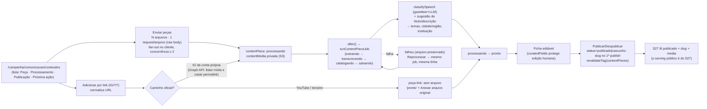

# Impl: C211 — Central de Conteúdos — enviar, transcrever e catalogar as peças de campanha (interno)

Status: em execução
Atualizado em: 2026-09-23
Issue: #1254
Intenção: docs/plans/central-conteudos-ingestao.md
Design UI (gate): docs/plans/central-conteudos-ingestao-ui-design.html
Appetite restante: herdado (~2–3 dias eng) — collection nova + pipeline + port classe-a-classe da UI; scraping, editor e fila genérica cortados.
Modo: autônomo (`--auto`) — impl plan nasce aprovado pelo agente.

> **Schema confirmado pelo humano no gate (2026-09-23).** As duas collections (`contentPiece`, `contentMedia`) e a migration `20260923_032714_add_content_piece` foram aprovadas (D1 upload novo; D2 sem `contentPieceSegment`; D7 slug no primeiro publish; D4 `sourceUrl` única). O que mudou na execução está em "Desvios registrados na execução", abaixo.

## Leitura da intenção

- **Outcome:** a assessoria sobe um lote de peças (ou cola um link do Instagram/YouTube) em `/campanha/comunicacao/conteudos` e cada peça sai com estado próprio ("Processando" | "Pronto" | "Falhou"), transcrição/texto e catalogação automática (título, descrição, tipo, temas, cidade, região, instituição, data, duração) — tudo editável —, e publica/despublica com um gesto; `communicator`/`coordinator`/`candidate` operam, `advisor`/`leader` negados (fail-closed).
- **O que NÃO negociar:**
  - Gate: `canReadCommunicationCatalog` (`src/lib/campaignRoles.ts:27-28`) — não criar gate gêmeo; advisor/leader negados na página, nas actions, na collection e na rota de mídia.
  - **Sem PII de eleitor e sem `Consent` novo** — a peça é material de campanha; `createdBy` é relação com `campaignUser`, não cadastro de pessoa. Nada aqui se parece com opt-in LGPD; se algo exigir Consent, **parar e registrar** (não é o caso).
  - Extração só por caminho oficial; **mídia de terceiro nunca é baixada**; sem scraping (scraping é investigação do C212, nunca mecanismo).
  - "Rascunho" é o padrão; despublicar tira da Central na hora **sem apagar arquivo**; "Falhou" preserva o arquivo e permite "Reprocessar".
  - **URL interna fixada:** `/campanha/comunicacao/conteudos`. **URL pública `/conteudos/<slug>`, página pública, filtros públicos e serving público da mídia são do S27** — este item não os cria.
  - Sem segunda cópia de arquivo que já tem dono (jingle/artigo/card) e sem duplicar peça que já tem dono no site.
  - Identificadores em inglês; literais visíveis em pt-BR; migrations existentes nunca editadas.
- **O que reavaliar (hipóteses do plano de intenção):**
  - "Adicionar por link extrai a mídia quando a plataforma oferecer caminho oficial": a Graph API **não tem fetch por link** — o caminho é listar `GET /{userId}/media` e casar o `permalink` com o link colado (`src/utilities/socialFeed/instagramFeed.ts:204-256`). Para o YouTube **não existe** caminho oficial de download de arquivo (a Data API só dá metadados) → peça-link.
  - "Lote" não tem precedente no app: C199 é 1 request/1 job por arquivo (`src/utilities/recordings/recordingUpload.ts:68-144`); o único precedente de lote é import CSV com token HMAC (`src/collections/SupporterImportBatch.ts`), que não se aplica a arquivos.
  - "Peça nasce Rascunho" (assumido no produto) permanece; publicar é gesto explícito.

## Abordagem recomendada

**Opções consideradas (abordagem geral):** A) collection própria da peça + upload privado novo, pipeline reusando os helpers do C199/puros, lote por fan-out no cliente, extração só pela Graph API da conta própria e catalogação gazetteer+LLM; B) modelar a peça sobre `recording`/`reel` existentes; C) modelar a peça sobre `media` (pública) com upload multipart.
**Recomendação:** **A** — é a única que mantém o dono de cada mecanismo (C199/C193 intocados), nasce fail-closed para rascunho e cabe no appetite reusando o que já é profundo (rota raw-body, job `after()`+reaper+retry condicional, mídia privada, taxonomias, shells de lista).
**Rejeitadas:** **B** porque acopla o ciclo de vida da peça ao da gravação/reel (delete/cascade, acesso e vocabulário alheios) e cria duas fontes de verdade para o mesmo arquivo; **C** porque `media` é leitura anônima por contrato (`src/collections/Media.ts:16-21`) — um rascunho vazaria por `/api/media/file/<filename>` — e multipart/FormData já foi descartado no C199 por buffer de horas de vídeo.

### D1 — Dono e serving da mídia (collection de upload)

**Opções:** A) collection de upload **nova e privada** `contentMedia` + rota interna autenticada sob `/campanha` + costura explícita para o S27 servir o publicado; B) reusar `media` (pública, leitura anônima); C) reusar `recordingMedia` (C199) ou `reelMedia` (C193).
**Recomendação:** **A** — `contentMedia` registrada em `s3Storage.collections` (`src/payload.config.ts:176-195`) e servida por `/campanha/comunicacao/conteudos/[id]/arquivo` com `buildPrivateMediaResponse` (`src/utilities/privateMedia/privateMediaResponse.ts:151-186`), o mesmo dono de I/O privado do C193/C199. **Costura com o S27 (contrato, não implementação):** o S27 lê `contentPiece.status === 'publicado'` + `slug` + `media` e serve o arquivo numa rota pública própria (gate `canServeContentMedia`/`contentPieceIsPublic`, puras em `src/lib/contentPiece.ts`), usando o mesmo helper — **sem segunda cópia** e **sem** `/api/media/file` (esse proxy só serve `media`). Sem `unstable_cache` neste item.
**Rejeitadas:** **B** porque `media.read: () => true` (`src/collections/Media.ts:16-21`) tornaria o arquivo de um rascunho publicamente alcançável por URL — mata o kill switch; **C** porque acopla donos: o acesso (`canReadRecording`), o delete em cascata e o vocabulário de C199/C193 não são os da peça, e a primeira mudança de um dono passaria a mexer no outro.

### D2 — Modelo da peça (collections, enums, campos)

**Opções:** A) **uma** collection `contentPiece` + upload `contentMedia`, **sem** collection de segmentos; transcrição guardada como texto na própria peça; enums com **valores pt-BR sem acento** e labels acentuados (precedente `activityStatuses`, `src/lib/schemas/activity.ts:52-59`); B) `contentPiece` + `contentPieceSegment` (transcrição com timestamps por segmento); C) duas collections (peça-arquivo × peça-link) + slug gerado no create.
**Recomendação:** **A** — o design aprovado fixa uma ficha com **uma** área "Transcrição" (não um player com trechos) e o S28 busca por texto; segmentos são custo de schema/cascade/índice sem consumidor hoje. Campos da peça (admin group `Comunicação`, labels "Peça"/"Peças", `useAsTitle: 'title'`):

- `title` — text, required, `CONTENT_PIECE_TITLE_MAX_LENGTH = 200`.
- `slug` — text, **unique + index, nullable**, readOnly; canônico e imutável depois do primeiro publish (D7).
- `type` — select required + index: `video` ("Vídeo") | `foto` ("Foto") | `texto` ("Texto") | `audio` ("Áudio") | `card` ("Card").
- `description` — textarea.
- `topics` — select hasMany + index, opções de `SPEECH_TOPICS` (`src/lib/speechFacets.ts:14-33`), como `Speech.topics` (`src/collections/Speech.ts:271-277`).
- `municipality` — relationship → `municipality` (opcional) + index; **uma** cidade por peça (o design mostra "Cidade · região").
- `region` — text readOnly; derivado de `territoryForCity(entry.city)` (`src/lib/bahiaTerritories.ts:636-650`).
- `institution` — text; nome canônico quando o catálogo casar (`institutionCatalog`/`institutionSpellings`, `src/lib/institutionCatalog.ts:112-126`), senão texto livre.
- `pieceDate` — date + index ("Data").
- `durationSeconds` — number readOnly (só vídeo/áudio, medido pelo provedor).
- `transcript` — textarea (transcrição ou texto extraído).
- `media` — upload → `contentMedia`, readOnly (dono do arquivo é o pipeline de upload/anexo).
- `sourceUrl` — text, **unique + index, nullable**, readOnly; URL canônica normalizada (D4).
- `origin` — select required + index, default `arquivo`: `arquivo` ("Arquivo enviado") | `instagram` | `youtube`.
- `status` — select required + index, default `rascunho`: `rascunho` ("Rascunho") | `publicado` ("Publicado").
- `publishedAt` — date readOnly; carimbado pelo hook na transição para `publicado` (precedente `stampReelPublishedAt`, `src/collections/Reel.ts:51-59`).
- `processingStatus` — select required + index, default `pronto`: `processando` ("Processando") | `pronto` ("Pronto") | `falhou` ("Falhou").
- `step` — select readOnly: `extraindo` | `transcrevendo` | `catalogando` | `salvando` (vocabulário próprio; **não** reusa `RECORDING_STEPS`, que é do C199 e não tem `catalogando`).
- `error` — textarea readOnly (causa crua; a UI mostra copy honesta mapeada).
- `searchText` — textarea readOnly; `normalizeForSearch` (`src/lib/speechSearch.ts:9`) de título+descrição+transcrição+labels de temas+cidade+região+instituição — é o que o placeholder "Buscar por título, tema ou cidade…" promete.
- `curatedFields` — select hasMany readOnly, valores = os campos de catalogação (D6).
- `createdBy` — `systemStampedActorField` (`src/utilities/campaignAuditFields.ts`).

Índices: únicos de `slug` e `sourceUrl`; btree em `type`, `status`, `processingStatus`, `municipality`, `piece_date`, `topics`; **GIN trigram à mão** em `search_text` (mesmo padrão de `src/migrations/20260919_003440_add_recording.ts:83-84`). `contentMedia`: slug `contentMedia`, labels "Mídia de peça"/"Mídias de peças", `alt` required, `upload: true`, access = predicados novos.

**Migration:** `pnpm migrate:create add_content_piece` → `20260922_<HHMMSS>_add_content_piece` (as duas tabelas + enums + índices no mesmo arquivo; o índice trigram é acrescentado à mão no arquivo gerado, com `IF NOT EXISTS`). `pnpm migrate` local + `pnpm generate:types`; **nenhuma migration existente é editada**.
**Rejeitadas:** **B** porque o design não pede timestamp e um `contentPieceSegment` traria cascade, índice e loader sem consumidor (gatilho de revisitação: se o S27 pedir player com trechos ou o S28 pedir embeddings por trecho, é item próprio); **C** porque duplicaria a máquina de link/arquivo e criaria duas fontes de verdade para "peça".

### D3 — Pipeline de job e lote

**Opções:** A) **1 request por arquivo** na rota raw-body (padrão C199, `src/utilities/recordings/recordingUpload.ts:68-144`; rota `.../gravacoes/enviar/route.ts:56-121`), com **fan-out no cliente** (concorrência ≤ 2, progresso por arquivo via `upload.onprogress`), **sem entidade de lote**; job por peça via `after()` (`recordingScheduler.ts:15-19`), reaper preguiçoso de 60 min e retry condicional (`actions/recording.ts:67-96,102-143`); B) entidade de lote + token HMAC (precedente `supporterImportBatch`/`supporterImportToken`); C) multipart único com todos os arquivos.
**Recomendação:** **A** — é o mecanismo já provado no C199, dá progresso e falha isolada por arquivo (o design cenas 02/05 mostram exatamente isso) e evita estado de lote para limpar. Política do lote: `CONTENT_PIECE_BATCH_MAX_FILES = 50` (o picker recusa acima com copy clara — "limite generoso com aviso", recomendação do produto), `CONTENT_PIECE_MAX_BYTES = 4 GiB` por arquivo (streaming com teto, nunca buffer), tipo derivado do MIME/arquivo no **servidor** (`contentPieceTypeFromMime`, fail-closed), `video|audio` → `processando` + job; `texto` → `processando` + job (extrai o texto do arquivo); `foto|card` → `pronto` direto (o aceite não pede transcrição). Jobs concorrentes: sem semáforo no servidor (mesma política do C199; o fan-out ≤ 2 do cliente espaça as subidas) — **gatilho de revisitação:** se lotes > ~20 arquivos saturarem o box, um worker limitado vira item próprio (fila genérica é rabbit hole cortado pela intenção).
**Rejeitadas:** **B** porque o lote é só um agrupamento visual do cliente — uma collection de lote adiciona estado órfão, limpeza e reaper sem mudar o outcome (o token HMAC do CSV existe para _adiar_ um payload validado, não é o caso); **C** porque um request com N arquivos bufferiza/multiplexa mídia de horas e perde progresso e isolamento por arquivo (mesma razão pela qual o C199 descartou FormData).

### D4 — Adicionar por link e extração

**Opções:** A) extração **só** pela Graph API da conta própria (token/ID no global admin-only `social-feed-settings`, `src/globals/SocialFeedSettings.ts:63-66,137-153`): listar `/{userId}/media` com `permalink,media_url,media_type,timestamp,caption` e **casar o permalink** com o link colado; achou → baixa o arquivo (caminho oficial) e enfileira o **mesmo** pipeline; não achou/erro/sem token → peça-link (`origem` do host, sem arquivo, `pronto`) com "Anexar arquivo original"; YouTube e terceiros **sempre** peça-link (a Data API não entrega arquivo); **sem oEmbed**; B) oEmbed (IG/YT) para enriquecer metadados/thumbnail; C) só link para todos, sem extração.
**Recomendação:** **A** — cumpre a decisão do gate ("mídia extraída e catalogada quando houver caminho oficial") sem scraping e sem baixar mídia de terceiro; a normalização da URL (hosts IG/YT, path, remoção de `igsh`/`utm_*`, forma canônica) é pura e testável, com precedente de parse de host do YouTube em `src/lib/speechVod.ts:138`. **Dedup:** `sourceUrl` normalizada com **unique index** (nullable) + probe na action antes de criar; violação de corrida mapeada para a mesma mensagem segura ("Esta peça já está na Central.") — sem duas peças para o mesmo link. Título inicial identificável (`Instagram · <shortcode>` / `YouTube · <videoId>`), substituído pela catalogação (D5) enquanto não curado.
**Rejeitadas:** **B** porque oEmbed não entrega arquivo (só embed/thumbnail) e o C212 é quem vai recomendar o mecanismo de enriquecimento — implementar agora seria decidir no lugar dele (gatilho: achados do C212); **C** porque contraria a decisão registrada no gate.

### D5 — Shape da catalogação automática

**Opções:** A) gazetteer puro (`classifySpeechByGazetteer`, `src/lib/speechGazetteer.ts:449-476`) + refinamento validado reusando `classifySpeech` (`src/utilities/speech/speechClassifier.ts:76-136`) + **nova** sugestão de título/descrição com prompt de peça (`suggestContentPieceMetadata`, mesmo contrato never-throws/fallback determinístico de `speechCutMetadata.ts:68-114`); B) generalizar `suggestSpeechCutMetadata` para a peça; C) só gazetteer, sem LLM.
**Recomendação:** **A** — reusa a taxonomia e o refinamento que já existem (temas/cidade vêm do gazetteer + LLM validado) e mantém a sugestão de título/descrição num módulo novo porque o prompt do corte fala de "cortes de falas… no acervo da Câmara" — semântica errada para card/foto de campanha. Regras de preenchimento (fail-closed, sem inventar): cidade só quando a menção é **inequívoca** (exatamente 1 município no texto), região derivada; instituição só quando casa o catálogo; temas do merge validado; título/descrição com fallback determinístico (título atual/filename + tipo/temas/cidade). Tudo escrito somente nos campos ainda **não curados** (D6). Sem LLM quando não há texto (Foto/Card) — e sem `scopes`/pessoas/programas/projetos no schema (só o que o design fixa; revisitar no S28).
**Rejeitadas:** **B** porque arrastaria janela/segmento e o prompt errado para dentro do dono do corte (o C167), acoplando dois domínios; **C** porque o aceite pede título/descrição automáticos como ponto de partida.

### D6 — Escrita concorrente: job × curadoria

**Opções:** A) rastrear curadoria **por campo** (`curatedFields`): o job relê a linha fresca dentro da transação e só escreve campo não curado; a edição humana marca os campos que enviou; B) last-write-wins; C) a primeira edição congela toda a catalogação automática.
**Recomendação:** **A** — é a única que impede o clobber silencioso nos dois sentidos (o job não apaga edição humana; a edição parcial não apaga estado do job, porque o update da action envia só os campos do form e o job é o único que escreve `processingStatus/step/error`). O job marca seus writes com `context.contentPieceSystemWrite` para o hook de curadoria não os contar como humanos; hooks de derivação (`region`, `searchText`) usam `originalDoc` como fallback para update parcial (padrão `deriveSpeakerNames`, `src/collections/Recording.ts:61-68`).
**Rejeitadas:** **B** porque a assessoria abre a ficha enquanto o job roda (é o fluxo do design) e um job lento sobrescreveria o título recém-editado; **C** porque um ajuste cedo no título bloquearia transcrição/temas, contrariando "catalogação é ponto de partida".

### D7 — Slug canônico (URL pública do S27)

**Opções:** A) gerado na **primeira transição para `publicado`** (do título vigente), imutável depois; rascunho tem `slug: null`; B) gerado no create a partir do título/filename, imutável; C) re-derivado a cada edição de título.
**Recomendação:** **A** — o título nasce do filename e é substituído pela catalogação; gerar no publish dá URL de qualidade (`/conteudos/fim-da-escala-6x1-e-saude`) e mantém o contrato do S27 (estável/único). Unicidade com probe + `acquireTextAdvisoryLocks` no hook, no precedente `CampaignDemand.ts:109-140` (candidatos `-2`, `-3`…), rodando dentro da transação da action de publicação. Despublicar **não** limpa slug nem `publishedAt` (Reel: sair de publicado não apaga o carimbo).
**Rejeitadas:** **B** porque o slug congelaria a versão-filename ("fala-sus"); **C** porque quebraria link compartilhado a cada rename (contrato do S19: URL nova exige slug novo, não mutação).

### Componentes / mudanças

- **`src/lib/contentPiece.ts`** (novo, puro, sem `server-only`): vocabulário (`CONTENT_PIECE_TYPES/STATUSES/PROCESSING_STATUSES/STEPS` + labels), limites (`CONTENT_PIECE_TITLE_MAX_LENGTH`, `CONTENT_PIECE_MAX_BYTES`, `CONTENT_PIECE_BATCH_MAX_FILES`, `CONTENT_PIECE_TEXT_MAX_BYTES`), regras (`contentPieceTypeFromMime`, `contentPieceFileTypeAllowed`, `needsProcessing`, `canRetryContentPiece`, `canServeContentPieceMedia`, `contentPieceIsPublic`), derivadores puros (`contentPieceTitleFromFilename`, `contentPieceSlugCandidates`, fallback de metadados) e o view model do item de lista — espelho enxuto de `src/lib/recording.ts:17-153`, **sem** copiar segmentos/diarização.
- **`src/lib/schemas/contentPiece.ts`** (novo): zod de entrada + mensagens seguras (`CONTENT_PIECE_FORBIDDEN_MESSAGE`, `CONTENT_PIECE_NOT_FOUND_MESSAGE`, `CONTENT_PIECE_RETRY_NOT_FAILED_MESSAGE`, `CONTENT_PIECE_GENERIC_ERROR_MESSAGE`, `CONTENT_PIECE_LINK_INVALID_MESSAGE`, `CONTENT_PIECE_LINK_DUPLICATE_MESSAGE`), no molde de `src/lib/schemas/recording.ts`.
- **`src/collections/ContentPiece.ts`** / **`src/collections/ContentMedia.ts`** (novos): campos/access de D2/D1; hooks `setCanonicalContentPieceSlug` (D7), `deriveContentPieceRegion`, `deriveContentPieceSearchText`, `trackContentPieceCuratedFields` (D6), `stampContentPiecePublishedAt` (Reel), `stampCampaignCreatedBy`; `beforeDelete` não é necessário (sem coleção dependente).
- **`src/utilities/access/contentPieces.ts`** (novo): `canReadContentPiece`/`canCreateContentPiece`/`canUpdateContentPiece`/`canDeleteContentPiece` — predicados **próprios**, nunca alias, como `src/utilities/access/recordings.ts:15-44`; reexport no barrel `src/utilities/campaignAccess.ts:180-186`.
- **`src/utilities/content/`** (subpasta de domínio — evita o pin de top-level, `tests/unit/codebaseConventions.unit.spec.ts:409-556`):
  - `contentPieceUpload.ts` — `receiveContentPieceUpload` (cria linha → stream p/ temp com teto → cria `contentMedia` em transação → agenda job) e `attachContentPieceMedia` (peça-link ganha o original; recusa quando já há mídia), no molde de `recordingUpload.ts:68-144`.
  - `contentPieceScheduler.ts` — `startContentPieceJobInBackground` com `after()`.
  - `contentPieceJob.ts` — `runContentPieceJob` (branch por tipo; reusa `deepInfraTranscribeSegments` `src/utilities/ai/deepInfraTranscribe.ts:98-137`, `buildRecordingAudioFfmpegArgs`/`mergeChunkTranscriptions`/`RECORDING_AUDIO_CHUNK_SECONDS` de `src/lib/recordingTranscription.ts:10-141`, `downloadPrivateMediaToFile` de `privateMediaResponse.ts:193-223`; saving transacional com releitura fresca, D6) + `reapStaleContentPiece` (60 min) — espelho de `recordingJob.ts:126-363`.
  - `contentPieceCataloging.ts` — `catalogContentPiece` (D5) + `suggestContentPieceMetadata` (never-throws/fallback).
  - `contentPieceLink.ts` — `normalizeContentPieceLink`, `extractInstagramMediaUrl` (Graph API, casa permalink; nunca lança), `contentPieceOriginFromLink`.
  - `contentPieceListUrl.ts` / `contentPieceListFilters.ts` — contrato de URL (q, page, `type[]`, `status[]`, `processing[]`) sobre `campaignListUrl.ts:117-153`, no molde de `recordingListUrl.ts:114-134`.
  - `contentPiecePageData.ts` / `contentPieceData.ts` / `contentPieceViewModels.ts` — loaders da lista/detalhe e view models (busca `ILIKE` em `search_text` com índice trigram; `columnVisibility` via `readCampaignColumnVisibility('conteudos')`, novo id em `src/lib/campaignColumnVisibility.ts:20-35`).
- **`src/app/(campaign)/campanha/actions/contentPieces.ts`** (novo): `updateContentPieceForActor` (ficha + `curatedFields`), `setContentPiecePublishedForActor` (kill switch, precedente `actions/reels.ts:29-57` + transação do slug D7), `retryContentPieceForActor` (update condicional `falhou`→`processando`, precedente `actions/recording.ts:67-96`), `getContentPieceStatusesForActor` (poll ≤ 50 + reaper), `addContentPieceByLinkForActor` (D4), `deleteContentPieceMediaForActor`? **não** — sem delete neste item (ver Não escopo).
- **Rotas** (`src/app/(campaign)/campanha/(app)/comunicacao/conteudos/`): `page.tsx` (lista, `requireCampaignPageActor({ gate: 'communicationCatalog' })`, `src/utilities/campaignPageActor.ts:81-83`), `[id]/page.tsx` (ficha; título próprio via `SetCampaignPageChrome`), `enviar/route.ts` (POST raw body — **allowlist** do sweep de POST, `tests/unit/codebaseConventions.unit.spec.ts:202-229`), `[id]/arquivo/route.ts` (GET serve + POST anexa raw body — segunda entrada na allowlist), `[id]/retry/route.ts`, `[id]/publicacao/route.ts`, `status/route.ts`, `link/route.ts` (os quatro últimos via `campaignJsonMutationRoute`, `src/utilities/campaignJsonMutationRoute.ts:98-119`), `formActions.ts` (casca de `runCampaignFormAction`, `src/utilities/campaignFormActionError.ts:73-105`), `types.ts` (envelopes das rotas).
- **`src/components/campaign/content/`** (novo): `ContentPieceTable` (colunas como dado: Peça · Processamento · Publicação · Próxima ação — `CampaignTable.tsx:27-63,155-224`), `ContentPieceResultList/Card` (mobile 390, no molde de `RecordingResultList.tsx`), `ContentPieceUploadDialog` (multi-arquivo, XHR + `upload.onprogress` por arquivo, "Tentar de novo"/"Concluir lote", no molde de `RecordingUploadDialog.tsx:119-172`), `AddContentPieceLinkDialog` (com o bloco "Sem scraping." + estados "Extraída"/"Peça-link"), `ContentPieceForm` (ficha: Título, Descrição, Tipo, Data, Temas, Cidade·região, Instituição, Transcrição + Publicar/Despublicar + Salvar), `ContentPieceAttachFileDialog`, `ContentPieceStatusBadge`, `ContentPieceStatusRefresher` (poll 5 s, molde `RecordingStatusRefresher.tsx:32-62`), `ContentPieceRetryButton`.
- **Nav / paths / chrome:** `CAMPAIGN_COMMUNICATION_CONTEUDOS = '/campanha/comunicacao/conteudos'` + helpers em `src/lib/campaignPaths.ts:53-78`; sub-item "Conteúdos" em `communicationSubItems` (`src/components/campaign/shell/nav.ts:63-67`); entrada `conteudos` no catálogo + regra de path antes do regex genérico (`src/lib/campaignPageChrome.ts:119-137,296-325`).
- **S3:** `contentMedia: true` em `s3Storage.collections` (`src/payload.config.ts:176-195`) — sem essa entrada o arquivo cai no disco efêmero do container em produção (modo de falha do C199/C193).
- **Revalidação (costura mínima com o S27):** todo write da peça (create/update/publish/job) chama `revalidateTag(getCollectionListingTag('contentPiece'))` de `src/utilities/documents.ts:26-28` (mesmo dono do tag dos jingles) — nenhum `unstable_cache` novo aqui.
- **Migration:** `20260922_<HHMMSS>_add_content_piece` (D2) + registro em `src/migrations/index.ts` (gerado); índice trigram à mão.
- **Access / Consent:** `contentPieces.ts` (D1/D2); **sem chave de Consent** — registrado: não há PII de eleitor, opt-in nem art. 11 neste item.
- **UI:** Impeccable C — fluxo novo na vertical; port **classe-a-classe** do design aprovado (4 cenas desktop + 2 mobile 390), shape→craft→critique→polish sobre os shells existentes (`CampaignPageShell`, `CampaignTable`, `CampaignListPendingBoundary/Results`, `CampaignListFooter`, `CampaignListEmptyState`, `CampaignSearchInput`/omnibox, `CampaignColumnPicker`).
- **Changelog:** `docs/changelog/2026-09-22-c211.md` (uma entrada curta; nunca editar o agregado/HISTORY).

### Dados → forma (se aplicável)

N/A — superfície interna de trabalho, sem KPI, agregado ou série; a intenção declara "sem contadores de vaidade e sem score de busca exposto". O único dado derivado é a catalogação (metadados + transcrição/texto), que é conteúdo da peça, não apresentação de dado.

## Desvios registrados na execução (2026-09-23)

- **`contentPieceSegment` continua fora** e `curatedFields` é escrito pela **action** da ficha (não por hook): o job apenas lê a lista fresca dentro da transação e filtra o que escreve. Mais simples que marcar writes de sistema por `context` e igualmente à prova de clobber.
- **Revalidação em `afterChange` da collection** (não em cada caller): `revalidateContentPiecesListing` (`src/utilities/documents.ts`) busta o tag `contentPieces` em todo write da peça — job, ficha, kill switch —, que é a costura de cache do S27.
- **Peça `texto` arquiva o arquivo**: a extração preenche a transcrição, mas o `contentMedia` é criado como em qualquer tipo, para "despublicar preserva o arquivo" e o download valerem também para texto.
- **`canDeleteContentPiece` não existe**: o delete da collection é `payloadAdminOnly` (não há superfície de apagar peça neste item; o plano já registrava isso em Não escopo).
- **`canServeContentPieceMedia` não existe como predicado**: a rota interna serve quando há `media`; o predicado do contrato público é `contentPieceIsPublic` (puro, consumido pelo S27).
- **Sem pin em `tests/helpers/campaignFixtures.ts`**: o int spec limpa as próprias linhas (precedente C199 — recordings também não entram na union), então não há vazamento; a union fica para quando um segundo spec precisar.
- **`instagramFeed.InstagramPost` ganhou `mediaUrl`** (o `MEDIA_FIELDS` já pedia `media_url`; só não era exposto) — extensão aditiva no dono, sem segundo fetch.
- **A lista não reapa no render**: o reparo de `processando` velho vive no action de status (chamado pelo poll de 5 s), como no C199; o loader ficou só leitura.
- **Índice em `origin` não foi criado** (nenhuma query filtra por ele hoje); `topics`/`tipo`/`status`/`processingStatus`/`municipality`/`piece_date`/`slug`/`sourceUrl` têm índice.

## Fases verificáveis

1. **Tracer / schema+server — quota ~40%:** `src/lib/contentPiece.ts` + `src/lib/schemas/contentPiece.ts`; collections `ContentPiece`/`ContentMedia` + access + barrel; `pnpm migrate:create add_content_piece` (com o trigram à mão) + `pnpm migrate` + `pnpm generate:types`; `contentPieceUpload`/`contentPieceScheduler`/`contentPieceJob` para **vídeo**; `enviar`/`status`/`retry`/`publicacao`/`[id]/arquivo`; action de publish com slug; unit + int do caminho felizes e do retry verdes antes de seguir.
2. **Link + catalogação — quota ~20%:** `contentPieceLink` (Graph API com fetch injetável), `contentPieceCataloging`, `texto`/`foto`/`card` no job, dedup de `sourceUrl`; unit/int de link sem caminho oficial e com caminho mockado.
3. **UI (port classe-a-classe) — quota ~30%:** lista (tabela + cards mobile), diálogo de lote, diálogo de link, ficha editável + Publicar/Despublicar + Reprocessar + Anexar original, nav/chrome/paths; pins de nav/chrome atualizados.
4. **Gates — quota ~10%:** `pnpm gate:fast` (lint + typecheck + unit); `pnpm test:int` (suíte cheia: 100 arquivos verdes); `pnpm check:cycles`/`knip` limpos; e2e da superfície (`campaignSpeechAcervo.e2e.spec.ts`, 31 testes, incl. os 7 novos de C211) verde; `pnpm push` → PR `--base main`. Verificação viva feita pelos próprios e2e (rotas reais: lista, ficha, publish/unpublish, arquivo com range/download, link/duplicado).

## Testes previstos

- **`tests/unit/contentPiece.unit.spec.ts`** (novo): vocabulário/labels; `needsProcessing` (foto/card não; vídeo/áudio/texto sim); `canRetryContentPiece` (só `falhou`); `canServeContentPieceMedia`/`contentPieceIsPublic`; `contentPieceTypeFromMime`/allowlist; título a partir do filename; candidatos de slug; normalização de link (IG `/p/`/`/reel/`/`/reels/`, YT `watch?v=`/`youtu.be`/`shorts`, remoção de `igsh`/`utm_*`, host inválido → null); fallback de metadados; `parseContentPieceListParams`/`buildContentPieceListWhere`/canonicalização de URL.
- **`tests/unit/contentPieceCataloging.unit.spec.ts`** (novo, deps injetadas): sem texto → não escreve nada; 1 município → cidade+região; >1 → cidade vazia; instituição só com match de catálogo; LLM falhando → fallback determinístico; `curatedFields` respeitado.
- **`tests/int/contentPiece.int.spec.ts`** (novo, molde `tests/int/recording.int.spec.ts`): access negado (advisor/leader) na collection e nas actions, communicator ok; upload → `processando`/`extraindo` → job (ffmpeg fake + transcritor injetado) → `pronto` com transcrição, duração, temas, cidade, `searchText`, arquivo preservado; falha → `falhou` + step + erro + arquivo; retry só de `falhou` e dois retries concorrentes = 1 job; reaper (`processando` velho → `falhou`; `uploading` órfão → apagado); `texto` extrai o conteúdo sem transcrever; `foto`/`card` nascem `pronto`; publish carimba `publishedAt` e gera slug 1×, colisão gera `-2`, despublicar preserva slug/publishedAt, republicar mantém o slug mesmo com título novo; `curatedFields` protege o título editado durante o job; link sem token → peça-link sem mídia; link com Graph API mockada → mídia extraída + job; link duplicado → mensagem segura e sem segunda linha; rota `[id]/arquivo` 404 para negado/anon e 200 com range para communicator; loader da lista busca por título/tema/cidade e filtra por tipo/status/processamento.
- **e2e:** nova seção "conteúdos (C211)" em `tests/e2e/campaignSpeechAcervo.e2e.spec.ts` (precedente da seção C199 no mesmo arquivo): fixture `pronto` via payload → lista desktop (tabela) e mobile (cards) → ficha → Publicar → badge "Publicado" → Despublicar; peça-link mostra "Peça-link"; upload real pelo diálogo gera linha com estado honesto (`Processando`/`Falhou`). A seleção curada roda pelo manifesto.
- **Fixtures:** `contentPiece`/`contentMedia` entram na union `CampaignCollection` e na ordem de cleanup de `tests/helpers/campaignFixtures.ts:33-50,1017-1045` (peça antes da mídia, na direção da FK).

## Pins a atualizar (valores exatos)

- **`tests/unit/campaignNav.unit.spec.ts:101-133`** — `expectedSubHrefs` ganha `CAMPAIGN_COMMUNICATION_CONTEUDOS` e a lista de títulos ganha `'Conteúdos'` (o teste de overflow herda).
- **`tests/unit/campaignPageChrome.unit.spec.ts:61-86`** — pin novo: `/campanha/comunicacao/conteudos` → `{ title: 'Conteúdos' }`; `/campanha/comunicacao/conteudos/7` → `null`.
- **`tests/unit/codebaseConventions.unit.spec.ts:202-229`** — allowlist com duas entradas e motivo: `.../conteudos/enviar/route.ts` (upload raw-body) e `.../conteudos/[id]/arquivo/route.ts` (anexo raw-body) — "cookie-authenticated via campaign-token + explicit same-origin check; cannot ride the JSON wrapper".
- **`tests/unit/codebaseConventions.unit.spec.ts:409-556`** — **intocado**: nenhum módulo novo no top-level de `src/utilities/` (tudo em `src/utilities/content/`).
- **`scripts/lib/e2e-affected-manifest.mjs:355-382`** — adicionar `src/components/campaign/content`, `src/utilities/content` e `src/lib/contentPiece` à entrada da vertical de comunicação (specs `campaignSpeechAcervo`, `campaignSpeechCut`, `campaignReel`) — a área de risco `src/utilities/access`/`src/lib/schemas` já está mapeada.
- **`tests/helpers/campaignFixtures.ts:33-50`** — union + `emptyOwnedIDs` + ordem de cleanup.

## Rabbit holes / Não escopo (engenharia)

- **Fila/worker genérico, retomada, chunking de upload, retry global, tempo real** — cortados pela intenção; o lote é fan-out do cliente + estado por peça.
- **Entidade de lote / token HMAC / batch collection** — rejeitada em D3.
- **Segmentos com timestamp, diarização AssemblyAI, faceta de pessoa** — vocabulário e mecanismos do C199; não copiar cego (D2).
- **oEmbed / scraping / download de mídia de terceiro / varredura do perfil** — o mecanismo é o C212; aqui só o link manual e a conta própria por Graph API.
- **Página pública, filtros públicos, OG, share, `SHARE_LINK_RESERVED_SLUGS`, serving público** — S27; aqui só `status`/`slug`/`media` + a tag de revalidação.
- **Gerar thumbnail/poster das peças, player com trechos, editor de mídia, gerador de card** — o design usa placeholder de asset; preview real é o arquivo na ficha.
- **Delete de peça pela Central** — não está nos literais/design; o admin remove se preciso. Gatilho de revisitação: se a assessoria pedir "apagar peça", item curto próprio (com o mesmo padrão do delete de gravação, `actions/recording.ts:232-269`).
- **Contadores/views/score de busca, analytics** — C213.
- **`scopes`/`mentionedPeople`/`mentionedPrograms`/`mentionedProjects` no schema** — sem consumidor hoje (S28 decide).
- **Segundo gate de comunicação, Consent novo, cadastro paralelo a `Contact`** — proibidos.

## Riscos e mitigação

- **Job perdido em restart/deploy** (não há fila): reaper preguiçoso no poll de status marca `processando` velho como `falhou` e apaga `uploading` órfão — mesma classe do C199 (`recordingJob.ts:337-363`); o arquivo é preservado e "Reprocessar" reusa a linha.
- **Rascunho vazando por URL de mídia:** `contentMedia` é privada e o único serving interno é sob `/campanha` com gate; a rota responde 404 silencioso a negado/anon (padrão `[id]/arquivo/route.ts` do C199).
- **Clobber entre job e curadoria:** D6 (`curatedFields` + releitura fresca na transação); teste int dedicado.
- **Slug duplicado/instável:** unique index + probe sob advisory lock no primeiro publish (D7); despublicar não limpa.
- **Link colado de post que não está nas mídias recentes da conta:** extraction falha fechada → peça-link; nunca cria linha pela metade (o arquivo baixado só vira `contentMedia` quando o download completa; a linha nasce antes, e falha de download marca `falhou` com a linha preservada — mesma escolha do C199).
- **Token do Instagram inválido/expirado:** a extração degrada para peça-link (fail-closed, sem erro na cara da assessoria); o estado do token continua no painel do global (S11), que não é tocado.
- **`searchText` dessincronizado em update parcial:** hook de derivação com fallback `originalDoc` (padrão `deriveSpeakerNames`); teste int de publish (que envia só `status`).
- **Custo/limite da Graph API:** listar até 100 mídias recentes por link; uma chamada por link adicionado (não é varredura); se o post for mais antigo que a janela, cai em peça-link — aceito e documentado.
- **S3 sem a entrada da collection:** boot não quebra, mas o arquivo cai no disco efêmero em prod (o modo de falha que o comentário do C199 registra em `src/payload.config.ts:179-184`) — mitigação: entrada no mesmo PR + verificação viva no deploy de staging.
- **PR roda suíte ampla** (toca `src/utilities/access` e `src/lib/schemas`, risk prefixes do OPS86): esperado, nunca zero e2e; rodar `gate:fast` + int local antes do push.

## Aceite de engenharia

- [ ] Aceite de produto da intenção coberto: lote com estado por peça ("Processando"/"Pronto"/"Falhou"), transcrição para Vídeo/Áudio, texto extraído para Texto, Foto/Card sem transcrição, catalogação automática editável, link IG/YT com extração por caminho oficial e peça-link como fallback, Rascunho/Publicado com despublicar preservando arquivo, "Reprocessar".
- [ ] Guardrails: advisor/leader negados (fail-closed) na página, actions, collection e mídia; sem scraping, sem download de terceiro, sem PII, sem Consent novo; sem segunda cópia de mídia que já tem dono; URL pública não criada (S27).
- [ ] Invariantes AGENTS/engineering-standards: Local API com `user` + `overrideAccess: false` (bypass só com comentário); escrita multi-collection em transação com `req: { transactionID }`; identificadores em inglês/copy pt-BR; migrations existentes intocadas; collection nova na lista do S3.
- [ ] Testes de domínio previstos (unit/int) onde access e write paths mudam; pins de nav/chrome/conventions/manifest atualizados; fixtures com cleanup.
- [ ] `pnpm gate:fast` verde; `pnpm test:int` do spec novo verde; e2e curado verde; `pnpm push` via GitHub.

## Decisões de engenharia

- **D1 — Upload/serving:** collection **nova** `contentMedia` (privada, no S3) + rota autenticada sob `/campanha`; S27 serve o publicado pela mesma mídia, sem segunda cópia. Rejeitadas: `media` (rascunho vazaria) e reuso de `recordingMedia`/`reelMedia` (acopla donos).
- **D2 — Modelo:** **uma** collection `contentPiece` + `contentMedia`, sem segmentos; enums pt-BR (`video|foto|texto|audio|card`, `rascunho|publicado`, `processando|pronto|falhou`, `extraindo|transcrevendo|catalogando|salvando`); `topics` reusa `SPEECH_TOPICS`; cidade única + região derivada; `searchText` com trigram à mão; migration `20260922_<HHMMSS>_add_content_piece`. Rejeitadas: `contentPieceSegment` (sem consumidor) e duas collections arquivo/link (duas verdades).
- **D3 — Pipeline/lote:** 1 request/arquivo raw-body (padrão C199) + fan-out no cliente (≤ 2, ≤ 50 arquivos, 4 GiB/arquivo) + `after()` + reaper 60 min + retry condicional; sem entidade de lote; `foto|card` nascem prontos. Rejeitadas: batch collection/token HMAC (estado a mais) e multipart (buffer/isolamento).
- **D4 — Link:** extração só pela Graph API da conta própria (listar mídia e casar permalink) com fallback peça-link; YouTube/terceiros só link; `sourceUrl` normalizada e **única**; sem oEmbed (C212 decide). Rejeitadas: oEmbed agora (não entrega arquivo; invade o C212) e só-link (contraria o gate).
- **D5 — Catalogação:** gazetteer puro + `classifySpeech` reusado + `suggestContentPieceMetadata` novo (never-throws/fallback); cidade só quando inequívoca; instituição só com match de catálogo. Rejeitadas: generalizar o prompt de corte (semântica errada) e só gazetteer (sem título/descrição automáticos).
- **D6 — Concorrência job×curadoria:** `curatedFields` por campo + releitura fresca na transação; o job só escreve campo não curado. Rejeitadas: last-write-wins (clobber) e congelar tudo após editar (mata o enriquecimento).
- **D7 — Slug:** gerado no **primeiro publish** do título vigente, único sob advisory lock, imutável depois; despublicar preserva. Rejeitadas: no create (URL ruim) e re-derivado (quebra link).
- **Serving público:** **não** implementado aqui — costura explícita (status/slug/media + `canServeContentMedia` + tag `contentPieces`); S27 decide URL e cache.
- **Sem Consent novo** — peça interna sem PII de eleitor; registrado, não presumido.

## Self-score

**Self-score decision-quality: 4/5.** (1) Decisões caras (collection/serving, schema/slug, pipeline/lote, link, catalogação, concorrência) têm opções + recomendação + rejeitadas explícitas — mas o schema nasce sinalizado para confirmação humana, o que impede o 5. (2) Cabe no appetite herdado: reusa os mecanismos profundos do C199/puros e corta fila, scraping, segmentos e serving público. (3) Rabbit holes nomeados (fila, batch, segmentos, oEmbed, delete, poster, facetas extras). (4) Depth check: shells de lista, `campaignJsonMutationRoute`, `runCampaignFormAction`, mídia privada, taxonomias, `after()`/reaper/retry e tags são reusados; módulos novos só onde não há dono (vocabulário da peça, catalogação da peça, link da peça). (5) Outcome preservado: a engenharia não reescreve o aceite nem invade o S27/C212/C213.
