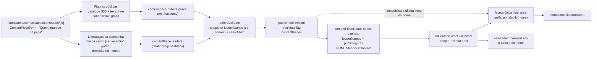

# Impl: S37 — Central de Conteúdos — lideranças que aparecem nas peças (propriedade e filtro)

Status: aprovado (modo `--auto`) — hard-stops de schema/URL público pendentes de aprovação humana explícita
Atualizado em: 2026-09-24
Issue: #1303
Intenção: docs/plans/central-conteudos-liderancas.md
Design UI (gate): docs/plans/central-conteudos-liderancas-ui-design.html
Appetite restante: herdado (~2 dias eng) — **uma propriedade nova na ficha (C211) + uma faceta nova no catálogo (S27)**, sem fluxo novo. Corte explícito para caber: catalogação automática intocada (sem sugestão de nomes), sem filtro/coluna na lista interna, sem e2e de browser do picker (unit de componente + int + e2e público cobrem), personalidades por texto livre (a semente do catálogo é o roster S30).

> Aprovado pelo próprio agente via `--auto` (modo autônomo do `work-issue`); a pausa do GATE virou apresentação-no-chat. Os hard-stops abaixo seguem exigindo aprovação humana explícita — `--auto` aprova o plano, não o schema nem o contrato público.

## Leitura da intenção

- **Outcome:** a ficha da peça registra dois recortes de "quem aparece" — lideranças da campanha (registros existentes) e figuras públicas (texto curado com catálogo) — e o catálogo público ganha **uma** faceta `Lideranças` que une os dois, mostrando só nomes de quem aparece em peça publicada (fail-closed); o nome entra na busca por termo e ninguém vê contato, território, status ou votos.
- **O que NÃO negociar:**
  - Fail-closed de exposição: a faceta deriva **só** de peças publicadas; despublicar a última peça com um nome remove o nome na hora (tag `contentPieces` já busta em todo write).
  - Nada de dado interno: sem telefone, e-mail, municípios, organizações, `supportStatus`, `estimatedVotes`; leader lockdown e `Consent`/LGPD intocados.
  - Sem cadastro paralelo de pessoa: liderança = registro existente (`leadership` → `contact`); figura pública = texto + catálogo (molde `institution`).
  - Uma faceta só (decisão literal do humano: "Os dois"); curadoria humana manda — nada de a catalogação sobrescrever/decidir por gente.
  - Nomes só de exibição: sem contagem, ranking, página por pessoa.
- **O que reavaliar (hipóteses da "Direção no codebase"):**
  - "A catalogação sugere" — **não no v1**: menção no transcript ≠ aparição na peça; sugerir nomes por match textual poluiria uma lista pública (D5 rejeita A/C e mantém `contentPieceCataloging.ts` intocado).
  - "A faceta pública deriva das peças" — confirmado, mas a denormalização precisa **morar na peça**: o read público (`contentPieceReads.ts:26-43`) tem `select` explícito e não pode ganhar a relação (depth 1 vazaria `Contact`). Entra um snapshot de **nomes** na própria peça (D1/D3).
  - "A ficha marca a liderança existente" — o access real nega `communicator` (`canReadLeadership` → `resolveProfileScopedRead`, `src/utilities/access/leaderships.ts:31-32`), que é justamente quem edita a ficha; sem um caminho gated a persona principal fica cega (D1).
  - "Figuras públicas no molde de Instituição" — o molde é **texto + catálogo**, sem relação com `stateDeputy`; a semente vem do `stateDeputyCatalog` (S30) para não duplicar as 53 linhas (D2).

## Abordagem recomendada

**Opções consideradas (abordagem geral):** A) relationship `leaders` + snapshot público de nomes na peça + busca interna gated com projeção mínima + figuras em texto/catálogo derivado do S30 + faceta única derivada dos nomes publicados; B) tudo texto livre na peça (liderança e figura), sem vínculo nem catálogo; C) relação direta com `stateDeputy` para as figuras e liberar `canReadLeadership` para a comunicação.
**Recomendação:** **A** — preserva o dono de cada mecanismo (registro de Liderança, roster S30, contrato público do S27, hook de denormalização do C211), mantém a fronteira público→interno intacta (o read público nunca toca `leadership`/`contact`) e cabe no appetite sem collection nova.
**Rejeitadas:** **B** porque perde o vínculo com o registro existente e o casamento de grafias (Q3-B/C do planejamento já rejeitadas); **C** porque a relação com `stateDeputy` só cobre as dobradinhas (exclui personalidades), carrega access/PII de campanha para o read público e ampliar o RBAC da liderança inteira por um picker de nomes é blast radius desproporcional (D1).

### D1 — Referência interna à liderança e o access do `communicator` (caro)

**Opções:** A) campo `leaders` (relationship hasMany → `leadership`) + snapshot readOnly `leaderNames` derivado por hook + loader de busca **gated com bypass intencional e documentado**, projeção fixa `{id, nome}`; B) só texto de nomes (`leaderNames` texto livre), sem relação; C) relação com busca via `overrideAccess: false` e picker restrito a coordinator/candidate; D) ampliar `canReadLeadership` para incluir `communicator`.
**Recomendação:** **A** — o campo relacional é o registro existente (anti-cadastro-paralelo) e o snapshot resolve a fronteira pública sem join. A busca interna é a **única** leitura nova: novo `src/utilities/content/contentPieceLeaderOptions.ts` (server-only) com

- `searchContentPieceLeaderOptions(payload, actor, query)` e `resolveContentPieceLeaderOptions(payload, actor, ids)` → `{ id: number; label: string }[]`;
- gate `canReadCommunicationCatalog(actor.role)` (`src/lib/campaignRoles.ts:27-28`) fail-closed (negado devolve `[]`/lança conforme o caller);
- `isContactSearchQueryReady` (mín. 2 chars, `src/lib/contactSearchQuery.ts:9`) e teto `CONTENT_PIECE_LEADER_SEARCH_LIMIT = 20`;
- query `payload.find({ collection: 'leadership', where: { 'contact.name': { contains: trimmed } }, depth: 1, select: { contact: true }, overrideAccess: true })` com **comentário de bypass intencional** ("só o nome de exibição sai deste módulo; nenhum outro campo de `leadership`/`Contact` é lido, retornado, logado ou serializado") — mesmo precedente de bypass documentado da geografia (`ContentPiece.ts:175-178`), não uma concessão de RBAC;
- o mapeamento devolve somente `{ id, label }`; ids sem nome resolvido são descartados.
  O snapshot `leaderNames` é derivado no `beforeValidate` (`deriveContentPieceCatalogIndex`, `ContentPiece.ts:147-196`) **só quando `data.leaders !== undefined`** (`relationshipId` normalizado, ordem preservada; nomes em falta são pulados) e reusa o mesmo módulo com bypass documentado (contexto de sistema). O hook não marca os campos como curados (D5).
  **Rejeitadas:** **B** porque "marcar a liderança" vira texto sem lastro no dono e não distingue "liderança que existe" de "nome digitado"; **C** porque bloqueia a persona que edita a ficha (o `communicator` é quem opera a Central, `requireCampaignPageActor({ gate: 'communicationCatalog' })` + `canReadContentPiece`) — contraria o outcome; **D** porque concede a leitura inteira de `leadership` (municípios, `supportStatus`, `user`, `consent`, PII de `Contact` via depth) para a comunicação por causa de um picker, mexe no dono do RBAC e amplia a superfície de vazamento sem necessidade.

### D2 — Recorte de figuras públicas: storage e catálogo/semente (caro)

**Opções:** A) `publicFigures` (`text hasMany`, valores canônicos/curtos) + catálogo estático novo `src/lib/publicFigureCatalog.ts` **derivado** do `stateDeputyCatalog` (S30) + lista explícita (vazia no v1) de personalidades, com canonicalização de grafia no save; B) um único `text` (molde `institution` literal); C) `relationship hasMany` → `stateDeputy`; D) texto livre sem catálogo.
**Recomendação:** **A** — a peça costuma ter mais de uma pessoa (dobradinha + personalidade) e o design desenha chips com lista sugerida ("Digite ou escolha uma figura pública…"). O catálogo:

- `PublicFigureKind = 'dobradinha' | 'personalidade'`; entradas `{ slug, name, kind }`;
- `publicFigureCatalog = stateDeputyCatalog.map(...)` com `slug: 'estadual-<slug>'` (prefixo evita colisão com personalidades; as 53 linhas **não** são copiadas — o roster S30 é o dono) `+ PUBLIC_FIGURE_PERSONALITIES` (constante explícita, **vazia no v1**: inventar nomes seria dado de produto sem lastro; "outras personalidades" entram por texto livre e viram data edit quando valer catalogar);
- `filterPublicFigures(query)` para o picker (accent/case-insensitive sobre `name`/`slug`, como `filterStateDeputyCards`, `src/lib/stateDeputyCatalog.ts:115-122`);
- `resolvePublicFigureName(value)` — fold accent/case/pontuação com `normalizeSearchPhrase` (`src/lib/wordStartFilter.ts:1-8`) sobre `slug`+`name`; ambíguo → `null`;
- `normalizeContentPiecePublicFigures(values)` — trim, `resolvePublicFigureName(v) ?? v`, dedupe por forma normalizada, teto `CONTENT_PIECE_PUBLIC_FIGURES_MAX`.
  A canonicalização roda na action (`updateContentPieceForActor`) **e** no hook (gravações diretas/admin passam pelo mesmo filtro), reusando `normalizeForSearch`/`slugify` do contrato.
  **Rejeitadas:** **B** porque força protocolo de separador e transforma os chips em uma string (a faceta e os chips precisam de itens); **C** porque só cobre as dobradinhas (personalidades ficariam de fora), traria o access de `stateDeputy` para o caminho público e criaria duas fontes para "figura pública" (roster + catálogo); **D** porque perde o casamento de grafias (Q3-C já rejeitada no planejamento).

### D3 — A faceta pública une os dois recortes sem ler `leadership`/`Contact` (caro)

**Opções:** A) uma faceta `lideranca` (param slug, pt-BR, como `instituicao`) derivada em memória da união `leaderNames ∪ publicFigures` **dos itens publicados**, chave `slugify(nome)`, label = nome exibido; B) duas facetas (`lideranca` + `figuras`); C) chave por id/slug de origem.
**Recomendação:** **A** — o read público seleciona somente `leaderNames`/`publicFigures` da própria peça (`contentPieceReads.ts`, `select` explícito; **nunca** `leaders`), então a faceta só existe a partir do que está publicado (fail-closed por construção, sem query de publicação extra). A união vive no contrato puro `src/lib/contentPieceCatalog.ts` (`contentPiecePublicPeople(item)` → `{ slug, name }[]`, dedup por `slugify`), consumida por `contentPieceCatalogFacets` e por `filterContentPieceCatalogItems` (AND com as demais facetas, como hoje). Homônimos colapsam no mesmo filtro por design: a faceta é um filtro de **nome de exibição**, não de identidade — documentado no código e pinado em unit (o mesmo `slug` para "Dra. Elaine"/"Dra Elaine" vira uma opção só; o label vence o último item na ordem estável).
**Rejeitadas:** **B** porque contraria o literal do humano ("Os dois" na mesma faceta) e duplicaria a superfície de filtro; **C** porque ids de liderança vazariam identidade interna na URL pública, não existem para figuras e quebrariam o contrato de slug do S27.
Extras de UI cobertos pelo design (cena 03): caption "Em peças publicadas" dentro do dropdown da faceta `Lideranças` e placeholder da busca "…assunto, cidade ou **pessoa**…".

### D4 — Nome na busca e no card público (caro)

**Opções:** A) nomes entram no `searchText` (type + chamada) e o `metaLabel` do card lidera com o primeiro nome; B) nomes só na faceta, fora da busca/card; C) linha própria de "quem aparece" no card e/ou na página da peça.
**Recomendação:** **A** — o aceite é explícito ("buscar o nome de quem aparece acha a peça") e o design desenha o nome na linha de metadados do card ("Nome da liderança · Tema"). Mudanças: `contentPieceSearchText` (`src/lib/contentPiece.ts:323-336`) ganha `leaderNames`/`publicFigures` no input (normalizados) com o call site atualizado (`ContentPiece.ts:187-194`, com fallback `originalDoc` como cidade/região); `metaLabel` (`contentPieceCatalog.ts:524-526`) passa a `[primeiroNome, tema/institution, local]` — card **sem** pessoa permanece byte-idêntico (os pins do S27/S28 seguem). A página da peça **não** ganha linha nova no v1 (o artefato cena 04 do S27 não a cobre) — vira extensão de design se o gate quiser.
**Rejeitadas:** **B** porque contraria o aceite; **C** porque é markup sem design (gap com trigger (a), não invenção do implementador).

### D5 — Colisão com a regra `curated` da catalogação automática (caro)

**Opções:** A) acrescentar `leaders` e `publicFigures` ao enum persistido `content_piece_curated_fields`; B) **não** acrescentar — o vocabulário continua exatamente os campos que o job pode preencher, e a action não marca os novos; C) acrescentar só `publicFigures` "para o futuro sugeridor".
**Recomendação:** **B** — `curatedFields` existe para arbitrar job×curadoria (`contentPieceJob.ts` só escreve campo fora da lista); como o job **nunca** escreve os campos novos (nomes são curadoria manual; menção ≠ aparição), incluí-los seria vocabulário morto e obrigaria um `ALTER TYPE enum_content_piece_curated_fields` sem consumidor. `contentPieceCataloging.ts` e `content_piece_curated_fields` ficam **intocados**.
**Rejeitadas:** **A** e **C** porque criam estado/enum sem escritor (a "sugestão" da intenção é permissiva, não requisito); **gatilho:** se um sugeridor de figuras for aprovado, o item dele adiciona o valor do enum na própria migration, junto do matcher.

### D6 — UI dos dois pickers sem a 4ª cópia do listbox (barato de reverter, mas forma)

**Opções:** A) um componente de domínio `ContentPiecePeopleField` (chips + painel inline) sobre os primitivos `Command`/`CommandInput`/`CommandList`/`CommandItem` (`src/components/ui/Command.tsx`) com dois usos — liderança async e figura local+texto livre; B) 4ª cópia do listbox inline de `StateDeputySelect`; C) `CommandDialog` modal (`ResponsibleMultiSelect`); D) Base UI `Combobox` flutuante (`FormCombobox`).
**Recomendação:** **A** — `MunicipalityRelationEditor.tsx:397-440` já usa `Command` **inline** (precedente direto) e o cmdk entrega teclado/a11y sem nova cópia; o componente é de domínio (2 usos no mesmo form), sem generalizar o `StateDeputySelect` do Studio S30 (que declara o gatilho de revisita "a fourth consumer", que assim não dispara).
**Rejeitadas:** **B** (quarta cópia manual = o gatilho de revisita declarado no próprio arquivo, com custo de a11y); **C** (modal ≠ cenas 01/02, que desenham painel inline); **D** (popup flutuante ≠ painel inline do artefato).

### D7 — Verificação por camada (barato de reverter, mas explícito)

**Opções:** A) unit de componente do picker (testing-library, search stub) + int do action/loader/contrato + e2e público browser (`frontendConteudos`) + render browserless da ficha (`campaignSpeechAcervo`); B) e2e de browser novo só para o picker; C) só int/unit (sem e2e público novo).
**Recomendação:** **A** — a fiação do client (chips, hidden inputs, debounce, remoção) é barata no unit de componente (há precedente `activityOverlay.unit.spec.tsx`); o action + snapshot + gate + fail-closed são domínio (int); o journey "marcado → filtro público" é o contrato do S27 e roda no `frontendConteudos` (seeding REST admin com `contact`+`leadership`+`leaders`, o caminho real do hook). Nenhum project/spec novo (sem custo de manifest).
**Rejeitadas:** **B** porque duplica setup de login/browser por cobertura que o unit de componente + int já dão (gatilho: quebra real de fiação no browser); **C** porque o contrato público novo (faceta + nome no card) precisa de prova HTTP real.

### Componentes / mudanças

**Schema / dados**

- **`src/collections/ContentPiece.ts`** (editar): campos `leaders` (relationship → `leadership`, hasMany, label "Lideranças da campanha", `maxRows: CONTENT_PIECE_LEADERS_MAX`), `leaderNames` (text hasMany, readOnly — "Nomes para a Central pública"; snapshot), `publicFigures` (text hasMany, label "Figuras públicas", `maxRows` e `maxLength` do dono); `deriveContentPieceCatalogIndex` ganha a derivação condicional de `leaderNames` (relation touched, ordem dos ids, nomes em falta pulados), a normalização de `publicFigures` e os dois campos em `contentPieceSearchText`.
- **`src/lib/contentPiece.ts`** (editar): `CONTENT_PIECE_LEADERS_MAX`, `CONTENT_PIECE_PUBLIC_FIGURES_MAX`, `CONTENT_PIECE_PUBLIC_FIGURE_MAX_LENGTH`, `CONTENT_PIECE_LEADER_SEARCH_LIMIT`; `ContentPieceSearchInput` + `leaderNames`/`publicFigures`.
- **`src/lib/publicFigureCatalog.ts`** (novo, puro/client-safe): catálogo derivado do `stateDeputyCatalog` + `PUBLIC_FIGURE_PERSONALITIES`, `filterPublicFigures`, `resolvePublicFigureName`, `normalizeContentPiecePublicFigures`, `isPublicFigureCatalogName`.
- **Migration:** `pnpm migrate:create add_content_piece_people` → `20260924_<HHMMSS>_add_content_piece_people`, aditiva: tabela `content_piece_rels` (relationship hasMany `leaders`), `content_piece_leader_names` e `content_piece_public_figures` (text hasMany). **Sem `ALTER TYPE`** (D5) e **sem backfill** — peças antigas ficam sem pessoas até a ficha editar. `pnpm migrate` local + `pnpm generate:types` (regerar `src/payload-types.ts`); nunca editar migration existente.

**Access / busca interna**

- **`src/utilities/content/contentPieceLeaderOptions.ts`** (novo, `server-only`): D1 — gate `canReadCommunicationCatalog`, `isContactSearchQueryReady`, teto 20, projeção `{id, label}`, bypass intencional comentado (só nome de exibição).
- **`src/app/(campaign)/campanha/actions/contentPieces.ts`** (editar): `searchContentPieceLeaderOptionsForActor(query)` (server action; gate + erro `CONTENT_PIECE_FORBIDDEN_MESSAGE`); `updateContentPieceForActor` aceita `leaderIds`/`publicFigures`, canonicaliza figuras e persiste `leaders`/`publicFigures` (sem novos `curatedFields`).
- **`src/lib/schemas/contentPiece.ts`** (editar): `leaderIds` (ints, teto) e `publicFigures` (strings, teto/tamanho) em `contentPieceUpdateRequestSchema`.
- **`src/app/(campaign)/campanha/(app)/comunicacao/conteudos/formActions.ts`** (editar): lê `getAll('leaderIds')` (ints válidos) e `repeatedFormTexts(formData, 'publicFigures')`.
- **`src/utilities/content/contentPiecePageData.ts`** (editar): `contentPieceDetailSelect` + `leaders`/`publicFigures`; o detalhe resolve `leaderOptions` via `resolveContentPieceLeaderOptions` e devolve `publicFigures`.

**Contrato público (S27)**

- **`src/lib/contentPieceCatalog.ts`** (editar): `'lideranca'` em `CONTENT_PIECE_CATALOG_FACETS` (append, ordem Tipo·Cidade·Região·Tema·Instituição·Lideranças) + label "Lideranças"; `lideranca` em params/parse (`slugFacet`)/href; `contentPiecePublicPeople`; `contentPieceCatalogFacets.lideranca`; filtro AND; `ContentPiecePublicSource`/`ContentPiecePublicItem` com `leaderNames`/`publicFigures`; `metaLabel` com o primeiro nome.
- **`src/utilities/content/contentPieceReads.ts`** (editar): `select` público ganha `leaderNames: true, publicFigures: true` — **jamais `leaders`**.
- **`src/components/conteudos/ContentPieceFilters.tsx`** (editar): caption "Em peças publicadas" no dropdown da faceta `lideranca` (design cena 03); placeholder "Encontre uma peça por assunto, cidade ou pessoa…". O chip/hidden input/remoção são automáticos via `CONTENT_PIECE_CATALOG_FACETS` e `ContentPieceCatalogFacets` (Record obriga a chave nova em tempo de compilação).
- **Card público:** sem mudança de arquivo — `CardMeta` (`ContentPieceCard.tsx:96-97`) já renderiza `metaLabel`.

**UI interna (Impeccable C — port classe-a-classe)**

- **`src/components/campaign/content/ContentPiecePeopleField.tsx`** (novo, client): bloco "Quem aparece na peça" (heading, ajuda "Marque somente pessoas visíveis…", badge "Curadoria humana", empty state "Ninguém marcado…"), dois pickers (liderança: busca async via prop `searchLeaders`; figura: catálogo local + "Usar «texto»"), chips removíveis e hidden inputs repetidos `leaderIds`/`publicFigures`; reusa `Command` inline + `Badge`.
- **`src/components/campaign/content/ContentPieceForm.tsx`** (editar): props `leaderOptions`, `publicFigures`, `searchLeaders`; render do fieldset `sm:col-span-2`.
- **`src/app/(campaign)/campanha/(app)/comunicacao/conteudos/[id]/page.tsx`** (editar): passa os novos props (o `searchLeaders` é a server action, padrão já usado com `formAction`).
- **`src/app/(campaign)/campanha/(app)/comunicacao/conteudos/page.tsx`**: sem mudança (Q(a) da intenção: sem filtro/coluna interno no v1).
- **Changelog:** `docs/changelog/2026-09-24-s37.md` (entrada curta; nunca editar o agregado/HISTORY).

**Access / Consent:** um bypass intencional documentado (D1) e mais nada; nenhum `Consent` novo, nenhum cadastro de pessoa, `leader` intocado.

### Dados → forma (se aplicável)

N/A — a faceta é lista de nomes, sem contagem, série, ranking ou score (declarado na intenção); os nomes no card são metadado de conteúdo, não apresentação de dado.

## Design tier

Artefato aprovado no gate: `docs/plans/central-conteudos-liderancas-ui-design.html`. Superfícies cobertas e como o port as atende:

- **Cena 01 — ficha interna desktop 1280:** bloco "Quem aparece na peça" com os dois recortes lado a lado, chips, painéis inline (liderança e figura), badge "Curadoria humana" e as duas linhas de ajuda; `ContentPiecePeopleField` porta classe-a-classe.
- **Cena 02 — ficha mobile 390:** empilhamento dos dois recortes e o estado "Ninguém marcado. A peça pode ser publicada normalmente…" (o form já é responsivo; o empty state é copy do artefato).
- **Cena 03 — catálogo público desktop/mobile:** chip `Lideranças` na fileira, dropdown com a caption "EM PEÇAS PUBLICADAS", chip ativo "Lideranças · Nome ×", card com o nome na linha de metadados e o placeholder "assunto, cidade ou pessoa…"; o box tracejado "Regra visível do gate" é lido como anotação do gate (a regra vira a caption do dropdown), não como UI.
- **Cena 04/estado de peça sem ninguém marcado:** coberto pelo empty state da cena 02.

**Não cobertas → trigger (a) (dispatch do designer antes do markup final, se aplicável):**

1. **Posição do bloco no formulário completo do C211** — o artefato mostra um close-up (Título → bloco → Instituição/Cidade) e omite Descrição/Tipo/Data/Temas/Transcrição; o port insere o fieldset `sm:col-span-2` **depois de Temas, antes de Cidade** e o designer valida no gate.
2. **Picker no mobile do desktop** — o artefato cobre o painel inline em 390; o componente mantém o mesmo painel em qualquer largura (sem cena extra) — designer valida.
3. **Linha de "quem aparece" na página individual da peça** — não desenhada; fica fora do v1 e entra como cena nova se o gate quiser.
4. **Placeholder mobile "Busque uma pessoa…"** — lido como mock; vale o texto do desktop ("assunto, cidade ou pessoa").

## Fases verificáveis

1. **Tracer / schema+server — quota ~45%:** constants + campos + hook (snapshot e `searchText`) + migration + types; `publicFigureCatalog`; `contentPieceLeaderOptions` + server action; contrato público (`lideranca` em facets/parse/href/filter/VM/metaLabel) + select do read público; unit + int do caminho (ficha marca → publica → `/conteudos?lideranca=` acha; despublica → some) verdes antes de seguir.
2. **UI (port classe-a-classe) — quota ~35%:** `ContentPiecePeopleField` + form + ficha page + caption/placeholder dos filtros; unit de componente do picker.
3. **Gates — quota ~20%:** `pnpm gate:fast` (lint/format/typecheck/knip/cycles/unit); `pnpm test:int`; e2e `frontendConteudos` (curado, roda pelo PR high-risk) + `campaignSpeechAcervo` local (`pnpm test:e2e --no-deps -- tests/e2e/campaignSpeechAcervo.e2e.spec.ts --workers=1`); `pnpm push` → PR `--base main` (a verificação viva é o e2e de rotas reais).

## Testes previstos

- **`tests/unit/contentPieceCatalog.unit.spec.ts`** (editar): parse de `lideranca` (slug válido/ inválido/desconhecido → null); href canônico com a faceta na ordem fixa; `contentPieceCatalogFacets.lideranca` = união líderes+figuras, dedup por `slugify`, só de itens publicados, homônimo colapsa; filtro `lideranca` combinado com `tipo`/`q` (AND); VM com `leaderNames`/`publicFigures` e `metaLabel` liderando pelo primeiro nome (e inalterado sem pessoas).
- **`tests/unit/contentPiece.unit.spec.ts`** (editar): `contentPieceSearchText` inclui e normaliza nomes de liderança e figuras (acento/caixa); limites novos.
- **`tests/unit/publicFigureCatalog.unit.spec.ts`** (novo): catálogo deriva as 53 dobradinhas do `stateDeputyCatalog` (contagem/nomes/`slug` prefixado); `resolvePublicFigureName` accent/pontuação-insensível, ambíguo → null, desconhecido → null; `normalizeContentPiecePublicFigures` dedupe/canonicalização/teto; `filterPublicFigures`.
- **`tests/unit/contentPiecePeopleField.unit.spec.tsx`** (novo, componente com testing-library): busca stub devolve opções, seleção vira chip + hidden input; remoção limpa; texto livre vira figura; estado vazio; limite.
- **`tests/int/contentPiece.int.spec.ts`** (editar; fixtures já criam `contact`/`leadership`): action de busca — communicator recebe `{id,label}` e **nada além** (shape assertado), advisor/leader negados; save da ficha persiste `leaders`, snapshot `leaderNames` na ordem e figuras canonicalizadas; limpar funciona; leitura pública deriva faceta/nome, rascunho/despublicado nunca aparece, `q` acha pelo nome; `getPublishedContentPieceRecords` não traz `leaders`/`contact`; job (`runContentPieceJob` com stub) não toca os campos novos.
- **`tests/e2e/frontendConteudos.e2e.spec.ts`** (editar): seeding REST admin de `contact` + `leadership` + peça com `leaders` e `publicFigures`; `/conteudos` mostra o chip `Lideranças`, filtra por `?lideranca=<slug>` e o card mostra o nome; despublicar a peça remove o nome da faceta; cleanup de contatos/lideranças no `afterAll`.
- **`tests/e2e/campaignSpeechAcervo.e2e.spec.ts`** (editar, seção C211): a ficha renderiza o bloco "Quem aparece na peça" com o chip da liderança selecionada para o communicator; advisor segue negado.
- **Fixtures:** `tests/helpers/campaignFixtures.ts` **intocado** (contact/leadership já na union e no cleanup).

## Pins a atualizar (valores exatos)

- **`scripts/lib/e2e-affected-manifest.mjs:159-179`** (entrada S27): acrescentar `'src/lib/publicFigureCatalog.ts'` → `['frontendConteudos']`.
- **`scripts/lib/e2e-affected-manifest.mjs:440-464`** (vertical de comunicação/C211): acrescentar `'src/lib/publicFigureCatalog.ts'` (o picker e o int da Central usam o catálogo).
- **`tests/unit/e2eAffectedManifest.unit.spec.ts:54-79`** — **intocado**: `frontendConteudos` já está no curado; nenhum risk prefix novo.
- **`tests/unit/codebaseConventions.unit.spec.ts:202-237`** e **`:409-556`** — **intocado**: sem rota POST nova (a busca é server action) e nenhum módulo novo no top-level de `src/utilities/` (tudo em `src/utilities/content/`).
- **`tests/unit/contentPieceCatalog.unit.spec.ts`**, **`tests/unit/contentPiece.unit.spec.ts`**, **`tests/int/contentPiece.int.spec.ts`** e os dois e2e — estendidos conforme "Testes previstos".
- **`src/payload-types.ts`** — regenerado (`pnpm generate:types`), nunca editado à mão.

## Rabbit holes / Não escopo (engenharia)

- **Sugerir nomes automaticamente no job** (match de transcript no catálogo) — menção ≠ aparição; catálogo intocado (D5); gatilho: pedido explícito da comunicação, com item próprio.
- **Filtro/coluna na lista interna de peças** — só se o gate pedir (Q(a) da intenção); hoje a lista fica como está.
- **Relação com `stateDeputy`, `Speech.mentionedPeople`/C200, acervo** — superfícies distintas; não copiar o par nem acoplar.
- **Página pública por pessoa, diretório, contagem/placar de aparições, analytics** — vedados pela intenção.
- **Mostrar nomes na página individual da peça** — sem cena; trigger (a) se o gate quiser.
- **Tocar `src/utilities/access/*`/ampliar `canReadLeadership`** — rejeitado em D1; o bypass vive no domínio de conteúdo, documentado.
- **Tocar `StateDeputySelect`/Studio S30** — fora; o componente novo é de domínio.
- **Backfill de peças existentes** — sem dados; a faceta nasce vazia e cresce com a curadoria.
- **`Consent`/`Contact`/collection novos** — proibidos; nenhuma PII nova é capturada.
- **e2e de browser novo para o picker** — unit de componente + int + e2e público cobrem (D7); gatilho: falha de fiação real.

## Riscos e mitigação

- **Bypass de nomes para o `communicator`** (novo caminho de leitura): gate `canReadCommunicationCatalog` + projeção fixa `{id, label}` + teto e mínimo de 2 chars; unit/int assertam o shape e o negado; comentário de bypass explícito no módulo; se um campo a mais vazar no retorno, o teste quebra.
- **Snapshot `leaderNames` defasado** (contato renomeado fora da ficha): o form envia `leaderIds` em todo save, então o hook recomputa no toque; o job/publish não limpam; gatilho: se renomes virarem frequentes, recomputar também na entrada em `publicado`.
- **`searchText` dessincronizado em update parcial**: hook com fallback `originalDoc` (padrão `deriveSpeakerNames`); int cobre publish que envia só `status`.
- **`leaders`/`Contact` vazando no read público**: `select` explícito nunca inclui a relação; teste int asserta que o record cru não tem `leaders` e que o VM não carrega ids/contato; a faceta lê só o snapshot.
- **Faceta com homônimos/variações**: colapso por `slugify` documentado + unit; a faceta é filtro por nome, não identidade.
- **Migration aditiva em collection publicada**: só tabelas novas, sem backfill; o deploy já aplica `payload migrate` antes do build; revisar o SQL gerado e rodar `pnpm migrate` + int local antes do push.
- **PR high-risk (migration)**: o CI seleciona o curado (`frontendConteudos`); `campaignSpeechAcervo` roda no full do `verify` do deploy e localmente com o comando da Fase 3.
- **e2e de pessoas com cleanup**: contatos/lideranças criados no spec entram nas listas de limpeza na ordem FK (peça → liderança → contato).

## Hard-stops (aprovação humana explícita — valem mesmo em `--auto`)

1. **Schema/migration (Fase 1):** `pnpm migrate:create add_content_piece_people` + `pnpm migrate` só no banco local do worktree (`teqo_wt*`/`teqo_wt*_test`) — aditiva, sem backfill, sem `ALTER TYPE`. `--auto` aprova o plano, **não** o schema. **Aprovada na sessão `--auto` (2026-09-24)** — criar/aplicar só no banco local do worktree; nunca apontar para banco remoto fora do deploy.
2. **Contrato público (Fase 1):** faceta nova `lideranca` no param de `/conteudos` (aditiva, append na ordem fixa) + os campos `leaderNames`/`publicFigures` no shape público selecionado e no `metaLabel` do card. **Aprovado na sessão `--auto` (2026-09-24).**
3. **Bypass intencional de Local API (D1):** leitura de nomes de liderança para o `communicator` com projeção `{id, nome}` — decisão de segurança mais sensível do item (self-score abaixo). **Aprovado na sessão `--auto` (2026-09-24)**, com gate + projeção fixa + teto + testes de shape.

## Aceite de engenharia

- [ ] Aceite de produto da intenção coberto: ficha registra os dois recortes (liderança existente + figura pública em texto com catálogo); UMA faceta `Lideranças` une os dois; nomes na busca por termo e no card; fail-closed (rascunho/despublicado nunca expõe nome); curadoria manda.
- [ ] Guardrails: sem dado interno de liderança na superfície pública; sem cadastro paralelo; sem `Consent` novo; leader lockdown e `estimatedVotes` intocados; `consent`/LGPD intocados.
- [ ] Invariantes AGENTS/engineering-standards: bypass de Local API **único e documentado** (D1) com projeção mínima; escrita multi-campo na action existente (sem transação nova — um único `payload.update`); identificadores em inglês/copy pt-BR; migrations existentes intocadas; sem `push`.
- [ ] Testes de domínio previstos (unit/int) onde access e write paths mudam; pins de manifest atualizados; e2e público estendido.
- [ ] `pnpm gate:fast` verde; `pnpm test:int` do spec verde; e2e `frontendConteudos` verde; `campaignSpeechAcervo` rodado local verde; `pnpm push` via GitHub.

## Decisões de engenharia

- **D1 — Liderança + access:** relationship hasMany `leaders` + snapshot `leaderNames` + loader gated com bypass intencional, projeção `{id, nome}`, teto 20 e mín. 2 chars. Rejeitadas: texto sem vínculo (B), picker só para coordinator/candidate (C) e ampliar `canReadLeadership` (D).
- **D2 — Figuras públicas:** `text hasMany` + catálogo derivado do `stateDeputyCatalog` + personalidades por data edit + canonicalização de grafia no save. Rejeitadas: single text (B), relação com `stateDeputy` (C), texto sem catálogo (D).
- **D3 — Faceta:** uma `lideranca` derivada em memória da união dos nomes dos itens publicados, chave `slugify`, homônimos colapsam; read público nunca toca `leadership`/`Contact`. Rejeitadas: duas facetas (B) e chave por id/slug de origem (C).
- **D4 — Busca/card:** nomes no `searchText` (type + call site) e `metaLabel` liderando com o primeiro nome; página da peça fora do v1. Rejeitadas: fora da busca (B) e linha nova sem design (C).
- **D5 — Curadoria:** `content_piece_curated_fields` **intocado**; sem sugeridor automático (D2/A e C rejeitadas); gatilho registrado.
- **D6 — UI:** painel inline sobre `Command` (precedente `MunicipalityRelationEditor`), sem a 4ª cópia do listbox e sem tocar o Studio S30. Rejeitadas: cópia manual (B), modal (C), popup flutuante (D).
- **D7 — Verificação:** unit de componente + int + e2e público + render browserless da ficha; sem spec novo. Rejeitadas: e2e de browser do picker (B) e só unit/int (C).
- **Sem Consent, sem collection nova, sem `ALTER TYPE`, sem rota nova** — registrado, não presumido.

## Self-score

**Self-score decision-quality: 4/5.** (1) Todas as decisões caras (referência + access, storage/catálogo de figuras, faceta única sem PII, busca/card, colisão com `curatedFields`) têm Opções + Recomendação + Rejeitadas explícitas; (2) cabe no appetite herdado: sem collection/rota nova, uma migration aditiva, reusa `Command` inline, o hook de denormalização, o contrato público do S27, `normalizeForSearch`/`slugify`, `stateDeputyCatalog` e o padrão de server action como prop; (3) rabbit holes nomeados (sugestão automática, filtro interno, `stateDeputy`/C200, ranking, página por pessoa, ampliar RBAC, backfill, browser e2e); (4) depth check: donos existentes editados (contrato público, collection/hook, action, form) e só nasce módulo onde não há dono (`publicFigureCatalog`, `contentPieceLeaderOptions`, `ContentPiecePeopleField`); (5) outcome preservado — fail-closed, uma faceta, curadoria manual, sem PII e sem reescrever o aceite. O que impede o 5 é o **bypass intencional de leitura de nomes de liderança** para o `communicator` (D1): é a decisão de segurança mais sensível do item e pede confirmação humana explícita no gate, mesmo com projeção mínima, gate e testes de shape.

## Simplify — défers deste triage (2026-09-24)

Duas revisões paralelas (estrutural + qualidade) rodaram sobre o diff; os achados aplicáveis foram corrigidos na sessão (null-safety do hook, `select` honesto, ordem de submissão preservada nos chips, `slugify`/`normalizeSearchPhrase` do catálogo, `PeopleChip`/`orderOptionsById` extraídos, `leaderIds` removido do page data, gate num só lugar). Ficaram deferidos, com gatilho:

- **Defer (estados async dos pickers).** O par loading/failed de `ContentPiecePeopleField` repete o de `ResponsibleMultiSelect`/`AsyncSearchCombobox` (3º consumidor). Gatilho: um 4º consumidor dos estados assíncronos ou o próximo item que mexer em um dos três → extrair um shell único (`shared/AsyncSearchStates`), sem tocar nos fluxos aprovados.
- **Defer (projeção de liderança).** `contentPieceLeaderOptions` repete a projeção/label de `activityLeadershipOptions` (que usa `overrideAccess: false` — semântica de access diferente da deste item). Gatilho: um 3º consumidor do nome de exibição de liderança ou o próximo item que alterar o label (ex.: C200/speakers) → extrair a projeção pura compartilhada.
- **Descartado:** `facet === 'lideranca'` repetido no componente de filtros (leitura local, 3 pontos); `select: { contact: true }` (o plano D1 o escolheu; o tipo do Payload não aceita select aninhado e o `{ id, label }` + int test são a fronteira do shape); `PUBLIC_FIGURE_PERSONALITIES`/`kind` vazios (seam aprovado no plano, v1 deliberadamente vazio).

## Fechamento (sessão `--auto`, 2026-09-24)

- **Design (trigger c): certificado PARIDADE** pelo `designer` (tier primário, sem `DEGRADED`) após 3 passadas contra o app renderizado (390/1280): ficha com/sem pessoas (cenas 01/01A/02) e catálogo com a faceta aberta/filtrada/card (cena 03).
- **Hard-stops:** aprovados explicitamente pelo humano na sessão (migration aditiva só no banco local, faceta/contrato público aditivo e o bypass D1 com projeção `{id, nome}` + testes de shape).
