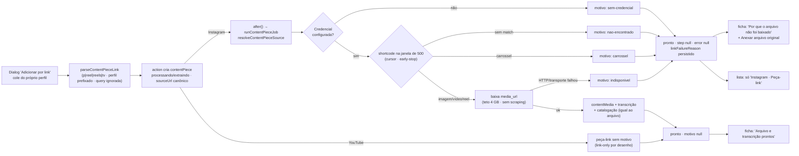

# Impl: C220 — Central de Conteúdos — link do Instagram do deputado baixa e cataloga a peça

Status: aprovado
Atualizado em: 2026-09-24
Issue: #1302
Intenção: docs/plans/central-conteudos-link-instagram.md
Appetite restante: herdado (~1,5–2 dias eng) — sem corte novo: o plano reusa o pipeline C211 e o cliente Graph API existentes; varredura, backfill, scraping e álbum de carrossel seguem fora (intenção).

> Modo `--auto` (work-issue): plano nasce aprovado pelo agente. Design UI do gate: `docs/plans/central-conteudos-link-instagram-ui-design.html`. Trigger de designer declarado em **D7: non-trigger** — se a execução encontrar um estado não desenhado, o designer estende o artefato ANTES do markup (não improvisar estrutura visual).

## Leitura da intenção

- **Outcome:** colar um link do próprio perfil do deputado (`@depjorgesolla`) nas formas que o browser copia resulta em peça com mídia baixada, transcrita e catalogada — igual ao envio por arquivo; quando a extração não acontecer, a ficha mostra **um dos quatro motivos literais** e a peça continua peça-link (`pronto`, nunca "Falhou", nunca em silêncio).
- **O que NÃO negociar:**
  - Extração **só** por caminho oficial (Graph API da própria conta, `src/utilities/socialFeed/instagramFeed.ts`); nunca scraping/contorno; **mídia de terceiro nunca é baixada**; YouTube **link-only sem motivo** (a Data API não entrega arquivo).
  - Motivos **verbatim** e peça-link como resultado legítimo; `sourceUrl` canônico é a identidade (sem peça gêmea).
  - Board/feed da home **intocado**: sem cache 5 min, snapshot, kill switch, lock transacional do hook e sem `@payload-config` em `instagramFeed.ts` (`instagramFeedView.ts:44-48,96`).
  - `curatedFields` da assessoria nunca sobrescritos e **não ganha o campo de motivo**; `error` cru nunca chega à pessoa; token nunca em log.
  - Despublicar/peça-link nunca apaga arquivo nem peça; "Anexar arquivo original" segue como caminho.
  - LGPD: **sem Consent novo** (não há PII de eleitor; a peça é material de campanha).
- **O que reavaliar (hipóteses da intenção, confirmadas ou resolvidas no código):**
  - "o parse rejeita caminho prefixado" — confirmado: `parseContentPieceLink` desestrutura `[kind, shortcode]` por posição (`src/lib/contentPiece.ts:373-386`); muda.
  - "a extração degrada em silêncio" — confirmado: 5 ramos devolvem `{media:null,caption}` sem motivo (`contentPieceLink.ts:114-155`) e o job grava `pronto/step:null/error:null` (`contentPieceJob.ts:262-299`).
  - "não há paginação" — confirmado: `parseInstagramMediaResponse` descarta `paging` (`instagramFeed.ts:148-185`) e o `limit` é capado em 50 (`:228`); o `maxResults` do C212 continua em aberto contra a API real.
  - "persistir motivo exige campo novo" — confirmado: `error` é interno e só renderiza em `falhou` (`[id]/page.tsx:175-182`; `lib/contentPiece.ts:517` mapeia `error→failureMessage` sempre) ⇒ campo novo + migration.
  - **Assumidas da intenção (recomendações A):** janela de busca paginada com limite declarado (D2); motivo **só na ficha** (D7); links prefixados pelo perfil aceitos (D3/parse).
  - Hipótese "motivo só na ficha" × design cena 3 ("Instagram · Peça-link" na lista): resolvida em D7 — motivo nunca na lista; a lista mobile ganha só o rótulo neutro desenhado.

## Abordagem recomendada

**Opções consideradas (geral):** A) paginação por cursor no dono do cliente Graph API + motivo persistido em select novo + resolução do link que devolve motivo (sem lançar) + ficha desenhada; B) scraping/oEmbed/segundo fetch ou download de terceiro; C) manter tudo como está (só forma canônica; falha = `falhou`).
**Recomendação:** **A** — mantém um dono por mecanismo (feed Graph API, pipeline da peça, ficha), usa o seam de dependências injetáveis que o C211 já criou para o resolver (`contentPieceLink.ts:87-105`), nasce fail-closed e cabe no appetite.
**Rejeitadas:** **B** por invariante (nunca scraping/terceiro); **C** porque não cumpre o aceite (link do perfil continua degradando) nem "motivo honesto" — e não exige schema novo justamente onde o silêncio nasce.

### D1 — Persistência do motivo: campo enum novo + migration

**Opções:** A) select novo `linkFailureReason` com 4 valores pt-BR sem acento (`nao-encontrado | carrossel | indisponivel | sem-credencial`), labels = literais verbatim, nullable/readOnly/sem default; B) `text` livre guardando o literal; C) reusar `error`.
**Recomendação:** **A** — vocabulário fechado e fail-closed, DB restringe, a UI só mapeia label; espelha `processingStatus`/`step` (valores pt-BR + labels acentuados, precedente do C211) e preserva `error` como causa crua interna (`ContentPiece.ts:397-405`).
**Rejeitadas:** **B** — texto livre deriva (jargão, literal torto) e a UI teria de adivinhar o motivo de volta; **C** — quebra a separação raw×produto: `error` é stderr/transporte e só renderiza em `falhou`; usá-lo num estado `pronto` confundiria os dois ciclos (e violaria "nunca com o detalhe cru").
**Migration:** `pnpm migrate:create add_content_piece_link_failure_reason` → `20260924_<HHMMSS>_add_content_piece_link_failure_reason` (enum + coluna nullable; **sem backfill** — peça-link antiga cai no card genérico; reprocessar acervo é não escopo). `pnpm migrate` local + `pnpm generate:types` (payload-types é versionado). Migration existente nunca editada.

### D2 — Janela de busca: paginação por cursor no dono, sem acoplar ao board

**Opções:** A) dar paginação por cursor ao `loadInstagramFeed` (o dono do cliente Graph API): `maxResults` vira a **janela total** e cada página pede `limit = min(maxResults, 50)` ≤ 50, avançando por `paging.cursors.after` enquanto faltar e houver cursor; `maxResults ≤ 50` ⇒ exatamente 1 página (board/sync intactos); B) função nova no mesmo módulo (twin interno de refresh/parse); C) o resolver chamar a Graph API por conta própria.
**Recomendação:** **A**, com janela declarada de **500 mídias** (`CONTENT_PIECE_LINK_INSTAGRAM_WINDOW = 500`, em `contentPieceLink.ts`): ~10 páginas de 50, early-stop no match; a chamada típica é **1** (a assessoria cola o post recém-publicado); 500 ≈ 1–2 anos de ritmo, bem dentro do teto de 10K da edge (C212 §Q1) e com custo máximo ≤10 chamadas por colagem. Detalhes: `parseInstagramMediaPage` (novo; mesma validação de protocolo; devolve `{ posts, nextCursor }` lendo `paging.cursors.after`; cursor ausente/malformado ⇒ para) e `parseInstagramMediaResponse` fica como wrapper (testes e `nextImageRemotePatterns`). `paging.next` é **ignorado** de propósito (leva `access_token` na URL — token nunca em log). Refresh segue o contrato atual: falha em qualquer página ⇒ um refresh e refaz a janela do zero.
**Rejeitadas:** **B** — duas implementações do mesmo cursor/refresh/erro no mesmo dono; **C** — duplicaria auth/refresh/erro tipado e jogaria fora o seam injetável do C211.
**Risco declarado:** se o host do Instagram Login só oferecer paginação time-based (C212 "a confirmar"), a janela efetiva cai para a 1ª página (50) e o motivo continua honesto — sem quebra; verificação viva no staging/produção (Riscos).

### D3 — Matching shortcode ↔ mídia (permalink)

**Opções:** A) identidade pelo **shortcode** (`parseContentPieceLink(post.permalink)?.shortcode === link.shortcode`); B) igualdade de `canonicalUrl` (comportamento atual, `contentPieceLink.ts:144-146`); C) comparar id numérico da mídia.
**Recomendação:** **A** — o shortcode é a identidade declarada (`lib/contentPiece.ts:354-359`) e o kind (`p` × `reel`) é apresentação: com **B**, um link `/p/ABC/` colado para um reel nunca casa; **A** casa as duas grafias e, por casar **dentro do feed da conta própria**, é também o que garante "mídia de terceiro nunca baixada" (link de terceiro ⇒ sem match ⇒ motivo `nao-encontrado`).
**Rejeitadas:** **B** — falso-negativo por kind; **C** — o id numérico não está no link colado.
**Parse (muda junto):** aceitar `[kind, shortcode]` **ou** `[perfil, kind, shortcode]` (só essas duas formas), com `p|reel|reels|tv`, `www.`/`m.`, query/hash ignorados; rejeitar `/stories/` (inclusive quando `stories` for o "perfil" de um caminho forjado — primeiro segmento reservado/kind nunca é perfil), `instagr.am` e hosts fora de IG/YouTube; canônico continua `https://www.instagram.com/<kind canônico>/<shortcode>/`.

### D4 — Falha da extração: motivo, não `falhou` (e `!mediaUrl`)

**Opções:** A) falhas **do lado Instagram** (sem credencial; `loadFeed` lança; sem match na janela; carrossel; `!mediaUrl`; erro HTTP/transporte do download) devolvem `media:null` + motivo e a peça termina `pronto` (peça-link); falhas **locais** (criar `contentMedia`, exceder o teto de 4 GB, ffmpeg/transcrição) continuam lançando ⇒ `falhou` + "Reprocessar"; B) tudo vira motivo; C) manter o throw atual do download.
**Recomendação:** **A** — cumpre "peça-link é resultado legítimo, não 'Falhou'" e deixa `falhou` só para o que o reprocessar/arquivo resolve. Para post **encontrado** mas sem `mediaUrl` (ex.: áudio protegido omite o campo), o motivo é `indisponivel` (não é carrossel; a API achou mas não entregou o arquivo) — micro-decisão registrada, reversível. Nenhum desses ramos lança: o `catch` do job (`contentPieceJob.ts:300-306`) segue reservado a falhas reais.
**Nota de implementação:** o teto de bytes precisa ser distinguível de falha de transporte no mesmo `pipeline` — usar um erro sentinela do dono (`ContentPieceMediaTooLargeError`, `contentPieceLink.ts`) que o resolver relança; qualquer outra falha do stream vira `indisponivel`. Assim o cap continua `falhou` (retry não resolve, anexar resolve) e a rede do Instagram vira motivo honesto.
**Rejeitadas:** **B** — mascararia falha nossa/storage como problema do Instagram e mataria o "Reprocessar"; **C** — deixa a extração falha sem motivo (o defeito que o item conserta) e converte indisponibilidade transitória em "Falhou".

### D5 — Token refresh

**Opções:** A) persistir o `refreshedAccessToken` que o `loadInstagramFeed` já devolve, via `persistInstagramAccessToken` (owner, raw SQL sem hooks), best-effort; B) ignorar (status quo: `contentPieceLink.ts:130-135` descarta); C) writer novo.
**Recomendação:** **A** — é o mesmo helper do board, **não** é o caminho do sync (sem snapshot, kill switch, cache ou lock); evita refresh repetido a cada colagem; falha ao persistir não derruba a extração (`.catch`); token nunca vai a log (nenhuma URL com `access_token` é logada/armazenada). O UPDATE pode esperar o row lock do global se o hook do board estiver sincronizando naquele instante — é espera, não deadlock; best-effort resolve.
**Rejeitadas:** **B** — gasta refresh à toa e pode expirar sem o board rodar; **C** — twin.

### D6 — Ciclo de vida do motivo (onde seta e limpa)

**Opções:** A) o resolver devolve `linkFailureReason` e **o job é o único que persiste**, no write final `pronto` (com `step:null/error:null`): motivo quando `!media` e origem Instagram; `null` quando há mídia, quando origem ≠ Instagram (YouTube/arquivo) ou quando não se aplica; `attachContentPieceMedia` limpa no mesmo update que grava `media` (`contentPieceUpload.ts:273-286`); o retry (`contentPieces.ts:185-195`) limpa ao reiniciar; o motivo **não** entra em `CONTENT_PIECE_CURATED_FIELDS`; B) o resolver escreve direto na linha; C) limpar só no anexo.
**Recomendação:** **A** — um escritor (o job), coerente com "o pipeline é dono do estado"; **B** mistura I/O de resolução com estado da linha; **C** deixa motivo obsoleto quando o retry reencontra a mídia.
**YouTube:** nunca tem motivo — o branch origem ≠ Instagram devolve `null` (link-only por desenho, coberto por teste).

### D7 — Superfície de UI (ficha × lista) e trigger de designer

**Opções:** A) motivo **só na ficha**; a lista não tem motivo, mas a card mobile ganha o rótulo neutro desenhado ("Instagram · Peça-link") derivado de `origin`+`hasFile` (sem campo novo); B) selo de motivo na lista; C) lista intocada.
**Recomendação:** **A** — a cena 3 do design do gate desenha exatamente isso ("Instagram · Peça-link" + recomendação "a lista continua limpa; o motivo completo vive na ficha") e a pergunta em aberto da intenção era sobre o **motivo** na lista (recomendação A). O card de motivo desktop ("Motivo da peça-link") e o mobile ("Por que o arquivo não foi baixado") viram **um só** card, com o literal mobile como título — evita duas estruturas divergentes.
**Trigger de designer: `non-trigger` (declarado).** Tudo que o código real exige já está desenhado: cena 1 (processando com 3 passos + "Buscando a mídia no perfil oficial…" + estado "Arquivo e transcrição prontos"), cena 2 (motivo + "Anexar arquivo original") e cena 3 (mobile, motivo e lista compacta). Duas **adaptações de copy** (honestidade, sem estrutura nova, registradas): (i) o card verde usa "Arquivo e transcrição prontos" só quando há transcrição, senão "Arquivo pronto" (o desenho é de um reel); (ii) o corpo não afirma "a mídia oficial foi baixada" quando o arquivo pode ter vindo do anexo. Se a execução encontrar um estado **não desenhado**, para e o designer estende o artefato antes do markup.
**Rejeitadas:** **B** — viola "lista limpa" e polui a triagem; **C** — não implementa um elemento desenhado sem necessidade.

### Componentes / mudanças

- **`src/lib/contentPiece.ts`** (puro; dono do vocabulário): `CONTENT_PIECE_LINK_FAILURE_REASONS` + type + `contentPieceLinkFailureReasonLabels` (literais verbatim) + `isContentPieceLinkFailureReason`; `CONTENT_PIECE_LINK_LABEL = 'Peça-link'`; `parseContentPieceLink` com perfil prefixado e rejeição explícita de `stories`; `ContentPieceViewModel` ganha `linkFailureReason` + `linkFailureReasonLabel` (normalização fail-closed em `toContentPieceViewModel`, sem tocar em `failureMessage`).
- **`src/utilities/socialFeed/instagramFeed.ts`** (dono do cliente Graph API): `parseInstagramMediaPage` (posts + cursor) e loop de cursor em `loadInstagramFeed` (`maxResults` = janela, página ≤ 50, default 1 página); `INSTAGRAM_MAX_RESULTS_CAP` vira teto **por página** (comentário); refresh/erro tipado/`signal` inalterados; snapshot/status/config **não** se tocam.
- **`src/utilities/content/contentPieceLink.ts`** (dono da resolução): `CONTENT_PIECE_LINK_INSTAGRAM_WINDOW = 500`; retorno com `linkFailureReason`; mapeamento dos ramos (D4); download falho ⇒ `indisponivel` (sem lançar; sentinela do cap relança); persist best-effort do refresh (D5); limite de tempo do feed (30 s) para a API pendurada não segurar `processando` até o reaper; `INSTAGRAM_MAX_RESULTS_CAP` sai do import.
- **`src/utilities/content/contentPieceJob.ts`**: write transacional final persiste `linkFailureReason` (D6); nada mais muda (transação/`req` e bypass admin já justificados em `:59-85,262-299`).
- **`src/utilities/content/contentPieceUpload.ts`**: `attachContentPieceMedia` limpa `linkFailureReason` junto de `error: null`.
- **`src/app/(campaign)/campanha/actions/contentPieces.ts`**: `linkFailureReason` no `contentPieceSelect` (`:42-59`); retry limpa (`:185-195`); `overrideAccess:false` + `user` preservados.
- **`src/utilities/content/contentPiecePageData.ts`**: `linkFailureReason` **só** no `contentPieceDetailSelect` (`:47-56`) — a lista segue sem o campo (design "lista limpa").
- **`src/collections/ContentPiece.ts`**: campo `linkFailureReason` (select, readOnly, descrição admin "Por que uma peça do Instagram ficou só como link; preenchido pelo processamento").
- **Migration:** `20260924_<HHMMSS>_add_content_piece_link_failure_reason` (D1) + `payload-types.ts` regenerado.
- **UI — `[id]/page.tsx` (ficha, Impeccable B, sem tela nova):** para `origin === 'instagram' && processando`: placeholder "Buscando a mídia no perfil oficial…" (enquanto `!hasFile`), caixa de progresso "Procurando a publicação no perfil oficial…" e card "Processamento da peça" com os 3 passos desenhados (Link recebido / Mídia oficial / Catalogação; estados Concluído/Em andamento/Aguardando derivados do `step` existente — `extraindo` = mídia oficial; `transcrevendo|catalogando|salvando` = catalogação); para `origin !== 'arquivo' && pronto && hasFile`: card verde "Arquivo e transcrição prontos"/"Arquivo pronto" com copy honesta; para `!hasFile && linkFailureReasonLabel`: card do motivo (título "Por que o arquivo não foi baixado", literal verbatim, "A peça continua disponível pelo link.", reusando `ContentPieceAttachFileButton`) **no lugar** do card genérico atual (`:165-173`), que permanece para peça-link sem motivo (YouTube/legado). `falhou` e demais estados ficam como estão. `ContentPieceStatusRefresher` intocado (a transição `pronto` já dispara o refresh).
- **UI — `ContentPieceCardList.tsx`:** linha meta dos cards mobile ganha o rótulo neutro desenhado: `origin !== 'arquivo'` ⇒ prefixa a origem; `pronto && !hasFile` ⇒ "Peça-link" (sem motivo). `ContentPieceTable` fica como está (já mostra a origem).
- **Access / Consent:** nada novo — leitura sob o gate existente (`canReadCommunicationCatalog` + access da collection); **sem Consent** (não há PII de eleitor). Nenhum helper de access muda.
- **Changelog:** `docs/changelog/2026-09-24-c220.md` (entrada curta; nunca editar o agregado/HISTORY).

### Dados → forma (se aplicável)

N/A — não há agregado, KPI ou série; o que muda é o **estado** da peça e um rótulo. Restrição da intenção mantida: motivo em linguagem de produto (um dos quatro literais), sem código de erro, stack ou jargão de API.

## Fases verificáveis

1. **Tracer / schema+server — quota ~50%:** migration + campo + vocabulário em `lib/contentPiece.ts`; `parseContentPieceLink` prefixado (unit verde); paginação de cursor em `instagramFeed.ts` (unit verde); resolver com motivo + persist do refresh; job/attach/retry. **Tracer bullet cedo:** int do resolver com `loadFeed` fake casando `/depjorgesolla/reel/ABC/` → `contentMedia` criada, motivo `null`; e sem match → `nao-encontrado`, linha `pronto`. Só então a UI.
2. **UI — quota ~30%:** ficha (processando com passos, sucesso, motivo) + rótulo neutro na card list; e2e do motivo (fixture, sem job).
3. **Gates — quota ~20%:** `pnpm gate:fast` (lint + typecheck + unit); `pnpm test:int` (suíte cheia); e2e curado (`campaignSpeechAcervo`, com a seção C211 do spec); `pnpm push` via GitHub.

### Testes previstos

- **`tests/unit/contentPiece.unit.spec.ts`:** parse aceita `/depjorgesolla/reel/ABC/` e `/depjorgesolla/p/ABC/?igsh=…` com o mesmo canônico de `/reel/ABC/`; rejeita `/stories/…`, `/stories/reel/ABC/`, `instagr.am`, perfil sem kind, host fora; labels dos 4 motivos **verbatim**; `toContentPieceViewModel` mapeia motivo conhecido → literal e desconhecido → `null`, sem alterar `failureMessage`.
- **`tests/unit/instagramFeed.unit.spec.ts`:** `parseInstagramMediaPage` (cursor presente/ausente/malformado); paginação real (2–3 páginas, `after=` na página 2, para em `maxResults`, erro na página 2 ⇒ 1 refresh e refaz a janela); `maxResults ≤ 50` ⇒ **1** chamada de mídia (board intacto); atualizar o teste do cap (`:252-258`) para pinar janela × página.
- **`tests/int/contentPiece.int.spec.ts` — resolver (deps injetadas, sem rede):** global configurado + `loadFeed` fake + `fetchImpl` fake: match por shortcode baixa e cria `contentMedia` (motivo `null`); sem match ⇒ `nao-encontrado`; carrossel ⇒ `carrossel`; sem credencial ⇒ `sem-credencial`; `loadFeed` lançando ⇒ `indisponivel`; download HTTP 500 ⇒ `indisponivel`; download acima do teto ⇒ lança (não vira motivo).
- **`tests/int/contentPiece.int.spec.ts` — job/collection:** `resolveSource` injetado com motivo ⇒ linha `pronto` + `linkFailureReason`; com mídia ⇒ motivo `null`; origem YouTube ⇒ motivo `null`; `attachContentPieceMedia` limpa o motivo; retry limpa ao reiniciar.
- **e2e (benefício real, determinístico):** na seção C211 de `tests/e2e/campaignSpeechAcervo.e2e.spec.ts`, fixture peça-link com motivo (`carrossel`) ⇒ a ficha contém o literal e "Anexar arquivo original"; a lista **não** contém o literal (pina "lista limpa"). Sem depender do job assíncrono.
- **Pins:** `tests/unit/instagramFeed.unit.spec.ts` (contrato janela/página); `scripts/lib/e2e-affected-manifest.mjs` **sem mudança** (o diff toca `src/utilities/content`, `src/components/campaign/content` e `src/lib/contentPiece` — mapeados para `campaignSpeechAcervo`; `src/utilities/socialFeed` não é prefixo de risco e cai no smoke `campaignHomeActions`).

## Rabbit holes / Não escopo (engenharia)

- **Varredura agendada/webhook/cursor próprio/backfill em massa** — item próprio (C212 §Q4); aqui só o link colado é procurado.
- **Scraping, oEmbed, segundo fetch e download de mídia de terceiro** — permanente; o resultado é motivo honesto + anexar arquivo.
- **Carrossel vira álbum** (baixar filhos, montar capa) — não; motivo `carrossel`.
- **Retry de peça-link com motivo** ("Instagram indisponível" transitório): não há affordance hoje (`canRetry` só `falhou`) e o design não desenha; **gatilho:** se a assessoria pedir "tentar de novo" numa peça-link, item curto + designer.
- **`paging.next` absoluto** (token na URL) — ignorado; só cursor. **Paginação time-based (`since/until`)** — não implementada; se for a única do host, a janela degrada para 50 com motivo honesto (item próprio se acontecer).
- **Novo painel/tela de credencial** — `SocialFeedSettings` é o dono; falta de credencial é motivo na ficha.
- **Motivo na lista/segundo selo/segunda tela; backfill de motivo em peças antigas; preview/poster da mídia extraída** — fora.
- **Tocar snapshot/cache/kill switch/lock do board** — proibido; o único ponto compartilhado é o cliente `instagramFeed.ts`, com default de 1 página.

## Débitos do `/simplify` (deferidos com gatilho)

Triagem da sessão (nada registrado como Issue: nenhum `expensive_lock` ≥4):

- **D-1 — dono puro dos passos e do predicado "peça-link".** `processingSteps`/rótulos de design inline na ficha (`[id]/page.tsx:65-95`), predicado "peça-link" re-derivado em 4+ pontos, e `mediaStepDone = step !== 'extraindo'` dizendo "Mídia oficial: Concluído" sem mídia. **Gatilho:** próximo toque da ficha/UI de processamento (corrigir o `mediaStepDone` exigindo `hasFile` junto).
- **D-2 — VM de linha × select da lista.** `linkFailureReason`/label sempre `null` nas linhas porque o select da lista não carrega o campo (omissão intencional por D7). **Gatilho:** a lista precisar do motivo (hoje proibido) ou o VM de linha separar-se do da ficha.
- **D-3 — helper/restauro nos testes int.** Repetição de `withTempDir(resolveContentPieceSource(...))` e `setInstagramSettings(false)` sem restauro em `contentPiece.int.spec.ts`. **Gatilho:** próximo toque do spec (pode pegar carona no F3 do `escala-dry-pos-c211` #1267).
- **Descartados:** wrapper `parseInstagramMediaResponse` (decisão D2: conveniência de leitura de 1 página) e a consolidação dos describes duplicados do parser (cosmético, sem risco).

## Riscos e mitigação

- **Forma da paginação no host do Instagram Login "a confirmar" (C212):** cursor ausente ⇒ 1 página e motivo honesto, sem quebra; verificação viva no staging/produção (a credencial real vive no `SocialFeedSettings` de produção; o staging pode não tê-la — registrar no runbook do token).
- **`instagramFeed.ts` é dono compartilhado com o board:** `maxResults ≤ 50` ⇒ exatamente 1 página; testes do board (user/media/refresh/abort) passam sem mudança; o diff acorda o smoke da home no CI.
- **Motivo obsoleto (extração posterior):** um escritor (job) + limpeza no anexo e no retry; testes int dedicados.
- **Clobber de curadoria:** o motivo é campo de sistema, fora de `CONTENT_PIECE_CURATED_FIELDS`; o write final do job (releitura fresca + transação) segue igual.
- **Token em log/URL:** `paging.next` ignorado; nenhuma URL com `access_token` é logada/armazenada; erros tipados não carregam URL.
- **Janela/limite mentindo:** o literal fala "mídias recentes"; a janela é declarada no código (500) e neste plano — sem promessa de "todas as mídias".
- **Download parcial/temp órfão:** mídia só nasce após o arquivo completo; `tempDir` removido no `finally` (`contentPieceJob.ts:307-309`).
- **Appetite:** o maior custo é a UI da ficha; a ordem (motivo → extração → polimento de passos) deixa o aceite coberto mesmo se o polimento atrasar.
- **CI:** diff mapeado para e2e de comunicação + smoke da home — nunca zero; rodar `gate:fast` e int local antes do push.

## Aceite de engenharia

- [ ] Aceite de produto da intenção ainda coberto: link do próprio perfil (canônico e prefixado) extrai e cataloga; janela declarada com motivo honesto além dela; os 4 motivos verbatim na ficha; peça-link nunca apagada e "Anexar arquivo original" disponível; curadoria preservada; YouTube link-only sem motivo; só caminho oficial, sem terceiro, sem scraping, token nunca em log; board intocado.
- [ ] Invariantes AGENTS/engineering-standards: Local API com `user` + `overrideAccess: false` (bypass só com comentário já justificado no pipeline); writes novos seguem um único dono (job/attach com transação onde há multi-write; token via raw SQL do owner); Consent sem chave nova; identificadores em inglês/copy pt-BR; `lib/` não importa `utilities/`; migration nova (nada retroativo) + `pnpm migrate` + `generate:types`; `curatedFields` intocado; `sourceUrl` canônico como identidade.
- [ ] Testes de domínio previstos (unit/int) onde access/write paths mudam; e2e do motivo (ficha mostra, lista não); pins de teste atualizados.
- [ ] `pnpm gate:fast` verde; `pnpm test:int` verde; e2e curado verde; `pnpm push` via GitHub.

## Self-score

**Self-score decision-quality: 4/5.** (1) Decisões caras têm `Opções/Recomendação/Rejeitadas` explícitas (campo/migration, janela/paginação, matching, semântica de falha, refresh, ciclo de vida, UI); (2) cabe no appetite herdado — reusa pipeline C211, seam injetável do resolver, helpers do owner do feed e shells da ficha; (3) rabbit holes nomeados (varredura, scraping, álbum, retry de peça-link, `paging.next`, time-based, painel novo, backfill); (4) depth check: paginação fica no dono do cliente Graph API, motivo no dono do vocabulário, persistência num único escritor, attach/retry reusam os escritores existentes — sem pass-through nem twin; (5) aceite de produto intacto. Não 5/5 por duas incertezas honestly assumidas: a forma real da paginação na API (C212 "a confirmar", mitigada por degradação honesta) e o mapeamento de `!mediaUrl` para `indisponivel` (micro-decisão reversível).
