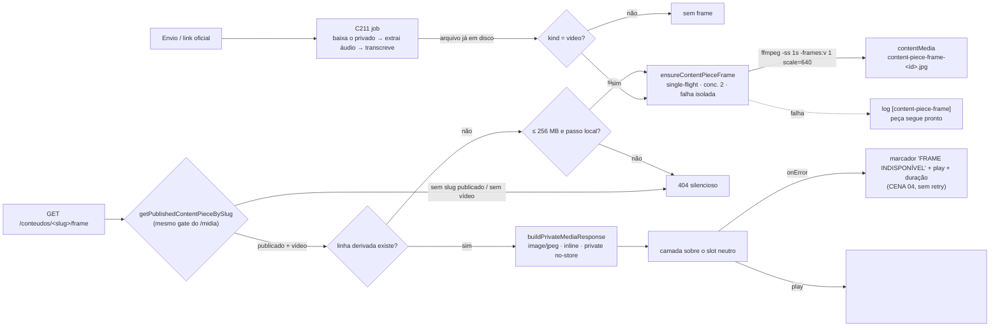

# Impl: C226 — Central de Conteúdos: frame estático para vídeos com arquivo

Status: aprovado
Atualizado em: 2026-09-25
Issue: #1352
Intenção: docs/plans/central-conteudos-preview-frame-video.md
Appetite restante: herdado (~1–2 dias eng) — sem corte novo: o plano reusa o gate público do S27, o proxy de mídia privada do C193/C199, o `runFfmpeg` dono (C199), a linha privada `contentMedia` e o slot de mídia compartilhado; **sem migration, sem fila, sem backfill e sem collection nova**. Editor de frame, backfill, player novo e o acervo de falas (C182) seguem fora (intenção).

> Modo `--auto` (work-issue): plano nasce aprovado pelo agente. Design UI do gate: `docs/plans/central-conteudos-preview-frame-video-ui-design.html` — **não redesenhar**. Trigger de designer declarado em **D5: non-trigger** — o markup aprovado (CENA 01/02 com frame, CENA 04 fallback neutro) recebe só o `` e o marcador; qualquer estado novo que a execução precise para além disso é **gatilho de designer antes do markup**, não improviso.

## Leitura da intenção

- **Outcome:** toda peça de vídeo publicada e com arquivo no acervo mostra, no catálogo público, pelo menos **um frame estático** antes do play — imagem leve, carregada como imagem, **sem nenhum request do arquivo de vídeo** antes do gesto; sem frame possível, o slot neutro desenhado com play honesto.
- **O que NÃO negociar:**
  - **Play sob demanda:** nada de elemento de mídia antes do gesto, `preload="none"` preservado, o arquivo de vídeo só entra no play (S27).
  - **Kill switch:** peça despublicada **não** expõe sua mídia privada pelo novo preview. Derivado em coleção pública é proibido; a porta pública do frame usa o mesmo gate de slug publicado do `/midia`.
  - **Arquivo privado continua privado:** `ContentMedia` segue `canReadContentPiece`; o frame nunca entra em `media` (anonymous-read por contrato, `Media.ts:16-20`).
  - **Falha isolada:** frame que falha **não** marca a peça `falhou`, não escreve `error`, não invalida `step`; e o card não tenta repetir a busca sem limite.
  - **Sem frame de terceiro:** peça-link (Instagram/YouTube sem arquivo) continua sem frame local; thumbnail de plataforma não conta.
  - **Superfícies:** alvo obrigatório é `/conteudos`; a lista interna `/campanha/comunicacao/conteudos` **não** ganha player nem segunda visualização de frame (o player dela é separado, `preload="metadata"`, e fica intocado).
  - **C182 proibido:** não reusar nem alterar o preview do acervo de falas (`speechPoster*.ts`, rota `/acervo/[id]/poster`).
  - **Escopo de produto:** sem backfill/reprocessamento em massa, sem editor de timestamp, sem analytics nova, sem Consent, sem alteração do kill switch.
- **O que reavaliar (hipóteses da intenção, confirmadas ou resolvidas no código):**
  - "o card só monta `<video>` quando `playing`, sem `poster`/imagem/`onError`" — confirmado (`ContentPieceMedia.tsx:147-198`); o estado pré-play hoje é gradiente + chip de tipo + play + duração (`:183-197`).
  - "a projeção pública não tem campo de frame" — confirmado: `ContentPiecePublicItem` (`:355-387`) carrega `file { id, path, mimeType, downloadFilename }` (`:389-394`), e `mediaOf` (`:655-663`) descarta `url`/`thumbnailURL`/dimensões. **Consequência de projeto:** o slot de foto já consome `item.file?.path` sem dimensões — o frame segue o mesmo contrato de _path_.
  - "`isLink` = `media === null && sourceUrl !== null`" — confirmado (`:704`); peça-link nunca tem arquivo, logo nunca tem frame.
  - "`file.path` é sempre `/conteudos/<slug>/midia`" — confirmado (`:731-737`, `contentPieceMediaPath` em `lib/contentPieceCatalog.ts:43-44`): a URL pública do frame é uma irmã desse path, no mesmo vocabulário.
  - "o job baixa o privado, extrai áudio, transcreve e cataloga, sem passo de still" — confirmado (`contentPieceJob.ts:116-193,200-310`): o arquivo **já está em disco** no temp do job quando o áudio é extraído, ou seja, um still é praticamente de graça nesse ponto.
  - "o C182 gera sob demanda com cache, single-flight, limite de concorrência e cache negativo" — confirmado (`speechPosterJob.ts:25-31,45-59,94-189`): é o molde, não a dependência.
  - "o proxy público atual valida publicado" — confirmado (`conteudos/[slug]/midia/route.ts:15-24,37-63`): a **única** forma de não furar o kill switch é uma rota que reuse `getPublishedContentPieceBySlug` + `buildPrivateMediaResponse`.
  - "a listagem pública é `unstable_cache` sob a tag `contentPieces` e só o `ContentPiece` a busta" — confirmado (`contentPieceReads.ts:20-65`, `ContentPiece.ts:92-106`): por isso o `frame` da projeção **não** pode depender da existência da linha derivada (D3) — assim a cura nem precisa invalidar tag.
  - **Assumidas da intenção (recomendações A, validadas no gate):** (1) **frame = primeiro frame decodificável** → **divergência registrada em D4** (offset determinístico curto, mesmo custo; o primeiro frame de material editorial é quase sempre leader/fade preto e seria indistinguível do fallback desenhado); (2) **falha ⇒ fallback neutro com play** (CENA 04) — mantido; (3) **só o catálogo é obrigatório nesta fatia** → D5: o frame viaja no slot compartilhado, então também aparece na peça pública e no card da home (mesmo markup, nenhuma estrutura nova), sem criar um segundo outcome.

## Abordagem recomendada

**Opções consideradas (geral):** A) frame como derivado privado em `contentMedia` com nome determinístico, servido por uma rota pública nova que reusa o gate e o proxy de mídia privada, gerado por **um dono** (`ensureContentPieceFrame`) chamado pelo job e pela rota; B) frame em `media` (coleção pública) servido pelo proxy `/api/media/file`, gerado só no job; C) campo novo `ContentPiece.frameMedia` + migration, gerado só no job.
**Recomendação:** **A** — mantém o derivado tão privado quanto o vídeo (o kill switch sobrevive por construção, sem depender de disciplina), não cobra migration nem campo novo, não cria fila nem collection, e satisfaz o aceite "toda peça" sem backfill porque **a cura é disparada pela própria visita** (uma linha por peça, uma vez).
**Rejeitadas:** **B** porque `media.read: () => true` (`Media.ts:16-20`) tornaria o frame público **mesmo com a peça despublicada** — viola o inegociável do kill switch, e o nome determinístico é enumerável (`/api/media/file/content-piece-frame-12.jpg`); **C** porque a relação seria um ponteiro denormalizado do que o nome determinístico já diz, custando migration, `select` da leitura pública, escrita transacional e um ponto de invalidação a mais, sem mudar um único comportamento observável.

### D1 — Onde o frame vive e por onde ele sai (kill switch por construção)

**Opções:** A) linha derivada em `contentMedia` sob nome determinístico (`content-piece-frame-<id>.jpg`), servida por `GET /conteudos/[slug]/frame` que reusa `getPublishedContentPieceBySlug` + `buildPrivateMediaResponse` + `resolvePrivateMediaStaticDir`; B) `media` + URL do proxy; C) `ContentPiece.frameMedia` (relation) + rota.
**Recomendação:** **A** — o nome determinístico é ao mesmo tempo chave de cache e chave de idempotência (precedente C182), o probe é um `find` indexado de `limit: 1`, e **a rota é a única porta**: rascunho, slug desconhecido, peça-link e peça sem arquivo respondem o mesmo 404 silencioso do `/midia` (`midia/route.ts:26-28`), sem revelar o que existe. O S3/Garage já cobre `contentMedia` (`payload.config.ts:182-208`) e sem `S3_*` cai no disco local — **nenhuma mudança de storage**. A linha entra em `contentMedia` (não em `media`), que segue `canReadContentPiece`; `contentMedia.alt` é obrigatório, então o frame grava `alt = Frame do vídeo «<título>»`.
**Rejeitadas:** **B** — anula o kill switch (ver acima); **C** — migration + ponteiro denormalizado sem comportamento novo. Também rejeitada, dentro de A: **reaproveitar `/midia` com `?frame=1`** — uma rota que responde dois ativos com gatilhos de geração diferentes, e pior: o regex de pin do e2e (`mediaRequests`, `/\/conteudos\/.+\/midia/`) passaria a contar o frame e a enshrinar "nada é buscado antes do play" como mentira. Caminho irmão (`/frame`) não casa com o regex e mantém o pin verde.
**Migration: nenhuma.** `ContentPiece`, `ContentMedia` e `content_piece` ficam intocados; `pnpm generate:types` não é necessário. Se a equipe quiser a ligação explícita peça↔frame no admin, é uma coluna + hook (item próprio, gatilho: alguém precisar consultar "quais peças têm frame" por SQL).

### D2 — Onde gerar, e o que significa invalidar

**Opções:** A) só como passo do job; B) só sob demanda na rota; C) **um dono só** (`ensureContentPieceFrame`) invocado pelo job **e** pela rota em miss, com single-flight, gate de concorrência, memo de falha e **zero escrita em `contentPiece`**; D) backfill em massa / reconciliador / fila.
**Recomendação:** **C** — o job cobre toda peça nova com o arquivo **já em disco** (custo de um `-ss` rápido, sem download), e a rota cobre o acervo anterior que nenhum job vai reprocessar. "Invalidar" **deixa de existir**: a projeção declara `framePath` pela _elegibilidade_ (vídeo com arquivo), não pela existência da linha (D3), então a cura é invisível para o cache da listagem e não há tag para bustar; a cura só escreve a linha `contentMedia`, nunca a peça. Falha isolada em dois níveis: no job, a chamada fica num `try/catch` próprio com log `[content-piece-frame]` — nunca `falhou`, nunca `error`, nunca muda `currentStep`; na rota, `ensureContentPieceFrame` **não lança** e a resposta é 404, o slot neutro do desenho. Idempotência: advisory lock `content-piece-frame:<id>` + probe antes do create, dentro de `withPayloadTransaction` (mesmo desenho de `speechPosterJob.ts:94-189`).
**Rejeitadas:** **A** — o acervo publicado antes desta entrega nunca receberia frame (não existe "Reprocessar" para peça `pronto`; `canRetry` só cobre `falhou`), então o aceite "toda peça de vídeo publicada" ficaria falso no dia um; **B** — a primeira visita de uma peça nova mostraria o slot neutro e a imagem dependeria de uma requisição que falha por design (ruim para a peça que acabamos de processar, onde o frame já poderia existir); **D** — anti-goal explícito da intenção ("fila, backfill, armazenamento e reconciliação de todos os vídeos"), e cria superfície de reconciliação que ninguém pediu.
**Ordem no job:** depois do bloco de transcrição (é ali que o arquivo está local e o `media` conhecido), antes de `markStep('catalogando')` — o `tempDir` só é removido no `finally` (`:308-310`).
**Observabilidade:** a rota **não** grava `contentEvent` (C213 conta `abertura`/`download`; ver um frame não é abrir nem baixar a peça — somar aí inflaria métrica existente). Só uma linha de log no job e no cache negativo.

### D3 — Como o frame chega ao card

**Opções:** A) campo novo na projeção pública (`framePath: string | null` no `ContentPiecePublicItem`) + `` no slot, com `onError` trocando para o estado desenhado; B) `poster` do `<video>`; C) URL composta dentro do componente; D) o campo só quando a linha derivada existe.
**Recomendação:** **A** — espelha o contrato de `file.path` (o slot de foto já consome path sem dimensões) e mantém a composição de URL pública no dono (`contentPieceFramePath(slug)` em `lib/contentPieceFrame.ts`, irmão de `contentPieceMediaPath`). `` cru com `loading="lazy" decoding="async"` e `alt=""` por cima do slot neutro (que é a camada base — sem _flicker_ quando a imagem entra), `object-cover`, o play e a duração continuam por cima (`z-10`, como no design). `onError` marca o frame como indisponível **para a vida do componente**: o `` sai do DOM, entra o marcador da CENA 04, e **não há novo `src`** (a intenção proíbe repetir a busca sem limite; o servidor já memoiza a falha por 5 min).
**Rejeitadas:** **B** — `poster` só existe em elemento de mídia, e elemento de mídia antes do gesto é exatamente o que o S27 proíbe; além disso a CENA 01/02 desenham o frame como **imagem** ocupando o slot e o player como peça seguinte ("O player substitui apenas o frame dentro do mesmo aspecto 16:9"); **C** — duplica o vocabulário de URL pública no componente, vazaria path para peça-link/sem arquivo (404 garantido por card) e transformaria o fallback desenhado (estado **conhecido** do servidor) em falha de rede; **D** — mataria a própria rota-cura: o `` só existe quando o path existe, então uma peça sem frame nunca geraria o primeiro frame; e amarraria a projeção a uma escrita.

### D4 — Qual frame extrair (divergência registrada)

**Opções:** A) primeiro frame decodificável (`-ss 0`); B) primeiro frame após um **offset determinístico curto** (`-ss 1`), com **uma** retentativa limitada em `-ss 0` se a primeira não produzir arquivo; C) meio da duração (regra do C182); D) seleção manual.
**Recomendação:** **B** — **divergência em relação à opção A assumida na intenção**, e o motivo é visual, não técnico: vídeo de material eleitoral quase sempre abre com leader/fade preto, e um JPEG preto válido é indistinguível do estado "FRAME INDISPONÍVEL" da CENA 04 — ou seja, a regra A destruiria o sinal que o desenho usa para dizer "isto aqui ainda não tem frame". O custo é idêntico (um `-ss` antes de `-i`, um `-frames:v 1`, um `stat()`), a decisão é determinística e não promete momento algum. A retentativa única em `-ss 0` cobre vídeo curtíssimo, cabeçalho mentiroso ou stream sem keyframe em 1 s; se as duas falharem, é o fallback neutro, sem laço. Escala `640:-2`, `-q:v 3`, `-an`, JPEG (o slot chega a ~600 px de largura na peça pública). `stat(outputPath)` depois do ffmpeg: seek além do fim não deixa arquivo — é falha, nunca linha quebrada.
**Rejeitadas:** **A** — ver acima (e continua sendo a **primeira** tentativa da retentativa, então nada se perde); **C** — a duração do C211 é medida pelo **ASR do áudio** (`contentPieceJob.ts:250`), não pelo stream de vídeo: um desvio seeks para o frame errado ou para nada, e ainda copia a regra de outro domínio (o C182 usa offset do _meio_ porque a fala é o conteúdo; aqui o conteúdo é a imagem); **D** — rabbit hole de produto, cortado na intenção.
**Por que JPEG e não WebP:** um passe só de ffmpeg, sem `sharp` no job, e `image/jpeg` já está na lista de inline de `PRIVATE_MEDIA_INLINE_MIME_TYPES` (`lib/privateMedia.ts`); a economia de um WebP (~30%) não paga um segundo encoder nem um passo de pós-processamento.

### D5 — Onde o frame aparece (superfícies que dividem o slot)

**Opções:** A) o slot compartilhado `ContentPieceMedia` — o frame aparece no catálogo, na peça pública (`/conteudos/[slug]`, `variant="detail"`) e no card da home; o player da lista interna fica intocado; B) prop `showFrame` por superfície; C) só o catálogo.
**Recomendação:** **A** — a pergunta em aberto da intenção (3) era sobre o preview na página individual, e a resposta lá é "sem criar um segundo outcome": o componente é um só, o slot é 16:9 nas três superfícies e o markup é o mesmo `` + `object-cover`; nenhum layout novo, nenhuma tela nova, nenhuma decisão visual. A lista interna **não** entra: o player dela é outro (`preload="metadata"`, `conteudos/[id]/page.tsx:142-168`) e continua sem frame, como a intenção exige.
**Rejeitadas:** **B** — flag com um único valor possível = cerimônia (e o compilador já força a propagação do campo, o que torna a prop redundante); **C** — exige o prop de B e deixa a home — onde o reconhecimento mais importa, em 124 px de largura no celular — sem frame.
**Trigger de designer: `non-trigger` (declarado).** Tudo que o código exige já está desenhado: CENA 01/02 (frame ocupando o slot, play no centro, duração embaixo à direita) e CENA 04 (superfície neutra + marcador "FRAME INDISPONÍVEL" + play + duração). Duas **adaptações de copy/estrutura dentro do desenho**, registradas: (i) no estado **sem frame** o marcador da CENA 04 ocupa o lugar do chip `typeLabel` que hoje mora dentro do slot (`ContentPieceMedia.tsx:191-193`) — o tipo continua visível na tag do corpo do card (`CardTag`, `ContentPieceCard.tsx:33-36`); (ii) o estado de **áudio** mantém o chip `typeLabel` (o design não cobre áudio e a intenção mantém áudio intacto). Se a execução precisar de um estado além disso (ex.: um "carregando o frame" visível), **para e o designer estende o artefato antes do markup**.

### D6 — Cache e privacidade do frame

**Opções:** A) `private, no-store` via `PRIVATE_MEDIA_CACHE_CONTROL` (o mesmo header do `/midia`) + `inline`/`nosniff` de `privateMediaHeaders`; B) `private, max-age=300`; C) `public, immutable` com nome versionado.
**Recomendação:** **A** — o derivado é tão privado quanto o vídeo: despublicar precisa ser imediato, e o `no-store` do `/midia` é exatamente esse contrato. O custo é uma imagem pequena re-baixada a cada visita ao catálogo, com `loading="lazy"` fora do caminho crítico.
**Rejeitadas:** **B** — abriria uma janela de 5 minutos em que a peça despublicada continua visível no cache do navegador: quebra o inegociável, e **não** se resolve sozinho (mexer nisso é conversa com o usuário, não gatilho de execução); **C** — o nome é determinístico, então `immutable` mentiria depois de um reprocessamento, e um cache compartilhado sobrevive ao kill switch.

### Micro-decisões (baratas, com gatilho de revisitação)

- **`alt=""` no ``:** o nome acessível do slot já é o botão "Reproduzir <título>"; `alt={<título>}` duplicaria o título vizinho no leitor de tela. **Gatilho:** revisão de a11y que peça imagem descritiva.
- **Cap de download no caminho-cura:** `CONTENT_PIECE_FRAME_MAX_SOURCE_BYTES = 256 MB` — o custo do heal é **baixar o vídeo inteiro** para extrair um still; acima disso, o slot neutro é a resposta honesta. O caminho do job não paga isso (o arquivo já está local) e por isso não aplica o cap: a regra é sobre custo de I/O, não sobre elegibilidade.
- **Budget de espera da rota:** `CONTENT_PIECE_FRAME_WAIT_MS = 5_000` (o C182 usa 20 s, atrás de login e com still de fala pequena; aqui a cura pode custar o download inteiro e o fallback é um estado desenhado). Passou o budget, a resposta é 404 e a geração segue em `after`.
- **Concorrência 2 e memo de falha 5 min:** mesmos números do C182 (`speechPosterJob.ts:28-31`), copiados por simetria de risco.
- **`Content-Disposition` sem override:** o nome interno `content-piece-frame-<id>.jpg` só é visto em download acidental; nobody faz download de frame.
- **Forma do campo:** `framePath: string | null` (string, não objeto de uma chave — `file` é objeto porque carrega quatro campos; um objeto-fantasma aqui é cerimônia).

### Componentes / mudanças

- **`src/lib/contentPieceFrame.ts`** (novo; puro, client-safe, sem I/O — espelha `src/lib/speechPoster.ts`): `contentPieceFrameFilename(pieceId)`, `contentPieceFramePath(slug)` (irmã de `contentPieceMediaPath`), `CONTENT_PIECE_FRAME_MAX_SOURCE_BYTES`, `CONTENT_PIECE_FRAME_WAIT_MS`, `contentPieceFrameAlt(title)`, `buildContentPieceFrameFfmpegArgs({ inputPath, outputPath, atSeconds })` (args como array, `-ss` antes de `-i`, `-frames:v 1`, `-vf scale=640:-2`, `-q:v 3`, `-an`, `-nostdin`; **nunca** string de shell). O predicado de elegibilidade **não mora aqui**: é o `contentPieceMediaKind` que já existe (`lib/contentPieceCatalog.ts:527-544`) — a projeção e o job usam o mesmo dono, sem gêmeo.
- **`src/utilities/content/contentPieceFrameJob.ts`** (novo; `import 'server-only'`, dentro da subpasta de domínio existente — sem novo módulo top-level, logo sem tocar o pin de `codebaseConventions.unit.spec.ts`): `ensureContentPieceFrame({ payload, pieceId, localPath?, alt? })` — probe por nome determinístico, single-flight em memória, gate de concorrência, memo de falha, `downloadPrivateMediaToFile` + `resolvePrivateMediaStaticDir` quando não há `localPath` (respeitando o cap), `runFfmpeg` (dono C199) com `stat(outputPath)`, create em `withPayloadTransaction` + `acquireTextAdvisoryLocks(['content-piece-frame:<id>'])` + probe antes do create. **Nunca lança.**
- **`src/app/(frontend)/conteudos/[slug]/frame/route.ts`** (novo): `dynamic = 'force-dynamic'`, gate `getPublishedContentPieceBySlug` (404 silencioso idêntico ao `/midia`), elegibilidade pelo `framePath` da projeção, probe da linha derivada, `after()` na geração + espera até o budget, resposta por `buildPrivateMediaResponse` (mesmo `staticDir`/headers do `/midia`). Sem `contentEvent`, sem `?download`, sem query string.
- **`src/utilities/content/contentPieceJob.ts`**: uma chamada a `ensureContentPieceFrame` após o bloco de transcrição, em `try/catch` próprio com prefixo `[content-piece-frame]`; só para `source.media` presente; **nada mais muda** (a passos, curadoria, transação e bypass admin seguem como estão).
- **`src/lib/contentPieceCatalog.ts`**: `ContentPiecePublicItem.framePath: string | null` (derivado de `contentPieceMediaKind(...) === 'video'` e `file !== null`) preenchido em `toContentPiecePublicItem`. `ContentPiecePublicSource` e o `select` de `contentPieceReads` **não mudam** (o `mimeType` e o tipo já vêm na leitura) — é isso que mantém a cura invisível para o cache.
- **`src/lib/contentPieceHomeSelection.ts`**: `'framePath'` entra no `Pick` **e** no `toContentPieceHomeItem` (o compilador exige os dois; o mapa campo-a-campo é o que impede o campo de vazar sozinho).
- **`src/components/conteudos/ContentPieceMedia.tsx`**: `'framePath'` no `ContentPieceMediaItem`; estado de frame indisponível **no componente pai** (dono do `playing`), para que o ciclo play/stop não re-peça o frame; camada `` (lazy, `alt=""`, `onError`) sobre o slot neutro; marcador `×` + "FRAME INDISPONÍVEL" no lugar do chip de tipo no estado de vídeo sem frame; estado de **áudio** intacto; branch `playing` inalterado (`<video preload="none">` sem `poster`, e o `` não é renderizado durante a reprodução).
- **`src/collections/`**: **intocado** — sem campo novo, sem migration, sem `pnpm generate:types`.
- **Access / Consent:** nada novo. A leitura pública do frame é o gate já existente do slug publicado; a escrita da linha derivada é `overrideAccess: true` com o comentário justificando (mesmo padrão de `speechPosterJob.ts`/`contentPieceJob.ts`) — o job roda sem ator e a rota só age sobre peça publicada; `ContentMedia` continua `canReadContentPiece`. **Sem Consent** (não há PII de eleitor: o frame é um derivado de material de campanha).
- **Changelog:** `docs/changelog/2026-09-25-c226.md` (entrada curta; nunca editar o agregado nem o HISTORY).

### Dados → forma (se aplicável)

N/A — a intenção já declarou "não" (nenhum número, série, ranking ou métrica) e o plano mantém isso: o frame é **imagem**, o slot neutro é o estado honesto, e o catálogo não ganha contador, barra de progresso nem rótulo de "frame indisponível" por peça. Nenhuma forma nova é introduzida; a única "forma" que muda é a camada de imagem sobre um slot que já existe.

## Fases verificáveis

1. **Tracer / server — quota ~40%:** `lib/contentPieceFrame.ts` puro (unit verde) + `contentPieceFrameJob.ts` + rota `/frame`. **Tracer bullet cedo (int, ffmpeg real quando disponível):** peça `publicado` de vídeo com arquivo real → `GET /conteudos/<slug>/frame` responde `200 image/jpeg` na primeira chamada, uma **segunda** chamada não gera de novo; a mesma peça `rascunho` responde 404 nos dois casos. Só então a UI.
2. **Job + UI — quota ~40%:** chamada isolada no `contentPieceJob` (frame que falha ⇒ peça continua `pronto`, sem `error`); `framePath` na projeção e no `Pick` da home; `` + marcador em `ContentPieceMedia` conforme CENA 01/02/04.
3. **Gates — quota ~20%:** `pnpm gate:fast` (lint + typecheck + unit), `pnpm test:int` (suíte cheia), e2e curado `frontendConteudos` (a família já é mapeada no manifesto), `pnpm push` via GitHub.

### Testes previstos

- **`tests/unit/contentPieceFrame.unit.spec.ts`** (novo): nome determinístico e unicidade por id; `contentPieceFramePath(slug)` = `/conteudos/<slug>/frame`; args do ffmpeg (ordem de `-ss` antes de `-i`, `-frames:v 1`, `scale=640:-2`, `-q:v 3`, `-an`, `-nostdin`, array e nunca string de shell); seek de 1 s; `contentPieceFrameAlt` com título; cap e budget declarados.
- **`tests/unit/contentPieceCatalog.unit.spec.ts`** (estende `:463-554`): `framePath` preenchido para vídeo com arquivo; `null` para áudio, foto, texto, `card`, peça-link e peça sem arquivo; `null` para MIME desconhecido com tipo editorial não-vídeo; a peça-link nunca ganha frame.
- **`tests/unit/contentPieceHomeSelection.unit.spec.ts`** (estende `:83-120`): o `Pick` da home carrega `framePath` e `toContentPieceHomeItem` copia o valor (o compilador já exige o campo; o teste fixa a cópia).
- **`tests/unit/contentPieceMedia.unit.spec.tsx`** (novo, no padrão de `contentPieceHomeBoard.unit.spec.tsx:216-241`): com frame e `playing=false` → um `/frame">` e **zero** `<video>`/`<audio>`; sem frame → nenhum `` e o marcador presente; `onError` → marcador presente, `` removido e **nenhum** novo `src` (sem retry); `playing=true` → só `<video preload="none" src=…/midia>` e nenhum ``; áudio nunca recebe frame.
- **`tests/int/contentPiece.int.spec.ts`** (estende, padrão C182 com `FFMPEG_PATH` apontando para `tests/fixtures/fake-ffmpeg.mjs`): gera uma vez e reaproveita a linha pelo nome; duas chamadas concorrentes = **uma** geração (single-flight); falha memoizada (a segunda chamada não roda ffmpeg); `stat` sem arquivo (seek além do fim) = falha e **nada criado**; peça sem arquivo ou não-vídeo = `null` sem invocar ffmpeg; fonte acima do cap = `null` sem download; `it.skipIf(!hasFfmpeg)` extrai um JPEG real a 1 s com `mimeType: image/jpeg`; **o job com ffmpeg quebrado deixa a peça `pronto`/`error: null`** (o pin da falha isolada).
- **e2e (`tests/e2e/frontendConteudos.e2e.spec.ts`, família `frontendConteudos`):** no teste "keeps the media lazy", o card de vídeo **pede** `/frame` e **não** pede `/midia` antes do play (o helper `mediaRequests` casa `/\/conteudos\/.+\/midia/`, então o pin existente continua verde; a nova asserção torna a distinção explícita); a peça-foto **não** pede `/frame`; como o fixture de vídeo é um buffer não decodificável, o 404 do frame leva ao slot neutro com o marcador e **sem imagem quebrada** (nenhum `` no DOM), e o play continua montando o vídeo. Kill switch: com a peça despublicada, `GET /conteudos/<slug>/frame` responde 404.
- **Pins:** `scripts/lib/e2e-affected-manifest.mjs` **ganhou duas entradas** em `frontendConteudos` (`:170-176`): `src/lib/contentPieceFrame` e `src/utilities/content/contentPieceFrameJob.ts`. A primeira versão deste plano dizia "sem mudança" e estava errada — o prefixo amplo `src/lib/contentPiece` da família da **campanha** (`:507`) casa `src/lib/contentPieceFrame.ts` e a mandaria para a família errada, e o job novo não casava com nada. Sem as duas entradas, um diff só do módulo puro cai em seleção vazia. Nenhum spec novo de e2e (a família existente cobre o benefício real).

### Divergências da execução (o texto acima foi corrigido pelo código)

Decisões que a execução tomou **contra** a redação original deste plano, com o motivo. O texto acima está corrigido; estas linhas são o porquê de ter mudado.

- **Estado do frame no host, não no slot** (`ContentPieceMedia.tsx`): `frameUnavailable` vive no componente pai, dono do `playing`. Com estado local da camada da imagem, o ciclo play → `onEnded` remontava a camada e **re-pedia** o frame — quebrando a garantia "sem retry" que o plano comprou.
- **Upload do derivado por buffer, não por `filePath`**: com `filePath` o Payload **não deriva MIME** e a linha saía `mimeType: null` → `application/octet-stream` → o `privateMediaContentType` forçava **attachment**, e o frame chegaria ao card como download em vez de imagem. O pin está no int (`mimeType: image/jpeg` + `Content-Type` na rota).
- **`ensureContentPieceFrame` nunca lança, de verdade**: o probe do cache (a primeira `find`) ficou dentro do guard. Fora dele, uma indisponibilidade do DB respondia **500** numa rota pública anônima em vez do slot neutro.
- **O job C211 passa o `inputPath` que já tem em disco** (`transcribeContentPieceMedia` agora o devolve). A premissa do D2 ("o arquivo já está em disco, um `-ss` sem download") era falsa para toda peça de upload: `source.localPath` é `null` e o frame job rebaixava o vídeo. O cap de tamanho é do **custo de I/O da cura**, então a isenção do caminho do job finalmente tem lastro (e o int pina os dois lados).
- **Fake-ffmpeg sem gêmeo**: a falha só do still virou env `FAKE_FFMPEG_FAIL_STILL=1` no fixture dono (`-frames:v 1`); o pin "ffmpeg nunca é spawnado para peça sem arquivo" usa `FAKE_FFMPEG_LOG`.
- **Nomes expostos**: `contentPieceFrameMediaAlt`, `contentPieceFrameSizeAllowed` (é teto de **tamanho**, não "budget" de tempo — o outro budget é `CONTENT_PIECE_FRAME_WAIT_MS`), `CONTENT_PIECE_FRAME_SEEK_ATTEMPTS` (a escada `[1, 0]` _é_ a decisão D4, então o offset mora na constante). `contentPieceFramePath` ficou no **catálogo**, dono do vocabulário de URL, ao lado de `contentPieceMediaPath`.
- **Guard de e2e**: `expectedRequestFailurePaths` agora aceita `RegExp` (o path do frame carrega o slug) e os paths declarados são conferidos **antes** do caso especial do favicon — todo 404 do browser traz **exatamente** a mesma mensagem do favicon, então a ordem antiga engolia o 404 que o spec declarava.

### Passagem de design (trigger c — crítica contra o app renderizado)

`designer` (tier primário `openai/gpt-5.6-sol`)\_renderizou o app em 1280 e 390 e confrontou com o artefato. Veredito: **cenas 03/04/05 boas**, 01/02 **parciais**. O que saiu disso:

- **CENA 05 (estado novo) → artefato estendido pelo próprio `designer`**: o thumb de 124px da home não era coberto e o marcador quebrava, era cortado e disputava o play. O `designer` acrescentou a cena ao artefato e decidiu a prescrição: **abaixo de `sm`, o thumb da home mostra só superfície neutra + play de 44px + duração compacta, sem marcador**; de `sm` para cima (o card vira bloco cheio) a marcação completa volta. Implementado com um sinal explícito — `variant="home-thumb"` em `ContentPieceHomeCard` — em vez de o componente adivinhar o breakpoint.
- **Ajustes de paridade dentro do escopo do frame, aplicados:** marcador com glifo de 28px na página da peça (`detail`) e 24px no catálogo, exatamente como a cena 04 desenha.
- **Dois bugs de renderização que só o browser real mostrou** (nenhum dos dois apareceria nos testes de DOM):
  1. **Ícone de imagem quebrada.** Um `` que falha pinta o glyph do browser — a intenção proíbe imagem quebrada. Agora a imagem só fica visível **depois** de decodificar (`opacity-0` → `opacity-100`), e o estado neutro é a camada base.
  2. **O opacidade sozinha escondeu o frame para sempre.** Uma imagem que carrega **antes** da hidratação não dispara `load` **nem** `error` de novo — exatamente o caminho mais rápido (cache quente, SSR). O `ref` do `` é quem decide os dois desfechos (`complete && naturalWidth > 0` → pronta; `complete && naturalWidth === 0` → falha). Sem ele, o frame sumia e o marcador nunca aparecia: os dois estados quebrados eram os mais rápidos.
- **Ajustes de paridade fora do escopo, registrados como Issue #1358 (C228):** play de 68px no slot cheio mobile, sombra aprovada, acentos radiais da superfície neutra, `font-bold` na duração e o badge "Vídeo · em reprodução". São cromo **pré-existente do S27** que muda todos os cards (foto, texto, áudio, link) — um PR de frame não carrega uma mudança visual alheia.

### Débitos empurrados (com gatilho)

- **Teto agregado da cura** — a rota `/frame` é anônima e só tem limite _por forma_ (concorrência 2, cap por arquivo, memo 5 min), não _por volume_. Issue própria: **C227**. **Gatilho:** primeiro incidente real de banda/CPU no homeserver por tráfego anônimo no `/frame`.
- **Escopo do delete no `afterAll` do int** — hoje só este spec int gera linhas de frame, então apagar `content-piece-frame-%` é seguro; com um **segundo** spec int que chame `ensureContentPieceFrame`, o delete passa a ser por id criado (o `payload` é o mesmo `teqo_test` dos 8 forks).
- **Escopo da declaração do guard de e2e** — hoje em escopo de arquivo nos dois specs públicos, porque qualquer spec que renderize um card de vídeo dispara o 404. **Gatilho:** um **terceiro** spec precisar da declaração → mover para o `describe` do card de vídeo.

## Rabbit holes / Não escopo (engenharia)

- **Reuso/generalização do C182** (um `derivedImageJob` abstrato para acervo + Central) — proibido pela intenção e pela semântica: coleções, gates e contratos de leitura são diferentes. Aqui se **espelha** o molde (puro em `lib/`, I/O em `utilities/`) sem tocar `speechPoster*.ts` nem a rota do acervo.
- **Backfill/reconciliador/script de cura em massa, fila nova, cron, worker** — anti-goal explícito; a cura é uma linha por peça, disparada por quem já está vendo a peça.
- **Campo novo / migration / `next/image` com optimizer** — o derivado mora em `contentMedia` com nome determinístico (D1) e o `` cru segue o padrão da foto (`ContentPieceMedia.tsx:114-121`), sem passar pelo optimizer por request.
- **Miniatura de plataforma como frame, peça-link com frame, áudio/foto/texto/card com frame** — fora; `isLink` nunca tem arquivo e a elegibilidade é `contentPieceMediaKind === 'video'`.
- **Analytics do frame, contadores, "X frames pendentes" no admin, botão "gerar frame" na ficha, segunda visualização na lista interna** — fora. **Gatilho:** a assessoria pedir revisão do frame na ficha interna → item curto + designer.
- **Trocar/substituir o arquivo de uma peça `pronto`** (o attach rejeita `media` existente, `contentPieceUpload.ts:249-253`) — não existe fluxo de substituição hoje; se existir, o frame tem de ser invalidado junto, porque hoje ele é derivado do arquivo. **Gatilho:** item de substituição de vídeo → decidir entre apagar a linha `content-piece-frame-<id>.jpg` na troca ou versionar o nome.
- **Hiperprecisão do still** (frame em 1080p, WebP, dois tamanhos para srcset) — não; 640 px JPEG cobre o slot e o `object-cover` faz o resto. **Gatilho:** reclamação de imagem borrada em tela grande → aí sim `srcset`.
- **Mudar o player, autoplay, hover-play, preview em movimento, editor de timestamp, peça substituta de vídeo, qualquer coisa no acervo de falas** — fora.

## Riscos e mitigação

- **Custo da cura no acervo anterior:** a primeira visita a uma peça sem frame paga o download do vídeo privado (até o cap de 256 MB) para extrair um still. Mitigação: só o que a pessoa **vê** cura (`loading="lazy"`, gate de concorrência 2, single-flight), budget de 5 s, a geração segue em `after`, e falha memoizada por 5 min. O job cobre toda peça nova, então essa janela é única e restrita ao acervo anterior.
- **ffmpeg em rota pública:** a rota só age sobre peça **publicada** (gate do slug) e o trabalho é um still do próprio material público; nunca lança, nunca escreve na peça, nunca devolve erro ao visitante (404 idêntico ao `/midia`). Nenhum detrito: `tempDir` removido no `finally` (precedente `contentPieceJob.ts:308-310`).
- **Frame preto/ilegível:** um JPEG válido e preto **não** dispara `onError`. Mitigação: offset de 1 s (D4) e escala 640 (frame minúsculo também não reconheceria). Nenhuma dessas duas garantias é prometida ao produto — o frame é pista visual, não momento editorial.
- **Kill switch:** garantido por construção (derivado em `contentMedia`, porta única com o gate do slug publicado, `no-store`); o nome determinístico da linha nunca é exposto fora da rota — a projeção publica só o path `/conteudos/<slug>/frame`.
- **Peça sem frame na primeira visita:** o slot neutro é a CENA 04, desenhado; a cura é automática e a próxima visita já mostra o frame. Registrado como limite honesto do mecanismo, não como defeito — e o job evita essa janela para toda peça nova.
- **Regressão no contrato S27:** o pin "nenhum request de mídia antes do play" continua verificável porque o frame mora em `/frame` e o regex do helper casa só `/midia`; o novo pin torna a distinção explícita para o futuro (alguém pode "otimizar" movendo o frame para `/midia` e o e2e falha).
- **`ContentPieceMedia` é compartilhado:** o campo novo é `string | null` (sem shape), a propagação para a home é compiler-enforced pelo `Pick`, e o estado do player continua atrás de `playing` — nenhuma superfície muda de comportamento fora do slot.
- **CI:** diff mapeado para `frontendConteudos` (nunca zero); rodar `pnpm gate:fast` e `pnpm test:int` local antes do push. O int que exige ffmpeg real fica `skipIf` (mesmo pin do C182) — o fake-ffmpeg cobre o resto.

## Aceite de engenharia

- [ ] Aceite de produto da intenção ainda coberto: frame estático antes do play para toda peça de vídeo publicada com arquivo (job para toda peça nova, cura por visita para o acervo anterior, slot neutro desenhado quando não há frame); nenhum request do arquivo de vídeo antes do gesto e `preload="none"` preservado; sem imagem quebrada e sem retry sem limite; peça-link/áudio/foto/texto/card intocados; kill switch intacto; lista interna sem player novo nem segunda visualização; C182 não reutilizado nem alterado; sem frame de terceiro.
- [ ] Invariantes AGENTS/engineering-standards: sem migration (nada a editar retroativamente) e sem `generate:types`; escrita nova só com `overrideAccess: true` comentado (o job não tem ator; a rota só age sobre peça publicada) e sem `user` no Local API; escrita da linha derivada em `withPayloadTransaction` + advisory lock, sem write em `contentPiece`; `lib/` puro sem `server-only` e `utilities/` marcado; `lib/` não importa `utilities/`; sem `Consent` novo; sem helper de access novo; identificadores em inglês e copy pt-BR (o literal "FRAME INDISPONÍVEL" é o do design); nenhum módulo novo top-level em `src/utilities/` (o job nasce dentro de `utilities/content/`).
- [ ] Testes de domínio previstos (unit/int) onde o write path e a rota mudam; e2e do frame (pede `/frame`, não pede `/midia`, slot neutro sem ``, 404 com a peça despublicada); manifest de e2e **atualizado** com `src/lib/contentPieceFrame` + `contentPieceFrameJob.ts` (o prefixo amplo da família da campanha os engolia).
- [ ] `pnpm gate:fast` verde; `pnpm test:int` verde; e2e curado `frontendConteudos` verde; `pnpm push` via GitHub; changelog curto em `docs/changelog/2026-09-25-c226.md`.

## Self-score (decision-quality) 4,5/5

1. **Decisões caras com rejeitadas (5/5):** onde o frame vive e por onde sai respeitando o kill switch (D1), onde gerar e o que significa invalidar (D2), como o frame chega ao card (D3), qual frame extrair (D4), em quais superfícies ele aparece (D5) e com que cache/privacidade ele sai (D6) — todas em `Opções A|B|C / Recomendação / Rejeitadas`, com o porquê do C182 e do contrato S27 explicitado. As caras de verdade — storage, kill switch, superfície, cache — não foram decididas em silêncio.
2. **Cabe no appetite herdado (4,5/5):** zero migration, zero collection nova, zero fila, zero backfill; 3 arquivos novos (um puro, um `server-only`, uma rota) e 4 tocados, com o ffmpeg, o proxy de mídia privada, o gate público, a linha privada e o slot de mídia reaproveitados. O custo é o job de extração + a UI fina + os testes. Não é 5/5 porque a cura sob demanda adiciona uma superfície (o budget da rota) que o item não exigia e que a execução precisa medir de verdade.
3. **Rabbit holes nomeados (5/5):** generalizar o C182, backfill/fila/cron, campo novo + migration, `next/image`, miniatura de terceiro, analytics/contadores, botão na ficha interna, substituição de vídeo (com o frame órfão como dívida declarada), hiperprecisão do still, player/autoplay/hover-play.
4. **Depth check (5/5):** reusados `contentPieceMediaKind` (o predicado de elegibilidade já existia — não criei gêmeo), `runFfmpeg` (dono único do ffmpeg), `downloadPrivateMediaToFile`/`resolvePrivateMediaStaticDir`/`buildPrivateMediaResponse` (dono único de mídia privada), `getPublishedContentPieceBySlug` (o gate já existia), `withPayloadTransaction` + `acquireTextAdvisoryLocks`, o `Pick` explícito da home e o pin de e2e da família. O único módulo novo é o puro de regras do frame; o único trabalho novo é a geração, que é o que o item pede.
5. **Intenção preservada (5/5):** o outcome é o mesmo ("reconhecer o vídeo antes do play"); a única tensão deliberada com a intenção é a **divergência de D4** (offset determinístico de 1 s em vez do primeiro frame), que não promete momento algum — ela existe para o frame não se confundir com o estado "sem frame" que o próprio design desenhou, e está registrada como tal, com a opção A mantida como retentativa. As três questões em aberto da intenção entram como **assumidas** e foram validadas no gate.
