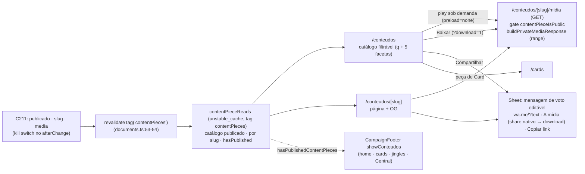

# Impl: S27 — Central de Conteúdos pública — Peça voto pra Solla 1313

Status: aprovado
Atualizado em: 2026-09-23
Issue: #1255
Intenção: docs/plans/central-conteudos-publica.md
Design UI (gate): docs/plans/central-conteudos-publica-ui-design.html
Appetite restante: herdado (~2–3 dias eng) — catálogo filtrável + página da peça + serving público da mídia + share de voto, **sem schema novo**, reusando os donos existentes (mídia privada, tag de listing, wa.me, shells públicos). Cortados: poster/thumbnail, player próprio, busca semântica, analytics e lote.
Modo: autônomo (`--auto`) — impl plan nasce aprovado pelo agente.

## Leitura da intenção

- **Outcome:** o eleitor abre `/conteudos`, vê as peças publicadas de C211 filtráveis por Tipo · Cidade · Região · Tema · Instituição e por termo, vê/ouve no próprio catálogo (play sob demanda), baixa ou compartilha dali mesmo com a mensagem de voto (sempre editável, `wa.me` sem destinatário) e, na peça de Card, cai no `/cards`; cada peça tem página própria `/conteudos/<slug>` com preview para o link abrir bem no WhatsApp.
- **O que NÃO negociar:**
  - **Kill switch por peça:** despublicar tira da lista e da própria página na hora, sem apagar arquivo; sem peça publicada, a Central mostra estado honesto e a descoberta (link do rodapé + selo do header) some.
  - **LGPD/TSE:** sem login, sem cadastro, sem captura de PII e sem rastreio; `wa.me/?text=` do aparelho do eleitor, sem destinatário e sem envio pelo sistema; nada de disparo em massa; cards 100% no aparelho (a Central só convida para `/cards`); bloco eleitoral do rodapé preservado.
  - **Nada de segunda cópia:** peça-link compartilha pelo link da plataforma (`sourceUrl`); peça com arquivo baixa/compartilha o MESMO objeto privado do C211 — nunca `/api/media/file` (esse proxy é só da collection `media`) e nunca re-hospedar.
  - **Leve/mobile-first:** Vídeo e Áudio só carregam no toque; Foto com preview leve; sem zip/lote.
  - **Literais:** `/conteudos` + `/conteudos/<slug>` (entram nos slugs reservados), `Central de Conteúdos`, `Peça voto pra Solla 1313`, filtros `Tipo` · `Cidade` · `Região` · `Tema` · `Instituição`, ações `Baixar` · `Compartilhar` (`Mensagem no WhatsApp` · `A mídia` · `Copiar link`) · `Fazer meu card`, e os três templates de mensagem de voto da intenção.
- **O que reavaliar (hipóteses do plano de intenção):**
  - "cache/revalidação no padrão de `documents.ts` + allowlist em `api/revalidate`": a revalidação já está pronta no dono (`ContentPiece.afterChange` → `revalidateContentPiecesListing`, `src/collections/ContentPiece.ts:78-81`); o endpoint de revalidate é para writes diretos no DB e **não é tocado** — a leitura pública é um módulo novo cacheado na tag `contentPieces` (D1).
  - "filtros/busca reusando o maquinário interno": **não** — o contrato interno (`src/utilities/content/contentPieceListUrl.ts:145-155`) é de staff e a fronteira site→interno é vedada; o contrato público é novo e puro (D3).
  - "mídia baixa por atributo `download` no proxy": não existe proxy público para `contentMedia`; o serving é rota nova com o helper de I/O privado (D2). Achado do explorador que vira mudança no dono: a allowlist inline de `src/lib/privateMedia.ts:16-24` não cobre webp/gif/avif nem os áudios que o C211 aceita (m4a/ogg/opus/wav/flac) — sem isso a Foto não renderiza e o Áudio não toca.
  - "`navigator.share` com arquivo": primeiro precedente do repo (hoje só texto/URL, `src/lib/homeSearchShare.ts:9-18`); sempre com fallback `<a download>`, nunca fingindo anexo.
  - "OG sem thumbnail": não há poster gerado no C211; a Foto usa o próprio arquivo e os demais tipos caem na imagem do global `metadata` (D5).

## Abordagem recomendada

**Opções consideradas (abordagem geral):** A) leitura pública cacheada por tag + rota de mídia nova reusando o helper privado + contrato público de filtro/busca puro + port classe-a-classe do design; B) página lendo direto da Local API sem cache e mídia pelo proxy do Payload; C) catálogo client-side (tudo carregado e filtrado no cliente) com mídia liberada em `contentMedia`.
**Recomendação:** **A** — mantém cada dono no seu lugar (tag do C211, I/O privado do C193/C199, `CampaignFooter` do S21), nasce fail-closed para rascunho (o `where`+`contentPieceIsPublic` são o gate) e cabe no appetite sem schema/migration.
**Rejeitadas:** **B** porque duplicaria o `where`/select/mapa em N superfícies sem cache por tag (o kill switch exigiria revalidar em todo lugar) e porque `contentMedia` é privada por contrato — liberá-la vazaria rascunho por URL; **C** porque carregar o catálogo inteiro no cliente contraria "leve/conexão ruim" e mata o filtro compartilhável por URL.

### D1 — Leitura pública das peças (onde mora; reuso de `contentPieceIsPublic`)

**Opções:** A) módulo novo `src/utilities/content/contentPieceReads.ts` (`server-only`) com `unstable_cache` na tag de listing `contentPieces` + VM público puro em `src/lib/contentPieceCatalog.ts`; B) `payload.find` direto em cada page/route; C) reusar o loader interno `src/utilities/content/contentPiecePageData.ts:92-...`.
**Recomendação:** **A** — a collection não tem read público (`canReadContentPiece`, `src/utilities/access/contentPieces.ts:16-21`); o precedente é Local API sem user + `where` de publicação + `unstable_cache` na tag de listing (`src/utilities/jingleReads.ts:21-35`, `src/utilities/shareLinkReads.ts:38-45`). O `where` filtra `status=publicado` e o predicado `contentPieceIsPublic` (`src/lib/contentPiece.ts:211-215`) derruba publicado-sem-arquivo-e-sem-link — é o contrato que o C211 reservou ao S27. A leitura **por slug** usa a **mesma tag** de listing (o hook não busta document tag, então `getCachedDocumentById` não serve; padrão `shareLinkReads.ts:33-45`). `hasPublishedContentPieces()` deriva da mesma lista resolvida (padrão `hasPublishedJingles`, `jingleReads.ts:74-80`). Local API sem `user` usa o bypass default — o gate é o `where`+predicado, com comentário explícito (mesmo precedente de `jingleReads`).
**Rejeitadas:** **B** porque repetiria o `where`/select/mapa em duas pages + rota, sem cache e com kill switch espalhado; **C** porque o loader interno exige `CampaignUser`, seleciona campos de staff (`error`, `curatedFields`, `transcript`) e inverteria a fronteira público→interno.

### D2 — Serving público da mídia (rota + headers + range)

**Opções:** A) rota GET-only `/conteudos/<slug>/midia` (`src/app/(frontend)/conteudos/[slug]/midia/route.ts`) reusando `buildPrivateMediaResponse` (`src/utilities/privateMedia/privateMediaResponse.ts:151-186`) com o gate público; B) rota sob `/api/conteudos/[slug]`; C) `contentMedia` com read público + proxy do Payload.
**Recomendação:** **A** — o objeto continua no bucket privado e a rota é a única porta, decidida por `slug` (nunca por id), com o mesmo helper de I/O do interno (range e `Content-Disposition` inclusos; nada de segundo cliente S3). 404 silencioso e uniforme para rascunho/inexistente/sem arquivo (contrato de `/corte/[id]`, `src/app/(frontend)/corte/[id]/page.tsx:38-53`).
**Headers/Cache-Control:** reusar o contrato do dono (`private, no-store`, `src/lib/privateMedia.ts:27,78`) — o kill switch precisa valer na hora e nada compartilhado pode guardar peça retirável na reta final; o range já torna o seek barato e o peso é limitado pelo `preload="none"` (D3/UI). **Gatilho:** se o campo relatar re-download doloroso, acrescentar um `cacheControl` opcional ao dono com janela curta (`public, max-age=300, must-revalidate`) — mudança localizada.
**MIME inline (mudança no dono):** estender `PRIVATE_MEDIA_INLINE_MIME_TYPES` (`src/lib/privateMedia.ts:16-24`) com `image/webp`, `image/gif`, `image/avif` (foto renderiza de verdade) e `audio/mp4`, `audio/aac`, `audio/ogg`, `audio/opus`, `audio/wav`, `audio/webm`, `audio/flac` (o C211 aceita esses formatos e hoje todos caem em `application/octet-stream` → viram download e o `<audio>` não toca). HEIC/HEIF seguem download-only (browser não renderiza) e `image/svg+xml` fica fora (XSS). `tests/unit/privateMedia.unit.spec.ts:30-36` ganha os casos.
**Download legível:** `<a href={mediaPath + '?download=1'} download={contentPieceDownloadFilename(slug, filename)}>` — o `?download=1` manda `attachment` com o nome guardado; o atributo dá o nome legível onde o browser honra (Chrome/Firefox); Safari usa o guardado (aceito).
**Rejeitadas:** **B** porque parte o contrato da Central em dois namespaces sem ganho; **C** porque `contentMedia` é privada por contrato e um rascunho vazaria por URL — mata o kill switch.

### D3 — Filtro/busca pública (querystring + pure module; o que não importar)

**Opções:** A) querystring canônica + filtragem em memória no servidor sobre o catálogo publicado já cacheado, contrato puro novo em `src/lib/contentPieceCatalog.ts` (`tipo`, `cidade`, `regiao`, `tema`, `instituicao`, `q`; um valor por faceta); B) client-state sem URL; C) reusar `src/utilities/content/contentPieceListUrl.ts`.
**Recomendação:** **A** — filtro em URL é compartilhável e funciona sem JS (form GET + links), e o catálogo publicado é pequeno (dezenas), então filtrar em memória sobre a lista cacheada evita combinações de `where` e não acopla o site ao contrato interno. `q` normaliza com `normalizeForSearch` e casa no `searchText` denormalizado do C211 (trigram no banco; em memória `includes` basta — gatilho: catálogo na casa dos milhares volta a usar `where` trigram público). Valores: `tipo`/`tema` são os enums persistidos (`CONTENT_PIECE_TYPES`, `SPEECH_TOPICS`); `cidade`/`regiao`/`instituicao` usam chave `slugify` do label (`src/lib/slug.ts`), derivada **só das peças publicadas**; faceta sem valor não aparece. Canonical da listing = `/conteudos` (sem params); `noindex` só no estado vazio (padrão `/jingles`, `src/app/(frontend)/jingles/page.tsx:62`). A peça de Card sintética (D6) só aparece no catálogo sem filtro ativo.
**Rejeitadas:** **B** porque mata o compartilhamento do filtro, o funcionamento sem JS e carrega o catálogo inteiro no cliente; **C** porque o contrato interno tem `page`/`status`/`processing` (vocabulário de staff) e a intenção veda importar o interno.

### D4 — Mensagens de voto por tipo (módulo novo)

**Opções:** A) módulo puro novo `src/lib/contentPieceShare.ts` com os três templates dos literais + link por tipo (página da peça para arquivo; `sourceUrl` para peça-link), reusando `buildWhatsAppTextShareUrl` (`src/lib/phone.ts:63-67`); B) estender `src/lib/contentShare.ts`; C) strings nos componentes.
**Recomendação:** **A** — `contentShare.ts` é o vocabulário do board da home (S4) com contrato pinado (`src/lib/contentShare.ts:11-15`); as mensagens de voto são literais do S27 e falam por **tipo de peça** (`video` | `audio` | `foto|texto|card`). O sheet usa o texto como valor inicial editável e monta o `wa.me` a cada render — o sistema nunca envia.
**Rejeitadas:** **B** porque reabre o pin do S4 e mistura dois vocabulários de mensagem; **C** porque duplica strings entre card e página e fica sem teste.

### D5 — OG da peça (sem thumbnail)

**Opções:** A) imagem real só quando a peça é `foto` com arquivo (URL absoluta de `/conteudos/<slug>/midia` no origin de deploy) e fallback para a imagem do global `metadata` nos demais tipos; B) gerar thumbnail/poster de vídeo/áudio; C) sem imagem quando não for foto.
**Recomendação:** **A** — o C211 não gera poster (fora de escopo lá) e gerar thumbnail é rabbit hole de mídia; a página abre bem no WhatsApp com `título + imagem` quando há imagem real e com `título + descrição` + imagem do site quando não há (mesmo fallback do `/corte`, `src/app/(frontend)/corte/[id]/page.tsx:82-94`, e do share-link, `src/utilities/shareLinkReads.ts:60-76`). A URL usa `resolveDeploymentOrigin` (`src/utilities/seo.ts:71-76`) porque é o único origin que serve a rota (regra do cover do `/jingles`, `src/app/(frontend)/jingles/page.tsx:36-55`).
**Rejeitadas:** **B** porque exige ffmpeg no caminho público e não está no appetite; **C** porque o link abriria sem preview mesmo havendo imagem do site.

### D6 — Card personalizado no catálogo (tile sintético vs peça catalogada)

**Opções:** A) tile sintético da Central (copy fixa do design, `Fazer meu card` → `/cards`, no mesmo grid, só sem filtro ativo); B) a peça de `type: 'card'` publicada pela assessoria é o convite; C) os dois.
**Recomendação:** **A** — o design aprovado desenha o convite como peça fixa do board ("SEU NOME + SUA FOTO", "Criado no seu aparelho.") e o caminho para `/cards` não pode depender de alguém lembrar de publicar uma linha (na reta final ele sumiria junto com o kill switch). A peça catalogada de `type: 'card'` segue como peça comum (arquivo próprio, `Baixar`/`Compartilhar`), sem comportamento especial — o tipo é rótulo editorial (`src/lib/contentPiece.ts:229-235`).
**Rejeitadas:** **B** porque acopla a descoberta do estúdio ao ciclo editorial e contraria a copy fixa do design; **C** porque duplicaria o convite quando houver peça de card publicada. Gatilho: se a comunicação quiser editar a copy do convite sem deploy, ele vira uma peça publicada (item curto).

### D7 — Descoberta (rodapé + selo; sem seção nova)

**Opções:** A) `CampaignFooter` ganha `showConteudos` + `current: 'jingles' | 'conteudos'` (link "Conteúdos" enquanto houver publicado) e a Central ganha selo no header local (`ContentPiecePageHeader`, molde `JinglePageHeader`); B) seção nova na home; C) item no `SiteHeader`.
**Recomendação:** **A** — é o contrato do S21 (descoberta condicional no rodapé + selo local, `src/components/CampaignFooter.tsx:26-33,58-68`), a intenção veda seção nova na home e o `SiteHeader` é o shell genérico do site institucional. Callers: home (`src/app/(frontend)/(home)/page.tsx:250`), cards (`src/app/(frontend)/(home)/cards/page.tsx:27,62`), jingles (`src/app/(frontend)/jingles/page.tsx:100`) e a própria Central (`current="conteudos"`).
**Rejeitadas:** **B** porque está fora do escopo explícito ("redesign do shell/nav/home"); **C** porque o header genérico serve o site inteiro.

### Componentes / mudanças

- **`src/lib/contentPieceCatalog.ts`** (novo, puro, sem `server-only`): contrato público do catálogo — `CONTENT_PIECE_CATALOG_PATH`, `contentPiecePublicPath(slug)`, `contentPieceMediaPath(slug)`, params (`tipo`, `cidade`, `regiao`, `tema`, `instituicao`, `q`), `parseContentPieceCatalogParams`, `buildContentPieceCatalogHref`, `filterContentPieceCatalogRows`, `contentPieceCatalogFacets`, `toContentPiecePublicItem` (VM serializável) e `contentPieceDownloadFilename` (molde `jingleDownloadFilename`, `src/lib/jingle.ts:40-51`). Reusa `contentPieceIsPublic`, labels, `CONTENT_PIECE_TYPES`/`SPEECH_TOPICS` de `src/lib/contentPiece.ts:24-104,211-215`, `normalizeForSearch` (`src/lib/speechSearch.ts`) e `slugify` (`src/lib/slug.ts`).
- **`src/lib/contentPieceShare.ts`** (novo, puro): `contentPieceVoteMessage(type, title, link)` com os três literais da intenção, `contentPieceShareLink(item, origin)` (página da peça para arquivo; `sourceUrl` para peça-link) e `buildContentPieceWhatsAppUrl` sobre `buildWhatsAppTextShareUrl`.
- **`src/utilities/content/contentPieceReads.ts`** (novo, `server-only`): `getPublishedContentPieceCatalog()` (find `status=publicado`, sort `-publishedAt`/`-id`, select enxuto com `searchText` + `media` depth 1, `unstable_cache` na tag `getCollectionListingTag('contentPiece')`, filtro `contentPieceIsPublic`), `getPublishedContentPieceBySlug(slug)` (mesma tag; padrão `shareLinkReads.ts:33-45`) e `hasPublishedContentPieces()`.
- **`src/app/(frontend)/conteudos/`** (novo): `layout.tsx` (`data-theme="campaign-site"` + scroll container, molde `jingles/layout.tsx:8-17`); `page.tsx` (catálogo + `generateMetadata` com canonical e noindex-vazio, molde `jingles/page.tsx:29-81`); `loading.tsx` (skeleton da cena 05); `[slug]/page.tsx` (peça + `notFound()` uniforme + metadata/OG de D5); `[slug]/not-found.tsx` (cena 05, molde `corte/not-found.tsx`); `[slug]/midia/route.ts` (GET, `dynamic = 'force-dynamic'`, gate `contentPieceIsPublic` + `buildPrivateMediaResponse` com `staticDir` de `payload.collections[CONTENT_MEDIA_SLUG]` como na rota interna `[id]/arquivo/route.ts:74-83`).
- **`src/components/conteudos/`** (novo): `ContentPiecePageHeader` (molde `JinglePageHeader.tsx:10-31`, com "Voltar à Central" na página), `ContentPieceHero` (eyebrow + headline + número 1313), `ContentPieceFilters` (chips `
` + form GET com hidden inputs das facetas ativas), `ContentPieceCatalog` (client: grid + play exclusivo, molde `JingleCards.tsx:85-165`), `ContentPieceCard`, `ContentPieceCardInvite` (tile de D6), `ContentPieceMedia` (vídeo/áudio `preload="none"` + overlay de play; foto inline; erro de mídia mostra "Baixe a peça"), `ContentPieceShareSheet` (textarea editável + `Abrir no WhatsApp` + `A mídia` + `Copiar link`; reusa `useCopyFeedback`/`CopyLinkButton`, `src/components/CopyLinkButton.tsx:22-46`, e o molde de popover de `ContentShareButton.tsx:44-108`), `ContentPieceActions` (`Baixar`/`Compartilhar`; peça-link sem `Baixar`/`A mídia`), `ContentPieceEmptyState`, `ContentPieceNoResults`.
- **`src/components/CampaignFooter.tsx`** (editar, `:26-33,58-68`): `showConteudos` + `current: 'jingles' | 'conteudos'`; link "Conteúdos" antes de "Jingles".
- **`src/lib/privateMedia.ts`** (editar, `:16-24`): allowlist inline de D2 + unit.
- **`src/lib/shareLink.ts`** (editar, `:9-23`): `'conteudos'` em `SHARE_LINK_RESERVED_SLUGS`.
- **Migration:** **sem migration** — nenhum campo/collection novo; `contentPiece`/`contentMedia` vieram do C211 (migration `20260923_032714_add_content_piece`) e o S27 só lê.
- **Access / Consent:** nenhum access novo; leitura pública por Local API sem `user` com `where` publicado + predicado (bypass default documentado — o gate é a query); `contentMedia` segue privada; sem `Consent` e sem PII (a Central não captura nada).
- **UI:** Impeccable C — port **classe-a-classe** do design aprovado (5 cenas), shape→craft→critique→polish sobre os shells públicos existentes; gaps de design em trigger (a), abaixo.
- **Changelog:** `docs/changelog/2026-09-23-s27.md` (uma entrada curta; nunca editar o agregado/HISTORY).

### Dados → forma (se aplicável)

N/A — a superfície não apresenta KPI, agregado, contador ou série (a intenção declara "Dados: N/A"). O `dl Tema · Local · Duração` da página é metadado de conteúdo da peça, não apresentação de dado.

## Design tier

Artefato aprovado no gate: `docs/plans/central-conteudos-publica-ui-design.html` (assets em `central-conteudos-publica-ui-design-assets/`). Superfícies cobertas:

- **Cena 01 — desktop 1280:** header da Central (logo negativo + "Central de Conteúdos"), hero (eyebrow `PEÇA VOTO PRA SOLLA 1313`, headline, número 1313), busca + CTA `Escolher uma peça e pedir voto`, chips `Tipo⌄ Cidade⌄ Região⌄ Tema⌄ Instituição⌄`, grid 3-col (vídeo/áudio/card) + 2-col (foto/texto), card com asset+play+duração, tag, título, metadados e `Baixar`/`Compartilhar`, tile de Card com `Fazer meu card`, rodapé eleitoral.
- **Cenas 02–03 — mobile 390:** antes do play (asset + play + "Toque no play para carregar só este vídeo") e depois do play (player com progresso) + **sheet de compartilhamento** (título "Peça esse voto no WhatsApp", textarea editável com a mensagem, `Abrir no WhatsApp`, `A mídia`, `Copiar link`, nota "Sem destinatário e sem envio automático…").
- **Cena 04 — desktop:** página individual (preview, tag, título, descrição, `dl` Tema/Local/Duração, `Baixar`/`Compartilhar`, "Voltar à Central").
- **Cena 05 — estados:** vazio ("As primeiras peças estão a caminho" + `Fazer meu card`), indisponível ("Esta peça não está disponível" + `Ver outras peças`), carregando (skeleton).

**Não cobertas → trigger (a) (dispatch do designer antes do markup final):**

1. **Catálogo com filtro ativo sem resultado** — o artefato cobre só o vazio global; fallback honesto na composição do vazio com "Limpar filtros" até o design chegar.
2. **Peça-link sem arquivo** (card e página) — asset placeholder por tipo e ações sem `Baixar`/`A mídia` (derivação direta das cenas cobertas; designer valida).
3. **Sheet de compartilhamento no desktop** — o artefato só mostra o 390; mesmo componente, designer valida posição/largura.

## Fases verificáveis

1. **Tracer / reads + serving — quota ~40%:** `src/lib/contentPieceCatalog.ts` + `src/lib/contentPieceShare.ts` + units; `src/utilities/content/contentPieceReads.ts`; `src/lib/privateMedia.ts` (allowlist) + unit; `src/lib/shareLink.ts` (`conteudos`) + pin; rota `[slug]/midia/route.ts`; int no `tests/int/contentPiece.int.spec.ts` (rascunho escondido, por slug, `contentPieceIsPublic`, rota 200/206/404/attachment, foto inline vs texto octet-stream) verdes antes de seguir.
2. **UI (port classe-a-classe) — quota ~45%:** `layout/page/loading/[slug]/not-found`, componentes de `src/components/conteudos/`, metadata/OG (D5), `CampaignFooter` + callers; e2e `frontendConteudos.e2e.spec.ts` + manifest + curated pin.
3. **Gates — quota ~15%:** `pnpm gate:fast` (lint/format/typecheck/knip/cycles/unit); `pnpm test:int`; e2e curado; `pnpm push` → PR `--base main` (a verificação viva é o e2e de rotas reais).

## Testes previstos

- **`tests/unit/contentPieceCatalog.unit.spec.ts`** (novo): parse (params válidos/desconhecidos/valores inválidos; um valor por faceta), href canônico (ordem e dedupe), filtro combinado (`tipo`+`cidade`+`q`; busca sem acento), facetas só do publicado, VM (arquivo vs link; `downloadFilename`; card; `contentPieceIsPublic` exclui publicado sem arquivo e sem link).
- **`tests/unit/contentPieceShare.unit.spec.ts`** (novo): os três literais com título/link; link da plataforma para peça-link vs página para peça-arquivo; `wa.me/?text=` sem destinatário (path `/`).
- **`tests/unit/privateMedia.unit.spec.ts`** (editar, `:30-36`): webp/gif/avif e os áudios inline; `image/svg+xml` → `application/octet-stream`.
- **`tests/unit/shareLink.unit.spec.ts`** (editar, `:37-53`): `'conteudos'` na lista literal ordenada (o drift test `:136-147` passa a exigir sozinho).
- **`tests/unit/e2eAffectedManifest.unit.spec.ts`** (editar, `:54-79`): `frontendConteudos` no set curado com o comentário "deliberate".
- **`tests/int/contentPiece.int.spec.ts`** (editar; já mocka `next/cache`, `:9-13`): leitura anônima continua negada por access, mas o módulo público mostra só publicado (rascunho some; despublicado some e a rota 404a; slug preservado); rota de mídia com `range` 206, `?download=1` attachment e 404 uniforme; foto inline vs texto forçado a download (molde do helper `callFileRoute`, `:149-162`).
- **`tests/e2e/frontendConteudos.e2e.spec.ts`** (novo, seeding REST admin como `frontendJingles.e2e.spec.ts:33-113`): catálogo lista publicados; zero requests a `/conteudos/*/midia` antes do play e play busca só a peça tocada; filtro e busca na URL; página da peça 200 + `og:title`/`og:image` (foto); tile de Card → `/cards`; sheet com a mensagem de voto editável e `Abrir no WhatsApp` sem destinatário; `A mídia` cai em download no headless; `Baixar` com nome legível; kill switch (some da lista, página 404, vazio 200 + `noindex`, selo e link do rodapé somem).

## Pins a atualizar (valores exatos)

- **`src/lib/shareLink.ts:9-23`** — `'conteudos'` na lista; **`tests/unit/shareLink.unit.spec.ts:37-53`** — literal ordenado com `'conteudos'`.
- **`scripts/lib/e2e-affected-manifest.mjs`** — entrada nova (junto à de jingles, `:95-118`): prefixes `src/app/(frontend)/conteudos`, `src/components/conteudos`, `src/utilities/content/contentPieceReads.ts`, `src/lib/contentPieceCatalog`, `src/lib/contentPieceShare`, `src/lib/privateMedia`, `src/components/CampaignFooter.tsx` → specs `['frontendConteudos']`; o classificador faz união, então as entradas de campanha/jingles/share-link existentes ficam.
- **`tests/unit/e2eAffectedManifest.unit.spec.ts:54-79`** — `'frontendConteudos'` no `E2E_CURATED_SPECS` (comentário: "S27 — deliberate: catálogo/página/serving público novos e a migration do C211 torna o PR high-risk").
- **`tests/unit/codebaseConventions.unit.spec.ts:202-237`** — **intocado**: a rota é GET-only, sem POST.
- **`tests/unit/codebaseConventions.unit.spec.ts:409-556`** — **intocado**: nada novo no top-level de `src/utilities/` (tudo em `src/utilities/content/`).
- **`src/lib/privateMedia.ts` + `tests/unit/privateMedia.unit.spec.ts`** — allowlist inline (D2).

## Rabbit holes / Não escopo (engenharia)

- **Poster/thumbnail de vídeo/áudio, transcode de mkv/avi, player com trechos** — preview é o arquivo; play sob demanda; erro de mídia mostra o download honesto.
- **Analytics, contadores, UTM, rastreio e consentimento do visitante** — C213; a Central não captura nada.
- **Busca semântica/embeddings** — S28; aqui `searchText` normalizado + `includes`.
- **Paginação/infinite scroll** — catálogo pequeno; renderiza tudo (gatilho: catálogo > ~200 peças).
- **Zip/lote de download, re-hospedar mídia de terceiro, embed de Instagram/YouTube, segundo catálogo/edição na Central** — vedados pela intenção.
- **`navigator.share` de arquivo no desktop** — não suportado; fallback download é o contrato, nunca fingir anexo.
- **SEO de bandeira/landing, sitemap/JSON-LD da Central** — fora de escopo (gatilho: SEO da campanha).
- **Collection/Consent/`Contact` novos** — proibidos; sem PII.

## Riscos e mitigação

- **Kill switch não refletir na hora:** todas as leituras usam a tag de listing bustada no `afterChange`; e2e despublica e faz poll da lista/página/rodapé.
- **Rascunho vazando:** nenhuma leitura pública sem `status=publicado`; `contentMedia` segue privada; rota por slug com 404 uniforme; int cobre rascunho/despublicado/inexistente.
- **Mídia pesada/repetida:** `preload="none"` + play exclusivo (precedente `JingleCards.tsx:276-290`); e2e conta requests antes do play; `private, no-store` evita cache compartilhado (gatilho de janela pública em D2).
- **`navigator.canShare`/`File` indisponível:** fallback `<a download>`; "A mídia" com estado de preparo e erro honesto; e2e cobre o fallback.
- **Busca sem acento divergente:** `normalizeForSearch` nos dois lados (C211 grava normalizado, `src/lib/contentPiece.ts:323-336`); unit cobre.
- **Slug reservado esquecido:** `conteudos` entra em `SHARE_LINK_RESERVED_SLUGS` + pin; o drift test falha sozinho.
- **MIME inline:** tipos inertes, sem SVG; unit do `privateMedia` cobre.
- **OG sem imagem em vídeo/áudio:** fallback do global `metadata`; sem imagem o link ainda abre com título/descrição (aceito, sem gerar thumbnail).
- **`depth: 1` na lista:** catálogo pequeno com select enxuto; se crescer, depth 0 + resolução de mídia por id (padrão `jingleReads.ts:45-54`).
- **PR toca `src/lib/privateMedia`, `src/lib/shareLink` e `src/utilities/content`:** e2e selecionado roda o conjunto mapeado; `gate:fast` + int local antes do push.

## Aceite de engenharia

- [ ] Aceite de produto da intenção coberto: `/conteudos` com peças publicadas filtráveis (Tipo · Cidade · Região · Tema · Instituição + termo) e combináveis; `/conteudos/<slug>` com preview OG; play sob demanda de Vídeo/Áudio e Foto com preview leve; `Baixar` e `Compartilhar` (`Mensagem no WhatsApp` · `A mídia` · `Copiar link`) do card e da página; peça de Card → `Fazer meu card` → `/cards`; mensagens de voto dos literais, sempre editáveis; peça-link pelo link da plataforma; kill switch com estado honesto e descoberta que some; chamada/CTA de pedido de voto.
- [ ] Guardrails: sem login/cadastro/PII/rastreio; `wa.me/?text=` sem destinatário e sem envio; sem mídia de terceiro baixada/re-hospedada; sem segunda cópia; cards 100% no aparelho; rodapé eleitoral preservado.
- [ ] Invariantes AGENTS/engineering-standards: Local API sem `user` com bypass default documentado e gate por `where`/predicado; nenhuma escrita multi-collection nova; identificadores em inglês/copy pt-BR; migrations existentes intocadas; `contentMedia` segue privada.
- [ ] Testes de domínio previstos (unit/int) onde leitura pública e serving mudam; pins de shareLink/manifest/conventions atualizados.
- [ ] `pnpm gate:fast` verde; `pnpm test:int` do spec verde; e2e `frontendConteudos` verde; `pnpm push` via GitHub.

## Decisões de engenharia

- **D1 — Leitura pública:** módulo `contentPieceReads` com `unstable_cache` na tag `contentPieces` + `contentPieceIsPublic` como gate; slug pela mesma tag. Rejeitadas: find direto por página (duplicação/sem cache) e loader interno (fronteira e campos de staff).
- **D2 — Serving:** rota GET `/conteudos/<slug>/midia` reusando `buildPrivateMediaResponse` (range/disposition) com `private, no-store` e 404 uniforme; allowlist inline do dono ganha webp/gif/avif + áudios; download `?download=1` + atributo legível. Rejeitadas: rota em `/api` (contrato partido) e `contentMedia` pública (vaza rascunho).
- **D3 — Filtro/busca:** querystring canônica (`tipo`/`cidade`/`regiao`/`tema`/`instituicao`/`q`, um valor por faceta) + filtragem em memória no servidor, contrato puro novo; canonical `/conteudos`; sem importar o interno. Rejeitadas: client-state (sem URL/JS) e contrato interno (vocabulário de staff).
- **D4 — Mensagens de voto:** módulo puro novo por tipo de peça, link por tipo (página vs `sourceUrl`), editável no sheet. Rejeitadas: estender `contentShare.ts` (pin do S4) e strings soltas.
- **D5 — OG:** foto com arquivo usa `/conteudos/<slug>/midia` no origin de deploy; demais caem na imagem do global. Rejeitadas: gerar thumbnail (fora do appetite) e sem imagem (perde preview).
- **D6 — Card no catálogo:** tile sintético com a copy do design → `/cards`, só sem filtro; peça `type: 'card'` é peça comum. Rejeitadas: peça publicada como convite (some com o kill switch) e duplicação.
- **D7 — Descoberta:** `CampaignFooter showConteudos`/`current` + selo no header local; sem seção na home e sem `SiteHeader`. Rejeitadas: seção nova (fora de escopo) e nav genérica.
- **Sem migration, sem Consent, sem access novo** — registrado, não presumido.

## Self-score

**Self-score decision-quality: 5/5.** (1) Todas as decisões caras (leitura pública, serving/cache/MIME, contrato de filtro, mensagens, OG, card, descoberta) têm opções + recomendação + rejeitadas explícitas. (2) Cabe no appetite herdado: sem schema/migration, reusa o helper de I/O privado, a tag do C211, `wa.me`, `useCopyFeedback`, `slugify` e os padrões de `/jingles` e `/corte`; o custo é o port de 5 cenas. (3) Rabbit holes nomeados (poster, transcode, analytics, semântica, paginação, zip, embed, nav). (4) Depth check: shells/helpers existentes reusados; módulos novos só onde não há dono (contrato público do catálogo, mensagens de voto, reads públicos). (5) Outcome preservado: todos os literais e o aceite de produto estão mapeados; a única interpretação é o tile de card (D6), ancorada no design aprovado e com gatilho registrado, e as mensagens seguem "assumidas — validar com a comunicação" (copy, não engenharia).
