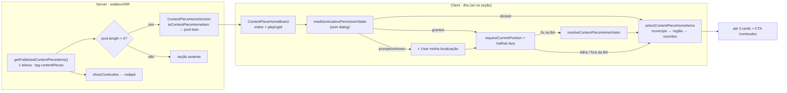

# Impl: S39 — Home — seção divulgando a Central de Conteúdos

Status: aprovado
Atualizado em: 2026-09-24
Issue: #1305
Intenção: docs/plans/central-conteudos-secao-home.md
Appetite restante: herdado

## Leitura da intenção

- **Outcome:** a home ganha uma seção da Central que mostra até 3 peças publicadas do território do visitante (município → região → recentes) e leva a `/conteudos`; sem peça publicada a seção inteira some (fail-closed), e nada do visitante é guardado, logado ou cookiado.
- **O que NÃO negociar:** zero peças → seção ausente; cards personalizáveis (`CARD_MODELS`) nunca são amostra; nada persistido/logado (localização e IP incluídos); sem autoplay/mídia pesada; CTA `Ver todas as peças` → `/conteudos`; kill switch pela tag `contentPieces`; rodapé, selo do S27, `SiteHeader`, `/conteudos`, `CampaignCardsSection` e as demais seções da home intocados; sem migration/Consent novo; copy pt-BR / identificadores em inglês.
- **O que reavaliar:** (1) a intenção cogita "senão IP no servidor" — **não existe geo-IP no repo** (só extração de IP: `contentEventRateLimit.ts:33-37`, `themeSearchGuard.ts:22`) e `headers()` dinamizaria a home ISR (alerta literal em `contentPieceThemeSearch.ts:59-76`; e2e converge no HTML estático em `frontend.e2e.spec.ts:763-800`). Sem GPS acessível/afordance, a seleção **degrada para recentes** — exatamente o que a própria intenção permite ("se só resolver país/estado, a seleção degrada para região/recentes"). (2) A hipótese "seção por visitante exige mecanismo novo" se resolve com uma ilha client sobre o pool já cacheado, sem superfície nova.

## Abordagem recomendada

**Opções consideradas:** A) ilha client recebendo o pool serializado do server e resolvendo a localização no cliente; B) server render por IP com `headers()`; C) rota de API de seleção chamada após resolver a localização.
**Recomendação:** A — a home é ISR/estática e o e2e converge no HTML do servidor; o pool já sai do cache `contentPieces` (`contentPieceReads.ts:45-61`), então a ilha só acrescenta a resolução (GPS no cliente, como o B14) e a seleção pura. Nenhuma superfície nova, nenhum dado do visitante no servidor.
**Rejeitadas:** B porque `headers()` opta a home pelo render dinâmico/streamado (duplica o DOM atrás do `loading.tsx` na build de produção) e não há fonte de geo-IP para resolver município — no máximo país; C porque adiciona endpoint público + rate limit + cache próprio sem ganho sobre o pool já cacheado.

### Componentes / mudanças

- **`src/lib/contentPieceHomeSelection.ts` (novo, puro/client-safe)** — contrato da seção:
  - `ContentPieceHomeItem = Pick<ContentPiecePublicItem, 'id' | 'slug' | 'title' | 'type' | 'typeLabel' | 'origin' | 'originLabel' | 'isLink' | 'cityLabel' | 'regionLabel' | 'excerpt' | 'durationLabel' | 'metaLabel' | 'publicPath' | 'file'>` e `toContentPieceHomeItem(item)` copiando **campo a campo** (campo novo do item público nunca vaza por spread);
  - `ContentPieceHomeVisitor = { municipalityName: string | null; region: string | null }`;
  - `resolveContentPieceHomeVisitor({ point, coarse?, municipalityGeometry, zoneGeometry?, territoryGeometry })` → `ContentPieceHomeVisitor | null` (fora da malha municipal = fora da Bahia = `null`);
  - `ContentPieceHomeMatch = 'municipality' | 'region' | 'recent'`; `ContentPieceHomeSelection = { item; match }`;
  - `selectContentPieceHomeItems(items, visitor, limit = 3)`.
    Importa `featureContainsPoint`/`GeoPoint` de `@/lib/municipalityProximity`, tipos de `@/lib/bahiaGeometriesTypes`, `slugify` de `@/lib/slug` e o tipo do catálogo. **Não importa o catálogo de 435 entradas nem `@/utilities/**`** (regra do ESLint para `src/lib`).
- **`src/components/conteudos/ContentPieceHomeSection.tsx` (novo, server)** — recebe `items: readonly ContentPiecePublicItem[]`, projeta o pool lean e renderiza `<section aria-labelledby="content-pieces-title" data-home-section="content-pieces" className="relative overflow-hidden border-b border-(--campaign-line) bg-white">` com os blobs decorativos (`aria-hidden`) do gate + container `mx-auto w-full max-w-[1160px] px-5 py-8 sm:px-8 lg:px-10 lg:py-16` (padrão de `JingleHomeSection.tsx:34-38`) + `<ContentPieceHomeBoard items={pool} />`.
- **`src/components/conteudos/ContentPieceHomeBoard.tsx` (novo, `'use client'`)** — dono de `visitor`/`permission`/`locating`/`attempted` e de `playingId` (um play por vez, precedente `ContentPieceCatalog.tsx:28`); no mount só lê a permissão (`readGeolocationPermissionState`, sem dialog) e resolve automático **apenas** com `granted`; o botão explícito chama `requestCurrentPosition` + `loadMunicipalityGeometryModule`/`loadMunicipalityZoneGeometryModule`/`loadTerritoryGeometryModule` (`bahiaGeometries.ts:25-37`, lazy) e `resolveContentPieceHomeVisitor`; renderiza eyebrow/título/copy/tag/cards/CTA/botão/footnote.
- **`src/components/conteudos/ContentPieceHomeCard.tsx` (novo)** — card leve do gate: `ContentPieceMedia` (asset) + tags + título (link para `publicPath`) + `metaLabel` + `Ver esta peça →`; `grid-cols-[124px_1fr]` no mobile, coluna no desktop (`lg:`); `data-content-piece={slug}` para e2e.
- **`src/components/conteudos/contentPieceClasses.ts`** — acrescentar `CONTENT_PIECE_LOCAL_TAG` (gate: `bg-[#fff3c4] text-[#6b5100]`, mesmo estilo dos hex já usados em `CONTENT_PIECE_TAG`); reusar `CONTENT_PIECE_TAG`, `CONTENT_PIECE_CARD`, `CONTENT_PIECE_PRIMARY_BUTTON` (CTA) e `CONTENT_PIECE_FOCUS`.
- **`src/components/conteudos/ContentPieceMedia.tsx`** — o prop `item` passa de `ContentPiecePublicItem` para o `Pick` estrutural que ele realmente usa (`isLink | file | type | origin | originLabel | title | excerpt | durationLabel | typeLabel`); o item completo continua atribuível, então catálogo/detalhe não mudam.
- **`src/app/(frontend)/(home)/page.tsx`** — `page.tsx:124` passa a chamar `getPublishedContentPieceItems()` **uma vez**; `showConteudos = contentPieces.length > 0`; renderizar `{contentPieces.length > 0 ? <ContentPieceHomeSection items={contentPieces} /> : null}` entre `CampaignCardsSection` (`:249`) e `CampaignNewsletterSection` (`:250`).
- **Migration:** sem migration (nenhuma collection/global muda).
- **Access / Consent:** sem escrita e sem PII — nenhum helper novo, nenhuma chave `Consent`, nada de cookie/localStorage/sessionStorage/log.
- **UI:** Impeccable C com gate aprovado (`docs/plans/central-conteudos-secao-home-ui-design.html`, cenas 01–06) — shape→craft→critique→polish contra as cenas, mobile primeiro (390) e desktop (1280). **Trigger (b) resolvido pelo `designer` em 2026-09-24** (cena 04 atualizada para "recentes no HTML → troca silenciosa", sem skeleton; contrato do card alinhado: duas tags, título linkado, `metaLabel`, `aspect-video self-start` no mobile). Crítica final (c) obrigatória antes do push (o diff muda UI).

**Literais a portar (gate):** eyebrow `Central de Conteúdos`; título `Peça voto pra Solla 1313`; copy local `Comece pelo material do seu território e mande para quem você conhece.` (mobile: `Material do seu território para compartilhar.`); copy recente `Veja as peças mais recentes e escolha uma para compartilhar.`; copy de uma peça `Uma peça oficial já está pronta para você compartilhar.` (mobile: `Uma peça oficial já está pronta.` — cena 05); tag de seção `⌖ Para seu município` / `Seleção recente`; nota local `Localização usada só nesta visita` (some no mobile); tags de card `Do seu município` / `Da sua região` / `Mais recente` (a primeira é o `typeLabel`/`originLabel`, como em `ContentPieceCard.tsx:40`); CTA `Ver todas as peças →` → `/conteudos`; botão `⌖ Usar minha localização` (glifo decorativo `aria-hidden`, nome acessível `Usar minha localização`) com nota `Opcional. Sem prompt no carregamento.`; footnote `A localização não é guardada. Cards personalizáveis ficam na seção anterior.`

### Dados → forma (se aplicável)

Não aplicável — a intenção fixa **Dados: N/A** (nenhum número, contador ou ranking). A "forma" aqui é a ordenação de apresentação (município → região → recentes) e as tags de procedência; rejeitadas: contador de peças, score de relevância, percentuais — todos virariam KPI inventado numa superfície de descoberta.

## Decisões de engenharia

1. **Mecanismo por visitante — A) ilha client + pool do server.** Recomendação: **A**. Opções: A | B (server por IP) | C (rota de API). Rejeitadas: **B** (a home é ISR e `headers()` a tornaria dinâmica/streamada; não há geo-IP no repo e IP→município não é viável) e **C** (endpoint novo, rate limit e cache próprios para um pool que já está no cache `contentPieces`).
2. **Estado inicial — A) server renderiza a seleção recente; a ilha troca em silêncio para local.** Recomendação: **A**, **aprovada pelo `designer` (trigger b, 2026-09-24; `Design tier: openai/gpt-5.6-sol`)** — o artefato foi atualizado: a cena 04 agora é "Recentes já no HTML → troca silenciosa para o território quando houver match", sem skeleton. O estado inicial é o fallback final: sem espera, e sem JS a seção continua completa (recentes) em vez de esqueleto eterno. A troca só acontece com localização real (permissão `granted` no mount ou clique explícito). Rejeitada: **B** (shell + skeleton) porque sem JS o skeleton ficaria para sempre (exigiria `<noscript>` duplicando os cards), o HTML estático deixaria de conter as peças (kill switch/e2e) e conexão ruim mostraria caixas cinzas em vez de conteúdo útil.
3. **Payload server→client — projeção lean `ContentPieceHomeItem`.** Recomendação: **A** (Pick + `toContentPieceHomeItem` no novo módulo `src/lib/`). Rejeitadas: **B** item público completo (levaria `searchText` — haystack normalizado com `transcript`/`description`, `contentPieceCatalog.ts:549` — e `description` para o HTML de toda a home) e **C** shape duplicado à mão (duas fontes de verdade). `ContentPieceMedia` aceita o `Pick` estrutural, sem duplicar tipos.
4. **Seleção — módulo puro novo `src/lib/contentPieceHomeSelection.ts`.** `selectContentPieceHomeItems(items, visitor, limit = 3)`: input já vem mais recente primeiro (`contentPieceReads.ts:50`); uma passada estável (município → região → recentes), dedup por `id`, anotação `match` por item; `visitor === null` → os `limit` primeiros como `'recent'`. Rejeitadas: inchar `contentPieceCatalog.ts` (561 linhas, dono do catálogo público) e ordenar dentro do componente (lógica não testável fora do React).
5. **Resolução ponto→visitante — B) função pura nova sobre as malhas, sem catálogo.** Recomendação: **B**: contenção na ordem **zona → município → território**: zona contém → nome da zona (`Salvador — ZE 3`, igual ao catálogo); senão município contém → nome do município; território contém → `region`; fora da malha municipal → `null`. Nomes das features são os mesmos do catálogo (pinado em `bahiaGeometries.unit.spec.ts:129,157,188` e `:150-170`), então não é preciso importar `municipalityCatalog` (435 entradas) no bundle do cliente. `coarse: true` (fix com `accuracyM > COARSE_ACCURACY_M`, decisão da ilha — `campaignGeolocation.ts:25`) mantém só a região. Rejeitadas: **A** `resolveNearbyMunicipality` com `accessible = municipalityCatalog` (semântica de carteira não se aplica — não há link para abrir — e `findNearestInScope` varreria 435 centroides quando o ponto está fora, `municipalityProximity.ts:215-234`) e **C** por IP (sem geo-IP; ver D1).
6. **Matching visitante↔peça.** `slugify(item.cityLabel) === slugify(visitor.municipalityName)` → `'municipality'`; senão `slugify(item.regionLabel) === slugify(visitor.region)` → `'region'`; senão `'recent'` (`slugify` de `src/lib/slug.ts`, a mesma linguagem do filtro do catálogo em `contentPieceCatalog.ts:255`). Salvador: visitante em ZE casa o nome exato `Salvador — ZE N`; sem zona (ponto na cidade fora dos polígonos), `municipalityName` é `Salvador` e a peça cai na região. **Contrato binário da tag de seção (designer, trigger b):** `⌖ Para seu município` **só** com match de município; seleção apenas regional (ou sem match) usa `Seleção recente` e a copy de recentes — a tag de seção nunca mente (os cards continuam com a tag de procedência individual `Da sua região`).
7. **Botão `⌖ Usar minha localização`.** Aparece só quando `visitor === null && selection.length > 1 && !attempted && permission ∈ {prompt, unknown}`; some em `denied`, `granted` (auto), `locating` e após a primeira tentativa; falha (`timeout`/`unavailable`) mantém recentes, **sem erro, sem retry automático e sem nada persistido** — inclusive **não** reusar o `sessionStorage` do B14 (`campaignGeolocation.ts:48-65`); `denied` do navegador vira `permission = 'denied'`. Sem auto-prompt no carregamento (`useNearestMunicipalitySlug.ts:60-72` fica de fora justamente por isso).
8. **Gating/kill switch/leitura única.** A home passa a usar `getPublishedContentPieceItems()` **uma vez** (`page.tsx:124`) e deriva `showConteudos` (rodapé) + pool; zero itens → a seção não é renderizada no server. `hasPublishedContentPieces` continua sendo o dono do flag em `cards/page.tsx:30` e `jingles/page.tsx:64` (não mexer). Kill switch: mesma tag `contentPieces` (bust no `afterChange` do `ContentPiece`, `ContentPiece.ts:227`) — despublicar reflete sem deploy.
9. **`data-home-section`.** Valor **`content-pieces`** (curto, distinto de `contents` do S3 em `CampaignContentSection.tsx:126`), posicionado entre `cards` e `newsletter`. O pin de ordem do spec da home (`frontend.e2e.spec.ts:1778-1780`) passa a ser agnóstico da seção condicional (`sound < cards < newsletter`); a posição exata com peça publicada é pinada no spec dono das linhas (D10).
10. **Testes.** Unit primeiro: `tests/unit/contentPieceHomeSelection.unit.spec.ts` (projeção sem `searchText`/`description`; seleção com fixtures — município/região/recentes, dedup, ordem estável, `visitor: null`, Salvador ZE e sem zona; resolução com quadrados sintéticos no padrão de `municipalityProximity.unit.spec.ts:15-62`, incluindo `coarse` e fora da malha) e `tests/unit/contentPieceHomeBoard.unit.spec.tsx` (renderiza recente, botão visível com `prompt`, ausente com `denied`, e troca para local com `granted` + fix mockado — mocks de `campaignGeolocation` e `bahiaGeometries`, no molde de `jingleHomeSection.unit.spec.tsx`). **Int: nenhum** (sem fronteira Payload/DB nova; a leitura pública já é pinada em `tests/int/contentPiece.int.spec.ts:811`). **E2e: estender `tests/e2e/frontendConteudos.e2e.spec.ts`** (serial, dono das linhas, helpers de seed/limpeza em `:124-167`; o projeto já serializa atrás de `frontend` em dev) — spec nova duplicaria a infra de seed e criaria dois donos das mesmas linhas. Dois testes novos: (a) home + kill switch (1 peça → cena 05; 2 peças → recente + botão + CTA + posição `cards < content-pieces < newsletter` + overflow 390 ≤ 1; despublicar → seção ausente por poll do HTML do servidor); (b) localizado (`grantPermissions(['geolocation'])` + `setGeolocation` num ponto interno de Feira de Santana calculado pela malha, no padrão de `campaignNearestMunicipality.e2e.spec.ts:67-82,149-150`, com a peça seedada com `municipality` → `⌖ Para seu município` + `Do seu município`). Manifesto: acrescentar `src/lib/contentPieceHomeSelection.ts` e `src/app/(frontend)/(home)` ao entry do S27 (`e2e-affected-manifest.mjs:153-180`) — a página é a única fiação da seção e um diff só nela precisa acordar `frontendConteudos`; o entry genérico `src/app/(frontend)` (`:81-83`) continua acordando `frontend`. **E2e local afetado (OPS72):** `frontend` + `frontendConteudos` (`pnpm test:e2e:affected` ou `pnpm test:e2e --no-deps --project=frontend` / `--project=frontendConteudos`).

## Fases verificáveis

1. **Tracer — lógica pura + fiação mínima (~1 dia).** `src/lib/contentPieceHomeSelection.ts` + `tests/unit/contentPieceHomeSelection.unit.spec.ts`; `page.tsx` com a leitura única e a seção condicional renderizando a seleção recente + CTA (server, sem ilha ainda). Verificação: `pnpm gate:fast` verde; kill switch visível no HTML (com peça → seção; sem peça → ausente).
2. **UI — ilha + card + classes (~1–1,5 dia).** `ContentPieceHomeBoard`, `ContentPieceHomeCard`, `CONTENT_PIECE_LOCAL_TAG`, retype do `ContentPieceMedia`, estados do gate (localizado/recente/uma peça/botão) e `tests/unit/contentPieceHomeBoard.unit.spec.tsx`. Verificação: `pnpm gate:fast`; inspeção 390/1280 contra as cenas 01–06 (sem overflow; mídia só no toque).
3. **Gates + e2e (~0,5 dia).** Estender `frontendConteudos.e2e.spec.ts`, atualizar `frontend.e2e.spec.ts:1778-1780`, ajustar o manifesto. Verificação: `pnpm test:e2e --no-deps --project=frontend` e `--project=frontendConteudos`; `pnpm gate:fast`; push via `pnpm push`.

## Rabbit holes / Não escopo (engenharia)

- Geo-IP/`headers()`/rota de API; cache ou seleção por visitante no servidor; persistir a localização (nem `sessionStorage`); auto-prompt; reusar `resolveNearbyMunicipality`, `useNearestMunicipalitySlug` ou `NearestMunicipalityCard` (semântica de carteira/auto-prompt).
- Migration, collection, global, Consent; tocar rodapé, selo do S27, `SiteHeader`, `/conteudos`, `CampaignContentSection` (S3), `CampaignCardsSection`, newsletter ou `#44 PUB2`.
- Filtros/busca/download/share na seção (mini-Central); autoplay/preview animado; hardcode de peças para nunca esvaziar; cards sintéticos do estúdio como amostra (a garantia é a origem do pool: `ContentPiecePublicItem[]`).
- Spec e2e nova/segunda infra de seed; cap/virtualização do pool; personalizar o resto da home.

## Riscos e mitigação

- **Pool no HTML cresce com o catálogo:** projeção lean (sem `searchText`/`description`); gatilho de revisitação — se a lista publicada passar de algumas centenas, reavaliar (fatiar no server exigiria nova decisão, não fazer agora).
- **Concorrência e2e (CI prod mode):** `frontendConteudos` publica peças enquanto o spec da home roda em paralelo → o pin de ordem do `frontend` fica agnóstico da seção condicional; a posição exata é pinada no spec dono das linhas.
- **Kill switch/ISR:** a seção depende da tag `contentPieces` (mesmo contrato do rodapé); o e2e converge por poll do HTML do servidor antes de navegar (padrão `frontend.e2e.spec.ts:763-800`).
- **Fix grosso errando o município:** `coarse` (> `COARSE_ACCURACY_M`) mantém só a região — nunca "Do seu município" com confiança falsa.
- **Retype do `ContentPieceMedia`:** Pick estrutural mantém o item completo atribuível; catálogo e página de peça seguem cobertos pelos e2e existentes do S27.
- **Hidratação:** render inicial sempre com `visitor = null` (recentes); a resolução só roda em efeito no cliente → sem mismatch SSR/cliente.
- **Safari (`permissions` sem descritor):** `unknown` → botão explícito, sem prompt surpresa.

## Débitos da revisão (simplify) — explicitamente fora / adiado com gatilho

- **Já resolvido no simplify (não reabrir):** teste do clique da affordance + `unknown` do Safari; `interiorPointOf` único em `tests/helpers/featureBounds.ts`; título/meta do card em `ContentPieceCardParts.tsx`; `aria-hidden` do `⌖`; guards unificados; foco mantido + anúncio do desfecho; fixtures/typing dos testes; pin de ordem no spec dono; casos unit da projeção/limite/peça-link.
- **Adiado com gatilho — D2:** consolidar a regra label↔faceta (`slugify`) num helper do catálogo quando houver **3º consumidor** ou quando um label mudar (ex.: `Salvador — ZE N`) e exigir fix em 2 lugares.
- **Adiado com gatilho — D3:** extrair o poll do HTML ISR (`waitForHomeSection`/`waitForHomeHTML`) para `tests/helpers/` quando um **3º spec** precisar dele ou quando o orçamento/padrão do poll tiver de mudar em 2+ cópias.
- **Descartado — D4:** manter a metade ponto→visitante no módulo da home (o primitivo `findContainingFeature` é reusado do dono da proximidade; ordem zona→município→território, `coarse` e vocabulário do item são contrato da seção, não semântica de carteira). Revisitar só com 2º consumidor de ponto→label.
- **D1** (pool no HTML) segue no §Riscos com o gatilho de "algumas centenas de peças publicadas".

## Aceite de engenharia

- [ ] Aceite de produto da intenção ainda coberto: até 3 peças (município → região → recentes); sem localização/fora da Bahia → recentes; zero peças → seção ausente no server; CTA → `/conteudos`; kill switch sem deploy (tag `contentPieces`); nada guardado/logado/cookiado; cards personalizáveis nunca como amostra; demais seções/rodapé/selo/`/conteudos` intocados; mobile 390 sem overflow; mídia só no toque.
- [ ] Invariantes AGENTS/engineering-standards: `src/lib` sem importar `@/utilities/**` (a ilha calcula `coarse` com `COARSE_ACCURACY_M`); client importa de server só `import type`; copy pt-BR / identificadores em inglês; sem migration; sem Consent novo; sem PII.
- [ ] Testes de domínio previstos: unit da projeção/seleção/resolução + unit do board; e2e estendido (home/kill switch + localizado); int intocado (nenhuma fronteira Payload/DB nova).
- [ ] Gates: `pnpm gate:fast`; e2e afetado (`frontend`, `frontendConteudos`); `pnpm push`.

## Self-score decision-quality

4,5/5.

1. **Decisões caras com rejeitadas (5/5):** mecanismo, estado inicial, payload, módulo de seleção, resolução e ownership do e2e têm Opções + Recomendação + rejeitadas explícitas (D1–D5, D10).
2. **Cabe no appetite herdado (4,5/5):** sem schema/API; 3 componentes novos + 1 módulo puro + 2 specs unit + extensão do e2e; o custo concentra-se na UI da seção e no e2e, dentro dos ~2–3 dias.
3. **Rabbit holes nomeados (5/5):** geo-IP, persistência, auto-prompt, mini-Central, cap do pool, spec e2e nova, cards sintéticos.
4. **Depth check (4,5/5):** reusa `ContentPieceMedia`/`contentPieceClasses`/cache+tag/`featureContainsPoint`/loaders lazy/`readGeolocationPermissionState`/infra e2e; o único módulo novo é a lógica pura da home (a projeção evita duplicar tipos).
5. **Intenção preservada (5/5):** outcome intacto; as reavaliações (mecanismo client e degradação para recentes sem IP) são as que a própria intenção delegou/antecipou.
