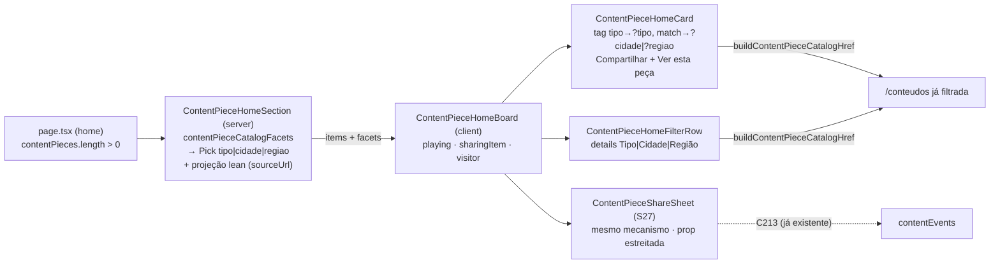

# Impl: S42 — Home — seção da Central de Conteúdos: compartilhar a peça no card e filtro que abre /conteudos já filtrado

Status: aprovado
Atualizado em: 2026-09-30
Issue: #1391
Intenção: docs/plans/central-conteudos-secao-home-share-filtro.md
Appetite restante: herdado — ~1–1,5 dia eng (S42), sem corte

## Leitura da intenção

- **Outcome:** o card da seção passa a compartilhar a peça pela **mesma** folha do S27 sem sair da home, e a seção ganha tags-atalho + fileira (`Tipo | Cidade | Região`) que abrem `/conteudos` já filtrado pelo construtor canônico — a seção vira atalho de circulação, nunca uma mini-Central.
- **O que NÃO negociar:** folha única do S27 (mensagem de voto por tipo, contador C213, sem mecanismo paralelo); URL canônica de `buildContentPieceCatalogHref` (`?tipo=|?cidade=|?regiao=`); tags sem faceta honesta (`Mais recente`, `Seleção recente`, origem Instagram/YouTube) estáticas; fileira **não** filtra a amostra local (sem estado de filtro, sem resultado vazio local); fail-closed (zero peças publicadas ⇒ seção some) intacto; `Ver esta peça →`/`Ver todas as peças →` seguem; sem download/analytics/localização/Consent/PII novos; `/conteudos` e demais seções intocadas; sem overflow horizontal novo em 390/1280.
- **O que reavaliar (hipóteses confirmadas por leitura direta):**
  - O lean `ContentPieceHomeItem` **não carrega `sourceUrl`** (`src/lib/contentPieceHomeSelection.ts:25-43`) e a folha precisa dele para peça-link (`src/lib/contentPieceShare.ts:16-50`) — D2.
  - `contentPieceCatalogFacets` lê `topics`/`institution` (`src/lib/contentPieceCatalog.ts:215-226`), então **não** roda sobre o item lean: calcula na section server, antes da projeção — D1.
  - O board é o dono natural do estado de share (precedente `ContentPieceCatalog.tsx:36-37,86-88`); o card é folha e ganha só `onShare` — D5.
  - `ContentPieceCatalogFacetOption` não é exportado, mas `ContentPieceCatalogFacets` é — o recorte `Pick<…, 'tipo'|'cidade'|'regiao'>` resolve sem exportar tipo novo.

## Abordagem recomendada

**Opções consideradas:** A) estender os donos existentes (section calcula facetas no server; board guarda `sharingItem` e renderiza a folha S27; card renderiza tags-link/Compartilhar; fileira é componente novo sem estado) | B) ilha própria da seção com filtro local sobre a amostra | C) rota intermediária com estado de filtro próprio da seção.
**Recomendação:** A — reusa o dono da URL (`buildContentPieceCatalogHref`), o dono das facetas (`contentPieceCatalogFacets`), o dono do mecanismo de share (`ContentPieceShareSheet`) e o dono das classes (`contentPieceClasses.ts`); o delta fica em 1 campo de projeção + markup portado do artefato. Cabe no appetite e mantém a amostra intocada.
**Rejeitadas:** B porque é o rabbit hole "já que tem atalho, filtra a amostra aqui mesmo" (estado local, cards escondidos, vazio local — cortado na intenção) e engordaria o board com busca/filtro que não existem no aceite; C porque cria um segundo contrato de URL/estado para o mesmo vocabulário, furando o construtor canônico.

### Decisões de engenharia (caras de reverter)

**D1 — Onde computar as facetas da fileira.**
Opções: A) na `ContentPieceHomeSection` (server), com `contentPieceCatalogFacets` canônico, passando ao board só `Pick<ContentPieceCatalogFacets, 'tipo' | 'cidade' | 'regiao'>` | B) no board (client), derivando de `ContentPieceHomeItem` | C) utility nova `contentPieceHomeFacets`.
Recomendação: A — o dono das facetas roda uma vez no server, perto da leitura cacheada, com o branch de card incluso de graça; o board recebe dados serializáveis já prontos (lista curta valor/label) e o client não carrega a derivação.
Rejeitadas: B porque o item lean não tem `topics`/`institution` — exigiria engordar o `Pick` com campos que o card não renderiza (quebrando o guardrail do S39) ou reimplementar o dono; C porque é pass-through raso de 3 facetas e vira gêmeo de `contentPieceCatalogFacets`.

**D2 — Reuso da folha S27 e resolução do `sourceUrl`.**
Opções: A) adicionar `sourceUrl` ao `Pick`/projeção de `ContentPieceHomeItem` e estreitar a prop de `ContentPieceShareSheet` ao subconjunto que ela consome (`slug`, `title`, `type`, `file`, `isLink`, `sourceUrl`) | B) manter a folha exigindo `ContentPiecePublicItem` e o board guardar o item público completo | C) folha da home própria/wrapper.
Recomendação: A — segue o precedente do módulo (`ContentPieceMedia.tsx:9-21`, `ContentPieceCardParts.tsx:15,37`): a folha declara só o que lê, o catálogo continua passando o item inteiro por assignabilidade estrutural e a home passa o lean + `sourceUrl` (URL pública de peça-link, já exposta no catálogo/página da peça; sem PII e sem o haystack `searchText`/`description`). Zero mudança visual na folha; um mecanismo só.
Rejeitadas: B porque obrigaria o board a receber/manter o `ContentPiecePublicItem` full (o haystack que a projeção S39 existe para manter fora do HTML estático e do client); C é o rabbit hole "faz um botão de share próprio do card" (dois mecanismos com mensagens divergentes).

**D3 — Componente da fileira vs inline vs reuso do catálogo.**
Opções: A) `ContentPieceHomeFilterRow` novo em `src/components/conteudos/`, presentacional e sem estado, recebendo as facetas | B) inline no `ContentPieceHomeBoard` | C) reusar `ContentPieceFilters` do catálogo.
Recomendação: A — a fileira é uma unidade com contrato próprio (caption + 3 `
` + menus) montada pelo board em dois contextos (multi e single, cena 01/04/05); sem estado (`
` nativo), reusa `contentPieceCatalogFacetLabels`, `buildContentPieceCatalogHref` e o padrão `ChevronDown` (`ContentPieceFilters.tsx:33-39,141-190`).
Rejeitadas: B porque o board já carrega geolocalização/seleção/playing/sharing e ganharia ~80 linhas de markup de facetas; C porque `ContentPieceFilters` é o form GET do catálogo (busca, modo tema, chips ativos, hidden inputs) — outro contrato, outra rota.

**D4 — Classes novas home-scoped vs alterar as compartilhadas.**
Opções: A) classes novas home-scoped em `contentPieceClasses.ts`, mantendo `CONTENT_PIECE_TAG`/`CONTENT_PIECE_LOCAL_TAG` intactas | B) alterar as compartilhadas para o spec do design | C) inline no card/fileira.
Recomendação: A — o S42 muda forma e altura (min-h-10 mobile / 36px de `sm`, contorno + chevron nas tags-link) e as classes antigas são consumidas pelo catálogo e pela página da peça, que o aceite manda não tocar; as novas ficam no dono das classes (mesmo arquivo), com prefixo home, e atendem tags do card, tag da seção e estáticas.
Rejeitadas: B porque vaza para `/conteudos`/detalhe sem intenção; C porque repetiria a mesma string em 3–4 lugares sem contrato único.

**D5 — Onde derivar o href das tags.**
Opções: A) no card, com `buildContentPieceCatalogHref`/`slugify` sobre o próprio `match`/`item` | B) no board, passando um `href` por tag ao card | C) helper local por tipo de tag.
Recomendação: A — o mapa tag→faceta é propriedade da tag que o card já possui (`MATCH_LABELS`, `item.isLink`, `item.type`) e o builder canônico é puro/client-safe (`src/lib/contentPieceCatalog.ts:131-151`); o card segue folha (ganha só `onShare`) e o board deriva apenas o href da tag da seção (`⌖`), que depende do `visitor` que ele mesmo resolve.
Rejeitadas: B porque espalha o vocabulário de tags do card para o board; C porque recria o builder (gêmeo do dono). Guarda barata: label nulo (não ocorre nos matches por construção) ⇒ tag fica estática, nunca `?cidade=undefined`.

### Componentes / mudanças

- **`ContentPieceHomeSection`** (`src/components/conteudos/ContentPieceHomeSection.tsx`): server; calcula `contentPieceCatalogFacets(items)` antes de `items.map(toContentPieceHomeItem)` e passa `items` + `Pick<ContentPieceCatalogFacets, 'tipo'|'cidade'|'regiao'>` ao board. `page.tsx` intocado (já entrega `ContentPiecePublicItem[]` e mantém o fail-closed `:257`).
- **`ContentPieceHomeItem` / `toContentPieceHomeItem`** (`src/lib/contentPieceHomeSelection.ts`): `sourceUrl: string | null` entra no `Pick` e no mapa campo-a-campo (um campo novo; o guardrail "nunca por spread" permanece).
- **`ContentPieceHomeBoard`** (`src/components/conteudos/ContentPieceHomeBoard.tsx`): ganha `facets` (props), estado `sharingItem: ContentPieceHomeItem | null` (espelha o playing), `onShare` nos cards, render de `ContentPieceShareSheet` quando setado, e a tag da seção `⌖ Para seu município` vira link `?cidade=slugify(visitor.municipalityName)` (mantendo `data-sample-tag`); `Seleção recente` continua estática.
- **`ContentPieceHomeCard`** (`src/components/conteudos/ContentPieceHomeCard.tsx`): tags — tipo link `?tipo=<enum>` quando peça não-link, `Do seu município`/`Da sua região` link `?cidade|?regiao` (D5), origem/`Mais recente` estáticas; `Compartilhar` com `CONTENT_PIECE_PRIMARY_BUTTON` e `aria-label={\`Compartilhar ${item.title}\`}` (`mt-3 sm:mt-4`, full width) antes de `Ver esta peça →`, que assume `.piece-link` (`mt-2 w-full justify-center text-xs font-extrabold`).
- **`ContentPieceHomeFilterRow`** (novo, `src/components/conteudos/ContentPieceHomeFilterRow.tsx`): presentacional sem estado; caption `Explore na Central · abre o catálogo já filtrado` (desktop) / `… abre já filtrada` (mobile); `grid grid-cols-3 gap-2`; 3 `
` exclusivos com `
` chip e menus absolutos conforme o artefato; opções via `buildContentPieceCatalogHref({ [facet]: option.value })` (home não tem outros filtros a preservar); faceta sem opção **não renderiza** o chip.
- **`ContentPieceShareSheet`** (`src/components/conteudos/ContentPieceShareSheet.tsx`): prop estreitada para `Pick<ContentPiecePublicItem, 'slug'|'title'|'type'|'file'|'isLink'|'sourceUrl'>`; **zero mudança visual/comportamental** (mensagem, C213, portal, foco, Escape intactos). `ContentPieceCatalog` continua passando o item inteiro.
- **`contentPieceClasses.ts`** (`src/components/conteudos/contentPieceClasses.ts`): classes home-scoped novas — estáticas (`min-h-10 sm:min-h-9`, fundo `#eef4fb`/local `#fff3c4`) e link (contorno `rgb(24 78 146/30%)`, bg `#f8fbff`, hover borda currentColor/bg `#eef4fb`/underline/`translateY(-1px)`, variante local `rgb(107 81 0/28%)`/`#fff8dc`/`#fff3c4`) + `.piece-link`; `CONTENT_PIECE_TAG`/`CONTENT_PIECE_LOCAL_TAG`/`CONTENT_PIECE_FOCUS`/`CONTENT_PIECE_PRIMARY_BUTTON` intocadas/reusadas.
- **Migration:** sem migration — nenhuma collection, global, campo Payload ou índice muda.
- **Access / Consent:** sem mudança e sem chave nova — nenhuma leitura/write de PII, nenhum `Consent`; a folha segue o C213 existente.
- **UI:** Impeccable B — port classe-a-classe do artefato aprovado no gate (`…-ui-design.html`, cenas 01–06; card, fileira fechada/aberta, folha, foco, peça única); sem shape novo; shells reusados: `ContentPieceShareSheet`, `CONTENT_PIECE_PRIMARY_BUTTON`, `CONTENT_PIECE_FOCUS`, `ChevronDown`/`ChevronRight` (lucide) e o padrão `
/
` do catálogo.

### Dados → forma (se aplicável)

N/A — nenhuma contagem/ranking/série nova; a circulação continua no contador anônimo por peça do C213, sem dado novo do visitante.

## Fases verificáveis

1. **Tracer — server + folha (~0,4 dia).** `sourceUrl` no `Pick`/projeção; facetas na section; board com `sharingItem` + `ContentPieceShareSheet` (prop estreitada) e `Compartilhar` no card. Atualizar fixture de `contentPieceHomeBoard.unit.spec.tsx` e o pin de `Object.keys` de `contentPieceHomeSelection.unit.spec.ts:84-108`. **Prova:** unit do board — clicar `Compartilhar <título>` abre o `dialog` com a mensagem do tipo e a URL da home não muda.
2. **Card tags-link + classes home (~0,3 dia).** Classes novas; tags do card (tipo/município/região link; origem/`Mais recente` estáticas); tag da seção `⌖` vira link do visitor; `Ver esta peça →` no spec `.piece-link`. **Prova:** unit com hrefs exatos (`/conteudos?tipo=foto`, `/conteudos?cidade=…`, `/conteudos?regiao=…`) e estáticas sem `<a>`.
3. **Fileira (~0,3 dia).** `ContentPieceHomeFilterRow` + posicionamento (multi: entre intro/tags e os cards, `mx-auto max-w-xl`; single: coluna esquerda, `max-w-md`, caption alinhada à esquerda no desktop, antes do CTA — cenas 01/04/05). **Prova:** unit da fileira (details/opções com href canônico; chip ausente quando a faceta é vazia).
4. **Testes da seção (~0,3 dia).** Unit do board para fileira/tags/estáticas e e2e em `tests/e2e/frontendConteudos.e2e.spec.ts` (estender o teste `:732` ou novo): abrir `Compartilhar` na home → folha visível, home atrás; tag → `/conteudos?cidade=…`; abrir a fileira → link de opção com href canônico; overflow 390 (com menu aberto) ≤1 e 1280 sem overflow.
5. **Gates.** `pnpm gate:fast` (lint/format/typecheck/knip/cycles/unit/int/build) + e2e afetado (`frontendConteudos`, seleção pelo manifesto); push via `pnpm push` → PR. Sem migration a aplicar.

## Rabbit holes / Não escopo (engenharia)

- **Filtro local na seção** (estado que esconde cards, busca, resultado vazio local) — cortado na intenção; a fileira só monta URL.
- **Segundo mecanismo de share** (hook/contexto/botão próprio do card com mensagem própria) — a folha S27 é o único; o estado é local do board (1 call site, sem `useContentPieceShare` novo).
- **Download/analytics/localização/Consent novos** — nada disso; C213 existente é o único evento.
- **Tocar `/conteudos`, catálogo, página da peça ou S3** (`ContentPieceFilters`, `ContentPieceCatalog`, `ContentPieceCard`, `CampaignContentSection`) — fora do aceite.
- **Alterar `CONTENT_PIECE_TAG`/`LOCAL_TAG`** — classes novas home-scoped; as compartilhadas ficam byte-iguais.
- **Engordar o lean item além de `sourceUrl`** (trazer `topics`/`description`/`searchText`) — proibido pelo guardrail S39.
- **Editar `scripts/lib/e2e-affected-manifest.mjs`** — `(home)`, `components/conteudos` e `contentPieceHomeSelection` já mapeiam para `frontendConteudos`.
- **Facetas Tema/Instituição/Liderança na fileira v1** — vocabulário v1 é `Tipo|Cidade|Região`; tema fica no catálogo (decisão de gate).
- **Mexer na geolocalização/visitor ou persistir qualquer coisa** — a seção segue efêmera.
- **Refatorar o board para server slots / extrair componentes "por pureza"** — sem volatilidade real.

### Débitos triados (pós-simplify)

- **Fileira estática viajando no bundle client** (poderia ser slot do server) — defer; gatilho: a fileira ganhar dado dinâmico/estado, ou perf audit acusar peso do bundle da home.
- **Esqueleto `
/summary/menu` reimplementado** em `ContentPieceHomeFilterRow` vs `ContentPieceFilters` — defer; gatilho: 3º consumidor do esqueleto ou convergência dos contratos (links puros vs form GET).
- **`buildContentPieceCatalogHref({ cidade: slugify(...) })` em board e card** (2 call sites) — defer; gatilho: 3º call site.
- Registrar/discartar: nenhum achado caro (sem access/LGPD/schema/hot path); nenhuma Issue nova.

## Riscos e mitigação

- **SSR/hidratação da folha a partir da home:** `ContentPieceShareSheet` lê `window.location.origin` no render (`:41`), mas só monta quando `sharingItem !== null`; o estado nasce null e só um clique o seta — o HTML estático e o primeiro render do client não incluem a folha (mesmo padrão do catálogo). Não mover a leitura para o corpo do board.
- **Overflow 390 com menus absolutos:** `w-[min(220px,calc(100vw-72px))]`, 2º chip centralizado (`left-1/2 -translate-x-1/2`), último alinhado à direita; o teste de overflow da seção (hoje `:763-767`) deve rodar também com um menu aberto; 1280 sem novo overflow.
- **Alvo de toque:** chips/opções `min-h-10` (40px) no mobile; tags `min-h-10` mobile / 36px de `sm` — conforme o artefato; não encolher por densidade.
- **Alinhamento estáticas×links:** mesmas alturas/padding/box nas tags para a fileira do card não pular entre combinações (tipo-link + recente estática) — classes home-scoped garantem o mesmo contrato.
- **Faceta vazia:** chip sem opções não renderiza (mesma regra do catálogo `ContentPieceFilters.tsx:142`); com amostra pequena a fileira pode ficar com menos chips, nunca com menu vazio; a caption permanece.
- **`sourceUrl` novo no HTML estático:** URL pública de peça-link já exposta no catálogo/página; sem PII e sem haystack — o pin de campos do unit de seleção é atualizado no mesmo commit para registrar a intenção.
- **Tipo `card`:** peça editorial `card` linka `?tipo=card` (valor canônico do vocabulário), sem rota especial de modelos — não confundir com os itens sintéticos do S38.
- **Unit do board com portal:** a folha monta portal e importa `contentEvents`/`CopyLinkButton`; manter os mocks existentes (`next/link`) e mockar só se o ambiente reclamar — sem tocar a folha por testabilidade.

## Aceite de engenharia

- [ ] Aceite de produto da intenção ainda coberto: `Compartilhar` no card abre a folha S27 (mensagem por tipo, C213) sem sair da home; tags com faceta + fileira `Tipo|Cidade|Região` abrem `/conteudos` via `buildContentPieceCatalogHref`; estáticas permanecem; `Ver esta peça →`/`Ver todas as peças →` intactos; fail-closed; sem overflow 390/1280.
- [ ] Invariantes AGENTS/engineering-standards: Dependency Rule (lib pura → components), `import type` client←server, copy pt-BR/identificadores em inglês, sem Consent/PII/migration, classes compartilhadas intocadas, "edit the owner, don't twin" (nenhum gêmeo de facetas/URL/share).
- [ ] Testes de domínio previstos: unit `contentPieceHomeBoard` (folha, hrefs, estáticas, fileira) + pin de `contentPieceHomeSelection` (`sourceUrl`) + unit novo da fileira; e2e da seção no `frontendConteudos`; nenhum write path/access muda (sem int).

## Self-score (decision-quality)

1. Decisões caras com rejeitadas explícitas — 5/5 (D1–D5 no formato Opções/Recomendação/Rejeitadas).
2. Abordagem cabe no appetite da intenção — 5/5 (tracer 0,4 + card 0,3 + fileira 0,3 + testes 0,3 ≈ 1,3 dia, dentro de ~1–1,5).
3. Rabbit holes nomeados — 5/5 (filtro local, share paralelo, download/analytics, tocar catálogo, engordar o lean item, manifesto e2e).
4. Depth check: reusa shells/helpers existentes — 5/5 (`buildContentPieceCatalogHref`, `contentPieceCatalogFacets`, folha S27, classes no dono, `
` do catálogo); nenhum pass-through novo além da fileira, que tem contrato próprio.
5. Intenção (aceite de produto) permanece satisfeita — 5/5 (nada reescreveu o outcome; a engenharia só escolheu onde computar/renderizar).

Média: 5/5 — ≥4/5.
