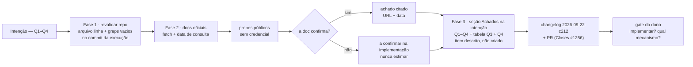

# Impl: C212 — Central de Conteúdos — viabilidade da varredura automática do Instagram (e da extração de mídia por link)

Status: executado (2026-09-22)
Atualizado em: 2026-09-22
Issue: #1256
Intenção: docs/plans/central-conteudos-varredura-instagram.md
Appetite restante: herdado — ~0,5–1 dia eng, **sem código**. Orçamento: Fase 1 (revalidar repo) ≈1–2 h · Fase 2 (docs oficiais + probes) ≈2–4 h · Fase 3 (redação + changelog + PR) ≈1–2 h.

## Leitura da intenção

- **Outcome:** as quatro perguntas (Q1–Q4) respondidas com evidência datada — repo (`arquivo:linha`) + docs oficiais (com data de consulta) — e uma recomendação de mecanismo, limites e cortes para a varredura do Instagram e a extração de mídia por link; os achados ficam **anexados à própria intenção** (seção de achados). Nada é implementado.
- **O que NÃO negociar:**
  - NUNCA scraping/contorno como mecanismo recomendado — nem como fonte de evidência; se só o scraping alcançar algo desejado, a recomendação é NÃO fazer e dizer o que se perde (intenção, guardrails).
  - Nada entra na Central sem curadoria (Rascunho → Publicado é regra do C211).
  - Sem PII; credencial nunca em log/doc; o token IG é admin-only no `SocialFeedSettings` (`src/globals/SocialFeedSettings.ts:63-66,138,147`).
  - Feed da home (S3) intocado: kill switch, snapshot, exclusão por item, cache 5 min, sem embed no load (`docs/plans/secao-conteudos-home-instagram.md:22,42,44,47,58,69,76`; `src/utilities/socialFeed/instagramFeedView.ts:96`).
  - Limite/expiração não confirmado na doc = **"a confirmar na implementação"** — nunca estimar.
  - Escopo de plataformas: Instagram (`@depjorgesolla`, Business/Creator) e YouTube (`@JorgeSollaDep`); demais redes fora.
- **O que reavaliar (hipóteses do codebase que a execução confirma ou corrige):**
  - As linhas citadas abaixo são do baseline do explorador (2026-09-22) e **podem ter deslocado**; a execução revalida cada fato e cita o commit verificado.
  - "`media_url` chega e é descartado" — verdadeiro no parse atual, mas o campo É pedido (`instagramFeed.ts:94-103`) e usado como thumbnail de IMAGE/carrossel; VIDEO/REEL usam `thumbnail_url` por design ("never the mp4", `:105-136`).
  - "Refresh não lê `expires_in`" — verdadeiro (`instagramFeed.ts:234-255`); a validade real é assunto de doc + runbook (`docs/ops/instagram-feed-token-runbook.md:26-29,43-44,60-62`), não de código.
  - "API do YouTube não dá arquivo" — verdadeiro para `search.list`/`videos.list` (`youtubeFeed.ts:168-188`); o que a doc permite para o próprio canal é confirmação da Fase 2.
  - As "Questões em aberto (produto)" da intenção são respondidas **na seção de Achados, sem reescrever o texto de produto** (achado complementa; o registro do pedido permanece).

## Abordagem recomendada

**Opções consideradas:** A) achados anexados à intenção (`docs/plans/central-conteudos-varredura-instagram.md`, seção "Achados"), com este impl plan documentando só o método e as decisões; B) documento novo em `docs/research/…`; C) comentário na Issue #1256.
**Recomendação:** A — é o que a intenção manda ("os achados ficam anexados a este plano"); o registro fica num dono só (o plano que o gate lê) e o diff é mínimo (intenção + changelog). Este impl plan não duplica os achados: fixa método, critérios de evidência e o contrato da seção.
**Rejeitadas:** B — twin de fonte (o achado viveria longe da pergunta que responde; dois lugares para manter, e a intenção diz "anexado a este plano"); C — o tracker acompanha, não é registro de evidência (mutável, fora do versionamento do repo).

### Decisões de engenharia

**A — Onde o entregável vive.**
Opções: A) seção "Achados (C212)" na intenção; B) `docs/research/central-conteudos-varredura-instagram-achados.md` novo; C) comentário na Issue #1256.
Recomendação: **A** — mandato literal da intenção ("Registro: os achados ficam anexados a este plano"), dono único do registro e leitura do gate no mesmo artefato da pergunta.
Rejeitadas: **B** porque cria fonte gêmea para um conteúdo que só existe para responder ao próprio plano; **C** porque Issue é acompanhamento (mutável, não versionado com o repo) e a evidência precisa ficar ao lado da pergunta.

**B — Método de evidência (o que conta como prova).**
Opções: A) revalidação read-only no repo (`arquivo:linha` + greps no commit) + docs oficiais fetched e datadas + probes públicos **sem credencial**; o que a doc não confirmar vira "a confirmar na implementação"; B) probe na Graph API real com o token de produção (somente leitura); C) scraping/perfil espelhado como evidência; D) estimar números de memória/blog/terceiros.
Recomendação: **A** — verificável, auditável, sem credencial e alinhada ao guardrail de não estimar; é a única que responde Q1–Q4 sem violar nada.
Rejeitadas: **B** porque o token vive só no global admin-only/produção (não há credencial no worktree dev) e usar credencial de produção numa investigação é inseguro (LGPD/segurança; a credencial nunca sai do global); **C** porque o mecanismo é proibido pelo item e não pode ser fonte de prova (ToS/reputacional); **D** porque estimativa viola o aceite ("nunca estimar") e um número errado contamina a decisão do gate.

**C — Forma da comparação da Q3.**
Opções: A) tabela de 3 mecanismos — (A) API oficial agendada/recebida · (B) scraping · (C) sem varredura/link manual — × entrega, curadoria, riscos (ToS/bloqueio/jurídico/reputacional/fragilidade operacional) e custo, com veredito por linha e uma seção "o que se perde" se só o scraping alcançar algo; B) prosa por mecanismo; C) matriz de score ponderado.
Recomendação: **A** — o aceite pede comparação explícita; a tabela expõe trade-offs lado a lado e força o veredito; "o que se perde" é obrigatório pelo guardrail.
Rejeitadas: **B** porque esconde a comparação que o gate pediu; **C** porque é falsa precisão (pesos cardinais sobre risco não quantificado viram estimativa disfarçada).

**D — Contrato da seção de Achados.**
Opções: A) Q1–Q4 explícitas + tabela campo-a-campo na Q1 + lista final "a confirmar na implementação" + Q4 com item de implementação **descrito, não criado**; B) relatório livre; C) só o que foi confirmado (gaps omitidos).
Recomendação: **A** — o aceite é por pergunta; a Q1 precisa do nível de campo (pedido × armazenado × descartado); gaps declarados são parte da resposta; a Q4 fecha com recomendação + limites + o que fica de fora + o item que nasceria dali.
Rejeitadas: **B** porque não permite checar cobertura das perguntas; **C** porque omitir o não confirmado é exatamente o que a intenção proíbe.

### Componentes / mudanças

- **Arquivos tocados (4):**
  - `docs/plans/central-conteudos-varredura-instagram.md` (editar): nova seção `## Achados (C212)` + `Status:` → `entregue (2026-09-22)`. Nada mais muda — Intenção, Aceite, Dados da decisão, Fora de escopo e Questões em aberto permanecem literais (achado **complementa**, não substitui; D).
  - `docs/plans/central-conteudos-varredura-instagram-impl.md` (novo): este plano, incluído no commit da entrega (pipeline).
  - `docs/changelog/2026-09-22-c212.md` (novo): entrada curta no formato dos precedentes (pipeline OPS44; o guard de CI exige adição, nunca edição de entrada existente).
  - `docs/plans/c211-followup-oembed-terceiro.md` (novo): plano curto do follow-up registrado na triage de débitos (Issue #1263, `depends: C211`) — o C211 está `in-progress` e o plano dele não pode ser editado.
- **Sem migration, sem schema, sem código:** nenhum arquivo de `src/`, `tests/`, `scripts/` ou config é tocado; nenhuma coleção/global/campo nasce (nem `expires_at` de token — se a recomendação precisar, o item de implementação descreve, não implementa).
- **Método (o "componente" real desta entrega):**
  - **Revalidação read-only** de cada fato, com `arquivo:linha` + commit; greps que precisam voltar vazios: `oembed` em `src/` (não há fetch por link — a cifra está em `docs/plans/central-conteudos-ingestao.md:75` e `docs/plans/c171-player-youtube-sem-signin-impl.md:86`) e `paging|cursors|429|rate.?limit` em `src/utilities/socialFeed/`.
  - **Baseline a revalidar (explorador, 2026-09-22):**
    - IG pede `id,caption,media_type,media_url,permalink,thumbnail_url,timestamp,children{media_url,thumbnail_url}` (`src/utilities/socialFeed/instagramFeed.ts:94-103`) e envia via URLSearchParams `fields/limit/access_token` (`:221-225`); `InstagramPost` (`:14-21`) guarda id/caption/mediaType/permalink/thumbnailUrl/timestamp; o parse (`:146-180`) descarta `media_url` — thumbnail de VIDEO/REEL usa `thumbnail_url` ("never the mp4", `:105-136`).
    - **Sem paginação:** nenhum `paging`/`cursors` no módulo; só `limit`, capado em `INSTAGRAM_MAX_RESULTS_CAP=50` (`:10,:221-225`); o sync busca `maxItems+10` (`src/utilities/socialFeed/instagramSync.ts:103-110`).
    - **Refresh só após falha**, uma vez, sem ler `expires_in` (`instagramFeed.ts:236-255`); token renovado é persistido (`:415-426`); segunda falha → `InstagramApiError` (`:227-229,244-246`), erro vira linguagem de produto (`:307-327`) e o caller cai no snapshot (`instagramFeedView.ts:80-93`).
    - **Sync:** snapshot `{username,posts}` sem `media_url` (`instagramSync.ts:113-117`); retry em `src/app/(frontend)/api/social-feed/sync/route.ts:39-46`; timeouts 10 s rota / 5 s hook (`instagramSync.ts:26,34`).
    - **Cache do board:** `unstable_cache(['instagram-feed'], {tags:['social-feed'], revalidate:300})` (`instagramFeedView.ts:96`) — cadência de board, não de acervo.
    - **YouTube:** `search.list part=snippet&type=video&order=date` (`src/utilities/socialFeed/youtubeFeed.ts:168-175`) + `videos.list part=statistics` (`:184-188`) + `liveStreamingDetails` (`:240`); `YouTubeVideo` = id/title/publishedAt/thumbnailUrl/viewCount (`:15-21`) — sem URL de arquivo; erros genéricos (quota/403 não distinguem, `:179,191`).
    - **Config:** `youtubeApiKey :91`, `youtubeChannelId :100`, `instagramAccessToken :138`, `instagramUserId :147`; kill switches `:72-119`; `read/update` admin-only `:63-66`; snapshots/status hidden `:216-235`; **sem campo de expiração de token**.
    - **Parsers existentes:** `parseYoutubeVideoId` (`src/lib/speechVod.ts:137-173`) e `youtubeThumbnailUrl` (`:180-181`); **nenhum parser de link IG**.
    - **Precedente de mídia:** `downloadSource` (`src/utilities/speech/speechMediaPipeline.ts:25-59`) + ffmpeg → `payload.create({collection:'media', filePath})` (`speechPosterJob.ts:125-145`, `speechCutJob.ts:71-84`); não há uploader genérico remote-URL→media.
    - **Precedente de agendamento C199:** `after()` de `next/server` (`src/utilities/recordings/recordingScheduler.ts:15-19`), single-flight condicional (`src/app/(campaign)/campanha/actions/recording.ts:79-94`), reap de stale (`recordingJob.ts:337-363`); não há cron/fila.
    - **Contratos vizinhos:** C211 (`docs/plans/central-conteudos-ingestao.md:63-68` tipos/estados/catalogação; `:49,:68` link; `:75,:80` transcrição reusa C199; `:76` coleção de upload nova entra no plugin S3); S3 (`docs/plans/secao-conteudos-home-instagram.md:22,42,44,47,58,69,76`; "token long-lived com refresh ~60 dias" é afirmação do plano-site, não verificada no código).
    - **Armadilha de acoplamento:** o sync do hook roda dentro da transação do save, segurando o row lock (`instagramSync.ts:28-34,59-79`), e `instagramFeed.ts` não pode importar `@payload-config` (gate de ciclos; `instagramFeedView.ts:44-48`) — a varredura de acervo **não pode reusar esse caminho como está** (acoplaria a cadência do acervo ao lock/token/global do board); o achado deve dizer isso explicitamente.
  - **Docs oficiais (fetch + data; o que extrair):**
    - Instagram Platform / Graph API — `https://developers.facebook.com/docs/instagram-platform`: campos de `GET /{ig-user-id}/media` (o que é `media_url` por tipo), paginação (`paging.cursors.after/before`), rate limits documentados, `refresh_access_token`/tempo de vida do long-lived token.
    - Instagram oEmbed — `https://developers.facebook.com/docs/instagram/oembed`: o que devolve (embed/thumbnail), exigência de token (app/client) e formas de URL.
    - Meta Platform Terms — `https://developers.facebook.com/terms`: coleta automatizada/uso de dados (base do risco de scraping e do que a API permite).
    - YouTube Data API v3 — `https://developers.google.com/youtube/v3/docs/videos` e `.../search`: partes disponíveis (`snippet`/`statistics`/`contentDetails`/`liveStreamingDetails`), ausência de URL de arquivo, quota (o número sai da doc datada ou vira "a confirmar").
    - YouTube oEmbed — `https://www.youtube.com/oembed` (probe público): resposta de vídeo público (título/thumbnail/embed).
    - YouTube Terms/Developer Policies — `https://developers.google.com/youtube/terms`: download/armazenamento/derivação permitidos e proibições de contorno.
    - **Formato de citação:** `<título da página> — <URL> (consultado em AAAA-MM-DD)` ao lado da afirmação; afirmação sem página = "a confirmar na implementação".
  - **Probes (somente leitura, sem credencial):** YouTube oEmbed em vídeo público (sem chave) — evidência datada da Q2/YT. IG oEmbed sem token: permitido só como probe público do próprio endpoint para datar a exigência de credencial (a resposta é a evidência). **Nenhum** probe na Graph API (Q1): sem credencial no worktree (token admin-only/prod) e com credencial de produção proibido (D-B). Scraping de página como "probe" = proibido.
  - **Redação da seção de Achados (contrato):**
    1. **Q1 — perfil próprio via Graph API:** tabela campo-a-campo (pedido em `instagramFeed.ts:94-103` × parseado/armazenado em `:14-21,:146-180` × descartado), paginação (ausente no repo × doc), rate limit (doc datada), refresh/validade (código `:236-255` × doc × runbook `:26-29,43-44,60-62`), periodicidade segura **limitada pela doc** (a cadência de board de 5 min não serve; proposta diária + "Sincronizar agora" se a doc folgar; senão "a confirmar") e as lacunas para catalogar/transcrever (o que falta para o arquivo sair do perfil próprio e chegar ao pipeline C199/C211).
    2. **Q2 — link IG/YT:** caminho oficial por plataforma — IG próprio = Graph API (`media_url` do próprio, confirmado na doc); IG de terceiro = oEmbed/embed + thumbnail, **arquivo nunca baixado**; sem caminho oficial = a peça circula pelo link e a assessoria anexa o arquivo (refina a regra do C211, sem ampliá-la); YT = Data API sem arquivo + oEmbed público (thumbnail/embed); lista do que NÃO é aceitável (scraping, contorno, download de terceiro/yt-dlp).
    3. **Q3 — comparação:** tabela A/B/C (D-C) com curadoria (tudo Rascunho; filtro por tipo/período como decisão de implementação; dedupe por id contra peças existentes), riscos (ToS Meta/YouTube datados, bloqueio de conta/IP, jurídico/reputacional, fragilidade) e custo operacional; recomendação nunca scraping; se só o scraping alcançar algo, o que se perde (ex.: stories, posts de terceiros, mídia fora da janela do `limit`/paginação).
    4. **Q4 — recomendação final:** mecanismo + limites + o que fica de fora + **item de implementação descrito, não criado** (nome, dependências C211/S3, e o que ele teria de decidir: agendador vs rota, estado, token/expiração, paginação, download+media, curadoria).
    5. **Fechamento:** lista única "a confirmar na implementação" (cada item dizendo o que exatamente verificar na API real, quando houver credencial e item aprovado) + "Questões em aberto" respondidas (validada/corrigida/a confirmar), sem reescrever o texto de produto.
- **UI:** Impeccable A — N/A sem UI; **nenhum dispatch de designer** (não há tela, shape ou craft).
- **Access / Consent:** N/A — nenhum write path, nenhuma coleção/Consent; a leitura de `SocialFeedSettings` é a mesma do admin e não é exercitada com credencial.

### Dados → forma (se aplicável)

- **N/A** — não há superfície de dados para usuário (a intenção já responde "não"). As tabelas dos Achados (Q1 campo-a-campo e a comparação da Q3) são suporte à decisão **no documento**, não UI: sem design system, paleta ou componente.

## Fases verificáveis

1. **Fase 1 — baseline revalidado (~1–2 h).** Re-rodar leitura/greps no commit do início da execução (`git rev-parse --short HEAD`); confirmar cada fato do baseline com `arquivo:linha`; registrar divergências (se houver, o achado usa o fato novo e diz o que mudou). Checkpoint: nenhuma afirmação de repo sem citação; `oembed` em `src/` = 0; `paging|cursors|429` em `src/utilities/socialFeed/` = 0.
2. **Fase 2 — docs oficiais datadas + probes (~2–4 h).** Abrir cada página da lista, datar e extrair exatamente as afirmações de Q1/Q2/Q3; rodar os probes públicos sem credencial e anexar a resposta datada; classificar todo número como "documentado (URL + data)" ou "a confirmar na implementação". Checkpoint: zero número estimado; toda lacuna nomeada.
3. **Fase 3 — redação + changelog + PR (~1–2 h).** Escrever a seção de Achados na intenção (contrato acima), `Status: entregue (2026-09-22)`; criar `docs/changelog/2026-09-22-c212.md`; `pnpm format` nos .md; push via `pnpm push`; abrir PR no GitHub base `main` com `Closes #1256` (o diff inclui `docs/changelog/`, então não é plans-only e o guard de fechamento não incide). Gates: `pnpm format`/`format:check` é o check que importa num diff docs-only; `lint/typecheck/unit/int/e2e` ficam no skip do `ci-scope` por não haver nada em `src/` nem em `tests/` — declarar o escopo docs-only no PR. Checkpoint: diff restrito aos quatro arquivos; `format:check` verde; as quatro perguntas com resposta explícita e a Q4 com o item descrito.

## Rabbit holes / Não escopo (engenharia)

- **"Investigar virou implementar".** Não criar coleção, global, campo (`expires_at`), rota, agendador, job, script, parser, uploader ou migration; nada em `src/`, `tests/`, `scripts/`. Implementação = item descrito na Q4, não criado.
- **"Scraping como atalho de evidência".** Nenhum crawler, login em conta, yt-dlp, mirror de perfil ou download de terceiro — nem para "só conferir". Evidência = repo + docs + probe público sem credencial.
- **"Abrir o board para reusar".** Não tocar no feed da home, no `SocialFeedSettings`, no snapshot, no cache de 5 min nem no picker de exclusão; a investigação não muda nenhum comportamento de produção (S3 intocado).
- **"Credencial no lugar errado".** Nenhum token/ID ecoado em doc, log, probe ou PR; exemplos só com placeholder. Não usar o token de produção (D-B).
- **"Cobrir tudo".** IG + YT da conta própria; sem TikTok/X/Facebook; sem alterar o escopo do C211 (o achado **refina** a regra de link, como o próprio C211 pede); S27/S28/C213 fora.
- **"Virar parecer jurídico".** Citar Meta Platform Terms e YouTube Terms datados como risco é o teto; não produzir análise jurídica nem prometer conformidade.
- **"Doc gêmeo".** Nada de `docs/research/…` novo nem comentário na Issue como registro (D-A).

## Riscos e mitigação

- **Doc oficial inacessível/muda entre a consulta e o gate:** citar URL + data; se a página exigir login ou estiver indisponível, declarar a tentativa e marcar "a confirmar na implementação" (nunca inventar o número). O item de implementação revalida na hora de usar.
- **Linhas deslocadas entre o baseline do explorador e a execução:** Fase 1 revalida e registra divergência; o achado cita o commit verificado.
- **Tentação do probe com token de produção:** proibido por política (credencial admin-only, LGPD); mitigado por D-B e pela regra de que nenhum achado da Q1 precisa do token para ser útil — a doc responde; o que não responder fica na lista de confirmação.
- **Conclusão não decisiva (doc omissa):** o aceite não exige que tudo se confirme; exige "a confirmar na implementação" honesto — o entregável segue completo com gaps nomeados.
- **Scope creep para C211/S3 durante a redação:** diff revisado contra o contrato (quatro arquivos; nenhuma mudança nas seções de produto da intenção).

## Débitos (capture-review-debts)

| ID  | Resumo                                                                                                                                                                                                                                                                               | Origem      | Score | Tipo de decisão | Destino                                                                                                                                                                                                         |
| --- | ------------------------------------------------------------------------------------------------------------------------------------------------------------------------------------------------------------------------------------------------------------------------------------ | ----------- | ----- | --------------- | --------------------------------------------------------------------------------------------------------------------------------------------------------------------------------------------------------------- |
| S1  | `mentions` × `mentioned_media` (leitura é `mentioned_media`); citações com linha deslocada; transcrição dos probes ausente; "rate limit folgado"; contradição do anexo de terceiro; URL truncada; "a confirmar" sem quando/fonte; repetição; inventário de arquivos; `src/`/`tests/` | simplify ×2 | —     | cheap_polish    | **já_resolvido** (aplicado no diff)                                                                                                                                                                             |
| D1  | Board IG nunca renova o token proativamente (refresh só pós-falha; sem `expires_in`/campo de validade)                                                                                                                                                                               | pesquisa    | 3     | defer_trigger   | **descartar deste lote** — pré-existente em `main`, fora do escopo; **gatilho:** primeira perda do feed IG em prod por token expirado (painel S11) **ou** abertura do item de implementação da Q4 (mesmo token) |
| D2  | oEmbed de terceiro proíbe persistir metadados/conteúdo — limite ausente no plano do C211                                                                                                                                                                                             | pesquisa    | 3     | cheap_polish    | **registrar** — Issue #1263 (`depends: C211`), plano `docs/plans/c211-followup-oembed-terceiro.md`                                                                                                              |
| D3  | Enum `REEL` do `media_type`, oEmbed de perfil com token, limites de webhook                                                                                                                                                                                                          | pesquisa    | —     | coberto         | **descartar (coberto)** — já na lista "A confirmar na implementação" da intenção                                                                                                                                |

- **Prazo (eleição 04/10):** fases timeboxed; se a Fase 2 estourar, corta-se profundidade (páginas secundárias), nunca evidência ou honestidade.

## Aceite de engenharia

- [ ] Aceite de produto da intenção ainda coberto — Q1–Q4 respondidas explicitamente com evidência datada (repo `arquivo:linha` + docs oficiais com data); achados anexados à intenção; Q4 com recomendação e item descrito (não criado); nenhum código.
- [ ] Invariantes AGENTS/engineering-standards — docs-only; sem schema/migration (`push: false` intocado); sem PII/Consent; sem credencial em doc/log; S3/feed da home intocado; C211 não alterado; dono único (achados na intenção, sem twin).
- [ ] Testes de domínio previstos (unit/int) onde access/write paths mudam — N/A (nenhum access/write path): verificação = Fase 1 (greps vazios + citações) e `pnpm format`; o PR declara o escopo docs-only e o `ci-scope` decide os skips.
- [ ] Changelog `docs/changelog/2026-09-22-c212.md` commitado (pipeline OPS44).

## Self-score (decision-quality)

1. Decisões caras com rejeitadas — **sim** (A onde vive; B método de evidência; C forma da Q3; D contrato dos achados).
2. Cabe no appetite (~0,5–1 dia) — **sim** (3 fases timeboxed, sem código).
3. Rabbit holes nomeados — **sim** (investigar→implementar; scraping; abrir o board; credencial; cobrir tudo; parecer jurídico; doc gêmeo).
4. Depth check: reusa donos existentes — **sim** (intenção como registro; precedentes citados C199/C211/S3/runbook/speechVod; nenhum módulo ou abstração nova).
5. Intenção permanece satisfeita — **sim** (outcome inviolável; nenhum escopo de C211/S3 mudado; guardrails de evidência explícitos).

**Score: 5/5.**
