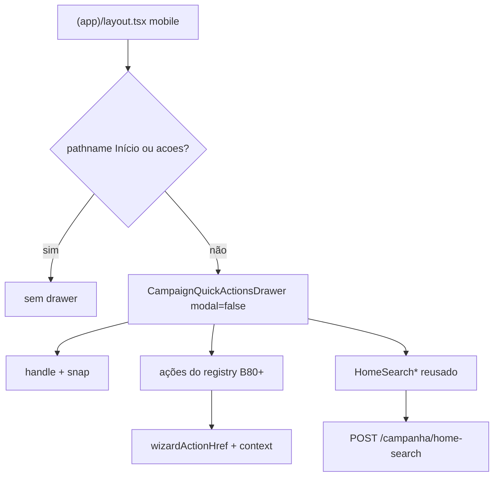

# Chassis do bottom drawer de ações rápidas + busca (mobile)

Status: rascunho
Atualizado em: 2026-07-30
Item do roadmap: [docs/roadmap.md](../roadmap.md) (Trilha B, item **B79** — UX-1 chrome pós-B73)
Impeccable: C — chrome novo em toda rota `(app)` exceto Início e wizards; gesto drag + busca embutida
Appetite: ~1,5–2 dias eng; shell não-modal + snap/drag + slot de ações + reuso da busca global; sem migration
Responsável: —

## Design (Impeccable)

Âncoras: `PRODUCT.md` (Clarity under pressure; Feel the action; anti spreadsheet) / `DESIGN.md` (hybrid mobile Mandate Red + sidebar Sheet) · tema `data-theme='campaign'` · primitivo `Drawer` (`src/components/ui/Drawer.tsx`, já com `modal={false}` que **não** monta overlay).

Na implementação (`implement-roadmap-item`): shape → craft → critique → polish.

Brief compacto:

- **Persona / contexto:** CG/assessor no celular, **fora** do Início — após **B73** a bottom nav some; o ritual de ação+busca só existia no Início; nas outras páginas sobra só o sidebar fechado.
- **Job principal:** ter ações rápidas do contexto da página + a mesma busca global do Início, sem escurecer nem bloquear a página atrás; poder recolher/expandir o drawer para ver mais conteúdo.
- **Estratégia de cor:** Restrained — superfície de chrome (fundo campaign), não modal dramático.
- **Edit where you see:** não neste item — launchers; escrita nos wizards/listas.
- **Anti-goals:** overlay que muda opacidade/`pointer-events` da página; segunda bottom nav de destinos de domínio; FAB flutuante; drawer no Início (já tem dock B65); drawer em `/campanha/acoes/*` (ritual B59/B75); reinventar busca (reusar B47+).

## Dados → decisão → apresentação

Dados: N/A — chrome de navegação/ação; hits da busca = providers B48+ já existentes.

## Contexto

Decisão de produto (2026-07-30): com a remoção da bottom nav (**B73**), a navegação mobile frequente fica no Início (ações + busca) e no sidebar (Sheet fechado por padrão, B38 ✓). Nas **demais** páginas falta um atalho de intenção. Solução: **bottom drawer** sempre montado no viewport &lt;`md` (desktop: fora — sidebar + chrome amplo bastam _(assumido)_), com:

1. Strip/catálogo de ações **contextualizadas** pela página atual (catálogos = **B80–B90**).
2. Barra de busca com o **mesmo escopo global** do Início (`POST /campanha/home-search`, providers B48–B55).
3. Gesto: arrastar para cima/baixo para expandir/recolher; tap na borda/handle superior também alterna.

O `Drawer` shadcn/base-ui já expõe `modal={false}` (não renderiza `DrawerOverlay`) e `snapPoints` — profundidade certa; não inventar segundo sheet.

## Objetivos

- Componente shell (ex. `CampaignQuickActionsDrawer`) montado no layout `(app)` **só** quando: viewport mobile, actor staff (ou leader nas rotas que o plano B89 pedir), pathname **não** é Início exato e **não** está sob `/campanha/acoes`.
- **Não-modal:** página atrás permanece 100% opaca, scrollável e interativa; o drawer **ocupa** faixa inferior (layout shift / padding do scroll) em vez de cobrir com scrim.
- Snap points mínimos: **collapsed** (handle + talvez 1 linha de peek) e **expanded** (ações + busca); drag e tap no handle/borda superior alternam. Persistência de snap na sessão _(recomendado: `sessionStorage`)_ — Adiado se estourar appetite.
- Slot `actions` (lista já resolvida com `href`s) + slot/região de busca reusando `CampaignHomeSearch` / `HomeSearchContext` / results shell — extrair o necessário para não acoplar ao `CampaignHomeLayout`.
- Contrato de contexto client-safe (ex. `CampaignQuickActionContext`: `municipalitySlug?`, `leadershipId?`, …) + helper que resolve `href` via `wizardActionHref` / atalhos de lista — **B80+** só preenchem o contexto e o catálogo.
- Ajuste de padding do `campaign-content-scroll` para a altura do peek (substitui o antigo `pb-24` da bottom nav após B73).
- Guardrails: sem migration, sem collection, sem Consent, sem server action nova de escrita; leader lockdown respeitado (sem omnibox estadual no drawer staff).

## Decisões travadas

- **Drawer não-modal (`modal={false}`), nunca scrim.** Pedido explícito 2026-07-30: não mudar opacidade/visibilidade/interatividade da página. **Rejeitado:** `modal={true}` (padrão do kit); Sheet full-screen; dim `bg-black/10`.
- **Fora do Início e fora de `/acoes/*`.** Início já tem dock; wizard tem chrome próprio (B75). **Rejeitado:** unificar Início no mesmo drawer (dois docks); drawer dentro do wizard.
- **Só mobile (&lt;`md`).** Desktop/tablet mantêm sidebar + busca do Início quando o usuário volta. **Rejeitado:** drawer em `md+` (ruído; compete com sidebar).
- **Catálogo por página = itens B80–B90**, não hardcode no chassis. O chassis só renderiza o que a rota fornece (via registry pathname→provider ou prop do layout segment). **Rejeitado:** um único catálogo global idêntico ao Início em toda rota (perde o prefill).
- **Busca = mesmo contrato do Início** (`home-search`, debounce, modo focado **dentro do drawer expandido**). **Rejeitado:** segunda API; command palette desktop neste item.
- **i18n:** ids `CampaignQuickActionsDrawer`, `quickActionContext`, `snap`; copy pt-BR (“Buscar na campanha”, aria do handle “Mostrar ações rápidas” / “Ocultar…”).

## Questões em aberto

- **Mount: layout `(app)` com registry vs. slot por `layout.tsx` de cada área?** **Opções:** A) registry central pathname→catalog no `(app)/layout` | B) cada área exporta `quickActions` via parallel route/slot. **Recomendação:** **A** — um mount, B80+ só registram; B se o registry virar switch gigante. _(assumido)_
- **Peek inicial: collapsed ou expanded?** **Opções:** A) collapsed (mais conteúdo) | B) expanded (ações à mão). **Recomendação:** **A** no 1º paint; expandir no tap/drag — campo precisa ver a lista. _(assumido — critique com device)_
- **Leader: drawer só em Contatos (B89) ou também se navegar a outras rotas?** **Opções:** A) só rotas leader | B) esconder sempre fora de Contatos. **Recomendação:** **A** — `getCampaignNav` leader já é mínimo.

## Abordagem proposta

Componentes:

- **`CampaignQuickActionsDrawer`** (`src/components/campaign/shell/`): `Drawer` `modal={false}` + `snapPoints` + `showSwipeHandle`; região de ações (reuso visual de `CampaignHomeActionStrip` / botões B44 se couberem no peek) + busca.
- **`campaignQuickActionRegistry` / `resolveQuickActionsForPath`** (`src/lib/` client-safe): pathname + role + context → `ResolvedCampaignHomeAction[]` (ou tipo irmão). Contextos ricos entram pelos planos B80+.
- **Extrair busca do acoplamento ao Início** o mínimo necessário (`HomeSearchProvider` montável fora de `CampaignHomeStaffChrome`) — depth check: não duplicar debounce/contrato.
- **`(app)/layout.tsx`**: mount condicional; padding inferior do scroll = altura do peek.
- **Migration:** Sem migration, sem collection, sem server action de escrita.

## Dependências

- Dura: **B73** (remover bottom nav — senão dois chromes inferiores). Soft: **B47 ✓**/B48+ (busca); **B45 ✓**/B44 ✓ (strip/botão); **B60 ✓** (`wizardActionHref` + `?municipio=`).
- Desbloqueia **B80–B90**.

## Não escopo

- Catálogos e prefills por vertical → **B80–B90**.
- Novos wizards / novas actions de escrita.
- Desktop omnibox global.
- Quadro: **fora do inventário** (decisão de produto 2026-07-30).

## Rabbit holes

- **State machine de snap sincronizada com teclado virtual / visualViewport.** **Mitigação:** v1 = CSS snap + padding fixo; medir iOS no craft; Adiado com gatilho se o teclado cobrir a busca.
- **Reimplementar Drawer do zero.** **Mitigação:** `modal={false}` + snapPoints do kit.
- **Levantar strip do Início para shared sem medir bundle.** **Mitigação:** reusar botão; extrair strip só se o JSX divergir &lt;~20 linhas.

## Adiado com gatilho

- **Persistir snap expanded/collapsed entre navegações.** Revisitar se o CG reclamar de reabrir o drawer a cada rota.
- **Peek com 1–2 ações favoritas sem expandir.** Revisitar após 1 semana de uso do collapsed-only.

## Referências

- `docs/roadmap.md` (UX-1, B73, B79–B90)
- `src/components/ui/Drawer.tsx` — `modal={false}` sem overlay
- `src/lib/campaignActionRoutes.ts` — `wizardActionHref`
- `src/lib/campaignHomeActions.ts` + `CampaignHomeActionStrip` / `CampaignHomeSearch`
- `src/app/(campaign)/campanha/(app)/layout.tsx` — scroll + chrome
- [remover-bottom-nav-mobile.md](remover-bottom-nav-mobile.md) · [fluxos-acao-primeiro-inicio.md](fluxos-acao-primeiro-inicio.md)
- `PRODUCT.md` / `DESIGN.md` — Field Desk mobile
