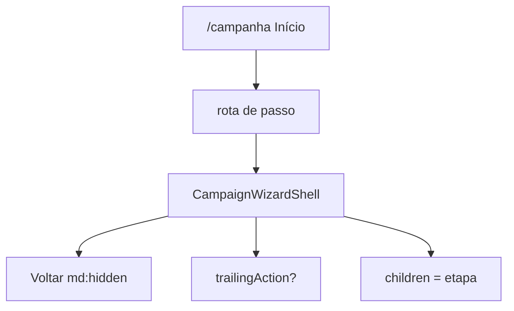

# Chassis do wizard de campanha (shell + voltar)

Status: rascunho
Atualizado em: 2026-07-29
Item do roadmap: [docs/roadmap.md](../roadmap.md) (Trilha B, item B59 — UX-1 wizards)
Impeccable: C — UI nova (shell de fluxo multi-passo sob `/campanha`)
Appetite: ~0,75 dia eng; layout de passo + header mobile + slot de conteúdo; sem migration
Responsável: —

## Design (Impeccable)

Âncoras: `PRODUCT.md` (Clarity under pressure; Feel the action; anti spreadsheet) / `DESIGN.md` · tema `data-theme='campaign'` · shells `CampaignPageShell` onde couber.

Na implementação (`implement-roadmap-item`): shape → craft → critique → polish.

Brief compacto:

- **Persona / contexto:** CG/assessor no celular entre Zaps; um passo por vez, sem chrome de lista.
- **Job principal:** enquadrar qualquer etapa de wizard (busca, votos, sinal…) com volta óbvia no mobile e conteúdo focável.
- **Estratégia de cor:** Restrained.
- **Edit where you see:** não — fluxo linear; escrita nas etapas filhas.
- **Anti-goals:** sidebar/nav do app competindo com o passo; seta “voltar” no desktop (lá é browser); segundo design system de wizard.

## Dados → decisão → apresentação

Dados: N/A — chrome de navegação; conteúdo numérico/textual nas etapas B60–B63.

## Contexto

Chassis UX-1 do Início (**B43–B47** ✓) deixa ações inertes até existir **wizard**. O rascunho [fluxos-acao-primeiro-inicio.md](fluxos-acao-primeiro-inicio.md) pede “uma coluna / um passo visível” e interrupção recuperável. Pedido de produto (2026-07-29): **em mobile**, seta de retorno no topo esquerdo de toda etapa; **em desktop/tablet**, expectativa = botão voltar do browser (sem duplicar chrome).

Este item é o **frame** compartilhado — não a busca, nem o ajuste de votos, nem o sinal.

## Objetivos

- Componente shell (nome final no PR, ex. `CampaignWizardShell`) com: título/pergunta do passo, slot `children`, slot opcional de ação no topo direito (ex. “Pular…” do B63), **back control só em viewport mobile** (`md:hidden` ou equivalente) que navega ao passo anterior / Início conforme o fluxo.
- Desktop: sem seta; documentar que `history.back` / rota anterior cobre o gesto.
- Layout: uma coluna; conteúdo alinhado ao bottom em mobile quando a etapa pedir (B63 tipifica), top em `md+` — o shell expõe um prop de alinhamento (`contentAlign: 'start' | 'end'`) sem hardcodar o grid de sinais.
- Rotas sob `/campanha/…` (recomendação UX-1 travada: rota, não Sheet — sobrevive a refresh/Zap). Este item define o layout e o header; as rotas concretas nascem com B60/B61/B63 ou com o wiring A1.
- Sem migration / Consent / action de escrita.
- a11y: seta com nome acessível contendo o verbo visível (“Voltar”); foco gerenciado ao trocar de passo (mínimo: foco no heading do passo).

## Decisões travadas

- **Voltar mobile = chrome do wizard; desktop = browser.** **Rejeitado:** seta também em `md+` (ruído; duplica gesto nativo); só `Link` “Cancelar” no rodapé (longe do polegar no topo).
- **Wizard = rota**, não Drawer sobre o Início. **Rejeitado:** Sheet full-screen (refresh/Zap perde contexto; URL não compartilha passo). Fonte: gate UX-1 2026-07-29 + rascunho.
- **Shell não grava estado de domínio** — só navegação/chrome. Estado de município/votos/sinal fica nas etapas ou num store mínimo do fluxo (Adiado com gatilho se 3º wizard pedir).
- **i18n:** ids em inglês (`WizardShell`, `onBack`, `trailingAction`); copy pt-BR.

## Questões em aberto

- **Path canônico (`/campanha/acoes/…` vs `/campanha/wizards/…`)?** **Opções:** A `acoes` | B `wizards`. **Recomendação:** A — linguagem de mesa (“ação”), alinhada ao catálogo B45. _(assumido — validar no 1º wizard que montar rota)_

## Abordagem proposta

Componentes:

- **`CampaignWizardShell`** em `src/components/campaign/shared/` (ou `shell/`): header + main; reusa tokens/`Button` ghost para a seta (`ArrowLeft`).
- **Hook/helper de passo** (opcional neste item): `useWizardBack({ previousHref })` — se &lt;2 call sites, inline no shell.
- **Migration:** Sem migration, sem collection, sem server action.

## Dependências

- Dura: **B45** ✓ (ações existem; wizards ainda inertes). Soft: B46 ✓ (thumb zone — alinhamento de conteúdo).
- Desbloqueia **B60**, **B61**, **B63**.

## Não escopo

- Busca de município → **B60**. Ajuste de votos → **B61**. Modelo/UI de sinal → **B62**/ **B63**.
- Resumo final + CTA “Registrar atualização” do A1 → wiring do wizard A1 (após estas etapas).
- Rascunho persistente cross-session → Adiado.

## Rabbit holes

- **State machine genérica de wizard (XState / multi-route orchestrator).** **Mitigação:** shell burro + hrefs/query de passo por fluxo; extrair só no 3º wizard.
- **App chrome (`CampaignSidebar`) dentro do wizard.** **Mitigação:** layout de `(app)` pode permanecer; visualmente o conteúdo é full-bleed de passo — não inventar segundo layout group sem medição.

## Adiado com gatilho

- **Persistência de rascunho (município + ação) ao reabrir.** Revisitar quando a 1ª sessão real for interrompida por Zap e o CG reclamar (UX-1 § contrato #8).

## Referências

- [fluxos-acao-primeiro-inicio.md](fluxos-acao-primeiro-inicio.md) · [catalogo-acoes-inicio-por-persona.md](catalogo-acoes-inicio-por-persona.md) · `CampaignPageShell` · `PRODUCT.md` Clarity under pressure
- AGENTS.md — naming; campanha auth; sem Consent novo
- `PRODUCT.md` / `DESIGN.md` — Field Desk / tokens campaign
